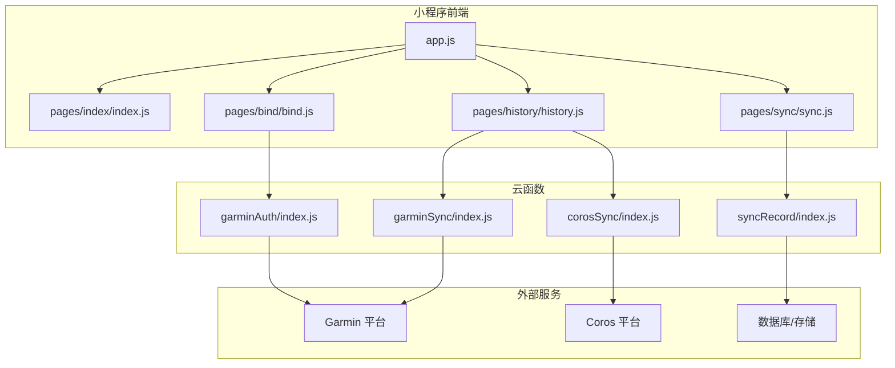
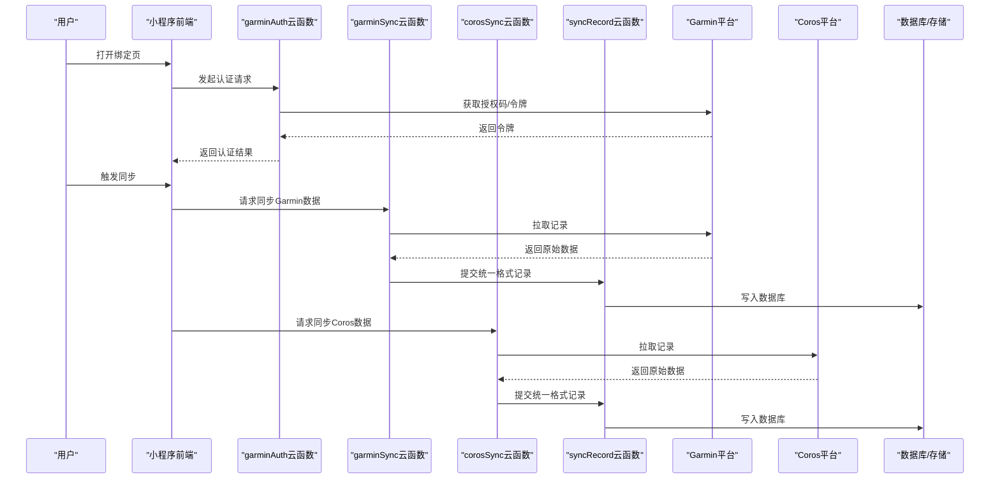
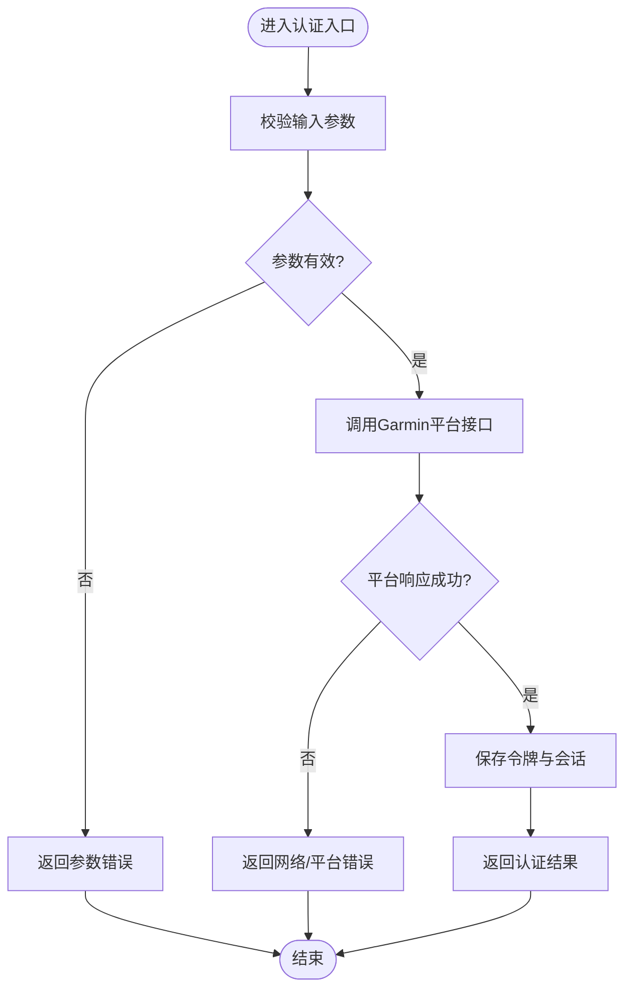
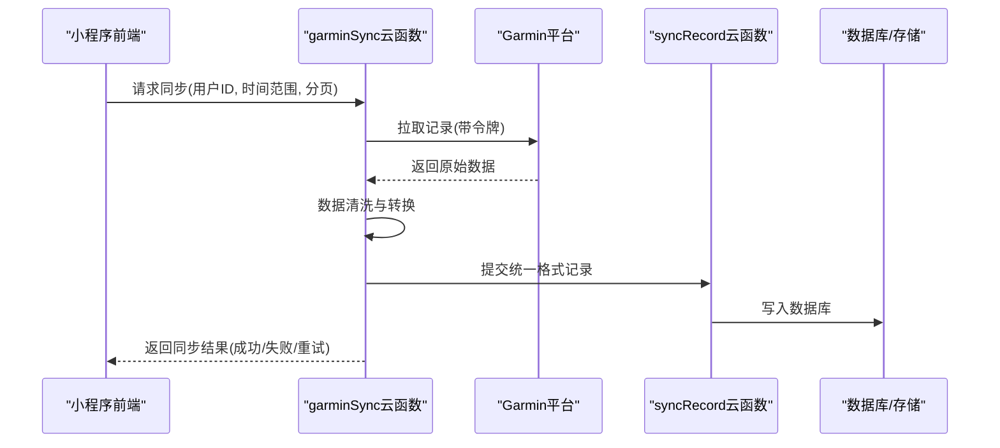
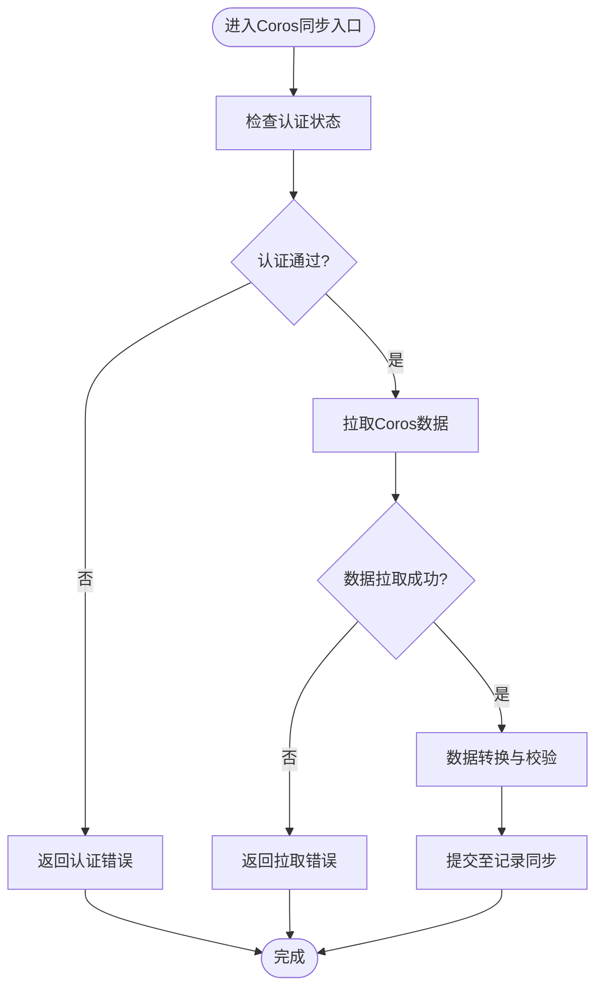
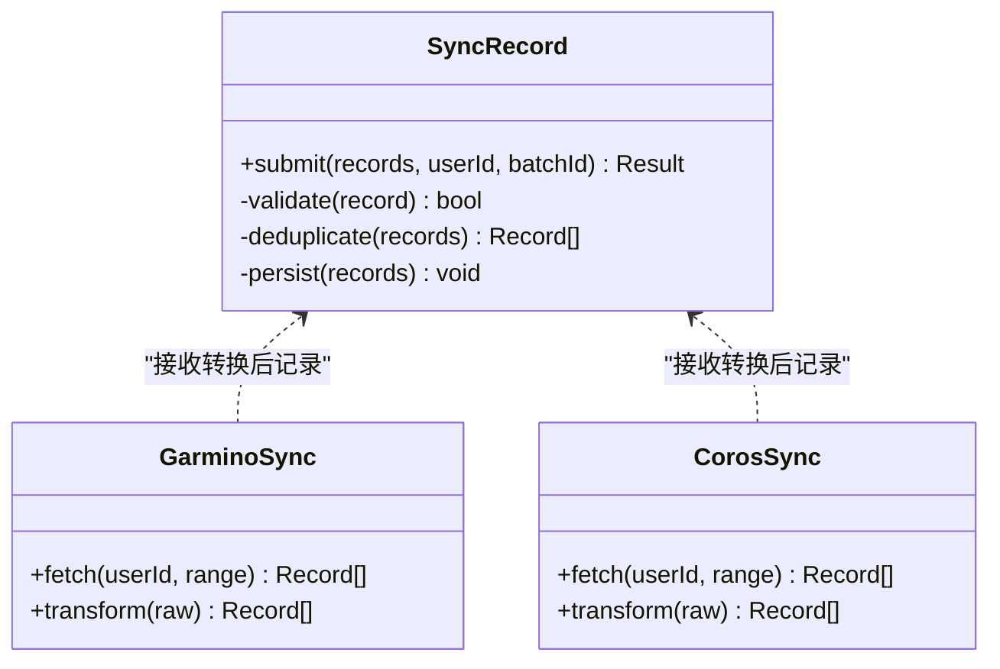
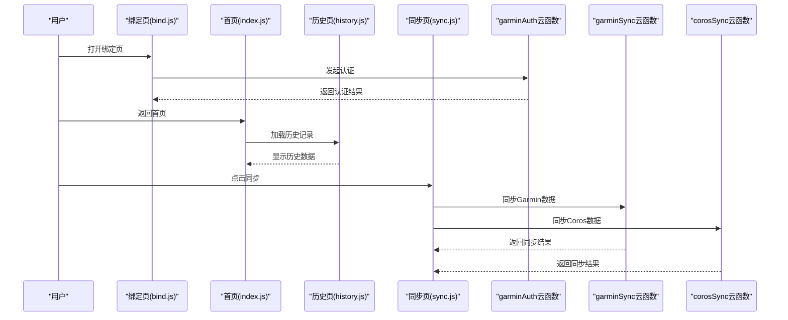
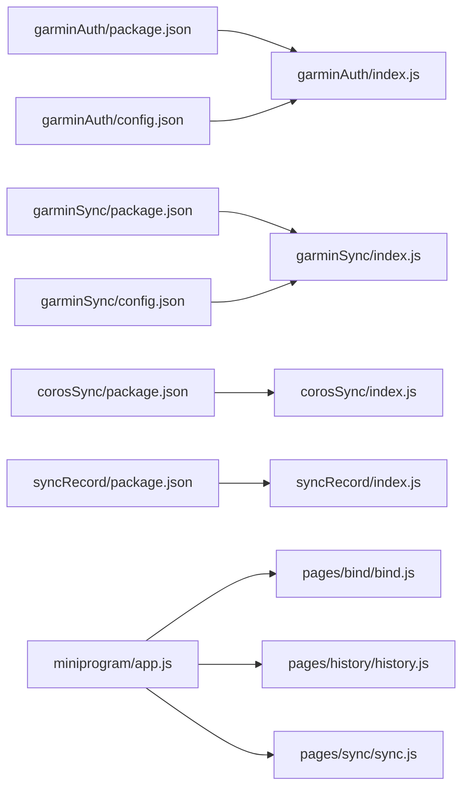

# API参考

<cite>
**本文引用的文件**   
- [cloudfunctions/corosSync/index.js](file://cloudfunctions/corosSync/index.js)
- [cloudfunctions/corosSync/package.json](file://cloudfunctions/corosSync/package.json)
- [cloudfunctions/garminAuth/config.json](file://cloudfunctions/garminAuth/config.json)
- [cloudfunctions/garminAuth/index.js](file://cloudfunctions/garminAuth/index.js)
- [cloudfunctions/garminAuth/package.json](file://cloudfunctions/garminAuth/package.json)
- [cloudfunctions/garminSync/config.json](file://cloudfunctions/garminSync/config.json)
- [cloudfunctions/garminSync/index.js](file://cloudfunctions/garminSync/index.js)
- [cloudfunctions/garminSync/package.json](file://cloudfunctions/garminSync/package.json)
- [cloudfunctions/syncRecord/index.js](file://cloudfunctions/syncRecord/index.js)
- [cloudfunctions/syncRecord/package.json](file://cloudfunctions/syncRecord/package.json)
- [miniprogram/pages/bind/bind.js](file://miniprogram/pages/bind/bind.js)
- [miniprogram/pages/history/history.js](file://miniprogram/pages/history/history.js)
- [miniprogram/pages/index/index.js](file://miniprogram/pages/index/index.js)
- [miniprogram/pages/sync/sync.js](file://miniprogram/pages/sync/sync.js)
- [miniprogram/app.js](file://miniprogram/app.js)
- [miniprogram/app.json](file://miniprogram/app.json)
- [README.md](file://README.md)
</cite>

## 目录
1. [简介](#简介)
2. [项目结构](#项目结构)
3. [核心组件](#核心组件)
4. [架构总览](#架构总览)
5. [详细组件分析](#详细组件分析)
6. [依赖分析](#依赖分析)
7. [性能考虑](#性能考虑)
8. [故障排查指南](#故障排查指南)
9. [结论](#结论)
10. [附录](#附录)

## 简介
本文件为微信小程序云函数项目的API参考文档，覆盖RESTful接口与WebSocket实时交互的规范、请求/响应模式、认证与安全、错误处理、速率限制、版本策略、常见用例、客户端实现指南、性能优化技巧以及调试与监控方法。本项目包含多个云函数：Garmin认证、Garmin数据同步、Coros数据同步、记录同步等，前端小程序通过调用这些云函数完成用户绑定、数据拉取与同步等操作。

## 项目结构
- cloudfunctions：云函数集合，按功能划分目录（如 garminAuth、garminSync、corosSync、syncRecord），每个云函数包含入口 index.js 与依赖 package.json，部分含配置 config.json。
- miniprogram：小程序前端页面与逻辑，包含首页、绑定页、历史页、同步页等，以及应用入口 app.js 和路由配置 app.json。
- dailysync-ref：参考工程，提供定时任务与工作流示例，非运行时必需。
- README.md：项目说明与使用说明。

**图表来源** 
- [miniprogram/app.js](file://miniprogram/app.js)
- [miniprogram/pages/index/index.js](file://miniprogram/pages/index/index.js)
- [miniprogram/pages/bind/bind.js](file://miniprogram/pages/bind/bind.js)
- [miniprogram/pages/history/history.js](file://miniprogram/pages/history/history.js)
- [miniprogram/pages/sync/sync.js](file://miniprogram/pages/sync/sync.js)
- [cloudfunctions/garminAuth/index.js](file://cloudfunctions/garminAuth/index.js)
- [cloudfunctions/garminSync/index.js](file://cloudfunctions/garminSync/index.js)
- [cloudfunctions/corosSync/index.js](file://cloudfunctions/corosSync/index.js)
- [cloudfunctions/syncRecord/index.js](file://cloudfunctions/syncRecord/index.js)

**章节来源**
- [README.md](file://README.md)
- [miniprogram/app.json](file://miniprogram/app.json)

## 核心组件
- 云函数网关与路由：每个云函数作为独立HTTP端点，由微信云托管或云开发平台统一路由到对应 index.js 入口。
- Garmin认证：负责获取并刷新访问令牌，维护会话状态，返回授权结果给前端。
- Garmin同步：基于认证令牌拉取运动记录，进行数据转换与入库。
- Coros同步：对接Coros平台，拉取数据并转换为统一格式。
- 记录同步：将不同来源的数据统一写入数据库或对象存储，供查询与展示。

**章节来源**
- [cloudfunctions/garminAuth/index.js](file://cloudfunctions/garminAuth/index.js)
- [cloudfunctions/garminAuth/config.json](file://cloudfunctions/garminAuth/config.json)
- [cloudfunctions/garminSync/index.js](file://cloudfunctions/garminSync/index.js)
- [cloudfunctions/garminSync/config.json](file://cloudfunctions/garminSync/config.json)
- [cloudfunctions/corosSync/index.js](file://cloudfunctions/corosSync/index.js)
- [cloudfunctions/syncRecord/index.js](file://cloudfunctions/syncRecord/index.js)

## 架构总览
小程序通过云函数调用完成认证与数据同步流程。认证阶段由Garmin认证云函数处理；同步阶段由Garmin/Coros同步云函数分别对接各自平台；最终由记录同步云函数统一落库。

**图表来源** 
- [miniprogram/pages/bind/bind.js](file://miniprogram/pages/bind/bind.js)
- [miniprogram/pages/history/history.js](file://miniprogram/pages/history/history.js)
- [miniprogram/pages/sync/sync.js](file://miniprogram/pages/sync/sync.js)
- [cloudfunctions/garminAuth/index.js](file://cloudfunctions/garminAuth/index.js)
- [cloudfunctions/garminSync/index.js](file://cloudfunctions/garminSync/index.js)
- [cloudfunctions/corosSync/index.js](file://cloudfunctions/corosSync/index.js)
- [cloudfunctions/syncRecord/index.js](file://cloudfunctions/syncRecord/index.js)

## 详细组件分析

### Garmin认证云函数（garminAuth）
- 职责：处理用户授权、获取访问令牌、刷新令牌、管理会话。
- 输入参数：用户标识、授权码或回调信息、可选刷新令牌。
- 输出结果：令牌、过期时间、状态码与消息。
- 安全要点：敏感配置从config.json读取，避免硬编码；使用HTTPS传输；对令牌进行加密存储。
- 错误处理：网络异常、授权失败、令牌过期等情况返回标准错误码与提示。

**图表来源** 
- [cloudfunctions/garminAuth/index.js](file://cloudfunctions/garminAuth/index.js)
- [cloudfunctions/garminAuth/config.json](file://cloudfunctions/garminAuth/config.json)

**章节来源**
- [cloudfunctions/garminAuth/index.js](file://cloudfunctions/garminAuth/index.js)
- [cloudfunctions/garminAuth/config.json](file://cloudfunctions/garminAuth/config.json)

### Garmin同步云函数（garminSync）
- 职责：基于认证令牌拉取运动记录，进行数据清洗与转换，提交至记录同步云函数。
- 输入参数：用户标识、时间范围、分页参数。
- 输出结果：同步统计、失败列表、重试建议。
- 性能优化：分页拉取、并发控制、去重策略、增量更新。
- 错误处理：平台限流、数据缺失、字段映射失败时记录日志并返回可重试状态。

**图表来源** 
- [cloudfunctions/garminSync/index.js](file://cloudfunctions/garminSync/index.js)
- [cloudfunctions/syncRecord/index.js](file://cloudfunctions/syncRecord/index.js)

**章节来源**
- [cloudfunctions/garminSync/index.js](file://cloudfunctions/garminSync/index.js)
- [cloudfunctions/syncRecord/index.js](file://cloudfunctions/syncRecord/index.js)

### Coros同步云函数（corosSync）
- 职责：对接Coros平台，拉取数据并进行统一格式转换。
- 输入参数：用户标识、时间范围、分页参数。
- 输出结果：同步统计、失败列表、重试建议。
- 错误处理：平台限流、认证失败、数据不一致时返回明确错误码。

**图表来源** 
- [cloudfunctions/corosSync/index.js](file://cloudfunctions/corosSync/index.js)

**章节来源**
- [cloudfunctions/corosSync/index.js](file://cloudfunctions/corosSync/index.js)

### 记录同步云函数（syncRecord）
- 职责：接收来自各同步云函数的统一格式记录，进行去重、校验与持久化。
- 输入参数：统一格式的记录数组、用户标识、批次号。
- 输出结果：写入统计、冲突处理结果、错误明细。
- 错误处理：重复记录、字段缺失、类型不匹配时返回具体错误位置与建议修复。

**图表来源** 
- [cloudfunctions/syncRecord/index.js](file://cloudfunctions/syncRecord/index.js)
- [cloudfunctions/garminSync/index.js](file://cloudfunctions/garminSync/index.js)
- [cloudfunctions/corosSync/index.js](file://cloudfunctions/corosSync/index.js)

**章节来源**
- [cloudfunctions/syncRecord/index.js](file://cloudfunctions/syncRecord/index.js)

### 小程序前端集成
- 绑定页：调用garminAuth云函数完成用户绑定与授权。
- 历史页：调用记录同步云函数或相关查询接口获取历史数据。
- 同步页：触发garminSync与corosSync云函数执行数据同步。
- 应用入口：初始化云环境、设置全局配置与错误处理。

**图表来源** 
- [miniprogram/pages/bind/bind.js](file://miniprogram/pages/bind/bind.js)
- [miniprogram/pages/index/index.js](file://miniprogram/pages/index/index.js)
- [miniprogram/pages/history/history.js](file://miniprogram/pages/history/history.js)
- [miniprogram/pages/sync/sync.js](file://miniprogram/pages/sync/sync.js)

**章节来源**
- [miniprogram/pages/bind/bind.js](file://miniprogram/pages/bind/bind.js)
- [miniprogram/pages/history/history.js](file://miniprogram/pages/history/history.js)
- [miniprogram/pages/index/index.js](file://miniprogram/pages/index/index.js)
- [miniprogram/pages/sync/sync.js](file://miniprogram/pages/sync/sync.js)
- [miniprogram/app.js](file://miniprogram/app.js)

## 依赖分析
- 云函数依赖：各云函数通过package.json声明依赖，确保运行环境与第三方库版本稳定。
- 配置依赖：garminAuth与garminSync通过config.json管理平台密钥与端点，避免硬编码。
- 前端依赖：小程序页面通过app.js初始化云环境，页面js调用云函数SDK。

**图表来源** 
- [cloudfunctions/garminAuth/package.json](file://cloudfunctions/garminAuth/package.json)
- [cloudfunctions/garminSync/package.json](file://cloudfunctions/garminSync/package.json)
- [cloudfunctions/corosSync/package.json](file://cloudfunctions/corosSync/package.json)
- [cloudfunctions/syncRecord/package.json](file://cloudfunctions/syncRecord/package.json)
- [cloudfunctions/garminAuth/config.json](file://cloudfunctions/garminAuth/config.json)
- [cloudfunctions/garminSync/config.json](file://cloudfunctions/garminSync/config.json)
- [miniprogram/app.js](file://miniprogram/app.js)
- [miniprogram/pages/bind/bind.js](file://miniprogram/pages/bind/bind.js)
- [miniprogram/pages/history/history.js](file://miniprogram/pages/history/history.js)
- [miniprogram/pages/sync/sync.js](file://miniprogram/pages/sync/sync.js)

**章节来源**
- [cloudfunctions/garminAuth/package.json](file://cloudfunctions/garminAuth/package.json)
- [cloudfunctions/garminSync/package.json](file://cloudfunctions/garminSync/package.json)
- [cloudfunctions/corosSync/package.json](file://cloudfunctions/corosSync/package.json)
- [cloudfunctions/syncRecord/package.json](file://cloudfunctions/syncRecord/package.json)
- [cloudfunctions/garminAuth/config.json](file://cloudfunctions/garminAuth/config.json)
- [cloudfunctions/garminSync/config.json](file://cloudfunctions/garminSync/config.json)
- [miniprogram/app.js](file://miniprogram/app.js)

## 性能考虑
- 分页与增量：同步接口支持分页与时间范围过滤，减少单次请求数据量。
- 并发与限流：对平台接口调用进行并发控制与重试退避，避免触发限流。
- 缓存与会话：认证令牌缓存与复用，减少重复认证开销。
- 数据去重：记录同步阶段进行去重与冲突解决，降低重复写入成本。
- 资源隔离：每个云函数独立部署，避免相互影响。

[本节为通用指导，无需特定文件引用]

## 故障排查指南
- 认证失败：检查config.json中的密钥与端点是否正确；确认用户授权流程是否完整。
- 同步超时：查看平台响应时间与限流策略；增加重试与退避机制。
- 数据不一致：核对字段映射与类型转换；检查去重与冲突处理逻辑。
- 前端错误：在小程序开发者工具中查看控制台日志与网络请求；确认云函数返回码与消息。

**章节来源**
- [cloudfunctions/garminAuth/index.js](file://cloudfunctions/garminAuth/index.js)
- [cloudfunctions/garminSync/index.js](file://cloudfunctions/garminSync/index.js)
- [cloudfunctions/corosSync/index.js](file://cloudfunctions/corosSync/index.js)
- [cloudfunctions/syncRecord/index.js](file://cloudfunctions/syncRecord/index.js)
- [miniprogram/pages/bind/bind.js](file://miniprogram/pages/bind/bind.js)
- [miniprogram/pages/history/history.js](file://miniprogram/pages/history/history.js)
- [miniprogram/pages/sync/sync.js](file://miniprogram/pages/sync/sync.js)

## 结论
本项目通过模块化云函数设计实现了Garmin与Coros数据的认证与同步，前端小程序提供用户交互界面。整体架构清晰、职责分离，便于扩展与维护。建议在后续迭代中完善错误码规范、增强监控与日志采集，并持续优化性能与安全性。

[本节为总结性内容，无需特定文件引用]

## 附录
- 协议与版本：所有云函数接口遵循RESTful风格，版本号可通过URL路径或请求头传递。
- 安全建议：强制HTTPS、最小权限原则、敏感配置外置、定期轮换令牌。
- 调试工具：使用微信开发者工具的网络面板与云函数日志；结合平台侧API调试工具验证数据一致性。
- 监控方法：接入云监控与日志服务，设置关键指标告警（成功率、延迟、错误率）。

[本节为通用指导，无需特定文件引用]