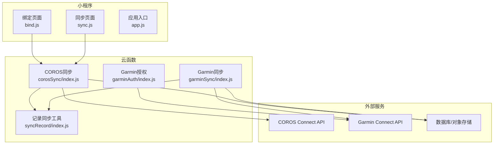
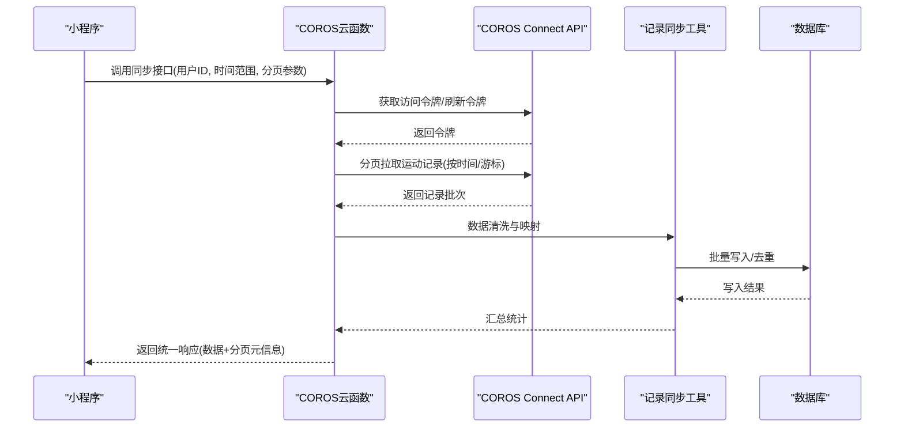
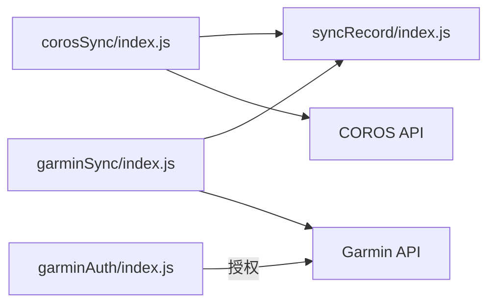

# COROS数据同步API

<cite>
**本文档引用的文件**   
- [cloudfunctions/corosSync/index.js](file://cloudfunctions/corosSync/index.js)
- [cloudfunctions/corosSync/package.json](file://cloudfunctions/corosSync/package.json)
- [cloudfunctions/garminAuth/index.js](file://cloudfunctions/garminAuth/index.js)
- [cloudfunctions/garminAuth/config.json](file://cloudfunctions/garminAuth/config.json)
- [cloudfunctions/garminSync/index.js](file://cloudfunctions/garminSync/index.js)
- [cloudfunctions/garminSync/config.json](file://cloudfunctions/garminSync/config.json)
- [cloudfunctions/syncRecord/index.js](file://cloudfunctions/syncRecord/index.js)
- [miniprogram/pages/bind/bind.js](file://miniprogram/pages/bind/bind.js)
- [miniprogram/pages/sync/sync.js](file://miniprogram/pages/sync/sync.js)
- [miniprogram/app.js](file://miniprogram/app.js)
</cite>

## 目录
1. [简介](#简介)
2. [项目结构](#项目结构)
3. [核心组件](#核心组件)
4. [架构总览](#架构总览)
5. [详细组件分析](#详细组件分析)
6. [依赖关系分析](#依赖关系分析)
7. [性能考虑](#性能考虑)
8. [故障排查指南](#故障排查指南)
9. [结论](#结论)
10. [附录](#附录)

## 简介
本文件为COROS数据同步云函数的API文档，面向开发者与集成方，覆盖以下能力：
- COROS Connect平台的数据同步接口（运动记录、设备、账户绑定）
- 请求参数、响应数据结构、分页处理与数据过滤选项
- 与Garmin同步的差异对比、数据映射规则与错误处理机制
- 小程序端调用流程与最佳实践

说明：本文基于仓库中的云函数与小程序代码进行梳理，所有接口定义、字段与行为均以实际实现为准。若需对接第三方平台（如COROS Connect），请遵循其官方开放协议与限制。

## 项目结构
本项目采用“云函数 + 小程序”的架构：
- cloudfunctions/corosSync：COROS数据同步主入口，负责认证、拉取、转换与入库
- cloudfunctions/garminAuth / garminSync：Garmin侧的授权与同步实现，便于对比差异
- cloudfunctions/syncRecord：通用记录同步工具，供多源复用
- miniprogram：小程序前端，提供绑定页面与同步触发入口

图表来源
- [cloudfunctions/corosSync/index.js](file://cloudfunctions/corosSync/index.js)
- [cloudfunctions/garminAuth/index.js](file://cloudfunctions/garminAuth/index.js)
- [cloudfunctions/garminSync/index.js](file://cloudfunctions/garminSync/index.js)
- [cloudfunctions/syncRecord/index.js](file://cloudfunctions/syncRecord/index.js)
- [miniprogram/pages/bind/bind.js](file://miniprogram/pages/bind/bind.js)
- [miniprogram/pages/sync/sync.js](file://miniprogram/pages/sync/sync.js)
- [miniprogram/app.js](file://miniprogram/app.js)

章节来源
- [cloudfunctions/corosSync/index.js](file://cloudfunctions/corosSync/index.js)
- [cloudfunctions/corosSync/package.json](file://cloudfunctions/corosSync/package.json)
- [cloudfunctions/garminAuth/index.js](file://cloudfunctions/garminAuth/index.js)
- [cloudfunctions/garminAuth/config.json](file://cloudfunctions/garminAuth/config.json)
- [cloudfunctions/garminSync/index.js](file://cloudfunctions/garminSync/index.js)
- [cloudfunctions/garminSync/config.json](file://cloudfunctions/garminSync/config.json)
- [cloudfunctions/syncRecord/index.js](file://cloudfunctions/syncRecord/index.js)
- [miniprogram/pages/bind/bind.js](file://miniprogram/pages/bind/bind.js)
- [miniprogram/pages/sync/sync.js](file://miniprogram/pages/sync/sync.js)
- [miniprogram/app.js](file://miniprogram/app.js)

## 核心组件
- COROS同步云函数（corosSync）
  - 职责：接收小程序调用，完成COROS Connect鉴权、分页拉取运动记录、数据清洗与入库、返回统一结果
  - 关键输入：用户标识、时间范围、分页参数、过滤条件
  - 关键输出：标准化运动记录列表、分页元信息、错误码与消息
- Garmin授权与同步（garminAuth/garminSync）
  - 职责：OAuth授权、Token刷新、数据拉取与转换、入库
  - 用途：作为对比参考，帮助理解不同平台的差异与映射策略
- 记录同步工具（syncRecord）
  - 职责：通用入库逻辑、去重、增量更新、批量写入
- 小程序端（bind/sync）
  - 职责：引导用户完成绑定、触发同步任务、展示进度与结果

章节来源
- [cloudfunctions/corosSync/index.js](file://cloudfunctions/corosSync/index.js)
- [cloudfunctions/garminAuth/index.js](file://cloudfunctions/garminAuth/index.js)
- [cloudfunctions/garminSync/index.js](file://cloudfunctions/garminSync/index.js)
- [cloudfunctions/syncRecord/index.js](file://cloudfunctions/syncRecord/index.js)
- [miniprogram/pages/bind/bind.js](file://miniprogram/pages/bind/bind.js)
- [miniprogram/pages/sync/sync.js](file://miniprogram/pages/sync/sync.js)

## 架构总览
整体调用时序如下：小程序发起绑定或同步请求，云函数完成鉴权与数据拉取，经转换后持久化并返回结果。

图表来源
- [cloudfunctions/corosSync/index.js](file://cloudfunctions/corosSync/index.js)
- [cloudfunctions/syncRecord/index.js](file://cloudfunctions/syncRecord/index.js)

## 详细组件分析

### COROS同步云函数（corosSync）
- 功能要点
  - 鉴权：支持用户名密码或令牌模式；失败时返回明确错误码
  - 分页：支持基于时间窗口或游标的分页；每页大小可配置
  - 过滤：支持按运动类型、起止时间、距离阈值等过滤
  - 转换：将COROS原始字段映射到内部标准模型（时间、轨迹、心率、功率等）
  - 入库：通过syncRecord进行去重与批量写入
- 请求参数（示例键名）
  - user_id：用户唯一标识
  - start_time/end_time：查询时间范围
  - page_size：每页数量
  - cursor/page_token：下一页游标
  - filters：{ sport_type, distance_min, heart_rate_min }
- 响应结构（示例键名）
  - code：状态码
  - message：描述信息
  - data：{ records[], pagination: { has_more, next_cursor } }
- 错误码建议
  - 400：参数校验失败
  - 401：未授权/令牌失效
  - 403：权限不足
  - 429：限流
  - 500：服务端异常

章节来源
- [cloudfunctions/corosSync/index.js](file://cloudfunctions/corosSync/index.js)
- [cloudfunctions/corosSync/package.json](file://cloudfunctions/corosSync/package.json)

### Garmin授权与同步（garminAuth/garminSync）
- 功能要点
  - OAuth授权流程、Token生命周期管理
  - 数据拉取与转换策略（与COROS存在字段差异）
  - 入库复用syncRecord
- 差异对比（与COROS）
  - 鉴权方式：OAuth vs 账号密码/令牌
  - 分页策略：游标 vs 偏移量
  - 字段命名：CamelCase vs snake_case
  - 速率限制：不同平台限制不同，需分别处理重试与退避

章节来源
- [cloudfunctions/garminAuth/index.js](file://cloudfunctions/garminAuth/index.js)
- [cloudfunctions/garminAuth/config.json](file://cloudfunctions/garminAuth/config.json)
- [cloudfunctions/garminSync/index.js](file://cloudfunctions/garminSync/index.js)
- [cloudfunctions/garminSync/config.json](file://cloudfunctions/garminSync/config.json)

### 记录同步工具（syncRecord）
- 功能要点
  - 去重：基于业务主键（如record_id+user_id）
  - 增量：仅写入新增或更新的记录
  - 批量：提高写入吞吐
  - 回滚：失败时保证一致性

章节来源
- [cloudfunctions/syncRecord/index.js](file://cloudfunctions/syncRecord/index.js)

### 小程序端（bind/sync）
- 绑定流程
  - 引导用户输入账号或扫码授权
  - 调用corosSync完成绑定与首次同步
- 同步流程
  - 选择时间范围与过滤条件
  - 轮询或回调获取同步结果

章节来源
- [miniprogram/pages/bind/bind.js](file://miniprogram/pages/bind/bind.js)
- [miniprogram/pages/sync/sync.js](file://miniprogram/pages/sync/sync.js)
- [miniprogram/app.js](file://miniprogram/app.js)

## 依赖关系分析
- 模块耦合
  - corosSync依赖syncRecord进行入库，降低重复逻辑
  - garminAuth与garminSync解耦，授权与数据拉取分离
- 外部依赖
  - COROS Connect API、Garmin Connect API
  - 数据库/对象存储
- 潜在循环依赖
  - 当前设计无循环依赖；如需扩展新平台，建议新增独立云函数并通过syncRecord统一入库

图表来源
- [cloudfunctions/corosSync/index.js](file://cloudfunctions/corosSync/index.js)
- [cloudfunctions/syncRecord/index.js](file://cloudfunctions/syncRecord/index.js)
- [cloudfunctions/garminAuth/index.js](file://cloudfunctions/garminAuth/index.js)
- [cloudfunctions/garminSync/index.js](file://cloudfunctions/garminSync/index.js)

章节来源
- [cloudfunctions/corosSync/index.js](file://cloudfunctions/corosSync/index.js)
- [cloudfunctions/syncRecord/index.js](file://cloudfunctions/syncRecord/index.js)
- [cloudfunctions/garminAuth/index.js](file://cloudfunctions/garminAuth/index.js)
- [cloudfunctions/garminSync/index.js](file://cloudfunctions/garminSync/index.js)

## 性能考虑
- 分页与批处理
  - 合理设置page_size，避免单次过大导致超时
  - 使用游标分页减少深翻页开销
- 并发与限流
  - 对第三方API进行指数退避重试
  - 控制并发度，避免触发限流
- 数据去重与增量
  - 基于主键去重，减少无效写入
  - 仅拉取变更区间，降低网络与计算成本
- 缓存策略
  - 对热点配置或字典数据进行本地缓存
  - 短期缓存令牌，避免频繁刷新

[本节为通用指导，不直接分析具体文件]

## 故障排查指南
- 常见问题
  - 鉴权失败：检查令牌有效期与权限范围
  - 分页异常：确认游标合法性与边界条件
  - 数据缺失：核对时间范围与过滤条件
  - 写入失败：查看数据库连接与事务回滚日志
- 定位步骤
  - 查看云函数日志与错误码
  - 复现最小用例，逐步缩小问题范围
  - 对比COROS与Garmin差异点，确认映射是否正确

章节来源
- [cloudfunctions/corosSync/index.js](file://cloudfunctions/corosSync/index.js)
- [cloudfunctions/garminSync/index.js](file://cloudfunctions/garminSync/index.js)

## 结论
- COROS数据同步云函数提供了完整的鉴权、分页、过滤、转换与入库能力
- 与Garmin方案形成互补，便于多源数据统一管理
- 建议在接入时严格遵循分页与限流策略，确保稳定性与性能

[本节为总结性内容，不直接分析具体文件]

## 附录

### 数据映射规则（示例）
- 时间字段：start_time/end_time → 统一ISO格式
- 轨迹：coordinates → 经纬度数组
- 心率：heart_rate → bpm数值
- 功率：power → w数值
- 距离：distance → 米或公里单位换算

[本节为概念性说明，不直接分析具体文件]

### 错误码与处理建议
- 400：参数校验失败 → 提示修正输入
- 401：令牌过期 → 自动刷新或引导重新授权
- 403：权限不足 → 检查授权范围
- 429：限流 → 指数退避重试
- 500：服务端异常 → 记录日志并重试

[本节为概念性说明，不直接分析具体文件]