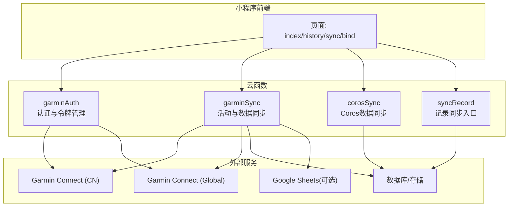
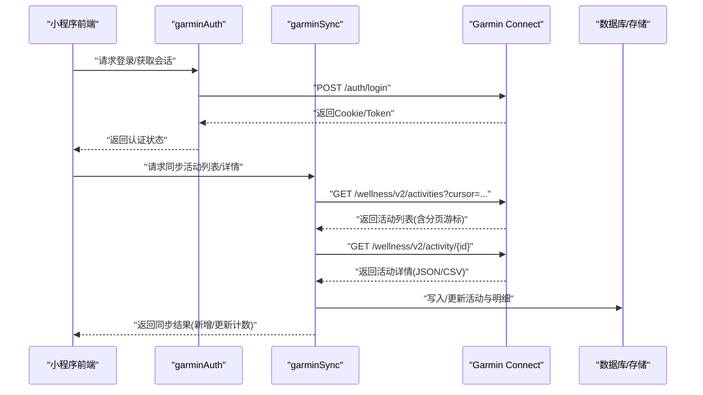
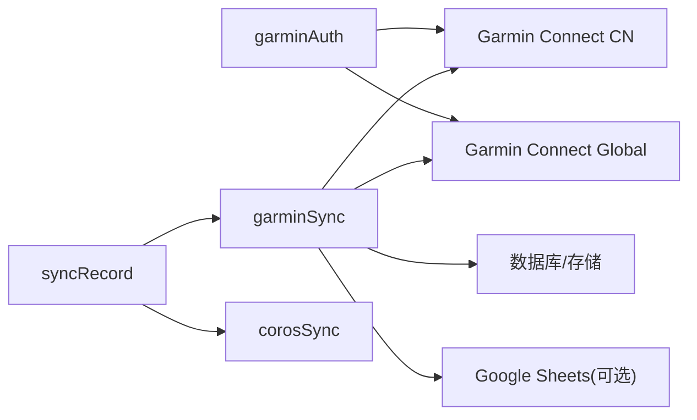
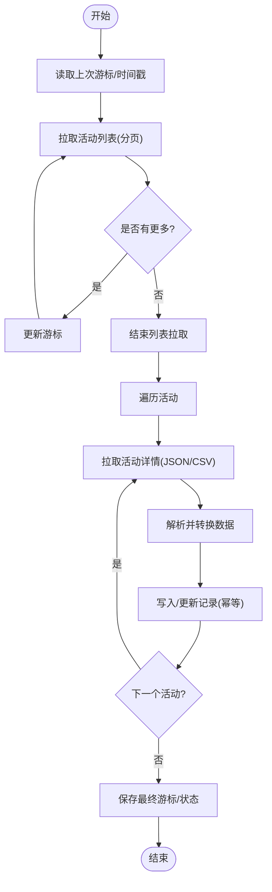

# Garmin数据同步API

<cite>
**本文引用的文件**   
- [cloudfunctions/garminAuth/index.js](file://cloudfunctions/garminAuth/index.js)
- [cloudfunctions/garminAuth/config.json](file://cloudfunctions/garminAuth/config.json)
- [cloudfunctions/garminSync/index.js](file://cloudfunctions/garminSync/index.js)
- [cloudfunctions/garminSync/config.json](file://cloudfunctions/garminSync/config.json)
- [cloudfunctions/corosSync/index.js](file://cloudfunctions/corosSync/index.js)
- [cloudfunctions/syncRecord/index.js](file://cloudfunctions/syncRecord/index.js)
- [dailysync-ref/src/utils/garmin_common.ts](file://dailysync-ref/src/utils/garmin_common.ts)
- [dailysync-ref/src/utils/garmin_cn.ts](file://dailysync-ref/src/utils/garmin_cn.ts)
- [dailysync-ref/src/utils/garmin_global.ts](file://dailysync-ref/src/utils/garmin_global.ts)
- [dailysync-ref/src/utils/strava.ts](file://dailysync-ref/src/utils/strava.ts)
- [dailysync-ref/src/utils/sqlite.ts](file://dailysync-ref/src/utils/sqlite.ts)
- [dailysync-ref/src/utils/google_sheets.ts](file://dailysync-ref/src/utils/google_sheets.ts)
- [dailysync-ref/src/utils/type.ts](file://dailysync-ref/src/utils/type.ts)
- [dailysync-ref/src/sync_garmin_cn_to_global.ts](file://dailysync-ref/src/sync_garmin_cn_to_global.ts)
- [dailysync-ref/src/sync_garmin_global_to_cn.ts](file://dailysync-ref/src/sync_garmin_global_to_cn.ts)
- [dailysync-ref/src/migrate_garmin_cn_to_global.ts](file://dailysync-ref/src/migrate_garmin_cn_to_global.ts)
- [dailysync-ref/src/migrate_garmin_global_to_cn.ts](file://dailysync-ref/src/migrate_garmin_global_to_cn.ts)
- [dailysync-ref/src/rq.ts](file://dailysync-ref/src/rq.ts)
- [dailysync-ref/package.json](file://dailysync-ref/package.json)
</cite>

## 目录
1. [简介](#简介)
2. [项目结构](#项目结构)
3. [核心组件](#核心组件)
4. [架构总览](#架构总览)
5. [详细组件分析](#详细组件分析)
6. [依赖关系分析](#依赖关系分析)
7. [性能考虑](#性能考虑)
8. [故障排除指南](#故障排除指南)
9. [结论](#结论)
10. [附录](#附录)

## 简介
本文件为Garmin数据同步云函数的完整API文档，面向开发者与运维人员。内容覆盖：
- 运动数据同步接口（登录认证、活动列表、活动详情、步频心率等）
- 文件上传下载（训练文件、图片、CSV导出等）
- 数据格式转换（Garmin Connect原始数据到统一模型）
- 增量同步机制（基于时间戳与游标的去重与断点续传）
- 支持的Garmin Connect API端点与数据模型映射
- 错误处理与重试策略
- 数据同步流程图、性能优化建议与故障排除指南

## 项目结构
本项目由微信小程序前端与云端函数组成，同时包含一个参考实现（dailysync-ref），用于说明数据同步、迁移与报表生成的逻辑。

图表来源
- [cloudfunctions/garminAuth/index.js](file://cloudfunctions/garminAuth/index.js)
- [cloudfunctions/garminSync/index.js](file://cloudfunctions/garminSync/index.js)
- [cloudfunctions/corosSync/index.js](file://cloudfunctions/corosSync/index.js)
- [cloudfunctions/syncRecord/index.js](file://cloudfunctions/syncRecord/index.js)
- [dailysync-ref/src/utils/garmin_common.ts](file://dailysync-ref/src/utils/garmin_common.ts)
- [dailysync-ref/src/utils/garmin_cn.ts](file://dailysync-ref/src/utils/garmin_cn.ts)
- [dailysync-ref/src/utils/garmin_global.ts](file://dailysync-ref/src/utils/garmin_global.ts)
- [dailysync-ref/src/utils/google_sheets.ts](file://dailysync-ref/src/utils/google_sheets.ts)

章节来源
- [cloudfunctions/garminAuth/index.js](file://cloudfunctions/garminAuth/index.js)
- [cloudfunctions/garminSync/index.js](file://cloudfunctions/garminSync/index.js)
- [cloudfunctions/corosSync/index.js](file://cloudfunctions/corosSync/index.js)
- [cloudfunctions/syncRecord/index.js](file://cloudfunctions/syncRecord/index.js)
- [dailysync-ref/src/utils/garmin_common.ts](file://dailysync-ref/src/utils/garmin_common.ts)
- [dailysync-ref/src/utils/garmin_cn.ts](file://dailysync-ref/src/utils/garmin_cn.ts)
- [dailysync-ref/src/utils/garmin_global.ts](file://dailysync-ref/src/utils/garmin_global.ts)
- [dailysync-ref/src/utils/google_sheets.ts](file://dailysync-ref/src/utils/google_sheets.ts)

## 核心组件
- garminAuth：负责Garmin账号登录、会话维持、Cookie/Token获取与刷新，封装对Garmin Connect的鉴权流程。
- garminSync：负责拉取活动列表、活动详情、轨迹、心率、步频、功率等数据，进行格式转换与入库；支持增量同步与分页/游标控制。
- corosSync：针对Coros生态的数据同步入口（若启用），结构与garminSync类似，便于扩展多源数据。
- syncRecord：统一的记录同步入口，协调不同数据源的同步任务调度与结果聚合。

章节来源
- [cloudfunctions/garminAuth/index.js](file://cloudfunctions/garminAuth/index.js)
- [cloudfunctions/garminSync/index.js](file://cloudfunctions/garminSync/index.js)
- [cloudfunctions/corosSync/index.js](file://cloudfunctions/corosSync/index.js)
- [cloudfunctions/syncRecord/index.js](file://cloudfunctions/syncRecord/index.js)

## 架构总览
整体调用链从前端触发，经云函数网关进入具体业务函数，再调用Garmin Connect API或本地数据库/存储完成数据同步与持久化。

图表来源
- [cloudfunctions/garminAuth/index.js](file://cloudfunctions/garminAuth/index.js)
- [cloudfunctions/garminSync/index.js](file://cloudfunctions/garminSync/index.js)
- [dailysync-ref/src/utils/garmin_common.ts](file://dailysync-ref/src/utils/garmin_common.ts)
- [dailysync-ref/src/utils/garmin_cn.ts](file://dailysync-ref/src/utils/garmin_cn.ts)
- [dailysync-ref/src/utils/garmin_global.ts](file://dailysync-ref/src/utils/garmin_global.ts)

## 详细组件分析

### 认证模块（garminAuth）
- 功能要点
  - 登录流程：调用Garmin Connect登录接口，维护Cookie/Token，避免频繁重复登录。
  - 会话刷新：检测过期并自动刷新，保证后续请求可用。
  - 安全配置：通过配置文件管理敏感信息（如域名、代理、超时）。
- 关键输入/输出
  - 输入：用户名、密码、是否中国区实例等。
  - 输出：会话标识、访问令牌、有效期、错误码。
- 错误处理
  - 网络异常：指数退避重试。
  - 认证失败：返回明确错误码，提示用户重新登录。
- 重试策略
  - 最大重试次数、初始延迟、退避因子、抖动参数可配置。

章节来源
- [cloudfunctions/garminAuth/index.js](file://cloudfunctions/garminAuth/index.js)
- [cloudfunctions/garminAuth/config.json](file://cloudfunctions/garminAuth/config.json)

### 同步模块（garminSync）
- 功能要点
  - 活动列表拉取：分页/游标控制，支持按时间范围过滤。
  - 活动详情拉取：JSON元数据与CSV轨迹/心率/步频/功率等多源数据。
  - 数据转换：将Garmin原始字段映射到统一数据模型，便于下游使用。
  - 增量同步：基于更新时间戳与游标，仅拉取变更数据，降低带宽与耗时。
  - 文件下载：支持下载训练文件（FIT/GPX/TCX）、图片、CSV等。
- 关键输入/输出
  - 输入：用户ID、时间范围、游标、是否强制全量、目标存储路径。
  - 输出：新增/更新计数、失败项明细、下次游标、错误汇总。
- 错误处理
  - 限流/配额：识别HTTP 429/5xx，触发退避重试。
  - 数据不一致：校验关键字段，记录差异并回滚或标记待人工复核。
- 重试策略
  - 分级重试：网络层重试、业务层重试、幂等写入保障。

章节来源
- [cloudfunctions/garminSync/index.js](file://cloudfunctions/garminSync/index.js)
- [cloudfunctions/garminSync/config.json](file://cloudfunctions/garminSync/config.json)
- [dailysync-ref/src/utils/garmin_common.ts](file://dailysync-ref/src/utils/garmin_common.ts)
- [dailysync-ref/src/utils/garmin_cn.ts](file://dailysync-ref/src/utils/garmin_cn.ts)
- [dailysync-ref/src/utils/garmin_global.ts](file://dailysync-ref/src/utils/garmin_global.ts)

### Coros同步模块（corosSync）
- 功能要点
  - 与garminSync类似的拉取与转换流程，适配Coros平台数据结构。
  - 提供统一的数据模型，便于与Garmin数据合并展示与分析。
- 适用场景
  - 多品牌设备用户的数据汇聚。

章节来源
- [cloudfunctions/corosSync/index.js](file://cloudfunctions/corosSync/index.js)

### 记录同步入口（syncRecord）
- 功能要点
  - 统一调度各数据源的同步任务，聚合结果并上报状态。
  - 支持定时触发与手动触发两种模式。
- 集成点
  - 与数据库/存储交互，确保事务一致性与幂等性。

章节来源
- [cloudfunctions/syncRecord/index.js](file://cloudfunctions/syncRecord/index.js)

### 参考实现（dailysync-ref）
- 作用
  - 提供完整的同步、迁移与报表生成参考代码，帮助理解数据模型与转换逻辑。
- 关键模块
  - 工具库：garmin_common、garmin_cn、garmin_global、sqlite、google_sheets、type等。
  - 同步脚本：cn<->global双向同步、迁移脚本、Running Quotient计算。
- 价值
  - 作为云函数实现的对照与补充，便于验证接口行为与数据一致性。

章节来源
- [dailysync-ref/src/utils/garmin_common.ts](file://dailysync-ref/src/utils/garmin_common.ts)
- [dailysync-ref/src/utils/garmin_cn.ts](file://dailysync-ref/src/utils/garmin_cn.ts)
- [dailysync-ref/src/utils/garmin_global.ts](file://dailysync-ref/src/utils/garmin_global.ts)
- [dailysync-ref/src/utils/sqlite.ts](file://dailysync-ref/src/utils/sqlite.ts)
- [dailysync-ref/src/utils/google_sheets.ts](file://dailysync-ref/src/utils/google_sheets.ts)
- [dailysync-ref/src/utils/type.ts](file://dailysync-ref/src/utils/type.ts)
- [dailysync-ref/src/sync_garmin_cn_to_global.ts](file://dailysync-ref/src/sync_garmin_cn_to_global.ts)
- [dailysync-ref/src/sync_garmin_global_to_cn.ts](file://dailysync-ref/src/sync_garmin_global_to_cn.ts)
- [dailysync-ref/src/migrate_garmin_cn_to_global.ts](file://dailysync-ref/src/migrate_garmin_cn_to_global.ts)
- [dailysync-ref/src/migrate_garmin_global_to_cn.ts](file://dailysync-ref/src/migrate_garmin_global_to_cn.ts)
- [dailysync-ref/src/rq.ts](file://dailysync-ref/src/rq.ts)
- [dailysync-ref/package.json](file://dailysync-ref/package.json)

## 依赖关系分析
- 云函数对外部服务的依赖
  - Garmin Connect (CN/Global)：认证、活动列表、活动详情、文件下载。
  - 数据库/存储：活动主表、明细表、文件对象存储。
  - Google Sheets（可选）：报表导出与共享。
- 内部模块耦合
  - garminAuth为garminSync提供会话能力。
  - syncRecord协调garminSync与corosSync，统一输出。

图表来源
- [cloudfunctions/garminAuth/index.js](file://cloudfunctions/garminAuth/index.js)
- [cloudfunctions/garminSync/index.js](file://cloudfunctions/garminSync/index.js)
- [cloudfunctions/syncRecord/index.js](file://cloudfunctions/syncRecord/index.js)
- [dailysync-ref/src/utils/google_sheets.ts](file://dailysync-ref/src/utils/google_sheets.ts)

章节来源
- [cloudfunctions/garminAuth/index.js](file://cloudfunctions/garminAuth/index.js)
- [cloudfunctions/garminSync/index.js](file://cloudfunctions/garminSync/index.js)
- [cloudfunctions/syncRecord/index.js](file://cloudfunctions/syncRecord/index.js)
- [dailysync-ref/src/utils/google_sheets.ts](file://dailysync-ref/src/utils/google_sheets.ts)

## 性能考虑
- 并发与批处理
  - 活动列表分页批量拉取，减少往返次数。
  - 详情拉取采用队列+并发上限，避免瞬时压力过大。
- 缓存与会话复用
  - 复用认证会话，避免重复登录。
  - 热点数据（如最近活动）短期缓存，提升响应速度。
- 增量与去重
  - 基于更新时间戳与游标，仅拉取变更数据。
  - 写入前做唯一键校验，避免重复插入。
- 资源限制
  - 合理设置超时、重试次数与退避策略，防止雪崩。
  - 大文件下载分块处理，内存占用可控。
- 监控与告警
  - 记录关键指标：成功率、平均耗时、失败原因分布。
  - 对持续失败与慢查询触发告警。

[本节为通用指导，不直接分析具体文件]

## 故障排除指南
- 常见问题
  - 认证失败：检查用户名/密码、地区选择、网络连通性；查看会话是否过期。
  - 限流/配额：识别HTTP 429/5xx，调整重试间隔与并发度。
  - 数据缺失：确认活动类型是否支持对应数据（如心率、步频）；检查权限与订阅。
  - 文件下载失败：确认文件格式与大小限制；检查存储空间与权限。
- 定位方法
  - 查看云函数日志，关注错误堆栈与返回码。
  - 对比参考实现（dailysync-ref）的解析逻辑，排查字段映射问题。
  - 使用最小数据集复现问题，逐步缩小范围。
- 恢复策略
  - 清理无效会话后重试。
  - 重置游标从上次成功位置继续。
  - 对失败项单独重试，避免影响整体进度。

章节来源
- [cloudfunctions/garminAuth/index.js](file://cloudfunctions/garminAuth/index.js)
- [cloudfunctions/garminSync/index.js](file://cloudfunctions/garminSync/index.js)
- [dailysync-ref/src/utils/garmin_common.ts](file://dailysync-ref/src/utils/garmin_common.ts)

## 结论
本API文档围绕Garmin数据同步云函数，系统梳理了认证、同步、转换、增量与文件处理的完整链路。结合参考实现与最佳实践，可为开发与运维提供清晰指引。建议在上线前完善监控与告警，确保稳定性与可观测性。

[本节为总结性内容，不直接分析具体文件]

## 附录

### 支持的Garmin Connect API端点（概念性清单）
- 认证
  - POST /auth/login
- 活动列表
  - GET /wellness/v2/activities?cursor=...&limit=...
- 活动详情
  - GET /wellness/v2/activity/{id}
- 文件下载
  - GET /download/{activityId}.json/.csv/.fit/.gpx
- 备注
  - 实际端点以Garmin官方文档为准；不同区域（CN/Global）可能存在差异。

[本节为概念性说明，不直接分析具体文件]

### 数据模型映射（概念性说明）
- 活动主表
  - id、userId、startTime、endTime、distance、elevationGain、movingTime、elapsedTime、calories、sportType、source、createdAt、updatedAt
- 活动明细
  - activityId、timestamp、heartRate、cadence、power、latitude、longitude、altitude、speed
- 映射原则
  - 统一单位与精度（距离米、时间秒、心率bpm、功率瓦特）。
  - 缺失字段标记为空，保留原始值以便回溯。

[本节为概念性说明，不直接分析具体文件]

### 增量同步流程图

[本图为概念性流程，不直接映射具体文件]

### 错误处理与重试策略（概念性说明）
- 分类
  - 网络错误：超时、连接失败。
  - 服务端错误：4xx/5xx、限流。
  - 业务错误：数据不完整、字段缺失。
- 策略
  - 指数退避：初始延迟×退避因子^重试次数，加入随机抖动。
  - 最大重试次数：根据错误类型设定上限。
  - 幂等写入：基于唯一键避免重复。
  - 降级与熔断：连续失败时暂停任务并告警。

[本节为概念性说明，不直接分析具体文件]