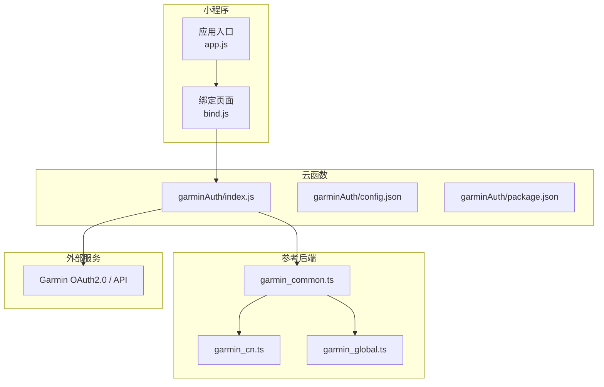
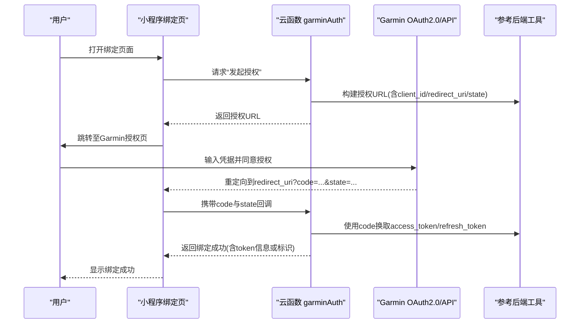
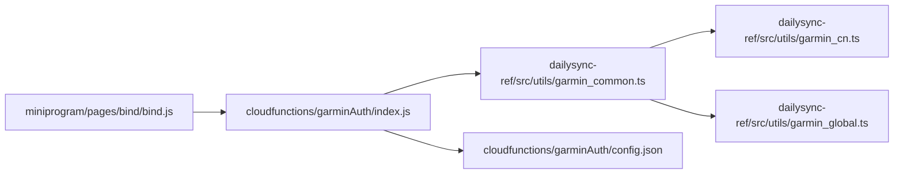
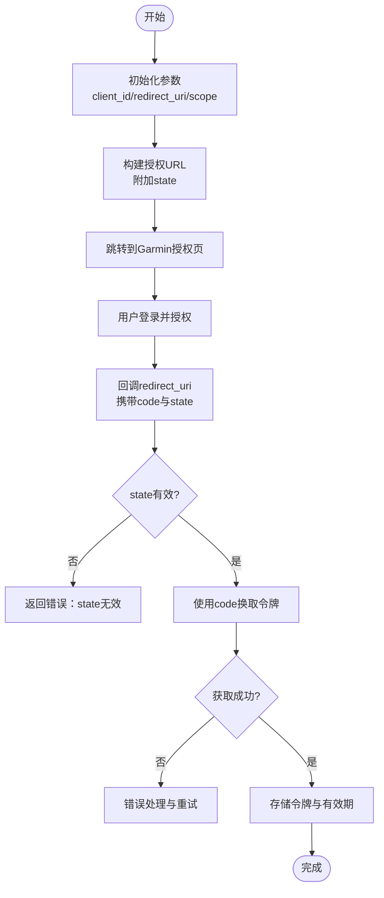

# Garmin认证API

<cite>
**本文档引用的文件**
- [cloudfunctions/garminAuth/index.js](file://cloudfunctions/garminAuth/index.js)
- [cloudfunctions/garminAuth/config.json](file://cloudfunctions/garminAuth/config.json)
- [cloudfunctions/garminAuth/package.json](file://cloudfunctions/garminAuth/package.json)
- [dailysync-ref/src/utils/garmin_common.ts](file://dailysync-ref/src/utils/garmin_common.ts)
- [dailysync-ref/src/utils/garmin_cn.ts](file://dailysync-ref/src/utils/garmin_cn.ts)
- [dailysync-ref/src/utils/garmin_global.ts](file://dailysync-ref/src/utils/garmin_global.ts)
- [miniprogram/pages/bind/bind.js](file://miniprogram/pages/bind/bind.js)
- [miniprogram/app.js](file://miniprogram/app.js)
</cite>

## 目录
1. [简介](#简介)
2. [项目结构](#项目结构)
3. [核心组件](#核心组件)
4. [架构总览](#架构总览)
5. [详细组件分析](#详细组件分析)
6. [依赖关系分析](#依赖关系分析)
7. [性能考虑](#性能考虑)
8. [故障排查指南](#故障排查指南)
9. [结论](#结论)
10. [附录](#附录)

## 简介
本文件为Garmin认证云函数的API文档，聚焦于认证流程、OAuth2.0集成、用户授权与令牌管理。内容涵盖请求参数、响应格式、错误代码与处理策略，并提供完整的认证流程图、安全最佳实践、客户端集成示例与调试指南。读者可据此在小程序端完成Garmin账号绑定、获取访问令牌并调用数据同步接口。

## 项目结构
本项目包含以下关键部分：
- 云函数：负责与Garmin服务端交互，实现OAuth2.0授权码交换、令牌刷新与鉴权状态维护。
- 参考后端（dailysync-ref）：封装了Garmin中国/全球站点的通用逻辑与差异处理，提供统一的工具方法。
- 小程序前端：提供绑定页面与入口逻辑，引导用户完成授权并触发云函数。

图表来源
- [cloudfunctions/garminAuth/index.js](file://cloudfunctions/garminAuth/index.js)
- [cloudfunctions/garminAuth/config.json](file://cloudfunctions/garminAuth/config.json)
- [cloudfunctions/garminAuth/package.json](file://cloudfunctions/garminAuth/package.json)
- [dailysync-ref/src/utils/garmin_common.ts](file://dailysync-ref/src/utils/garmin_common.ts)
- [dailysync-ref/src/utils/garmin_cn.ts](file://dailysync-ref/src/utils/garmin_cn.ts)
- [dailysync-ref/src/utils/garmin_global.ts](file://dailysync-ref/src/utils/garmin_global.ts)

章节来源
- [cloudfunctions/garminAuth/index.js](file://cloudfunctions/garminAuth/index.js)
- [cloudfunctions/garminAuth/config.json](file://cloudfunctions/garminAuth/config.json)
- [cloudfunctions/garminAuth/package.json](file://cloudfunctions/garminAuth/package.json)
- [dailysync-ref/src/utils/garmin_common.ts](file://dailysync-ref/src/utils/garmin_common.ts)
- [dailysync-ref/src/utils/garmin_cn.ts](file://dailysync-ref/src/utils/garmin_cn.ts)
- [dailysync-ref/src/utils/garmin_global.ts](file://dailysync-ref/src/utils/garmin_global.ts)
- [miniprogram/pages/bind/bind.js](file://miniprogram/pages/bind/bind.js)
- [miniprogram/app.js](file://miniprogram/app.js)

## 核心组件
- 云函数 garminAuth：对外暴露认证相关接口，包括发起授权、回调处理、令牌获取与刷新、会话状态查询等。
- 参考后端工具模块：
  - garmin_common.ts：通用网络请求、签名、URL构建、错误解析等。
  - garmin_cn.ts / garmin_global.ts：区分中国区与全球区的域名、路径与行为差异。
- 小程序绑定页：引导用户登录Garmin并完成授权，随后调用云函数完成令牌绑定。

章节来源
- [cloudfunctions/garminAuth/index.js](file://cloudfunctions/garminAuth/index.js)
- [dailysync-ref/src/utils/garmin_common.ts](file://dailysync-ref/src/utils/garmin_common.ts)
- [dailysync-ref/src/utils/garmin_cn.ts](file://dailysync-ref/src/utils/garmin_cn.ts)
- [dailysync-ref/src/utils/garmin_global.ts](file://dailysync-ref/src/utils/garmin_global.ts)
- [miniprogram/pages/bind/bind.js](file://miniprogram/pages/bind/bind.js)

## 架构总览
下图展示了小程序端通过云函数完成Garmin OAuth2.0授权的端到端流程，以及后续令牌管理与数据同步的调用关系。

图表来源
- [cloudfunctions/garminAuth/index.js](file://cloudfunctions/garminAuth/index.js)
- [dailysync-ref/src/utils/garmin_common.ts](file://dailysync-ref/src/utils/garmin_common.ts)
- [dailysync-ref/src/utils/garmin_cn.ts](file://dailysync-ref/src/utils/garmin_cn.ts)
- [dailysync-ref/src/utils/garmin_global.ts](file://dailysync-ref/src/utils/garmin_global.ts)
- [miniprogram/pages/bind/bind.js](file://miniprogram/pages/bind/bind.js)

## 详细组件分析

### 云函数 garminAuth
职责
- 接收小程序端的认证请求，生成OAuth2.0授权链接。
- 处理授权回调，使用授权码换取访问令牌与刷新令牌。
- 管理令牌生命周期（过期检测、自动刷新）。
- 提供查询当前绑定状态的接口。

关键接口
- 发起授权
  - 入参：用户标识、目标站点（CN/Global）、可选scope
  - 出参：授权URL、state值（用于防CSRF）
- 授权回调
  - 入参：code、state、用户标识
  - 出参：绑定结果（成功/失败及原因）
- 令牌刷新
  - 入参：refresh_token、用户标识
  - 出参：新的access_token与可能的refresh_token
- 绑定状态查询
  - 入参：用户标识
  - 出参：是否已绑定、令牌有效期、站点信息等

错误处理
- 常见错误：无效state、授权码过期、网络异常、Garmin限流、凭证配置错误。
- 策略：重试退避、明确错误码、记录必要日志（不含敏感信息）。

章节来源
- [cloudfunctions/garminAuth/index.js](file://cloudfunctions/garminAuth/index.js)
- [cloudfunctions/garminAuth/config.json](file://cloudfunctions/garminAuth/config.json)
- [cloudfunctions/garminAuth/package.json](file://cloudfunctions/garminAuth/package.json)

### 参考后端工具模块
职责
- 统一HTTP请求封装、签名计算、URL拼接、错误解析。
- 区分Garmin中国与全球站点的差异（域名、路径、行为）。

关键模块
- garmin_common.ts：通用能力（请求、签名、错误、常量）。
- garmin_cn.ts：中国区特定逻辑。
- garmin_global.ts：全球区特定逻辑。

章节来源
- [dailysync-ref/src/utils/garmin_common.ts](file://dailysync-ref/src/utils/garmin_common.ts)
- [dailysync-ref/src/utils/garmin_cn.ts](file://dailysync-ref/src/utils/garmin_cn.ts)
- [dailysync-ref/src/utils/garmin_global.ts](file://dailysync-ref/src/utils/garmin_global.ts)

### 小程序绑定页
职责
- 展示绑定入口，引导用户完成授权。
- 接收授权回调参数并调用云函数完成绑定。
- 展示绑定结果与后续操作提示。

章节来源
- [miniprogram/pages/bind/bind.js](file://miniprogram/pages/bind/bind.js)
- [miniprogram/app.js](file://miniprogram/app.js)

## 依赖关系分析
- 云函数依赖参考后端工具模块进行网络与站点差异化处理。
- 小程序仅与云函数交互，不直接访问Garmin服务端，降低安全风险。
- 配置项集中于云函数配置文件，便于环境隔离与密钥管理。

图表来源
- [miniprogram/pages/bind/bind.js](file://miniprogram/pages/bind/bind.js)
- [cloudfunctions/garminAuth/index.js](file://cloudfunctions/garminAuth/index.js)
- [dailysync-ref/src/utils/garmin_common.ts](file://dailysync-ref/src/utils/garmin_common.ts)
- [dailysync-ref/src/utils/garmin_cn.ts](file://dailysync-ref/src/utils/garmin_cn.ts)
- [dailysync-ref/src/utils/garmin_global.ts](file://dailysync-ref/src/utils/garmin_global.ts)
- [cloudfunctions/garminAuth/config.json](file://cloudfunctions/garminAuth/config.json)

章节来源
- [cloudfunctions/garminAuth/index.js](file://cloudfunctions/garminAuth/index.js)
- [dailysync-ref/src/utils/garmin_common.ts](file://dailysync-ref/src/utils/garmin_common.ts)
- [dailysync-ref/src/utils/garmin_cn.ts](file://dailysync-ref/src/utils/garmin_cn.ts)
- [dailysync-ref/src/utils/garmin_global.ts](file://dailysync-ref/src/utils/garmin_global.ts)
- [cloudfunctions/garminAuth/config.json](file://cloudfunctions/garminAuth/config.json)
- [miniprogram/pages/bind/bind.js](file://miniprogram/pages/bind/bind.js)

## 性能考虑
- 令牌缓存与刷新：避免频繁请求Garmin，减少延迟与限流风险。
- 并发控制：对同一用户的授权与刷新操作进行串行化，防止竞态。
- 超时与重试：合理设置超时时间，采用指数退避重试策略。
- 最小化传输：仅传递必要参数，压缩不必要的响应体。

[本节为通用指导，无需具体文件引用]

## 故障排查指南
常见问题与定位步骤
- 授权失败（invalid_state）
  - 检查state是否一致且未过期；确认回调地址与配置一致。
- 授权码过期或已被使用
  - 重新发起授权；确保一次性使用授权码。
- 令牌刷新失败
  - 校验refresh_token有效性；检查网络连通性与证书。
- 站点差异导致的路径错误
  - 确认CN/Global选择正确；核对域名与路径。
- 权限不足
  - 检查scope是否包含所需权限；必要时重新授权。

建议的调试手段
- 开启云函数日志（脱敏），记录关键节点与错误码。
- 在小程序端打印请求与响应摘要，便于比对。
- 使用独立测试账号逐步验证授权与刷新流程。

章节来源
- [cloudfunctions/garminAuth/index.js](file://cloudfunctions/garminAuth/index.js)
- [dailysync-ref/src/utils/garmin_common.ts](file://dailysync-ref/src/utils/garmin_common.ts)
- [miniprogram/pages/bind/bind.js](file://miniprogram/pages/bind/bind.js)

## 结论
通过云函数集中处理Garmin OAuth2.0授权与令牌管理，结合参考后端的站点差异抽象，可在小程序端实现安全、稳定、易用的认证与数据同步体验。遵循本文的安全最佳实践与排障建议，可有效降低集成风险并提升用户体验。

[本节为总结性内容，无需具体文件引用]

## 附录

### 认证流程图（概念）

[本图为概念流程，不直接映射具体源码，故无图表来源]

### 安全最佳实践
- 使用HTTPS与可信回调地址，严格校验state。
- 最小权限原则：仅申请必要scope。
- 密钥与凭证存放于云函数配置，禁止硬编码。
- 令牌加密存储，限制访问范围与生命周期。
- 记录审计日志，避免泄露敏感信息。

[本节为通用指导，无需具体文件引用]

### 客户端集成示例（步骤说明）
- 在小程序绑定页调用云函数“发起授权”，获取授权URL。
- 引导用户跳转至授权页完成登录与授权。
- 接收回调参数（code、state），调用云函数“授权回调”。
- 云函数返回绑定结果，小程序更新界面并进入后续功能。

章节来源
- [miniprogram/pages/bind/bind.js](file://miniprogram/pages/bind/bind.js)
- [cloudfunctions/garminAuth/index.js](file://cloudfunctions/garminAuth/index.js)

### 错误代码与处理策略（示例）
- 400 参数错误：检查必填字段与格式。
- 401 未授权：重新发起授权或刷新令牌。
- 403 权限不足：调整scope并重新授权。
- 429 限流：退避重试，降低频率。
- 5xx 服务端错误：重试并上报监控。

[本节为通用指导，无需具体文件引用]