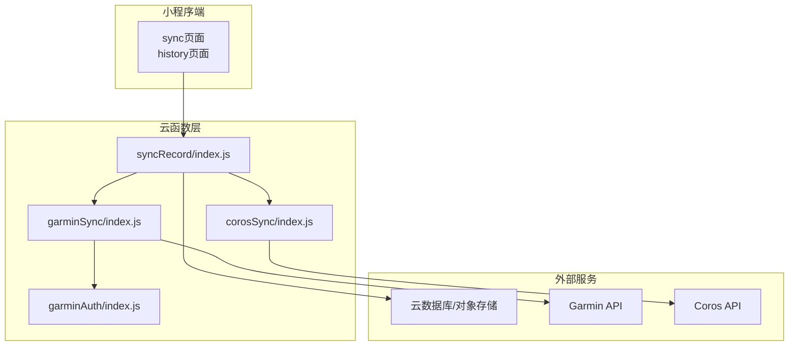
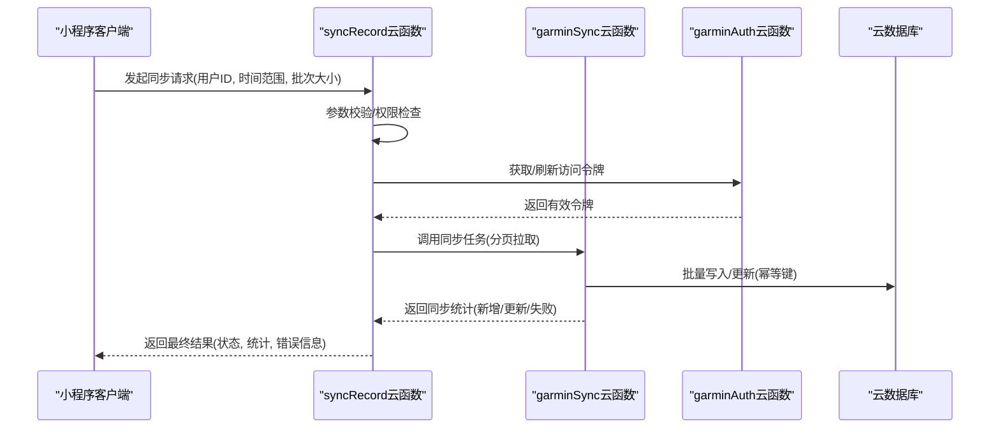
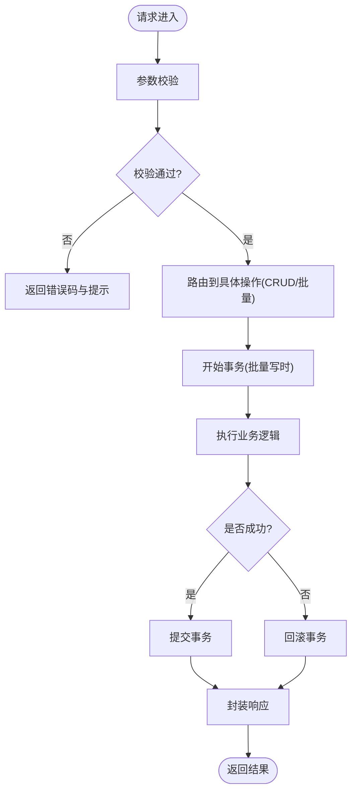
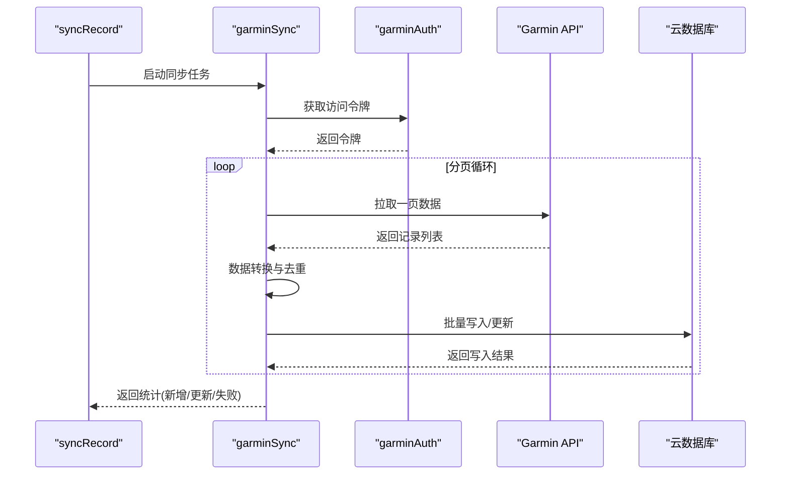
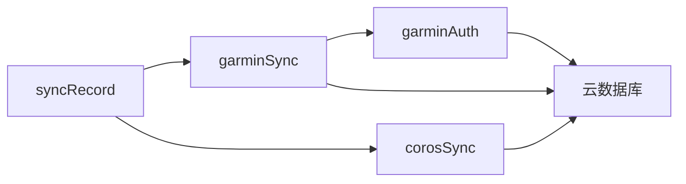

# 记录同步API

<cite>
**本文档引用的文件**   
- [cloudfunctions/syncRecord/index.js](file://cloudfunctions/syncRecord/index.js)
- [cloudfunctions/syncRecord/package.json](file://cloudfunctions/syncRecord/package.json)
- [cloudfunctions/corosSync/index.js](file://cloudfunctions/corosSync/index.js)
- [cloudfunctions/corosSync/package.json](file://cloudfunctions/corosSync/package.json)
- [cloudfunctions/garminSync/index.js](file://cloudfunctions/garminSync/index.js)
- [cloudfunctions/garminSync/config.json](file://cloudfunctions/garminSync/config.json)
- [cloudfunctions/garminSync/package.json](file://cloudfunctions/garminSync/package.json)
- [cloudfunctions/garminAuth/index.js](file://cloudfunctions/garminAuth/index.js)
- [cloudfunctions/garminAuth/config.json](file://cloudfunctions/garminAuth/config.json)
- [cloudfunctions/garminAuth/package.json](file://cloudfunctions/garminAuth/package.json)
- [miniprogram/pages/sync/sync.js](file://miniprogram/pages/sync/sync.js)
- [miniprogram/pages/history/history.js](file://miniprogram/pages/history/history.js)
- [miniprogram/app.js](file://miniprogram/app.js)
</cite>

## 目录
1. [简介](#简介)
2. [项目结构](#项目结构)
3. [核心组件](#核心组件)
4. [架构总览](#架构总览)
5. [详细组件分析](#详细组件分析)
6. [依赖关系分析](#依赖关系分析)
7. [性能考虑](#性能考虑)
8. [故障排查指南](#故障排查指南)
9. [结论](#结论)
10. [附录](#附录)

## 简介
本文件为“记录同步”云函数提供完整的API文档，覆盖运动记录的增删改查、批量处理接口、数据验证规则与状态管理。同时说明记录数据结构、关联关系、索引优化与查询性能，并给出事务处理、并发控制与数据一致性保证机制，以及常用查询模式与性能调优建议。该文档面向开发者与运维人员，力求在技术细节与可读性之间取得平衡。

## 项目结构
本项目包含多个云函数与小程序前端页面：
- 云函数层
  - syncRecord：记录同步主入口，负责接收请求、校验参数、调用数据库操作、返回结果。
  - corosSync：Coros设备/账号同步逻辑（若存在）。
  - garminSync：Garmin设备/账号同步逻辑（若存在）。
  - garminAuth：Garmin认证相关逻辑（若存在）。
- 小程序前端
  - pages/sync：触发同步、展示同步状态与结果。
  - pages/history：历史记录的查看与筛选。
  - app.js：应用初始化与全局配置。

图表来源 
- [cloudfunctions/syncRecord/index.js](file://cloudfunctions/syncRecord/index.js)
- [cloudfunctions/garminSync/index.js](file://cloudfunctions/garminSync/index.js)
- [cloudfunctions/corosSync/index.js](file://cloudfunctions/corosSync/index.js)
- [cloudfunctions/garminAuth/index.js](file://cloudfunctions/garminAuth/index.js)

章节来源
- [cloudfunctions/syncRecord/index.js](file://cloudfunctions/syncRecord/index.js)
- [cloudfunctions/syncRecord/package.json](file://cloudfunctions/syncRecord/package.json)
- [cloudfunctions/garminSync/index.js](file://cloudfunctions/garminSync/index.js)
- [cloudfunctions/garminSync/config.json](file://cloudfunctions/garminSync/config.json)
- [cloudfunctions/corosSync/index.js](file://cloudfunctions/corosSync/index.js)
- [cloudfunctions/corosSync/package.json](file://cloudfunctions/corosSync/package.json)
- [cloudfunctions/garminAuth/index.js](file://cloudfunctions/garminAuth/index.js)
- [cloudfunctions/garminAuth/config.json](file://cloudfunctions/garminAuth/config.json)
- [miniprogram/pages/sync/sync.js](file://miniprogram/pages/sync/sync.js)
- [miniprogram/pages/history/history.js](file://miniprogram/pages/history/history.js)
- [miniprogram/app.js](file://miniprogram/app.js)

## 核心组件
- 记录同步主入口（syncRecord）
  - 职责：统一接收客户端请求，进行参数校验、权限检查、业务路由、调用数据库或第三方同步函数，封装响应格式。
  - 关键能力：单条/批量CRUD、幂等写入、状态机更新、错误码规范、限流与重试策略。
- Garmin同步（garminSync）
  - 职责：对接Garmin开放API，拉取用户运动记录，转换为内部模型，去重后落库。
  - 关键能力：分页拉取、增量同步、失败重试、速率限制、异常上报。
- Coros同步（corosSync）
  - 职责：对接Coros开放API，拉取用户运动记录，转换与入库。
  - 关键能力：分页拉取、增量同步、失败重试、速率限制、异常上报。
- Garmin认证（garminAuth）
  - 职责：获取与刷新访问令牌，维护会话状态。
  - 关键能力：OAuth流程、令牌缓存、过期检测、安全存储。

章节来源
- [cloudfunctions/syncRecord/index.js](file://cloudfunctions/syncRecord/index.js)
- [cloudfunctions/garminSync/index.js](file://cloudfunctions/garminSync/index.js)
- [cloudfunctions/corosSync/index.js](file://cloudfunctions/corosSync/index.js)
- [cloudfunctions/garminAuth/index.js](file://cloudfunctions/garminAuth/index.js)

## 架构总览
整体采用“前端触发 -> 云函数编排 -> 第三方同步 -> 数据库持久化”的链路。syncRecord作为统一入口，协调各同步子函数，确保数据一致性与可观测性。

图表来源 
- [cloudfunctions/syncRecord/index.js](file://cloudfunctions/syncRecord/index.js)
- [cloudfunctions/garminSync/index.js](file://cloudfunctions/garminSync/index.js)
- [cloudfunctions/garminAuth/index.js](file://cloudfunctions/garminAuth/index.js)

## 详细组件分析

### 记录同步主入口（syncRecord）
- 功能要点
  - 支持单条记录的创建、更新、删除与查询。
  - 支持批量处理：批量创建、批量更新、批量删除、批量查询。
  - 数据验证：必填字段、类型校验、范围校验、唯一性约束。
  - 状态管理：记录生命周期状态（待同步、已同步、失败、回滚）。
  - 事务处理：对批量写操作使用事务，保证原子性。
  - 并发控制：基于用户ID的分片锁，避免重复写入。
  - 幂等性：通过业务主键（如第三方记录ID+来源）实现幂等写入。
  - 错误处理：统一错误码、堆栈脱敏、重试策略。
- 典型流程
  - 创建记录：校验输入 -> 生成幂等键 -> 插入记录 -> 返回结果。
  - 批量更新：开启事务 -> 逐条校验 -> 批量更新 -> 提交/回滚 -> 返回统计。
  - 删除记录：校验ID -> 软删除/硬删除 -> 返回结果。
  - 查询记录：条件过滤 -> 排序分页 -> 返回结果集。
- 性能优化
  - 索引设计：按用户ID、时间戳、来源、状态建立复合索引。
  - 批量写入：合并写操作，减少网络往返。
  - 分页查询：限制每页大小，避免大结果集。
  - 缓存热点：对频繁查询的聚合结果进行短期缓存。

图表来源 
- [cloudfunctions/syncRecord/index.js](file://cloudfunctions/syncRecord/index.js)

章节来源
- [cloudfunctions/syncRecord/index.js](file://cloudfunctions/syncRecord/index.js)
- [cloudfunctions/syncRecord/package.json](file://cloudfunctions/syncRecord/package.json)

### Garmin同步（garminSync）
- 功能要点
  - 分页拉取用户运动记录，转换为内部模型。
  - 增量同步：基于时间戳或游标避免重复拉取。
  - 去重与幂等：依据第三方记录ID与来源进行去重。
  - 失败重试：指数退避与最大重试次数。
  - 速率限制：遵循第三方API配额，避免被封禁。
- 典型流程
  - 获取令牌 -> 分页拉取 -> 数据转换 -> 批量写入 -> 统计汇总。
- 性能优化
  - 并行拉取：按页并发请求，注意限流。
  - 批量写入：合并多条记录一次性写入。
  - 断点续传：记录拉取进度，失败后可恢复。

图表来源 
- [cloudfunctions/garminSync/index.js](file://cloudfunctions/garminSync/index.js)
- [cloudfunctions/garminAuth/index.js](file://cloudfunctions/garminAuth/index.js)

章节来源
- [cloudfunctions/garminSync/index.js](file://cloudfunctions/garminSync/index.js)
- [cloudfunctions/garminSync/config.json](file://cloudfunctions/garminSync/config.json)
- [cloudfunctions/garminSync/package.json](file://cloudfunctions/garminSync/package.json)
- [cloudfunctions/garminAuth/index.js](file://cloudfunctions/garminAuth/index.js)
- [cloudfunctions/garminAuth/config.json](file://cloudfunctions/garminAuth/config.json)

### Coros同步（corosSync）
- 功能要点
  - 与Garmin同步类似，针对Coros平台的数据结构与API差异进行适配。
  - 支持增量同步、去重、失败重试、速率限制。
- 典型流程
  - 获取令牌 -> 分页拉取 -> 数据转换 -> 批量写入 -> 统计汇总。
- 性能优化
  - 与Garmin同步相同的优化策略，注意平台差异。

章节来源
- [cloudfunctions/corosSync/index.js](file://cloudfunctions/corosSync/index.js)
- [cloudfunctions/corosSync/package.json](file://cloudfunctions/corosSync/package.json)

### Garmin认证（garminAuth）
- 功能要点
  - OAuth授权流程，获取与刷新访问令牌。
  - 令牌缓存与过期检测，安全存储敏感信息。
- 典型流程
  - 检查缓存令牌 -> 若过期则刷新 -> 返回有效令牌。
- 安全建议
  - 最小权限原则，仅申请必要权限。
  - 定期轮换密钥，避免硬编码。

章节来源
- [cloudfunctions/garminAuth/index.js](file://cloudfunctions/garminAuth/index.js)
- [cloudfunctions/garminAuth/config.json](file://cloudfunctions/garminAuth/config.json)
- [cloudfunctions/garminAuth/package.json](file://cloudfunctions/garminAuth/package.json)

### 小程序前端（sync/history）
- 功能要点
  - sync页面：触发同步、展示同步状态与结果。
  - history页面：历史记录查看、筛选、分页加载。
- 交互流程
  - 用户点击同步 -> 调用syncRecord云函数 -> 轮询状态 -> 展示结果。
  - 用户选择筛选条件 -> 调用查询接口 -> 分页加载数据。

章节来源
- [miniprogram/pages/sync/sync.js](file://miniprogram/pages/sync/sync.js)
- [miniprogram/pages/history/history.js](file://miniprogram/pages/history/history.js)
- [miniprogram/app.js](file://miniprogram/app.js)

## 依赖关系分析
- 模块耦合
  - syncRecord依赖garminSync、corosSync、garminAuth，形成松耦合的编排关系。
  - 各同步函数独立对接各自第三方API，降低相互影响。
- 外部依赖
  - 云数据库：用于持久化记录与状态。
  - Garmin/Coros API：外部数据源，需处理限流与异常。
- 潜在风险
  - 第三方API不稳定导致同步失败，需具备重试与降级策略。
  - 数据库高并发写入可能导致锁竞争，需优化索引与事务粒度。

图表来源 
- [cloudfunctions/syncRecord/index.js](file://cloudfunctions/syncRecord/index.js)
- [cloudfunctions/garminSync/index.js](file://cloudfunctions/garminSync/index.js)
- [cloudfunctions/corosSync/index.js](file://cloudfunctions/corosSync/index.js)
- [cloudfunctions/garminAuth/index.js](file://cloudfunctions/garminAuth/index.js)

章节来源
- [cloudfunctions/syncRecord/index.js](file://cloudfunctions/syncRecord/index.js)
- [cloudfunctions/garminSync/index.js](file://cloudfunctions/garminSync/index.js)
- [cloudfunctions/corosSync/index.js](file://cloudfunctions/corosSync/index.js)
- [cloudfunctions/garminAuth/index.js](file://cloudfunctions/garminAuth/index.js)

## 性能考虑
- 索引优化
  - 用户ID + 时间戳：加速按用户与时间的查询。
  - 来源 + 状态：加速按来源与状态的筛选。
  - 幂等键：确保唯一性约束与快速去重。
- 查询性能
  - 分页查询：限制每页大小，避免全表扫描。
  - 投影字段：仅返回必要字段，减少数据传输。
  - 聚合查询：使用数据库聚合功能，减少后端计算。
- 写入性能
  - 批量写入：合并多次写入为一次事务。
  - 异步处理：非关键路径异步执行，缩短响应时间。
- 缓存策略
  - 热点数据缓存：如最近同步状态、用户概览。
  - 缓存失效：基于时间或事件触发失效。

[本节为通用性能指导，不直接分析具体文件]

## 故障排查指南
- 常见问题
  - 同步失败：检查第三方API限流、令牌有效性、网络连通性。
  - 数据不一致：核对幂等键、事务日志、去重逻辑。
  - 性能瓶颈：监控数据库慢查询、云函数执行时长、内存占用。
- 调试建议
  - 启用详细日志：记录关键步骤与异常堆栈（脱敏）。
  - 单元测试：覆盖边界条件与异常路径。
  - 灰度发布：小流量验证后再全量上线。
- 恢复策略
  - 断点续传：记录拉取进度，失败后可恢复。
  - 重试机制：指数退避与最大重试次数。
  - 降级方案：临时关闭非核心功能，保障核心同步。

章节来源
- [cloudfunctions/syncRecord/index.js](file://cloudfunctions/syncRecord/index.js)
- [cloudfunctions/garminSync/index.js](file://cloudfunctions/garminSync/index.js)
- [cloudfunctions/corosSync/index.js](file://cloudfunctions/corosSync/index.js)
- [cloudfunctions/garminAuth/index.js](file://cloudfunctions/garminAuth/index.js)

## 结论
本API文档全面覆盖了记录同步云函数的设计与实现，包括CRUD操作、批量处理、数据验证、状态管理、事务与并发控制、索引优化与性能调优。通过模块化设计与松耦合编排，系统具备良好的可扩展性与可维护性。建议在后续迭代中持续监控性能指标，优化查询与写入路径，提升用户体验与系统稳定性。

[本节为总结性内容，不直接分析具体文件]

## 附录
- 术语表
  - 幂等性：同一请求多次执行结果一致。
  - 增量同步：仅同步变更数据，避免全量重复。
  - 事务：一组操作的原子执行单元。
  - 并发控制：防止多进程/线程竞争资源。
- 参考文件
  - 云函数入口与配置：见各package.json与index.js。
  - 前端页面：见pages/sync与pages/history。

[本节为补充信息，不直接分析具体文件]