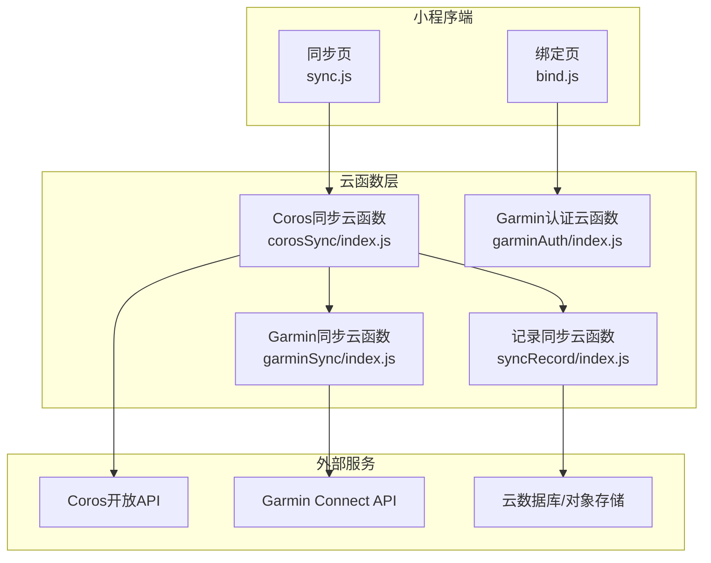
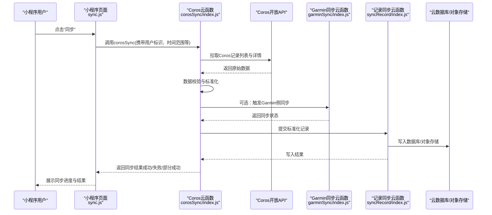
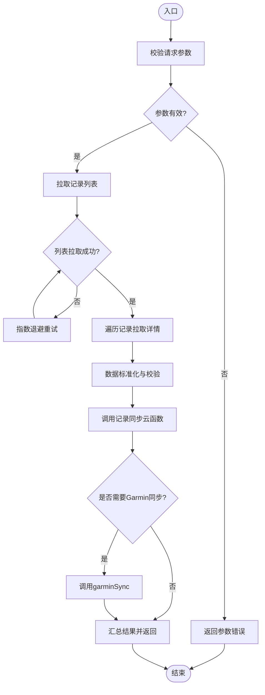
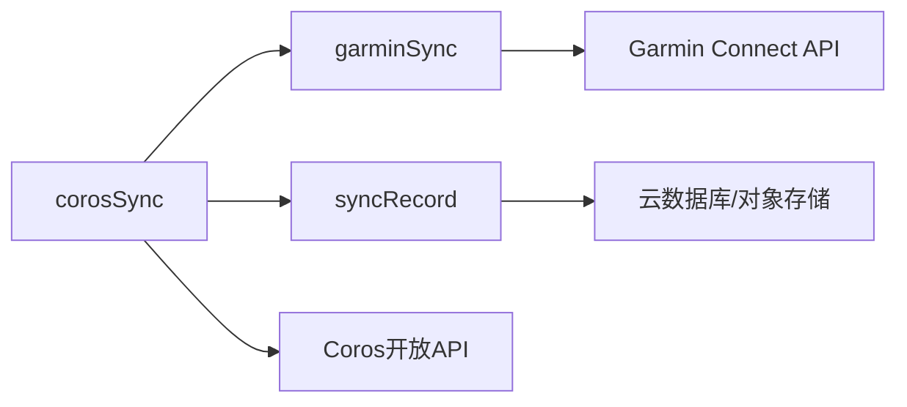

# Coros数据同步云函数

<cite>
**本文档引用的文件**   
- [cloudfunctions/corosSync/index.js](file://cloudfunctions/corosSync/index.js)
- [cloudfunctions/corosSync/package.json](file://cloudfunctions/corosSync/package.json)
- [cloudfunctions/garminAuth/index.js](file://cloudfunctions/garminAuth/index.js)
- [cloudfunctions/garminAuth/config.json](file://cloudfunctions/garminAuth/config.json)
- [cloudfunctions/garminSync/index.js](file://cloudfunctions/garminSync/index.js)
- [cloudfunctions/garminSync/config.json](file://cloudfunctions/garminSync/config.json)
- [cloudfunctions/syncRecord/index.js](file://cloudfunctions/syncRecord/index.js)
- [cloudfunctions/syncRecord/package.json](file://cloudfunctions/syncRecord/package.json)
- [miniprogram/pages/bind/bind.js](file://miniprogram/pages/bind/bind.js)
- [miniprogram/pages/sync/sync.js](file://miniprogram/pages/sync/sync.js)
</cite>

## 目录
1. [简介](#简介)
2. [项目结构](#项目结构)
3. [核心组件](#核心组件)
4. [架构总览](#架构总览)
5. [详细组件分析](#详细组件分析)
6. [依赖关系分析](#依赖关系分析)
7. [性能考虑](#性能考虑)
8. [故障排查指南](#故障排查指南)
9. [结论](#结论)
10. [附录](#附录)

## 简介
本技术文档面向Coros数据同步云函数，旨在为开发者与运维人员提供完整的技术说明。内容涵盖：
- 云函数的核心功能与职责边界
- API接口定义、请求参数与响应格式
- Coros设备数据的获取、处理与同步逻辑（含数据验证、错误处理与重试机制）
- 与其他云函数的协作关系与数据流转过程
- 调用示例（包含必要配置与认证信息）
- 性能优化建议与常见问题解决方案

## 项目结构
本项目采用微信小程序云开发模式，Coros数据同步相关能力集中在 cloudfunctions/corosSync 目录中，同时与 Garmin 生态的云函数协同工作，小程序端通过页面触发同步流程。

图表来源
- [cloudfunctions/corosSync/index.js](file://cloudfunctions/corosSync/index.js)
- [cloudfunctions/garminAuth/index.js](file://cloudfunctions/garminAuth/index.js)
- [cloudfunctions/garminSync/index.js](file://cloudfunctions/garminSync/index.js)
- [cloudfunctions/syncRecord/index.js](file://cloudfunctions/syncRecord/index.js)
- [miniprogram/pages/bind/bind.js](file://miniprogram/pages/bind/bind.js)
- [miniprogram/pages/sync/sync.js](file://miniprogram/pages/sync/sync.js)

章节来源
- [cloudfunctions/corosSync/index.js](file://cloudfunctions/corosSync/index.js)
- [cloudfunctions/corosSync/package.json](file://cloudfunctions/corosSync/package.json)
- [cloudfunctions/garminAuth/index.js](file://cloudfunctions/garminAuth/index.js)
- [cloudfunctions/garminAuth/config.json](file://cloudfunctions/garminAuth/config.json)
- [cloudfunctions/garminSync/index.js](file://cloudfunctions/garminSync/index.js)
- [cloudfunctions/garminSync/config.json](file://cloudfunctions/garminSync/config.json)
- [cloudfunctions/syncRecord/index.js](file://cloudfunctions/syncRecord/index.js)
- [cloudfunctions/syncRecord/package.json](file://cloudfunctions/syncRecord/package.json)
- [miniprogram/pages/bind/bind.js](file://miniprogram/pages/bind/bind.js)
- [miniprogram/pages/sync/sync.js](file://miniprogram/pages/sync/sync.js)

## 核心组件
- Coros同步云函数（corosSync）
  - 负责从Coros开放API拉取用户运动记录，进行数据校验与标准化，写入本地或云端存储，并协调其他云函数完成跨平台同步。
- Garmin认证云函数（garminAuth）
  - 负责与Garmin Connect进行OAuth或会话管理，生成访问令牌，供后续同步使用。
- Garmin同步云函数（garminSync）
  - 基于认证结果拉取Garmin数据，并进行清洗、去重与入库。
- 记录同步云函数（syncRecord）
  - 负责将标准化后的记录持久化到数据库或对象存储，并提供查询接口。

章节来源
- [cloudfunctions/corosSync/index.js](file://cloudfunctions/corosSync/index.js)
- [cloudfunctions/garminAuth/index.js](file://cloudfunctions/garminAuth/index.js)
- [cloudfunctions/garminSync/index.js](file://cloudfunctions/garminSync/index.js)
- [cloudfunctions/syncRecord/index.js](file://cloudfunctions/syncRecord/index.js)

## 架构总览
整体数据流遵循“小程序触发 → Coros云函数聚合 → 外部API拉取 → 数据校验与标准化 → 多端同步与持久化”的链路。

图表来源
- [cloudfunctions/corosSync/index.js](file://cloudfunctions/corosSync/index.js)
- [cloudfunctions/garminSync/index.js](file://cloudfunctions/garminSync/index.js)
- [cloudfunctions/syncRecord/index.js](file://cloudfunctions/syncRecord/index.js)
- [miniprogram/pages/sync/sync.js](file://miniprogram/pages/sync/sync.js)

## 详细组件分析

### Coros同步云函数（corosSync）
- 职责
  - 接收小程序请求，解析并校验入参（用户ID、时间范围、分页参数等）。
  - 调用Coros开放API获取记录列表与详情，处理分页与限流。
  - 对数据进行字段映射、类型转换、缺失值填充与一致性校验。
  - 调用记录同步云函数进行持久化；必要时触发Garmin同步。
  - 统一错误码与日志输出，支持幂等与重试。
- 关键流程
  - 参数校验 → 外部API拉取 → 数据标准化 → 持久化 → 可选跨平台同步 → 返回结果
- 错误处理与重试
  - 网络异常：指数退避重试，限制最大重试次数。
  - 业务异常：区分可重试与不可重试错误，记录上下文以便排查。
  - 幂等控制：基于记录唯一键避免重复写入。

图表来源
- [cloudfunctions/corosSync/index.js](file://cloudfunctions/corosSync/index.js)

章节来源
- [cloudfunctions/corosSync/index.js](file://cloudfunctions/corosSync/index.js)
- [cloudfunctions/corosSync/package.json](file://cloudfunctions/corosSync/package.json)

### Garmin认证云函数（garminAuth）
- 职责
  - 管理与Garmin Connect的认证会话，生成访问令牌。
  - 提供令牌刷新与失效检测，确保后续同步可用。
- 关键点
  - 安全存储敏感配置（如客户端ID、密钥），通过环境变量或云函数配置注入。
  - 统一的错误码与重试策略，保障认证稳定性。

章节来源
- [cloudfunctions/garminAuth/index.js](file://cloudfunctions/garminAuth/index.js)
- [cloudfunctions/garminAuth/config.json](file://cloudfunctions/garminAuth/config.json)

### Garmin同步云函数（garminSync）
- 职责
  - 基于认证结果拉取Garmin数据，进行清洗、去重与入库。
  - 与Coros同步云函数协作，实现跨平台数据对齐。
- 关键点
  - 分页与速率限制处理。
  - 数据模型映射与一致性校验。

章节来源
- [cloudfunctions/garminSync/index.js](file://cloudfunctions/garminSync/index.js)
- [cloudfunctions/garminSync/config.json](file://cloudfunctions/garminSync/config.json)

### 记录同步云函数（syncRecord）
- 职责
  - 接收标准化后的记录，执行批量写入或更新。
  - 提供查询接口，支持按用户、时间范围、类型筛选。
- 关键点
  - 事务性写入与回滚策略。
  - 索引设计与查询优化。

章节来源
- [cloudfunctions/syncRecord/index.js](file://cloudfunctions/syncRecord/index.js)
- [cloudfunctions/syncRecord/package.json](file://cloudfunctions/syncRecord/package.json)

### 小程序端交互
- 绑定页（bind.js）
  - 引导用户完成第三方账号绑定，调用认证云函数获取授权。
- 同步页（sync.js）
  - 触发Coros同步云函数，展示同步进度与结果。

章节来源
- [miniprogram/pages/bind/bind.js](file://miniprogram/pages/bind/bind.js)
- [miniprogram/pages/sync/sync.js](file://miniprogram/pages/sync/sync.js)

## 依赖关系分析
- 模块内聚与耦合
  - corosSync作为编排中心，低耦合地调用garminSync与syncRecord，降低直接依赖复杂度。
- 外部依赖
  - Coros开放API与Garmin Connect API的网络调用需具备超时、重试与熔断策略。
- 潜在循环依赖
  - 各云函数单向依赖，避免循环调用。

图表来源
- [cloudfunctions/corosSync/index.js](file://cloudfunctions/corosSync/index.js)
- [cloudfunctions/garminSync/index.js](file://cloudfunctions/garminSync/index.js)
- [cloudfunctions/syncRecord/index.js](file://cloudfunctions/syncRecord/index.js)

章节来源
- [cloudfunctions/corosSync/index.js](file://cloudfunctions/corosSync/index.js)
- [cloudfunctions/garminSync/index.js](file://cloudfunctions/garminSync/index.js)
- [cloudfunctions/syncRecord/index.js](file://cloudfunctions/syncRecord/index.js)

## 性能考虑
- 并发与批处理
  - 对外部API拉取采用分批并发策略，结合速率限制避免触发限流。
  - 写入阶段使用批量插入减少IO开销。
- 缓存与去重
  - 对热点数据（如用户基本信息）进行短期缓存。
  - 基于唯一键去重，避免重复计算与写入。
- 资源与冷启动
  - 合理设置云函数内存与超时，减少冷启动影响。
  - 预加载必要的依赖与连接池。
- 监控与告警
  - 关键指标：成功率、延迟、重试率、错误分布。
  - 异常阈值告警与自动降级策略。

[本节为通用指导，不直接分析具体文件]

## 故障排查指南
- 常见错误
  - 参数校验失败：检查用户标识、时间范围、分页参数是否合法。
  - 外部API限流：观察HTTP状态码与错误码，调整并发与重试间隔。
  - 数据不一致：核对字段映射规则与默认值填充逻辑。
  - 认证失败：确认令牌有效期与刷新策略。
- 定位方法
  - 查看云函数日志中的错误堆栈与上下文。
  - 使用唯一键追踪记录生命周期（创建、更新、删除）。
  - 对比源端与目标端数据差异，定位转换问题。
- 恢复策略
  - 针对可重试错误启用指数退避。
  - 对不可重试错误进行人工干预与补偿任务。

章节来源
- [cloudfunctions/corosSync/index.js](file://cloudfunctions/corosSync/index.js)
- [cloudfunctions/garminAuth/index.js](file://cloudfunctions/garminAuth/index.js)
- [cloudfunctions/garminSync/index.js](file://cloudfunctions/garminSync/index.js)
- [cloudfunctions/syncRecord/index.js](file://cloudfunctions/syncRecord/index.js)

## 结论
Coros数据同步云函数以编排为核心，整合外部API拉取、数据标准化与多端同步，形成稳定可靠的数据流水线。通过合理的错误处理、重试机制与性能优化，能够有效支撑大规模用户与高并发场景。建议持续完善监控与自动化运维能力，提升系统可观测性与自愈能力。

[本节为总结性内容，不直接分析具体文件]

## 附录
- 调用示例（概念性）
  - 小程序端调用corosSync，传入用户标识、开始时间、结束时间与分页参数。
  - 云函数返回同步结果，包含成功数、失败数与错误明细。
- 配置项（概念性）
  - 外部API地址、超时时间、重试次数、并发度、缓存TTL等。
- 数据模型（概念性）
  - 记录主键、用户ID、时间戳、类型、来源平台、标准化字段等。

[本节为补充说明，不直接分析具体文件]