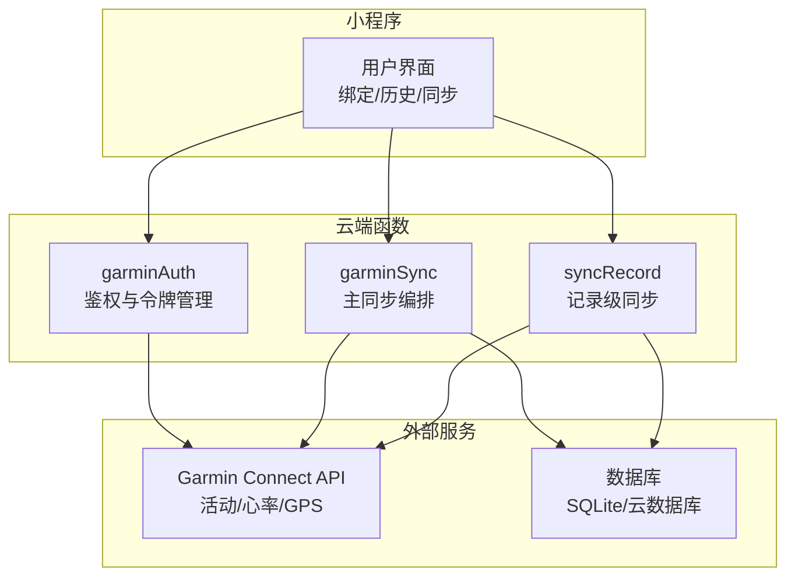
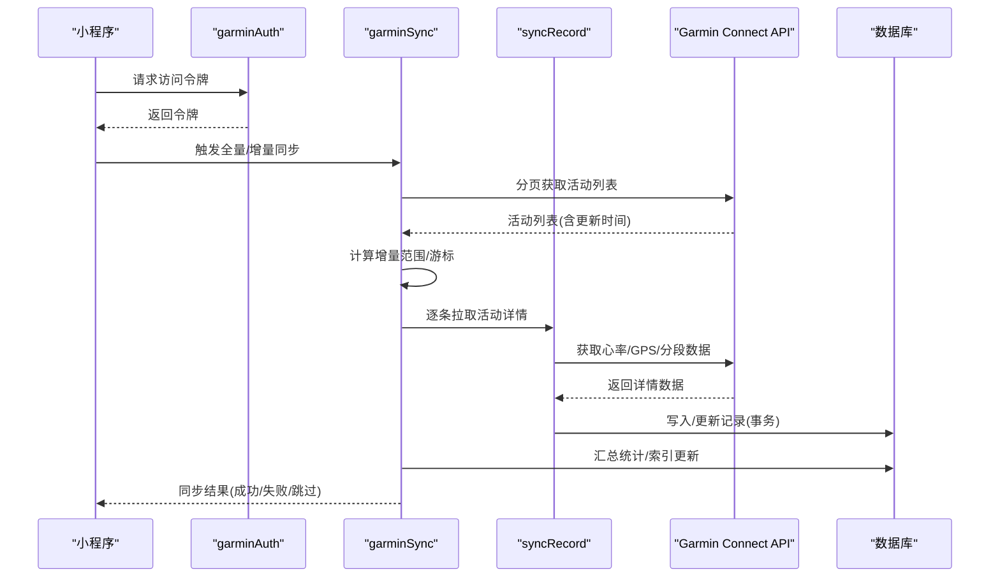
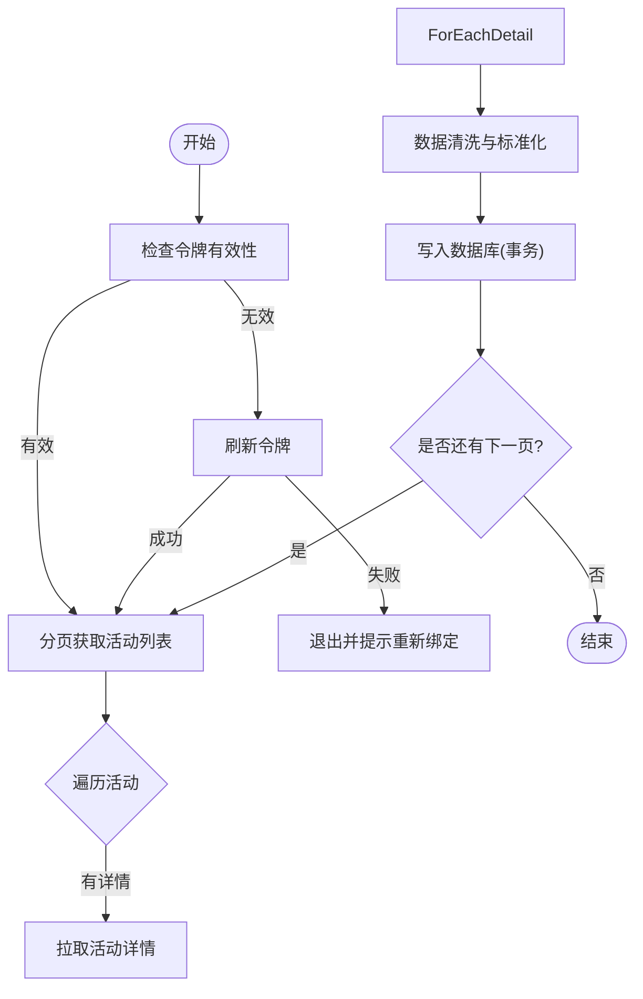
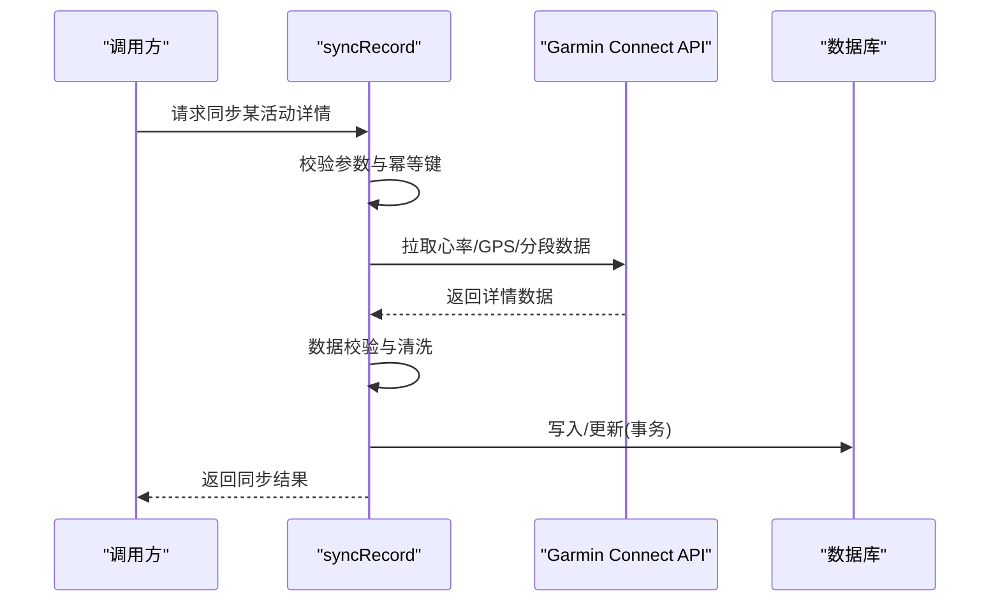
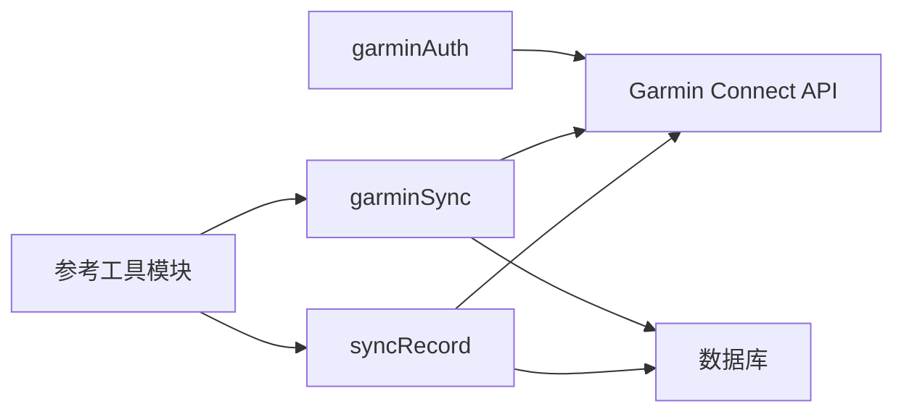

# Garmin数据同步云函数

<cite>
**本文引用的文件**   
- [cloudfunctions/garminAuth/index.js](file://cloudfunctions/garminAuth/index.js)
- [cloudfunctions/garminAuth/config.json](file://cloudfunctions/garminAuth/config.json)
- [cloudfunctions/garminSync/index.js](file://cloudfunctions/garminSync/index.js)
- [cloudfunctions/garminSync/config.json](file://cloudfunctions/garminSync/config.json)
- [cloudfunctions/syncRecord/index.js](file://cloudfunctions/syncRecord/index.js)
- [dailysync-ref/src/utils/garmin_common.ts](file://dailysync-ref/src/utils/garmin_common.ts)
- [dailysync-ref/src/utils/garmin_cn.ts](file://dailysync-ref/src/utils/garmin_cn.ts)
- [dailysync-ref/src/utils/garmin_global.ts](file://dailysync-ref/src/utils/garmin_global.ts)
- [dailysync-ref/src/utils/sqlite.ts](file://dailysync-ref/src/utils/sqlite.ts)
- [dailysync-ref/src/constant.ts](file://dailysync-ref/src/constant.ts)
</cite>

## 目录
1. [简介](#简介)
2. [项目结构](#项目结构)
3. [核心组件](#核心组件)
4. [架构总览](#架构总览)
5. [详细组件分析](#详细组件分析)
6. [依赖关系分析](#依赖关系分析)
7. [性能考虑](#性能考虑)
8. [故障排查指南](#故障排查指南)
9. [结论](#结论)
10. [附录](#附录)

## 简介
本技术文档面向Garmin数据同步云函数，系统性说明与Garmin Connect API的集成方式、数据拉取逻辑与同步策略。重点覆盖运动记录、心率数据、GPS轨迹等类型数据的处理流程，并阐述分页处理、增量同步与冲突解决机制。同时给出完整的API调用示例与数据处理代码片段路径，说明与数据库的交互模式、事务处理与性能优化策略，以及错误恢复机制与日志记录规范。

## 项目结构
本项目包含微信小程序端、云端函数与参考实现三部分：
- 微信小程序端：提供绑定、历史查看与触发同步的界面入口。
- 云端函数：
  - garminAuth：负责获取与刷新Garmin Connect访问令牌。
  - garminSync：主同步入口，协调分页拉取、数据转换与入库。
  - syncRecord：按记录维度进行细粒度同步（如单条运动记录详情）。
- dailysync-ref：参考实现，包含TypeScript源码，涵盖通用工具、区域适配（中国/全球）、SQLite持久化与常量定义。

**图表来源** 
- [cloudfunctions/garminAuth/index.js](file://cloudfunctions/garminAuth/index.js)
- [cloudfunctions/garminSync/index.js](file://cloudfunctions/garminSync/index.js)
- [cloudfunctions/syncRecord/index.js](file://cloudfunctions/syncRecord/index.js)

**章节来源**
- [cloudfunctions/garminAuth/index.js](file://cloudfunctions/garminAuth/index.js)
- [cloudfunctions/garminSync/index.js](file://cloudfunctions/garminSync/index.js)
- [cloudfunctions/syncRecord/index.js](file://cloudfunctions/syncRecord/index.js)

## 核心组件
- 鉴权模块（garminAuth）
  - 职责：登录Garmin Connect、获取访问令牌、刷新令牌、处理会话状态。
  - 关键输入：用户名/密码或授权码、环境配置。
  - 关键输出：访问令牌、过期时间、刷新令牌。
  - 错误处理：网络异常、认证失败、令牌刷新失败。
  - 日志：记录登录成功/失败、令牌刷新过程。

- 主同步模块（garminSync）
  - 职责：分页拉取活动列表、按活动ID拉取详情（含心率、GPS轨迹），数据清洗与标准化，写入数据库。
  - 增量策略：基于更新时间戳或游标分页，避免重复拉取。
  - 冲突解决：以服务端最新时间为准，采用“覆盖更新”或“合并字段”策略。
  - 事务处理：批量写入使用事务保证一致性。
  - 性能优化：并发请求限制、缓存最近页游标、去重索引。

- 记录级同步（syncRecord）
  - 职责：针对单条活动详情进行精细化同步，包括心率序列、GPS轨迹点、分段数据等。
  - 幂等性：通过唯一键（activityId+数据类型）确保重复调用不产生脏数据。
  - 错误恢复：失败重试、退避策略、断点续传。

**章节来源**
- [cloudfunctions/garminAuth/index.js](file://cloudfunctions/garminAuth/index.js)
- [cloudfunctions/garminSync/index.js](file://cloudfunctions/garminSync/index.js)
- [cloudfunctions/syncRecord/index.js](file://cloudfunctions/syncRecord/index.js)

## 架构总览
整体数据流从小程序触发云函数开始，经鉴权后调用Garmin Connect API，拉取活动列表与详情，再转换为统一模型并持久化到数据库。参考实现中的工具模块提供区域适配与SQLite操作能力。

**图表来源** 
- [cloudfunctions/garminAuth/index.js](file://cloudfunctions/garminAuth/index.js)
- [cloudfunctions/garminSync/index.js](file://cloudfunctions/garminSync/index.js)
- [cloudfunctions/syncRecord/index.js](file://cloudfunctions/syncRecord/index.js)

## 详细组件分析

### 鉴权模块（garminAuth）
- 功能要点
  - 支持不同区域的登录接口（中国/全球），依据配置选择对应域名与参数。
  - 令牌生命周期管理：首次登录获取、过期前刷新、失败重试。
  - 安全存储：敏感信息加密保存，最小权限原则。
- 错误处理
  - 网络超时：指数退避重试。
  - 认证失败：提示重新绑定账号。
  - 令牌刷新失败：清理本地缓存并引导重新登录。
- 日志规范
  - 记录登录尝试、成功/失败原因、令牌有效期。
  - 脱敏敏感字段（如密码、令牌值）。

**章节来源**
- [cloudfunctions/garminAuth/index.js](file://cloudfunctions/garminAuth/index.js)
- [cloudfunctions/garminAuth/config.json](file://cloudfunctions/garminAuth/config.json)

### 主同步模块（garminSync）
- 分页与增量
  - 使用更新时间戳或游标进行分页，仅拉取新增/更新的记录。
  - 维护本地游标或最后更新时间，避免重复拉取。
- 数据拉取流程
  - 第一步：拉取活动列表（分页）。
  - 第二步：对每个活动拉取详情（心率、GPS轨迹、分段）。
  - 第三步：数据清洗与标准化（单位换算、缺失值填充、坐标格式统一）。
- 写入与事务
  - 批量写入使用事务，保证原子性。
  - 冲突解决：以服务端更新时间为准，覆盖旧记录；必要时保留版本差异日志。
- 性能优化
  - 并发控制：限制同时请求数，避免触发限流。
  - 缓存最近页游标，减少重复计算。
  - 索引优化：为activityId、updatedAt建立索引。

**图表来源** 
- [cloudfunctions/garminSync/index.js](file://cloudfunctions/garminSync/index.js)

**章节来源**
- [cloudfunctions/garminSync/index.js](file://cloudfunctions/garminSync/index.js)

### 记录级同步（syncRecord）
- 功能要点
  - 针对单条活动详情进行精细化同步，包括心率序列、GPS轨迹点、分段数据。
  - 幂等写入：通过唯一键（activityId+数据类型）确保重复调用不产生脏数据。
- 错误恢复
  - 失败重试：指数退避与最大重试次数。
  - 断点续传：记录已处理进度，支持中断后继续。
- 数据校验
  - 必填字段校验、数值范围校验、时间顺序校验。
  - 异常数据隔离与告警。

**图表来源** 
- [cloudfunctions/syncRecord/index.js](file://cloudfunctions/syncRecord/index.js)

**章节来源**
- [cloudfunctions/syncRecord/index.js](file://cloudfunctions/syncRecord/index.js)

### 参考实现工具模块（dailysync-ref）
- 通用工具（garmin_common.ts）
  - 提供统一的HTTP客户端封装、错误码映射、重试策略。
- 区域适配（garmin_cn.ts / garmin_global.ts）
  - 根据区域选择不同域名、参数与响应格式。
- SQLite持久化（sqlite.ts）
  - 提供连接池、事务封装、批量插入与查询优化。
- 常量定义（constant.ts）
  - 定义API路径、分页大小、超时时间、重试次数等。

**章节来源**
- [dailysync-ref/src/utils/garmin_common.ts](file://dailysync-ref/src/utils/garmin_common.ts)
- [dailysync-ref/src/utils/garmin_cn.ts](file://dailysync-ref/src/utils/garmin_cn.ts)
- [dailysync-ref/src/utils/garmin_global.ts](file://dailysync-ref/src/utils/garmin_global.ts)
- [dailysync-ref/src/utils/sqlite.ts](file://dailysync-ref/src/utils/sqlite.ts)
- [dailysync-ref/src/constant.ts](file://dailysync-ref/src/constant.ts)

## 依赖关系分析
- 模块耦合
  - garminAuth与garminSync松耦合，通过令牌传递解耦。
  - garminSync与syncRecord通过活动ID与数据类型解耦。
  - 参考实现工具模块被云端函数复用，提升可维护性。
- 外部依赖
  - Garmin Connect API：受限于速率限制与可用性，需实现重试与降级。
  - 数据库：建议使用连接池与事务，保障一致性与性能。

**图表来源** 
- [cloudfunctions/garminAuth/index.js](file://cloudfunctions/garminAuth/index.js)
- [cloudfunctions/garminSync/index.js](file://cloudfunctions/garminSync/index.js)
- [cloudfunctions/syncRecord/index.js](file://cloudfunctions/syncRecord/index.js)
- [dailysync-ref/src/utils/garmin_common.ts](file://dailysync-ref/src/utils/garmin_common.ts)

**章节来源**
- [cloudfunctions/garminAuth/index.js](file://cloudfunctions/garminAuth/index.js)
- [cloudfunctions/garminSync/index.js](file://cloudfunctions/garminSync/index.js)
- [cloudfunctions/syncRecord/index.js](file://cloudfunctions/syncRecord/index.js)
- [dailysync-ref/src/utils/garmin_common.ts](file://dailysync-ref/src/utils/garmin_common.ts)

## 性能考虑
- 并发控制
  - 限制同时请求数，避免触发Garmin API限流。
  - 使用队列与信号量管理任务调度。
- 缓存策略
  - 缓存最近页游标与活动列表，减少重复拉取。
  - 热点数据（如用户配置）短期缓存。
- 数据库优化
  - 批量写入与事务，减少IO开销。
  - 合理索引设计，加速查询与去重。
- 资源监控
  - 监控内存与CPU使用，防止泄漏。
  - 记录关键指标（拉取耗时、成功率、失败率）。

[本节为通用指导，无需特定文件来源]

## 故障排查指南
- 常见问题
  - 令牌失效：检查登录状态与刷新逻辑，必要时引导重新绑定。
  - 拉取失败：检查网络连通性、API限流与错误码映射。
  - 数据不一致：核对更新时间戳与冲突解决策略，查看差异日志。
- 调试建议
  - 开启详细日志，记录请求与响应摘要（脱敏）。
  - 使用模拟数据验证数据清洗与写入逻辑。
  - 逐步缩小问题范围（鉴权→列表→详情→写入）。
- 恢复策略
  - 失败重试与指数退避。
  - 断点续传与进度记录。
  - 回滚机制与数据备份。

**章节来源**
- [cloudfunctions/garminAuth/index.js](file://cloudfunctions/garminAuth/index.js)
- [cloudfunctions/garminSync/index.js](file://cloudfunctions/garminSync/index.js)
- [cloudfunctions/syncRecord/index.js](file://cloudfunctions/syncRecord/index.js)

## 结论
本技术文档系统阐述了Garmin数据同步云函数的架构与实现细节，涵盖鉴权、分页拉取、增量同步、冲突解决、事务处理与性能优化等方面。通过模块化设计与参考实现工具，提升了系统的可维护性与扩展性。建议在生产环境中加强监控与告警，持续优化性能与稳定性。

[本节为总结性内容，无需特定文件来源]

## 附录
- API调用示例路径
  - 鉴权：[cloudfunctions/garminAuth/index.js](file://cloudfunctions/garminAuth/index.js)
  - 主同步：[cloudfunctions/garminSync/index.js](file://cloudfunctions/garminSync/index.js)
  - 记录级同步：[cloudfunctions/syncRecord/index.js](file://cloudfunctions/syncRecord/index.js)
- 数据处理代码片段路径
  - 通用工具：[dailysync-ref/src/utils/garmin_common.ts](file://dailysync-ref/src/utils/garmin_common.ts)
  - 区域适配：[dailysync-ref/src/utils/garmin_cn.ts](file://dailysync-ref/src/utils/garmin_cn.ts), [dailysync-ref/src/utils/garmin_global.ts](file://dailysync-ref/src/utils/garmin_global.ts)
  - SQLite操作：[dailysync-ref/src/utils/sqlite.ts](file://dailysync-ref/src/utils/sqlite.ts)
  - 常量定义：[dailysync-ref/src/constant.ts](file://dailysync-ref/src/constant.ts)

[本节为附录信息，无需特定文件来源]