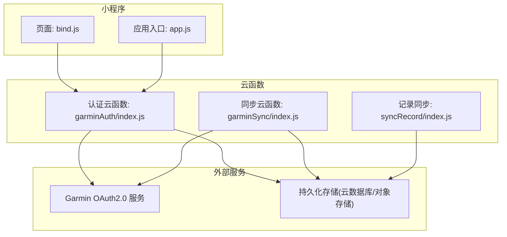
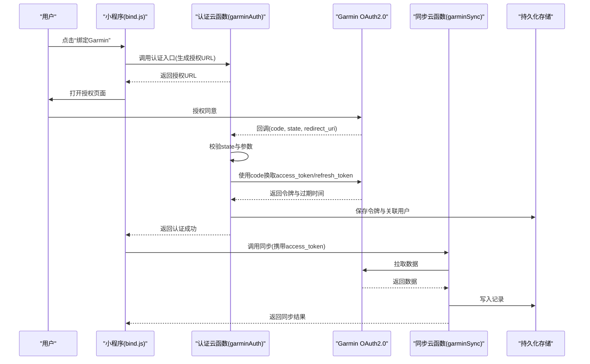
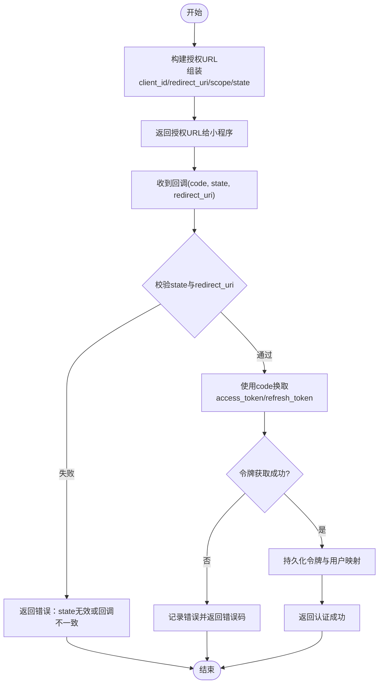
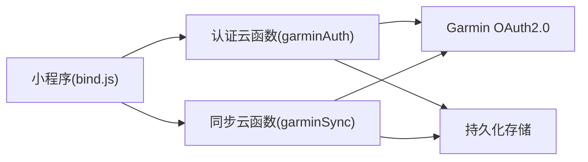

# Garmin认证云函数

<cite>
**本文引用的文件**   
- [cloudfunctions/garminAuth/index.js](file://cloudfunctions/garminAuth/index.js)
- [cloudfunctions/garminAuth/config.json](file://cloudfunctions/garminAuth/config.json)
- [cloudfunctions/garminAuth/package.json](file://cloudfunctions/garminAuth/package.json)
- [cloudfunctions/garminSync/index.js](file://cloudfunctions/garminSync/index.js)
- [cloudfunctions/garminSync/config.json](file://cloudfunctions/garminSync/config.json)
- [cloudfunctions/garminSync/package.json](file://cloudfunctions/garminSync/package.json)
- [cloudfunctions/syncRecord/index.js](file://cloudfunctions/syncRecord/index.js)
- [cloudfunctions/syncRecord/package.json](file://cloudfunctions/syncRecord/package.json)
- [dailysync-ref/src/utils/garmin_common.ts](file://dailysync-ref/src/utils/garmin_common.ts)
- [dailysync-ref/src/utils/garmin_cn.ts](file://dailysync-ref/src/utils/garmin_cn.ts)
- [dailysync-ref/src/utils/garmin_global.ts](file://dailysync-ref/src/utils/garmin_global.ts)
- [dailysync-ref/src/constant.ts](file://dailysync-ref/src/constant.ts)
- [miniprogram/pages/bind/bind.js](file://miniprogram/pages/bind/bind.js)
- [miniprogram/app.js](file://miniprogram/app.js)
</cite>

## 目录
1. [简介](#简介)
2. [项目结构](#项目结构)
3. [核心组件](#核心组件)
4. [架构总览](#架构总览)
5. [详细组件分析](#详细组件分析)
6. [依赖关系分析](#依赖关系分析)
7. [性能考虑](#性能考虑)
8. [故障排查指南](#故障排查指南)
9. [结论](#结论)
10. [附录](#附录)

## 简介
本技术文档面向Garmin认证云函数，系统性阐述Garmin账户的OAuth2.0认证流程、令牌管理机制、配置文件结构与参数含义、错误处理策略与安全最佳实践。文档同时覆盖小程序端与云函数之间的交互方式，帮助读者从用户登录到获取访问令牌的完整链路建立清晰认知，并提供调试方法与常见问题定位建议。

## 项目结构
本项目采用“小程序 + 云函数 + 参考实现”的组织方式：
- 小程序端负责引导用户授权、跳转回调与状态展示。
- 云函数提供认证入口、回调处理、令牌存储与同步能力。
- dailysync-ref为参考实现，包含对Garmin中国与国际站点的通用逻辑与差异处理。

图表来源
- [cloudfunctions/garminAuth/index.js](file://cloudfunctions/garminAuth/index.js)
- [cloudfunctions/garminSync/index.js](file://cloudfunctions/garminSync/index.js)
- [cloudfunctions/syncRecord/index.js](file://cloudfunctions/syncRecord/index.js)
- [miniprogram/pages/bind/bind.js](file://miniprogram/pages/bind/bind.js)
- [miniprogram/app.js](file://miniprogram/app.js)

章节来源
- [cloudfunctions/garminAuth/index.js](file://cloudfunctions/garminAuth/index.js)
- [cloudfunctions/garminAuth/config.json](file://cloudfunctions/garminAuth/config.json)
- [cloudfunctions/garminSync/index.js](file://cloudfunctions/garminSync/index.js)
- [cloudfunctions/garminSync/config.json](file://cloudfunctions/garminSync/config.json)
- [cloudfunctions/syncRecord/index.js](file://cloudfunctions/syncRecord/index.js)
- [miniprogram/pages/bind/bind.js](file://miniprogram/pages/bind/bind.js)
- [miniprogram/app.js](file://miniprogram/app.js)

## 核心组件
- 认证云函数（garminAuth）
  - 职责：生成授权URL、处理回调、校验state、换取令牌、刷新令牌、安全校验与返回结果。
  - 关键输入：配置项（客户端ID、密钥、回调地址、站点选择等）、请求参数（code、state、redirect_uri等）。
  - 关键输出：访问令牌、刷新令牌、过期时间、错误信息。
- 同步云函数（garminSync）
  - 职责：使用访问令牌拉取数据、增量同步、错误重试与幂等控制。
- 记录同步（syncRecord）
  - 职责：将同步结果写入持久化存储，供小程序查询或展示。
- 小程序端（bind页面）
  - 职责：触发认证、接收回调、展示绑定状态、调用云函数完成后续操作。

章节来源
- [cloudfunctions/garminAuth/index.js](file://cloudfunctions/garminAuth/index.js)
- [cloudfunctions/garminAuth/config.json](file://cloudfunctions/garminAuth/config.json)
- [cloudfunctions/garminSync/index.js](file://cloudfunctions/garminSync/index.js)
- [cloudfunctions/garminSync/config.json](file://cloudfunctions/garminSync/config.json)
- [cloudfunctions/syncRecord/index.js](file://cloudfunctions/syncRecord/index.js)
- [miniprogram/pages/bind/bind.js](file://miniprogram/pages/bind/bind.js)

## 架构总览
整体认证与同步流程如下：
- 小程序端发起认证，调用认证云函数生成授权链接。
- 用户在Garmin授权页完成授权后，回调至云函数。
- 云函数校验state与回调参数，向Garmin换取访问令牌与刷新令牌。
- 云函数保存令牌并返回成功状态给小程序。
- 小程序在需要时调用同步云函数，使用访问令牌拉取数据。

图表来源
- [cloudfunctions/garminAuth/index.js](file://cloudfunctions/garminAuth/index.js)
- [cloudfunctions/garminSync/index.js](file://cloudfunctions/garminSync/index.js)
- [miniprogram/pages/bind/bind.js](file://miniprogram/pages/bind/bind.js)

## 详细组件分析

### 认证云函数（garminAuth）
- 功能要点
  - 生成授权URL：组装客户端ID、重定向地址、scope、state等参数。
  - 处理回调：校验state防CSRF，解析code，调用Garmin换取令牌。
  - 令牌管理：缓存access_token与refresh_token，支持自动刷新。
  - 安全校验：验证redirect_uri一致性、限制来源域名、敏感信息不泄露。
  - 错误处理：捕获网络异常、授权失败、令牌无效等场景并返回明确错误码。
- 配置项说明（config.json）
  - 客户端ID与密钥：用于OAuth2.0鉴权。
  - 回调URL：必须与Garmin后台配置一致，且需HTTPS。
  - 站点选择：区分Garmin中国与国际站点。
  - 安全设置：state长度、白名单域名、超时与重试策略。
- 数据结构与复杂度
  - 令牌对象包含access_token、refresh_token、expires_in、token_type等字段。
  - 状态机：未认证 -> 已授权 -> 已绑定 -> 令牌刷新中 -> 刷新成功/失败。
  - 时间复杂度：令牌交换O(1)，刷新O(1)，状态校验O(1)。
- 优化建议
  - 使用连接池与HTTP缓存减少重复握手。
  - 对频繁调用的接口做本地缓存与限流。
  - 异步任务队列处理批量同步，避免阻塞主流程。

章节来源
- [cloudfunctions/garminAuth/index.js](file://cloudfunctions/garminAuth/index.js)
- [cloudfunctions/garminAuth/config.json](file://cloudfunctions/garminAuth/config.json)

#### 认证流程图（算法级）

图表来源
- [cloudfunctions/garminAuth/index.js](file://cloudfunctions/garminAuth/index.js)

### 同步云函数（garminSync）
- 功能要点
  - 使用access_token调用Garmin API拉取运动记录。
  - 支持增量同步与分页处理。
  - 错误重试与退避策略，保证幂等性。
- 配置项说明（config.json）
  - 站点选择、API版本、超时与重试次数。
  - 数据存储路径与表名。
- 数据结构与复杂度
  - 请求体包含分页参数、时间范围、排序规则。
  - 响应体包含记录列表、分页游标、错误信息。
  - 时间复杂度：单次拉取O(n)，批量同步O(k*n)。
- 优化建议
  - 使用并发拉取与合并去重。
  - 对热点数据做缓存，降低重复请求。
  - 失败重试采用指数退避与熔断保护。

章节来源
- [cloudfunctions/garminSync/index.js](file://cloudfunctions/garminSync/index.js)
- [cloudfunctions/garminSync/config.json](file://cloudfunctions/garminSync/config.json)

### 记录同步（syncRecord）
- 功能要点
  - 将同步结果写入持久化存储，确保一致性。
  - 支持事务与回滚，保证数据完整性。
- 配置项说明（package.json）
  - 依赖库版本、环境变量与运行参数。
- 数据结构与复杂度
  - 记录模型包含唯一键、时间戳、类型、内容等。
  - 插入与更新操作的时间复杂度O(log n)（索引优化）。
- 优化建议
  - 批量写入与索引优化提升性能。
  - 读写分离与分库分表应对高并发。

章节来源
- [cloudfunctions/syncRecord/index.js](file://cloudfunctions/syncRecord/index.js)
- [cloudfunctions/syncRecord/package.json](file://cloudfunctions/syncRecord/package.json)

### 小程序端（bind页面）
- 功能要点
  - 触发认证流程，接收回调并展示状态。
  - 调用同步云函数进行数据拉取。
- 交互流程
  - 用户点击绑定按钮，调用认证云函数获取授权URL。
  - 跳转到授权页面，完成后回调至小程序。
  - 显示绑定成功或失败提示。
- 错误处理
  - 网络异常重试与降级策略。
  - 授权失败提示用户重新操作。

章节来源
- [miniprogram/pages/bind/bind.js](file://miniprogram/pages/bind/bind.js)
- [miniprogram/app.js](file://miniprogram/app.js)

## 依赖关系分析
- 模块耦合
  - 认证云函数依赖配置与外部OAuth服务。
  - 同步云函数依赖认证云函数提供的令牌。
  - 小程序端依赖两个云函数的接口契约。
- 外部依赖
  - Garmin OAuth2.0服务与API。
  - 持久化存储（云数据库或对象存储）。
- 潜在循环依赖
  - 避免云函数间相互调用形成循环。
  - 通过消息队列解耦异步任务。

图表来源
- [cloudfunctions/garminAuth/index.js](file://cloudfunctions/garminAuth/index.js)
- [cloudfunctions/garminSync/index.js](file://cloudfunctions/garminSync/index.js)
- [miniprogram/pages/bind/bind.js](file://miniprogram/pages/bind/bind.js)

章节来源
- [cloudfunctions/garminAuth/index.js](file://cloudfunctions/garminAuth/index.js)
- [cloudfunctions/garminSync/index.js](file://cloudfunctions/garminSync/index.js)
- [miniprogram/pages/bind/bind.js](file://miniprogram/pages/bind/bind.js)

## 性能考虑
- 网络优化
  - 使用HTTP/2与连接池减少握手开销。
  - 合理设置超时与重试策略。
- 缓存策略
  - 对令牌与热点数据进行短期缓存。
  - 使用分布式缓存提升并发处理能力。
- 资源管理
  - 避免内存泄漏与长时间占用。
  - 监控CPU与内存使用率，及时扩容。

## 故障排查指南
- 常见问题
  - 授权失败：检查state校验与redirect_uri一致性。
  - 令牌无效：确认令牌是否过期，触发刷新机制。
  - 网络异常：检查网络连接与DNS解析。
- 调试方法
  - 启用详细日志记录，追踪请求与响应。
  - 使用模拟工具测试授权流程。
  - 监控错误码与堆栈信息。
- 恢复策略
  - 自动重试与降级处理。
  - 人工介入与手动刷新令牌。

章节来源
- [cloudfunctions/garminAuth/index.js](file://cloudfunctions/garminAuth/index.js)
- [cloudfunctions/garminSync/index.js](file://cloudfunctions/garminSync/index.js)

## 结论
本技术文档全面阐述了Garmin认证云函数的实现细节与最佳实践。通过清晰的架构图与流程图，帮助开发者理解OAuth2.0认证流程与令牌管理机制。结合性能优化与故障排查建议，确保系统稳定可靠。建议在实际部署中严格遵循安全规范，持续监控与优化系统性能。

## 附录
- 参考实现
  - Garmin通用逻辑：[dailysync-ref/src/utils/garmin_common.ts](file://dailysync-ref/src/utils/garmin_common.ts)
  - Garmin中国站：[dailysync-ref/src/utils/garmin_cn.ts](file://dailysync-ref/src/utils/garmin_cn.ts)
  - Garmin国际站：[dailysync-ref/src/utils/garmin_global.ts](file://dailysync-ref/src/utils/garmin_global.ts)
  - 常量定义：[dailysync-ref/src/constant.ts](file://dailysync-ref/src/constant.ts)
- 配置示例
  - 认证云函数配置：[cloudfunctions/garminAuth/config.json](file://cloudfunctions/garminAuth/config.json)
  - 同步云函数配置：[cloudfunctions/garminSync/config.json](file://cloudfunctions/garminSync/config.json)