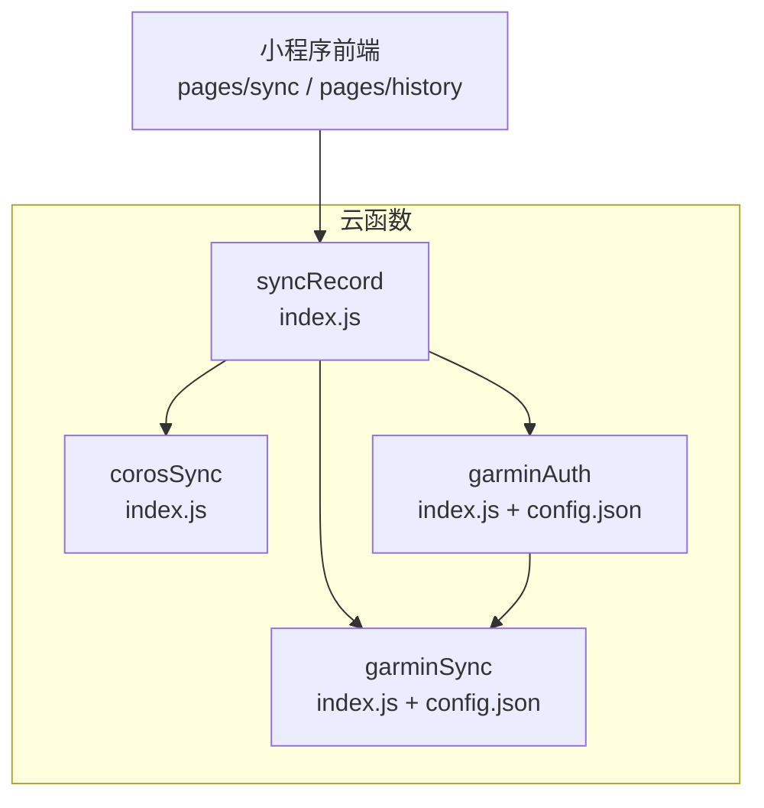
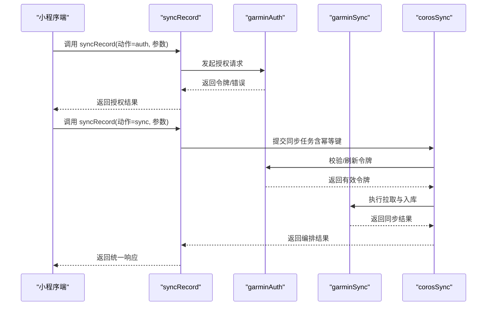
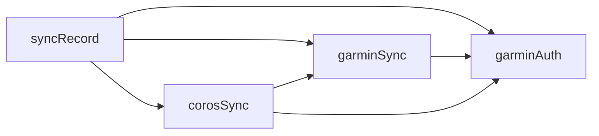

# 云函数

<cite>
**本文引用的文件**   
- [cloudfunctions/corosSync/index.js](file://cloudfunctions/corosSync/index.js)
- [cloudfunctions/corosSync/package.json](file://cloudfunctions/corosSync/package.json)
- [cloudfunctions/garminAuth/config.json](file://cloudfunctions/garminAuth/config.json)
- [cloudfunctions/garminAuth/index.js](file://cloudfunctions/garminAuth/index.js)
- [cloudfunctions/garminAuth/package.json](file://cloudfunctions/garminAuth/package.json)
- [cloudfunctions/garminSync/config.json](file://cloudfunctions/garminSync/config.json)
- [cloudfunctions/garminSync/index.js](file://cloudfunctions/garminSync/index.js)
- [cloudfunctions/garminSync/package.json](file://cloudfunctions/garminSync/package.json)
- [cloudfunctions/syncRecord/index.js](file://cloudfunctions/syncRecord/index.js)
- [cloudfunctions/syncRecord/package.json](file://cloudfunctions/syncRecord/package.json)
</cite>

## 目录
1. [简介](#简介)
2. [项目结构](#项目结构)
3. [核心组件](#核心组件)
4. [架构总览](#架构总览)
5. [详细组件分析](#详细组件分析)
6. [依赖关系分析](#依赖关系分析)
7. [性能考虑](#性能考虑)
8. [故障排查指南](#故障排查指南)
9. [结论](#结论)
10. [附录](#附录)

## 简介
本技术文档围绕云函数模块展开，覆盖以下四个云函数的职责、API 接口、数据处理逻辑与错误处理机制：
- corosSync：协调与调度相关同步任务（例如跨服务或跨域数据同步的编排）。
- garminAuth：负责 Garmin 账号授权流程（获取/刷新访问令牌等）。
- garminSync：从 Garmin 拉取运动记录并入库。
- syncRecord：统一的数据记录同步入口，供小程序端调用以触发或查询同步状态。

文档同时给出云函数之间的调用关系与数据流转图、配置项说明、调用示例、最佳实践、性能优化建议与调试技巧，帮助开发者快速上手与排障。

## 项目结构
云函数模块位于 cloudfunctions 目录下，每个云函数为一个独立子目录，包含入口 index.js、可选配置文件（如 config.json）以及依赖声明 package.json。整体采用“按功能划分”的组织方式，便于独立部署与维护。

图表来源
- [cloudfunctions/corosSync/index.js](file://cloudfunctions/corosSync/index.js)
- [cloudfunctions/garminAuth/index.js](file://cloudfunctions/garminAuth/index.js)
- [cloudfunctions/garminAuth/config.json](file://cloudfunctions/garminAuth/config.json)
- [cloudfunctions/garminSync/index.js](file://cloudfunctions/garminSync/index.js)
- [cloudfunctions/garminSync/config.json](file://cloudfunctions/garminSync/config.json)
- [cloudfunctions/syncRecord/index.js](file://cloudfunctions/syncRecord/index.js)

章节来源
- [cloudfunctions/corosSync/index.js](file://cloudfunctions/corosSync/index.js)
- [cloudfunctions/garminAuth/index.js](file://cloudfunctions/garminAuth/index.js)
- [cloudfunctions/garminAuth/config.json](file://cloudfunctions/garminAuth/config.json)
- [cloudfunctions/garminSync/index.js](file://cloudfunctions/garminSync/index.js)
- [cloudfunctions/garminSync/config.json](file://cloudfunctions/garminSync/config.json)
- [cloudfunctions/syncRecord/index.js](file://cloudfunctions/syncRecord/index.js)

## 核心组件
本节概述各云函数的职责边界与对外暴露的能力，便于理解系统分工。

- corosSync
  - 职责：编排与协调跨服务/跨域的同步任务，确保顺序、重试与幂等性。
  - 典型输入：任务类型、目标服务标识、参数对象。
  - 典型输出：任务执行结果、状态码、错误信息。
  - 关键点：失败重试、限流、并发控制、幂等键。

- garminAuth
  - 职责：完成 Garmin 账号授权，管理访问令牌生命周期（获取、刷新、失效处理）。
  - 典型输入：授权码/用户名密码（取决于实现）、回调地址、作用域。
  - 典型输出：访问令牌、过期时间、刷新令牌（如有）。
  - 关键点：安全存储敏感信息、网络异常重试、令牌缓存策略。

- garminSync
  - 职责：基于有效令牌拉取 Garmin 运动记录，进行数据清洗与入库。
  - 典型输入：用户标识、时间范围、分页参数。
  - 典型输出：同步条数、新增/更新数量、错误详情。
  - 关键点：分页拉取、去重、增量同步、失败重试与断点续传。

- syncRecord
  - 职责：面向小程序的统一入口，聚合上述能力，提供简洁 API。
  - 典型输入：动作（auth/sync/query）、必要参数。
  - 典型输出：统一响应体（code、message、data）。
  - 关键点：参数校验、鉴权、路由分发、错误封装。

章节来源
- [cloudfunctions/corosSync/index.js](file://cloudfunctions/corosSync/index.js)
- [cloudfunctions/garminAuth/index.js](file://cloudfunctions/garminAuth/index.js)
- [cloudfunctions/garminAuth/config.json](file://cloudfunctions/garminAuth/config.json)
- [cloudfunctions/garminSync/index.js](file://cloudfunctions/garminSync/index.js)
- [cloudfunctions/garminSync/config.json](file://cloudfunctions/garminSync/config.json)
- [cloudfunctions/syncRecord/index.js](file://cloudfunctions/syncRecord/index.js)

## 架构总览
下图展示了小程序端通过 syncRecord 触发授权与同步，再由 garminAuth 与 garminSync 协作完成 Garmin 数据拉取，最终由 corosSync 进行任务编排与一致性保障的整体流程。

图表来源
- [cloudfunctions/syncRecord/index.js](file://cloudfunctions/syncRecord/index.js)
- [cloudfunctions/garminAuth/index.js](file://cloudfunctions/garminAuth/index.js)
- [cloudfunctions/garminSync/index.js](file://cloudfunctions/garminSync/index.js)
- [cloudfunctions/corosSync/index.js](file://cloudfunctions/corosSync/index.js)

## 详细组件分析

### corosSync
- 设计要点
  - 任务编排：根据任务类型选择下游服务（如 garminSync），并注入上下文（用户、时间范围、分页等）。
  - 幂等与重试：为每次任务生成幂等键，支持指数退避重试；对可重试错误进行自动恢复。
  - 并发与限流：限制并发度，避免下游服务过载；对慢请求设置超时。
  - 结果聚合：汇总下游返回，统一错误码与消息格式。
- 关键数据结构
  - 任务描述：包含任务类型、参数、幂等键、重试次数、超时时间等。
  - 执行上下文：用户标识、令牌、时间窗口、分页游标等。
  - 结果对象：状态码、数据、错误信息、耗时统计。
- 错误处理
  - 区分可重试与不可重试错误；对网络异常、令牌过期、业务校验失败分别处理。
  - 记录详细日志，便于定位问题。
- 性能优化
  - 批量拉取与合并写入；使用连接池与缓存减少重复请求。
  - 合理设置超时与并发上限，避免雪崩。
- 调用示例（概念）
  - 输入：{ action: "sync", service: "garminSync", params: { userId, startTime, endTime } }
  - 输出：{ code: 0, message: "成功", data: { syncedCount, errors } }

章节来源
- [cloudfunctions/corosSync/index.js](file://cloudfunctions/corosSync/index.js)

### garminAuth
- 设计要点
  - 授权流程：支持多种授权模式（如授权码、用户名密码），根据配置选择对应实现。
  - 令牌管理：获取访问令牌与刷新令牌，维护有效期；过期时自动刷新。
  - 安全存储：敏感信息加密存储，最小权限原则。
- 配置选项（config.json）
  - 客户端标识、密钥、回调地址、作用域、超时、重试策略等。
- 错误处理
  - 网络异常、授权失败、令牌无效等场景的错误分类与提示。
  - 失败时的回滚与清理临时状态。
- 性能优化
  - 令牌缓存与会话复用；批量请求合并。
- 调用示例（概念）
  - 输入：{ action: "authorize", grantType, code/token, redirectUri, scope }
  - 输出：{ code: 0, message: "成功", data: { accessToken, expiresIn, refreshToken } }

章节来源
- [cloudfunctions/garminAuth/index.js](file://cloudfunctions/garminAuth/index.js)
- [cloudfunctions/garminAuth/config.json](file://cloudfunctions/garminAuth/config.json)

### garminSync
- 设计要点
  - 数据拉取：基于分页接口循环拉取运动记录，支持时间范围过滤。
  - 数据清洗：字段映射、单位换算、去重、缺失值处理。
  - 入库策略：批量插入/更新，事务保证一致性。
- 配置选项（config.json）
  - 数据库连接、批大小、超时、重试、字段映射规则等。
- 错误处理
  - 网络错误重试、部分失败记录隔离、失败重试队列。
  - 记录失败明细，便于人工干预。
- 性能优化
  - 分片并行拉取、写入缓冲、索引优化。
  - 增量同步避免全量重复。
- 调用示例（概念）
  - 输入：{ action: "sync", userId, startTime, endTime, pageToken }
  - 输出：{ code: 0, message: "成功", data: { added, updated, failed } }

章节来源
- [cloudfunctions/garminSync/index.js](file://cloudfunctions/garminSync/index.js)
- [cloudfunctions/garminSync/config.json](file://cloudfunctions/garminSync/config.json)

### syncRecord
- 设计要点
  - 统一入口：接收小程序请求，校验参数，路由到具体云函数。
  - 鉴权与限流：校验用户身份，限制调用频率。
  - 统一响应：标准化返回体，便于前端处理。
- 错误处理
  - 参数校验失败、鉴权失败、下游服务异常的分类与提示。
  - 错误码规范与日志记录。
- 性能优化
  - 请求缓存、异步任务队列、超时控制。
- 调用示例（概念）
  - 输入：{ action: "auth|sync|query", ... }
  - 输出：{ code, message, data }

章节来源
- [cloudfunctions/syncRecord/index.js](file://cloudfunctions/syncRecord/index.js)

## 依赖关系分析
- 内部依赖
  - syncRecord 依赖 garminAuth、garminSync、corosSync。
  - garminSync 依赖 garminAuth（令牌有效性）。
  - corosSync 作为编排层，依赖其他云函数执行具体任务。
- 外部依赖
  - Garmin API（授权与数据拉取）。
  - 数据库（持久化运动记录）。
  - 配置中心（动态配置加载）。
- 潜在风险
  - 循环依赖：需避免 goroutine 或模块间循环引用。
  - 单点故障：Garmin API 不可用时的降级策略。
  - 令牌泄露：敏感信息保护与最小权限。

图表来源
- [cloudfunctions/syncRecord/index.js](file://cloudfunctions/syncRecord/index.js)
- [cloudfunctions/garminAuth/index.js](file://cloudfunctions/garminAuth/index.js)
- [cloudfunctions/garminSync/index.js](file://cloudfunctions/garminSync/index.js)
- [cloudfunctions/corosSync/index.js](file://cloudfunctions/corosSync/index.js)

章节来源
- [cloudfunctions/syncRecord/index.js](file://cloudfunctions/syncRecord/index.js)
- [cloudfunctions/garminAuth/index.js](file://cloudfunctions/garminAuth/index.js)
- [cloudfunctions/garminSync/index.js](file://cloudfunctions/garminSync/index.js)
- [cloudfunctions/corosSync/index.js](file://cloudfunctions/corosSync/index.js)

## 性能考虑
- 并发与限流
  - 设置合理的并发上限，避免下游服务过载。
  - 使用令牌桶或漏桶算法进行限流。
- 缓存与会话
  - 缓存访问令牌与热点数据，减少重复请求。
  - 复用网络连接与数据库连接。
- 批量与增量
  - 批量拉取与写入，降低 I/O 开销。
  - 增量同步避免全量重复。
- 超时与重试
  - 设置合理超时时间，避免长时间阻塞。
  - 指数退避重试，区分可重试与不可重试错误。
- 监控与告警
  - 记录关键指标（QPS、延迟、错误率）。
  - 设置阈值告警，及时发现异常。

## 故障排查指南
- 常见问题
  - 授权失败：检查客户端标识、密钥、回调地址与作用域。
  - 令牌过期：确认刷新逻辑与缓存策略。
  - 数据不一致：核对幂等键与去重逻辑。
  - 性能瓶颈：观察并发、超时、I/O 等待。
- 调试技巧
  - 开启详细日志，记录请求与响应。
  - 使用模拟数据与沙箱环境测试。
  - 逐步缩小问题范围，定位具体环节。
- 错误分类
  - 网络错误：重试与降级。
  - 业务错误：提示用户或修正参数。
  - 系统错误：回滚与告警。

## 结论
本云函数模块通过清晰的职责划分与统一的入口设计，实现了 Garmin 数据同步的完整链路。corosSync 提供编排与一致性保障，garminAuth 管理授权与令牌，garminSync 负责数据拉取与入库，syncRecord 作为统一入口简化前端调用。通过合理的配置、错误处理与性能优化，系统具备良好的可扩展性与稳定性。

## 附录
- 配置项参考
  - garminAuth/config.json：客户端标识、密钥、回调地址、作用域、超时、重试策略。
  - garminSync/config.json：数据库连接、批大小、超时、重试、字段映射规则。
- 调用示例（概念）
  - 授权：{ action: "authorize", grantType, code, redirectUri, scope }
  - 同步：{ action: "sync", userId, startTime, endTime, pageToken }
  - 查询：{ action: "query", userId, startTime, endTime }
- 最佳实践
  - 使用幂等键避免重复执行。
  - 合理设置超时与重试策略。
  - 分离敏感配置与代码。
  - 持续监控与告警。