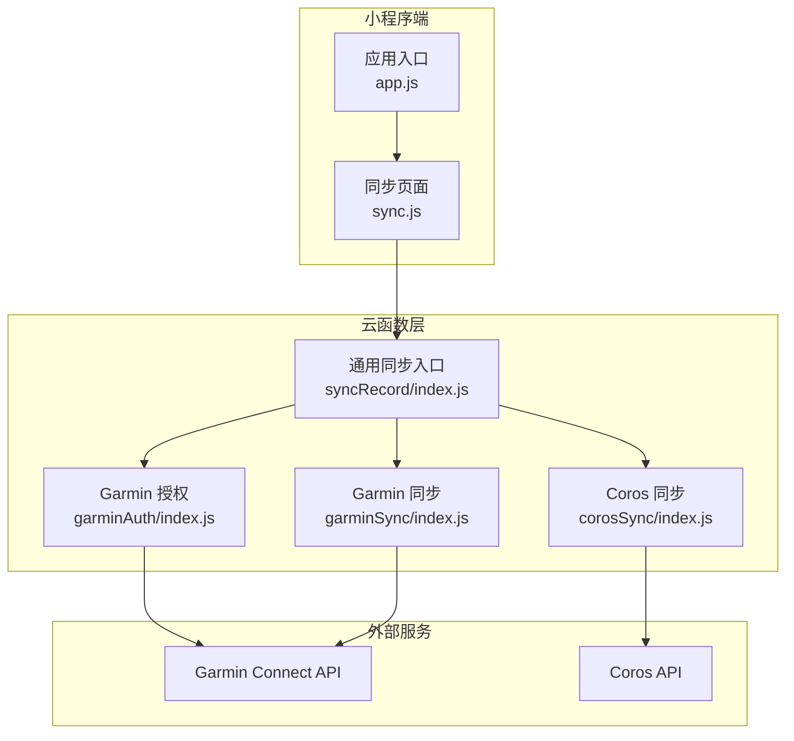
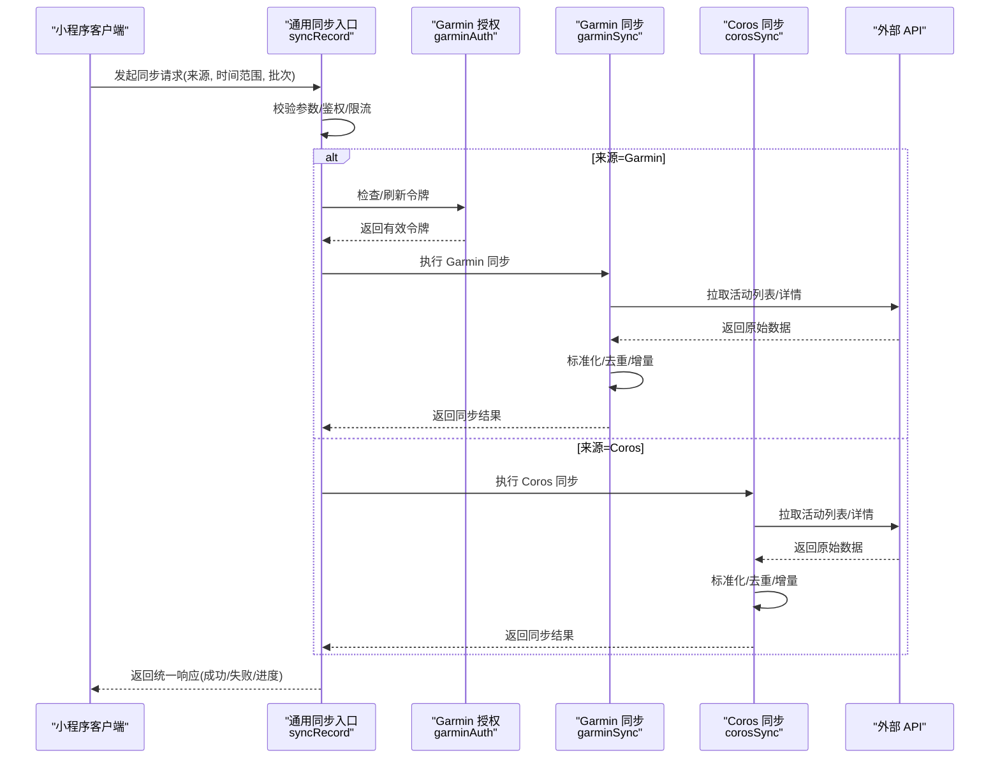
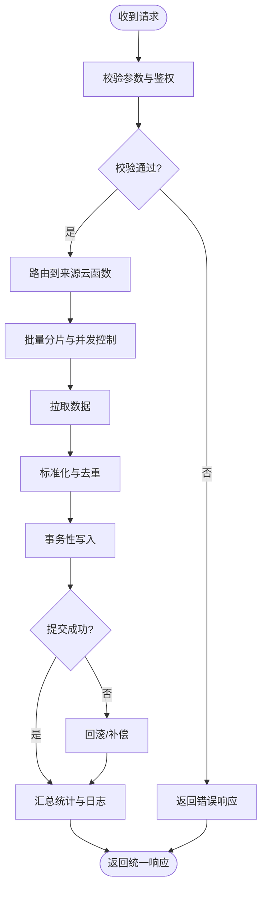
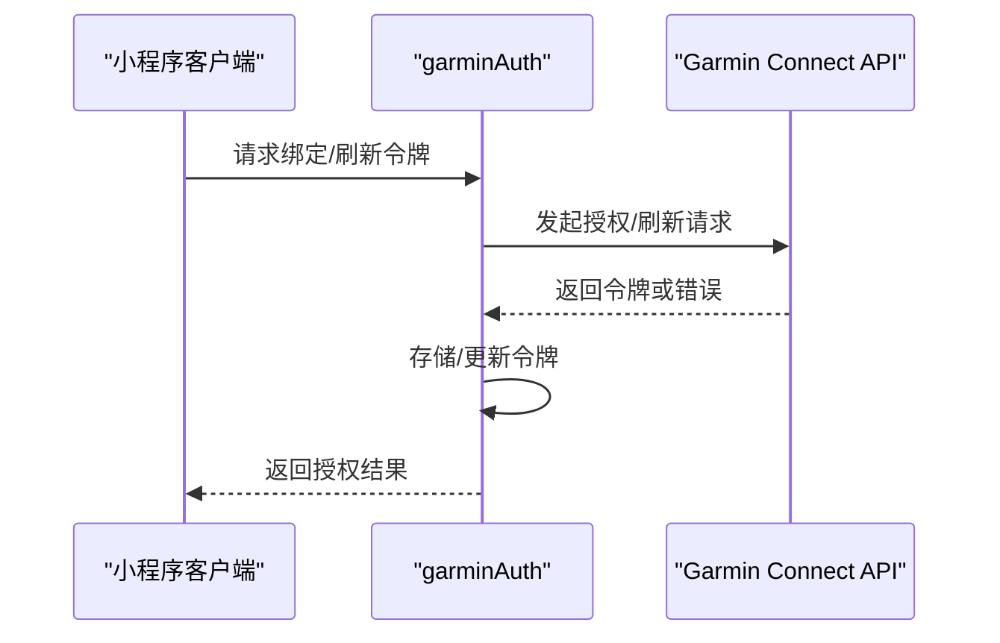
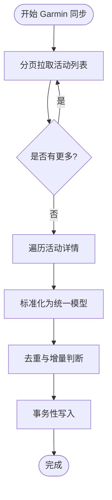
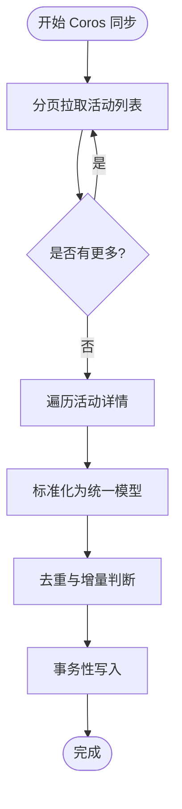
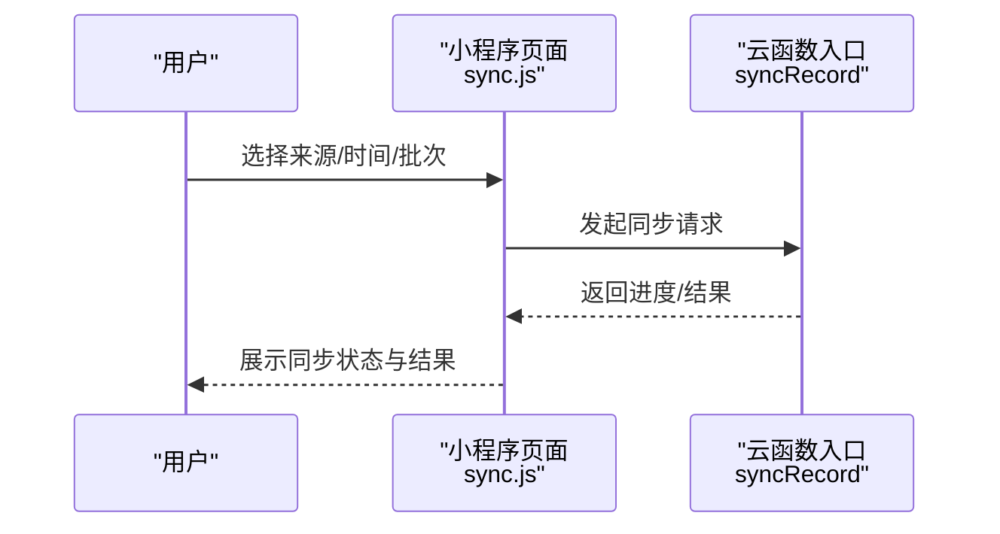
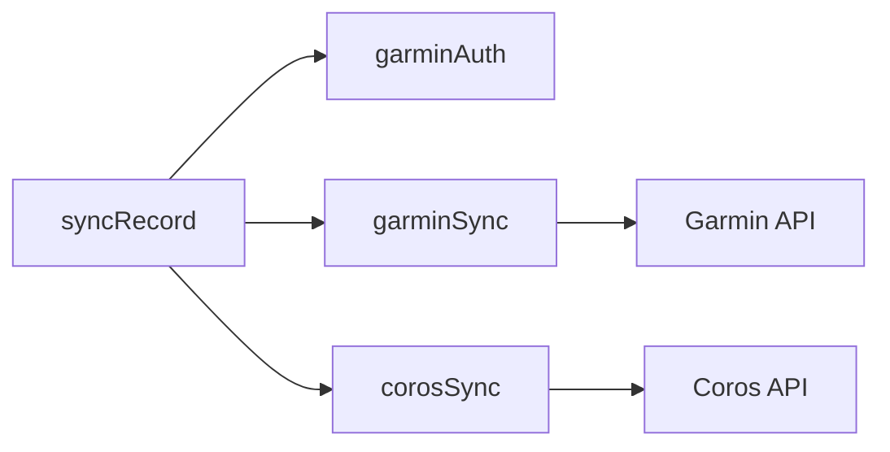

# 记录同步云函数

<cite>
**本文引用的文件**   
- [cloudfunctions/syncRecord/index.js](file://cloudfunctions/syncRecord/index.js)
- [cloudfunctions/garminSync/index.js](file://cloudfunctions/garminSync/index.js)
- [cloudfunctions/garminAuth/index.js](file://cloudfunctions/garminAuth/index.js)
- [cloudfunctions/corosSync/index.js](file://cloudfunctions/corosSync/index.js)
- [miniprogram/pages/sync/sync.js](file://miniprogram/pages/sync/sync.js)
- [miniprogram/app.js](file://miniprogram/app.js)
</cite>

## 目录
1. [简介](#简介)
2. [项目结构](#项目结构)
3. [核心组件](#核心组件)
4. [架构总览](#架构总览)
5. [详细组件分析](#详细组件分析)
6. [依赖关系分析](#依赖关系分析)
7. [性能考虑](#性能考虑)
8. [故障排查指南](#故障排查指南)
9. [结论](#结论)
10. [附录](#附录)

## 简介
本技术文档面向“记录同步云函数”子系统，覆盖运动记录的统一同步逻辑、数据格式转换与存储策略，以及多来源（Garmin、Coros等）数据的标准化处理流程。文档还包含批量操作、并发控制、数据一致性保证机制，提供完整的数据同步示例（请求参数、响应格式、错误码），并说明与前端小程序的交互模式与实时同步机制。最后给出性能监控与故障排查指南，帮助开发者快速定位问题与优化系统。

## 项目结构
本项目采用微信小程序 + 云函数的架构：
- 云函数层：按来源或职责划分多个云函数，如 Garmin 授权与同步、Coros 同步、通用记录同步入口等。
- 小程序层：提供用户交互页面，触发同步、展示结果与状态。

图表来源
- [cloudfunctions/syncRecord/index.js](file://cloudfunctions/syncRecord/index.js)
- [cloudfunctions/garminAuth/index.js](file://cloudfunctions/garminAuth/index.js)
- [cloudfunctions/garminSync/index.js](file://cloudfunctions/garminSync/index.js)
- [cloudfunctions/corosSync/index.js](file://cloudfunctions/corosSync/index.js)
- [miniprogram/pages/sync/sync.js](file://miniprogram/pages/sync/sync.js)
- [miniprogram/app.js](file://miniprogram/app.js)

章节来源
- [cloudfunctions/syncRecord/index.js](file://cloudfunctions/syncRecord/index.js)
- [cloudfunctions/garminSync/index.js](file://cloudfunctions/garminSync/index.js)
- [cloudfunctions/garminAuth/index.js](file://cloudfunctions/garminAuth/index.js)
- [cloudfunctions/corosSync/index.js](file://cloudfunctions/corosSync/index.js)
- [miniprogram/pages/sync/sync.js](file://miniprogram/pages/sync/sync.js)
- [miniprogram/app.js](file://miniprogram/app.js)

## 核心组件
- 通用同步入口（syncRecord）
  - 职责：接收小程序请求，解析来源类型，路由到对应来源的云函数；负责基础校验、鉴权、限流与幂等键生成。
  - 关键能力：批量任务编排、并发控制、重试与回滚、事务性写入。
- Garmin 授权（garminAuth）
  - 职责：完成 OAuth/登录流程，获取访问令牌与刷新令牌，维护会话状态。
  - 关键能力：令牌生命周期管理、异常重试、安全存储。
- Garmin 同步（garminSync）
  - 职责：拉取 Garmin 活动数据，进行字段映射与标准化，去重与增量更新，落库。
  - 关键能力：分页拉取、速率限制、失败重试、数据校验。
- Coros 同步（corosSync）
  - 职责：拉取 Coros 活动数据，标准化为统一模型，去重与增量更新，落库。
  - 关键能力：分页拉取、速率限制、失败重试、数据校验。

章节来源
- [cloudfunctions/syncRecord/index.js](file://cloudfunctions/syncRecord/index.js)
- [cloudfunctions/garminAuth/index.js](file://cloudfunctions/garminAuth/index.js)
- [cloudfunctions/garminSync/index.js](file://cloudfunctions/garminSync/index.js)
- [cloudfunctions/corosSync/index.js](file://cloudfunctions/corosSync/index.js)

## 架构总览
整体调用链从小程序发起，经通用同步入口分发至各来源云函数，最终将标准化后的记录持久化。

图表来源
- [cloudfunctions/syncRecord/index.js](file://cloudfunctions/syncRecord/index.js)
- [cloudfunctions/garminAuth/index.js](file://cloudfunctions/garminAuth/index.js)
- [cloudfunctions/garminSync/index.js](file://cloudfunctions/garminSync/index.js)
- [cloudfunctions/corosSync/index.js](file://cloudfunctions/corosSync/index.js)

## 详细组件分析

### 通用同步入口（syncRecord）
- 功能要点
  - 请求校验：来源类型、时间窗口、批次大小、分页参数。
  - 鉴权与会话：根据来源选择是否调用授权云函数。
  - 任务编排：支持批量拉取与分片处理，控制并发度。
  - 幂等与一致性：基于唯一键（如 activityId+来源）避免重复写入；失败时回滚或补偿。
  - 响应封装：统一返回结构，包含状态码、消息、统计信息。
- 并发与限流
  - 通过队列或信号量控制并发数，防止下游 API 限流。
  - 指数退避重试，结合最大重试次数与超时控制。
- 数据一致性
  - 使用事务或原子操作确保“拉取-转换-写入”的一致性。
  - 记录处理日志与指标，便于追踪与审计。

图表来源
- [cloudfunctions/syncRecord/index.js](file://cloudfunctions/syncRecord/index.js)

章节来源
- [cloudfunctions/syncRecord/index.js](file://cloudfunctions/syncRecord/index.js)

### Garmin 授权（garminAuth）
- 功能要点
  - 首次绑定：引导用户完成 OAuth 授权，获取访问令牌与刷新令牌。
  - 令牌管理：自动刷新过期令牌，缓存会话状态。
  - 安全存储：敏感信息加密存储，最小权限原则。
- 错误处理
  - 网络异常与认证失败的区分处理。
  - 重试策略与用户提示。

图表来源
- [cloudfunctions/garminAuth/index.js](file://cloudfunctions/garminAuth/index.js)

章节来源
- [cloudfunctions/garminAuth/index.js](file://cloudfunctions/garminAuth/index.js)

### Garmin 同步（garminSync）
- 功能要点
  - 分页拉取：按时间范围与页大小拉取活动列表与详情。
  - 标准化：将 Garmin 原始字段映射到统一模型（距离、配速、海拔、轨迹等）。
  - 去重与增量：基于唯一键判断新增/更新，避免重复。
  - 落库：在事务中写入，失败回滚。
- 性能优化
  - 并发拉取与合并结果。
  - 缓存热点数据，减少重复请求。

图表来源
- [cloudfunctions/garminSync/index.js](file://cloudfunctions/garminSync/index.js)

章节来源
- [cloudfunctions/garminSync/index.js](file://cloudfunctions/garminSync/index.js)

### Coros 同步（corosSync）
- 功能要点
  - 与 Garmin 同步类似，但对接 Coros API。
  - 字段映射与标准化遵循统一模型。
  - 支持分页、去重、增量更新与事务写入。
- 差异点
  - 接口协议与字段命名不同，需适配映射表。
  - 速率限制与错误码可能不同，需单独处理。

图表来源
- [cloudfunctions/corosSync/index.js](file://cloudfunctions/corosSync/index.js)

章节来源
- [cloudfunctions/corosSync/index.js](file://cloudfunctions/corosSync/index.js)

### 小程序交互（sync.js 与 app.js）
- 交互模式
  - 用户在同步页面选择来源与时间范围，点击同步按钮。
  - 调用云函数接口，显示进度与结果。
  - 支持轮询或 WebSocket（若后端支持）实现实时反馈。
- 错误处理
  - 网络异常、鉴权失败、业务错误的友好提示。
  - 重试与取消操作。

图表来源
- [miniprogram/pages/sync/sync.js](file://miniprogram/pages/sync/sync.js)
- [cloudfunctions/syncRecord/index.js](file://cloudfunctions/syncRecord/index.js)

章节来源
- [miniprogram/pages/sync/sync.js](file://miniprogram/pages/sync/sync.js)
- [miniprogram/app.js](file://miniprogram/app.js)

## 依赖关系分析
- 模块耦合
  - syncRecord 作为入口，依赖 garminAuth、garminSync、corosSync。
  - 各来源云函数独立对接外部 API，降低耦合。
- 外部依赖
  - Garmin Connect API、Coros API 的稳定性与限流策略影响整体性能。
- 潜在循环依赖
  - 当前设计无循环依赖，入口与来源函数单向调用。

图表来源
- [cloudfunctions/syncRecord/index.js](file://cloudfunctions/syncRecord/index.js)
- [cloudfunctions/garminAuth/index.js](file://cloudfunctions/garminAuth/index.js)
- [cloudfunctions/garminSync/index.js](file://cloudfunctions/garminSync/index.js)
- [cloudfunctions/corosSync/index.js](file://cloudfunctions/corosSync/index.js)

章节来源
- [cloudfunctions/syncRecord/index.js](file://cloudfunctions/syncRecord/index.js)
- [cloudfunctions/garminAuth/index.js](file://cloudfunctions/garminAuth/index.js)
- [cloudfunctions/garminSync/index.js](file://cloudfunctions/garminSync/index.js)
- [cloudfunctions/corosSync/index.js](file://cloudfunctions/corosSync/index.js)

## 性能考虑
- 并发控制
  - 合理设置并发度，避免下游限流与数据库压力。
  - 使用队列或信号量管理任务调度。
- 批处理与分页
  - 大时间范围拆分为小批次，提升成功率与可恢复性。
  - 分页拉取避免单次请求过大。
- 缓存与去重
  - 缓存热点数据（如用户令牌、最近活动时间戳）。
  - 基于唯一键去重，减少重复写入。
- 重试与超时
  - 指数退避重试，设置合理超时与最大重试次数。
- 监控与指标
  - 记录拉取耗时、转换耗时、写入耗时、失败率等指标。
  - 告警阈值配置，及时发现问题。

[本节为通用指导，不直接分析具体文件]

## 故障排查指南
- 常见问题
  - 鉴权失败：检查令牌有效期与刷新逻辑。
  - 拉取失败：检查网络、限流、分页参数。
  - 数据不一致：检查去重键与事务提交。
  - 性能瓶颈：检查并发度、数据库锁、外部 API 延迟。
- 诊断步骤
  - 查看云函数日志，定位错误堆栈与上下文。
  - 检查请求参数与响应体，确认字段映射正确。
  - 验证幂等键与去重逻辑，避免重复写入。
  - 监控指标与告警，分析趋势与峰值。
- 恢复策略
  - 失败重试与补偿任务。
  - 断点续传与增量同步。
  - 回滚与数据修复脚本。

章节来源
- [cloudfunctions/syncRecord/index.js](file://cloudfunctions/syncRecord/index.js)
- [cloudfunctions/garminAuth/index.js](file://cloudfunctions/garminAuth/index.js)
- [cloudfunctions/garminSync/index.js](file://cloudfunctions/garminSync/index.js)
- [cloudfunctions/corosSync/index.js](file://cloudfunctions/corosSync/index.js)

## 结论
本记录同步云函数通过统一的入口与标准化的数据模型，实现了多来源运动记录的可靠同步。通过并发控制、批处理、幂等与事务性写入，保障了数据一致性与系统稳定性。配合完善的监控与故障排查机制，可有效提升用户体验与运维效率。

[本节为总结性内容，不直接分析具体文件]

## 附录
- 数据同步示例
  - 请求参数：来源类型、时间范围、批次大小、分页索引。
  - 响应格式：状态码、消息、统计信息（成功数、失败数、跳过数）。
  - 错误码：鉴权失败、网络异常、限流、数据校验失败等。
- 实时同步机制
  - 轮询：定时查询同步状态。
  - WebSocket：服务端推送进度与结果（若支持）。
- 最佳实践
  - 小步快跑：分批处理，提高可恢复性。
  - 幂等设计：确保重复请求不影响结果。
  - 监控先行：提前埋点与告警。

[本节为补充说明，不直接分析具体文件]