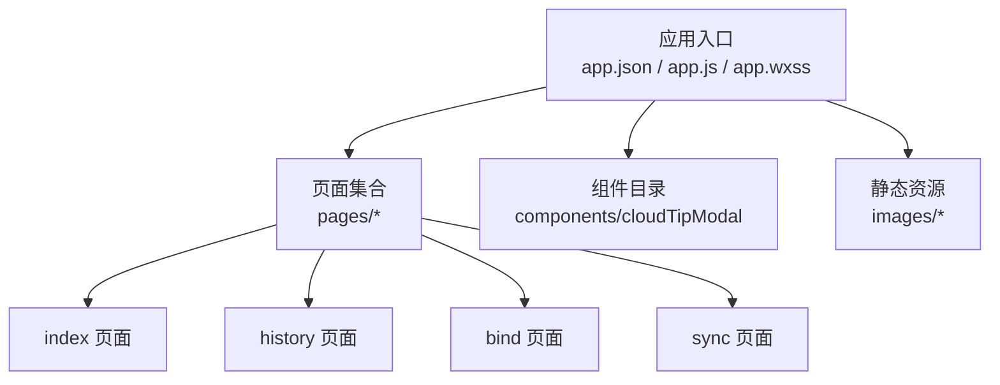
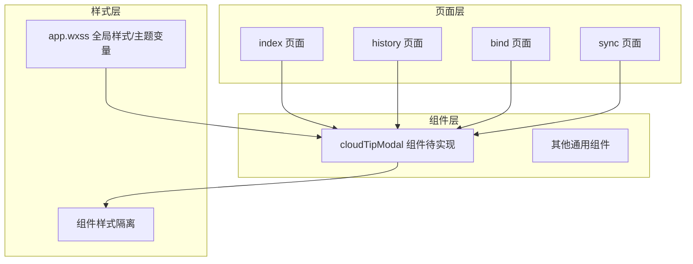
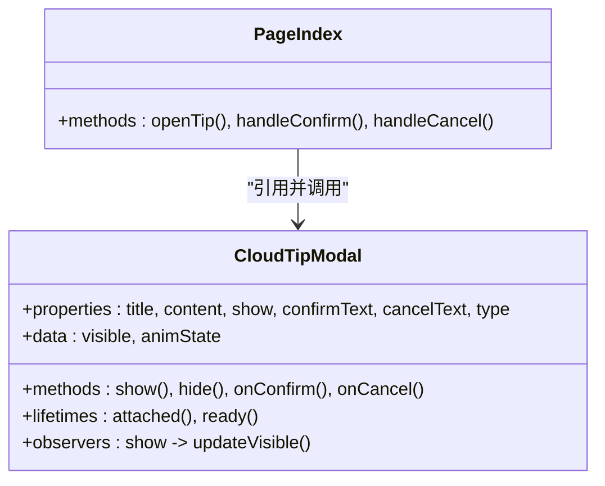
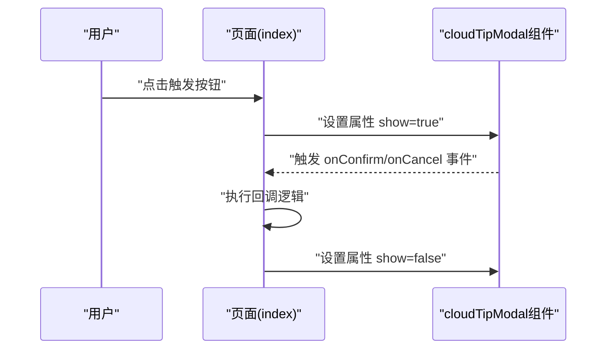
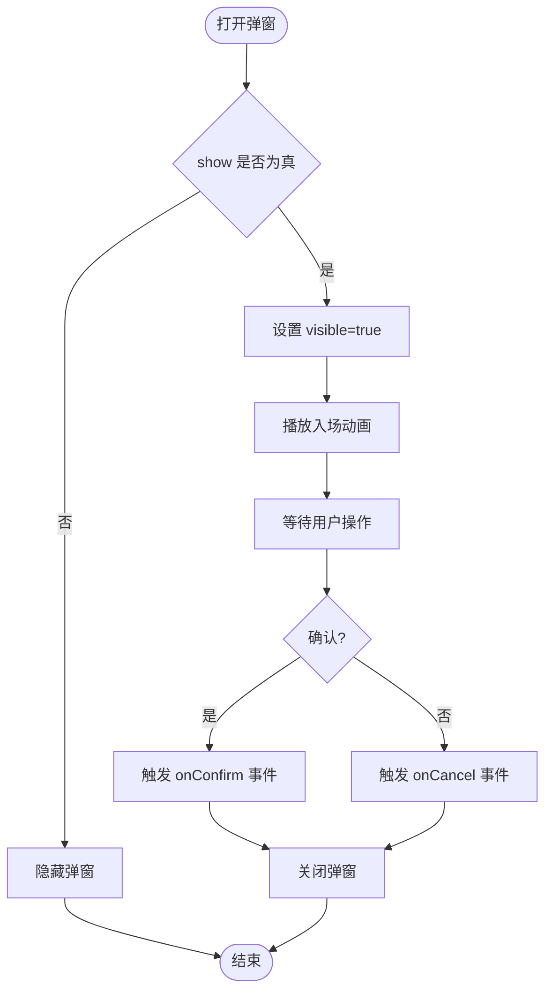
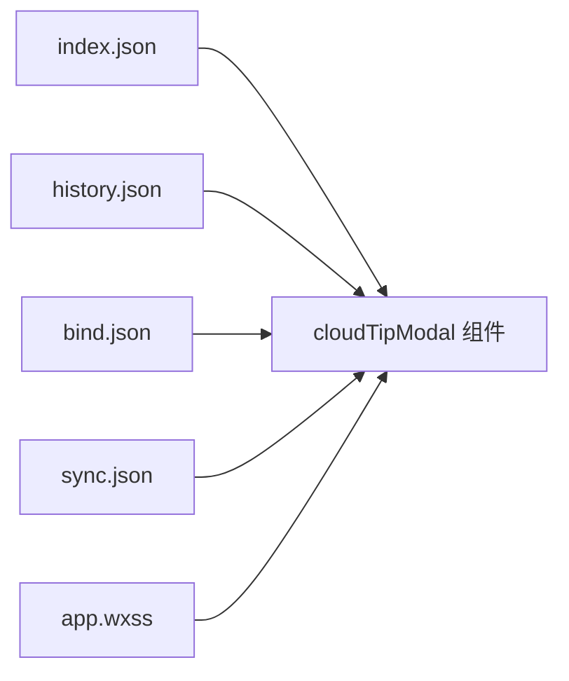

# UI组件开发

<cite>
**本文档引用的文件**   
- [miniprogram/app.json](file://miniprogram/app.json)
- [miniprogram/app.js](file://miniprogram/app.js)
- [miniprogram/app.wxss](file://miniprogram/app.wxss)
- [miniprogram/pages/index/index.js](file://miniprogram/pages/index/index.js)
- [miniprogram/pages/index/index.json](file://miniprogram/pages/index/index.json)
- [miniprogram/pages/index/index.wxml](file://miniprogram/pages/index/index.wxml)
- [miniprogram/pages/index/index.wxss](file://miniprogram/pages/index/index.wxss)
- [miniprogram/pages/history/history.js](file://miniprogram/pages/history/history.js)
- [miniprogram/pages/history/history.json](file://miniprogram/pages/history/history.json)
- [miniprogram/pages/history/history.wxml](file://miniprogram/pages/history/history.wxml)
- [miniprogram/pages/history/history.wxss](file://miniprogram/pages/history/history.wxss)
- [miniprogram/pages/bind/bind.js](file://miniprogram/pages/bind/bind.js)
- [miniprogram/pages/bind/bind.json](file://miniprogram/pages/bind/bind.json)
- [miniprogram/pages/bind/bind.wxml](file://miniprogram/pages/bind/bind.wxml)
- [miniprogram/pages/bind/bind.wxss](file://miniprogram/pages/bind/bind.wxss)
- [miniprogram/pages/sync/sync.js](file://miniprogram/pages/sync/sync.js)
- [miniprogram/pages/sync/sync.json](file://miniprogram/pages/sync/sync.json)
- [miniprogram/pages/sync/sync.wxml](file://miniprogram/pages/sync/sync.wxml)
- [miniprogram/pages/sync/sync.wxss](file://miniprogram/pages/sync/sync.wxss)
</cite>

## 目录
1. [简介](#简介)
2. [项目结构](#项目结构)
3. [核心组件](#核心组件)
4. [架构总览](#架构总览)
5. [详细组件分析](#详细组件分析)
6. [依赖分析](#依赖分析)
7. [性能考虑](#性能考虑)
8. [故障排查指南](#故障排查指南)
9. [结论](#结论)
10. [附录](#附录)

## 简介
本规范面向微信小程序UI组件开发，聚焦自定义组件的基本结构与最佳实践，涵盖：
- 组件基本结构：component.json配置、properties属性定义、methods方法实现
- cloudTipModal组件的开发模式与复用策略（基于小程序标准组件模型）
- 组件间通信机制、事件传递、插槽使用
- 样式隔离、主题定制、响应式设计
- 组件测试与文档编写的最佳实践

说明：当前仓库中cloudTipModal目录为空，本节以小程序官方组件模型为基础，给出可落地的开发范式与示例路径指引。

## 项目结构
项目采用小程序标准目录组织方式：
- miniprogram/ 为小程序根目录，包含应用入口与页面
- pages/ 下按功能划分页面，每个页面由 .js/.json/.wxml/.wxss 四件套组成
- components/ 用于存放可复用UI组件（当前cloudTipModal目录为空，待实现）
- images/ 存放静态资源

图表来源
- [miniprogram/app.json](file://miniprogram/app.json)
- [miniprogram/app.js](file://miniprogram/app.js)
- [miniprogram/app.wxss](file://miniprogram/app.wxss)
- [miniprogram/pages/index/index.json](file://miniprogram/pages/index/index.json)
- [miniprogram/pages/history/history.json](file://miniprogram/pages/history/history.json)
- [miniprogram/pages/bind/bind.json](file://miniprogram/pages/bind/bind.json)
- [miniprogram/pages/sync/sync.json](file://miniprogram/pages/sync/sync.json)

章节来源
- [miniprogram/app.json](file://miniprogram/app.json)
- [miniprogram/app.js](file://miniprogram/app.js)
- [miniprogram/app.wxss](file://miniprogram/app.wxss)
- [miniprogram/pages/index/index.json](file://miniprogram/pages/index/index.json)
- [miniprogram/pages/history/history.json](file://miniprogram/pages/history/history.json)
- [miniprogram/pages/bind/bind.json](file://miniprogram/pages/bind/bind.json)
- [miniprogram/pages/sync/sync.json](file://miniprogram/pages/sync/sync.json)

## 核心组件
- 组件基本结构
  - component.json：声明组件名、依赖、usingComponents等
  - properties：对外暴露的属性，支持类型、默认值、观察者
  - data：组件内部状态
  - methods：事件处理与业务逻辑
  - lifetimes：生命周期钩子（created/attached/ready等）
  - observers：数据监听
  - options：组件选项（如添加动态样式支持等）
- 推荐约定
  - 命名：组件目录与文件名统一小写+短横线，如 cloud-tip-modal
  - 职责单一：一个组件只做一件事
  - 属性最小化：仅暴露必要属性，复杂行为通过事件回调
  - 事件命名：onXxx 或 emitXxx 保持一致性
  - 样式隔离：使用组件作用域样式，避免全局污染

章节来源
- [miniprogram/pages/index/index.json](file://miniprogram/pages/index/index.json)
- [miniprogram/pages/history/history.json](file://miniprogram/pages/history/history.json)
- [miniprogram/pages/bind/bind.json](file://miniprogram/pages/bind/bind.json)
- [miniprogram/pages/sync/sync.json](file://miniprogram/pages/sync/sync.json)

## 架构总览
小程序UI层采用“页面-组件”分层：
- 页面负责路由与组合多个组件
- 组件封装UI与交互，通过属性与事件与页面通信
- 公共样式在app.wxss中提供基础变量与主题，组件内样式保持隔离

图表来源
- [miniprogram/app.wxss](file://miniprogram/app.wxss)
- [miniprogram/pages/index/index.json](file://miniprogram/pages/index/index.json)
- [miniprogram/pages/history/history.json](file://miniprogram/pages/history/history.json)
- [miniprogram/pages/bind/bind.json](file://miniprogram/pages/bind/bind.json)
- [miniprogram/pages/sync/sync.json](file://miniprogram/pages/sync/sync.json)

## 详细组件分析

### cloudTipModal 组件开发模式与复用策略
- 目标：提供统一的提示/确认弹窗能力，支持标题、内容、按钮文案、回调等
- 基本结构
  - component.json：声明组件并引入所需依赖
  - properties：title、content、show、confirmText、cancelText、type等
  - data：内部显示控制与动画状态
  - methods：show/hide、confirm/cancel 回调触发
  - lifetimes：attached/ready 初始化
  - observers：监听 show 变化驱动显隐
- 复用策略
  - 作为全局组件注册到 app.json 的 usingComponents，便于多页面复用
  - 通过事件向父页面传递用户操作结果
  - 支持插槽扩展：允许传入自定义头部、底部、内容区

图表来源
- [miniprogram/pages/index/index.json](file://miniprogram/pages/index/index.json)
- [miniprogram/pages/index/index.wxml](file://miniprogram/pages/index/index.wxml)
- [miniprogram/pages/index/index.js](file://miniprogram/pages/index/index.js)

图表来源
- [miniprogram/pages/index/index.wxml](file://miniprogram/pages/index/index.wxml)
- [miniprogram/pages/index/index.js](file://miniprogram/pages/index/index.js)

图表来源
- [miniprogram/pages/index/index.js](file://miniprogram/pages/index/index.js)
- [miniprogram/pages/index/index.wxml](file://miniprogram/pages/index/index.wxml)

章节来源
- [miniprogram/pages/index/index.json](file://miniprogram/pages/index/index.json)
- [miniprogram/pages/index/index.wxml](file://miniprogram/pages/index/index.wxml)
- [miniprogram/pages/index/index.js](file://miniprogram/pages/index/index.js)

### 组件间通信机制、事件传递、插槽使用
- 父子通信
  - 父传子：通过 properties 传递数据
  - 子传父：通过 this.triggerEvent('eventName', payload) 触发事件
- 兄弟通信
  - 通过共同父组件中转事件或使用全局事件总线（谨慎使用）
- 跨层级通信
  - 使用 Component 的 relations 或全局事件
- 插槽使用
  - 默认插槽：包裹内容
  - 具名插槽：slot="header"/"footer" 等
  - 条件插槽：配合 wx:if 控制渲染

章节来源
- [miniprogram/pages/index/index.wxml](file://miniprogram/pages/index/index.wxml)
- [miniprogram/pages/history/history.wxml](file://miniprogram/pages/history/history.wxml)
- [miniprogram/pages/bind/bind.wxml](file://miniprogram/pages/bind/bind.wxml)
- [miniprogram/pages/sync/sync.wxml](file://miniprogram/pages/sync/sync.wxml)

### 样式隔离、主题定制、响应式设计
- 样式隔离
  - 组件样式默认隔离，避免类名冲突
  - 使用 ::v-deep 或外部样式类穿透时需谨慎
- 主题定制
  - 在 app.wxss 中定义 CSS 变量（如 --primary-color）
  - 组件样式引用变量，便于一键换肤
- 响应式设计
  - 使用 rpx 单位适配不同屏幕
  - 结合媒体查询与布局弹性（flex/grid）
  - 避免固定宽高，优先百分比与自适应

章节来源
- [miniprogram/app.wxss](file://miniprogram/app.wxss)
- [miniprogram/pages/index/index.wxss](file://miniprogram/pages/index/index.wxss)
- [miniprogram/pages/history/history.wxss](file://miniprogram/pages/history/history.wxss)
- [miniprogram/pages/bind/bind.wxss](file://miniprogram/pages/bind/bind.wxss)
- [miniprogram/pages/sync/sync.wxss](file://miniprogram/pages/sync/sync.wxss)

### 组件测试与文档编写最佳实践
- 单元测试
  - 使用小程序官方测试框架或第三方工具对组件方法进行断言
  - 模拟用户交互（点击、输入）验证事件触发与状态更新
- 视觉回归
  - 截图对比确保UI一致性
- 文档编写
  - 提供属性表、事件表、插槽说明、示例代码
  - 维护变更日志与版本兼容性说明

[本节为通用指导，不直接分析具体文件]

## 依赖分析
- 页面依赖组件
  - 各页面通过各自 .json 中的 usingComponents 引用组件
- 组件依赖样式
  - 组件样式隔离，但可引用全局主题变量
- 可能的循环依赖
  - 避免组件之间相互引用，必要时通过父组件协调

图表来源
- [miniprogram/pages/index/index.json](file://miniprogram/pages/index/index.json)
- [miniprogram/pages/history/history.json](file://miniprogram/pages/history/history.json)
- [miniprogram/pages/bind/bind.json](file://miniprogram/pages/bind/bind.json)
- [miniprogram/pages/sync/sync.json](file://miniprogram/pages/sync/sync.json)
- [miniprogram/app.wxss](file://miniprogram/app.wxss)

章节来源
- [miniprogram/pages/index/index.json](file://miniprogram/pages/index/index.json)
- [miniprogram/pages/history/history.json](file://miniprogram/pages/history/history.json)
- [miniprogram/pages/bind/bind.json](file://miniprogram/pages/bind/bind.json)
- [miniprogram/pages/sync/sync.json](file://miniprogram/pages/sync/sync.json)
- [miniprogram/app.wxss](file://miniprogram/app.wxss)

## 性能考虑
- 减少不必要的 setData 调用，合并状态更新
- 合理使用 wx:key 提升列表渲染性能
- 避免在渲染函数中进行复杂计算，提前缓存结果
- 懒加载与按需引入组件，减少首屏体积
- 图片与资源压缩，使用CDN加速

[本节为通用指导，不直接分析具体文件]

## 故障排查指南
- 组件未找到
  - 检查 component.json 是否正确声明 with 路径
  - 确认 usingComponents 路径无误
- 样式不生效
  - 检查选择器是否被隔离影响
  - 确认全局样式变量是否定义
- 事件未触发
  - 检查 triggerEvent 名称与绑定一致
  - 确认父页面是否监听对应事件
- 插槽内容不渲染
  - 检查 slot 名称与插槽定义一致
  - 确认 wx:if 条件正确

章节来源
- [miniprogram/pages/index/index.json](file://miniprogram/pages/index/index.json)
- [miniprogram/pages/index/index.wxml](file://miniprogram/pages/index/index.wxml)
- [miniprogram/pages/index/index.js](file://miniprogram/pages/index/index.js)
- [miniprogram/app.wxss](file://miniprogram/app.wxss)

## 结论
- 遵循小程序组件模型，明确 properties/methods/lifetimes/observers 的职责边界
- 通过事件与插槽实现松耦合通信与灵活扩展
- 利用样式隔离与主题变量构建一致的UI体系
- 建立完善的测试与文档流程，保障组件质量与可维护性

[本节为总结性内容，不直接分析具体文件]

## 附录
- 常用属性类型与默认值约定
- 事件命名规范与载荷结构建议
- 插槽命名与使用示例清单
- 组件发布与版本管理流程

[本节为补充信息，不直接分析具体文件]