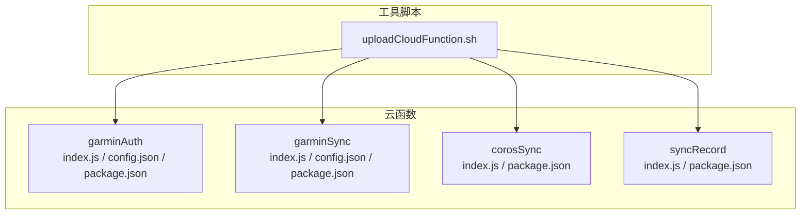
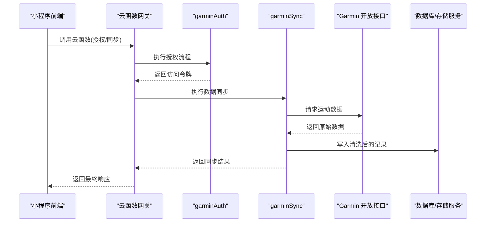
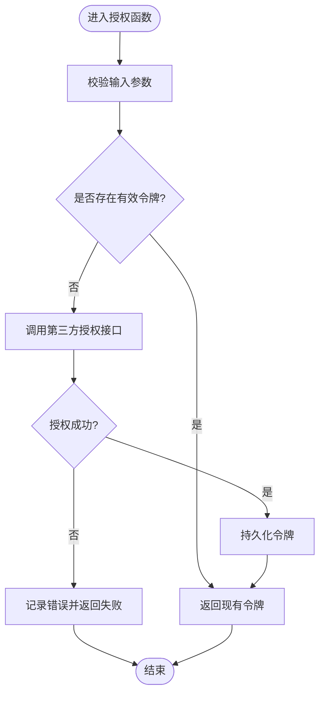
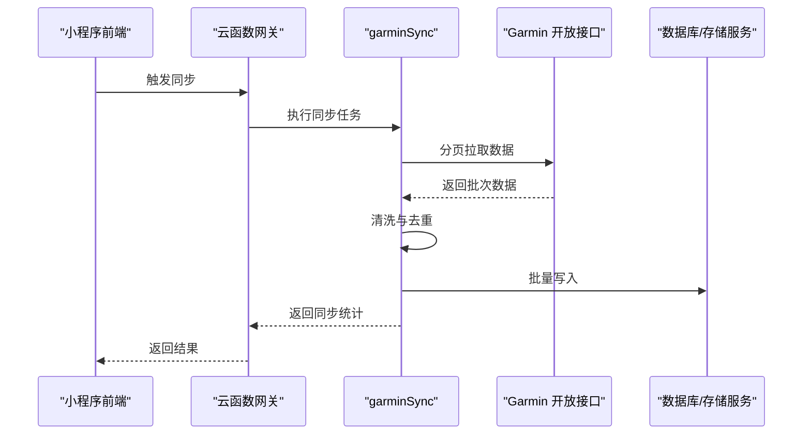
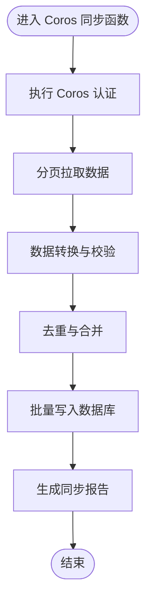
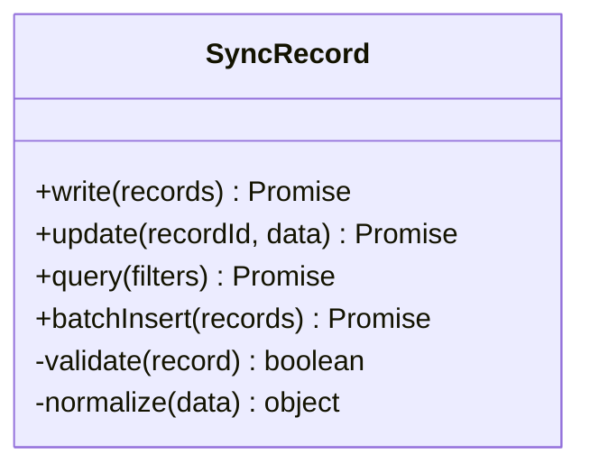
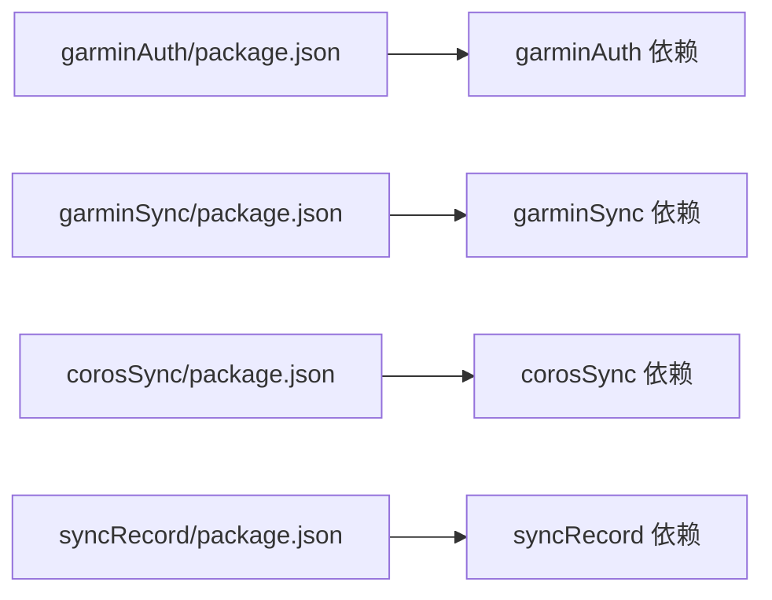

# 云函数扩展

<cite>
**本文引用的文件**   
- [cloudfunctions/corosSync/index.js](file://cloudfunctions/corosSync/index.js)
- [cloudfunctions/corosSync/package.json](file://cloudfunctions/corosSync/package.json)
- [cloudfunctions/garminAuth/config.json](file://cloudfunctions/garminAuth/config.json)
- [cloudfunctions/garminAuth/index.js](file://cloudfunctions/garminAuth/index.js)
- [cloudfunctions/garminAuth/package.json](file://cloudfunctions/garminAuth/package.json)
- [cloudfunctions/garminSync/config.json](file://cloudfunctions/garminSync/config.json)
- [cloudfunctions/garminSync/index.js](file://cloudfunctions/garminSync/index.js)
- [cloudfunctions/garminSync/package.json](file://cloudfunctions/garminSync/package.json)
- [cloudfunctions/syncRecord/index.js](file://cloudfunctions/syncRecord/index.js)
- [cloudfunctions/syncRecord/package.json](file://cloudfunctions/syncRecord/package.json)
- [uploadCloudFunction.sh](file://uploadCloudFunction.sh)
</cite>

## 目录
1. [简介](#简介)
2. [项目结构](#项目结构)
3. [核心组件](#核心组件)
4. [架构总览](#架构总览)
5. [详细组件分析](#详细组件分析)
6. [依赖关系分析](#依赖关系分析)
7. [性能考虑](#性能考虑)
8. [故障排查指南](#故障排查指南)
9. [结论](#结论)
10. [附录](#附录)

## 简介
本指南面向希望在微信小程序云开发环境中扩展“云函数”的开发者，围绕以下目标展开：
- 明确云函数的项目结构与配置文件设置
- 掌握依赖管理与包管理策略
- 学习如何开发新的同步云函数（API 调用封装、数据处理逻辑、错误重试机制）
- 了解权限控制、环境变量配置与日志记录的最佳实践
- 以 garminSync 与 corosSync 为例，完整展示第三方服务集成流程
- 提供调试、测试与部署的实用技巧

## 项目结构
云函数位于 cloudfunctions 目录下，每个云函数为一个独立子目录，包含入口文件 index.js、可选的配置文件（如 config.json）以及依赖声明 package.json。示例结构如下：
- cloudfunctions/garminAuth：负责 Garmin 授权相关逻辑
- cloudfunctions/garminSync：负责 Garmin 数据同步
- cloudfunctions/corosSync：负责 Coros 数据同步
- cloudfunctions/syncRecord：通用记录同步逻辑

**图表来源**
- [cloudfunctions/garminAuth/index.js](file://cloudfunctions/garminAuth/index.js)
- [cloudfunctions/garminAuth/config.json](file://cloudfunctions/garminAuth/config.json)
- [cloudfunctions/garminAuth/package.json](file://cloudfunctions/garminAuth/package.json)
- [cloudfunctions/garminSync/index.js](file://cloudfunctions/garminSync/index.js)
- [cloudfunctions/garminSync/config.json](file://cloudfunctions/garminSync/config.json)
- [cloudfunctions/garminSync/package.json](file://cloudfunctions/garminSync/package.json)
- [cloudfunctions/corosSync/index.js](file://cloudfunctions/corosSync/index.js)
- [cloudfunctions/corosSync/package.json](file://cloudfunctions/corosSync/package.json)
- [cloudfunctions/syncRecord/index.js](file://cloudfunctions/syncRecord/index.js)
- [cloudfunctions/syncRecord/package.json](file://cloudfunctions/syncRecord/package.json)
- [uploadCloudFunction.sh](file://uploadCloudFunction.sh)

**章节来源**
- [cloudfunctions/garminAuth/index.js](file://cloudfunctions/garminAuth/index.js)
- [cloudfunctions/garminAuth/config.json](file://cloudfunctions/garminAuth/config.json)
- [cloudfunctions/garminAuth/package.json](file://cloudfunctions/garminAuth/package.json)
- [cloudfunctions/garminSync/index.js](file://cloudfunctions/garminSync/index.js)
- [cloudfunctions/garminSync/config.json](file://cloudfunctions/garminSync/config.json)
- [cloudfunctions/garminSync/package.json](file://cloudfunctions/garminSync/package.json)
- [cloudfunctions/corosSync/index.js](file://cloudfunctions/corosSync/index.js)
- [cloudfunctions/corosSync/package.json](file://cloudfunctions/corosSync/package.json)
- [cloudfunctions/syncRecord/index.js](file://cloudfunctions/syncRecord/index.js)
- [cloudfunctions/syncRecord/package.json](file://cloudfunctions/syncRecord/package.json)
- [uploadCloudFunction.sh](file://uploadCloudFunction.sh)

## 核心组件
- 云函数入口（index.js）：定义事件处理函数，接收小程序端调用参数，执行业务逻辑并返回结果。
- 配置文件（config.json，可选）：用于存放敏感信息或环境相关的配置项，避免硬编码。
- 依赖声明（package.json）：声明云函数运行所需的 Node.js 依赖库及版本。

关键职责划分：
- garminAuth：负责获取/刷新访问令牌、鉴权流程封装
- garminSync：基于已授权的令牌拉取运动数据，进行数据清洗与入库
- corosSync：对接 Coros 开放接口，完成认证与数据同步
- syncRecord：通用记录同步逻辑，供多源复用

**章节来源**
- [cloudfunctions/garminAuth/index.js](file://cloudfunctions/garminAuth/index.js)
- [cloudfunctions/garminAuth/config.json](file://cloudfunctions/garminAuth/config.json)
- [cloudfunctions/garminAuth/package.json](file://cloudfunctions/garminAuth/package.json)
- [cloudfunctions/garminSync/index.js](file://cloudfunctions/garminSync/index.js)
- [cloudfunctions/garminSync/config.json](file://cloudfunctions/garminSync/config.json)
- [cloudfunctions/garminSync/package.json](file://cloudfunctions/garminSync/package.json)
- [cloudfunctions/corosSync/index.js](file://cloudfunctions/corosSync/index.js)
- [cloudfunctions/corosSync/package.json](file://cloudfunctions/corosSync/package.json)
- [cloudfunctions/syncRecord/index.js](file://cloudfunctions/syncRecord/index.js)
- [cloudfunctions/syncRecord/package.json](file://cloudfunctions/syncRecord/package.json)

## 架构总览
下图展示了小程序端通过云函数调用第三方服务的整体流程，包括授权、数据拉取、处理与落库。

**图表来源**
- [cloudfunctions/garminAuth/index.js](file://cloudfunctions/garminAuth/index.js)
- [cloudfunctions/garminSync/index.js](file://cloudfunctions/garminSync/index.js)
- [cloudfunctions/corosSync/index.js](file://cloudfunctions/corosSync/index.js)

## 详细组件分析

### garminAuth：授权与令牌管理
- 功能要点
  - 封装第三方授权流程，获取并缓存访问令牌
  - 支持令牌过期检测与自动刷新
  - 安全存储敏感配置（如客户端 ID、密钥等），建议通过配置文件与环境变量注入
- 典型调用链
  - 小程序调用授权云函数 → 校验参数 → 发起授权请求 → 保存令牌 → 返回成功

**图表来源**
- [cloudfunctions/garminAuth/index.js](file://cloudfunctions/garminAuth/index.js)
- [cloudfunctions/garminAuth/config.json](file://cloudfunctions/garminAuth/config.json)

**章节来源**
- [cloudfunctions/garminAuth/index.js](file://cloudfunctions/garminAuth/index.js)
- [cloudfunctions/garminAuth/config.json](file://cloudfunctions/garminAuth/config.json)
- [cloudfunctions/garminAuth/package.json](file://cloudfunctions/garminAuth/package.json)

### garminSync：数据同步与处理
- 功能要点
  - 使用已授权的令牌拉取运动数据
  - 对原始数据进行清洗、去重、字段映射
  - 批量写入数据库，支持分页与限流
  - 实现错误重试与幂等性保障
- 典型调用链
  - 小程序触发同步 → 云函数校验权限 → 调用 Garmin 接口 → 数据处理 → 落库 → 返回统计结果

**图表来源**
- [cloudfunctions/garminSync/index.js](file://cloudfunctions/garminSync/index.js)
- [cloudfunctions/garminSync/config.json](file://cloudfunctions/garminSync/config.json)

**章节来源**
- [cloudfunctions/garminSync/index.js](file://cloudfunctions/garminSync/index.js)
- [cloudfunctions/garminSync/config.json](file://cloudfunctions/garminSync/config.json)
- [cloudfunctions/garminSync/package.json](file://cloudfunctions/garminSync/package.json)

### corosSync：Coros 第三方集成
- 功能要点
  - 实现 Coros 的认证与数据拉取流程
  - 适配 Coros 的数据模型与字段规范
  - 与通用同步逻辑（syncRecord）协作，统一入库格式
- 典型调用链
  - 小程序调用 → 云函数执行认证 → 拉取数据 → 转换格式 → 写入数据库

**图表来源**
- [cloudfunctions/corosSync/index.js](file://cloudfunctions/corosSync/index.js)

**章节来源**
- [cloudfunctions/corosSync/index.js](file://cloudfunctions/corosSync/index.js)
- [cloudfunctions/corosSync/package.json](file://cloudfunctions/corosSync/package.json)

### syncRecord：通用记录同步逻辑
- 功能要点
  - 提供统一的记录写入、更新、查询能力
  - 支持事务与回滚，保证数据一致性
  - 暴露标准化接口供各数据源复用

**图表来源**
- [cloudfunctions/syncRecord/index.js](file://cloudfunctions/syncRecord/index.js)

**章节来源**
- [cloudfunctions/syncRecord/index.js](file://cloudfunctions/syncRecord/index.js)
- [cloudfunctions/syncRecord/package.json](file://cloudfunctions/syncRecord/package.json)

## 依赖关系分析
- 包管理
  - 每个云函数目录均包含 package.json，用于声明依赖与版本约束
  - 建议在本地安装依赖后上传，确保生产环境与本地一致
- 外部依赖
  - 网络请求库（如 axios、node-fetch）
  - 加密与签名库（如需）
  - 数据库 SDK（如微信云开发 SDK）
- 依赖隔离
  - 各云函数独立维护依赖，避免冲突
  - 公共逻辑可抽取为共享模块，但需评估打包体积与冷启动时间

**图表来源**
- [cloudfunctions/garminAuth/package.json](file://cloudfunctions/garminAuth/package.json)
- [cloudfunctions/garminSync/package.json](file://cloudfunctions/garminSync/package.json)
- [cloudfunctions/corosSync/package.json](file://cloudfunctions/corosSync/package.json)
- [cloudfunctions/syncRecord/package.json](file://cloudfunctions/syncRecord/package.json)

**章节来源**
- [cloudfunctions/garminAuth/package.json](file://cloudfunctions/garminAuth/package.json)
- [cloudfunctions/garminSync/package.json](file://cloudfunctions/garminSync/package.json)
- [cloudfunctions/corosSync/package.json](file://cloudfunctions/corosSync/package.json)
- [cloudfunctions/syncRecord/package.json](file://cloudfunctions/syncRecord/package.json)

## 性能考虑
- 冷启动优化
  - 减少顶层初始化逻辑，将耗时操作延迟到首次调用
  - 合理拆分云函数，避免单函数过大
- 网络请求
  - 使用连接池与超时控制
  - 对第三方接口进行缓存与限流
- 数据处理
  - 批量写入与分页拉取，避免内存溢出
  - 去重与增量更新，降低重复计算
- 资源限制
  - 关注云函数内存与执行时长上限
  - 监控 CPU 与 I/O 瓶颈

[本节为通用指导，不直接分析具体文件]

## 故障排查指南
- 常见问题定位
  - 检查云函数日志输出，确认异常堆栈与错误码
  - 核对配置文件与环境变量是否正确注入
  - 验证第三方接口的可达性与限流策略
- 重试与降级
  - 对网络抖动实施指数退避重试
  - 在第三方不可用时启用降级策略（如缓存旧数据）
- 权限问题
  - 确认云函数权限配置与用户身份校验
  - 检查令牌有效期与刷新逻辑
- 数据一致性
  - 使用事务保证批量写入的一致性
  - 记录操作审计日志，便于回溯

**章节来源**
- [cloudfunctions/garminAuth/index.js](file://cloudfunctions/garminAuth/index.js)
- [cloudfunctions/garminSync/index.js](file://cloudfunctions/garminSync/index.js)
- [cloudfunctions/corosSync/index.js](file://cloudfunctions/corosSync/index.js)
- [cloudfunctions/syncRecord/index.js](file://cloudfunctions/syncRecord/index.js)

## 结论
通过本指南，您可以：
- 理解云函数的项目结构与配置方式
- 掌握依赖管理与包管理最佳实践
- 开发新的同步云函数，涵盖 API 封装、数据处理与错误重试
- 应用权限控制、环境变量与日志记录规范
- 参考 garminSync 与 corosSync 的集成流程
- 运用调试、测试与部署技巧提升效率

[本节为总结性内容，不直接分析具体文件]

## 附录
- 部署脚本
  - uploadCloudFunction.sh：用于批量上传云函数至云端，确保依赖与代码一致
- 环境变量与配置
  - 使用配置文件集中管理敏感信息，避免硬编码
  - 在生产环境通过环境变量注入密钥与域名
- 测试建议
  - 单元测试覆盖核心逻辑
  - 集成测试模拟第三方接口行为
  - 灰度发布与回滚策略

**章节来源**
- [uploadCloudFunction.sh](file://uploadCloudFunction.sh)
- [cloudfunctions/garminAuth/config.json](file://cloudfunctions/garminAuth/config.json)
- [cloudfunctions/garminSync/config.json](file://cloudfunctions/garminSync/config.json)