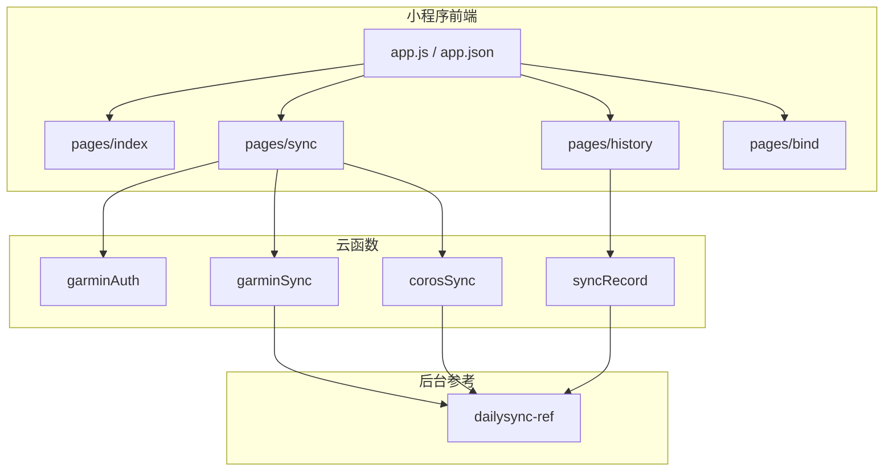
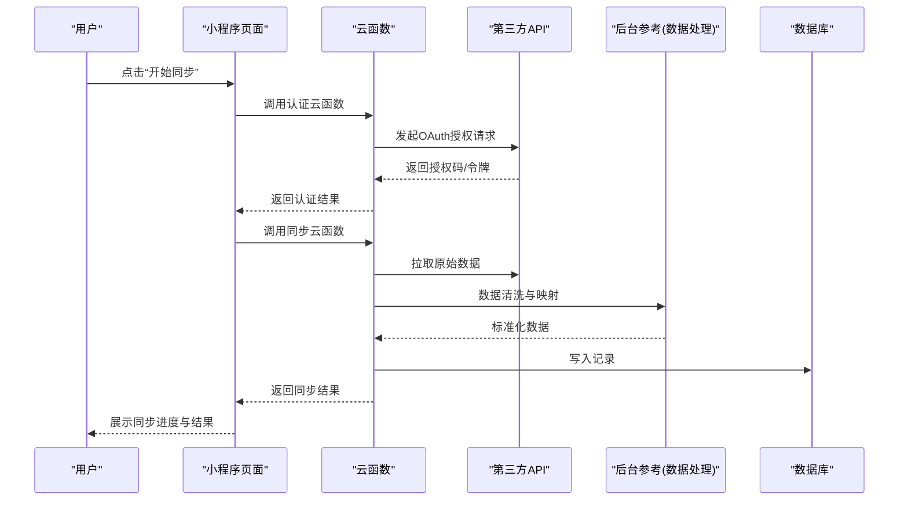
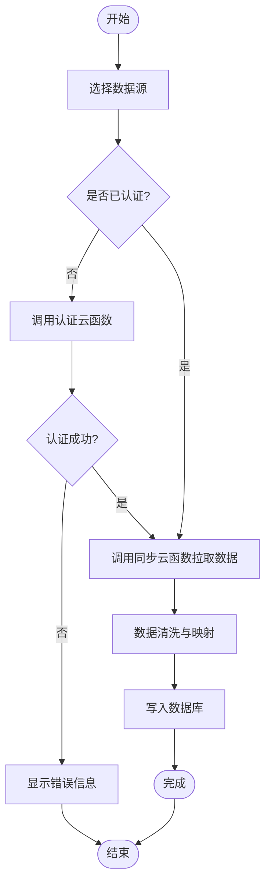
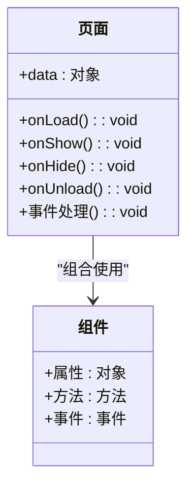
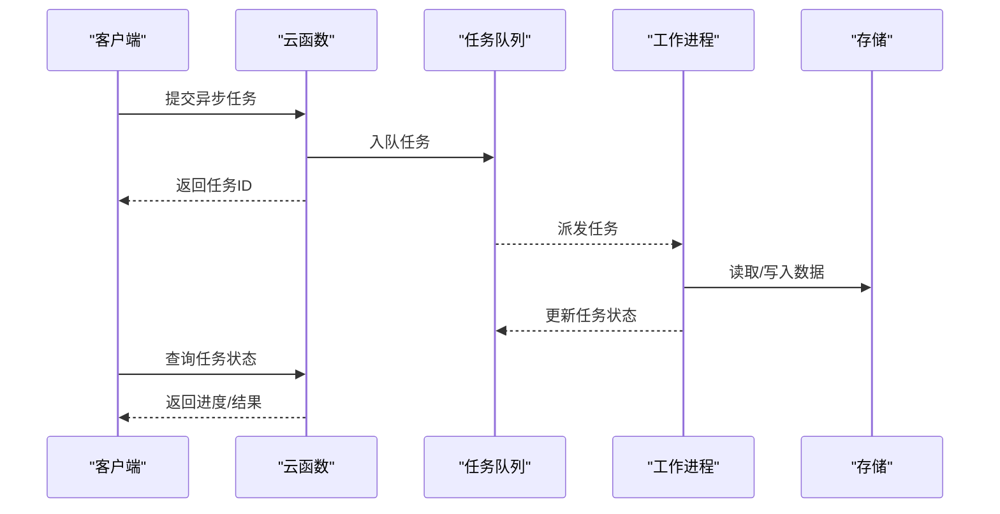
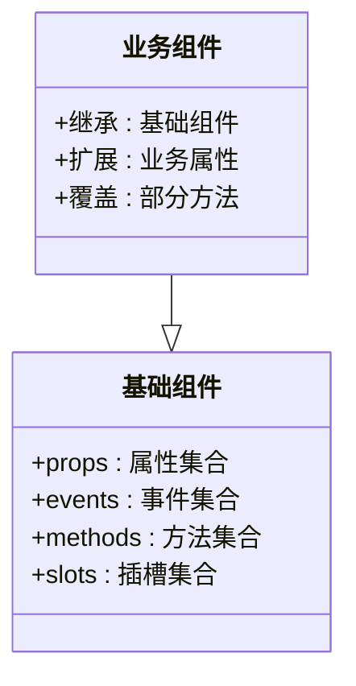
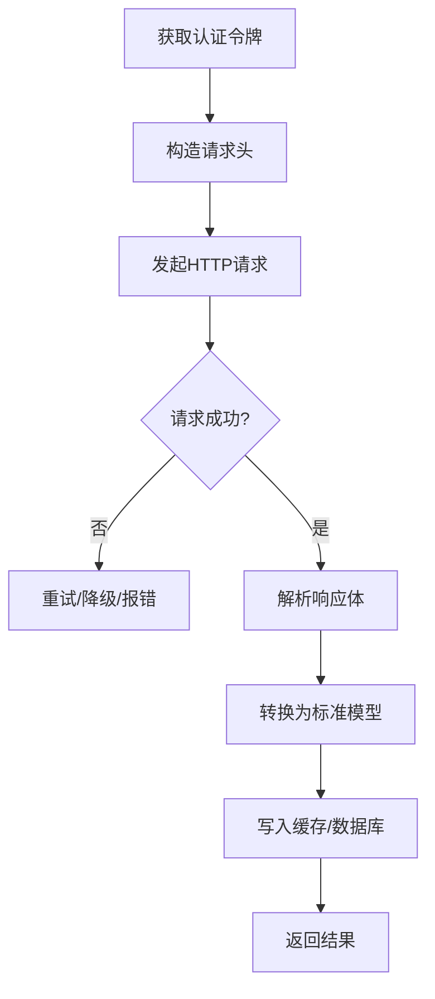
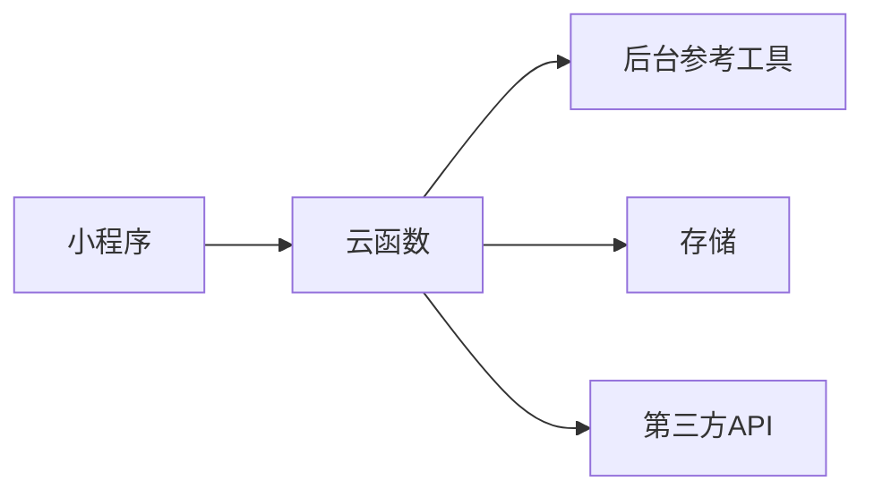

# 功能开发与扩展

<cite>
**本文引用的文件**   
- [README.md](file://README.md)
- [project.config.json](file://project.config.json)
- [miniprogram/app.js](file://miniprogram/app.js)
- [miniprogram/app.json](file://miniprogram/app.json)
- [miniprogram/app.wxss](file://miniprogram/app.wxss)
- [miniprogram/pages/index/index.js](file://miniprogram/pages/index/index.js)
- [miniprogram/pages/index/index.wxml](file://miniprogram/pages/index/index.wxml)
- [miniprogram/pages/index/index.wxss](file://miniprogram/pages/index/index.wxss)
- [miniprogram/pages/sync/sync.js](file://miniprogram/pages/sync/sync.js)
- [miniprogram/pages/sync/sync.wxml](file://miniprogram/pages/sync/sync.wxml)
- [miniprogram/pages/sync/sync.wxss](file://miniprogram/pages/sync/sync.wxss)
- [miniprogram/pages/history/history.js](file://miniprogram/pages/history/history.js)
- [miniprogram/pages/history/history.wxml](file://miniprogram/pages/history/history.wxml)
- [miniprogram/pages/history/history.wxss](file://miniprogram/pages/history/history.wxss)
- [miniprogram/pages/bind/bind.js](file://miniprogram/pages/bind/bind.js)
- [miniprogram/pages/bind/bind.wxml](file://miniprogram/pages/bind/bind.wxml)
- [miniprogram/pages/bind/bind.wxss](file://miniprogram/pages/bind/bind.wxss)
- [cloudfunctions/garminAuth/index.js](file://cloudfunctions/garminAuth/index.js)
- [cloudfunctions/garminAuth/config.json](file://cloudfunctions/garminAuth/config.json)
- [cloudfunctions/garminSync/index.js](file://cloudfunctions/garminSync/index.js)
- [cloudfunctions/garminSync/config.json](file://cloudfunctions/garminSync/config.json)
- [cloudfunctions/corosSync/index.js](file://cloudfunctions/corosSync/index.js)
- [cloudfunctions/corosSync/package.json](file://cloudfunctions/corosSync/package.json)
- [cloudfunctions/syncRecord/index.js](file://cloudfunctions/syncRecord/index.js)
- [cloudfunctions/syncRecord/package.json](file://cloudfunctions/syncRecord/package.json)
- [dailysync-ref/src/utils/garmin_common.ts](file://dailysync-ref/src/utils/garmin_common.ts)
- [dailysync-ref/src/utils/garmin_cn.ts](file://dailysync-ref/src/utils/garmin_cn.ts)
- [dailysync-ref/src/utils/garmin_global.ts](file://dailysync-ref/src/utils/garmin_global.ts)
- [dailysync-ref/src/utils/strava.ts](file://dailysync-ref/src/utils/strava.ts)
- [dailysync-ref/src/utils/google_sheets.ts](file://dailysync-ref/src/utils/google_sheets.ts)
- [dailysync-ref/src/utils/sqlite.ts](file://dailysync-ref/src/utils/sqlite.ts)
- [dailysync-ref/src/utils/runningquotient.ts](file://dailysync-ref/src/utils/runningquotient.ts)
- [dailysync-ref/src/utils/type.ts](file://dailysync-ref/src/utils/type.ts)
- [dailysync-ref/src/rq.ts](file://dailysync-ref/src/rq.ts)
- [dailysync-ref/src/constant.ts](file://dailysync-ref/src/constant.ts)
</cite>

## 目录
1. [简介](#简介)
2. [项目结构](#项目结构)
3. [核心组件](#核心组件)
4. [架构总览](#架构总览)
5. [详细组件分析](#详细组件分析)
6. [依赖分析](#依赖分析)
7. [性能考虑](#性能考虑)
8. [故障排查指南](#故障排查指南)
9. [结论](#结论)
10. [附录](#附录)

## 简介
本指南面向希望在本项目中新增数据源同步能力、开发小程序新页面、扩展云函数与UI组件，以及集成第三方服务的开发者。文档从系统架构出发，逐步深入到具体实现细节，提供可操作的步骤、最佳实践与常见问题排查方法，帮助你在保证稳定性的前提下快速迭代新功能。

## 项目结构
本项目由三大部分组成：
- 小程序前端（miniprogram）：包含应用入口、页面、样式与基础配置。
- 云函数（cloudfunctions）：封装各数据源的认证与同步逻辑，如 Garmin、Coros、记录同步等。
- 每日同步参考工程（dailysync-ref）：基于 TypeScript 的后台服务，用于数据迁移、计算与持久化，可作为后端参考实现。

**图表来源** 
- [miniprogram/app.js](file://miniprogram/app.js)
- [miniprogram/app.json](file://miniprogram/app.json)
- [cloudfunctions/garminAuth/index.js](file://cloudfunctions/garminAuth/index.js)
- [cloudfunctions/garminSync/index.js](file://cloudfunctions/garminSync/index.js)
- [cloudfunctions/corosSync/index.js](file://cloudfunctions/corosSync/index.js)
- [cloudfunctions/syncRecord/index.js](file://cloudfunctions/syncRecord/index.js)
- [dailysync-ref/src/utils/garmin_common.ts](file://dailysync-ref/src/utils/garmin_common.ts)

**章节来源**
- [README.md](file://README.md)
- [project.config.json](file://project.config.json)
- [miniprogram/app.js](file://miniprogram/app.js)
- [miniprogram/app.json](file://miniprogram/app.json)

## 核心组件
- 小程序应用层
  - 应用初始化与全局配置：入口脚本负责启动、注册页面、设置主题与全局状态。
  - 页面模块：首页、同步页、历史页、绑定页分别承担展示、触发同步、查看记录、账号绑定的职责。
- 云函数层
  - 认证云函数：处理第三方平台授权流程，获取并维护访问令牌。
  - 同步云函数：调用第三方 API 拉取数据，进行格式转换与入库。
  - 记录同步云函数：聚合或增量更新用户运动记录。
- 后台参考
  - 工具库：通用类型定义、Garmin/Strava/Google Sheets/SQLite 等适配器。
  - 业务逻辑：跑步配速指数计算、数据迁移与常量配置。

**章节来源**
- [miniprogram/pages/index/index.js](file://miniprogram/pages/index/index.js)
- [miniprogram/pages/sync/sync.js](file://miniprogram/pages/sync/sync.js)
- [miniprogram/pages/history/history.js](file://miniprogram/pages/history/history.js)
- [miniprogram/pages/bind/bind.js](file://miniprogram/pages/bind/bind.js)
- [cloudfunctions/garminAuth/index.js](file://cloudfunctions/garminAuth/index.js)
- [cloudfunctions/garminSync/index.js](file://cloudfunctions/garminSync/index.js)
- [cloudfunctions/corosSync/index.js](file://cloudfunctions/corosSync/index.js)
- [cloudfunctions/syncRecord/index.js](file://cloudfunctions/syncRecord/index.js)
- [dailysync-ref/src/utils/type.ts](file://dailysync-ref/src/utils/type.ts)
- [dailysync-ref/src/utils/garmin_common.ts](file://dailysync-ref/src/utils/garmin_common.ts)
- [dailysync-ref/src/utils/strava.ts](file://dailysync-ref/src/utils/strava.ts)
- [dailysync-ref/src/utils/google_sheets.ts](file://dailysync-ref/src/utils/google_sheets.ts)
- [dailysync-ref/src/utils/sqlite.ts](file://dailysync-ref/src/utils/sqlite.ts)
- [dailysync-ref/src/utils/runningquotient.ts](file://dailysync-ref/src/utils/runningquotient.ts)
- [dailysync-ref/src/rq.ts](file://dailysync-ref/src/rq.ts)
- [dailysync-ref/src/constant.ts](file://dailysync-ref/src/constant.ts)

## 架构总览
整体采用“小程序前端 + 云函数 + 后台参考”的分层架构。小程序负责交互与展示；云函数作为网关与编排层，统一处理鉴权、限流、重试与错误上报；后台参考提供数据模型、转换规则与持久化策略，便于在本地或云端部署独立服务。

**图表来源** 
- [miniprogram/pages/sync/sync.js](file://miniprogram/pages/sync/sync.js)
- [cloudfunctions/garminAuth/index.js](file://cloudfunctions/garminAuth/index.js)
- [cloudfunctions/garminSync/index.js](file://cloudfunctions/garminSync/index.js)
- [dailysync-ref/src/utils/garmin_common.ts](file://dailysync-ref/src/utils/garmin_common.ts)

## 详细组件分析

### 添加新的数据源同步功能
目标：新增一个数据源（例如 Strava），包括小程序端适配、云函数实现、数据模型映射与错误处理。

- 小程序端适配
  - 在页面中增加“选择数据源”的入口，并在触发时调用对应云函数。
  - 使用统一的回调接口处理成功、失败与进度事件，保持用户体验一致。
- 云函数实现
  - 新建云函数目录与入口文件，实现认证与拉取逻辑。
  - 复用后台参考中的类型与工具函数，确保数据结构一致。
  - 实现幂等写入与增量更新策略，避免重复数据。
- 数据模型映射
  - 将第三方字段映射到标准模型（距离、时长、心率、轨迹等）。
  - 对缺失字段设置默认值或标记为未知，保证下游可用性。
- 错误处理机制
  - 区分网络错误、认证失败、数据异常三类，给出明确提示。
  - 对临时性错误实施重试与退避策略，对致命错误直接回滚。

**图表来源** 
- [miniprogram/pages/sync/sync.js](file://miniprogram/pages/sync/sync.js)
- [cloudfunctions/garminAuth/index.js](file://cloudfunctions/garminAuth/index.js)
- [cloudfunctions/garminSync/index.js](file://cloudfunctions/garminSync/index.js)
- [dailysync-ref/src/utils/strava.ts](file://dailysync-ref/src/utils/strava.ts)
- [dailysync-ref/src/utils/garmin_common.ts](file://dailysync-ref/src/utils/garmin_common.ts)

**章节来源**
- [miniprogram/pages/sync/sync.js](file://miniprogram/pages/sync/sync.js)
- [cloudfunctions/garminAuth/index.js](file://cloudfunctions/garminAuth/index.js)
- [cloudfunctions/garminSync/index.js](file://cloudfunctions/garminSync/index.js)
- [cloudfunctions/corosSync/index.js](file://cloudfunctions/corosSync/index.js)
- [dailysync-ref/src/utils/strava.ts](file://dailysync-ref/src/utils/strava.ts)
- [dailysync-ref/src/utils/garmin_common.ts](file://dailysync-ref/src/utils/garmin_common.ts)

### 小程序新页面开发流程
目标：新增一个页面（例如“设置页”），涵盖页面结构、样式设计与交互逻辑。

- 页面结构
  - 创建 .wxml/.wxss/.js/.json 四件套，并在 app.json 中注册路由。
  - 使用模块化布局与公共组件，减少重复代码。
- 样式设计
  - 遵循全局主题变量，保证视觉一致性。
  - 使用响应式单位与媒体查询，适配不同屏幕尺寸。
- 交互逻辑
  - 通过 data 驱动视图更新，避免直接操作 DOM。
  - 使用事件委托提升性能，合理拆分复杂逻辑到工具函数。
- 数据与状态
  - 页面级状态优先，必要时提升到应用级或使用本地缓存。
  - 异步操作需处理加载态与错误态，提供用户反馈。

**图表来源** 
- [miniprogram/pages/index/index.js](file://miniprogram/pages/index/index.js)
- [miniprogram/pages/index/index.wxml](file://miniprogram/pages/index/index.wxml)
- [miniprogram/pages/index/index.wxss](file://miniprogram/pages/index/index.wxss)

**章节来源**
- [miniprogram/app.json](file://miniprogram/app.json)
- [miniprogram/pages/index/index.js](file://miniprogram/pages/index/index.js)
- [miniprogram/pages/index/index.wxml](file://miniprogram/pages/index/index.wxml)
- [miniprogram/pages/index/index.wxss](file://miniprogram/pages/index/index.wxss)

### 云函数的扩展方法
目标：在现有云函数基础上扩展权限控制、数据处理与异步任务处理。

- 权限控制
  - 校验用户身份与角色，限制敏感操作。
  - 对第三方 API 调用进行签名与白名单校验。
- 数据处理
  - 统一输入输出格式，使用中间件进行参数校验与转换。
  - 引入后台参考的类型定义，确保前后端契约一致。
- 异步任务处理
  - 使用队列或消息总线解耦耗时任务，支持重试与监控。
  - 对长任务提供进度查询接口，提升用户体验。

**图表来源** 
- [cloudfunctions/syncRecord/index.js](file://cloudfunctions/syncRecord/index.js)
- [cloudfunctions/syncRecord/package.json](file://cloudfunctions/syncRecord/package.json)

**章节来源**
- [cloudfunctions/garminAuth/index.js](file://cloudfunctions/garminAuth/index.js)
- [cloudfunctions/garminSync/index.js](file://cloudfunctions/garminSync/index.js)
- [cloudfunctions/corosSync/index.js](file://cloudfunctions/corosSync/index.js)
- [cloudfunctions/syncRecord/index.js](file://cloudfunctions/syncRecord/index.js)
- [cloudfunctions/syncRecord/package.json](file://cloudfunctions/syncRecord/package.json)

### UI 组件开发规范
目标：建立统一的组件设计规范，提高复用性与可维护性。

- 组件设计
  - 单一职责，最小化 props，避免过度耦合。
  - 提供默认插槽与命名插槽，增强灵活性。
- 属性定义
  - 使用类型约束与默认值，提供校验与警告。
  - 对枚举型属性提供常量定义，避免硬编码。
- 事件处理
  - 事件命名遵循约定，避免冲突。
  - 对外暴露必要的事件回调，内部事件尽量封装。

[本节为概念性说明，不直接分析具体文件]

### 第三方服务集成
目标：集成新的第三方服务（例如 Google Sheets），包括认证流程、数据格式转换与缓存策略。

- 认证流程
  - 使用 OAuth2 或 API Key，安全存储凭据。
  - 在云函数中集中管理令牌刷新与过期处理。
- 数据格式转换
  - 将第三方响应转换为标准模型，处理字段差异与缺失。
  - 使用后台参考的工具函数进行数值与时间格式化。
- 缓存策略
  - 对读多写少的数据使用缓存，设置合理的过期时间。
  - 对写操作进行去重与合并，减少重复请求。

**图表来源** 
- [dailysync-ref/src/utils/google_sheets.ts](file://dailysync-ref/src/utils/google_sheets.ts)
- [dailysync-ref/src/utils/garmin_common.ts](file://dailysync-ref/src/utils/garmin_common.ts)

**章节来源**
- [dailysync-ref/src/utils/google_sheets.ts](file://dailysync-ref/src/utils/google_sheets.ts)
- [dailysync-ref/src/utils/garmin_common.ts](file://dailysync-ref/src/utils/garmin_common.ts)

### 完整示例与最佳实践
- 示例：新增 Strava 数据源
  - 在小程序端增加“选择 Strava”按钮，点击后调用认证云函数。
  - 云函数实现 Strava 授权与数据拉取，使用后台参考的适配器进行转换。
  - 将结果写入数据库，并返回同步进度与统计信息。
- 最佳实践
  - 统一错误码与日志格式，便于追踪与分析。
  - 对关键路径进行单元测试与集成测试。
  - 使用配置中心管理环境变量与开关，避免硬编码。

[本节为概念性说明，不直接分析具体文件]

## 依赖分析
- 小程序与云函数
  - 小程序通过云函数 SDK 调用后端能力，保持轻量与跨平台。
  - 云函数之间通过事件或消息队列协作，降低耦合度。
- 云函数与后台参考
  - 后台参考提供类型与工具函数，云函数复用其逻辑，保证一致性。
  - 数据模型与转换规则集中在后台参考，便于维护与升级。

**图表来源** 
- [miniprogram/app.js](file://miniprogram/app.js)
- [cloudfunctions/garminSync/index.js](file://cloudfunctions/garminSync/index.js)
- [dailysync-ref/src/utils/garmin_common.ts](file://dailysync-ref/src/utils/garmin_common.ts)

**章节来源**
- [miniprogram/app.js](file://miniprogram/app.js)
- [cloudfunctions/garminSync/index.js](file://cloudfunctions/garminSync/index.js)
- [dailysync-ref/src/utils/garmin_common.ts](file://dailysync-ref/src/utils/garmin_common.ts)

## 性能考虑
- 前端优化
  - 减少不必要的渲染与重排，使用虚拟列表处理大数据集。
  - 合理使用缓存与懒加载，降低首屏时间与内存占用。
- 后端优化
  - 对高频接口进行缓存与分页，避免全量拉取。
  - 使用连接池与批量写入，提升数据库吞吐。
- 监控与告警
  - 收集关键指标（延迟、错误率、资源使用），设置阈值告警。
  - 定期分析慢查询与热点数据，进行针对性优化。

[本节为通用指导，不直接分析具体文件]

## 故障排查指南
- 常见问题
  - 认证失败：检查令牌有效期与权限范围，确认网络可达。
  - 数据不一致：核对字段映射与默认值，检查去重逻辑。
  - 超时与重试：调整超时阈值与重试次数，观察错误堆栈。
- 调试技巧
  - 启用详细日志，记录请求与响应体。
  - 使用模拟数据与沙箱环境，隔离问题定位。
  - 对关键路径添加断点与埋点，跟踪执行链路。

**章节来源**
- [cloudfunctions/garminAuth/index.js](file://cloudfunctions/garminAuth/index.js)
- [cloudfunctions/garminSync/index.js](file://cloudfunctions/garminSync/index.js)
- [cloudfunctions/syncRecord/index.js](file://cloudfunctions/syncRecord/index.js)

## 结论
通过分层架构与模块化设计，本项目能够高效地扩展新的数据源与功能。遵循统一的规范与最佳实践，可以在保证稳定性的同时快速迭代。建议在新功能开发前充分评估依赖与风险，完善测试与监控，确保上线质量。

## 附录
- 相关工具与参考
  - 类型定义与常量：用于统一数据模型与配置。
  - 适配器与工具函数：简化第三方 API 调用与数据处理。
  - 数据库与缓存：选择合适的存储方案，平衡一致性与性能。

[本节为补充信息，不直接分析具体文件]