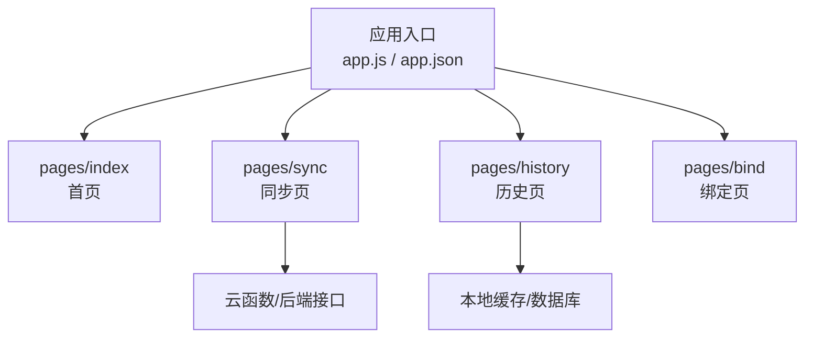
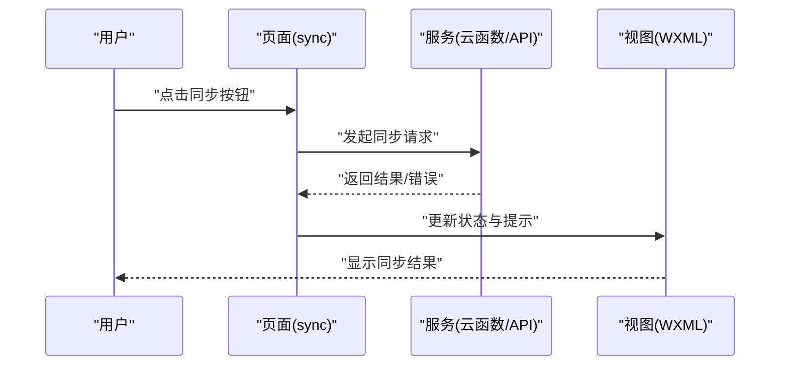
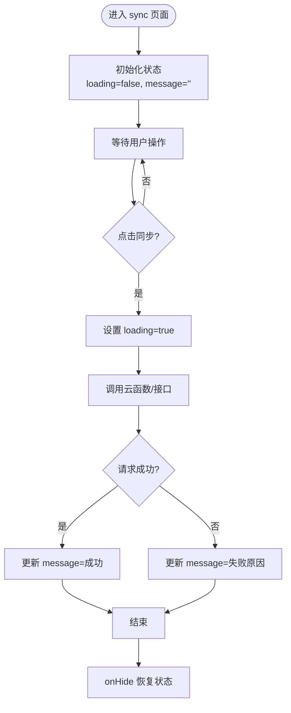
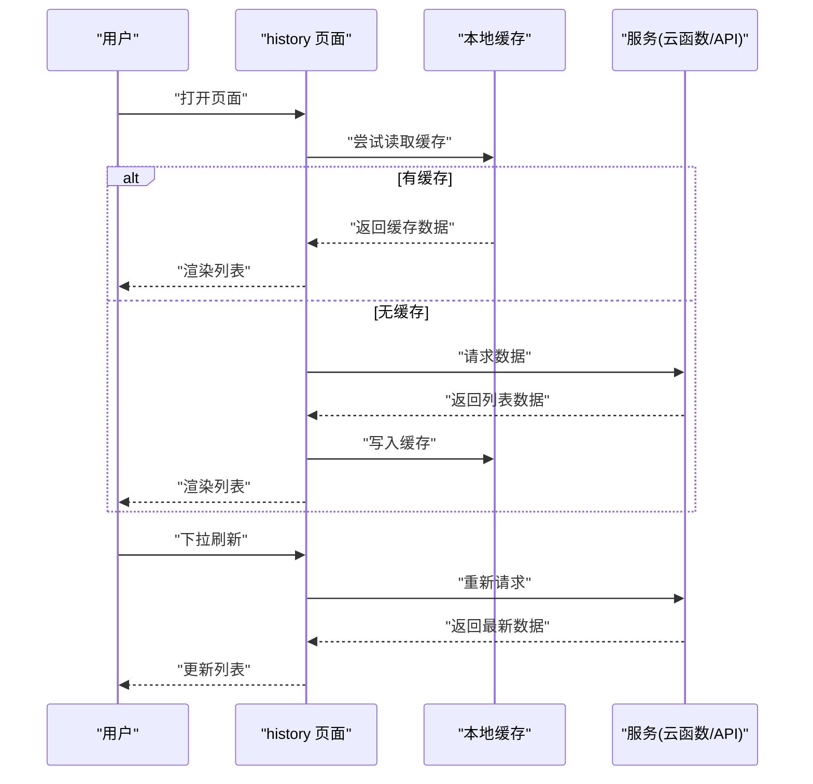
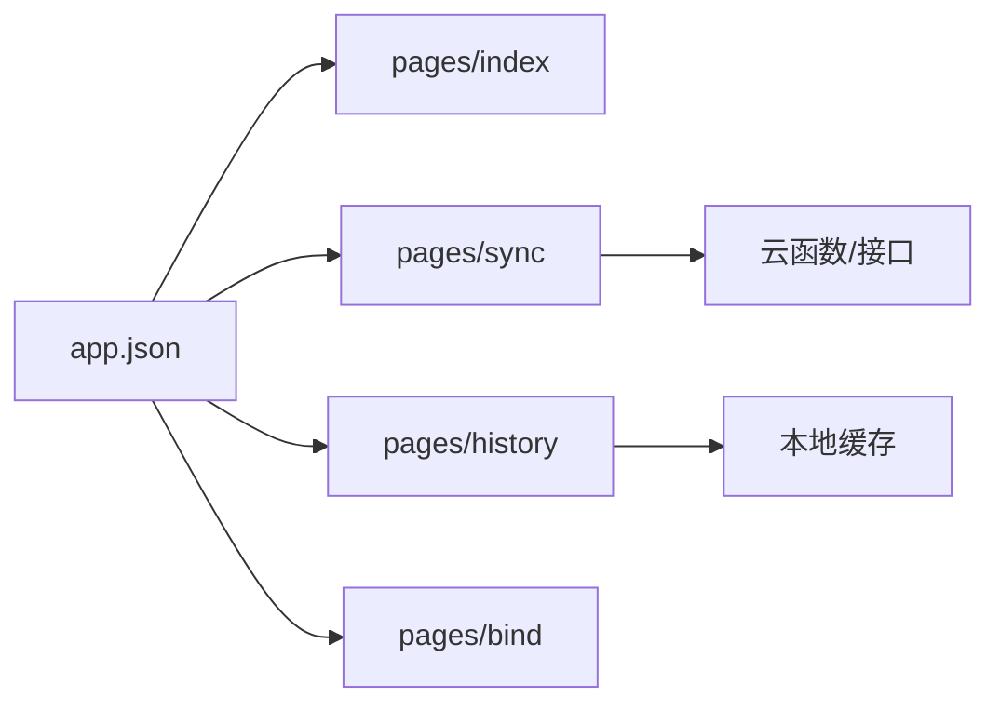

# 小程序页面开发

<cite>
**本文引用的文件**   
- [app.json](file://miniprogram/app.json)
- [app.js](file://miniprogram/app.js)
- [index/index.js](file://miniprogram/pages/index/index.js)
- [index/index.wxml](file://miniprogram/pages/index/index.wxml)
- [index/index.wxss](file://miniprogram/pages/index/index.wxss)
- [sync/sync.js](file://miniprogram/pages/sync/sync.js)
- [sync/sync.wxml](file://miniprogram/pages/sync/sync.wxml)
- [sync/sync.wxss](file://miniprogram/pages/sync/sync.wxss)
- [history/history.js](file://miniprogram/pages/history/history.js)
- [history/history.wxml](file://miniprogram/pages/history/history.wxml)
- [history/history.wxss](file://miniprogram/pages/history/history.wxss)
- [bind/bind.js](file://miniprogram/pages/bind/bind.js)
- [bind/bind.wxml](file://miniprogram/pages/bind/bind.wxml)
</cite>

## 目录
1. [简介](#简介)
2. [项目结构](#项目结构)
3. [核心组件](#核心组件)
4. [架构总览](#架构总览)
5. [详细组件分析](#详细组件分析)
6. [依赖分析](#依赖分析)
7. [性能考虑](#性能考虑)
8. [故障排查指南](#故障排查指南)
9. [结论](#结论)
10. [附录](#附录) 

## 简介
本文件面向微信小程序页面开发者，系统化讲解页面基本结构（JS逻辑、WXML模板、WXSS样式）、生命周期管理、数据绑定与事件处理模式，并给出新增功能页面的完整流程。文档以本项目中的 sync 与 history 页面为例，展示从数据获取、用户交互到错误处理的实现要点，同时提供性能优化与调试方法，帮助快速上手与高质量交付。

## 项目结构
小程序采用“页面级”组织方式：每个页面一个独立目录，包含 JS/WXML/WXSS/JSON 四个文件；应用入口在 miniprogram 根目录，通过 app.json 配置页面路由与全局样式等。

**图示来源** 
- [app.json](file://miniprogram/app.json)
- [index/index.js](file://miniprogram/pages/index/index.js)
- [sync/sync.js](file://miniprogram/pages/sync/sync.js)
- [history/history.js](file://miniprogram/pages/history/history.js)
- [bind/bind.js](file://miniprogram/pages/bind/bind.js)

**章节来源**
- [app.json](file://miniprogram/app.json)
- [app.js](file://miniprogram/app.js)

## 核心组件
- 页面四件套
  - JS：页面逻辑、生命周期、数据与方法定义
  - WXML：模板结构与数据绑定、事件绑定
  - WXSS：页面样式
  - JSON：页面级配置（导航栏、使用组件等）
- 应用级配置
  - app.json：注册页面路由、窗口外观、分包与 tabBar 等
  - app.js：应用生命周期、全局状态初始化
- 示例页面
  - index：首页入口，演示基础结构与跳转
  - sync：数据同步，演示网络请求、进度反馈与错误处理
  - history：历史记录，演示列表渲染、分页与缓存策略
  - bind：账号绑定，演示表单输入与校验

**章节来源**
- [index/index.js](file://miniprogram/pages/index/index.js)
- [index/index.wxml](file://miniprogram/pages/index/index.wxml)
- [index/index.wxss](file://miniprogram/pages/index/index.wxss)
- [sync/sync.js](file://miniprogram/pages/sync/sync.js)
- [sync/sync.wxml](file://miniprogram/pages/sync/sync.wxml)
- [sync/sync.wxss](file://miniprogram/pages/sync/sync.wxss)
- [history/history.js](file://miniprogram/pages/history/history.js)
- [history/history.wxml](file://miniprogram/pages/history/history.wxml)
- [history/history.wxss](file://miniprogram/pages/history/history.wxss)
- [bind/bind.js](file://miniprogram/pages/bind/bind.js)
- [bind/bind.wxml](file://miniprogram/pages/bind/bind.wxml)

## 架构总览
小程序前端通过页面层发起请求，调用云函数或后端 API，返回数据后更新视图。页面间通过路由跳转与参数传递进行通信，必要时借助全局状态或本地存储进行跨页面共享。

**图示来源** 
- [sync/sync.js](file://miniprogram/pages/sync/sync.js)
- [sync/sync.wxml](file://miniprogram/pages/sync/sync.wxml)

## 详细组件分析

### 页面生命周期与数据流
- 生命周期关键点
  - onLoad：页面加载时初始化数据、订阅事件
  - onShow：页面显示时刷新必要数据
  - onReady：首次渲染完成，适合执行非阻塞操作
  - onHide/onUnload：清理定时器、取消监听
- 数据流
  - 数据变更通过 this.setData 触发视图更新
  - 列表类数据建议分批更新，避免一次性 setData 过大
  - 复杂状态可拆分为多个 data 字段，减少重绘范围

**章节来源**
- [index/index.js](file://miniprogram/pages/index/index.js)
- [sync/sync.js](file://miniprogram/pages/sync/sync.js)
- [history/history.js](file://miniprogram/pages/history/history.js)

### 数据绑定机制
- 模板中使用双花括号语法绑定 data 字段
- 支持表达式、三元运算、数组/对象属性访问
- 双向绑定需结合 input 的 bindinput 与 setData

**章节来源**
- [index/index.wxml](file://miniprogram/pages/index/index.wxml)
- [sync/sync.wxml](file://miniprogram/pages/sync/sync.wxml)
- [history/history.wxml](file://miniprogram/pages/history/history.wxml)

### 事件处理模式
- 常用事件：tap、input、change、submit
- 事件回调中通过 e.currentTarget.dataset 获取自定义数据
- 长耗时操作应放入异步任务，避免阻塞 UI

**章节来源**
- [sync/sync.wxml](file://miniprogram/pages/sync/sync.wxml)
- [bind/bind.wxml](file://miniprogram/pages/bind/bind.wxml)

### 路由与页面间通信
- 路由配置：在 app.json 的 pages 数组中声明页面路径
- 页面跳转：wx.navigateTo、wx.redirectTo、wx.switchTab
- 传参：URL 查询参数或全局变量（谨慎使用）
- 回传：通过 wx.setStorageSync 或事件总线模式

**章节来源**
- [app.json](file://miniprogram/app.json)
- [index/index.js](file://miniprogram/pages/index/index.js)

### 状态管理与本地存储
- 轻量状态：优先使用 page.data + setData
- 跨页面共享：wx.setStorageSync/wx.getStorageSync
- 大对象/敏感数据：建议使用加密或云端存储

**章节来源**
- [history/history.js](file://miniprogram/pages/history/history.js)

### sync 页面开发示例
- 目标：用户点击触发同步，展示进度与结果，失败重试
- 关键步骤
  - 初始化：onLoad 准备 UI 状态
  - 交互：onTap 触发同步，禁用按钮防重复
  - 请求：调用云函数或 API，处理成功/失败分支
  - 反馈：更新进度文案与结果提示
  - 清理：onHide 恢复按钮状态

**图示来源** 
- [sync/sync.js](file://miniprogram/pages/sync/sync.js)
- [sync/sync.wxml](file://miniprogram/pages/sync/sync.wxml)

**章节来源**
- [sync/sync.js](file://miniprogram/pages/sync/sync.js)
- [sync/sync.wxml](file://miniprogram/pages/sync/sync.wxml)
- [sync/sync.wxss](file://miniprogram/pages/sync/sync.wxss)

### history 页面开发示例
- 目标：展示历史数据列表，支持下拉刷新与分页加载
- 关键步骤
  - 初始化：onLoad 读取缓存或发起请求
  - 渲染：wxml 循环渲染列表项
  - 交互：下拉刷新重置数据，上拉加载更多
  - 错误：网络异常提示与重试入口

**图示来源** 
- [history/history.js](file://miniprogram/pages/history/history.js)
- [history/history.wxml](file://miniprogram/pages/history/history.wxml)

**章节来源**
- [history/history.js](file://miniprogram/pages/history/history.js)
- [history/history.wxml](file://miniprogram/pages/history/history.wxml)
- [history/history.wxss](file://miniprogram/pages/history/history.wxss)

### 新增功能页面开发流程
- 创建页面目录与四件套文件
- 在 app.json 的 pages 中注册新页面
- 编写 JS 逻辑：生命周期、数据与方法
- 编写 WXML 模板：数据绑定与事件绑定
- 编写 WXSS 样式：布局与主题
- 测试与调试：真机预览、开发者工具断点

**章节来源**
- [app.json](file://miniprogram/app.json)
- [index/index.js](file://miniprogram/pages/index/index.js)

## 依赖分析
- 页面与应用的依赖关系
  - 所有页面依赖 app.json 的路由配置
  - 页面之间不直接耦合，通过路由与存储通信
- 外部依赖
  - 云函数/后端接口：用于数据同步与持久化
  - 本地存储：用于缓存与临时状态

**图示来源** 
- [app.json](file://miniprogram/app.json)
- [sync/sync.js](file://miniprogram/pages/sync/sync.js)
- [history/history.js](file://miniprogram/pages/history/history.js)

**章节来源**
- [app.json](file://miniprogram/app.json)

## 性能考虑
- 减少 setData 频率与数据量：合并更新、按需更新
- 列表渲染优化：虚拟滚动、分页加载、懒加载图片
- 避免频繁重排：合理布局、减少嵌套层级
- 网络请求优化：缓存策略、并发控制、超时与重试
- 资源体积控制：分包加载、按需引入组件

[本节为通用指导，无需特定文件引用]

## 故障排查指南
- 常见问题
  - 页面未注册：检查 app.json 的 pages 是否包含该路径
  - 数据未更新：确认 setData 调用与字段名一致
  - 事件无效：检查 wxml 的事件绑定与 dataset 取值
  - 网络错误：查看控制台日志与接口返回码
- 调试技巧
  - 使用开发者工具的 Network 面板查看请求
  - 使用 Console 输出关键状态
  - 使用断点定位问题代码

**章节来源**
- [sync/sync.js](file://miniprogram/pages/sync/sync.js)
- [history/history.js](file://miniprogram/pages/history/history.js)

## 结论
通过规范化的页面组织、清晰的生命周期与数据流设计、稳健的错误处理与性能优化策略，可以高效构建稳定易用的小程序页面。以 sync 与 history 为例，掌握数据获取、用户交互与状态管理的最佳实践，有助于快速扩展更多功能页面。

[本节为总结性内容，无需特定文件引用]

## 附录
- 推荐实践清单
  - 页面职责单一，逻辑内聚
  - 模板简洁，避免复杂表达式
  - 样式模块化，复用公共样式
  - 错误提示友好，提供重试入口
  - 日志与埋点完善，便于问题定位

[本节为补充信息，无需特定文件引用]