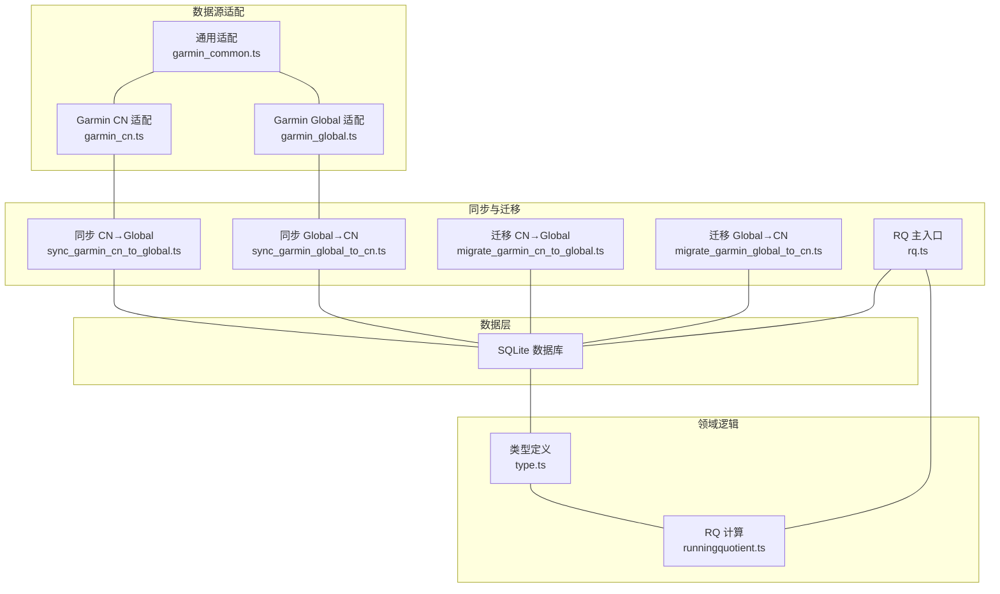
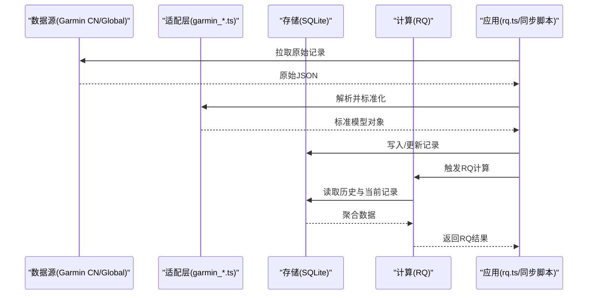
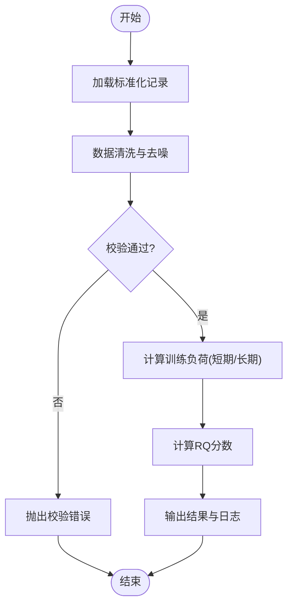
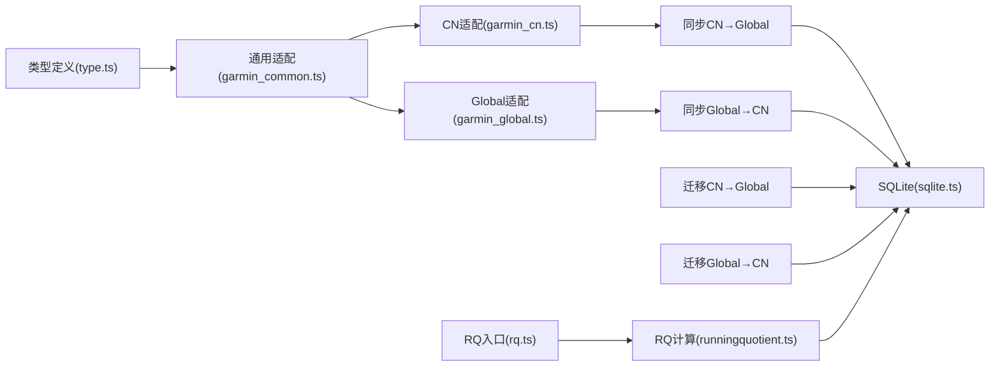

# 数据模型映射

<cite>
**本文引用的文件**   
- [src/utils/type.ts](file://dailysync-ref/src/utils/type.ts)
- [src/utils/sqlite.ts](file://dailysync-ref/src/utils/sqlite.ts)
- [src/utils/runningquotient.ts](file://dailysync-ref/src/utils/runningquotient.ts)
- [src/utils/garmin_common.ts](file://dailysync-ref/src/utils/garmin_common.ts)
- [src/utils/garmin_cn.ts](file://dailysync-ref/src/utils/garmin_cn.ts)
- [src/utils/garmin_global.ts](file://dailysync-ref/src/utils/garmin_global.ts)
- [src/rq.ts](file://dailysync-ref/src/rq.ts)
- [src/migrate_garmin_cn_to_global.ts](file://dailysync-ref/src/migrate_garmin_cn_to_global.ts)
- [src/migrate_garmin_global_to_cn.ts](file://dailysync-ref/src/migrate_garmin_global_to_cn.ts)
- [src/sync_garmin_cn_to_global.ts](file://dailysync-ref/src/sync_garmin_cn_to_global.ts)
- [src/sync_garmin_global_to_cn.ts](file://dailysync-ref/src/sync_garmin_global_to_cn.ts)
- [package.json](file://dailysync-ref/package.json)
- [tsconfig.json](file://dailysync-ref/tsconfig.json)
</cite>

## 目录
1. [简介](#简介)
2. [项目结构](#项目结构)
3. [核心组件](#核心组件)
4. [架构总览](#架构总览)
5. [详细组件分析](#详细组件分析)
6. [依赖关系分析](#依赖关系分析)
7. [性能考虑](#性能考虑)
8. [故障排查指南](#故障排查指南)
9. [结论](#结论)
10. [附录](#附录)

## 简介
本文件聚焦于数据模型与映射体系，覆盖以下方面：
- TypeScript 类型定义的组织方式与命名规范
- 多数据源（Garmin CN/Garmin Global、SQLite）之间的字段映射策略
- 数据类型转换、默认值处理与验证规则
- SQLite 表结构设计、索引优化与查询调优
- 以 Running Quotient（RQ）计算为例的复杂数据处理流程
- 数据迁移、版本管理与备份恢复策略

## 项目结构
本项目采用“按功能域组织”的结构，关键目录与职责如下：
- dailysync-ref/src/utils：工具与领域逻辑（类型、SQLite、RQ 计算、各数据源适配）
- dailysync-ref/src：同步与迁移脚本入口
- dailysync-ref/package.json、tsconfig.json：构建与运行配置

图表来源
- [src/utils/type.ts](file://dailysync-ref/src/utils/type.ts)
- [src/utils/sqlite.ts](file://dailysync-ref/src/utils/sqlite.ts)
- [src/utils/runningquotient.ts](file://dailysync-ref/src/utils/runningquotient.ts)
- [src/utils/garmin_common.ts](file://dailysync-ref/src/utils/garmin_common.ts)
- [src/utils/garmin_cn.ts](file://dailysync-ref/src/utils/garmin_cn.ts)
- [src/utils/garmin_global.ts](file://dailysync-ref/src/utils/garmin_global.ts)
- [src/rq.ts](file://dailysync-ref/src/rq.ts)
- [src/sync_garmin_cn_to_global.ts](file://dailysync-ref/src/sync_garmin_cn_to_global.ts)
- [src/sync_garmin_global_to_cn.ts](file://dailysync-ref/src/sync_garmin_global_to_cn.ts)
- [src/migrate_garmin_cn_to_global.ts](file://dailysync-ref/src/migrate_garmin_cn_to_global.ts)
- [src/migrate_garmin_global_to_cn.ts](file://dailysync-ref/src/migrate_garmin_global_to_cn.ts)

章节来源
- [package.json](file://dailysync-ref/package.json)
- [tsconfig.json](file://dailysync-ref/tsconfig.json)

## 核心组件
- 类型定义模块：集中管理所有实体与 DTO 的类型声明，统一命名与约束。
- SQLite 访问模块：封装建表、索引、CRUD、事务与错误处理。
- RQ 计算模块：实现 Running Quotient 的业务算法与输入校验。
- Garmin 适配模块：将不同区域的数据源字段标准化为内部类型。
- 同步与迁移模块：负责跨源数据同步与版本化迁移。

章节来源
- [src/utils/type.ts](file://dailysync-ref/src/utils/type.ts)
- [src/utils/sqlite.ts](file://dailysync-ref/src/utils/sqlite.ts)
- [src/utils/runningquotient.ts](file://dailysync-ref/src/utils/runningquotient.ts)
- [src/utils/garmin_common.ts](file://dailysync-ref/src/utils/garmin_common.ts)
- [src/utils/garmin_cn.ts](file://dailysync-ref/src/utils/garmin_cn.ts)
- [src/utils/garmin_global.ts](file://dailysync-ref/src/utils/garmin_global.ts)

## 架构总览
整体数据流从外部数据源进入，经适配层标准化后写入 SQLite；RQ 计算读取标准化数据并产出指标；同步与迁移在 CN/Global 之间进行双向流转与版本演进。

图表来源
- [src/utils/garmin_common.ts](file://dailysync-ref/src/utils/garmin_common.ts)
- [src/utils/garmin_cn.ts](file://dailysync-ref/src/utils/garmin_cn.ts)
- [src/utils/garmin_global.ts](file://dailysync-ref/src/utils/garmin_global.ts)
- [src/utils/sqlite.ts](file://dailysync-ref/src/utils/sqlite.ts)
- [src/utils/runningquotient.ts](file://dailysync-ref/src/utils/runningquotient.ts)
- [src/rq.ts](file://dailysync-ref/src/rq.ts)

## 详细组件分析

### 类型定义与命名规范
- 组织方式
  - 单一类型文件集中管理，避免散落定义导致不一致。
  - 使用接口描述实体，使用联合类型表达枚举与状态。
  - 对可选字段使用可空类型，对必填字段显式标注。
- 命名规范
  - 实体名采用 PascalCase（如 Activity、TrainingLoad）。
  - 字段名采用 camelCase，保持与 JSON 一致或提供映射别名。
  - 常量与枚举采用 UPPER_SNAKE_CASE。
- 验证与默认值
  - 在类型层通过只读属性与构造器保证不可变性与默认值。
  - 在运行时通过校验函数对边界值与单位进行归一化。

章节来源
- [src/utils/type.ts](file://dailysync-ref/src/utils/type.ts)

### SQLite 表结构与索引优化
- 设计原则
  - 规范化与反规范化结合：主表规范化，热点查询列适度冗余。
  - 明确主键与唯一约束，避免重复插入。
  - 时间序列字段建立范围查询索引。
- 索引策略
  - 复合索引用于常见过滤条件组合（如日期+运动类型）。
  - 外键关联字段建立索引以提升 JOIN 性能。
  - 避免过度索引，权衡写入放大与查询收益。
- 查询调优
  - 使用 EXPLAIN ANALYZE 定位慢查询。
  - 分页查询使用游标或基于主键的范围扫描。
  - 批量写入使用事务包裹减少磁盘 IO。

章节来源
- [src/utils/sqlite.ts](file://dailysync-ref/src/utils/sqlite.ts)

### Garmin 数据源适配与字段映射
- 通用适配
  - 统一时区、单位与时间戳格式。
  - 缺失字段提供安全默认值。
- 区域差异
  - CN 与 Global 字段名与枚举值存在差异，需分别映射到内部类型。
  - 特殊字段（如配速区间、心率区间）做数值归一化。
- 映射策略
  - 一对一映射优先，必要时引入中间层 DTO。
  - 使用映射函数集中处理转换与校验，便于测试与维护。

章节来源
- [src/utils/garmin_common.ts](file://dailysync-ref/src/utils/garmin_common.ts)
- [src/utils/garmin_cn.ts](file://dailysync-ref/src/utils/garmin_cn.ts)
- [src/utils/garmin_global.ts](file://dailysync-ref/src/utils/garmin_global.ts)

### Running Quotient（RQ）计算流程
- 输入
  - 标准化后的活动记录（距离、时长、配速、心率等）。
  - 历史训练负荷与近期表现基线。
- 处理
  - 数据清洗与异常值剔除。
  - 计算短期与长期训练负荷，得到疲劳与适应度指标。
  - 根据阈值与权重得出 RQ 分数。
- 输出
  - RQ 分数及分项指标（如强度、恢复建议）。
  - 计算日志与置信度提示。

图表来源
- [src/utils/runningquotient.ts](file://dailysync-ref/src/utils/runningquotient.ts)
- [src/rq.ts](file://dailysync-ref/src/rq.ts)

章节来源
- [src/utils/runningquotient.ts](file://dailysync-ref/src/utils/runningquotient.ts)
- [src/rq.ts](file://dailysync-ref/src/rq.ts)

### 同步与迁移策略
- 同步
  - 增量拉取：基于时间戳或游标避免全量重复。
  - 幂等写入：使用唯一键去重，失败重试与补偿。
- 迁移
  - 版本化：每个迁移脚本包含版本号与回滚逻辑。
  - 双向兼容：确保新旧结构共存期间的读写兼容。
  - 灰度发布：先小流量验证再全量切换。

章节来源
- [src/sync_garmin_cn_to_global.ts](file://dailysync-ref/src/sync_garmin_cn_to_global.ts)
- [src/sync_garmin_global_to_cn.ts](file://dailysync-ref/src/sync_garmin_global_to_cn.ts)
- [src/migrate_garmin_cn_to_global.ts](file://dailysync-ref/src/migrate_garmin_cn_to_global.ts)
- [src/migrate_garmin_global_to_cn.ts](file://dailysync-ref/src/migrate_garmin_global_to_cn.ts)

## 依赖关系分析
- 模块耦合
  - 适配层依赖类型定义，不直接依赖具体数据源实现细节。
  - 计算模块仅依赖标准化数据，屏蔽数据源差异。
  - 同步与迁移模块依赖 SQLite 抽象，解耦存储实现。
- 外部依赖
  - SQLite 驱动用于本地持久化。
  - HTTP 客户端用于远程数据拉取（由同步脚本控制）。

图表来源
- [src/utils/type.ts](file://dailysync-ref/src/utils/type.ts)
- [src/utils/garmin_common.ts](file://dailysync-ref/src/utils/garmin_common.ts)
- [src/utils/garmin_cn.ts](file://dailysync-ref/src/utils/garmin_cn.ts)
- [src/utils/garmin_global.ts](file://dailysync-ref/src/utils/garmin_global.ts)
- [src/utils/sqlite.ts](file://dailysync-ref/src/utils/sqlite.ts)
- [src/rq.ts](file://dailysync-ref/src/rq.ts)
- [src/sync_garmin_cn_to_global.ts](file://dailysync-ref/src/sync_garmin_cn_to_global.ts)
- [src/sync_garmin_global_to_cn.ts](file://dailysync-ref/src/sync_garmin_global_to_cn.ts)
- [src/migrate_garmin_cn_to_global.ts](file://dailysync-ref/src/migrate_garmin_cn_to_global.ts)
- [src/migrate_garmin_global_to_cn.ts](file://dailysync-ref/src/migrate_garmin_global_to_cn.ts)

## 性能考虑
- 数据拉取
  - 分页与并发限制，避免网络拥塞与限流。
  - 压缩传输与缓存热点数据。
- 数据处理
  - 批量写入与事务合并，降低锁竞争。
  - 惰性计算与流式处理，减少内存峰值。
- 查询优化
  - 合理索引与覆盖索引，减少回表。
  - 预聚合视图与物化表提升热点查询速度。

[本节为通用指导，无需特定文件引用]

## 故障排查指南
- 常见问题
  - 字段缺失或类型不匹配：检查适配层映射与默认值策略。
  - 重复记录：确认唯一键与幂等写入逻辑。
  - RQ 异常值：审查数据清洗与边界校验。
- 诊断手段
  - 启用详细日志与采样追踪。
  - 使用 SQLite 分析工具查看执行计划。
  - 对迁移脚本进行回滚演练。

章节来源
- [src/utils/sqlite.ts](file://dailysync-ref/src/utils/sqlite.ts)
- [src/utils/runningquotient.ts](file://dailysync-ref/src/utils/runningquotient.ts)

## 结论
通过统一的类型定义、清晰的适配层与稳健的 SQLite 抽象，本项目实现了多数据源的稳定映射与高性能计算。RQ 计算流程在数据清洗与标准化基础上保证了准确性与可解释性。同步与迁移策略确保了版本演进与数据一致性。

[本节为总结性内容，无需特定文件引用]

## 附录
- 构建与运行
  - 使用包管理器安装依赖与编译 TypeScript。
  - 通过脚本启动同步或迁移任务。
- 最佳实践
  - 变更先行：类型与契约优先，再实现适配。
  - 测试驱动：对映射与计算逻辑编写单元测试。
  - 监控告警：对同步失败与数据异常设置告警。

章节来源
- [package.json](file://dailysync-ref/package.json)
- [tsconfig.json](file://dailysync-ref/tsconfig.json)