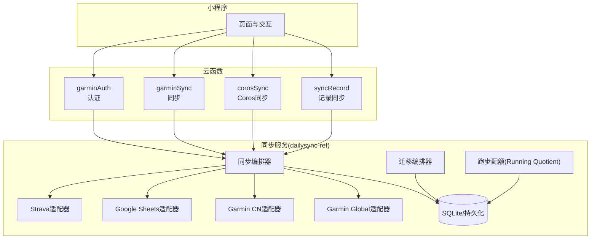
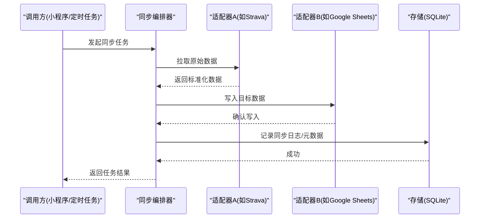
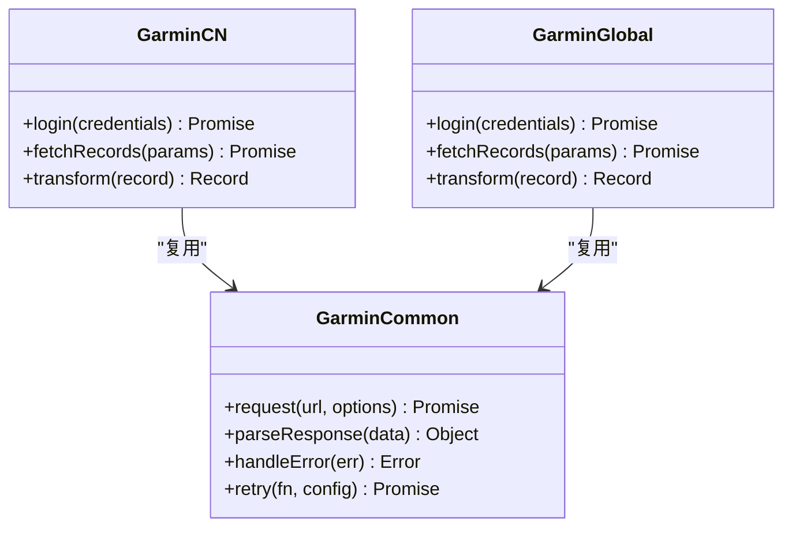
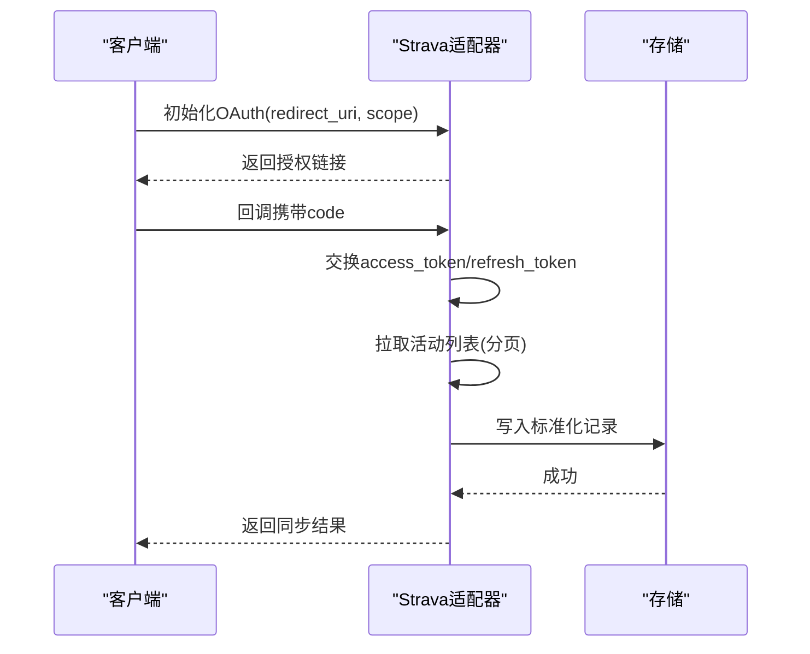
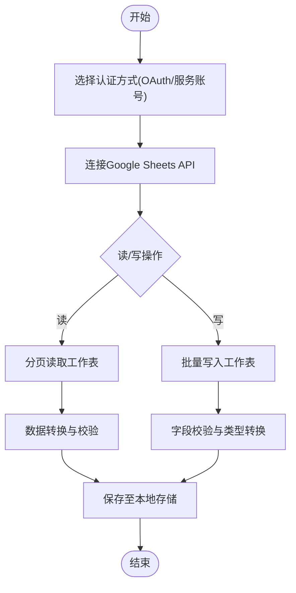
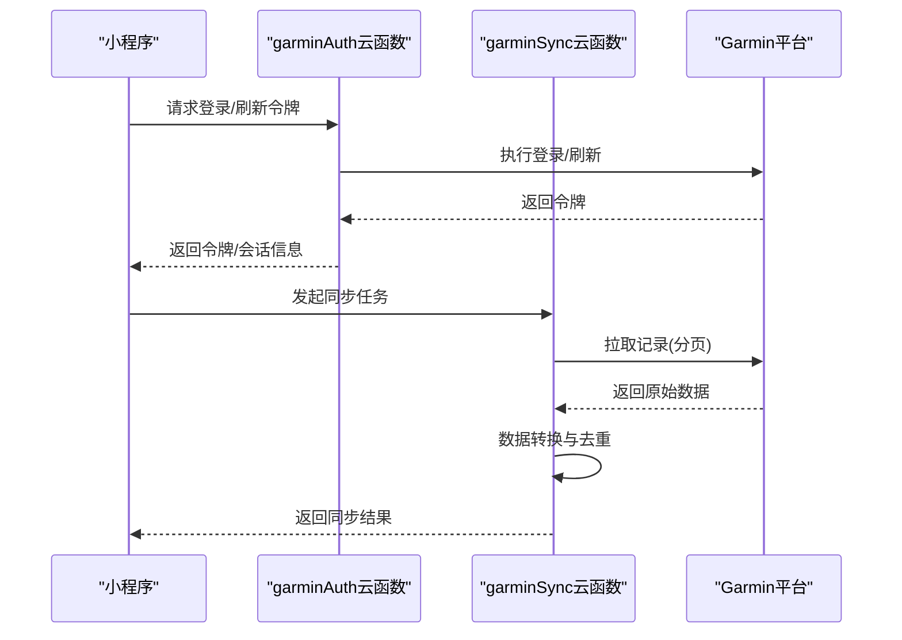
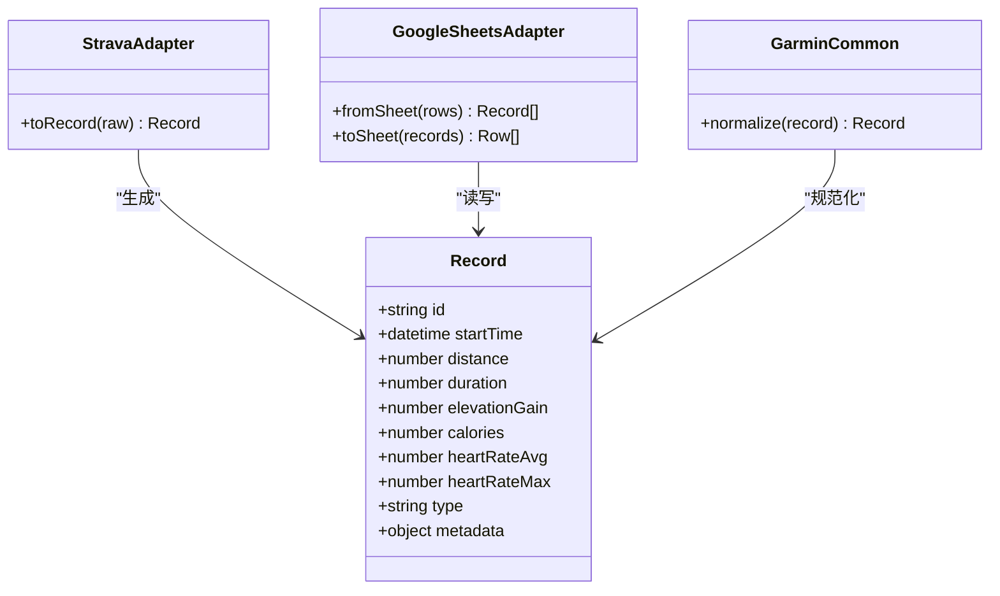
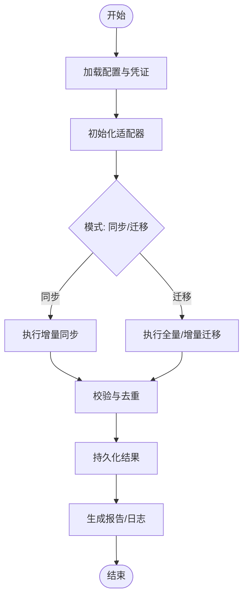
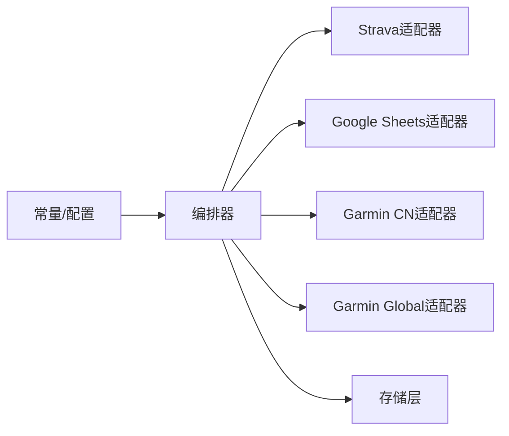

# 第三方服务集成

<cite>
**本文引用的文件**   
- [README.md](file://README.md)
- [garminAuth/index.js](file://cloudfunctions/garminAuth/index.js)
- [garminAuth/config.json](file://cloudfunctions/garminAuth/config.json)
- [garminSync/index.js](file://cloudfunctions/garminSync/index.js)
- [garminSync/config.json](file://cloudfunctions/garminSync/config.json)
- [corosSync/index.js](file://cloudfunctions/corosSync/index.js)
- [syncRecord/index.js](file://cloudfunctions/syncRecord/index.js)
- [src/utils/strava.ts](file://dailysync-ref/src/utils/strava.ts)
- [src/utils/google_sheets.ts](file://dailysync-ref/src/utils/google_sheets.ts)
- [src/utils/garmin_common.ts](file://dailysync-ref/src/utils/garmin_common.ts)
- [src/utils/garmin_cn.ts](file://dailysync-ref/src/utils/garmin_cn.ts)
- [src/utils/garmin_global.ts](file://dailysync-ref/src/utils/garmin_global.ts)
- [src/utils/type.ts](file://dailysync-ref/src/utils/type.ts)
- [src/sync_garmin_cn_to_global.ts](file://dailysync-ref/src/sync_garmin_cn_to_global.ts)
- [src/sync_garmin_global_to_cn.ts](file://dailysync-ref/src/sync_garmin_global_to_cn.ts)
- [src/migrate_garmin_cn_to_global.ts](file://dailysync-ref/src/migrate_garmin_cn_to_global.ts)
- [src/migrate_garmin_global_to_cn.ts](file://dailysync-ref/src/migrate_garmin_global_to_cn.ts)
- [src/rq.ts](file://dailysync-ref/src/rq.ts)
- [src/constant.ts](file://dailysync-ref/src/constant.ts)
</cite>

## 目录
1. [引言](#引言)
2. [项目结构](#项目结构)
3. [核心组件](#核心组件)
4. [架构总览](#架构总览)
5. [详细组件分析](#详细组件分析)
6. [依赖关系分析](#依赖关系分析)
7. [性能与可靠性设计](#性能与可靠性设计)
8. [故障排查指南](#故障排查指南)
9. [结论](#结论)
10. [附录：适配新数据源API的规范模板](#附录适配新数据源api的规范模板)

## 引言
本文件面向“第三方服务集成”的目标，系统性说明如何在本项目中适配新的数据源API，覆盖认证流程、请求封装、响应解析、字段映射与类型定义。重点阐述Garmin CN与Garmin Global双站点的差异化处理策略，并以Strava与Google Sheets集成为例，完整展示OAuth认证、数据同步与错误处理的实践。同时给出API限流、缓存策略与重试机制的设计模式建议，帮助读者快速扩展更多第三方平台。

## 项目结构
本项目由微信小程序端、云函数（Cloud Functions）与独立的数据同步服务（dailysync-ref）组成：
- 小程序端负责用户交互与触发同步任务。
- 云函数承担各平台的鉴权与数据拉取/写入等后端能力。
- dailysync-ref为TypeScript工程，提供统一的同步编排、迁移、数据格式转换与工具库。

图表来源
- [garminAuth/index.js:1-200](file://cloudfunctions/garminAuth/index.js#L1-L200)
- [garminSync/index.js:1-200](file://cloudfunctions/garminSync/index.js#L1-L200)
- [corosSync/index.js:1-200](file://cloudfunctions/corosSync/index.js#L1-L200)
- [syncRecord/index.js:1-200](file://cloudfunctions/syncRecord/index.js#L1-L200)
- [src/utils/strava.ts:1-200](file://dailysync-ref/src/utils/strava.ts#L1-L200)
- [src/utils/google_sheets.ts:1-200](file://dailysync-ref/src/utils/google_sheets.ts#L1-L200)
- [src/utils/garmin_common.ts:1-200](file://dailysync-ref/src/utils/garmin_common.ts#L1-L200)
- [src/utils/garmin_cn.ts:1-200](file://dailysync-ref/src/utils/garmin_cn.ts#L1-L200)
- [src/utils/garmin_global.ts:1-200](file://dailysync-ref/src/utils/garmin_global.ts#L1-L200)
- [src/sync_garmin_cn_to_global.ts:1-200](file://dailysync-ref/src/sync_garmin_cn_to_global.ts#L1-L200)
- [src/sync_garmin_global_to_cn.ts:1-200](file://dailysync-ref/src/sync_garmin_global_to_cn.ts#1-L200)

章节来源
- [README.md:1-200](file://README.md#L1-L200)

## 核心组件
- 认证与授权
  - Garmin认证云函数：负责获取并刷新访问令牌，维护会话状态。
  - Strava OAuth：通过授权码换取令牌，支持刷新令牌与权限范围管理。
  - Google Sheets OAuth：使用服务账号或OAuth2凭据访问电子表格。
- 数据同步与迁移
  - Garmin CN/Global双向同步：统一抽象差异，实现跨站点数据对齐。
  - Coros同步：对接Coros平台数据。
  - 记录同步：将多源数据标准化后落库或导出到目标系统。
- 工具与类型
  - Garmin通用工具：公共请求封装、签名、分页、错误处理。
  - 类型定义：统一数据结构，确保字段映射一致性。
  - Running Quotient计算：基于历史数据生成指标。

章节来源
- [garminAuth/index.js:1-200](file://cloudfunctions/garminAuth/index.js#L1-L200)
- [garminSync/index.js:1-200](file://cloudfunctions/garminSync/index.js#L1-L200)
- [src/utils/strava.ts:1-200](file://dailysync-ref/src/utils/strava.ts#L1-L200)
- [src/utils/google_sheets.ts:1-200](file://dailysync-ref/src/utils/google_sheets.ts#L1-L200)
- [src/utils/garmin_common.ts:1-200](file://dailysync-ref/src/utils/garmin_common.ts#L1-L200)
- [src/utils/type.ts:1-200](file://dailysync-ref/src/utils/type.ts#L1-L200)

## 架构总览
整体采用“适配器+编排器”的分层架构：
- 适配器层：每个第三方平台一个适配器，封装认证、请求、响应解析与错误处理。
- 编排层：调度多个适配器完成同步/迁移任务，处理并发、限流、重试与幂等。
- 存储层：SQLite或其他持久化介质，承载中间态与最终结果。

图表来源
- [src/sync_garmin_cn_to_global.ts:1-200](file://dailysync-ref/src/sync_garmin_cn_to_global.ts#L1-L200)
- [src/sync_garmin_global_to_cn.ts:1-200](file://dailysync-ref/src/sync_garmin_global_to_cn.ts#L1-L200)
- [src/utils/strava.ts:1-200](file://dailysync-ref/src/utils/strava.ts#L1-L200)
- [src/utils/google_sheets.ts:1-200](file://dailysync-ref/src/utils/google_sheets.ts#L1-L200)

## 详细组件分析

### Garmin CN/Garmin Global双站点差异化处理
- 差异点
  - 域名与接口路径不同；部分字段命名不一致；分页参数与速率限制策略存在差异。
  - 登录与会话机制不同，需要分别处理Cookie/Token。
- 统一抽象
  - 通过通用工具模块提供公共方法（签名、重试、分页、错误分类）。
  - 针对CN与Global分别实现适配器，暴露一致的接口契约。
- 同步策略
  - 以唯一键（如设备ID+时间戳）进行去重与合并。
  - 增量同步优先，全量迁移仅在必要时执行。

图表来源
- [src/utils/garmin_common.ts:1-200](file://dailysync-ref/src/utils/garmin_common.ts#L1-L200)
- [src/utils/garmin_cn.ts:1-200](file://dailysync-ref/src/utils/garmin_cn.ts#L1-L200)
- [src/utils/garmin_global.ts:1-200](file://dailysync-ref/src/utils/garmin_global.ts#L1-L200)

章节来源
- [src/utils/garmin_common.ts:1-200](file://dailysync-ref/src/utils/garmin_common.ts#L1-L200)
- [src/utils/garmin_cn.ts:1-200](file://dailysync-ref/src/utils/garmin_cn.ts#L1-L200)
- [src/utils/garmin_global.ts:1-200](file://dailysync-ref/src/utils/garmin_global.ts#L1-L200)
- [src/sync_garmin_cn_to_global.ts:1-200](file://dailysync-ref/src/sync_garmin_cn_to_global.ts#L1-L200)
- [src/sync_garmin_global_to_cn.ts:1-200](file://dailysync-ref/src/sync_garmin_global_to_cn.ts#L1-L200)

### Strava集成（OAuth、数据同步、错误处理）
- OAuth流程
  - 前端引导用户授权，后端用授权码换取访问令牌与刷新令牌。
  - 令牌过期自动刷新，失败时提示重新授权。
- 数据同步
  - 按活动/训练记录分页拉取，转换为内部标准模型。
  - 写入目标系统（如SQLite或Google Sheets），保证幂等。
- 错误处理
  - 区分网络错误、认证错误、业务错误与限流错误。
  - 对可重试错误实施指数退避重试，不可重试错误立即失败并记录日志。

图表来源
- [src/utils/strava.ts:1-200](file://dailysync-ref/src/utils/strava.ts#L1-L200)

章节来源
- [src/utils/strava.ts:1-200](file://dailysync-ref/src/utils/strava.ts#L1-L200)

### Google Sheets集成（OAuth、数据同步、错误处理）
- 认证方式
  - 支持OAuth2用户授权或服务账号密钥，根据场景选择。
- 数据同步
  - 读取/写入电子表格，行/列映射到内部模型。
  - 批量操作减少API调用次数。
- 错误处理
  - 捕获权限不足、表不存在、单元格类型不匹配等错误。
  - 重试策略适用于临时性网络问题，业务错误需人工介入。

图表来源
- [src/utils/google_sheets.ts:1-200](file://dailysync-ref/src/utils/google_sheets.ts#L1-L200)

章节来源
- [src/utils/google_sheets.ts:1-200](file://dailysync-ref/src/utils/google_sheets.ts#L1-L200)

### 云函数中的Garmin认证与同步
- garminAuth云函数
  - 负责登录、获取/刷新访问令牌、维护会话。
  - 对外暴露安全接口供小程序或同步服务调用。
- garminSync云函数
  - 接收同步指令，调用Garmin CN/Global适配器拉取数据。
  - 将数据标准化后写入数据库或转发给其他服务。

图表来源
- [garminAuth/index.js:1-200](file://cloudfunctions/garminAuth/index.js#L1-L200)
- [garminSync/index.js:1-200](file://cloudfunctions/garminSync/index.js#L1-L200)

章节来源
- [garminAuth/index.js:1-200](file://cloudfunctions/garminAuth/index.js#L1-L200)
- [garminSync/index.js:1-200](file://cloudfunctions/garminSync/index.js#L1-L200)

### 数据格式转换、字段映射与类型定义
- 类型定义
  - 在统一类型文件中定义核心实体（如活动、轨迹、心率等），明确字段类型与可选性。
- 字段映射
  - 各适配器将原始字段映射为标准模型，处理单位换算、枚举值映射与缺失值填充。
- 转换验证
  - 在转换阶段进行强校验，失败则记录详细错误信息并回滚。

图表来源
- [src/utils/type.ts:1-200](file://dailysync-ref/src/utils/type.ts#L1-L200)
- [src/utils/strava.ts:1-200](file://dailysync-ref/src/utils/strava.ts#L1-L200)
- [src/utils/google_sheets.ts:1-200](file://dailysync-ref/src/utils/google_sheets.ts#L1-L200)
- [src/utils/garmin_common.ts:1-200](file://dailysync-ref/src/utils/garmin_common.ts#L1-L200)

章节来源
- [src/utils/type.ts:1-200](file://dailysync-ref/src/utils/type.ts#L1-L200)
- [src/utils/strava.ts:1-200](file://dailysync-ref/src/utils/strava.ts#L1-L200)
- [src/utils/google_sheets.ts:1-200](file://dailysync-ref/src/utils/google_sheets.ts#L1-L200)
- [src/utils/garmin_common.ts:1-200](file://dailysync-ref/src/utils/garmin_common.ts#L1-L200)

### 同步与迁移编排
- 同步编排器
  - 协调多个适配器，控制顺序、并发与失败回滚。
  - 支持增量同步与断点续传。
- 迁移编排器
  - 用于CN与Global之间的数据迁移，保证字段一致性与完整性。

图表来源
- [src/sync_garmin_cn_to_global.ts:1-200](file://dailysync-ref/src/sync_garmin_cn_to_global.ts#L1-L200)
- [src/sync_garmin_global_to_cn.ts:1-200](file://dailysync-ref/src/sync_garmin_global_to_cn.ts#L1-L200)
- [src/migrate_garmin_cn_to_global.ts:1-200](file://dailysync-ref/src/migrate_garmin_cn_to_global.ts#L1-L200)
- [src/migrate_garmin_global_to_cn.ts:1-200](file://dailysync-ref/src/migrate_garmin_global_to_cn.ts#L1-L200)

章节来源
- [src/sync_garmin_cn_to_global.ts:1-200](file://dailysync-ref/src/sync_garmin_cn_to_global.ts#L1-L200)
- [src/sync_garmin_global_to_cn.ts:1-200](file://dailysync-ref/src/sync_garmin_global_to_cn.ts#L1-L200)
- [src/migrate_garmin_cn_to_global.ts:1-200](file://dailysync-ref/src/migrate_garmin_cn_to_global.ts#L1-L200)
- [src/migrate_garmin_global_to_cn.ts:1-200](file://dailysync-ref/src/migrate_garmin_global_to_cn.ts#L1-L200)

## 依赖关系分析
- 适配器之间低耦合，通过统一类型与接口契约协作。
- 编排器依赖适配器与存储层，不直接感知第三方平台细节。
- 常量与配置集中管理，便于切换环境与安全凭据。

图表来源
- [src/constant.ts:1-200](file://dailysync-ref/src/constant.ts#L1-L200)
- [src/sync_garmin_cn_to_global.ts:1-200](file://dailysync-ref/src/sync_garmin_cn_to_global.ts#L1-L200)
- [src/sync_garmin_global_to_cn.ts:1-200](file://dailysync-ref/src/sync_garmin_global_to_cn.ts#L1-L200)

章节来源
- [src/constant.ts:1-200](file://dailysync-ref/src/constant.ts#L1-L200)

## 性能与可靠性设计
- API限流
  - 识别429/速率限制错误，采用指数退避与抖动策略。
  - 对高并发场景引入令牌桶或滑动窗口限流。
- 缓存策略
  - 对热点数据（如用户信息、静态字典）进行短期缓存。
  - 使用ETag/Last-Modified减少重复传输。
- 重试机制
  - 仅对可重试错误（网络超时、临时限流）启用重试。
  - 设置最大重试次数与退避上限，避免雪崩。
- 幂等与去重
  - 写入前检查唯一键，避免重复记录。
  - 支持断点续传，失败后从上次位置继续。

章节来源
- [src/utils/garmin_common.ts:1-200](file://dailysync-ref/src/utils/garmin_common.ts#L1-L200)
- [src/utils/strava.ts:1-200](file://dailysync-ref/src/utils/strava.ts#L1-L200)
- [src/utils/google_sheets.ts:1-200](file://dailysync-ref/src/utils/google_sheets.ts#L1-L200)

## 故障排查指南
- 常见问题
  - 认证失败：检查授权链接、回调地址、scope权限与令牌有效期。
  - 限流频繁：降低并发度、增加退避间隔、优化分页大小。
  - 数据不一致：核对字段映射规则与单位换算逻辑。
- 定位手段
  - 查看云函数日志与同步报告，关注错误码与堆栈。
  - 使用最小数据集复现问题，逐步缩小范围。
- 恢复措施
  - 清理无效会话并重试授权。
  - 回滚异常批次，修复数据后重新执行。

章节来源
- [garminAuth/index.js:1-200](file://cloudfunctions/garminAuth/index.js#L1-L200)
- [garminSync/index.js:1-200](file://cloudfunctions/garminSync/index.js#L1-L200)
- [src/rq.ts:1-200](file://dailysync-ref/src/rq.ts#L1-L200)

## 结论
通过适配器与编排器的分层设计，本项目实现了多第三方服务的稳定集成与高效同步。Garmin CN/Global的双站点策略确保了差异化的兼容与统一的数据模型。结合限流、缓存与重试机制，系统在可靠性与性能上具备良好表现。未来可按相同规范快速接入更多平台。

## 附录：适配新数据源API的规范模板
- 认证流程
  - 明确授权方式（OAuth2/密钥/会话），实现令牌获取与刷新。
  - 提供统一的错误分类与重试策略。
- 请求封装
  - 统一HTTP客户端，注入鉴权头、重试、超时与限流。
  - 分页与游标处理，支持增量拉取。
- 响应解析
  - 定义标准模型与字段映射规则，进行类型校验与单位换算。
  - 对缺失字段提供默认值或标记未命中。
- 同步编排
  - 在编排器中注册新适配器，配置同步策略与去重键。
  - 输出结构化日志与统计指标。
- 测试与回归
  - 提供Mock数据与单元测试，覆盖正常与异常路径。
  - 定期回归验证字段映射与数据一致性。