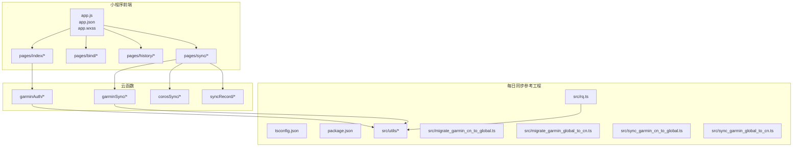
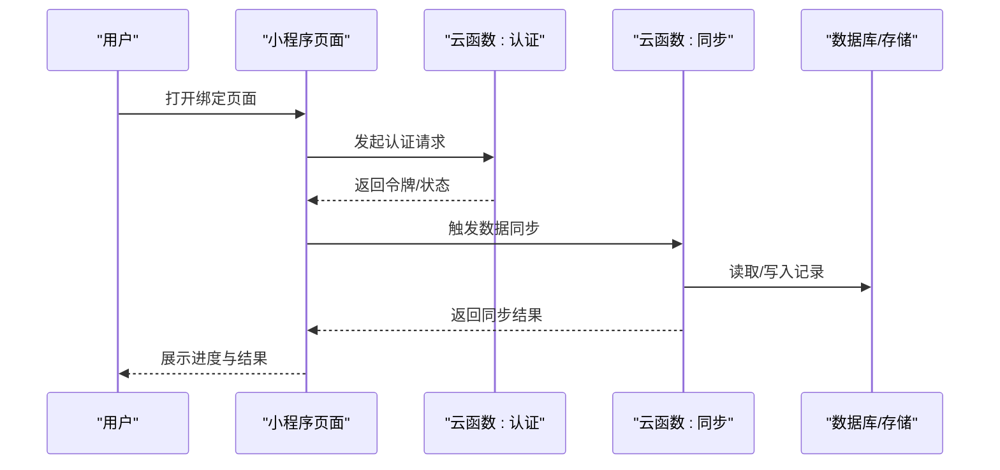
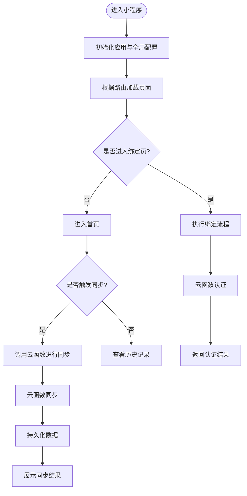
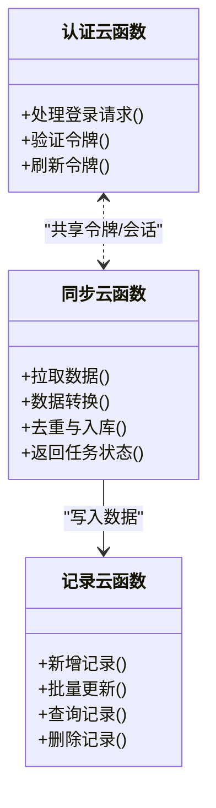
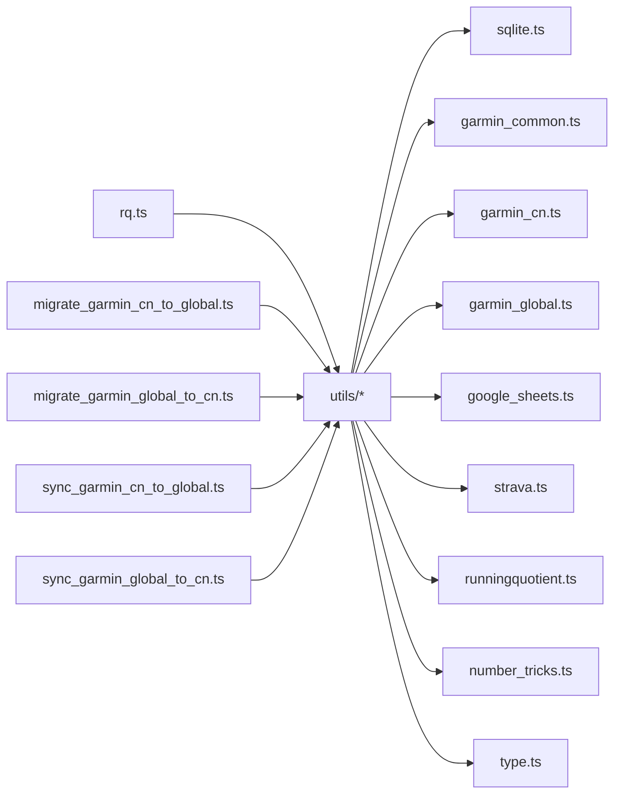
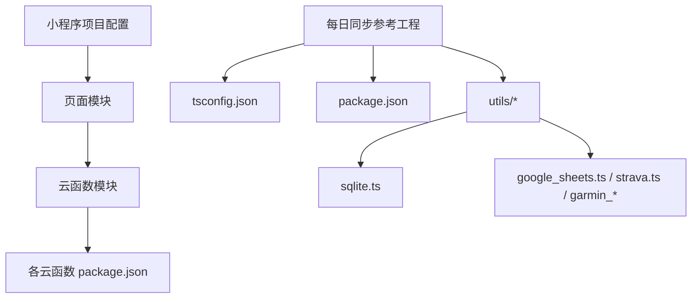

# 开发指南

<cite>
**本文引用的文件**   
- [README.md](file://README.md)
- [project.config.json](file://project.config.json)
- [project.private.config.json](file://project.private.config.json)
- [uploadCloudFunction.sh](file://uploadCloudFunction.sh)
- [miniprogram/app.js](file://miniprogram/app.js)
- [miniprogram/app.json](file://miniprogram/app.json)
- [miniprogram/app.wxss](file://miniprogram/app.wxss)
- [miniprogram/pages/index/index.js](file://miniprogram/pages/index/index.js)
- [miniprogram/pages/index/index.json](file://miniprogram/pages/index/index.json)
- [miniprogram/pages/index/index.wxml](file://miniprogram/pages/index/index.wxml)
- [miniprogram/pages/index/index.wxss](file://miniprogram/pages/index/index.wxss)
- [miniprogram/pages/bind/bind.js](file://miniprogram/pages/bind/bind.js)
- [miniprogram/pages/bind/bind.json](file://miniprogram/pages/bind/bind.json)
- [miniprogram/pages/bind/bind.wxml](file://miniprogram/pages/bind/bind.wxml)
- [miniprogram/pages/bind/bind.wxss](file://miniprogram/pages/bind/bind.wxss)
- [miniprogram/pages/history/history.js](file://miniprogram/pages/history/history.js)
- [miniprogram/pages/history/history.json](file://miniprogram/pages/history/history.json)
- [miniprogram/pages/history/history.wxml](file://miniprogram/pages/history/history.wxml)
- [miniprogram/pages/history/history.wxss](file://miniprogram/pages/history/history.wxss)
- [miniprogram/pages/sync/sync.js](file://miniprogram/pages/sync/sync.js)
- [miniprogram/pages/sync/sync.json](file://miniprogram/pages/sync/sync.json)
- [miniprogram/pages/sync/sync.wxml](file://miniprogram/pages/sync/sync.wxml)
- [miniprogram/pages/sync/sync.wxss](file://miniprogram/pages/sync/sync.wxss)
- [cloudfunctions/corosSync/index.js](file://cloudfunctions/corosSync/index.js)
- [cloudfunctions/corosSync/package.json](file://cloudfunctions/corosSync/package.json)
- [cloudfunctions/garminAuth/config.json](file://cloudfunctions/garminAuth/config.json)
- [cloudfunctions/garminAuth/index.js](file://cloudfunctions/garminAuth/index.js)
- [cloudfunctions/garminAuth/package.json](file://cloudfunctions/garminAuth/package.json)
- [cloudfunctions/garminSync/config.json](file://cloudfunctions/garminSync/config.json)
- [cloudfunctions/garminSync/index.js](file://cloudfunctions/garminSync/index.js)
- [cloudfunctions/garminSync/package.json](file://cloudfunctions/garminSync/package.json)
- [cloudfunctions/syncRecord/index.js](file://cloudfunctions/syncRecord/index.js)
- [cloudfunctions/syncRecord/package.json](file://cloudfunctions/syncRecord/package.json)
- [dailysync-ref/README.md](file://dailysync-ref/README.md)
- [dailysync-ref/tsconfig.json](file://dailysync-ref/tsconfig.json)
- [dailysync-ref/package.json](file://dailysync-ref/package.json)
- [dailysync-ref/src/utils/sqlite.ts](file://dailysync-ref/src/utils/sqlite.ts)
- [dailysync-ref/src/utils/garmin_common.ts](file://dailysync-ref/src/utils/garmin_common.ts)
- [dailysync-ref/src/utils/garmin_cn.ts](file://dailysync-ref/src/utils/garmin_cn.ts)
- [dailysync-ref/src/utils/garmin_global.ts](file://dailysync-ref/src/utils/garmin_global.ts)
- [dailysync-ref/src/utils/google_sheets.ts](file://dailysync-ref/src/utils/google_sheets.ts)
- [dailysync-ref/src/utils/strava.ts](file://dailysync-ref/src/utils/strava.ts)
- [dailysync-ref/src/utils/runningquotient.ts](file://dailysync-ref/src/utils/runningquotient.ts)
- [dailysync-ref/src/utils/number_tricks.ts](file://dailysync-ref/src/utils/number_tricks.ts)
- [dailysync-ref/src/utils/type.ts](file://dailysync-ref/src/utils/type.ts)
- [dailysync-ref/src/rq.ts](file://dailysync-ref/src/rq.ts)
- [dailysync-ref/src/migrate_garmin_cn_to_global.ts](file://dailysync-ref/src/migrate_garmin_cn_to_global.ts)
- [dailysync-ref/src/migrate_garmin_global_to_cn.ts](file://dailysync-ref/src/migrate_garmin_global_to_cn.ts)
- [dailysync-ref/src/sync_garmin_cn_to_global.ts](file://dailysync-ref/src/sync_garmin_cn_to_global.ts)
- [dailysync-ref/src/sync_garmin_global_to_cn.ts](file://dailysync-ref/src/sync_garmin_global_to_cn.ts)
</cite>

## 目录
1. [简介](#简介)
2. [项目结构](#项目结构)
3. [核心组件](#核心组件)
4. [架构总览](#架构总览)
5. [详细组件分析](#详细组件分析)
6. [依赖分析](#依赖分析)
7. [性能考虑](#性能考虑)
8. [故障排除指南](#故障排除指南)
9. [结论](#结论)
10. [附录](#附录)

## 简介
本指南面向开发者，提供微信小程序端与云函数、以及每日同步参考工程的完整开发说明。内容涵盖：
- 项目结构与模块职责
- TypeScript 配置与依赖管理
- 代码组织与模块化设计原则
- 调试技巧、测试策略与性能优化建议
- 新增功能、修改现有代码与代码审查流程
- 常见问题与故障排除

## 项目结构
仓库包含三大区域：
- 小程序前端（miniprogram）：页面、样式、应用入口与全局配置
- 云函数（cloudfunctions）：认证、数据同步等后端能力
- 每日同步参考工程（dailysync-ref）：TypeScript 工程，用于 Garmin 数据迁移与同步的参考实现

图表来源
- [miniprogram/app.js](file://miniprogram/app.js)
- [miniprogram/app.json](file://miniprogram/app.json)
- [miniprogram/pages/index/index.js](file://miniprogram/pages/index/index.js)
- [miniprogram/pages/bind/bind.js](file://miniprogram/pages/bind/bind.js)
- [miniprogram/pages/history/history.js](file://miniprogram/pages/history/history.js)
- [miniprogram/pages/sync/sync.js](file://miniprogram/pages/sync/sync.js)
- [cloudfunctions/garminAuth/index.js](file://cloudfunctions/garminAuth/index.js)
- [cloudfunctions/garminSync/index.js](file://cloudfunctions/garminSync/index.js)
- [cloudfunctions/corosSync/index.js](file://cloudfunctions/corosSync/index.js)
- [cloudfunctions/syncRecord/index.js](file://cloudfunctions/syncRecord/index.js)
- [dailysync-ref/tsconfig.json](file://dailysync-ref/tsconfig.json)
- [dailysync-ref/package.json](file://dailysync-ref/package.json)
- [dailysync-ref/src/rq.ts](file://dailysync-ref/src/rq.ts)
- [dailysync-ref/src/utils/garmin_common.ts](file://dailysync-ref/src/utils/garmin_common.ts)

章节来源
- [README.md](file://README.md)
- [project.config.json](file://project.config.json)
- [project.private.config.json](file://project.private.config.json)

## 核心组件
- 小程序应用层
  - 应用入口与全局配置：定义页面路由、窗口行为、网络与云能力初始化
  - 页面模块：首页、绑定、历史、同步等页面各自负责 UI 与交互逻辑
- 云函数层
  - 认证授权：处理第三方账号登录与鉴权
  - 数据同步：拉取并写入运动数据，支持多平台
  - 记录服务：统一的数据落库与查询接口
- 每日同步参考工程
  - 类型与工具：统一的类型定义、数据库操作、平台适配与数值计算
  - 业务脚本：数据迁移与双向同步脚本

章节来源
- [miniprogram/app.js](file://miniprogram/app.js)
- [miniprogram/app.json](file://miniprogram/app.json)
- [miniprogram/pages/index/index.js](file://miniprogram/pages/index/index.js)
- [miniprogram/pages/bind/bind.js](file://miniprogram/pages/bind/bind.js)
- [miniprogram/pages/history/history.js](file://miniprogram/pages/history/history.js)
- [miniprogram/pages/sync/sync.js](file://miniprogram/pages/sync/sync.js)
- [cloudfunctions/garminAuth/index.js](file://cloudfunctions/garminAuth/index.js)
- [cloudfunctions/garminSync/index.js](file://cloudfunctions/garminSync/index.js)
- [cloudfunctions/corosSync/index.js](file://cloudfunctions/corosSync/index.js)
- [cloudfunctions/syncRecord/index.js](file://cloudfunctions/syncRecord/index.js)
- [dailysync-ref/src/utils/type.ts](file://dailysync-ref/src/utils/type.ts)
- [dailysync-ref/src/rq.ts](file://dailysync-ref/src/rq.ts)

## 架构总览
小程序通过云函数调用完成认证与数据同步；每日同步参考工程提供 TypeScript 侧的实现参考与工具方法。

图表来源
- [miniprogram/pages/bind/bind.js](file://miniprogram/pages/bind/bind.js)
- [miniprogram/pages/sync/sync.js](file://miniprogram/pages/sync/sync.js)
- [cloudfunctions/garminAuth/index.js](file://cloudfunctions/garminAuth/index.js)
- [cloudfunctions/garminSync/index.js](file://cloudfunctions/garminSync/index.js)
- [cloudfunctions/syncRecord/index.js](file://cloudfunctions/syncRecord/index.js)

## 详细组件分析

### 小程序应用与页面
- 应用入口与配置
  - 应用生命周期与全局状态在入口文件中维护
  - 页面路由、窗口样式、网络与云能力在配置中声明
- 页面模块
  - 首页：展示概览信息，引导用户进行绑定与同步
  - 绑定页：完成第三方账号绑定与授权
  - 历史页：查看历史运动记录
  - 同步页：触发并监控数据同步任务

图表来源
- [miniprogram/app.js](file://miniprogram/app.js)
- [miniprogram/app.json](file://miniprogram/app.json)
- [miniprogram/pages/bind/bind.js](file://miniprogram/pages/bind/bind.js)
- [miniprogram/pages/sync/sync.js](file://miniprogram/pages/sync/sync.js)
- [miniprogram/pages/history/history.js](file://miniprogram/pages/history/history.js)
- [miniprogram/pages/index/index.js](file://miniprogram/pages/index/index.js)

章节来源
- [miniprogram/app.js](file://miniprogram/app.js)
- [miniprogram/app.json](file://miniprogram/app.json)
- [miniprogram/pages/index/index.js](file://miniprogram/pages/index/index.js)
- [miniprogram/pages/bind/bind.js](file://miniprogram/pages/bind/bind.js)
- [miniprogram/pages/history/history.js](file://miniprogram/pages/history/history.js)
- [miniprogram/pages/sync/sync.js](file://miniprogram/pages/sync/sync.js)

### 云函数模块
- 认证云函数
  - 负责第三方账号认证、令牌管理与会话校验
- 同步云函数
  - 负责从不同平台拉取数据、转换格式、去重与入库
- 记录云函数
  - 提供统一的增删改查接口，供小程序与参考工程调用

图表来源
- [cloudfunctions/garminAuth/index.js](file://cloudfunctions/garminAuth/index.js)
- [cloudfunctions/garminSync/index.js](file://cloudfunctions/garminSync/index.js)
- [cloudfunctions/syncRecord/index.js](file://cloudfunctions/syncRecord/index.js)

章节来源
- [cloudfunctions/garminAuth/index.js](file://cloudfunctions/garminAuth/index.js)
- [cloudfunctions/garminAuth/config.json](file://cloudfunctions/garminAuth/config.json)
- [cloudfunctions/garminSync/index.js](file://cloudfunctions/garminSync/index.js)
- [cloudfunctions/garminSync/config.json](file://cloudfunctions/garminSync/config.json)
- [cloudfunctions/corosSync/index.js](file://cloudfunctions/corosSync/index.js)
- [cloudfunctions/corosSync/package.json](file://cloudfunctions/corosSync/package.json)
- [cloudfunctions/syncRecord/index.js](file://cloudfunctions/syncRecord/index.js)
- [cloudfunctions/syncRecord/package.json](file://cloudfunctions/syncRecord/package.json)

### 每日同步参考工程（TypeScript）
- 类型与工具
  - 统一类型定义、SQLite 操作、Google Sheets/Strava/Garmin 平台适配、数值计算与运行商计算
- 业务脚本
  - 数据迁移与双向同步脚本，覆盖 Garmin CN/GLB 互转与通用同步流程

图表来源
- [dailysync-ref/src/rq.ts](file://dailysync-ref/src/rq.ts)
- [dailysync-ref/src/utils/sqlite.ts](file://dailysync-ref/src/utils/sqlite.ts)
- [dailysync-ref/src/utils/garmin_common.ts](file://dailysync-ref/src/utils/garmin_common.ts)
- [dailysync-ref/src/utils/garmin_cn.ts](file://dailysync-ref/src/utils/garmin_cn.ts)
- [dailysync-ref/src/utils/garmin_global.ts](file://dailysync-ref/src/utils/garmin_global.ts)
- [dailysync-ref/src/utils/google_sheets.ts](file://dailysync-ref/src/utils/google_sheets.ts)
- [dailysync-ref/src/utils/strava.ts](file://dailysync-ref/src/utils/strava.ts)
- [dailysync-ref/src/utils/runningquotient.ts](file://dailysync-ref/src/utils/runningquotient.ts)
- [dailysync-ref/src/utils/number_tricks.ts](file://dailysync-ref/src/utils/number_tricks.ts)
- [dailysync-ref/src/utils/type.ts](file://dailysync-ref/src/utils/type.ts)
- [dailysync-ref/src/migrate_garmin_cn_to_global.ts](file://dailysync-ref/src/migrate_garmin_cn_to_global.ts)
- [dailysync-ref/src/migrate_garmin_global_to_cn.ts](file://dailysync-ref/src/migrate_garmin_global_to_cn.ts)
- [dailysync-ref/src/sync_garmin_cn_to_global.ts](file://dailysync-ref/src/sync_garmin_cn_to_global.ts)
- [dailysync-ref/src/sync_garmin_global_to_cn.ts](file://dailysync-ref/src/sync_garmin_global_to_cn.ts)

章节来源
- [dailysync-ref/tsconfig.json](file://dailysync-ref/tsconfig.json)
- [dailysync-ref/package.json](file://dailysync-ref/package.json)
- [dailysync-ref/src/utils/type.ts](file://dailysync-ref/src/utils/type.ts)
- [dailysync-ref/src/rq.ts](file://dailysync-ref/src/rq.ts)

## 依赖分析
- 小程序端
  - 使用微信开发者工具与项目配置文件管理环境与基础库版本
  - 页面级 JSON 配置控制导航栏、分包与权限
- 云函数
  - 每个云函数独立 package.json，便于依赖隔离与部署
  - 认证与同步云函数可能依赖外部 SDK（如 OAuth、HTTP 客户端、数据库驱动）
- 每日同步参考工程
  - TypeScript 编译与构建由 tsconfig.json 与 package.json 管理
  - SQLite、Google Sheets、Strava、Garmin 等平台工具位于 utils 目录

图表来源
- [project.config.json](file://project.config.json)
- [project.private.config.json](file://project.private.config.json)
- [miniprogram/app.json](file://miniprogram/app.json)
- [cloudfunctions/garminAuth/package.json](file://cloudfunctions/garminAuth/package.json)
- [cloudfunctions/garminSync/package.json](file://cloudfunctions/garminSync/package.json)
- [cloudfunctions/corosSync/package.json](file://cloudfunctions/corosSync/package.json)
- [cloudfunctions/syncRecord/package.json](file://cloudfunctions/syncRecord/package.json)
- [dailysync-ref/tsconfig.json](file://dailysync-ref/tsconfig.json)
- [dailysync-ref/package.json](file://dailysync-ref/package.json)

章节来源
- [project.config.json](file://project.config.json)
- [project.private.config.json](file://project.private.config.json)
- [miniprogram/app.json](file://miniprogram/app.json)
- [dailysync-ref/tsconfig.json](file://dailysync-ref/tsconfig.json)
- [dailysync-ref/package.json](file://dailysync-ref/package.json)

## 性能考虑
- 小程序端
  - 减少不必要的 setData 与页面渲染开销，合并数据更新
  - 合理使用分包与懒加载，降低首屏体积
  - 图片与静态资源压缩，按需加载
- 云函数
  - 批量化读写与去重策略，避免重复入库
  - 合理设置超时与重试机制，提升稳定性
  - 缓存热点数据，减少远程 API 调用
- 每日同步参考工程
  - 使用连接池与事务，提高 SQLite 写入效率
  - 增量同步与断点续传，避免全量重复处理
  - 并行拉取与限流控制，平衡吞吐与稳定性

[本节为通用指导，不直接分析具体文件]

## 故障排除指南
- 小程序端
  - 检查 app.json 中的页面路径与权限配置是否正确
  - 使用开发者工具的调试面板查看网络请求与错误堆栈
  - 确认云函数调用参数与签名正确
- 云函数
  - 查看云函数日志定位异常原因
  - 检查环境变量与密钥配置是否生效
  - 对第三方 API 调用增加重试与降级逻辑
- 每日同步参考工程
  - 校验 SQLite 连接与表结构
  - 核对平台 API 的速率限制与字段映射
  - 使用单元测试与集成测试验证迁移与同步脚本

章节来源
- [miniprogram/app.json](file://miniprogram/app.json)
- [cloudfunctions/garminAuth/index.js](file://cloudfunctions/garminAuth/index.js)
- [cloudfunctions/garminSync/index.js](file://cloudfunctions/garminSync/index.js)
- [cloudfunctions/syncRecord/index.js](file://cloudfunctions/syncRecord/index.js)
- [dailysync-ref/src/utils/sqlite.ts](file://dailysync-ref/src/utils/sqlite.ts)

## 结论
本项目采用“小程序前端 + 云函数 + 参考工程”的分层架构，职责清晰、扩展性强。遵循本文档的结构规范、编码约定与最佳实践，可显著提升开发效率与系统稳定性。建议在新增功能时优先复用 utils 与公共类型，保持模块内聚与低耦合，并通过完善的测试与日志保障质量。

[本节为总结性内容，不直接分析具体文件]

## 附录

### 开发流程与最佳实践
- 环境准备
  - 安装微信开发者工具，导入项目根目录
  - 配置 project.config.json 与 project.private.config.json 的环境变量与基础库版本
- 本地开发
  - 小程序端：在开发者工具中预览与调试，关注控制台与网络面板
  - 云函数：使用上传脚本或开发者工具本地调试，确保依赖与配置正确
  - 参考工程：使用 yarn/npm 安装依赖，执行 TypeScript 编译与脚本
- 代码组织
  - 按功能划分页面与云函数，保持单一职责
  - 公共逻辑抽取到 utils 与常量文件，避免重复
  - 类型先行，统一数据结构与接口契约
- 依赖管理
  - 云函数独立 package.json，最小化依赖
  - 参考工程集中管理 TypeScript 与第三方库版本
- 调试技巧
  - 小程序端：使用条件编译与日志输出定位问题
  - 云函数：打印关键步骤与异常信息，结合云端日志排查
  - 参考工程：编写单测与集成用例，覆盖边界情况
- 测试策略
  - 单元层面：验证工具函数与数据处理逻辑
  - 集成层面：模拟第三方 API 与数据库交互
  - 端到端：覆盖绑定、同步与历史查看主流程
- 性能优化
  - 减少不必要渲染与网络请求
  - 批处理与去重，降低 I/O 压力
  - 缓存热点数据，缩短响应时间
- 新增功能步骤
  - 明确需求与数据模型，更新类型定义
  - 在对应模块添加页面/云函数/工具方法
  - 编写测试用例与文档注释
  - 提交前进行本地联调与回归测试
- 修改现有代码
  - 先复现问题，再定位根因
  - 小步提交，保持变更可追溯
  - 影响范围评估与兼容性检查
- 代码审查要点
  - 可读性与一致性：命名、注释、结构
  - 安全性：敏感信息、权限校验、输入验证
  - 健壮性：异常处理、边界条件、失败回滚
  - 性能：复杂度、I/O 与内存占用
- 常见问题与解决
  - 云函数调用失败：检查网络、签名与超时配置
  - 数据不同步：核对去重键与幂等性
  - 类型不匹配：统一类型定义与序列化规则
  - SQLite 锁冲突：使用事务与连接池

章节来源
- [project.config.json](file://project.config.json)
- [project.private.config.json](file://project.private.config.json)
- [uploadCloudFunction.sh](file://uploadCloudFunction.sh)
- [miniprogram/app.json](file://miniprogram/app.json)
- [dailysync-ref/tsconfig.json](file://dailysync-ref/tsconfig.json)
- [dailysync-ref/package.json](file://dailysync-ref/package.json)