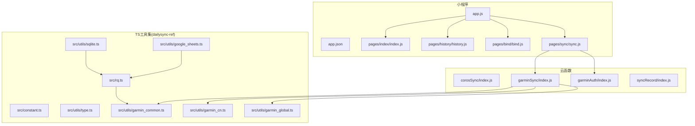
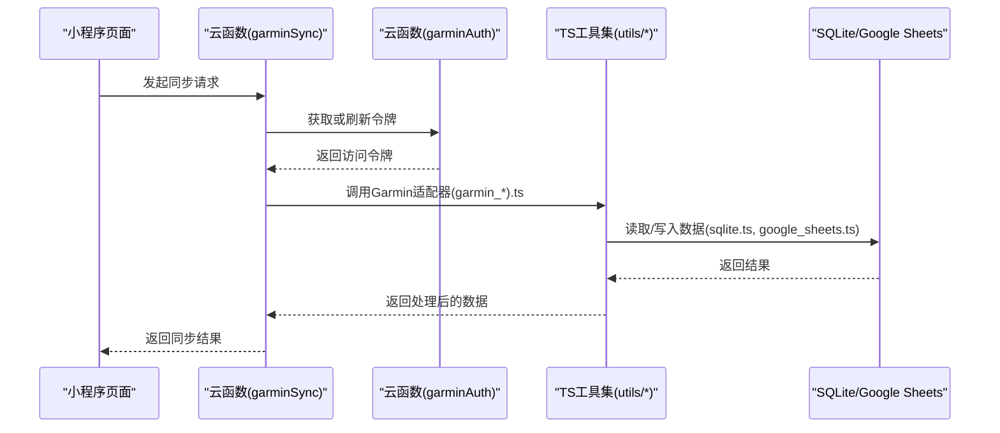
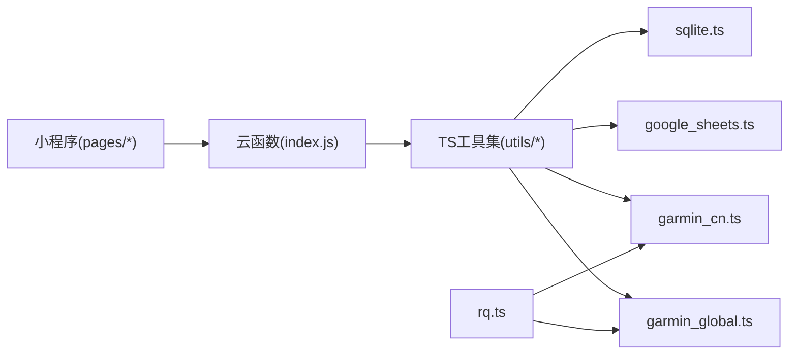

# JavaScript与TypeScript编码规范

<cite>
**本文引用的文件**   
- [README.md](file://README.md)
- [miniprogram/app.js](file://miniprogram/app.js)
- [miniprogram/app.json](file://miniprogram/app.json)
- [miniprogram/pages/index/index.js](file://miniprogram/pages/index/index.js)
- [miniprogram/pages/history/history.js](file://miniprogram/pages/history/history.js)
- [miniprogram/pages/bind/bind.js](file://miniprogram/pages/bind/bind.js)
- [miniprogram/pages/sync/sync.js](file://miniprogram/pages/sync/sync.js)
- [dailysync-ref/package.json](file://dailysync-ref/package.json)
- [dailysync-ref/tsconfig.json](file://dailysync-ref/tsconfig.json)
- [dailysync-ref/src/constant.ts](file://dailysync-ref/src/constant.ts)
- [dailysync-ref/src/utils/type.ts](file://dailysync-ref/src/utils/type.ts)
- [dailysync-ref/src/utils/sqlite.ts](file://dailysync-ref/src/utils/sqlite.ts)
- [dailysync-ref/src/utils/google_sheets.ts](file://dailysync-ref/src/utils/google_sheets.ts)
- [dailysync-ref/src/utils/garmin_common.ts](file://dailysync-ref/src/utils/garmin_common.ts)
- [dailysync-ref/src/utils/garmin_cn.ts](file://dailysync-ref/src/utils/garmin_cn.ts)
- [dailysync-ref/src/utils/garmin_global.ts](file://dailysync-ref/src/utils/garmin_global.ts)
- [dailysync-ref/src/rq.ts](file://dailysync-ref/src/rq.ts)
- [cloudfunctions/corosSync/index.js](file://cloudfunctions/corosSync/index.js)
- [cloudfunctions/garminAuth/index.js](file://cloudfunctions/garminAuth/index.js)
- [cloudfunctions/garminSync/index.js](file://cloudfunctions/garminSync/index.js)
- [cloudfunctions/syncRecord/index.js](file://cloudfunctions/syncRecord/index.js)
</cite>

## 目录
1. [简介](#简介)
2. [项目结构](#项目结构)
3. [核心组件](#核心组件)
4. [架构总览](#架构总览)
5. [详细组件分析](#详细组件分析)
6. [依赖关系分析](#依赖关系分析)
7. [性能考量](#性能考量)
8. [故障排查指南](#故障排查指南)
9. [结论](#结论)
10. [附录](#附录)

## 简介
本规范面向本项目中的JavaScript与TypeScript代码，目标是统一命名、组织、类型定义、注释风格以及工程化配置（ESLint/Prettier），提升可读性、可维护性与协作效率。规范覆盖：
- 变量、函数、类的命名约定（驼峰、常量大写等）
- 文件组织结构（模块划分、工具函数封装、常量管理）
- TypeScript类型定义规范（接口、枚举、泛型）
- 代码注释标准（JSDoc、复杂逻辑注释）
- ESLint与Prettier配置建议及常见规则

## 项目结构
本项目包含微信小程序端、云函数与一个独立的TypeScript数据处理子项目（dailysync-ref）。整体结构如下：
- miniprogram：小程序前端页面与入口
- cloudfunctions：各云函数模块（认证、同步、记录等）
- dailysync-ref：基于TypeScript的数据迁移与同步工具集（含常量、工具、类型定义）

图表来源
- [miniprogram/app.js](file://miniprogram/app.js)
- [miniprogram/app.json](file://miniprogram/app.json)
- [miniprogram/pages/index/index.js](file://miniprogram/pages/index/index.js)
- [miniprogram/pages/history/history.js](file://miniprogram/pages/history/history.js)
- [miniprogram/pages/bind/bind.js](file://miniprogram/pages/bind/bind.js)
- [miniprogram/pages/sync/sync.js](file://miniprogram/pages/sync/sync.js)
- [cloudfunctions/corosSync/index.js](file://cloudfunctions/corosSync/index.js)
- [cloudfunctions/garminAuth/index.js](file://cloudfunctions/garminAuth/index.js)
- [cloudfunctions/garminSync/index.js](file://cloudfunctions/garminSync/index.js)
- [cloudfunctions/syncRecord/index.js](file://cloudfunctions/syncRecord/index.js)
- [dailysync-ref/src/constant.ts](file://dailysync-ref/src/constant.ts)
- [dailysync-ref/src/utils/type.ts](file://dailysync-ref/src/utils/type.ts)
- [dailysync-ref/src/utils/sqlite.ts](file://dailysync-ref/src/utils/sqlite.ts)
- [dailysync-ref/src/utils/google_sheets.ts](file://dailysync-ref/src/utils/google_sheets.ts)
- [dailysync-ref/src/utils/garmin_common.ts](file://dailysync-ref/src/utils/garmin_common.ts)
- [dailysync-ref/src/utils/garmin_cn.ts](file://dailysync-ref/src/utils/garmin_cn.ts)
- [dailysync-ref/src/utils/garmin_global.ts](file://dailysync-ref/src/utils/garmin_global.ts)
- [dailysync-ref/src/rq.ts](file://dailysync-ref/src/rq.ts)

章节来源
- [README.md](file://README.md)
- [miniprogram/app.json](file://miniprogram/app.json)
- [dailysync-ref/package.json](file://dailysync-ref/package.json)
- [dailysync-ref/tsconfig.json](file://dailysync-ref/tsconfig.json)

## 核心组件
- 小程序入口与页面
  - app.js：应用初始化、全局状态与生命周期钩子
  - pages/*：按功能划分的页面模块（index、history、bind、sync）
- 云函数
  - garminAuth：Garmin认证流程
  - garminSync：数据同步主流程
  - corosSync：Coros数据同步
  - syncRecord：记录同步与持久化
- TypeScript工具集
  - constant.ts：全局常量与配置
  - utils/type.ts：公共类型定义
  - utils/sqlite.ts：SQLite操作封装
  - utils/google_sheets.ts：Google Sheets集成
  - utils/garmin_*.ts：Garmin相关API封装
  - rq.ts：Running Quotient计算与业务逻辑

章节来源
- [miniprogram/app.js](file://miniprogram/app.js)
- [miniprogram/pages/index/index.js](file://miniprogram/pages/index/index.js)
- [miniprogram/pages/history/history.js](file://miniprogram/pages/history/history.js)
- [miniprogram/pages/bind/bind.js](file://miniprogram/pages/bind/bind.js)
- [miniprogram/pages/sync/sync.js](file://miniprogram/pages/sync/sync.js)
- [cloudfunctions/garminAuth/index.js](file://cloudfunctions/garminAuth/index.js)
- [cloudfunctions/garminSync/index.js](file://cloudfunctions/garminSync/index.js)
- [cloudfunctions/corosSync/index.js](file://cloudfunctions/corosSync/index.js)
- [cloudfunctions/syncRecord/index.js](file://cloudfunctions/syncRecord/index.js)
- [dailysync-ref/src/constant.ts](file://dailysync-ref/src/constant.ts)
- [dailysync-ref/src/utils/type.ts](file://dailysync-ref/src/utils/type.ts)
- [dailysync-ref/src/utils/sqlite.ts](file://dailysync-ref/src/utils/sqlite.ts)
- [dailysync-ref/src/utils/google_sheets.ts](file://dailysync-ref/src/utils/google_sheets.ts)
- [dailysync-ref/src/utils/garmin_common.ts](file://dailysync-ref/src/utils/garmin_common.ts)
- [dailysync-ref/src/utils/garmin_cn.ts](file://dailysync-ref/src/utils/garmin_cn.ts)
- [dailysync-ref/src/utils/garmin_global.ts](file://dailysync-ref/src/utils/garmin_global.ts)
- [dailysync-ref/src/rq.ts](file://dailysync-ref/src/rq.ts)

## 架构总览
小程序通过页面触发云函数调用；云函数负责第三方平台认证与数据拉取/转换；TypeScript工具集提供通用能力（数据库、表格、协议适配、领域计算）。

图表来源
- [miniprogram/pages/sync/sync.js](file://miniprogram/pages/sync/sync.js)
- [cloudfunctions/garminSync/index.js](file://cloudfunctions/garminSync/index.js)
- [cloudfunctions/garminAuth/index.js](file://cloudfunctions/garminAuth/index.js)
- [dailysync-ref/src/utils/garmin_common.ts](file://dailysync-ref/src/utils/garmin_common.ts)
- [dailysync-ref/src/utils/garmin_cn.ts](file://dailysync-ref/src/utils/garmin_cn.ts)
- [dailysync-ref/src/utils/garmin_global.ts](file://dailysync-ref/src/utils/garmin_global.ts)
- [dailysync-ref/src/utils/sqlite.ts](file://dailysync-ref/src/utils/sqlite.ts)
- [dailysync-ref/src/utils/google_sheets.ts](file://dailysync-ref/src/utils/google_sheets.ts)

## 详细组件分析

### 命名约定
- 变量与函数
  - 使用小驼峰命名：如 fetchUserData、calculateRQ
  - 避免单字母变量名（除循环计数器 i/j/k）
- 类与构造函数
  - 使用大驼峰命名：如 GarminClient、SyncService
- 常量与枚举
  - 常量使用全大写下划线：如 MAX_RETRY_COUNT、DEFAULT_PAGE_SIZE
  - 枚举成员使用全大写下划线：如 SyncStatus.COMPLETED
- 文件与模块
  - 文件名使用小写+连字符或下划线（根据语言习惯）：如 garmin-common.ts、google-sheets.ts
  - 模块导出单一职责，避免“上帝模块”

章节来源
- [dailysync-ref/src/constant.ts](file://dailysync-ref/src/constant.ts)
- [dailysync-ref/src/utils/type.ts](file://dailysync-ref/src/utils/type.ts)
- [dailysync-ref/src/utils/garmin_common.ts](file://dailysync-ref/src/utils/garmin_common.ts)
- [dailysync-ref/src/utils/garmin_cn.ts](file://dailysync-ref/src/utils/garmin_cn.ts)
- [dailysync-ref/src/utils/garmin_global.ts](file://dailysync-ref/src/utils/garmin_global.ts)
- [miniprogram/pages/index/index.js](file://miniprogram/pages/index/index.js)
- [miniprogram/pages/history/history.js](file://miniprogram/pages/history/history.js)
- [miniprogram/pages/bind/bind.js](file://miniprogram/pages/bind/bind.js)
- [miniprogram/pages/sync/sync.js](file://miniprogram/pages/sync/sync.js)

### 文件组织结构
- 小程序端
  - app.js：应用初始化、全局配置、生命周期
  - app.json：页面路由、窗口样式、tabBar配置
  - pages/*：每个页面独立目录，包含js/json/wxml/wxss
- 云函数
  - 每个云函数独立目录，包含index.js与package.json
- TypeScript工具集
  - src/constant.ts：集中管理常量
  - src/utils/*：工具函数与外部服务封装
  - src/*.ts：领域逻辑（如rq.ts）

章节来源
- [miniprogram/app.json](file://miniprogram/app.json)
- [miniprogram/app.js](file://miniprogram/app.js)
- [miniprogram/pages/index/index.js](file://miniprogram/pages/index/index.js)
- [cloudfunctions/garminSync/index.js](file://cloudfunctions/garminSync/index.js)
- [dailysync-ref/src/constant.ts](file://dailysync-ref/src/constant.ts)
- [dailysync-ref/src/utils/type.ts](file://dailysync-ref/src/utils/type.ts)
- [dailysync-ref/src/rq.ts](file://dailysync-ref/src/rq.ts)

### TypeScript类型定义规范
- 接口
  - 使用interface描述对象形状，字段明确可选性与类型
  - 示例：用户信息、同步任务、响应体等
- 枚举
  - 使用enum表示有限集合（如状态码、平台标识）
- 泛型
  - 在工具函数中广泛使用泛型提高复用性（如分页、缓存、网络请求）
- 类型别名
  - 使用type为联合类型、映射类型提供别名，增强可读性

章节来源
- [dailysync-ref/src/utils/type.ts](file://dailysync-ref/src/utils/type.ts)
- [dailysync-ref/src/utils/sqlite.ts](file://dailysync-ref/src/utils/sqlite.ts)
- [dailysync-ref/src/utils/google_sheets.ts](file://dailysync-ref/src/utils/google_sheets.ts)
- [dailysync-ref/src/utils/garmin_common.ts](file://dailysync-ref/src/utils/garmin_common.ts)
- [dailysync-ref/src/utils/garmin_cn.ts](file://dailysync-ref/src/utils/garmin_cn.ts)
- [dailysync-ref/src/utils/garmin_global.ts](file://dailysync-ref/src/utils/garmin_global.ts)
- [dailysync-ref/src/rq.ts](file://dailysync-ref/src/rq.ts)

### 代码注释标准
- JSDoc
  - 对函数、类、模块进行说明，包含参数、返回值、异常
  - 示例：@param、@returns、@throws、@example
- 复杂逻辑注释
  - 解释业务意图、边界条件、性能考虑
  - 标注TODO/FIXME并关联问题编号
- 行内注释
  - 仅用于解释“为什么”，而非“是什么”

章节来源
- [dailysync-ref/src/utils/sqlite.ts](file://dailysync-ref/src/utils/sqlite.ts)
- [dailysync-ref/src/utils/google_sheets.ts](file://dailysync-ref/src/utils/google_sheets.ts)
- [dailysync-ref/src/utils/garmin_common.ts](file://dailysync-ref/src/utils/garmin_common.ts)
- [dailysync-ref/src/rq.ts](file://dailysync-ref/src/rq.ts)

### 错误处理与日志
- 统一错误码与消息格式
- 区分可恢复与不可恢复错误
- 记录关键路径日志（入参、出参、耗时、异常堆栈）

章节来源
- [cloudfunctions/garminAuth/index.js](file://cloudfunctions/garminAuth/index.js)
- [cloudfunctions/garminSync/index.js](file://cloudfunctions/garminSync/index.js)
- [dailysync-ref/src/utils/sqlite.ts](file://dailysync-ref/src/utils/sqlite.ts)
- [dailysync-ref/src/utils/google_sheets.ts](file://dailysync-ref/src/utils/google_sheets.ts)

### 性能考量
- 批量操作：合并数据库写入、减少网络往返
- 缓存策略：热点数据本地缓存、过期策略
- 异步控制：合理并发度、超时与重试机制

章节来源
- [dailysync-ref/src/utils/sqlite.ts](file://dailysync-ref/src/utils/sqlite.ts)
- [dailysync-ref/src/utils/google_sheets.ts](file://dailysync-ref/src/utils/google_sheets.ts)
- [dailysync-ref/src/rq.ts](file://dailysync-ref/src/rq.ts)

## 依赖关系分析
- 小程序依赖云函数接口
- 云函数依赖TypeScript工具集（类型、适配器、数据库、表格）
- 工具集内部解耦：sqlite、google_sheets、garmin_*相互独立，通过统一类型交互

图表来源
- [miniprogram/pages/sync/sync.js](file://miniprogram/pages/sync/sync.js)
- [cloudfunctions/garminSync/index.js](file://cloudfunctions/garminSync/index.js)
- [dailysync-ref/src/utils/sqlite.ts](file://dailysync-ref/src/utils/sqlite.ts)
- [dailysync-ref/src/utils/google_sheets.ts](file://dailysync-ref/src/utils/google_sheets.ts)
- [dailysync-ref/src/utils/garmin_cn.ts](file://dailysync-ref/src/utils/garmin_cn.ts)
- [dailysync-ref/src/utils/garmin_global.ts](file://dailysync-ref/src/utils/garmin_global.ts)
- [dailysync-ref/src/rq.ts](file://dailysync-ref/src/rq.ts)

章节来源
- [dailysync-ref/package.json](file://dailysync-ref/package.json)
- [dailysync-ref/tsconfig.json](file://dailysync-ref/tsconfig.json)

## 性能考量
- 数据库层
  - 使用事务批量写入，减少锁竞争
  - 索引优化查询路径
- 网络层
  - 连接池与超时控制
  - 重试退避策略
- 计算层
  - 避免重复计算，引入缓存
  - 流式处理大数据集

[本节为通用指导，不直接分析具体文件]

## 故障排查指南
- 常见问题
  - 认证失败：检查令牌有效期与刷新逻辑
  - 数据不一致：核对源端与目标端字段映射
  - 性能瓶颈：定位慢查询与高延迟API
- 调试建议
  - 开启详细日志（脱敏）
  - 使用断点与单元测试验证边界条件
  - 监控关键指标（成功率、时延、错误率）

章节来源
- [cloudfunctions/garminAuth/index.js](file://cloudfunctions/garminAuth/index.js)
- [cloudfunctions/garminSync/index.js](file://cloudfunctions/garminSync/index.js)
- [dailysync-ref/src/utils/sqlite.ts](file://dailysync-ref/src/utils/sqlite.ts)
- [dailysync-ref/src/utils/google_sheets.ts](file://dailysync-ref/src/utils/google_sheets.ts)

## 结论
本规范从命名、结构、类型、注释到工程化配置形成完整闭环，确保多语言（JS/TS）与多模块（小程序/云函数/工具集）的一致性。落地时需结合ESLint与Prettier自动化检查，持续迭代完善。

[本节为总结性内容，不直接分析具体文件]

## 附录

### ESLint与Prettier配置建议
- ESLint规则
  - 强制：no-unused-vars、no-console（生产环境）、prefer-const、eqeqeq
  - 推荐：semi、quotes、arrow-parens、object-shorthand
  - 自定义：按团队约定扩展规则集
- Prettier规则
  - 单引号、尾逗号、行宽80/120、分号保留
  - 与ESLint冲突规则以Prettier为准
- 集成方式
  - package.json scripts：lint、format、pre-commit钩子
  - IDE插件：保存时自动格式化与修复

[本节为通用指导，不直接分析具体文件]

### 常用代码风格检查规则清单
- 命名：camelCase、UPPER_SNAKE_CASE（常量）
- 类型：显式类型注解、避免any、优先interface
- 异步：async/await、Promise错误捕获
- 模块化：单一职责、避免循环依赖
- 注释：JSDoc必填项、复杂逻辑必注

[本节为通用指导，不直接分析具体文件]