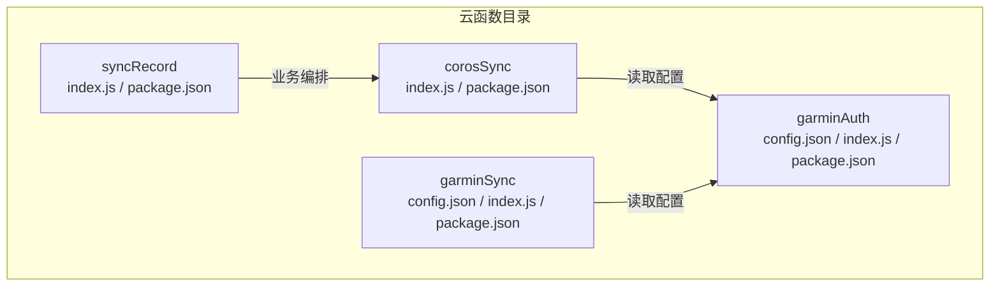
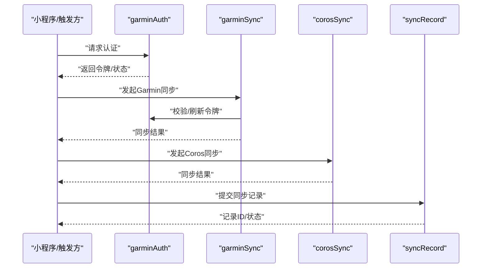
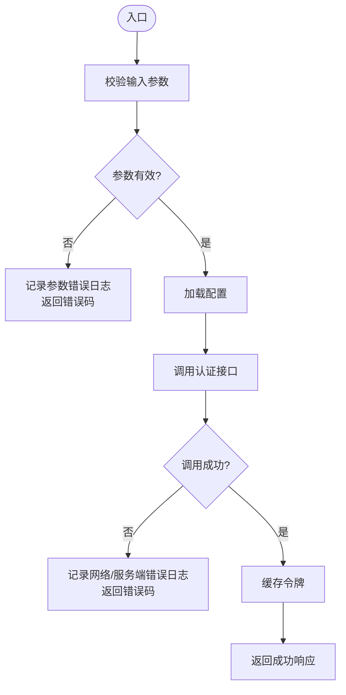
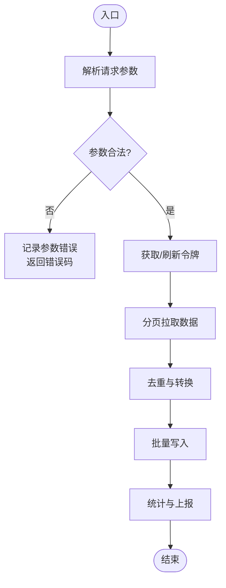
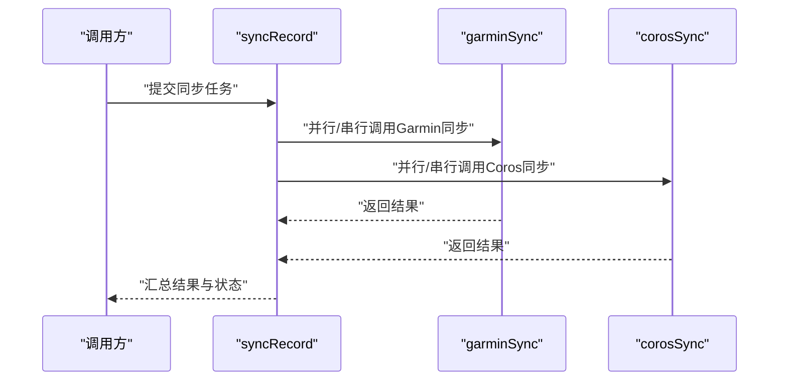
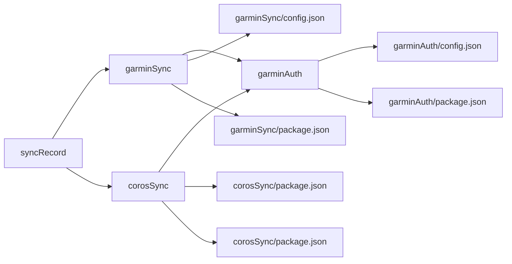

# 云函数开发规范

<cite>
**本文引用的文件**   
- [cloudfunctions/corosSync/index.js](file://cloudfunctions/corosSync/index.js)
- [cloudfunctions/corosSync/package.json](file://cloudfunctions/corosSync/package.json)
- [cloudfunctions/garminAuth/config.json](file://cloudfunctions/garminAuth/config.json)
- [cloudfunctions/garminAuth/index.js](file://cloudfunctions/garminAuth/index.js)
- [cloudfunctions/garminAuth/package.json](file://cloudfunctions/garminAuth/package.json)
- [cloudfunctions/garminSync/config.json](file://cloudfunctions/garminSync/config.json)
- [cloudfunctions/garminSync/index.js](file://cloudfunctions/garminSync/index.js)
- [cloudfunctions/garminSync/package.json](file://cloudfunctions/garminSync/package.json)
- [cloudfunctions/syncRecord/index.js](file://cloudfunctions/syncRecord/index.js)
- [cloudfunctions/syncRecord/package.json](file://cloudfunctions/syncRecord/package.json)
- [README.md](file://README.md)
</cite>

## 目录
1. [简介](#简介)
2. [项目结构](#项目结构)
3. [核心组件](#核心组件)
4. [架构总览](#架构总览)
5. [详细组件分析](#详细组件分析)
6. [依赖分析](#依赖分析)
7. [性能考虑](#性能考虑)
8. [故障排查指南](#故障排查指南)
9. [结论](#结论)
10. [附录](#附录)

## 简介
本规范面向微信小程序云函数的开发与维护，结合仓库中现有云函数实现与配置，统一以下方面：
- 文件结构与命名约定
- 错误处理规范（异常捕获、错误日志、错误码）
- 日志记录最佳实践（级别、脱敏、性能监控）
- 性能优化指南（执行时间、数据库操作、第三方API调用）
- 安全规范（输入校验、权限控制、敏感数据处理）

目标是在保证可维护性与稳定性的前提下，提升云函数的可靠性、可观测性与安全性。

## 项目结构
云函数以“按功能域拆分”的目录组织方式存放于 cloudfunctions 下，每个云函数包含入口 index.js 与依赖声明 package.json，部分函数提供独立配置 config.json。

**图示来源** 
- [cloudfunctions/corosSync/index.js](file://cloudfunctions/corosSync/index.js)
- [cloudfunctions/corosSync/package.json](file://cloudfunctions/corosSync/package.json)
- [cloudfunctions/garminAuth/config.json](file://cloudfunctions/garminAuth/config.json)
- [cloudfunctions/garminAuth/index.js](file://cloudfunctions/garminAuth/index.js)
- [cloudfunctions/garminAuth/package.json](file://cloudfunctions/garminAuth/package.json)
- [cloudfunctions/garminSync/config.json](file://cloudfunctions/garminSync/config.json)
- [cloudfunctions/garminSync/index.js](file://cloudfunctions/garminSync/index.js)
- [cloudfunctions/garminSync/package.json](file://cloudfunctions/garminSync/package.json)
- [cloudfunctions/syncRecord/index.js](file://cloudfunctions/syncRecord/index.js)
- [cloudfunctions/syncRecord/package.json](file://cloudfunctions/syncRecord/package.json)

**章节来源**
- [cloudfunctions/corosSync/index.js](file://cloudfunctions/corosSync/index.js)
- [cloudfunctions/corosSync/package.json](file://cloudfunctions/corosSync/package.json)
- [cloudfunctions/garminAuth/config.json](file://cloudfunctions/garminAuth/config.json)
- [cloudfunctions/garminAuth/index.js](file://cloudfunctions/garminAuth/index.js)
- [cloudfunctions/garminAuth/package.json](file://cloudfunctions/garminAuth/package.json)
- [cloudfunctions/garminSync/config.json](file://cloudfunctions/garminSync/config.json)
- [cloudfunctions/garminSync/index.js](file://cloudfunctions/garminSync/index.js)
- [cloudfunctions/garminSync/package.json](file://cloudfunctions/garminSync/package.json)
- [cloudfunctions/syncRecord/index.js](file://cloudfunctions/syncRecord/index.js)
- [cloudfunctions/syncRecord/package.json](file://cloudfunctions/syncRecord/package.json)

## 核心组件
- garminAuth：负责 Garmin 认证相关流程，使用独立的配置文件管理凭据或端点信息。
- garminSync：负责 Garmin 数据同步逻辑，依赖认证结果与配置项。
- corosSync：负责 Coros 数据同步逻辑，可能复用通用能力或与其他服务交互。
- syncRecord：负责同步任务编排与记录，协调上述各子流程。

职责边界建议：
- 认证类函数仅暴露鉴权与令牌获取能力，不直接处理业务数据。
- 同步类函数聚焦数据拉取、转换与落库，避免混入无关逻辑。
- 编排类函数负责流程调度、重试与结果聚合。

**章节来源**
- [cloudfunctions/garminAuth/index.js](file://cloudfunctions/garminAuth/index.js)
- [cloudfunctions/garminAuth/config.json](file://cloudfunctions/garminAuth/config.json)
- [cloudfunctions/garminSync/index.js](file://cloudfunctions/garminSync/index.js)
- [cloudfunctions/garminSync/config.json](file://cloudfunctions/garminSync/config.json)
- [cloudfunctions/corosSync/index.js](file://cloudfunctions/corosSync/index.js)
- [cloudfunctions/syncRecord/index.js](file://cloudfunctions/syncRecord/index.js)

## 架构总览
下图展示云函数之间的典型调用关系与数据流向。实际调用顺序以各函数入口实现为准。

**图示来源** 
- [cloudfunctions/garminAuth/index.js](file://cloudfunctions/garminAuth/index.js)
- [cloudfunctions/garminSync/index.js](file://cloudfunctions/garminSync/index.js)
- [cloudfunctions/corosSync/index.js](file://cloudfunctions/corosSync/index.js)
- [cloudfunctions/syncRecord/index.js](file://cloudfunctions/syncRecord/index.js)

## 详细组件分析

### 认证函数（garminAuth）
- 关注点：安全地获取并缓存访问令牌；对外暴露最小必要接口。
- 配置管理：通过独立配置文件集中管理密钥、域名等敏感信息，避免硬编码。
- 错误处理：对网络异常、参数缺失、令牌过期等进行分类捕获并返回标准错误码。
- 日志记录：记录关键步骤（开始、成功、失败），对敏感字段进行脱敏。

**图示来源** 
- [cloudfunctions/garminAuth/index.js](file://cloudfunctions/garminAuth/index.js)
- [cloudfunctions/garminAuth/config.json](file://cloudfunctions/garminAuth/config.json)

**章节来源**
- [cloudfunctions/garminAuth/index.js](file://cloudfunctions/garminAuth/index.js)
- [cloudfunctions/garminAuth/config.json](file://cloudfunctions/garminAuth/config.json)

### 同步函数（garminSync / corosSync）
- 关注点：数据拉取、去重、转换、批量写入；幂等与重试策略。
- 依赖管理：通过包清单声明依赖，保持环境一致性。
- 错误处理：区分网络超时、限流、数据格式异常等场景，采用退避重试。
- 日志记录：记录批次大小、耗时、成功率、失败原因，便于定位瓶颈。

**图示来源** 
- [cloudfunctions/garminSync/index.js](file://cloudfunctions/garminSync/index.js)
- [cloudfunctions/corosSync/index.js](file://cloudfunctions/corosSync/index.js)

**章节来源**
- [cloudfunctions/garminSync/index.js](file://cloudfunctions/garminSync/index.js)
- [cloudfunctions/corosSync/index.js](file://cloudfunctions/corosSync/index.js)

### 编排函数（syncRecord）
- 关注点：多源同步任务的编排、状态跟踪与结果汇总。
- 错误处理：对子任务失败进行隔离与补偿，确保整体一致性。
- 日志记录：记录任务生命周期、阶段耗时、失败重试次数。

**图示来源** 
- [cloudfunctions/syncRecord/index.js](file://cloudfunctions/syncRecord/index.js)
- [cloudfunctions/garminSync/index.js](file://cloudfunctions/garminSync/index.js)
- [cloudfunctions/corosSync/index.js](file://cloudfunctions/corosSync/index.js)

**章节来源**
- [cloudfunctions/syncRecord/index.js](file://cloudfunctions/syncRecord/index.js)

## 依赖分析
- 包依赖：每个云函数通过 package.json 声明运行时依赖，确保构建与运行环境一致。
- 配置依赖：认证与同步函数通过 config.json 管理外部服务地址、密钥等。
- 模块耦合：编排函数依赖具体同步函数；同步函数依赖认证函数与配置。

**图示来源** 
- [cloudfunctions/syncRecord/index.js](file://cloudfunctions/syncRecord/index.js)
- [cloudfunctions/garminSync/index.js](file://cloudfunctions/garminSync/index.js)
- [cloudfunctions/corosSync/index.js](file://cloudfunctions/corosSync/index.js)
- [cloudfunctions/garminAuth/index.js](file://cloudfunctions/garminAuth/index.js)
- [cloudfunctions/garminSync/config.json](file://cloudfunctions/garminSync/config.json)
- [cloudfunctions/corosSync/package.json](file://cloudfunctions/corosSync/package.json)
- [cloudfunctions/garminSync/package.json](file://cloudfunctions/garminSync/package.json)
- [cloudfunctions/garminAuth/config.json](file://cloudfunctions/garminAuth/config.json)
- [cloudfunctions/garminAuth/package.json](file://cloudfunctions/garminAuth/package.json)

**章节来源**
- [cloudfunctions/syncRecord/package.json](file://cloudfunctions/syncRecord/package.json)
- [cloudfunctions/garminSync/package.json](file://cloudfunctions/garminSync/package.json)
- [cloudfunctions/corosSync/package.json](file://cloudfunctions/corosSync/package.json)
- [cloudfunctions/garminAuth/package.json](file://cloudfunctions/garminAuth/package.json)
- [cloudfunctions/garminSync/config.json](file://cloudfunctions/garminSync/config.json)
- [cloudfunctions/garminAuth/config.json](file://cloudfunctions/garminAuth/config.json)

## 性能考虑
- 函数执行时间优化
  - 减少冷启动开销：精简依赖、按需引入、避免在顶层执行重型初始化。
  - 合理并发：对无状态I/O密集任务采用并发拉取，但需控制上限避免被限流。
  - 早返回与短路：参数校验失败立即返回，避免后续昂贵计算。
- 数据库操作优化
  - 批量写入：合并多次写为批量操作，降低往返次数。
  - 索引与查询：明确查询条件，避免全表扫描；必要时建立合适索引。
  - 事务与幂等：对关键写入使用事务，保证重复调用的幂等性。
- 第三方API调用优化
  - 连接复用与超时设置：复用HTTP连接，设置合理的超时与重试退避。
  - 缓存热点数据：对不频繁变化的配置或字典进行本地缓存。
  - 限流与熔断：遵循上游限流策略，出现异常时快速失败并降级。

[本节为通用指导，无需特定文件引用]

## 故障排查指南
- 错误分类与日志
  - 将错误分为参数错误、网络错误、服务端错误、业务异常四类，分别记录不同级别日志。
  - 所有异常必须捕获并记录上下文（请求ID、用户标识、关键参数摘要）。
- 错误码定义
  - 统一错误码前缀与层级，如 AUTH_、SYNC_、RECORD_，便于前端与后端协同处理。
  - 错误码需附带可读消息，便于排障与监控告警。
- 常见问题定位
  - 认证失败：检查配置项、签名算法、时间戳与网络连通性。
  - 同步失败：核对分页参数、去重键、写入约束与下游限流。
  - 编排失败：查看子任务状态、重试次数与补偿策略是否生效。

**章节来源**
- [cloudfunctions/garminAuth/index.js](file://cloudfunctions/garminAuth/index.js)
- [cloudfunctions/garminSync/index.js](file://cloudfunctions/garminSync/index.js)
- [cloudfunctions/corosSync/index.js](file://cloudfunctions/corosSync/index.js)
- [cloudfunctions/syncRecord/index.js](file://cloudfunctions/syncRecord/index.js)

## 结论
通过统一的文件结构、清晰的职责划分、严格的错误与日志规范以及系统的性能与安全策略，云函数可在复杂集成场景中保持稳定、高效与可观测。建议在迭代过程中持续完善错误码体系、监控指标与自动化测试，进一步提升质量与交付效率。

[本节为总结性内容，无需特定文件引用]

## 附录

### 文件结构与命名约定
- 目录命名：小写英文，语义清晰，如 garminAuth、garminSync、corosSync、syncRecord。
- 入口文件：统一命名为 index.js，作为云函数唯一入口。
- 配置文件：如需外部化配置，使用 config.json，避免硬编码敏感信息。
- 依赖声明：每个云函数独立 package.json，锁定版本以保证一致性。

**章节来源**
- [cloudfunctions/garminAuth/index.js](file://cloudfunctions/garminAuth/index.js)
- [cloudfunctions/garminAuth/config.json](file://cloudfunctions/garminAuth/config.json)
- [cloudfunctions/garminSync/index.js](file://cloudfunctions/garminSync/index.js)
- [cloudfunctions/garminSync/config.json](file://cloudfunctions/garminSync/config.json)
- [cloudfunctions/corosSync/index.js](file://cloudfunctions/corosSync/index.js)
- [cloudfunctions/syncRecord/index.js](file://cloudfunctions/syncRecord/index.js)

### 错误处理规范
- 异常捕获
  - 所有外部调用与异步回调均需包裹 try/catch，捕获后记录结构化日志。
  - 对可恢复错误实施重试（指数退避+抖动），对不可恢复错误快速失败。
- 错误日志记录
  - 至少包含：错误类型、错误码、堆栈摘要、请求上下文、耗时。
  - 禁止输出敏感信息（密钥、令牌、手机号、身份证号等）。
- 错误码定义
  - 分层命名：模块_场景_原因，如 SYNC_GARMIN_NETWORK_TIMEOUT。
  - 统一响应体结构，包含 code、message、data、traceId。

**章节来源**
- [cloudfunctions/garminAuth/index.js](file://cloudfunctions/garminAuth/index.js)
- [cloudfunctions/garminSync/index.js](file://cloudfunctions/garminSync/index.js)
- [cloudfunctions/corosSync/index.js](file://cloudfunctions/corosSync/index.js)
- [cloudfunctions/syncRecord/index.js](file://cloudfunctions/syncRecord/index.js)

### 日志记录最佳实践
- 日志级别
  - ERROR：系统异常、外部依赖失败、数据不一致。
  - WARN：可恢复异常、接近阈值、降级启用。
  - INFO：关键业务流程节点、重要状态变更。
  - DEBUG：详细调试信息，生产环境默认关闭。
- 敏感信息脱敏
  - 对令牌、密钥、个人身份信息做掩码或哈希处理后再记录。
- 性能监控
  - 记录函数入口/出口时间，计算总耗时与分段耗时。
  - 上报关键指标：QPS、错误率、P95/P99 延迟、重试次数。

**章节来源**
- [cloudfunctions/garminAuth/index.js](file://cloudfunctions/garminAuth/index.js)
- [cloudfunctions/garminSync/index.js](file://cloudfunctions/garminSync/index.js)
- [cloudfunctions/corosSync/index.js](file://cloudfunctions/corosSync/index.js)
- [cloudfunctions/syncRecord/index.js](file://cloudfunctions/syncRecord/index.js)

### 性能优化指南
- 函数执行时间优化
  - 减少冷启动：精简依赖、懒加载、避免全局大对象。
  - 合理并发：限制并发度，避免触发上游限流。
- 数据库操作优化
  - 批量写入、预编译语句、避免N+1查询。
  - 读写分离与只读副本用于查询密集型场景。
- 第三方API调用优化
  - 连接池、超时与重试策略、缓存热点数据。
  - 压缩与分页拉取，减少单次负载。

[本节为通用指导，无需特定文件引用]

### 安全规范
- 输入验证
  - 对所有入参进行白名单校验与类型检查，拒绝非法值。
  - 对字符串长度、数值范围、枚举值进行严格约束。
- 权限控制
  - 基于云函数上下文进行身份校验，最小权限原则。
  - 对敏感操作增加二次校验或审批流程。
- 敏感数据处理
  - 传输加密（HTTPS）、存储加密（字段级或库级）。
  - 日志与监控中严禁明文输出敏感信息。

**章节来源**
- [cloudfunctions/garminAuth/index.js](file://cloudfunctions/garminAuth/index.js)
- [cloudfunctions/garminAuth/config.json](file://cloudfunctions/garminAuth/config.json)
- [cloudfunctions/garminSync/index.js](file://cloudfunctions/garminSync/index.js)
- [cloudfunctions/corosSync/index.js](file://cloudfunctions/corosSync/index.js)
- [cloudfunctions/syncRecord/index.js](file://cloudfunctions/syncRecord/index.js)

### 参考与说明
- README 提供项目背景与使用说明，可作为理解业务上下文的补充材料。

**章节来源**
- [README.md](file://README.md)