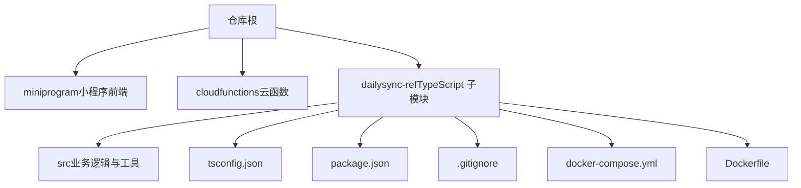
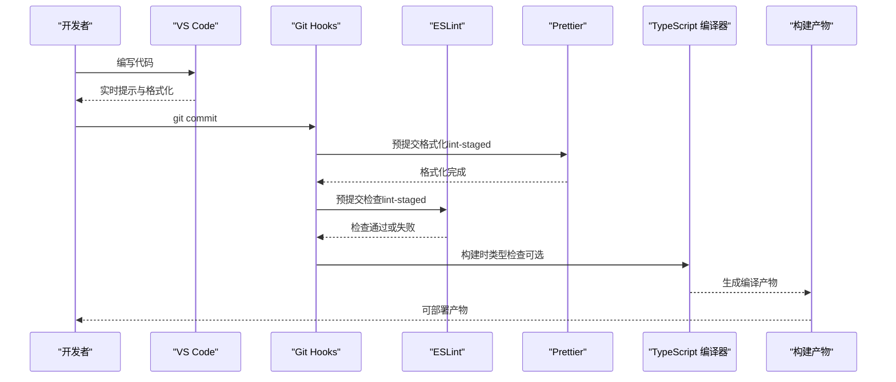
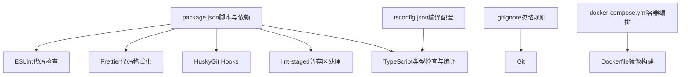

# 代码质量工具配置

<cite>
**本文引用的文件**   
- [README.md](file://README.md)
- [package.json](file://dailysync-ref/package.json)
- [tsconfig.json](file://dailysync-ref/tsconfig.json)
- [.gitignore](file://dailysync-ref/.gitignore)
- [docker-compose.yml](file://dailysync-ref/docker-compose.yml)
- [Dockerfile](file://dailysync-ref/Dockerfile)
- [project.config.json](file://project.config.json)
- [project.private.config.json](file://project.private.config.json)
</cite>

## 目录
1. [简介](#简介)
2. [项目结构](#项目结构)
3. [核心组件](#核心组件)
4. [架构总览](#架构总览)
5. [详细组件分析](#详细组件分析)
6. [依赖分析](#依赖分析)
7. [性能考虑](#性能考虑)
8. [故障排查指南](#故障排查指南)
9. [结论](#结论)
10. [附录](#附录)

## 简介
本文件面向微信小程序与配套后端（TypeScript）工程，系统化说明如何配置和使用代码质量检查工具，包括：
- ESLint 规则设置、插件安装与自动化检查
- Prettier 格式化配置（缩进、引号、分号等）
- TypeScript 编译配置（tsconfig.json 关键选项）
- Git hooks 集成（提交前自动检查与格式化）
- IDE 集成（VS Code 等），确保团队开发一致性

本项目包含小程序端与 dailysync-ref 子模块（TypeScript）。本文将以 dailysync-ref 为主进行质量工具配置说明，并给出在小程序端的适配建议。

## 项目结构
仓库根目录包含小程序工程与 cloudfunctions，以及一个独立的 TypeScript 子模块 dailysync-ref。该子模块具备完整的 Node/TS 工程结构，适合作为代码质量工具集成的主入口。

图表来源
- [README.md:1-200](file://README.md#L1-L200)
- [package.json:1-200](file://dailysync-ref/package.json#L1-L200)
- [tsconfig.json:1-200](file://dailysync-ref/tsconfig.json#L1-L200)
- [.gitignore:1-200](file://dailysync-ref/.gitignore#L1-L200)
- [docker-compose.yml:1-200](file://dailysync-ref/docker-compose.yml#L1-L200)
- [Dockerfile:1-200](file://dailysync-ref/Dockerfile#L1-L200)

章节来源
- [README.md:1-200](file://README.md#L1-L200)
- [package.json:1-200](file://dailysync-ref/package.json#L1-L200)
- [tsconfig.json:1-200](file://dailysync-ref/tsconfig.json#L1-L200)
- [.gitignore:1-200](file://dailysync-ref/.gitignore#L1-L200)
- [docker-compose.yml:1-200](file://dailysync-ref/docker-compose.yml#L1-L200)
- [Dockerfile:1-200](file://dailysync-ref/Dockerfile#L1-L200)

## 核心组件
- ESLint：用于静态代码检查与风格约束，支持 JS/TS、Vue/React 等生态。
- Prettier：统一代码格式，避免风格争议，支持多语言。
- TypeScript：提供类型系统与编译配置，保障代码健壮性。
- Git hooks：通过 husky + lint-staged 实现提交前自动检查与格式化。
- IDE 集成：VS Code 插件与用户设置，保证本地体验一致。

章节来源
- [package.json:1-200](file://dailysync-ref/package.json#L1-L200)
- [tsconfig.json:1-200](file://dailysync-ref/tsconfig.json#L1-L200)

## 架构总览
下图展示从开发者到构建产物的完整流程，涵盖编辑器、Git 钩子、ESLint/Prettier、TypeScript 编译与 Docker 构建。

图表来源
- [package.json:1-200](file://dailysync-ref/package.json#L1-L200)
- [tsconfig.json:1-200](file://dailysync-ref/tsconfig.json#L1-L200)
- [docker-compose.yml:1-200](file://dailysync-ref/docker-compose.yml#L1-L200)
- [Dockerfile:1-200](file://dailysync-ref/Dockerfile#L1-L200)

## 详细组件分析

### ESLint 配置与使用
- 目标：统一代码风格、发现潜在错误、提升可读性与可维护性。
- 推荐步骤：
  - 初始化 ESLint 并选择适用预设（如 Airbnb、Standard、Node/TS 等）。
  - 安装必要插件（如 eslint-plugin-import、eslint-plugin-node、@typescript-eslint/* 等）。
  - 在 package.json 中定义脚本命令，便于 CI 与本地运行。
  - 结合 .eslintrc.js/.eslintrc.json 或 eslint.config.js 配置规则。
  - 在 Git hooks 中集成，提交前执行检查。

- 常用命令（示例路径参考）：
  - 检查：npm run lint
  - 自动修复：npm run lint:fix

- 与 TypeScript 集成：
  - 使用 @typescript-eslint/parser 与 @typescript-eslint/eslint-plugin。
  - 开启 tsconfig 的路径映射与严格模式以增强检查效果。

章节来源
- [package.json:1-200](file://dailysync-ref/package.json#L1-L200)

### Prettier 配置与使用
- 目标：统一代码格式，减少风格分歧，提高协作效率。
- 常见规则：
  - 缩进：2 空格
  - 行宽：80 或 120
  - 引号：单引号
  - 分号：启用
  - 尾逗号：ES5 兼容
  - 对象键顺序：按字母序（可选）

- 配置文件：
  - .prettierrc 或 prettier.config.js
  - .prettierignore 忽略不需要格式化的文件

- 与编辑器集成：
  - VS Code 安装 Prettier 插件，保存时自动格式化。
  - 与 ESLint 冲突时，优先遵循 Prettier 的格式化规则。

- 与 Git hooks 集成：
  - 使用 lint-staged 对暂存区文件进行格式化，再交由 ESLint 检查。

章节来源
- [package.json:1-200](file://dailysync-ref/package.json#L1-L200)

### TypeScript 编译配置（tsconfig.json）
- 目标：控制编译行为、类型检查、模块解析与输出。
- 关键选项：
  - target：目标环境（如 ES2020、ESNext）
  - module：模块系统（如 CommonJS、ESNext）
  - strict：启用严格类型检查
  - esModuleInterop：兼容默认导入导出
  - skipLibCheck：跳过库类型检查以提升速度
  - forceConsistentCasingInFileNames：强制文件名大小写一致
  - baseUrl 与 paths：路径别名与模块解析优化
  - outDir：编译输出目录
  - include/exclude：控制参与编译的文件范围

- 与 ESLint 协同：
  - 使用 @typescript-eslint/parser 读取 tsconfig 中的路径与严格模式。
  - 保持 tsconfig 与 ESLint 规则一致，避免误报。

章节来源
- [tsconfig.json:1-200](file://dailysync-ref/tsconfig.json#L1-L200)

### Git Hooks 配置（提交前自动检查与格式化）
- 目标：在 git commit 前自动执行 Prettier 与 ESLint，阻止不合格代码进入仓库。
- 推荐方案：
  - 使用 husky 管理 Git hooks。
  - 使用 lint-staged 仅对暂存区文件执行检查与格式化，提升速度。
  - 在 pre-commit 阶段执行格式化与检查。

- 典型流程：
  - 开发者修改代码并提交。
  - Git 触发 husky 的 pre-commit 钩子。
  - lint-staged 调用 Prettier 格式化暂存文件。
  - 随后调用 ESLint 检查暂存文件。
  - 全部通过后，提交成功；否则中断提交并提示修复。

- 与 CI 联动：
  - 在 CI 中重复执行相同命令，确保分支合并质量。

章节来源
- [package.json:1-200](file://dailysync-ref/package.json#L1-L200)

### IDE 集成（VS Code）
- 目标：在编辑器内提供一致的代码质量体验。
- 推荐插件：
  - ESLint：实时检查与快速修复
  - Prettier：保存时自动格式化
  - TypeScript 语言服务：类型检查与智能提示
  - EditorConfig：统一基础编辑行为（缩进、换行等）

- 用户设置建议：
  - 保存时自动格式化（Prettier）
  - 将 Prettier 设为默认格式化器
  - 启用 ESLint 自动修复（谨慎使用）
  - 与项目 .editorconfig 保持一致

章节来源
- [package.json:1-200](file://dailysync-ref/package.json#L1-L200)

### 小程序端适配建议
- 小程序代码通常为原生 JS/WXML/WXSS，ESLint 可通过 babel-eslint 或 miniprogram-eslint 插件支持。
- Prettier 可配置支持 WXML/WXSS（需相应插件）。
- 建议在 miniprogram 目录单独维护 .eslintrc 与 .prettierrc，避免与 dailysync-ref 冲突。
- 若使用 TypeScript 开发小程序，可参考 dailysync-ref 的 tsconfig 配置，但需根据小程序运行时调整 target/module。

章节来源
- [project.config.json:1-200](file://project.config.json#L1-L200)
- [project.private.config.json:1-200](file://project.private.config.json#L1-L200)

## 依赖分析
下图展示 dailysync-ref 子模块的关键依赖关系与职责划分。

图表来源
- [package.json:1-200](file://dailysync-ref/package.json#L1-L200)
- [tsconfig.json:1-200](file://dailysync-ref/tsconfig.json#L1-L200)
- [.gitignore:1-200](file://dailysync-ref/.gitignore#L1-L200)
- [docker-compose.yml:1-200](file://dailysync-ref/docker-compose.yml#L1-L200)
- [Dockerfile:1-200](file://dailysync-ref/Dockerfile#L1-L200)

章节来源
- [package.json:1-200](file://dailysync-ref/package.json#L1-L200)
- [tsconfig.json:1-200](file://dailysync-ref/tsconfig.json#L1-L200)
- [.gitignore:1-200](file://dailysync-ref/.gitignore#L1-L200)
- [docker-compose.yml:1-200](file://dailysync-ref/docker-compose.yml#L1-L200)
- [Dockerfile:1-200](file://dailysync-ref/Dockerfile#L1-L200)

## 性能考虑
- 增量检查：使用 lint-staged 仅对变更文件执行 ESLint/Prettier，缩短反馈时间。
- 并行执行：CI 中并行运行多个任务（检查、格式化、类型检查、构建）。
- 缓存策略：利用 npm/yarn 缓存与 Docker 层缓存加速构建。
- 严格模式权衡：strict 模式可能增加编译时间，可在大型项目中按需开启。

[本节为通用指导，不直接分析具体文件]

## 故障排查指南
- ESLint 报错无法定位：
  - 确认 parser 与 plugin 版本与 TypeScript 版本匹配。
  - 检查 tsconfig 的 include/exclude 是否覆盖目标文件。
  - 使用 --debug 或查看日志定位问题。

- Prettier 与 ESLint 冲突：
  - 确保 Prettier 与 ESLint 的规则不矛盾（如分号、引号）。
  - 在 VS Code 中将 Prettier 设为默认格式化器。

- Git hooks 未生效：
  - 确认 husky 已正确安装并启用。
  - 检查 .husky/pre-commit 脚本权限与内容。
  - 使用 git commit --no-verify 临时绕过（不建议）。

- TypeScript 类型检查失败：
  - 检查 tsconfig 的 target/module 与运行环境是否匹配。
  - 清理 node_modules 后重新安装依赖。

章节来源
- [package.json:1-200](file://dailysync-ref/package.json#L1-L200)
- [tsconfig.json:1-200](file://dailysync-ref/tsconfig.json#L1-L200)

## 结论
通过合理配置 ESLint、Prettier、TypeScript 与 Git hooks，并结合 IDE 集成，可以显著提升代码质量与团队协作效率。建议在 dailysync-ref 子模块先行落地，再逐步推广至小程序端与其他子模块，形成统一的工程规范与自动化流水线。

[本节为总结性内容，不直接分析具体文件]

## 附录
- 推荐脚本命名：
  - lint：执行 ESLint
  - lint:fix：自动修复 ESLint 问题
  - format：执行 Prettier 格式化
  - type-check：执行 TypeScript 类型检查
  - build：执行构建（含类型检查）

- 推荐忽略规则：
  - 构建产物、第三方库、测试快照等不应被检查或格式化。

[本节为补充信息，不直接分析具体文件]