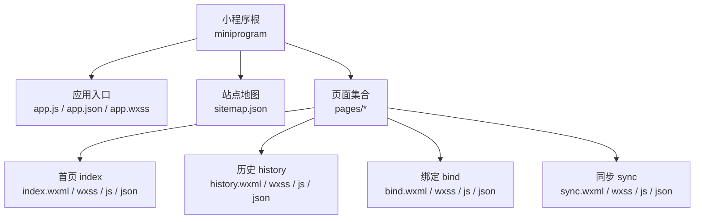
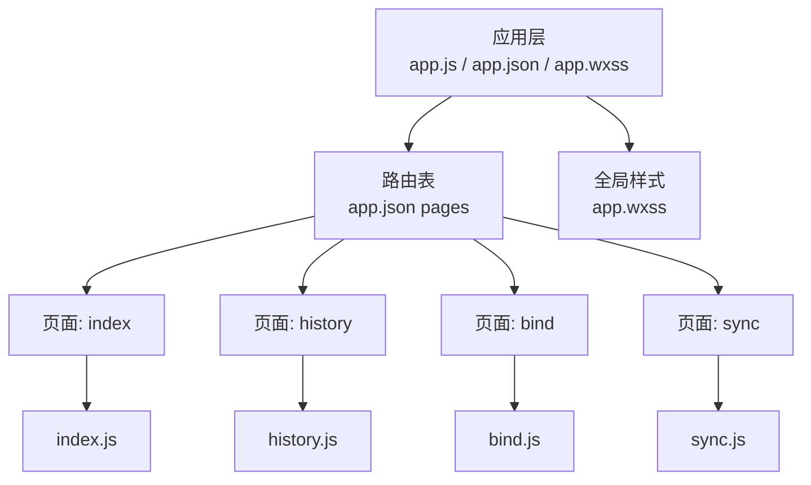
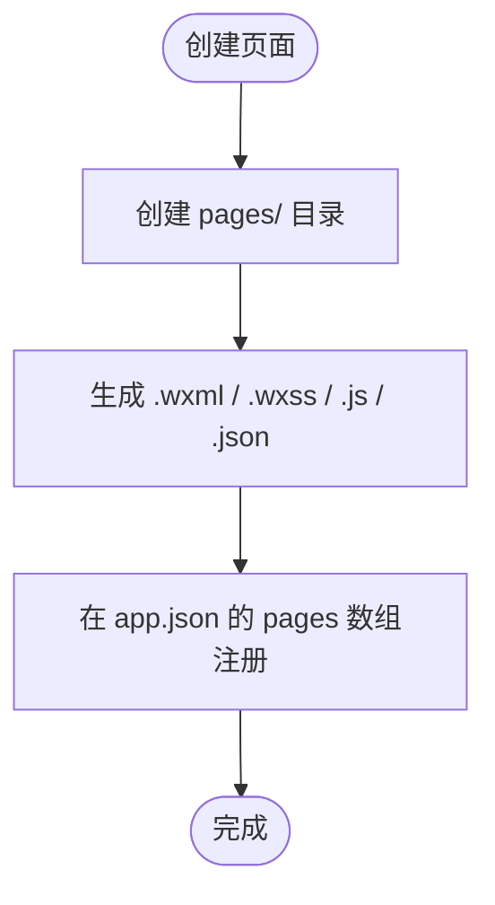
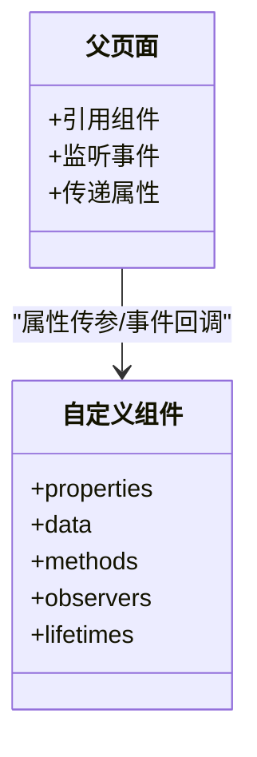
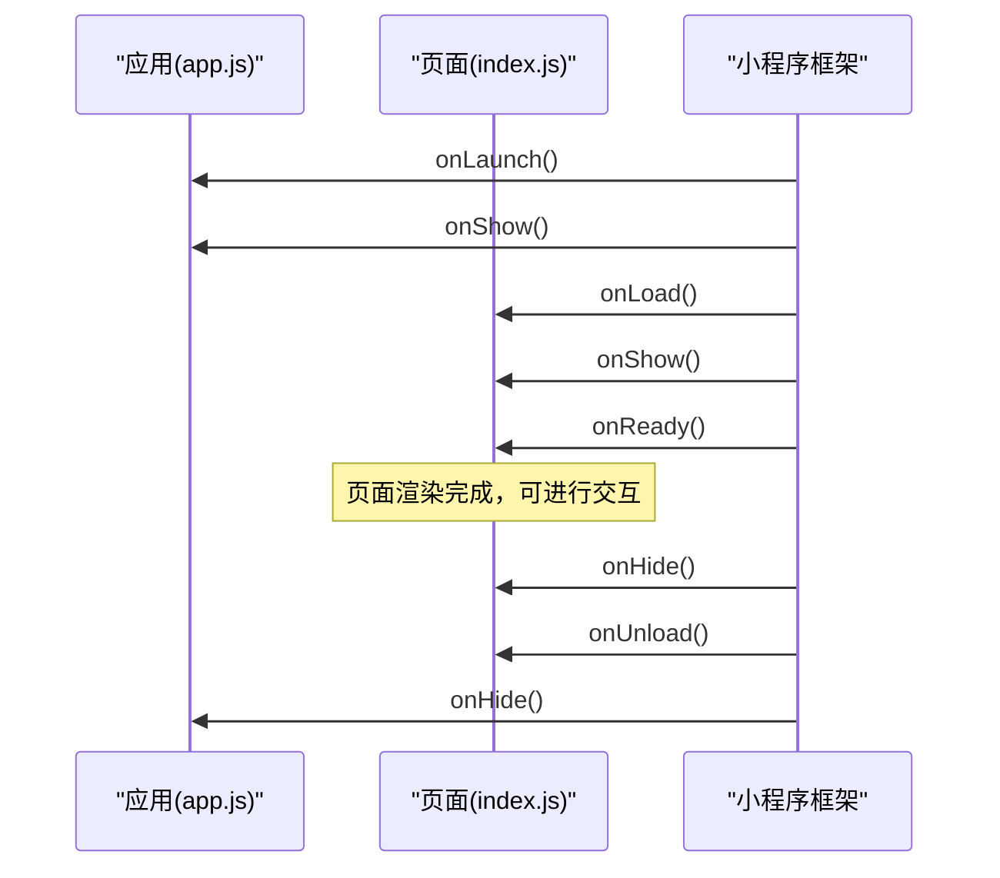
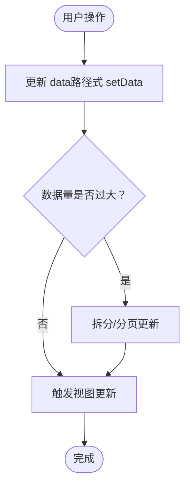
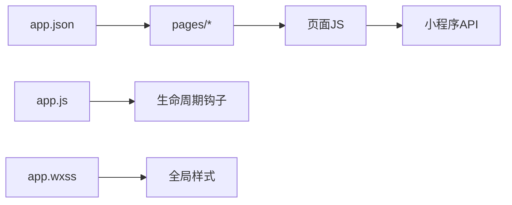

# 小程序开发规范

<cite>
**本文引用的文件**   
- [app.json](file://miniprogram/app.json)
- [app.js](file://miniprogram/app.js)
- [app.wxss](file://miniprogram/app.wxss)
- [project.config.json](file://project.config.json)
- [sitemap.json](file://miniprogram/sitemap.json)
- [index.wxml](file://miniprogram/pages/index/index.wxml)
- [index.wxss](file://miniprogram/pages/index/index.wxss)
- [index.js](file://miniprogram/pages/index/index.js)
- [index.json](file://miniprogram/pages/index/index.json)
- [history.wxml](file://miniprogram/pages/history/history.wxml)
- [history.wxss](file://miniprogram/pages/history/history.wxss)
- [history.js](file://miniprogram/pages/history/history.js)
- [history.json](file://miniprogram/pages/history/history.json)
- [bind.wxml](file://miniprogram/pages/bind/bind.wxml)
- [bind.wxss](file://miniprogram/pages/bind/bind.wxss)
- [bind.js](file://miniprogram/pages/bind/bind.js)
- [bind.json](file://miniprogram/pages/bind/bind.json)
- [sync.wxml](file://miniprogram/pages/sync/sync.wxml)
- [sync.wxss](file://miniprogram/pages/sync/sync.wxss)
- [sync.js](file://miniprogram/pages/sync/sync.js)
- [sync.json](file://miniprogram/pages/sync/sync.json)
</cite>

## 目录
1. [引言](#引言)
2. [项目结构](#项目结构)
3. [核心组件](#核心组件)
4. [架构总览](#架构总览)
5. [详细组件分析](#详细组件分析)
6. [依赖分析](#依赖分析)
7. [性能考虑](#性能考虑)
8. [故障排查指南](#故障排查指南)
9. [结论](#结论)
10. [附录](#附录)

## 引言
本规范面向微信小程序工程，结合当前仓库的页面组织与配置，给出统一的页面文件组织方式、命名约定、组件开发规范、生命周期使用规范、数据绑定与状态管理最佳实践，以及性能优化建议。目标是提升团队协作效率、代码可维护性与运行性能。

## 项目结构
- 根目录包含小程序工程配置与云函数等辅助资源，小程序主体位于 miniprogram 目录。
- 页面按功能模块划分在 miniprogram/pages 下，每个页面由 WXML、WXSS、JS、JSON 四件套组成。
- 全局样式与入口逻辑分别通过 app.wxss 与 app.js 提供。
- 站点地图 sitemap.json 用于 SEO/索引配置。

**图表来源** 
- [app.json](file://miniprogram/app.json)
- [app.js](file://miniprogram/app.js)
- [app.wxss](file://miniprogram/app.wxss)
- [sitemap.json](file://miniprogram/sitemap.json)
- [index.wxml](file://miniprogram/pages/index/index.wxml)
- [index.wxss](file://miniprogram/pages/index/index.wxss)
- [index.js](file://miniprogram/pages/index/index.js)
- [index.json](file://miniprogram/pages/index/index.json)
- [history.wxml](file://miniprogram/pages/history/history.wxml)
- [history.wxss](file://miniprogram/pages/history/history.wxss)
- [history.js](file://miniprogram/pages/history/history.js)
- [history.json](file://miniprogram/pages/history/history.json)
- [bind.wxml](file://miniprogram/pages/bind/bind.wxml)
- [bind.wxss](file://miniprogram/pages/bind/bind.wxss)
- [bind.js](file://miniprogram/pages/bind/bind.js)
- [bind.json](file://miniprogram/pages/bind/bind.json)
- [sync.wxml](file://miniprogram/pages/sync/sync.wxml)
- [sync.wxss](file://miniprogram/pages/sync/sync.wxss)
- [sync.js](file://miniprogram/pages/sync/sync.js)
- [sync.json](file://miniprogram/pages/sync/sync.json)

**章节来源**
- [app.json](file://miniprogram/app.json)
- [app.js](file://miniprogram/app.js)
- [app.wxss](file://miniprogram/app.wxss)
- [sitemap.json](file://miniprogram/sitemap.json)
- [project.config.json](file://project.config.json)

## 核心组件
- 页面四件套：WXML（模板）、WXSS（样式）、JS（逻辑）、JSON（页面配置）。
- 全局配置：app.json（应用级路由、窗口、tabBar 等），app.wxss（全局样式），app.js（应用生命周期与初始化）。
- 站点地图：sitemap.json（搜索引擎索引相关）。

命名与组织约定
- 页面目录：miniprogram/pages/<pageName>/，页面对应四个同名文件：<pageName>.wxml、<pageName>.wxss、<pageName>.js、<pageName>.json。
- 组件目录：建议在 miniprogram/components 下按功能建立子目录，每个组件包含 component.wxml、component.wxss、component.js、component.json。
- 资源目录：图片、字体等静态资源统一放在 miniprogram/images 或 miniprogram/static，避免散落在页面目录中。

**章节来源**
- [app.json](file://miniprogram/app.json)
- [app.js](file://miniprogram/app.js)
- [app.wxss](file://miniprogram/app.wxss)
- [sitemap.json](file://miniprogram/sitemap.json)

## 架构总览
小程序采用“应用层 + 页面层”的分层结构：
- 应用层负责全局配置、主题样式、应用生命周期与公共能力封装。
- 页面层承载具体业务视图与交互，遵循“视图-样式-逻辑-配置”四件套解耦。
- 路由由 app.json 统一管理，页面间跳转通过导航 API 完成。

**图表来源** 
- [app.json](file://miniprogram/app.json)
- [app.js](file://miniprogram/app.js)
- [app.wxss](file://miniprogram/app.wxss)
- [index.js](file://miniprogram/pages/index/index.js)
- [history.js](file://miniprogram/pages/history/history.js)
- [bind.js](file://miniprogram/pages/bind/bind.js)
- [sync.js](file://miniprogram/pages/sync/sync.js)

## 详细组件分析

### 页面组织与命名规范
- 每个页面必须包含 wxml、wxss、js、json 四个文件，文件名与目录名保持一致。
- 页面 JSON 用于声明导航栏、下拉刷新、自定义 tab 等页面级配置。
- 页面 JS 内定义 data、方法、生命周期；WXML 通过数据绑定渲染；WXSS 限定作用域。

**图表来源** 
- [app.json](file://miniprogram/app.json)
- [index.wxml](file://miniprogram/pages/index/index.wxml)
- [index.wxss](file://miniprogram/pages/index/index.wxss)
- [index.js](file://miniprogram/pages/index/index.js)
- [index.json](file://miniprogram/pages/index/index.json)
- [history.wxml](file://miniprogram/pages/history/history.wxml)
- [history.wxss](file://miniprogram/pages/history/history.wxss)
- [history.js](file://miniprogram/pages/history/history.js)
- [history.json](file://miniprogram/pages/history/history.json)
- [bind.wxml](file://miniprogram/pages/bind/bind.wxml)
- [bind.wxss](file://miniprogram/pages/bind/bind.wxss)
- [bind.js](file://miniprogram/pages/bind/bind.js)
- [bind.json](file://miniprogram/pages/bind/bind.json)
- [sync.wxml](file://miniprogram/pages/sync/sync.wxml)
- [sync.wxss](file://miniprogram/pages/sync/sync.wxss)
- [sync.js](file://miniprogram/pages/sync/sync.js)
- [sync.json](file://miniprogram/pages/sync/sync.json)

**章节来源**
- [index.wxml](file://miniprogram/pages/index/index.wxml)
- [index.wxss](file://miniprogram/pages/index/index.wxss)
- [index.js](file://miniprogram/pages/index/index.js)
- [index.json](file://miniprogram/pages/index/index.json)
- [history.wxml](file://miniprogram/pages/history/history.wxml)
- [history.wxss](file://miniprogram/pages/history/history.wxss)
- [history.js](file://miniprogram/pages/history/history.js)
- [history.json](file://miniprogram/pages/history/history.json)
- [bind.wxml](file://miniprogram/pages/bind/bind.wxml)
- [bind.wxss](file://miniprogram/pages/bind/bind.wxss)
- [bind.js](file://miniprogram/pages/bind/bind.js)
- [bind.json](file://miniprogram/pages/bind/bind.json)
- [sync.wxml](file://miniprogram/pages/sync/sync.wxml)
- [sync.wxss](file://miniprogram/pages/sync/sync.wxss)
- [sync.js](file://miniprogram/pages/sync/sync.js)
- [sync.json](file://miniprogram/pages/sync/sync.json)

### 自定义组件开发规范
- 组件目录：miniprogram/components/<componentName>/，包含 component.wxml、component.wxss、component.js、component.json。
- 属性定义：在 component.js 的 properties 中声明类型、默认值与观察者。
- 事件处理：在 methods 中定义事件回调，通过 triggerEvent 向父组件派发事件。
- 样式隔离：使用独立的 component.wxss，避免污染全局样式。
- 复用策略：将通用 UI 抽象为组件，减少重复代码，提高一致性。

**图表来源** 
- [index.js](file://miniprogram/pages/index/index.js)
- [history.js](file://miniprogram/pages/history/history.js)
- [bind.js](file://miniprogram/pages/bind/bind.js)
- [sync.js](file://miniprogram/pages/sync/sync.js)

**章节来源**
- [index.js](file://miniprogram/pages/index/index.js)
- [history.js](file://miniprogram/pages/history/history.js)
- [bind.js](file://miniprogram/pages/bind/bind.js)
- [sync.js](file://miniprogram/pages/sync/sync.js)

### 生命周期使用规范
- 应用生命周期（app.js）：onLaunch、onShow、onHide、onError、onUnhandledRejection 等，用于初始化全局状态、统计埋点、权限检查。
- 页面生命周期（各页面 JS）：onLoad、onShow、onReady、onHide、onUnload、onPullDownRefresh、onReachBottom、onShareAppMessage 等，用于数据加载、列表分页、分享配置。
- 组件生命周期（组件 JS）：created、attached、ready、moved、detached 等，用于资源申请与释放。

**图表来源** 
- [app.js](file://miniprogram/app.js)
- [index.js](file://miniprogram/pages/index/index.js)
- [history.js](file://miniprogram/pages/history/history.js)
- [bind.js](file://miniprogram/pages/bind/bind.js)
- [sync.js](file://miniprogram/pages/sync/sync.js)

**章节来源**
- [app.js](file://miniprogram/app.js)
- [index.js](file://miniprogram/pages/index/index.js)
- [history.js](file://miniprogram/pages/history/history.js)
- [bind.js](file://miniprogram/pages/bind/bind.js)
- [sync.js](file://miniprogram/pages/sync/sync.js)

### 数据绑定与状态管理最佳实践
- 数据绑定：在 WXML 中使用 {{}} 进行单向/双向绑定，避免频繁 setData 大对象。
- 局部更新：优先使用路径式 setData，如 this.setData({ 'list[0].name': 'new' })，减少重绘范围。
- 状态集中：复杂状态建议集中在 store 或公共模块，页面仅持有必要切片。
- 不可变更新：对数组/对象更新采用新引用替换旧引用，确保框架能正确检测变更。
- 异步处理：网络请求与本地存储需做好错误处理与重试机制。

**图表来源** 
- [index.js](file://miniprogram/pages/index/index.js)
- [history.js](file://miniprogram/pages/history/history.js)
- [bind.js](file://miniprogram/pages/bind/bind.js)
- [sync.js](file://miniprogram/pages/sync/sync.js)

**章节来源**
- [index.js](file://miniprogram/pages/index/index.js)
- [history.js](file://miniprogram/pages/history/history.js)
- [bind.js](file://miniprogram/pages/bind/bind.js)
- [sync.js](file://miniprogram/pages/sync/sync.js)

## 依赖分析
- 页面依赖 app.json 中的路由配置，未注册的页面无法被导航访问。
- 页面 JS 依赖框架 API（导航、网络、存储、媒体等），应避免直接耦合平台差异。
- 样式依赖 app.wxss 的全局样式，组件样式应保持独立，避免冲突。

**图表来源** 
- [app.json](file://miniprogram/app.json)
- [app.js](file://miniprogram/app.js)
- [app.wxss](file://miniprogram/app.wxss)
- [index.js](file://miniprogram/pages/index/index.js)
- [history.js](file://miniprogram/pages/history/history.js)
- [bind.js](file://miniprogram/pages/bind/bind.js)
- [sync.js](file://miniprogram/pages/sync/sync.js)

**章节来源**
- [app.json](file://miniprogram/app.json)
- [app.js](file://miniprogram/app.js)
- [app.wxss](file://miniprogram/app.wxss)

## 性能考虑
- 图片优化
  - 使用合适尺寸与格式（WebP/压缩 PNG/JPG），按需懒加载。
  - 避免在首屏加载大量大图，必要时分片加载或延迟渲染。
- 缓存策略
  - 合理使用本地存储（setStorageSync/getStorageSync），设置过期时间与容量上限。
  - 列表数据分页拉取，避免一次性加载全量。
- 内存管理
  - 及时清理定时器、事件监听器与大数据对象引用。
  - 避免在 setData 中传递超大对象，采用增量更新。
- 渲染优化
  - 减少不必要的节点层级与条件渲染，合理使用 wx:key。
  - 长列表使用虚拟滚动或分页加载。

[本节为通用指导，不直接分析具体文件]

## 故障排查指南
- 页面无法打开
  - 检查 app.json 的 pages 数组是否包含该页面路径。
  - 确认页面四件套齐全且命名一致。
- 样式不生效
  - 检查 WXSS 作用域与选择器优先级，避免被全局样式覆盖。
  - 组件样式需引入对应 component.wxss。
- 数据未更新
  - 检查 setData 调用是否正确，避免直接修改 this.data。
  - 路径式更新时注意字符串键与嵌套路径。
- 生命周期异常
  - 确认钩子函数名称与参数符合框架规范。
  - 避免在 onLaunch/onLoad 中进行耗时阻塞操作。

**章节来源**
- [app.json](file://miniprogram/app.json)
- [index.js](file://miniprogram/pages/index/index.js)
- [history.js](file://miniprogram/pages/history/history.js)
- [bind.js](file://miniprogram/pages/bind/bind.js)
- [sync.js](file://miniprogram/pages/sync/sync.js)

## 结论
本规范基于当前仓库的页面结构与配置，明确了页面组织、组件开发、生命周期与数据绑定的标准做法，并提供了性能优化与故障排查建议。遵循这些规范有助于提升代码质量、协作效率与用户体验。

## 附录
- 推荐工具链：ESLint/Prettier 统一代码风格，Terser 压缩构建产物。
- 文档沉淀：组件 API 文档与示例页面保持同步更新。
- 版本管理：页面与组件变更需配合版本号与变更记录。

[本节为通用指导，不直接分析具体文件]