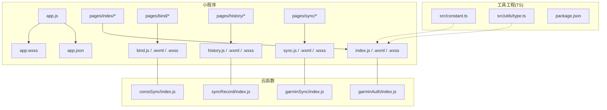
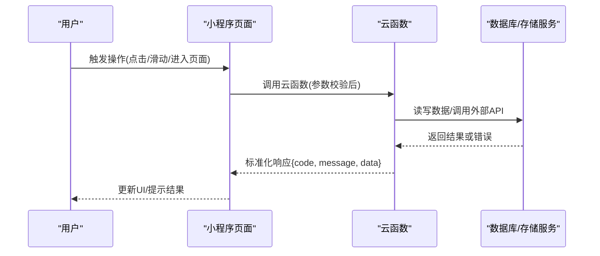
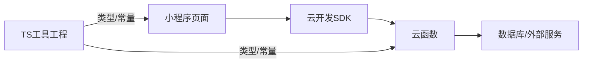

# 编码规范与最佳实践

<cite>
**本文档引用的文件**   
- [README.md](file://README.md)
- [project.config.json](file://project.config.json)
- [miniprogram/app.js](file://miniprogram/app.js)
- [miniprogram/app.json](file://miniprogram/app.json)
- [miniprogram/app.wxss](file://miniprogram/app.wxss)
- [miniprogram/pages/index/index.js](file://miniprogram/pages/index/index.js)
- [miniprogram/pages/index/index.wxml](file://miniprogram/pages/index/index.wxml)
- [miniprogram/pages/index/index.wxss](file://miniprogram/pages/index/index.wxss)
- [miniprogram/pages/bind/bind.js](file://miniprogram/pages/bind/bind.js)
- [miniprogram/pages/bind/bind.wxml](file://miniprogram/pages/bind/bind.wxml)
- [miniprogram/pages/history/history.js](file://miniprogram/pages/history/history.js)
- [miniprogram/pages/history/history.wxml](file://miniprogram/pages/history/wxml)
- [miniprogram/pages/sync/sync.js](file://miniprogram/pages/sync/sync.js)
- [miniprogram/pages/sync/sync.wxml](file://miniprogram/pages/sync/sync.wxml)
- [cloudfunctions/corosSync/index.js](file://cloudfunctions/corosSync/index.js)
- [cloudfunctions/garminAuth/index.js](file://cloudfunctions/garminAuth/index.js)
- [cloudfunctions/garminSync/index.js](file://cloudfunctions/garminSync/index.js)
- [cloudfunctions/syncRecord/index.js](file://cloudfunctions/syncRecord/index.js)
- [dailysync-ref/src/constant.ts](file://dailysync-ref/src/constant.ts)
- [dailysync-ref/src/utils/type.ts](file://dailysync-ref/src/utils/type.ts)
- [dailysync-ref/package.json](file://dailysync-ref/package.json)
</cite>

## 目录
1. [简介](#简介)
2. [项目结构](#项目结构)
3. [核心组件](#核心组件)
4. [架构总览](#架构总览)
5. [详细组件分析](#详细组件分析)
6. [依赖分析](#依赖分析)
7. [性能考虑](#性能考虑)
8. [故障排查指南](#故障排查指南)
9. [结论](#结论)
10. [附录](#附录)

## 简介
本规范面向微信小程序前端（WXML、WXSS、JS）与云函数（Node.js），以及配套的 TypeScript 工具工程，提供统一的命名约定、文件组织、注释标准、错误处理、日志记录、性能优化、模块化设计原则与代码质量检查配置建议。目标是提升团队协作效率、降低维护成本、保障线上稳定性。

## 项目结构
本项目采用“小程序 + 云函数 + 辅助工具工程”的三段式结构：
- 小程序端：位于 miniprogram 目录，包含应用入口、页面与样式。
- 云函数：位于 cloudfunctions 目录，按功能域拆分子目录，每个子目录为独立云函数。
- 工具工程：位于 dailysync-ref 目录，使用 TypeScript，提供常量、类型定义与通用工具。

图表来源
- [miniprogram/app.js](file://miniprogram/app.js)
- [miniprogram/app.json](file://miniprogram/app.json)
- [miniprogram/pages/index/index.js](file://miniprogram/pages/index/index.js)
- [miniprogram/pages/bind/bind.js](file://miniprogram/pages/bind/bind.js)
- [miniprogram/pages/history/history.js](file://miniprogram/pages/history/history.js)
- [miniprogram/pages/sync/sync.js](file://miniprogram/pages/sync/sync.js)
- [cloudfunctions/corosSync/index.js](file://cloudfunctions/corosSync/index.js)
- [cloudfunctions/garminAuth/index.js](file://cloudfunctions/garminAuth/index.js)
- [cloudfunctions/garminSync/index.js](file://cloudfunctions/garminSync/index.js)
- [cloudfunctions/syncRecord/index.js](file://cloudfunctions/syncRecord/index.js)
- [dailysync-ref/src/constant.ts](file://dailysync-ref/src/constant.ts)
- [dailysync-ref/src/utils/type.ts](file://dailysync-ref/src/utils/type.ts)

章节来源
- [README.md](file://README.md)
- [project.config.json](file://project.config.json)

## 核心组件
- 小程序应用入口与全局配置
  - app.js：应用生命周期初始化、全局状态与插件注册。
  - app.json：页面路由、窗口样式、分包与权限声明。
  - app.wxss：全局样式变量与基础样式。
- 页面模块
  - index/bind/history/sync：各自包含 JS/WXML/WXSS/JSON，职责单一，数据与视图分离。
- 云函数
  - corosSync/garminAuth/garminSync/syncRecord：分别负责设备同步、认证、数据同步与记录落库等能力。
- 工具工程
  - constant.ts：集中管理业务常量。
  - utils/type.ts：统一类型定义，保证前后端契约一致。

章节来源
- [miniprogram/app.js](file://miniprogram/app.js)
- [miniprogram/app.json](file://miniprogram/app.json)
- [miniprogram/app.wxss](file://miniprogram/app.wxss)
- [miniprogram/pages/index/index.js](file://miniprogram/pages/index/index.js)
- [miniprogram/pages/bind/bind.js](file://miniprogram/pages/bind/bind.js)
- [miniprogram/pages/history/history.js](file://miniprogram/pages/history/history.js)
- [miniprogram/pages/sync/sync.js](file://miniprogram/pages/sync/sync.js)
- [cloudfunctions/corosSync/index.js](file://cloudfunctions/corosSync/index.js)
- [cloudfunctions/garminAuth/index.js](file://cloudfunctions/garminAuth/index.js)
- [cloudfunctions/garminSync/index.js](file://cloudfunctions/garminSync/index.js)
- [cloudfunctions/syncRecord/index.js](file://cloudfunctions/syncRecord/index.js)
- [dailysync-ref/src/constant.ts](file://dailysync-ref/src/constant.ts)
- [dailysync-ref/src/utils/type.ts](file://dailysync-ref/src/utils/type.ts)

## 架构总览
小程序通过云开发调用云函数，实现跨端数据同步与第三方平台对接；工具工程提供类型与常量，确保前后端契约一致性。

图表来源
- [miniprogram/pages/sync/sync.js](file://miniprogram/pages/sync/sync.js)
- [cloudfunctions/garminSync/index.js](file://cloudfunctions/garminSync/index.js)
- [cloudfunctions/syncRecord/index.js](file://cloudfunctions/syncRecord/index.js)

## 详细组件分析

### 小程序页面开发规范
- 文件组织
  - 每个页面一个文件夹，包含同名 .js/.wxml/.wxss/.json。
  - 公共逻辑抽离至 components 或 utils，避免页面臃肿。
- 命名约定
  - 文件名小写+连字符，如 bind-page.js；事件名驼峰，如 onConfirmClick。
  - WXML 中 class 使用 BEM 风格：block__element--modifier。
- 数据与视图
  - 页面 state 仅存放渲染所需数据，复杂计算放入方法或工具函数。
  - 列表渲染使用 key，避免重复 key 导致性能问题。
- 交互与反馈
  - 所有异步操作需有 loading 态与失败提示。
  - 表单提交前进行本地校验，错误信息就近展示。

章节来源
- [miniprogram/pages/index/index.js](file://miniprogram/pages/index/index.js)
- [miniprogram/pages/index/index.wxml](file://miniprogram/pages/index/index.wxml)
- [miniprogram/pages/bind/bind.js](file://miniprogram/pages/bind/bind.js)
- [miniprogram/pages/bind/bind.wxml](file://miniprogram/pages/bind/bind.wxml)
- [miniprogram/pages/history/history.js](file://miniprogram/pages/history/history.js)
- [miniprogram/pages/sync/sync.js](file://miniprogram/pages/sync/sync.js)

### 云函数开发规范
- 入口与路由
  - 每个云函数一个 index.js，暴露统一导出函数。
  - 根据 action 分发不同处理逻辑，避免单函数过长。
- 错误处理
  - 统一错误码与消息格式，区分业务错误与系统错误。
  - 对第三方 API 调用增加超时与重试策略。
- 日志记录
  - 关键路径打点：入参、出参、耗时、异常堆栈。
  - 敏感信息脱敏，禁止打印密钥与用户隐私。
- 性能优化
  - 批量查询与合并请求，减少 I/O 次数。
  - 合理使用索引与分页，避免全表扫描与大对象传输。
  - 冷启动优化：按需引入、延迟加载、缓存热点数据。

章节来源
- [cloudfunctions/corosSync/index.js](file://cloudfunctions/corosSync/index.js)
- [cloudfunctions/garminAuth/index.js](file://cloudfunctions/garminAuth/index.js)
- [cloudfunctions/garminSync/index.js](file://cloudfunctions/garminSync/index.js)
- [cloudfunctions/syncRecord/index.js](file://cloudfunctions/syncRecord/index.js)

### 工具工程与类型契约
- 常量管理
  - 将环境相关、业务枚举、接口地址等集中在 constant.ts。
  - 使用只读常量，禁止在运行时修改。
- 类型定义
  - 在 utils/type.ts 中统一定义请求/响应结构，前后端共享。
  - 使用泛型约束数据结构，提高可维护性。
- 版本兼容
  - 变更类型时保持向后兼容，废弃字段标记 deprecated。

章节来源
- [dailysync-ref/src/constant.ts](file://dailysync-ref/src/constant.ts)
- [dailysync-ref/src/utils/type.ts](file://dailysync-ref/src/utils/type.ts)

### 模块化设计原则
- 组件复用
  - 将可复用 UI 封装为自定义组件，遵循单一职责。
  - 组件对外暴露 props/events，内部状态私有化。
- 工具函数封装
  - 纯函数优先，无副作用；复杂逻辑拆分为小函数组合。
  - 工具函数按领域划分目录，便于检索与维护。
- 常量管理
  - 集中管理，避免魔法数字与硬编码字符串散落各处。

章节来源
- [miniprogram/app.wxss](file://miniprogram/app.wxss)
- [dailysync-ref/src/constant.ts](file://dailysync-ref/src/constant.ts)
- [dailysync-ref/src/utils/type.ts](file://dailysync-ref/src/utils/type.ts)

## 依赖分析
- 小程序与云函数解耦
  - 通过云开发 SDK 调用云函数，不直接依赖对方实现细节。
  - 接口契约由类型与常量约束，降低联调成本。
- 工具工程与前端/后端共享
  - 类型与常量作为契约层，前后端共同遵守。

图表来源
- [miniprogram/pages/sync/sync.js](file://miniprogram/pages/sync/sync.js)
- [cloudfunctions/garminSync/index.js](file://cloudfunctions/garminSync/index.js)
- [dailysync-ref/src/utils/type.ts](file://dailysync-ref/src/utils/type.ts)

章节来源
- [dailysync-ref/package.json](file://dailysync-ref/package.json)

## 性能考虑
- 小程序端
  - 首屏资源最小化，按需加载页面与组件。
  - 列表虚拟化或分页加载，避免一次性渲染大量节点。
  - 图片压缩与懒加载，减少内存占用。
- 云函数端
  - 控制单次处理数据量，合理分页与批处理。
  - 使用连接池与缓存，降低外部依赖开销。
  - 监控冷启动时间与执行时长，及时优化。

[本节为通用指导，无需特定文件引用]

## 故障排查指南
- 常见问题定位
  - 网络超时：检查云函数超时设置与外部 API 可用性。
  - 权限不足：核对 app.json 权限声明与用户授权流程。
  - 数据不一致：核对类型定义与接口契约是否变更。
- 日志与调试
  - 云函数输出结构化日志，包含 traceId 便于链路追踪。
  - 小程序开启开发者工具的 Network 面板，查看请求详情。
- 回滚与恢复
  - 云函数版本化管理，支持快速回滚。
  - 数据变更操作具备幂等性与补偿机制。

章节来源
- [cloudfunctions/garminAuth/index.js](file://cloudfunctions/garminAuth/index.js)
- [cloudfunctions/garminSync/index.js](file://cloudfunctions/garminSync/index.js)
- [cloudfunctions/syncRecord/index.js](file://cloudfunctions/syncRecord/index.js)

## 结论
通过统一的命名与文件组织、严格的错误处理与日志规范、清晰的模块化设计与类型契约，可显著提升小程序与云函数的可维护性与稳定性。配合代码质量检查与审查清单，能有效降低缺陷率并加速迭代。

[本节为总结性内容，无需特定文件引用]

## 附录

### JavaScript/TypeScript 编码约定
- 命名
  - 变量/函数：camelCase；类/组件：PascalCase；常量：UPPER_SNAKE_CASE。
  - 文件：小写+连字符，如 user-service.js。
- 注释
  - 函数级 JSDoc 描述用途、参数、返回值与异常。
  - 复杂逻辑行内注释说明意图而非复述代码。
- 文件组织
  - 按功能域划分目录，utils/components/constants 分离。
  - 入口文件保持简洁，复杂逻辑下沉到模块。

[本节为通用指导，无需特定文件引用]

### 小程序页面开发规范（WXML/WXSS/JS）
- WXML
  - 语义化标签，避免过度嵌套；条件渲染使用 wx:if/wx:for。
  - 模板复用使用 include/template。
- WXSS
  - 使用 rpx 适配多端；全局样式放 app.wxss，局部样式放页面文件。
  - 颜色/字号等变量集中管理。
- JS
  - Page 生命周期清晰，避免在 onLoad 中做重计算。
  - 数据更新使用 this.setData，批量更新减少渲染次数。

章节来源
- [miniprogram/pages/index/index.wxml](file://miniprogram/pages/index/index.wxml)
- [miniprogram/pages/bind/bind.wxml](file://miniprogram/pages/bind/bind.wxml)
- [miniprogram/app.wxss](file://miniprogram/app.wxss)

### 云函数开发规范（错误处理/日志/性能）
- 错误处理
  - 统一错误码映射，区分可重试与不可重试错误。
  - 输入校验失败立即返回，避免无效计算。
- 日志记录
  - 结构化 JSON 日志，包含时间、级别、traceId、msg。
  - 敏感字段脱敏，禁止打印密钥与用户隐私。
- 性能优化
  - 批量操作与分页查询，避免大事务。
  - 缓存热点数据，减少重复 I/O。

章节来源
- [cloudfunctions/corosSync/index.js](file://cloudfunctions/corosSync/index.js)
- [cloudfunctions/garminAuth/index.js](file://cloudfunctions/garminAuth/index.js)
- [cloudfunctions/garminSync/index.js](file://cloudfunctions/garminSync/index.js)
- [cloudfunctions/syncRecord/index.js](file://cloudfunctions/syncRecord/index.js)

### 代码模块化设计原则
- 组件复用
  - 组件职责单一，props/events 明确，内部状态私有。
  - 提供默认插槽与具名插槽，增强灵活性。
- 工具函数封装
  - 纯函数优先，单元测试覆盖边界情况。
  - 工具函数按领域分组，避免循环依赖。
- 常量管理
  - 集中管理，禁止散落在业务代码中。
  - 变更走评审与灰度发布。

章节来源
- [dailysync-ref/src/constant.ts](file://dailysync-ref/src/constant.ts)
- [dailysync-ref/src/utils/type.ts](file://dailysync-ref/src/utils/type.ts)

### 代码质量检查工具配置与使用
- ESLint
  - 启用严格规则，禁用危险 API，强制错误处理。
  - 与编辑器集成，保存时自动修复。
- Prettier
  - 统一代码风格，忽略手动格式化差异。
  - 与 Git hooks 结合，提交前自动格式化。
- 其他
  - TypeScript 严格模式开启，类型检查纳入 CI。
  - 单元测试覆盖率阈值设定，新增代码必须覆盖。

[本节为通用指导，无需特定文件引用]

### 代码审查清单与常见问题避免
- 审查清单
  - 命名是否符合规范？文件组织是否清晰？
  - 错误处理是否完备？日志是否脱敏？
  - 是否有性能瓶颈（N+1 查询、大对象传输）？
  - 类型定义是否与接口契约一致？
- 常见问题避免
  - 避免在页面中直接操作 DOM，改用数据驱动。
  - 避免在云函数中阻塞主线程，使用异步并发。
  - 避免硬编码 URL/密钥，使用环境变量与配置中心。

[本节为通用指导，无需特定文件引用]