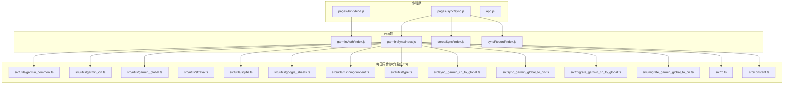
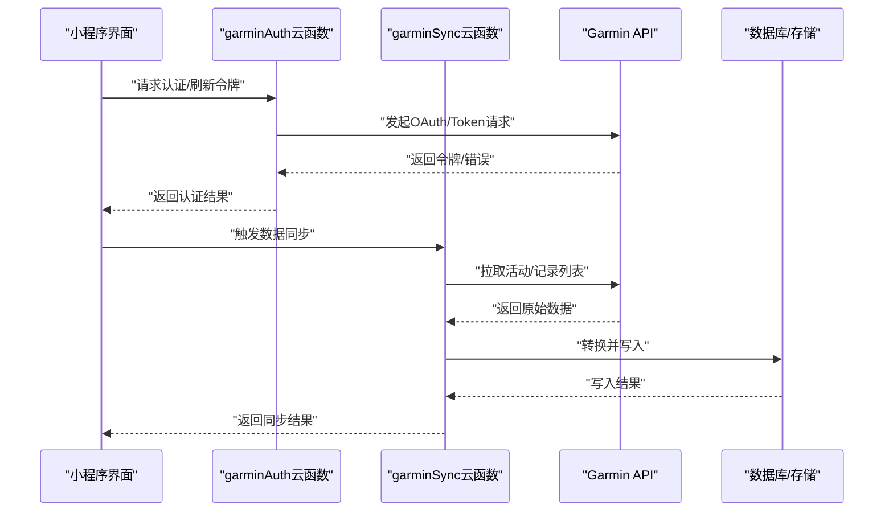
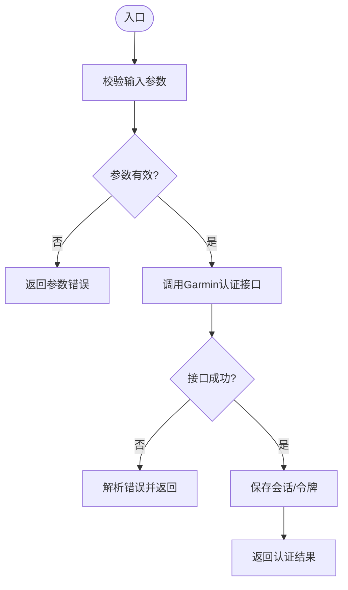
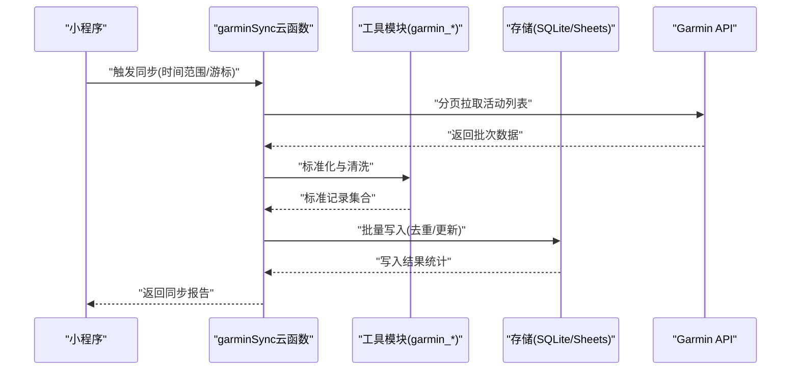
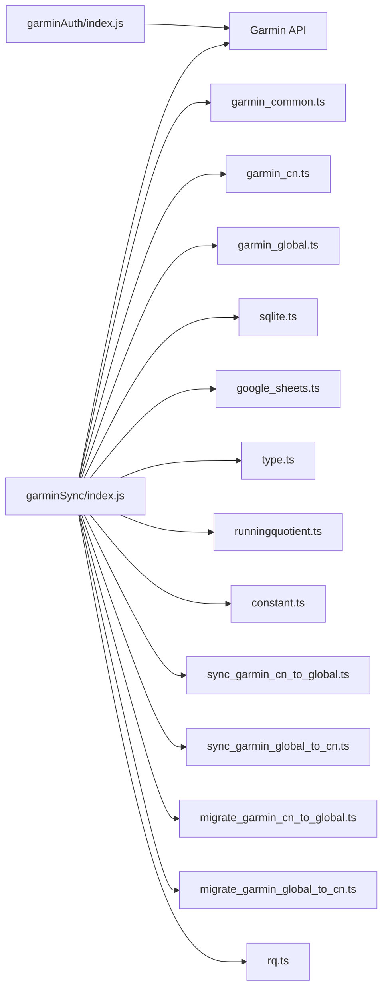

# 云函数调试指南

<cite>
**本文档引用的文件**   
- [cloudfunctions/garminAuth/index.js](file://cloudfunctions/garminAuth/index.js)
- [cloudfunctions/garminAuth/config.json](file://cloudfunctions/garminAuth/config.json)
- [cloudfunctions/garminSync/index.js](file://cloudfunctions/garminSync/index.js)
- [cloudfunctions/garminSync/package.json](file://cloudfunctions/garminSync/package.json)
- [cloudfunctions/corosSync/index.js](file://cloudfunctions/corosSync/index.js)
- [cloudfunctions/syncRecord/index.js](file://cloudfunctions/syncRecord/index.js)
- [cloudfunctions/syncRecord/package.json](file://cloudfunctions/syncRecord/package.json)
- [dailysync-ref/src/utils/garmin_common.ts](file://dailysync-ref/src/utils/garmin_common.ts)
- [dailysync-ref/src/utils/garmin_cn.ts](file://dailysync-ref/src/utils/garmin_cn.ts)
- [dailysync-ref/src/utils/garmin_global.ts](file://dailysync-ref/src/utils/garmin_global.ts)
- [dailysync-ref/src/utils/strava.ts](file://dailysync-ref/src/utils/strava.ts)
- [dailysync-ref/src/utils/sqlite.ts](file://dailysync-ref/src/utils/sqlite.ts)
- [dailysync-ref/src/utils/google_sheets.ts](file://dailysync-ref/src/utils/google_sheets.ts)
- [dailysync-ref/src/utils/runningquotient.ts](file://dailysync-ref/src/utils/runningquotient.ts)
- [dailysync-ref/src/utils/type.ts](file://dailysync-ref/src/utils/type.ts)
- [dailysync-ref/src/sync_garmin_cn_to_global.ts](file://dailysync-ref/src/sync_garmin_cn_to_global.ts)
- [dailysync-ref/src/sync_garmin_global_to_cn.ts](file://dailysync-ref/src/sync_garmin_global_to_cn.ts)
- [dailysync-ref/src/migrate_garmin_cn_to_global.ts](file://dailysync-ref/src/migrate_garmin_cn_to_global.ts)
- [dailysync-ref/src/migrate_garmin_global_to_cn.ts](file://dailysync-ref/src/migrate_garmin_global_to_cn.ts)
- [dailysync-ref/src/rq.ts](file://dailysync-ref/src/rq.ts)
- [dailysync-ref/src/constant.ts](file://dailysync-ref/src/constant.ts)
- [miniprogram/pages/bind/bind.js](file://miniprogram/pages/bind/bind.js)
- [miniprogram/pages/sync/sync.js](file://miniprogram/pages/sync/sync.js)
- [miniprogram/app.js](file://miniprogram/app.js)
- [project.config.json](file://project.config.json)
- [README.md](file://README.md)
</cite>

## 目录
1. [简介](#简介)
2. [项目结构](#项目结构)
3. [核心组件](#核心组件)
4. [架构总览](#架构总览)
5. [详细组件分析](#详细组件分析)
6. [依赖关系分析](#依赖关系分析)
7. [性能考虑](#性能考虑)
8. [故障排除指南](#故障排除指南)
9. [结论](#结论)
10. [附录](#附录)

## 简介
本指南面向微信小程序云函数的本地开发与调试，围绕Garmin认证与数据同步相关云函数，提供从环境搭建、依赖安装、配置设置、本地模拟运行，到日志查看与分析、调用调试技巧、异常处理、性能优化与故障排除的完整实践。读者无需深厚的后端背景也能按步骤完成端到端的调试闭环。

## 项目结构
本项目包含小程序前端、云函数以及一个独立的每日同步参考工程（TypeScript）。云函数主要覆盖：
- Garmin认证授权流程
- Garmin数据同步
- Coros数据同步
- 记录同步

图表来源
- [cloudfunctions/garminAuth/index.js](file://cloudfunctions/garminAuth/index.js)
- [cloudfunctions/garminSync/index.js](file://cloudfunctions/garminSync/index.js)
- [cloudfunctions/corosSync/index.js](file://cloudfunctions/corosSync/index.js)
- [cloudfunctions/syncRecord/index.js](file://cloudfunctions/syncRecord/index.js)
- [dailysync-ref/src/utils/garmin_common.ts](file://dailysync-ref/src/utils/garmin_common.ts)
- [dailysync-ref/src/utils/garmin_cn.ts](file://dailysync-ref/src/utils/garmin_cn.ts)
- [dailysync-ref/src/utils/garmin_global.ts](file://dailysync-ref/src/utils/garmin_global.ts)
- [dailysync-ref/src/utils/strava.ts](file://dailysync-ref/src/utils/strava.ts)
- [dailysync-ref/src/utils/sqlite.ts](file://dailysync-ref/src/utils/sqlite.ts)
- [dailysync-ref/src/utils/google_sheets.ts](file://dailysync-ref/src/utils/google_sheets.ts)
- [dailysync-ref/src/utils/runningquotient.ts](file://dailysync-ref/src/utils/runningquotient.ts)
- [dailysync-ref/src/utils/type.ts](file://dailysync-ref/src/utils/type.ts)
- [dailysync-ref/src/sync_garmin_cn_to_global.ts](file://dailysync-ref/src/sync_garmin_cn_to_global.ts)
- [dailysync-ref/src/sync_garmin_global_to_cn.ts](file://dailysync-ref/src/sync_garmin_global_to_cn.ts)
- [dailysync-ref/src/migrate_garmin_cn_to_global.ts](file://dailysync-ref/src/migrate_garmin_cn_to_global.ts)
- [dailysync-ref/src/migrate_garmin_global_to_cn.ts](file://dailysync-ref/src/migrate_garmin_global_to_cn.ts)
- [dailysync-ref/src/rq.ts](file://dailysync-ref/src/rq.ts)
- [dailysync-ref/src/constant.ts](file://dailysync-ref/src/constant.ts)
- [miniprogram/pages/bind/bind.js](file://miniprogram/pages/bind/bind.js)
- [miniprogram/pages/sync/sync.js](file://miniprogram/pages/sync/sync.js)
- [miniprogram/app.js](file://miniprogram/app.js)

章节来源
- [README.md](file://README.md)
- [project.config.json](file://project.config.json)

## 核心组件
- Garmin认证云函数：负责获取并刷新访问令牌、管理会话状态、返回必要的鉴权信息给前端。
- Garmin同步云函数：拉取用户运动记录、转换数据格式、写入数据库或第三方服务。
- Coros同步云函数：对接Coros平台，拉取并标准化数据。
- 记录同步云函数：将不同来源的记录统一入库或转发。

章节来源
- [cloudfunctions/garminAuth/index.js](file://cloudfunctions/garminAuth/index.js)
- [cloudfunctions/garminSync/index.js](file://cloudfunctions/garminSync/index.js)
- [cloudfunctions/corosSync/index.js](file://cloudfunctions/corosSync/index.js)
- [cloudfunctions/syncRecord/index.js](file://cloudfunctions/syncRecord/index.js)

## 架构总览
下图展示小程序端通过云函数调用Garmin/Coros API，并在云端进行数据转换与落库的整体流程。

图表来源
- [cloudfunctions/garminAuth/index.js](file://cloudfunctions/garminAuth/index.js)
- [cloudfunctions/garminSync/index.js](file://cloudfunctions/garminSync/index.js)
- [miniprogram/pages/bind/bind.js](file://miniprogram/pages/bind/bind.js)
- [miniprogram/pages/sync/sync.js](file://miniprogram/pages/sync/sync.js)

## 详细组件分析

### Garmin认证云函数（garminAuth）
职责
- 接收小程序的认证请求，调用Garmin OAuth流程或刷新令牌接口
- 校验参数、处理异常、输出结构化日志
- 返回前端所需的令牌与必要元数据

关键实现要点
- 参数校验：对clientId、redirectUri、code等字段进行非空与格式检查
- 安全策略：避免在日志中打印敏感信息；使用环境变量或配置文件管理密钥
- 错误处理：区分网络错误、授权失败、令牌过期等场景，返回明确错误码
- 日志输出：记录请求ID、时间戳、关键路径节点，便于追踪

本地调试建议
- 使用微信开发者工具的云函数本地调试模式，注入测试用的环境变量
- 构造最小化请求体，逐步验证每个分支逻辑
- 捕获并打印HTTP响应状态码与错误消息，定位上游API问题

图表来源
- [cloudfunctions/garminAuth/index.js](file://cloudfunctions/garminAuth/index.js)
- [cloudfunctions/garminAuth/config.json](file://cloudfunctions/garminAuth/config.json)

章节来源
- [cloudfunctions/garminAuth/index.js](file://cloudfunctions/garminAuth/index.js)
- [cloudfunctions/garminAuth/config.json](file://cloudfunctions/garminAuth/config.json)

### Garmin同步云函数（garminSync）
职责
- 拉取用户活动与记录数据，转换为内部标准格式
- 写入数据库或第三方服务（如Google Sheets）
- 支持增量同步与去重

关键实现要点
- 分页与限流：合理控制请求频率，避免触发速率限制
- 数据校验：对关键字段进行类型与范围校验，缺失时打补丁或跳过
- 幂等性：基于唯一ID去重，确保重复触发不产生脏数据
- 可观测性：记录拉取数量、转换耗时、写入成功率

本地调试建议
- 使用参考工程的工具模块（如SQLite、Google Sheets）在本地复现数据流转
- 准备少量真实样例数据，验证转换逻辑与边界情况
- 开启详细日志，观察每一步的输入输出

图表来源
- [cloudfunctions/garminSync/index.js](file://cloudfunctions/garminSync/index.js)
- [cloudfunctions/garminSync/package.json](file://cloudfunctions/garminSync/package.json)
- [dailysync-ref/src/utils/garmin_common.ts](file://dailysync-ref/src/utils/garmin_common.ts)
- [dailysync-ref/src/utils/garmin_cn.ts](file://dailysync-ref/src/utils/garmin_cn.ts)
- [dailysync-ref/src/utils/garmin_global.ts](file://dailysync-ref/src/utils/garmin_global.ts)
- [dailysync-ref/src/utils/sqlite.ts](file://dailysync-ref/src/utils/sqlite.ts)
- [dailysync-ref/src/utils/google_sheets.ts](file://dailysync-ref/src/utils/google_sheets.ts)

章节来源
- [cloudfunctions/garminSync/index.js](file://cloudfunctions/garminSync/index.js)
- [cloudfunctions/garminSync/package.json](file://cloudfunctions/garminSync/package.json)
- [dailysync-ref/src/utils/garmin_common.ts](file://dailysync-ref/src/utils/garmin_common.ts)
- [dailysync-ref/src/utils/garmin_cn.ts](file://dailysync-ref/src/utils/garmin_cn.ts)
- [dailysync-ref/src/utils/garmin_global.ts](file://dailysync-ref/src/utils/garmin_global.ts)
- [dailysync-ref/src/utils/sqlite.ts](file://dailysync-ref/src/utils/sqlite.ts)
- [dailysync-ref/src/utils/google_sheets.ts](file://dailysync-ref/src/utils/google_sheets.ts)

### Coros同步云函数（corosSync）
职责
- 对接Coros平台，拉取用户数据并进行标准化处理
- 与Garmin同步流程保持一致的数据模型，便于后续聚合

调试要点
- 确认接入点与鉴权方式
- 针对字段差异做兼容映射
- 监控请求失败率与重试次数

章节来源
- [cloudfunctions/corosSync/index.js](file://cloudfunctions/corosSync/index.js)

### 记录同步云函数（syncRecord）
职责
- 汇总多源记录，执行去重、合并与入库
- 提供统一的查询与导出能力

调试要点
- 关注主键冲突与版本冲突
- 验证批量写入的事务性与回滚策略

章节来源
- [cloudfunctions/syncRecord/index.js](file://cloudfunctions/syncRecord/index.js)
- [cloudfunctions/syncRecord/package.json](file://cloudfunctions/syncRecord/package.json)

## 依赖关系分析
云函数依赖外部API与本地工具模块。下图展示关键依赖关系。

图表来源
- [cloudfunctions/garminAuth/index.js](file://cloudfunctions/garminAuth/index.js)
- [cloudfunctions/garminSync/index.js](file://cloudfunctions/garminSync/index.js)
- [dailysync-ref/src/utils/garmin_common.ts](file://dailysync-ref/src/utils/garmin_common.ts)
- [dailysync-ref/src/utils/garmin_cn.ts](file://dailysync-ref/src/utils/garmin_cn.ts)
- [dailysync-ref/src/utils/garmin_global.ts](file://dailysync-ref/src/utils/garmin_global.ts)
- [dailysync-ref/src/utils/sqlite.ts](file://dailysync-ref/src/utils/sqlite.ts)
- [dailysync-ref/src/utils/google_sheets.ts](file://dailysync-ref/src/utils/google_sheets.ts)
- [dailysync-ref/src/utils/runningquotient.ts](file://dailysync-ref/src/utils/runningquotient.ts)
- [dailysync-ref/src/utils/type.ts](file://dailysync-ref/src/utils/type.ts)
- [dailysync-ref/src/sync_garmin_cn_to_global.ts](file://dailysync-ref/src/sync_garmin_cn_to_global.ts)
- [dailysync-ref/src/sync_garmin_global_to_cn.ts](file://dailysync-ref/src/sync_garmin_global_to_cn.ts)
- [dailysync-ref/src/migrate_garmin_cn_to_global.ts](file://dailysync-ref/src/migrate_garmin_cn_to_global.ts)
- [dailysync-ref/src/migrate_garmin_global_to_cn.ts](file://dailysync-ref/src/migrate_garmin_global_to_cn.ts)
- [dailysync-ref/src/rq.ts](file://dailysync-ref/src/rq.ts)
- [dailysync-ref/src/constant.ts](file://dailysync-ref/src/constant.ts)

章节来源
- [cloudfunctions/garminSync/package.json](file://cloudfunctions/garminSync/package.json)
- [cloudfunctions/syncRecord/package.json](file://cloudfunctions/syncRecord/package.json)

## 性能考虑
- 请求批量化：尽量合并小请求，减少网络往返
- 分页与游标：使用高效分页策略，避免全量拉取
- 缓存热点数据：对频繁读取的配置或字典进行缓存
- 超时与重试：设置合理的超时与指数退避重试
- 资源隔离：避免在云函数中执行重型计算，必要时拆分任务

[本节为通用指导，不直接分析具体文件]

## 故障排除指南
常见问题与排查步骤
- 认证失败
  - 检查clientId、secret、redirectUri是否正确
  - 确认网络可达与证书信任链
  - 查看错误码与响应体，定位OAuth阶段
- 同步失败
  - 核对时间范围与游标是否越界
  - 检查速率限制与重试策略
  - 验证数据格式与必填字段
- 写入异常
  - 检查数据库连接与权限
  - 确认事务与回滚逻辑
  - 查看写入日志与约束冲突

日志与监控建议
- 统一日志格式：包含请求ID、时间戳、操作名、关键参数摘要
- 分级日志：DEBUG/INFO/WARN/ERROR，避免在生产环境输出敏感信息
- 指标上报：成功率、延迟分位、错误分类计数

章节来源
- [cloudfunctions/garminAuth/index.js](file://cloudfunctions/garminAuth/index.js)
- [cloudfunctions/garminSync/index.js](file://cloudfunctions/garminSync/index.js)

## 结论
通过规范化的本地开发环境与调试流程，结合清晰的日志与监控体系，可以显著提升Garmin认证与数据同步云函数的稳定性与可维护性。建议在迭代过程中持续完善参数校验、错误分类与性能指标，形成闭环的调试与优化机制。

[本节为总结性内容，不直接分析具体文件]

## 附录
- 本地开发环境搭建
  - 安装Node.js与包管理器，初始化云函数依赖
  - 配置环境变量与密钥管理（建议使用配置文件或环境变量）
  - 启用微信开发者工具的云函数本地调试模式
- 常用调试命令与技巧
  - 最小化请求体逐步验证
  - 断点与日志结合定位问题
  - 使用参考工程的工具模块在本地复现数据流转
- 最佳实践清单
  - 参数校验前置、错误分类清晰、日志脱敏
  - 幂等写入、去重策略、事务保障
  - 限流与重试、超时保护、资源回收

[本节为通用指导，不直接分析具体文件]