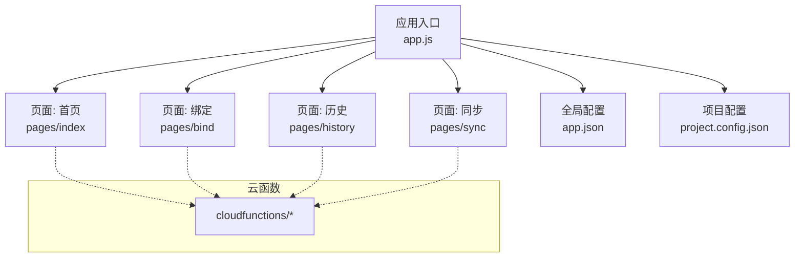
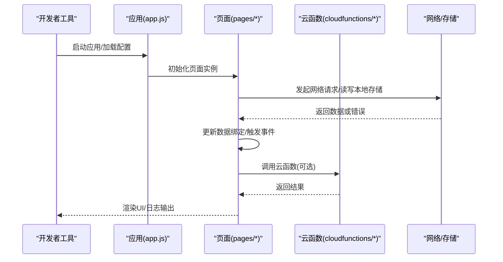
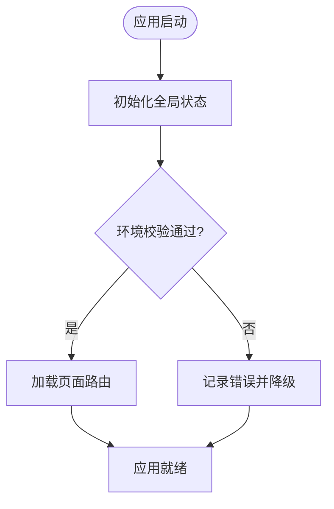
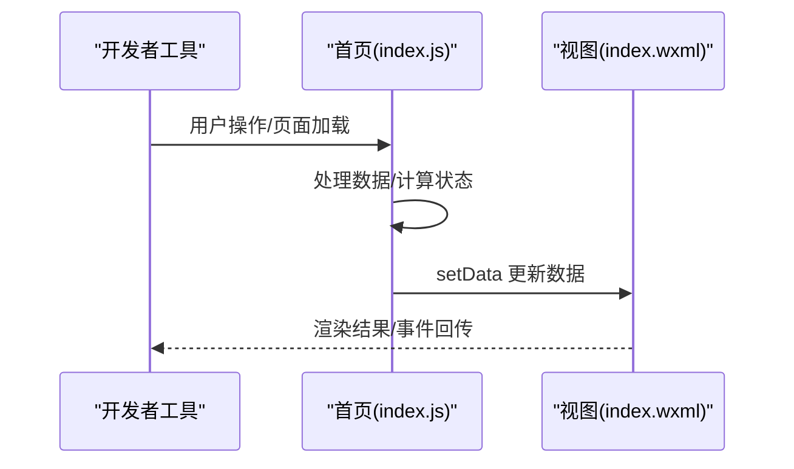
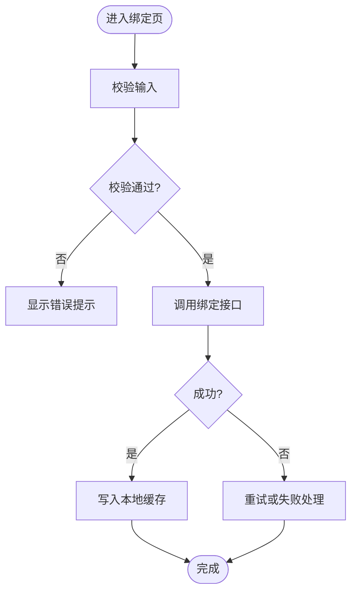
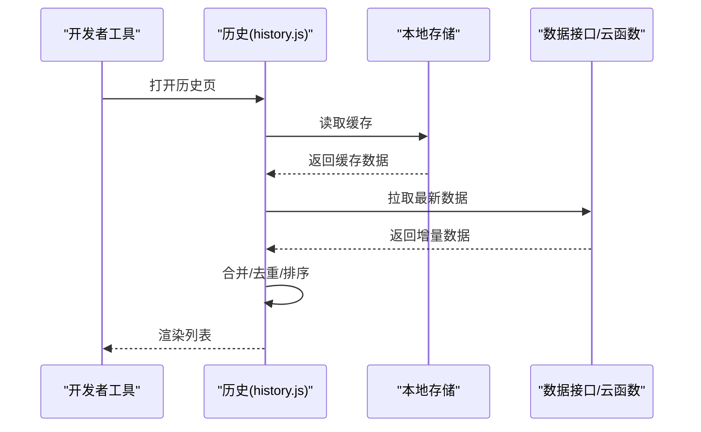
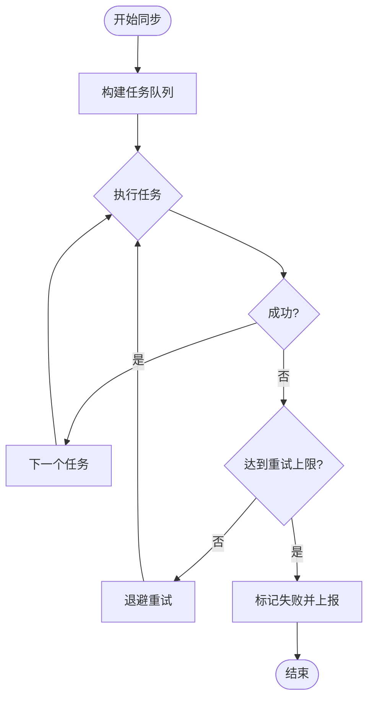
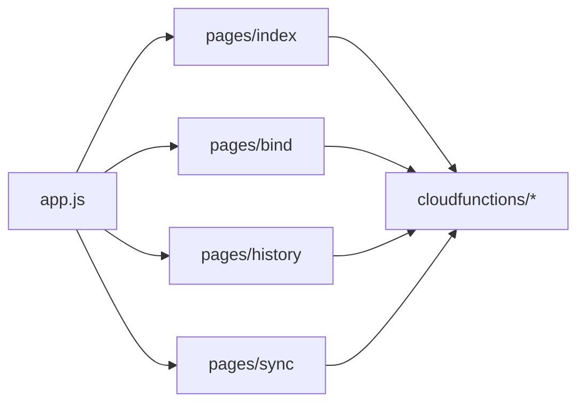

# 小程序调试技巧

<cite>
**本文引用的文件**   
- [app.js](file://miniprogram/app.js)
- [app.json](file://miniprogram/app.json)
- [index.js](file://miniprogram/pages/index/index.js)
- [index.wxml](file://miniprogram/pages/index/index.wxml)
- [bind.js](file://miniprogram/pages/bind/bind.js)
- [history.js](file://miniprogram/pages/history/history.js)
- [sync.js](file://miniprogram/pages/sync/sync.js)
- [project.config.json](file://project.config.json)
- [README.md](file://README.md)
</cite>

## 目录
1. [简介](#简介)
2. [项目结构](#项目结构)
3. [核心组件](#核心组件)
4. [架构总览](#架构总览)
5. [详细组件分析](#详细组件分析)
6. [依赖关系分析](#依赖关系分析)
7. [性能注意事项](#性能注意事项)
8. [故障排查指南](#故障排查指南)
9. [结论](#结论)
10. [附录](#附录)

## 简介
本文件面向微信小程序开发者，系统化讲解如何使用微信开发者工具进行高效调试。内容覆盖控制台调试、网络请求监控、本地存储查看与性能分析；并针对页面数据绑定、事件监听、组件状态检查等常见场景给出可操作的步骤与最佳实践。同时提供API调用失败、数据同步问题、页面渲染异常等典型问题的定位与修复建议。

## 项目结构
本项目为微信小程序工程，包含应用入口、多页面以及云函数目录。关键目录与职责：
- miniprogram：小程序前端代码，包含应用配置、样式与多个页面（首页、绑定、历史、同步）
- cloudfunctions：云函数目录，用于后端逻辑与数据同步
- project.config.json：项目级配置，含调试相关设置（如AppID、编译选项等）

图表来源
- [app.js](file://miniprogram/app.js)
- [app.json](file://miniprogram/app.json)
- [index.js](file://miniprogram/pages/index/index.js)
- [bind.js](file://miniprogram/pages/bind/bind.js)
- [history.js](file://miniprogram/pages/history/history.js)
- [sync.js](file://miniprogram/pages/sync/sync.js)
- [project.config.json](file://project.config.json)

章节来源
- [README.md](file://README.md)
- [project.config.json](file://project.config.json)

## 核心组件
- 应用入口 app.js：初始化全局状态、生命周期钩子、错误捕获与日志输出，是调试的起点
- 页面模块 pages/*：每个页面负责自身的数据模型、视图与交互，便于逐页定位问题
- 云函数 cloudfunctions/*：承载业务逻辑与第三方服务对接，常用于排查网络与数据一致性

章节来源
- [app.js](file://miniprogram/app.js)
- [index.js](file://miniprogram/pages/index/index.js)
- [bind.js](file://miniprogram/pages/bind/bind.js)
- [history.js](file://miniprogram/pages/history/history.js)
- [sync.js](file://miniprogram/pages/sync/sync.js)

## 架构总览
小程序采用“页面+组件+云函数”的分层结构。调试时建议从应用入口开始，逐步下钻到具体页面与云函数，结合开发者工具的“控制台、网络、存储、性能”面板进行交叉验证。

图表来源
- [app.js](file://miniprogram/app.js)
- [index.js](file://miniprogram/pages/index/index.js)
- [sync.js](file://miniprogram/pages/sync/sync.js)

## 详细组件分析

### 应用入口 app.js 调试要点
- 生命周期调试：在 onLaunch/onShow 中打印关键参数与环境信息，确认运行环境、权限与基础库版本
- 全局错误捕获：使用 try/catch 包裹初始化流程，统一记录错误堆栈与上下文
- 日志策略：区分开发/生产日志级别，避免在生产环境输出敏感信息

图表来源
- [app.js](file://miniprogram/app.js)

章节来源
- [app.js](file://miniprogram/app.js)

### 页面 index（首页）调试要点
- 数据绑定调试：在 setData 前后打印数据快照，确保视图与数据一致
- 事件监听调试：在事件回调中记录入参与返回值，必要时添加节流/防抖
- 条件渲染调试：对复杂 wxml 条件表达式，拆分变量并单独验证

图表来源
- [index.js](file://miniprogram/pages/index/index.js)
- [index.wxml](file://miniprogram/pages/index/index.wxml)

章节来源
- [index.js](file://miniprogram/pages/index/index.js)
- [index.wxml](file://miniprogram/pages/index/index.wxml)

### 页面 bind（绑定）调试要点
- 表单输入调试：监听 input/change 事件，实时校验字段格式与必填项
- 异步绑定流程：对绑定接口调用增加超时与重试机制，并在失败时提示用户
- 本地缓存调试：保存绑定态到本地存储，便于断点恢复与复现

图表来源
- [bind.js](file://miniprogram/pages/bind/bind.js)

章节来源
- [bind.js](file://miniprogram/pages/bind/bind.js)

### 页面 history（历史）调试要点
- 列表渲染调试：分页加载时检查数据拼接与去重逻辑，避免重复项
- 空状态调试：无数据时展示占位图与引导文案，提升用户体验
- 性能优化：虚拟列表或按需加载，减少首屏压力

图表来源
- [history.js](file://miniprogram/pages/history/history.js)

章节来源
- [history.js](file://miniprogram/pages/history/history.js)

### 页面 sync（同步）调试要点
- 任务调度调试：记录任务队列、执行顺序与失败重试次数
- 进度反馈调试：实时更新进度条与状态文本，便于用户感知
- 冲突解决调试：对并发同步场景，采用锁或版本号控制避免数据覆盖

图表来源
- [sync.js](file://miniprogram/pages/sync/sync.js)

章节来源
- [sync.js](file://miniprogram/pages/sync/sync.js)

## 依赖关系分析
小程序各页面相对独立，通常通过应用入口进行路由管理，云函数作为外部依赖提供服务。调试时应关注页面与云函数的契约（输入/输出、错误码），以及本地存储键名的一致性。

图表来源
- [app.js](file://miniprogram/app.js)
- [index.js](file://miniprogram/pages/index/index.js)
- [bind.js](file://miniprogram/pages/bind/bind.js)
- [history.js](file://miniprogram/pages/history/history.js)
- [sync.js](file://miniprogram/pages/sync/sync.js)

章节来源
- [app.json](file://miniprogram/app.json)

## 性能注意事项
- 首屏优化：减少初始setData数据量，延迟非关键资源加载
- 渲染优化：避免频繁setData，合并多次更新；合理使用 wx.nextTick
- 内存管理：及时释放定时器与事件监听，防止内存泄漏
- 网络优化：启用缓存与分页，限制并发请求数，合理设置超时

[本节为通用指导，不直接分析具体文件]

## 故障排查指南

### 控制台调试
- 使用 console.log/warn/error 输出关键路径与变量快照
- 利用断点调试：在 Sources 面板打断点，逐步执行并观察变量变化
- 过滤与搜索：按模块或关键字过滤日志，快速定位问题

章节来源
- [app.js](file://miniprogram/app.js)
- [index.js](file://miniprogram/pages/index/index.js)

### 网络请求监控
- 在 Network 面板查看请求头、响应体与耗时
- 检查跨域、鉴权与签名是否正确
- 对失败请求进行重试与降级处理，并记录错误原因

章节来源
- [sync.js](file://miniprogram/pages/sync/sync.js)
- [history.js](file://miniprogram/pages/history/history.js)

### 本地存储查看
- 在 Storage 面板查看 key-value 与过期时间
- 校验键名规范与数据结构一致性
- 清理脏数据后重新拉取，验证是否恢复正常

章节来源
- [bind.js](file://miniprogram/pages/bind/bind.js)
- [history.js](file://miniprogram/pages/history/history.js)

### 性能分析
- 使用 Performance 面板录制页面生命周期与渲染帧率
- 识别长任务与阻塞点，拆分逻辑或异步化
- 对比不同机型与基础库版本的差异

章节来源
- [app.js](file://miniprogram/app.js)
- [index.js](file://miniprogram/pages/index/index.js)

### 常见问题与解决方案
- API调用失败：检查网络连通性、鉴权令牌、签名与超时；增加重试与降级
- 数据同步问题：核对版本号与幂等设计；使用事务或锁避免覆盖
- 页面渲染异常：检查数据绑定表达式与wxml语法；简化条件渲染逻辑

章节来源
- [bind.js](file://miniprogram/pages/bind/bind.js)
- [sync.js](file://miniprogram/pages/sync/sync.js)
- [history.js](file://miniprogram/pages/history/history.js)

## 结论
通过系统化的调试方法与工具组合，可以快速定位并解决小程序中的常见问题。建议建立统一的日志与错误上报机制，结合性能分析与网络监控，持续提升稳定性与用户体验。

[本节为总结，不直接分析具体文件]

## 附录
- 项目配置：在 project.config.json 中开启调试开关与日志级别
- 页面路由：在 app.json 中配置页面路径与导航栏样式，便于调试跳转
- 云函数：在 cloudfunctions 目录下编写与测试云函数，配合小程序端联调

章节来源
- [project.config.json](file://project.config.json)
- [app.json](file://miniprogram/app.json)
- [README.md](file://README.md)