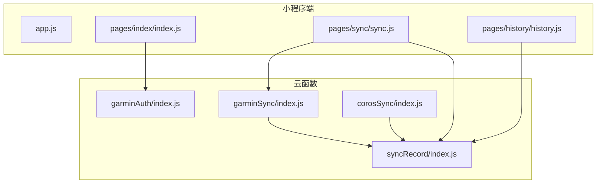
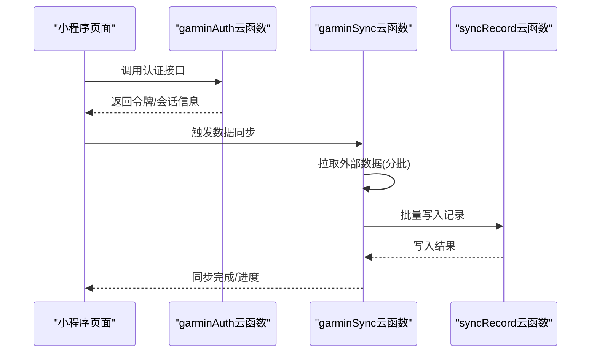
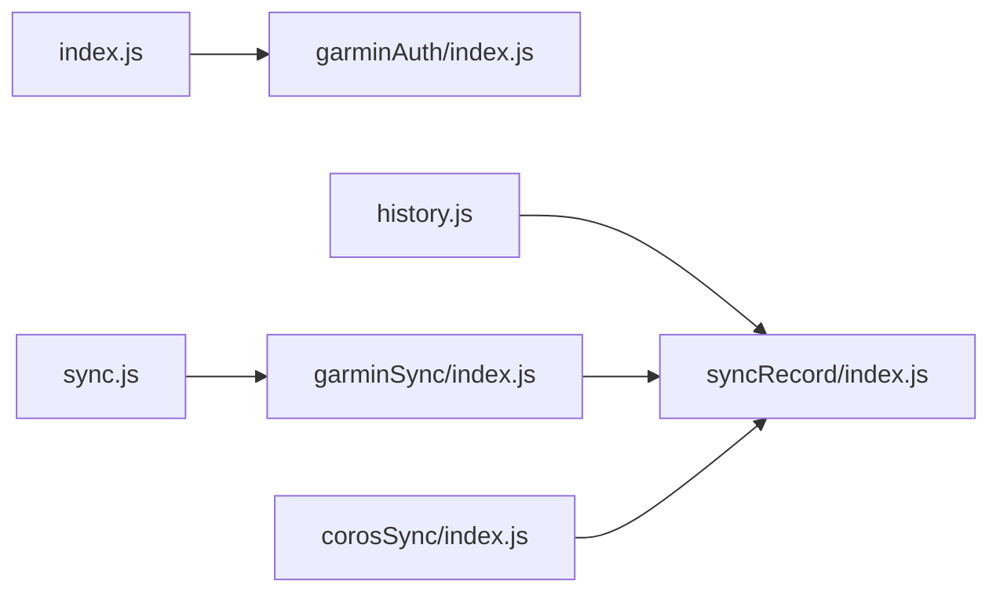

# 性能分析与优化

<cite>
**本文引用的文件**   
- [miniprogram/app.js](file://miniprogram/app.js)
- [miniprogram/pages/index/index.js](file://miniprogram/pages/index/index.js)
- [miniprogram/pages/sync/sync.js](file://miniprogram/pages/sync/sync.js)
- [miniprogram/pages/history/history.js](file://miniprogram/pages/history/history.js)
- [cloudfunctions/corosSync/index.js](file://cloudfunctions/corosSync/index.js)
- [cloudfunctions/garminAuth/index.js](file://cloudfunctions/garminAuth/index.js)
- [cloudfunctions/garminSync/index.js](file://cloudfunctions/garminSync/index.js)
- [cloudfunctions/syncRecord/index.js](file://cloudfunctions/syncRecord/index.js)
</cite>

## 目录
1. [简介](#简介)
2. [项目结构](#项目结构)
3. [核心组件](#核心组件)
4. [架构总览](#架构总览)
5. [详细组件分析](#详细组件分析)
6. [依赖关系分析](#依赖关系分析)
7. [性能考量](#性能考量)
8. [故障排查指南](#故障排查指南)
9. [结论](#结论)
10. [附录](#附录)

## 简介
本指南面向微信小程序与云函数场景，系统性阐述性能分析方法与优化策略。内容覆盖：
- 小程序端：页面加载时间、网络请求耗时、内存使用、渲染性能监控
- 云函数：代码执行效率、数据库查询优化、资源管理
- 数据同步：批量处理、缓存机制、异步操作优化
- 瓶颈定位：慢查询分析、内存泄漏检测、CPU占用优化
- 工具与基准：性能监控工具使用、基准测试实施

## 项目结构
本项目包含小程序前端（miniprogram）与多个云函数（cloudfunctions），以及一个用于数据迁移/同步的独立服务（dailysync-ref）。小程序负责用户交互与数据展示，云函数承担认证、同步与记录等后端逻辑。

图表来源
- [miniprogram/app.js](file://miniprogram/app.js)
- [miniprogram/pages/index/index.js](file://miniprogram/pages/index/index.js)
- [miniprogram/pages/sync/sync.js](file://miniprogram/pages/sync/sync.js)
- [miniprogram/pages/history/history.js](file://miniprogram/pages/history/history.js)
- [cloudfunctions/garminAuth/index.js](file://cloudfunctions/garminAuth/index.js)
- [cloudfunctions/garminSync/index.js](file://cloudfunctions/garminSync/index.js)
- [cloudfunctions/corosSync/index.js](file://cloudfunctions/corosSync/index.js)
- [cloudfunctions/syncRecord/index.js](file://cloudfunctions/syncRecord/index.js)

章节来源
- [miniprogram/app.js](file://miniprogram/app.js)
- [miniprogram/pages/index/index.js](file://miniprogram/pages/index/index.js)
- [miniprogram/pages/sync/sync.js](file://miniprogram/pages/sync/sync.js)
- [miniprogram/pages/history/history.js](file://miniprogram/pages/history/history.js)
- [cloudfunctions/garminAuth/index.js](file://cloudfunctions/garminAuth/index.js)
- [cloudfunctions/garminSync/index.js](file://cloudfunctions/garminSync/index.js)
- [cloudfunctions/corosSync/index.js](file://cloudfunctions/corosSync/index.js)
- [cloudfunctions/syncRecord/index.js](file://cloudfunctions/syncRecord/index.js)

## 核心组件
- 小程序入口与页面
  - app.js：应用初始化、全局配置、生命周期钩子
  - index.js：首页逻辑，通常包含首次数据拉取与状态初始化
  - sync.js：触发云函数进行数据同步，管理进度与错误提示
  - history.js：历史数据列表渲染与分页加载
- 云函数
  - garminAuth：第三方认证流程，获取访问令牌并返回给小程序
  - garminSync：从外部平台拉取数据，写入数据库或消息队列
  - corosSync：另一数据源的同步逻辑
  - syncRecord：统一的数据落库与记录接口，供其他云函数调用

章节来源
- [miniprogram/app.js](file://miniprogram/app.js)
- [miniprogram/pages/index/index.js](file://miniprogram/pages/index/index.js)
- [miniprogram/pages/sync/sync.js](file://miniprogram/pages/sync/sync.js)
- [miniprogram/pages/history/history.js](file://miniprogram/pages/history/history.js)
- [cloudfunctions/garminAuth/index.js](file://cloudfunctions/garminAuth/index.js)
- [cloudfunctions/garminSync/index.js](file://cloudfunctions/garminSync/index.js)
- [cloudfunctions/corosSync/index.js](file://cloudfunctions/corosSync/index.js)
- [cloudfunctions/syncRecord/index.js](file://cloudfunctions/syncRecord/index.js)

## 架构总览
小程序通过 wx.cloud.callFunction 调用云函数；云函数之间可互相调用以解耦职责。数据流典型路径为：小程序发起请求 → 认证/鉴权 → 数据拉取 → 批量入库 → 返回结果。

图表来源
- [miniprogram/pages/sync/sync.js](file://miniprogram/pages/sync/sync.js)
- [cloudfunctions/garminAuth/index.js](file://cloudfunctions/garminAuth/index.js)
- [cloudfunctions/garminSync/index.js](file://cloudfunctions/garminSync/index.js)
- [cloudfunctions/syncRecord/index.js](file://cloudfunctions/syncRecord/index.js)

## 详细组件分析

### 小程序端性能分析要点
- 页面加载时间
  - 使用 Performance API 与小程序开发者工具的“性能面板”测量首屏渲染时间、脚本执行时间与布局绘制时间
  - 在页面 onLoad/onShow 中埋点记录关键时间点，对比不同机型与网络条件下的差异
- 网络请求耗时
  - 对 wx.request/wx.cloud.callFunction 包装计时器，统计 RTT、TTFB、下载时长
  - 合并小请求、启用 gzip、减少头部体积，避免重复请求
- 内存使用分析
  - 观察开发者工具“内存”面板的堆快照，识别未释放的闭包、事件监听器与大型数组
  - 长列表采用虚拟滚动或分页加载，避免一次性渲染过多节点
- 渲染性能监控
  - 使用 setData 最小化更新，避免频繁大对象赋值
  - 拆分复杂组件，减少重绘与回流

章节来源
- [miniprogram/pages/index/index.js](file://miniprogram/pages/index/index.js)
- [miniprogram/pages/sync/sync.js](file://miniprogram/pages/sync/sync.js)
- [miniprogram/pages/history/history.js](file://miniprogram/pages/history/history.js)

### 云函数性能优化技巧
- 代码执行效率
  - 避免在循环中进行 I/O 操作，将 I/O 批量化
  - 使用连接池复用数据库连接，减少握手开销
  - 合理设置超时与重试策略，避免雪崩
- 数据库查询优化
  - 为高频查询字段建立索引，避免全表扫描
  - 使用投影只取必要字段，减少传输与序列化成本
  - 分页查询替代一次性拉取，控制单次事务大小
- 资源管理
  - 及时关闭连接、释放临时文件与内存
  - 利用云函数冷启动优化：精简依赖、按需引入模块

章节来源
- [cloudfunctions/garminAuth/index.js](file://cloudfunctions/garminAuth/index.js)
- [cloudfunctions/garminSync/index.js](file://cloudfunctions/garminSync/index.js)
- [cloudfunctions/corosSync/index.js](file://cloudfunctions/corosSync/index.js)
- [cloudfunctions/syncRecord/index.js](file://cloudfunctions/syncRecord/index.js)

### 数据同步性能优化策略
- 批量处理
  - 将多条记录聚合后一次性写入，降低事务次数
  - 分片并行写入，注意并发上限与幂等性
- 缓存机制
  - 对热点数据使用本地缓存或分布式缓存，设置合理的过期策略
  - 写多读少场景考虑延迟双删或版本号校验
- 异步操作优化
  - 使用消息队列削峰填谷，保证最终一致性
  - 任务拆分为可重试的单元，失败自动补偿

章节来源
- [cloudfunctions/garminSync/index.js](file://cloudfunctions/garminSync/index.js)
- [cloudfunctions/corosSync/index.js](file://cloudfunctions/corosSync/index.js)
- [cloudfunctions/syncRecord/index.js](file://cloudfunctions/syncRecord/index.js)

### 瓶颈识别与解决
- 慢查询分析
  - 开启数据库慢查询日志，定位高耗时 SQL
  - 使用 EXPLAIN 分析执行计划，补充缺失索引
- 内存泄漏检测
  - 定期采集堆快照，比较增长趋势，定位未释放引用
  - 检查定时器、事件监听器与全局变量是否被清理
- CPU 占用优化
  - 识别 CPU 密集型计算，考虑移至后台任务或离线批处理
  - 优化算法复杂度，避免 O(n^2) 嵌套循环

章节来源
- [cloudfunctions/syncRecord/index.js](file://cloudfunctions/syncRecord/index.js)
- [cloudfunctions/garminSync/index.js](file://cloudfunctions/garminSync/index.js)

### 性能监控工具与基准测试
- 小程序端
  - 开发者工具“性能面板”：记录 FPS、主线程阻塞、setData 耗时
  - 自定义埋点：在关键路径打点，上报到服务端或本地日志
- 云函数
  - 云函数控制台日志与指标：CPU 使用率、内存峰值、执行时长分布
  - APM 集成：链路追踪与分布式追踪
- 基准测试
  - 设计压测用例：QPS、RT、错误率、资源利用率
  - 使用自动化脚本模拟真实流量，持续回归验证

章节来源
- [miniprogram/pages/sync/sync.js](file://miniprogram/pages/sync/sync.js)
- [cloudfunctions/garminAuth/index.js](file://cloudfunctions/garminAuth/index.js)
- [cloudfunctions/garminSync/index.js](file://cloudfunctions/garminSync/index.js)
- [cloudfunctions/syncRecord/index.js](file://cloudfunctions/syncRecord/index.js)

## 依赖关系分析
小程序页面与云函数之间的调用关系如下：

图表来源
- [miniprogram/pages/index/index.js](file://miniprogram/pages/index/index.js)
- [miniprogram/pages/sync/sync.js](file://miniprogram/pages/sync/sync.js)
- [miniprogram/pages/history/history.js](file://miniprogram/pages/history/history.js)
- [cloudfunctions/garminAuth/index.js](file://cloudfunctions/garminAuth/index.js)
- [cloudfunctions/garminSync/index.js](file://cloudfunctions/garminSync/index.js)
- [cloudfunctions/corosSync/index.js](file://cloudfunctions/corosSync/index.js)
- [cloudfunctions/syncRecord/index.js](file://cloudfunctions/syncRecord/index.js)

章节来源
- [miniprogram/pages/index/index.js](file://miniprogram/pages/index/index.js)
- [miniprogram/pages/sync/sync.js](file://miniprogram/pages/sync/sync.js)
- [miniprogram/pages/history/history.js](file://miniprogram/pages/history/history.js)
- [cloudfunctions/garminAuth/index.js](file://cloudfunctions/garminAuth/index.js)
- [cloudfunctions/garminSync/index.js](file://cloudfunctions/garminSync/index.js)
- [cloudfunctions/corosSync/index.js](file://cloudfunctions/corosSync/index.js)
- [cloudfunctions/syncRecord/index.js](file://cloudfunctions/syncRecord/index.js)

## 性能考量
- 网络层
  - 合并请求、压缩响应、CDN 加速静态资源
  - 合理设置缓存头，减少重复下载
- 渲染层
  - 减少 setData 频率与数据量，使用增量更新
  - 避免在渲染回调中执行重型计算
- 存储层
  - 读写分离、读写分离下的数据一致性策略
  - 冷热数据分层，归档历史数据
- 计算层
  - 异步化与并行化，限制并发度防止过载
  - 预热与懒加载结合，平衡启动速度与资源占用

[本节为通用指导，不直接分析具体文件]

## 故障排查指南
- 常见问题定位
  - 页面卡顿：检查主线程阻塞、大量 DOM 操作与频繁 setData
  - 同步失败：查看云函数日志、网络错误码与重试策略
  - 内存上涨：抓取堆快照，定位未释放引用与循环引用
- 诊断步骤
  - 复现问题并采集日志与指标
  - 缩小范围至单页或单云函数
  - 逐步禁用功能模块，二分法定位根因
- 恢复与预防
  - 快速回滚或降级策略
  - 增加监控告警与容量规划

章节来源
- [miniprogram/pages/sync/sync.js](file://miniprogram/pages/sync/sync.js)
- [cloudfunctions/garminSync/index.js](file://cloudfunctions/garminSync/index.js)
- [cloudfunctions/syncRecord/index.js](file://cloudfunctions/syncRecord/index.js)

## 结论
通过系统化的性能监控、瓶颈定位与优化实践，可以显著提升小程序与云函数的整体性能。建议建立常态化的性能基线与回归测试，确保变更不会引入性能退化。

[本节为总结性内容，不直接分析具体文件]

## 附录
- 常用指标定义
  - 首屏时间、平均响应时间、P95/P99 延迟、错误率、CPU/内存峰值
- 优化清单
  - 网络：合并请求、压缩、缓存
  - 渲染：最小化 setData、虚拟化列表
  - 数据库：索引、投影、分页
  - 云函数：连接池、批处理、幂等
- 参考工具
  - 小程序开发者工具、APM 平台、压测工具

[本节为参考资料，不直接分析具体文件]