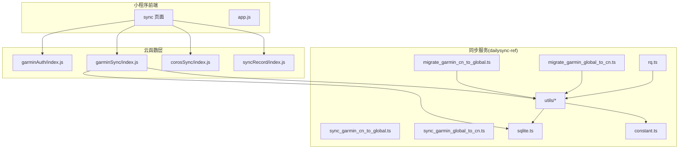
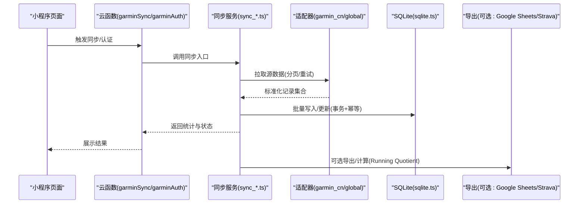
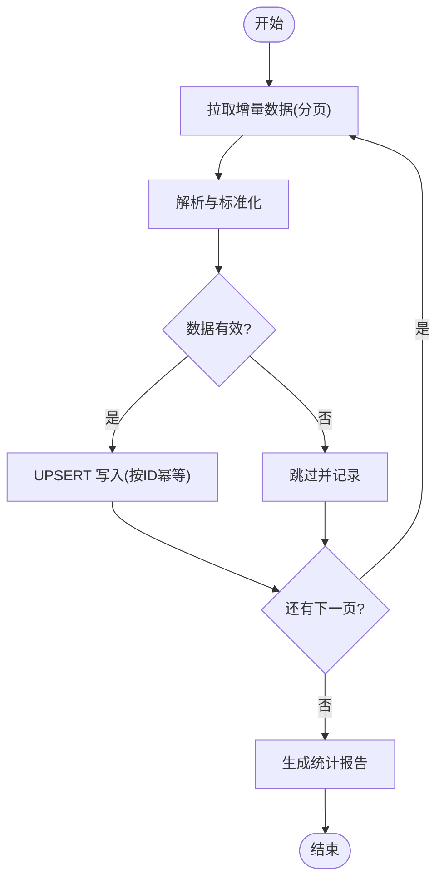
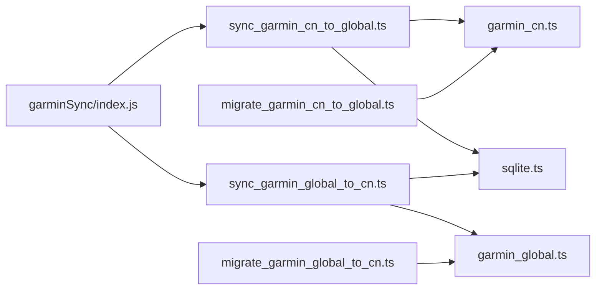

# 数据同步测试策略

<cite>
**本文引用的文件**   
- [README.md](file://README.md)
- [dailysync-ref/README.md](file://dailysync-ref/README.md)
- [dailysync-ref/src/utils/sqlite.ts](file://dailysync-ref/src/utils/sqlite.ts)
- [dailysync-ref/src/utils/garmin_cn.ts](file://dailysync-ref/src/utils/garmin_cn.ts)
- [dailysync-ref/src/utils/garmin_global.ts](file://dailysync-ref/src/utils/garmin_global.ts)
- [dailysync-ref/src/utils/garmin_common.ts](file://dailysync-ref/src/utils/garmin_common.ts)
- [dailysync-ref/src/sync_garmin_cn_to_global.ts](file://dailysync-ref/src/sync_garmin_cn_to_global.ts)
- [dailysync-ref/src/sync_garmin_global_to_cn.ts](file://dailysync-ref/src/sync_garmin_global_to_cn.ts)
- [dailysync-ref/src/migrate_garmin_cn_to_global.ts](file://dailysync-ref/src/migrate_garmin_cn_to_global.ts)
- [dailysync-ref/src/migrate_garmin_global_to_cn.ts](file://dailysync-ref/src/migrate_garmin_global_to_cn.ts)
- [dailysync-ref/src/utils/type.ts](file://dailysync-ref/src/utils/type.ts)
- [dailysync-ref/src/utils/google_sheets.ts](file://dailysync-ref/src/utils/google_sheets.ts)
- [dailysync-ref/src/utils/strava.ts](file://dailysync-ref/src/utils/strava.ts)
- [dailysync-ref/src/utils/runningquotient.ts](file://dailysync-ref/src/utils/runningquotient.ts)
- [dailysync-ref/src/utils/number_tricks.ts](file://dailysync-ref/src/utils/number_tricks.ts)
- [dailysync-ref/src/rq.ts](file://dailysync-ref/src/rq.ts)
- [dailysync-ref/src/constant.ts](file://dailysync-ref/src/constant.ts)
- [cloudfunctions/garminAuth/index.js](file://cloudfunctions/garminAuth/index.js)
- [cloudfunctions/garminSync/index.js](file://cloudfunctions/garminSync/index.js)
- [cloudfunctions/corosSync/index.js](file://cloudfunctions/corosSync/index.js)
- [cloudfunctions/syncRecord/index.js](file://cloudfunctions/syncRecord/index.js)
- [miniprogram/pages/sync/sync.js](file://miniprogram/pages/sync/sync.js)
- [miniprogram/app.js](file://miniprogram/app.js)
</cite>

## 目录
1. [引言](#引言)
2. [项目结构](#项目结构)
3. [核心组件](#核心组件)
4. [架构总览](#架构总览)
5. [详细组件分析](#详细组件分析)
6. [依赖关系分析](#依赖关系分析)
7. [性能考量](#性能考量)
8. [故障排查指南](#故障排查指南)
9. [结论](#结论)
10. [附录](#附录)

## 引言
本测试策略文档围绕数据同步功能，覆盖单元测试、集成测试与端到端流程测试，重点包括：
- Garmin API 调用模拟与断言
- 数据转换逻辑（字段映射、格式转换、版本兼容）
- 数据库操作验证（SQLite 读写、事务、幂等）
- 增量同步与冲突解决
- 中国版与国际版之间的迁移与双向同步
- 测试环境搭建、测试数据准备与自动化流水线配置

目标读者包括开发、测试与运维人员，旨在提供可执行的测试方案与最佳实践。

## 项目结构
本项目包含微信小程序前端、云函数与独立的每日同步参考实现（TypeScript）。关键目录与职责：
- dailysync-ref：数据同步与迁移的核心实现，含 SQLite、Garmin CN/GLOBAL、Google Sheets、Strava、Running Quotient 等工具模块与同步脚本
- cloudfunctions：微信云函数，封装认证、同步与记录同步能力
- miniprogram：小程序前端页面，包含同步入口与交互

图表来源
- [dailysync-ref/src/sync_garmin_cn_to_global.ts](file://dailysync-ref/src/sync_garmin_cn_to_global.ts)
- [dailysync-ref/src/sync_garmin_global_to_cn.ts](file://dailysync-ref/src/sync_garmin_global_to_cn.ts)
- [dailysync-ref/src/migrate_garmin_cn_to_global.ts](file://dailysync-ref/src/migrate_garmin_cn_to_global.ts)
- [dailysync-ref/src/migrate_garmin_global_to_cn.ts](file://dailysync-ref/src/migrate_garmin_global_to_cn.ts)
- [dailysync-ref/src/utils/sqlite.ts](file://dailysync-ref/src/utils/sqlite.ts)
- [dailysync-ref/src/utils/garmin_cn.ts](file://dailysync-ref/src/utils/garmin_cn.ts)
- [dailysync-ref/src/utils/garmin_global.ts](file://dailysync-ref/src/utils/garmin_global.ts)
- [cloudfunctions/garminAuth/index.js](file://cloudfunctions/garminAuth/index.js)
- [cloudfunctions/garminSync/index.js](file://cloudfunctions/garminSync/index.js)
- [miniprogram/pages/sync/sync.js](file://miniprogram/pages/sync/sync.js)

章节来源
- [README.md](file://README.md)
- [dailysync-ref/README.md](file://dailysync-ref/README.md)

## 核心组件
- Garmin 数据源适配层
  - garmin_cn.ts：中国版 Garmin 数据获取与解析
  - garmin_global.ts：国际版 Garmin 数据获取与解析
  - garmin_common.ts：公共逻辑（鉴权、分页、错误处理、重试）
- 数据持久化
  - sqlite.ts：SQLite 连接、建表、插入/更新、查询、事务与幂等写入
- 同步与迁移
  - sync_garmin_cn_to_global.ts / sync_garmin_global_to_cn.ts：双向增量同步
  - migrate_garmin_cn_to_global.ts / migrate_garmin_global_to_cn.ts：历史数据迁移
- 辅助与第三方集成
  - google_sheets.ts、strava.ts、runningquotient.ts、number_tricks.ts、type.ts、constant.ts、rq.ts

章节来源
- [dailysync-ref/src/utils/garmin_cn.ts](file://dailysync-ref/src/utils/garmin_cn.ts)
- [dailysync-ref/src/utils/garmin_global.ts](file://dailysync-ref/src/utils/garmin_global.ts)
- [dailysync-ref/src/utils/garmin_common.ts](file://dailysync-ref/src/utils/garmin_common.ts)
- [dailysync-ref/src/utils/sqlite.ts](file://dailysync-ref/src/utils/sqlite.ts)
- [dailysync-ref/src/sync_garmin_cn_to_global.ts](file://dailysync-ref/src/sync_garmin_cn_to_global.ts)
- [dailysync-ref/src/sync_garmin_global_to_cn.ts](file://dailysync-ref/src/sync_garmin_global_to_cn.ts)
- [dailysync-ref/src/migrate_garmin_cn_to_global.ts](file://dailysync-ref/src/migrate_garmin_cn_to_global.ts)
- [dailysync-ref/src/migrate_garmin_global_to_cn.ts](file://dailysync-ref/src/migrate_garmin_global_to_cn.ts)
- [dailysync-ref/src/utils/google_sheets.ts](file://dailysync-ref/src/utils/google_sheets.ts)
- [dailysync-ref/src/utils/strava.ts](file://dailysync-ref/src/utils/strava.ts)
- [dailysync-ref/src/utils/runningquotient.ts](file://dailysync-ref/src/utils/runningquotient.ts)
- [dailysync-ref/src/utils/number_tricks.ts](file://dailysync-ref/src/utils/number_tricks.ts)
- [dailysync-ref/src/utils/type.ts](file://dailysync-ref/src/utils/type.ts)
- [dailysync-ref/src/constant.ts](file://dailysync-ref/src/constant.ts)
- [dailysync-ref/src/rq.ts](file://dailysync-ref/src/rq.ts)

## 架构总览
整体数据流从 Garmin 源端拉取，经适配与转换后落库；小程序通过云函数触发或执行同步任务；支持增量与全量迁移，并提供多平台导出与计算能力。

图表来源
- [cloudfunctions/garminSync/index.js](file://cloudfunctions/garminSync/index.js)
- [cloudfunctions/garminAuth/index.js](file://cloudfunctions/garminAuth/index.js)
- [dailysync-ref/src/sync_garmin_cn_to_global.ts](file://dailysync-ref/src/sync_garmin_cn_to_global.ts)
- [dailysync-ref/src/sync_garmin_global_to_cn.ts](file://dailysync-ref/src/sync_garmin_global_to_cn.ts)
- [dailysync-ref/src/utils/garmin_cn.ts](file://dailysync-ref/src/utils/garmin_cn.ts)
- [dailysync-ref/src/utils/garmin_global.ts](file://dailysync-ref/src/utils/garmin_global.ts)
- [dailysync-ref/src/utils/sqlite.ts](file://dailysync-ref/src/utils/sqlite.ts)
- [dailysync-ref/src/utils/google_sheets.ts](file://dailysync-ref/src/utils/google_sheets.ts)
- [dailysync-ref/src/utils/strava.ts](file://dailysync-ref/src/utils/strava.ts)
- [dailysync-ref/src/rq.ts](file://dailysync-ref/src/rq.ts)

## 详细组件分析

### 单元测试策略
- 目标
  - 保证 Garmin 适配层在异常网络、限流、空响应下的健壮性
  - 验证数据转换规则（字段映射、单位换算、时间戳、时区）
  - 确保数据库操作的幂等性与一致性
- 方法
  - 使用 Mock 框架拦截 HTTP 请求与 SQLite 接口
  - 构造边界用例（空列表、重复 ID、缺失字段、超长文本、非法数值）
  - 校验输出结构与约束（类型、范围、必填项）
- 建议用例
  - garmin_cn.ts / garmin_global.ts：分页失败、鉴权过期、速率限制、响应体不完整
  - 转换逻辑：字段映射覆盖率、单位换算精度、时间戳与时区转换
  - sqlite.ts：事务回滚、重复插入去重、并发写入冲突、查询条件正确性

章节来源
- [dailysync-ref/src/utils/garmin_cn.ts](file://dailysync-ref/src/utils/garmin_cn.ts)
- [dailysync-ref/src/utils/garmin_global.ts](file://dailysync-ref/src/utils/garmin_global.ts)
- [dailysync-ref/src/utils/sqlite.ts](file://dailysync-ref/src/utils/sqlite.ts)

### 集成测试策略
- 目标
  - 验证端到端的数据同步流程（认证→拉取→转换→落库→导出）
  - 覆盖异常场景（网络抖动、API 限流、数据库锁、权限不足）
  - 评估性能（吞吐、延迟、内存占用、数据库 I/O）
- 方法
  - 使用沙箱数据库与测试账号，隔离真实环境
  - 注入可控的延迟与错误，观察恢复行为
  - 采集指标并生成报告（成功率、平均耗时、错误分布）
- 建议用例
  - 完整链路：成功路径、部分失败重试、最终一致
  - 异常路径：鉴权失败、数据为空、字段缺失、类型不匹配
  - 性能路径：大批量数据、高并发写入、长事务

章节来源
- [dailysync-ref/src/sync_garmin_cn_to_global.ts](file://dailysync-ref/src/sync_garmin_cn_to_global.ts)
- [dailysync-ref/src/sync_garmin_global_to_cn.ts](file://dailysync-ref/src/sync_garmin_global_to_cn.ts)
- [dailysync-ref/src/utils/sqlite.ts](file://dailysync-ref/src/utils/sqlite.ts)

### 数据一致性验证
- 目标
  - 确保源数据与目标数据在语义与数量上保持一致
  - 验证增量同步的正确性与冲突解决策略
- 方法
  - 基于唯一键（如记录 ID）进行比对，统计新增、更新、删除
  - 对关键字段（距离、时长、心率、海拔、时间戳）进行数值容差比较
  - 设计冲突场景（同 ID 不同内容），验证“最后写入优先”或“合并策略”
- 建议用例
  - 全量对比：哈希校验、字段级差异报告
  - 增量对比：变更集捕获、回放与再平衡
  - 冲突解决：优先级规则、审计日志、人工介入标记

章节来源
- [dailysync-ref/src/utils/sqlite.ts](file://dailysync-ref/src/utils/sqlite.ts)
- [dailysync-ref/src/utils/garmin_common.ts](file://dailysync-ref/src/utils/garmin_common.ts)

### Garmin 中国版与国际版迁移测试
- 目标
  - 验证字段映射完整性与数据格式转换正确性
  - 确保版本兼容性（旧版数据结构→新版）
- 方法
  - 构建典型样本数据集（涵盖常见运动类型、缺失字段、异常值）
  - 执行迁移脚本并校验目标结构
  - 对比关键字段与统计指标（总量、均值、极值）
- 建议用例
  - 字段映射：名称、单位、时区、坐标、分段信息
  - 格式转换：字符串→数值、日期→时间戳、枚举→代码
  - 版本兼容：向后兼容、弃用字段处理、默认值填充

章节来源
- [dailysync-ref/src/migrate_garmin_cn_to_global.ts](file://dailysync-ref/src/migrate_garmin_cn_to_global.ts)
- [dailysync-ref/src/migrate_garmin_global_to_cn.ts](file://dailysync-ref/src/migrate_garmin_global_to_cn.ts)
- [dailysync-ref/src/utils/garmin_cn.ts](file://dailysync-ref/src/utils/garmin_cn.ts)
- [dailysync-ref/src/utils/garmin_global.ts](file://dailysync-ref/src/utils/garmin_global.ts)

### 云函数与小程序集成测试
- 目标
  - 验证小程序触发云函数的参数与返回值
  - 检查云函数内部调用同步服务的流程与错误传播
- 方法
  - 使用本地模拟器或云端测试环境
  - 注入测试凭证与沙箱数据
  - 断言返回码、消息体与副作用（数据库写入）
- 建议用例
  - 认证流程：登录、刷新令牌、过期处理
  - 同步触发：参数校验、异步任务状态、进度回调
  - 错误处理：超时、权限不足、网络异常

章节来源
- [cloudfunctions/garminAuth/index.js](file://cloudfunctions/garminAuth/index.js)
- [cloudfunctions/garminSync/index.js](file://cloudfunctions/garminSync/index.js)
- [miniprogram/pages/sync/sync.js](file://miniprogram/pages/sync/sync.js)
- [miniprogram/app.js](file://miniprogram/app.js)

### 复杂逻辑流程图（示例：增量同步）

图表来源
- [dailysync-ref/src/sync_garmin_cn_to_global.ts](file://dailysync-ref/src/sync_garmin_cn_to_global.ts)
- [dailysync-ref/src/sync_garmin_global_to_cn.ts](file://dailysync-ref/src/sync_garmin_global_to_cn.ts)
- [dailysync-ref/src/utils/sqlite.ts](file://dailysync-ref/src/utils/sqlite.ts)

## 依赖关系分析
- 组件耦合
  - 同步脚本依赖 Garmin 适配器与 SQLite，低耦合便于替换数据源与存储
  - 云函数作为编排层，解耦前端与后端实现
- 外部依赖
  - Garmin API、Google Sheets、Strava、Running Quotient 等
- 潜在风险
  - 第三方 API 限流与不稳定
  - 数据库锁与并发写入冲突
  - 字段映射不一致导致数据漂移

图表来源
- [dailysync-ref/src/sync_garmin_cn_to_global.ts](file://dailysync-ref/src/sync_garmin_cn_to_global.ts)
- [dailysync-ref/src/sync_garmin_global_to_cn.ts](file://dailysync-ref/src/sync_garmin_global_to_cn.ts)
- [dailysync-ref/src/migrate_garmin_cn_to_global.ts](file://dailysync-ref/src/migrate_garmin_cn_to_global.ts)
- [dailysync-ref/src/migrate_garmin_global_to_cn.ts](file://dailysync-ref/src/migrate_garmin_global_to_cn.ts)
- [dailysync-ref/src/utils/garmin_cn.ts](file://dailysync-ref/src/utils/garmin_cn.ts)
- [dailysync-ref/src/utils/garmin_global.ts](file://dailysync-ref/src/utils/garmin_global.ts)
- [dailysync-ref/src/utils/sqlite.ts](file://dailysync-ref/src/utils/sqlite.ts)
- [cloudfunctions/garminSync/index.js](file://cloudfunctions/garminSync/index.js)

章节来源
- [dailysync-ref/src/utils/garmin_common.ts](file://dailysync-ref/src/utils/garmin_common.ts)
- [dailysync-ref/src/utils/sqlite.ts](file://dailysync-ref/src/utils/sqlite.ts)

## 性能考量
- 网络层
  - 合理设置超时与重试次数，避免雪崩
  - 分页大小与并发度调优
- 数据处理
  - 批量写入与事务控制，减少 I/O 开销
  - 惰性解析与流式处理，降低内存峰值
- 数据库
  - 索引优化（ID、时间戳、运动类型）
  - 定期清理与归档，保持表规模可控
- 监控与告警
  - 关键指标：成功率、P95/P99 延迟、错误率、队列积压
  - 日志与追踪：请求链路、慢查询、异常堆栈

[本节为通用指导，无需特定文件引用]

## 故障排查指南
- 常见问题
  - 鉴权失败：检查令牌有效期、刷新机制、权限范围
  - 数据缺失：核对字段映射、默认值、空值处理
  - 写入失败：查看事务回滚、唯一键冲突、锁等待
- 定位手段
  - 启用调试日志与结构化日志
  - 使用最小复现数据集与单步断点
  - 对比源与目标的差异报告
- 恢复策略
  - 幂等重试与退避
  - 断点续跑与增量重放
  - 人工干预与审计日志

章节来源
- [dailysync-ref/src/utils/garmin_common.ts](file://dailysync-ref/src/utils/garmin_common.ts)
- [dailysync-ref/src/utils/sqlite.ts](file://dailysync-ref/src/utils/sqlite.ts)

## 结论
本测试策略覆盖了从单元到集成、从端到端到性能与一致性的全链路验证，确保数据同步在复杂网络与数据环境下稳定可靠。建议结合自动化流水线持续运行，配合监控与告警形成闭环质量保障。

[本节为总结性内容，无需特定文件引用]

## 附录

### 测试环境搭建
- 依赖与环境变量
  - Node.js、TypeScript 编译链
  - SQLite 驱动与本地/内存数据库
  - 测试账号与沙箱密钥（Garmin、Google Sheets、Strava）
- 容器化
  - Docker 镜像与 docker-compose 编排
  - 环境变量注入与卷挂载（数据库文件）
- 推荐步骤
  - 初始化仓库与依赖
  - 准备测试数据与配置文件
  - 启动服务与数据库
  - 执行测试套件与收集报告

章节来源
- [dailysync-ref/Dockerfile](file://dailysync-ref/Dockerfile)
- [dailysync-ref/docker-compose.yml](file://dailysync-ref/docker-compose.yml)
- [dailysync-ref/package.json](file://dailysync-ref/package.json)

### 测试数据准备
- 数据来源
  - 官方样例与历史导出（CSV/JSON）
  - 合成数据（边界值、异常值、缺失字段）
- 数据规范
  - 统一时间戳与时区
  - 字段命名与类型约束
  - 唯一键与关联关系
- 数据管理
  - 版本化与快照
  - 脱敏与合规
  - 快速重建与清理

章节来源
- [dailysync-ref/src/utils/type.ts](file://dailysync-ref/src/utils/type.ts)
- [dailysync-ref/src/constant.ts](file://dailysync-ref/src/constant.ts)

### 自动化测试流程配置
- 流水线
  - CI/CD 触发（分支、标签、定时）
  - 并行执行单元与集成测试
  - 生成覆盖率与报告
- 任务编排
  - 数据准备、服务启动、测试执行、清理
  - 失败重试与告警通知
- 建议配置
  - 缓存依赖与镜像加速
  - 资源配额与超时设置
  - 多环境矩阵（Node 版本、数据库引擎）

章节来源
- [dailysync-ref/.github/workflows/daily_sync_rq.yml](file://dailysync-ref/.github/workflows/daily_sync_rq.yml)
- [dailysync-ref/.github/workflows/migrate_garmin_cn_to_garmin_global.yml](file://dailysync-ref/.github/workflows/migrate_garmin_cn_to_garmin_global.yml)
- [dailysync-ref/.github/workflows/migrate_garmin_global_to_garmin_cn.yml](file://dailysync-ref/.github/workflows/migrate_garmin_global_to_garmin_cn.yml)
- [dailysync-ref/.github/workflows/sync_garmin_cn_to_garmin_global.yml](file://dailysync-ref/.github/workflows/sync_garmin_cn_to_garmin_global.yml)
- [dailysync-ref/.github/workflows/sync_garmin_global_to_garmin_cn.yml](file://dailysync-ref/.github/workflows/sync_garmin_global_to_garmin_cn.yml)