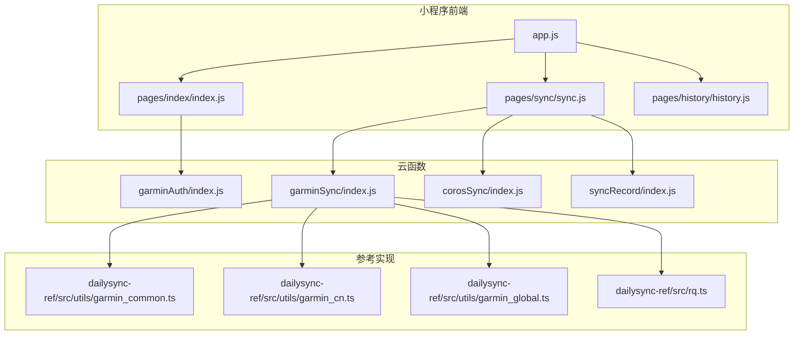
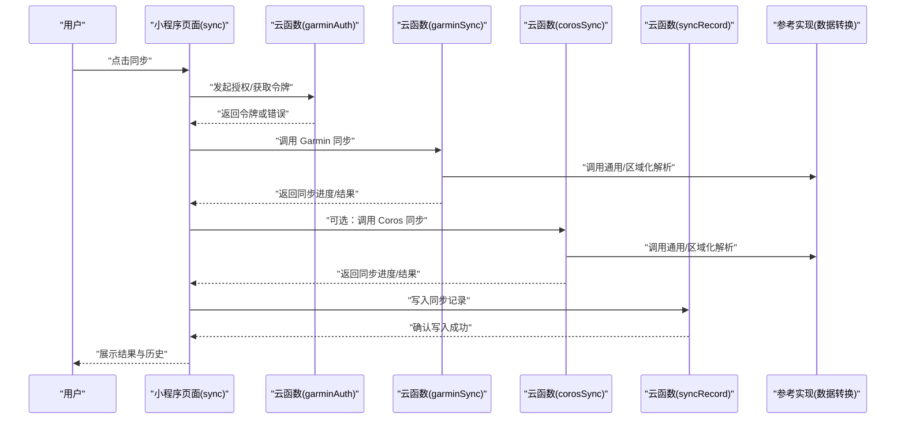
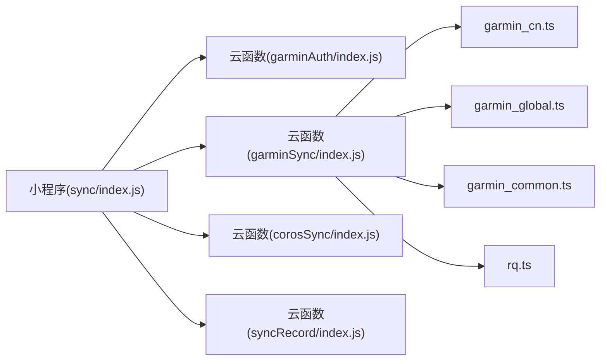

# 调试与测试指南

<cite>
**本文档引用的文件**   
- [README.md](file://README.md)
- [project.config.json](file://project.config.json)
- [miniprogram/app.js](file://miniprogram/app.js)
- [miniprogram/app.json](file://miniprogram/app.json)
- [miniprogram/pages/index/index.js](file://miniprogram/pages/index/index.js)
- [miniprogram/pages/sync/sync.js](file://miniprogram/pages/sync/sync.js)
- [miniprogram/pages/history/history.js](file://miniprogram/pages/history/history.js)
- [cloudfunctions/garminAuth/index.js](file://cloudfunctions/garminAuth/index.js)
- [cloudfunctions/garminSync/index.js](file://cloudfunctions/garminSync/index.js)
- [cloudfunctions/corosSync/index.js](file://cloudfunctions/corosSync/index.js)
- [cloudfunctions/syncRecord/index.js](file://cloudfunctions/syncRecord/index.js)
- [dailysync-ref/src/utils/garmin_common.ts](file://dailysync-ref/src/utils/garmin_common.ts)
- [dailysync-ref/src/utils/garmin_cn.ts](file://dailysync-ref/src/utils/garmin_cn.ts)
- [dailysync-ref/src/utils/garmin_global.ts](file://dailysync-ref/src/utils/garmin_global.ts)
- [dailysync-ref/src/rq.ts](file://dailysync-ref/src/rq.ts)
</cite>

## 目录
1. [简介](#简介)
2. [项目结构](#项目结构)
3. [核心组件](#核心组件)
4. [架构总览](#架构总览)
5. [详细组件分析](#详细组件分析)
6. [依赖关系分析](#依赖关系分析)
7. [性能考虑](#性能考虑)
8. [故障排除指南](#故障排除指南)
9. [结论](#结论)
10. [附录](#附录)

## 简介
本指南面向微信小程序与云函数协同的“Garmin/Coros 数据同步”项目，提供系统化的调试与测试方法。内容覆盖：
- 小程序开发者工具的调试技巧（网络请求、本地存储、日志）
- 云函数的调试方法（本地模拟、日志查看、错误排查）
- 数据同步功能的测试策略（单元、集成、端到端）
- Garmin 数据同步流程测试（API 调用模拟、数据验证、异常处理）
- 性能分析与优化建议
- 常见调试场景与排障步骤

## 项目结构
本项目由三大部分组成：
- 小程序前端（miniprogram）：页面与交互逻辑
- 云函数（cloudfunctions）：认证、同步、记录等后端能力
- 参考实现（dailysync-ref）：TypeScript 实现的 Garmin 数据同步工具链（用于理解数据模型与转换逻辑）

图表来源
- [miniprogram/app.js](file://miniprogram/app.js)
- [miniprogram/pages/index/index.js](file://miniprogram/pages/index/index.js)
- [miniprogram/pages/sync/sync.js](file://miniprogram/pages/sync/sync.js)
- [miniprogram/pages/history/history.js](file://miniprogram/pages/history/history.js)
- [cloudfunctions/garminAuth/index.js](file://cloudfunctions/garminAuth/index.js)
- [cloudfunctions/garminSync/index.js](file://cloudfunctions/garminSync/index.js)
- [cloudfunctions/corosSync/index.js](file://cloudfunctions/corosSync/index.js)
- [cloudfunctions/syncRecord/index.js](file://cloudfunctions/syncRecord/index.js)
- [dailysync-ref/src/utils/garmin_common.ts](file://dailysync-ref/src/utils/garmin_common.ts)
- [dailysync-ref/src/utils/garmin_cn.ts](file://dailysync-ref/src/utils/garmin_cn.ts)
- [dailysync-ref/src/utils/garmin_global.ts](file://dailysync-ref/src/utils/garmin_global.ts)
- [dailysync-ref/src/rq.ts](file://dailysync-ref/src/rq.ts)

章节来源
- [README.md](file://README.md)
- [project.config.json](file://project.config.json)

## 核心组件
- 小程序入口与路由
  - app.js：应用初始化、全局配置、插件或云能力接入
  - app.json：页面路由、窗口样式、分包与权限声明
- 关键页面
  - index：首页，展示概览与入口
  - sync：触发并监控 Garmin/Coros 数据同步任务
  - history：查看历史同步结果与记录
- 云函数
  - garminAuth：负责 Garmin 账号授权与令牌管理
  - garminSync：拉取 Garmin 数据并进行转换、入库
  - corosSync：拉取 Coros 数据并进行转换、入库
  - syncRecord：持久化同步记录，便于查询与审计

章节来源
- [miniprogram/app.js](file://miniprogram/app.js)
- [miniprogram/app.json](file://miniprogram/app.json)
- [miniprogram/pages/index/index.js](file://miniprogram/pages/index/index.js)
- [miniprogram/pages/sync/sync.js](file://miniprogram/pages/sync/sync.js)
- [miniprogram/pages/history/history.js](file://miniprogram/pages/history/history.js)
- [cloudfunctions/garminAuth/index.js](file://cloudfunctions/garminAuth/index.js)
- [cloudfunctions/garminSync/index.js](file://cloudfunctions/garminSync/index.js)
- [cloudfunctions/corosSync/index.js](file://cloudfunctions/corosSync/index.js)
- [cloudfunctions/syncRecord/index.js](file://cloudfunctions/syncRecord/index.js)

## 架构总览
小程序通过云函数调用完成 Garmin/Coros 数据的认证与同步，参考实现提供了数据字段映射与计算逻辑（如 Running Quotient）。整体链路如下：

图表来源
- [miniprogram/pages/sync/sync.js](file://miniprogram/pages/sync/sync.js)
- [cloudfunctions/garminAuth/index.js](file://cloudfunctions/garminAuth/index.js)
- [cloudfunctions/garminSync/index.js](file://cloudfunctions/garminSync/index.js)
- [cloudfunctions/corosSync/index.js](file://cloudfunctions/corosSync/index.js)
- [cloudfunctions/syncRecord/index.js](file://cloudfunctions/syncRecord/index.js)
- [dailysync-ref/src/utils/garmin_common.ts](file://dailysync-ref/src/utils/garmin_common.ts)
- [dailysync-ref/src/utils/garmin_cn.ts](file://dailysync-ref/src/utils/garmin_cn.ts)
- [dailysync-ref/src/utils/garmin_global.ts](file://dailysync-ref/src/utils/garmin_global.ts)
- [dailysync-ref/src/rq.ts](file://dailysync-ref/src/rq.ts)

## 详细组件分析

### 小程序调试技巧
- 开发者工具基础
  - 控制台：打印日志、执行表达式、查看堆栈
  - 网络面板：过滤、重放、修改请求头/参数、模拟延迟
  - 存储面板：查看/编辑 Storage、Cloud Database、IndexedDB
  - AppData：实时观察页面数据变化
  - 真机调试：开启远程调试，捕获真实设备问题
- 网络请求调试
  - 使用 wx.request 或云开发 API 时，在 Network 面板定位失败原因（超时、鉴权失败、跨域、限流）
  - 对第三方 API（Garmin/Coros）可借助 Mock 或代理进行断点与回放
- 本地存储调试
  - 检查 key/value 是否按预期写入；注意过期时间与序列化格式
  - 清理脏数据后重试，避免缓存污染
- 常见问题
  - 云函数调用失败：检查环境 ID、函数名、权限与日志
  - 跨域与域名白名单：确保已配置合法域名
  - 包体积过大导致加载慢：启用分包与按需加载

章节来源
- [miniprogram/app.js](file://miniprogram/app.js)
- [miniprogram/app.json](file://miniprogram/app.json)
- [miniprogram/pages/sync/sync.js](file://miniprogram/pages/sync/sync.js)

### 云函数调试方法
- 本地模拟
  - 使用微信开发者工具的“云开发”本地运行模式，安装依赖后直接启动
  - 准备最小输入样例，覆盖正常与异常分支
- 日志查看
  - 云端日志：根据时间范围筛选，关注错误堆栈与耗时
  - 本地日志：结合 console.log 输出关键路径与中间变量
- 错误排查
  - 鉴权失败：检查签名、密钥、环境变量
  - 第三方接口限流：增加重试与退避策略
  - 数据库写入失败：检查事务、索引与约束

章节来源
- [cloudfunctions/garminAuth/index.js](file://cloudfunctions/garminAuth/index.js)
- [cloudfunctions/garminSync/index.js](file://cloudfunctions/garminSync/index.js)
- [cloudfunctions/corosSync/index.js](file://cloudfunctions/corosSync/index.js)
- [cloudfunctions/syncRecord/index.js](file://cloudfunctions/syncRecord/index.js)

### 数据同步测试策略
- 单元测试
  - 针对数据转换与校验逻辑编写用例（字段映射、单位换算、边界值）
  - 使用 dailysync-ref 中的解析模块作为被测对象，构造样本输入
- 集成测试
  - 模拟第三方 API 响应（成功、部分成功、失败、限流），验证云函数行为
  - 验证数据库写入与回读一致性
- 端到端测试
  - 从小程序触发同步，到云函数执行、落库、前端展示的全链路验证
  - 覆盖多账号、多地区（CN/GLOBAL）、多设备类型（Garmin/Coros）

章节来源
- [dailysync-ref/src/utils/garmin_common.ts](file://dailysync-ref/src/utils/garmin_common.ts)
- [dailysync-ref/src/utils/garmin_cn.ts](file://dailysync-ref/src/utils/garmin_cn.ts)
- [dailysync-ref/src/utils/garmin_global.ts](file://dailysync-ref/src/utils/garmin_global.ts)
- [dailysync-ref/src/rq.ts](file://dailysync-ref/src/rq.ts)

### Garmin 数据同步流程测试
- API 调用模拟
  - 使用 Mock 服务或本地拦截器返回固定响应集（含分页、空数据、错误码）
  - 覆盖不同国家站点（CN/GLOBAL）的差异字段
- 数据验证
  - 关键字段非空、数值范围合理、时间戳顺序正确
  - 计算指标（如 Running Quotient）与参考实现一致
- 异常处理
  - 网络超时、鉴权失效、数据不完整、第三方限流
  - 重试策略与幂等性保证（去重、补偿）

章节来源
- [cloudfunctions/garminSync/index.js](file://cloudfunctions/garminSync/index.js)
- [dailysync-ref/src/utils/garmin_common.ts](file://dailysync-ref/src/utils/garmin_common.ts)
- [dailysync-ref/src/utils/garmin_cn.ts](file://dailysync-ref/src/utils/garmin_cn.ts)
- [dailysync-ref/src/utils/garmin_global.ts](file://dailysync-ref/src/utils/garmin_global.ts)
- [dailysync-ref/src/rq.ts](file://dailysync-ref/src/rq.ts)

### 同步记录与审计
- 记录维度
  - 任务 ID、开始/结束时间、状态、数据来源、条目数、错误信息
- 查询与导出
  - 支持按时间、状态、来源筛选；必要时导出 CSV/JSON
- 回溯与修复
  - 基于记录定位失败批次，触发增量补跑

章节来源
- [cloudfunctions/syncRecord/index.js](file://cloudfunctions/syncRecord/index.js)

## 依赖关系分析
- 小程序依赖云函数提供的认证与同步能力
- 云函数依赖参考实现的数据解析与计算模块
- 外部依赖包括 Garmin/Coros 开放 API、数据库与对象存储

图表来源
- [miniprogram/pages/sync/sync.js](file://miniprogram/pages/sync/sync.js)
- [cloudfunctions/garminAuth/index.js](file://cloudfunctions/garminAuth/index.js)
- [cloudfunctions/garminSync/index.js](file://cloudfunctions/garminSync/index.js)
- [cloudfunctions/corosSync/index.js](file://cloudfunctions/corosSync/index.js)
- [cloudfunctions/syncRecord/index.js](file://cloudfunctions/syncRecord/index.js)
- [dailysync-ref/src/utils/garmin_common.ts](file://dailysync-ref/src/utils/garmin_common.ts)
- [dailysync-ref/src/utils/garmin_cn.ts](file://dailysync-ref/src/utils/garmin_cn.ts)
- [dailysync-ref/src/utils/garmin_global.ts](file://dailysync-ref/src/utils/garmin_global.ts)
- [dailysync-ref/src/rq.ts](file://dailysync-ref/src/rq.ts)

## 性能考虑
- 小程序侧
  - 减少不必要的 setData 与频繁渲染，合并更新
  - 列表虚拟化与分页加载，避免一次性渲染大量数据
  - 图片与资源懒加载，合理使用缓存
- 云函数侧
  - 批量操作与并发控制，避免单条循环导致的超时
  - 数据库查询加索引，避免全表扫描
  - 对第三方 API 做连接池与重试退避
- 数据侧
  - 只传输必要字段，压缩 payload
  - 冷热数据分离，归档历史数据

[本节为通用指导，不直接分析具体文件]

## 故障排除指南
- 云函数调用失败
  - 检查环境 ID、函数名、权限与日志
  - 复现最小用例，逐步缩小范围
- 第三方 API 限流或不可用
  - 增加指数退避重试与熔断
  - 降级策略：缓存上次成功数据，提示用户稍后重试
- 数据不一致
  - 对比参考实现解析结果，定位差异字段
  - 增加断言与校验，失败即中止并记录
- 存储异常
  - 清理无效缓存，恢复默认值
  - 检查容量与配额限制

章节来源
- [cloudfunctions/garminSync/index.js](file://cloudfunctions/garminSync/index.js)
- [cloudfunctions/syncRecord/index.js](file://cloudfunctions/syncRecord/index.js)

## 结论
通过系统化的调试与测试方法，结合小程序开发者工具与云函数本地模拟，配合参考实现的数据解析逻辑，可有效保障 Garmin/Coros 数据同步的稳定性与准确性。建议在持续集成中引入自动化测试与性能基准，持续提升质量与效率。

## 附录
- 常用命令与环境
  - 本地运行云函数：安装依赖后在 cloudfunctions 目录下启动
  - 小程序预览与真机调试：在开发者工具中选择对应环境与端口
- 测试数据准备
  - 使用 dailysync-ref 的示例数据构造输入
  - 覆盖 CN/GLOBAL 站点差异与边界条件
- 监控与告警
  - 设置云函数错误率与耗时阈值告警
  - 定期巡检同步记录，发现异常及时干预

[本节为补充说明，不直接分析具体文件]