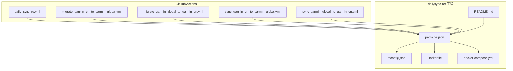
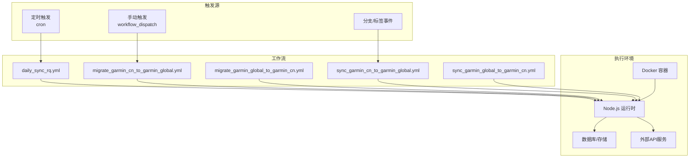
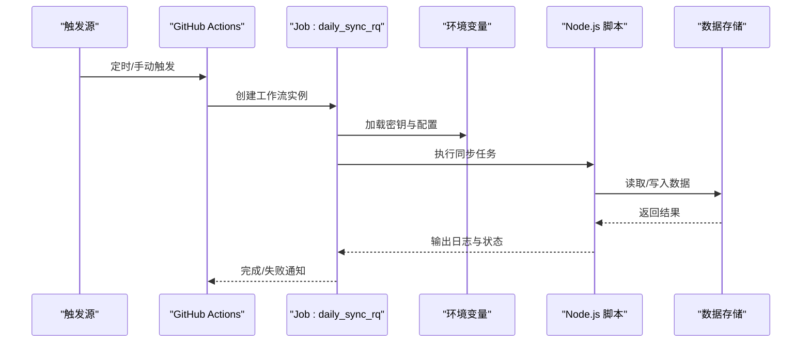
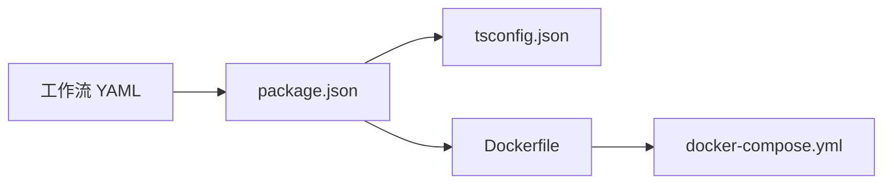

# CI/CD流水线

<cite>
**本文引用的文件**   
- [daily_sync_rq.yml](file://dailysync-ref/.github/workflows/daily_sync_rq.yml)
- [migrate_garmin_cn_to_garmin_global.yml](file://dailysync-ref/.github/workflows/migrate_garmin_cn_to_garmin_global.yml)
- [migrate_garmin_global_to_garmin_cn.yml](file://dailysync-ref/.github/workflows/migrate_garmin_global_to_garmin_cn.yml)
- [sync_garmin_cn_to_garmin_global.yml](file://dailysync-ref/.github/workflows/sync_garmin_cn_to_garmin_global.yml)
- [sync_garmin_global_to_garmin_cn.yml](file://dailysync-ref/.github/workflows/sync_garmin_global_to_garmin_cn.yml)
- [package.json](file://dailysync-ref/package.json)
- [tsconfig.json](file://dailysync-ref/tsconfig.json)
- [Dockerfile](file://dailysync-ref/Dockerfile)
- [docker-compose.yml](file://dailysync-ref/docker-compose.yml)
- [README.md](file://dailysync-ref/README.md)
</cite>

## 目录
1. [简介](#简介)
2. [项目结构](#项目结构)
3. [核心组件](#核心组件)
4. [架构总览](#架构总览)
5. [详细组件分析](#详细组件分析)
6. [依赖关系分析](#依赖关系分析)
7. [性能考虑](#性能考虑)
8. [故障排查指南](#故障排查指南)
9. [结论](#结论)
10. [附录](#附录)

## 简介
本指南面向使用 GitHub Actions 的 CI/CD 流水线，覆盖每日同步任务、数据迁移任务与双向同步任务的触发条件、执行逻辑与环境变量配置。同时提供自定义工作流的编写方法（任务编排、错误处理、通知机制）、监控调试（日志查看、失败重试、性能分析）以及最佳实践与安全考虑（密钥管理、权限控制、审计日志）。读者无需深入代码细节即可快速上手与维护流水线。

## 项目结构
仓库中 GitHub Actions 的工作流定义位于 dailysync-ref/.github/workflows 目录下，包含以下关键工作流：
- 每日跑步配额（Running Quotient）同步任务
- Garmin CN 与 Garmin Global 之间的数据迁移任务（双向）
- Garmin CN 与 Garmin Global 之间的数据双向同步任务（双向）

此外，dailysync-ref 目录提供了运行这些任务所需的环境与工具链：
- package.json：Node.js 依赖与脚本入口
- tsconfig.json：TypeScript 编译配置
- Dockerfile 与 docker-compose.yml：容器化运行与本地调试支持
- README.md：使用说明与上下文信息

图表来源
- [daily_sync_rq.yml](file://dailysync-ref/.github/workflows/daily_sync_rq.yml)
- [migrate_garmin_cn_to_garmin_global.yml](file://dailysync-ref/.github/workflows/migrate_garmin_cn_to_garmin_global.yml)
- [migrate_garmin_global_to_garmin_cn.yml](file://dailysync-ref/.github/workflows/migrate_garmin_global_to_garmin_cn.yml)
- [sync_garmin_cn_to_garmin_global.yml](file://dailysync-ref/.github/workflows/sync_garmin_cn_to_garmin_global.yml)
- [sync_garmin_global_to_garmin_cn.yml](file://dailysync-ref/.github/workflows/sync_garmin_global_to_garmin_cn.yml)
- [package.json](file://dailysync-ref/package.json)
- [tsconfig.json](file://dailysync-ref/tsconfig.json)
- [Dockerfile](file://dailysync-ref/Dockerfile)
- [docker-compose.yml](file://dailysync-ref/docker-compose.yml)
- [README.md](file://dailysync-ref/README.md)

章节来源
- [README.md](file://dailysync-ref/README.md)

## 核心组件
- 工作流定义（YAML）：每个 .yml 文件对应一个独立的任务流程，包括触发器、环境变量、作业步骤、缓存策略、错误处理与通知。
- Node.js 工程（package.json）：声明依赖与脚本命令，供工作流在执行阶段调用。
- TypeScript 配置（tsconfig.json）：确保在 CI 环境中正确编译与运行 TS 源码。
- 容器化（Dockerfile/docker-compose.yml）：用于本地或外部环境复现 CI 行为，便于调试与性能分析。

章节来源
- [package.json](file://dailysync-ref/package.json)
- [tsconfig.json](file://dailysync-ref/tsconfig.json)
- [Dockerfile](file://dailysync-ref/Dockerfile)
- [docker-compose.yml](file://dailysync-ref/docker-compose.yml)

## 架构总览
下图展示了各工作流与工程模块之间的关系，以及典型的数据流向。工作流通过 Node.js 脚本驱动数据同步与迁移，必要时借助数据库或外部服务（如 Google Sheets、Strava、Garmin 等），并通过环境变量注入敏感信息与运行时参数。

图表来源
- [daily_sync_rq.yml](file://dailysync-ref/.github/workflows/daily_sync_rq.yml)
- [migrate_garmin_cn_to_garmin_global.yml](file://dailysync-ref/.github/workflows/migrate_garmin_cn_to_garmin_global.yml)
- [migrate_garmin_global_to_garmin_cn.yml](file://dailysync-ref/.github/workflows/migrate_garmin_global_to_garmin_cn.yml)
- [sync_garmin_cn_to_garmin_global.yml](file://dailysync-ref/.github/workflows/sync_garmin_cn_to_garmin_global.yml)
- [sync_garmin_global_to_garmin_cn.yml](file://dailysync-ref/.github/workflows/sync_garmin_global_to_garmin_cn.yml)
- [package.json](file://dailysync-ref/package.json)
- [Dockerfile](file://dailysync-ref/Dockerfile)

## 详细组件分析

### 每日跑步配额（Running Quotient）同步工作流
- 作用：按日定时拉取并计算 Running Quotient 相关数据，更新目标存储。
- 触发条件：通常由 cron 表达式触发，也可通过 workflow_dispatch 手动触发。
- 执行逻辑：
  - 初始化 Node.js 环境与依赖
  - 读取环境变量（如 API Key、数据库连接串、时间范围等）
  - 执行同步脚本，写入结果到数据库或外部服务
  - 记录日志与指标，失败时发送通知
- 缓存策略：缓存 node_modules 与构建产物，加速后续运行
- 错误处理：设置 continue-on-error 或 step-level 失败处理，结合通知渠道告警

章节来源
- [daily_sync_rq.yml](file://dailysync-ref/.github/workflows/daily_sync_rq.yml)
- [package.json](file://dailysync-ref/package.json)

### 数据迁移工作流（Garmin CN ↔ Garmin Global）
- 作用：将 Garmin CN 与 Garmin Global 之间的数据进行单向迁移，分别提供两个方向的工作流。
- 触发条件：可通过 workflow_dispatch 手动触发，或在特定分支/标签事件后自动触发。
- 执行逻辑：
  - 准备环境（安装依赖、加载配置）
  - 读取迁移参数（源/目标库、映射规则、过滤条件）
  - 执行迁移脚本，校验数据一致性
  - 输出迁移报告，失败时回滚或标记不一致项
- 缓存策略：缓存依赖与中间数据，减少重复下载与计算
- 错误处理：分步检查点与断点续传，失败重试与告警

章节来源
- [migrate_garmin_cn_to_garmin_global.yml](file://dailysync-ref/.github/workflows/migrate_garmin_cn_to_garmin_global.yml)
- [migrate_garmin_global_to_garmin_cn.yml](file://dailysync-ref/.github/workflows/migrate_garmin_global_to_garmin_cn.yml)
- [package.json](file://dailysync-ref/package.json)

### 双向同步工作流（Garmin CN ↔ Garmin Global）
- 作用：实现 Garmin CN 与 Garmin Global 的双向数据同步，保持两端一致。
- 触发条件：可定时触发或事件触发，支持增量同步模式。
- 执行逻辑：
  - 检测变更集（基于时间戳或版本号）
  - 计算差异并生成同步计划
  - 执行同步任务，处理冲突与幂等性
  - 生成同步报告与审计日志
- 缓存策略：缓存差异结果与元数据，提升增量效率
- 错误处理：冲突解决策略、重试与补偿事务

章节来源
- [sync_garmin_cn_to_garmin_global.yml](file://dailysync-ref/.github/workflows/sync_garmin_cn_to_garmin_global.yml)
- [sync_garmin_global_to_garmin_cn.yml](file://dailysync-ref/.github/workflows/sync_garmin_global_to_garmin_cn.yml)
- [package.json](file://dailysync-ref/package.json)

### 工作流序列图（以每日同步为例）

图表来源
- [daily_sync_rq.yml](file://dailysync-ref/.github/workflows/daily_sync_rq.yml)
- [package.json](file://dailysync-ref/package.json)

## 依赖关系分析
- 工作流与脚本：每个 .yml 工作流通过 Node.js 脚本驱动业务逻辑，依赖 package.json 中的依赖与脚本命令。
- 类型系统与编译：tsconfig.json 确保 TypeScript 源码在 CI 环境中正确编译与运行。
- 容器化：Dockerfile 与 docker-compose.yml 提供一致的运行环境，便于本地调试与性能分析。

图表来源
- [package.json](file://dailysync-ref/package.json)
- [tsconfig.json](file://dailysync-ref/tsconfig.json)
- [Dockerfile](file://dailysync-ref/Dockerfile)
- [docker-compose.yml](file://dailysync-ref/docker-compose.yml)

章节来源
- [package.json](file://dailysync-ref/package.json)
- [tsconfig.json](file://dailysync-ref/tsconfig.json)
- [Dockerfile](file://dailysync-ref/Dockerfile)
- [docker-compose.yml](file://dailysync-ref/docker-compose.yml)

## 性能考虑
- 依赖缓存：缓存 node_modules 与构建产物，显著缩短安装与编译时间。
- 增量同步：基于时间戳或版本号的差异检测，避免全量同步带来的开销。
- 并行作业：将相互独立的步骤并行执行，提高整体吞吐。
- 资源限制：合理设置 runner 规格与超时时间，避免资源争用与超时失败。
- 日志优化：仅输出必要日志，避免大体积日志影响 IO 与传输。

[本节为通用指导，不直接分析具体文件]

## 故障排查指南
- 日志查看：在 GitHub Actions 页面查看各步骤的输出日志，定位失败原因。
- 失败重试：对易失败的步骤启用重试策略，或在工作流级别设置 continue-on-error。
- 环境变量检查：确认密钥与配置是否正确注入，避免空值或格式错误。
- 依赖问题：清理缓存并重新安装依赖，确保版本一致。
- 网络与服务：检查外部 API 可达性与限流策略，必要时增加退避重试。
- 容器调试：使用 docker-compose 本地复现问题，逐步缩小范围。

章节来源
- [daily_sync_rq.yml](file://dailysync-ref/.github/workflows/daily_sync_rq.yml)
- [migrate_garmin_cn_to_garmin_global.yml](file://dailysync-ref/.github/workflows/migrate_garmin_cn_to_garmin_global.yml)
- [migrate_garmin_global_to_garmin_cn.yml](file://dailysync-ref/.github/workflows/migrate_garmin_global_to_garmin_cn.yml)
- [sync_garmin_cn_to_garmin_global.yml](file://dailysync-ref/.github/workflows/sync_garmin_cn_to_garmin_global.yml)
- [sync_garmin_global_to_garmin_cn.yml](file://dailysync-ref/.github/workflows/sync_garmin_global_to_garmin_cn.yml)

## 结论
通过合理的触发条件、环境变量管理、依赖与缓存策略、错误处理与通知机制，GitHub Actions 能够为数据同步与迁移提供稳定高效的 CI/CD 流水线。遵循最佳实践与安全考虑，可进一步提升系统的可靠性与可维护性。

[本节为总结性内容，不直接分析具体文件]

## 附录

### 环境变量配置建议
- 密钥管理：使用 GitHub Secrets 存储敏感信息，避免硬编码。
- 配置分离：将不同环境的配置拆分为独立变量，便于切换与审计。
- 最小权限：仅授予必要的访问权限，降低泄露风险。

### 自定义工作流编写方法
- 任务编排：使用 steps 组织任务顺序，利用 needs 指定依赖关系。
- 错误处理：设置 continue-on-error、retry 与通知回调。
- 通知机制：集成邮件、Slack、企业微信等渠道，及时告警。

### 监控与调试
- 日志分析：集中收集与分析日志，建立告警阈值。
- 失败重试：对幂等操作启用自动重试，非幂等操作需人工介入。
- 性能分析：采集关键指标（耗时、内存、IO），定位瓶颈。

### 安全与合规
- 密钥轮换：定期更换密钥，限制有效期。
- 审计日志：记录所有关键操作，满足合规要求。
- 权限控制：基于角色与分支限制工作流执行权限。

[本节为通用指导，不直接分析具体文件]