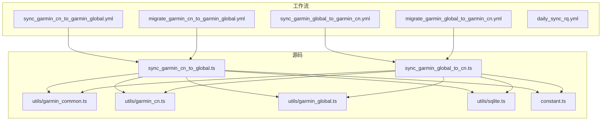
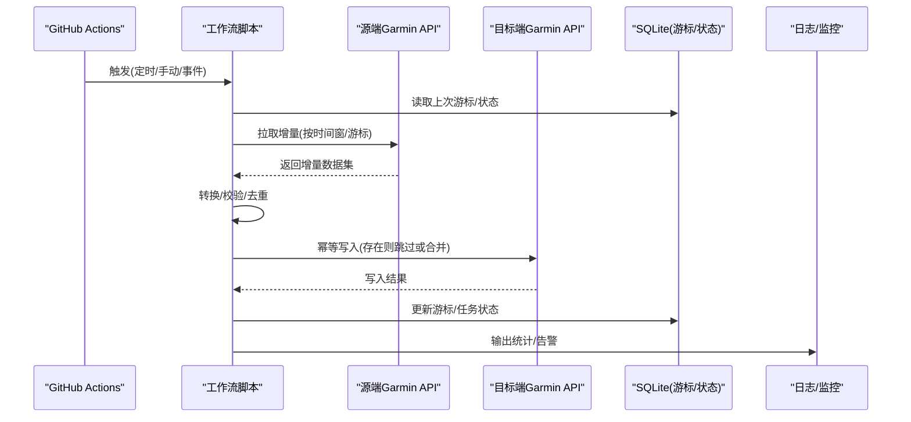
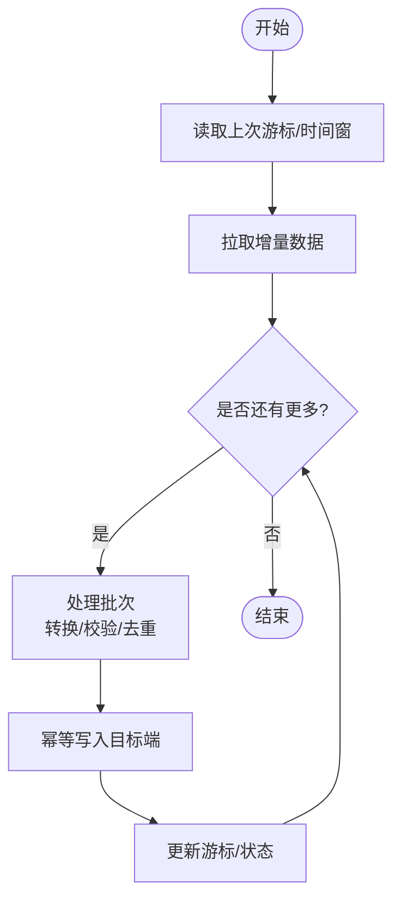
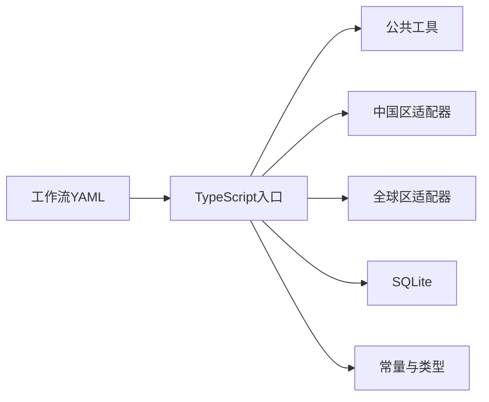

# Garmin数据同步工作流

<cite>
**本文引用的文件**   
- [sync_garmin_cn_to_garmin_global.yml](file://dailysync-ref/.github/workflows/sync_garmin_cn_to_garmin_global.yml)
- [sync_garmin_global_to_garmin_cn.yml](file://dailysync-ref/.github/workflows/sync_garmin_global_to_garmin_cn.yml)
- [migrate_garmin_cn_to_garmin_global.yml](file://dailysync-ref/.github/workflows/migrate_garmin_cn_to_garmin_global.yml)
- [migrate_garmin_global_to_garmin_cn.yml](file://dailysync-ref/.github/workflows/migrate_garmin_global_to_garmin_cn.yml)
- [daily_sync_rq.yml](file://dailysync-ref/.github/workflows/daily_sync_rq.yml)
- [sync_garmin_cn_to_global.ts](file://dailysync-ref/src/sync_garmin_cn_to_global.ts)
- [sync_garmin_global_to_cn.ts](file://dailysync-ref/src/sync_garmin_global_to_cn.ts)
- [garmin_common.ts](file://dailysync-ref/src/utils/garmin_common.ts)
- [garmin_cn.ts](file://dailysync-ref/src/utils/garmin_cn.ts)
- [garmin_global.ts](file://dailysync-ref/src/utils/garmin_global.ts)
- [sqlite.ts](file://dailysync-ref/src/utils/sqlite.ts)
- [constant.ts](file://dailysync-ref/src/constant.ts)
- [package.json](file://dailysync-ref/package.json)
- [docker-compose.yml](file://dailysync-ref/docker-compose.yml)
</cite>

## 目录
1. [简介](#简介)
2. [项目结构](#项目结构)
3. [核心组件](#核心组件)
4. [架构总览](#架构总览)
5. [详细组件分析](#详细组件分析)
6. [依赖关系分析](#依赖关系分析)
7. [性能考虑](#性能考虑)
8. [故障排查指南](#故障排查指南)
9. [结论](#结论)
10. [附录](#附录)

## 简介
本文件面向Garmin数据实时同步工作流，围绕以下两个GitHub Actions工作流展开：
- sync_garmin_cn_to_garmin_global.yml：将中国区Garmin数据增量同步至全球区。
- sync_garmin_global_to_garmin_cn.yml：将全球区Garmin数据增量同步至中国区。

文档涵盖：
- 工作流配置与触发条件（定时、手动触发、分支事件等）
- 增量同步算法设计（基于时间戳/游标/去重键的幂等更新）
- 冲突解决策略（以源端为权威、字段级合并、版本号控制）
- 数据一致性保证（事务、幂等写入、校验与回滚）
- 同步频率设置与网络超时处理
- 同步状态监控、断点续传机制、异常恢复策略
- 性能调优、带宽控制、并发处理最佳实践

## 项目结构
仓库采用“工作流 + TypeScript实现”的分层组织：
- .github/workflows：定义CI/CD工作流，包含两个双向同步工作流及迁移工作流。
- src：同步逻辑的核心实现，按方向拆分入口文件，并封装通用工具。
- utils：封装各区域API适配、SQLite持久化、常量与类型定义。
- 其他：Docker编排、包管理、示例数据等。

图表来源
- [sync_garmin_cn_to_garmin_global.yml](file://dailysync-ref/.github/workflows/sync_garmin_cn_to_garmin_global.yml)
- [sync_garmin_global_to_garmin_cn.yml](file://dailysync-ref/.github/workflows/sync_garmin_global_to_garmin_cn.yml)
- [sync_garmin_cn_to_global.ts](file://dailysync-ref/src/sync_garmin_cn_to_global.ts)
- [sync_garmin_global_to_cn.ts](file://dailysync-ref/src/sync_garmin_global_to_cn.ts)
- [garmin_common.ts](file://dailysync-ref/src/utils/garmin_common.ts)
- [garmin_cn.ts](file://dailysync-ref/src/utils/garmin_cn.ts)
- [garmin_global.ts](file://dailysync-ref/src/utils/garmin_global.ts)
- [sqlite.ts](file://dailysync-ref/src/utils/sqlite.ts)
- [constant.ts](file://dailysync-ref/src/constant.ts)

章节来源
- [package.json](file://dailysync-ref/package.json)
- [docker-compose.yml](file://dailysync-ref/docker-compose.yml)

## 核心组件
- 工作流编排器：定义触发条件、环境变量、步骤顺序、缓存与重试策略。
- 同步入口：按方向提供主函数，负责拉取、转换、落库、上报状态。
- 区域适配器：分别对接中国区与全球区Garmin API，屏蔽差异。
- 公共能力：日志、错误码、分页、重试、鉴权、校验。
- 持久化：SQLite用于记录游标、去重键、任务状态与审计日志。
- 常量与类型：统一字段映射、枚举、阈值与默认值。

章节来源
- [sync_garmin_cn_to_global.ts](file://dailysync-ref/src/sync_garmin_cn_to_global.ts)
- [sync_garmin_global_to_cn.ts](file://dailysync-ref/src/sync_garmin_global_to_cn.ts)
- [garmin_common.ts](file://dailysync-ref/src/utils/garmin_common.ts)
- [garmin_cn.ts](file://dailysync-ref/src/utils/garmin_cn.ts)
- [garmin_global.ts](file://dailysync-ref/src/utils/utils/garmin_global.ts)
- [sqlite.ts](file://dailysync-ref/src/utils/sqlite.ts)
- [constant.ts](file://dailysync-ref/src/constant.ts)

## 架构总览
整体流程遵循“工作流触发 -> 拉取源端增量 -> 转换与校验 -> 目标端幂等写入 -> 状态与游标更新”的闭环。

图表来源
- [sync_garmin_cn_to_garmin_global.yml](file://dailysync-ref/.github/workflows/sync_garmin_cn_to_garmin_global.yml)
- [sync_garmin_global_to_garmin_cn.yml](file://dailysync-ref/.github/workflows/sync_garmin_global_to_garmin_cn.yml)
- [sync_garmin_cn_to_global.ts](file://dailysync-ref/src/sync_garmin_cn_to_global.ts)
- [sync_garmin_global_to_cn.ts](file://dailysync-ref/src/sync_garmin_global_to_cn.ts)
- [sqlite.ts](file://dailysync-ref/src/utils/sqlite.ts)

## 详细组件分析

### 工作流：中国到全球同步
- 触发条件：支持定时调度、手动触发、特定分支推送事件。
- 环境准备：安装依赖、加载密钥、初始化数据库。
- 执行步骤：调用同步入口脚本，传入方向参数与窗口参数。
- 失败重试：对关键步骤配置重试次数与退避策略。
- 状态上报：输出成功/失败计数、耗时、游标位置。

章节来源
- [sync_garmin_cn_to_garmin_global.yml](file://dailysync-ref/.github/workflows/sync_garmin_cn_to_garmin_global.yml)

### 工作流：全球到中国同步
- 触发条件：同中国到全球，可独立配置频率。
- 差异化配置：针对目标端速率限制与字段差异进行参数调整。
- 资源隔离：通过并发度与批大小控制资源占用。

章节来源
- [sync_garmin_global_to_garmin_cn.yml](file://dailysync-ref/.github/workflows/sync_garmin_global_to_garmin_cn.yml)

### 同步入口：中国到全球
- 职责：解析参数、读取游标、拉取增量、转换映射、批量写入、更新游标。
- 增量策略：基于更新时间戳或游标偏移，避免全量扫描。
- 幂等写入：使用唯一键判断是否存在，存在则走合并或跳过。
- 错误处理：捕获网络/业务异常，记录上下文，支持重试。

章节来源
- [sync_garmin_cn_to_global.ts](file://dailysync-ref/src/sync_garmin_cn_to_global.ts)

### 同步入口：全球到中国
- 职责：与上述对称，但字段映射与校验规则不同。
- 兼容性：处理区域差异导致的字段缺失或类型不一致。
- 回滚策略：在批量写入失败时回滚未提交的事务。

章节来源
- [sync_garmin_global_to_cn.ts](file://dailysync-ref/src/sync_garmin_global_to_cn.ts)

### 公共工具：通用能力
- 鉴权与会话：统一获取访问令牌、刷新策略。
- 分页与限流：封装分页请求、速率限制与退避。
- 日志与指标：结构化日志、关键指标采集。
- 校验与转换：字段映射、类型转换、空值处理。

章节来源
- [garmin_common.ts](file://dailysync-ref/src/utils/garmin_common.ts)

### 区域适配器：中国区与全球区
- 接口抽象：统一的拉取/写入接口，屏蔽区域差异。
- 差异处理：字段名、枚举值、必填项、时间格式等。
- 测试用例：覆盖常见边界场景与异常路径。

章节来源
- [garmin_cn.ts](file://dailysync-ref/src/utils/garmin_cn.ts)
- [garmin_global.ts](file://dailysync-ref/src/utils/garmin_global.ts)

### 持久化：SQLite
- 游标表：记录上次同步时间/偏移，支持断点续传。
- 任务表：记录批次ID、状态、重试次数、错误信息。
- 审计日志：记录关键操作与变更摘要。
- 事务控制：确保写入原子性与一致性。

章节来源
- [sqlite.ts](file://dailysync-ref/src/utils/sqlite.ts)

### 常量与类型
- 枚举：同步方向、状态码、错误码。
- 阈值：超时、重试次数、批大小、并发度。
- 映射：字段映射表、默认值、校验规则。

章节来源
- [constant.ts](file://dailysync-ref/src/constant.ts)

### 概念性流程图：增量同步算法

[本图为概念性流程，不直接映射具体代码文件]

## 依赖关系分析
- 工作流依赖TypeScript运行时与依赖包，由package.json声明。
- 同步入口依赖区域适配器与公共工具，形成单向依赖。
- SQLite作为本地持久化存储，被所有同步入口共享。
- Docker编排用于本地开发与测试环境一致性。

图表来源
- [package.json](file://dailysync-ref/package.json)
- [docker-compose.yml](file://dailysync-ref/docker-compose.yml)
- [sync_garmin_cn_to_global.ts](file://dailysync-ref/src/sync_garmin_cn_to_global.ts)
- [sync_garmin_global_to_cn.ts](file://dailysync-ref/src/sync_garmin_global_to_cn.ts)
- [garmin_common.ts](file://dailysync-ref/src/utils/garmin_common.ts)
- [garmin_cn.ts](file://dailysync-ref/src/utils/garmin_cn.ts)
- [garmin_global.ts](file://dailysync-ref/src/utils/garmin_global.ts)
- [sqlite.ts](file://dailysync-ref/src/utils/sqlite.ts)
- [constant.ts](file://dailysync-ref/src/constant.ts)

章节来源
- [package.json](file://dailysync-ref/package.json)
- [docker-compose.yml](file://dailysync-ref/docker-compose.yml)

## 性能考虑
- 批大小与并发度：根据目标端速率限制动态调整，避免超限。
- 分页策略：合理设置页大小与延迟，降低峰值压力。
- 去重与缓存：利用游标与去重键减少重复写入。
- 连接池与超时：优化网络连接复用与超时配置。
- 监控与告警：采集吞吐、延迟、错误率，及时告警。

[本节为通用指导，不直接分析具体文件]

## 故障排查指南
- 常见问题：
  - 鉴权失败：检查令牌有效期与刷新逻辑。
  - 速率限制：增加退避时间与降低并发。
  - 数据不一致：核对字段映射与校验规则。
  - 游标丢失：检查持久化事务与回滚策略。
- 定位方法：
  - 查看任务表与审计日志，定位失败批次。
  - 对比源端与目标端的时间窗与游标。
  - 启用详细日志与指标采集。
- 恢复策略：
  - 从最近成功游标继续。
  - 对失败批次进行重试与补偿。
  - 必要时回滚并重新执行。

章节来源
- [sqlite.ts](file://dailysync-ref/src/utils/sqlite.ts)
- [garmin_common.ts](file://dailysync-ref/src/utils/garmin_common.ts)

## 结论
本工作流通过清晰的职责分离与幂等设计，实现了Garmin中国区与全球区之间的高效、稳定、可观测的数据同步。结合增量算法、冲突解决与一致性保障，能够在复杂网络与API限制环境下保持高可用。建议在生产环境中持续监控与调优，确保性能与稳定性。

[本节为总结，不直接分析具体文件]

## 附录
- 相关迁移工作流：
  - migrate_garmin_cn_to_garmin_global.yml
  - migrate_garmin_global_to_garmin_cn.yml
- 每日运行配额同步：
  - daily_sync_rq.yml

章节来源
- [migrate_garmin_cn_to_garmin_global.yml](file://dailysync-ref/.github/workflows/migrate_garmin_cn_to_garmin_global.yml)
- [migrate_garmin_global_to_garmin_cn.yml](file://dailysync-ref/.github/workflows/migrate_garmin_global_to_garmin_cn.yml)
- [daily_sync_rq.yml](file://dailysync-ref/.github/workflows/daily_sync_rq.yml)