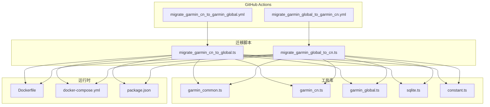
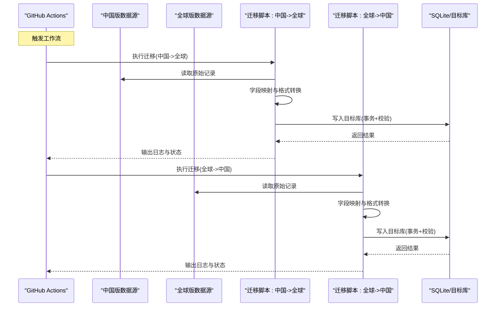
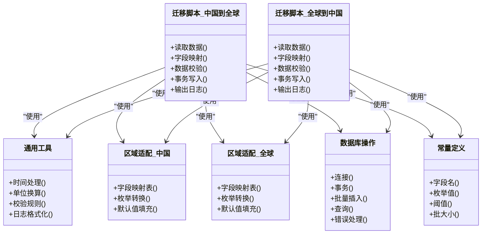

# Garmin数据迁移工作流

<cite>
**本文档引用的文件**   
- [migrate_garmin_cn_to_garmin_global.yml](file://dailysync-ref/.github/workflows/migrate_garmin_cn_to_garmin_global.yml)
- [migrate_garmin_global_to_garmin_cn.yml](file://dailysync-ref/.github/workflows/migrate_garmin_global_to_garmin_cn.yml)
- [migrate_garmin_cn_to_global.ts](file://dailysync-ref/src/migrate_garmin_cn_to_global.ts)
- [migrate_garmin_global_to_cn.ts](file://dailysync-ref/src/migrate_garmin_global_to_cn.ts)
- [garmin_common.ts](file://dailysync-ref/src/utils/garmin_common.ts)
- [garmin_cn.ts](file://dailysync-ref/src/utils/garmin_cn.ts)
- [garmin_global.ts](file://dailysync-ref/src/utils/garmin_global.ts)
- [sqlite.ts](file://dailysync-ref/src/utils/sqlite.ts)
- [constant.ts](file://dailysync-ref/src/constant.ts)
- [package.json](file://dailysync-ref/package.json)
- [docker-compose.yml](file://dailysync-ref/docker-compose.yml)
- [Dockerfile](file://dailysync-ref/Dockerfile)
</cite>

## 目录
1. [简介](#简介)
2. [项目结构](#项目结构)
3. [核心组件](#核心组件)
4. [架构总览](#架构总览)
5. [详细组件分析](#详细组件分析)
6. [依赖关系分析](#依赖关系分析)
7. [性能考虑](#性能考虑)
8. [故障排查指南](#故障排查指南)
9. [结论](#结论)
10. [附录](#附录)

## 简介
本文件面向Garmin中国版与全球版之间的双向数据迁移工作流，系统性说明两个GitHub Actions工作流的配置与执行逻辑、数据格式转换与字段映射规则、数据验证机制、备份与回滚策略、完整性校验、进度监控、错误处理与日志分析方法，以及性能优化建议与常见问题解决方案。读者无需深入源码即可理解并安全地运行迁移任务。

## 项目结构
本项目采用“工作流 + 业务脚本 + 工具库”的分层组织方式：
- GitHub Actions工作流定义在 .github/workflows 下，负责触发、环境准备、依赖安装与脚本执行。
- 迁移脚本位于 src 目录，分别实现中国版到全球版、全球版到中国版的迁移逻辑。
- 工具库位于 src/utils，封装了通用能力（如SQLite操作、区域差异适配、常量等）。
- 运行时通过 Docker 容器化部署，便于在CI环境中稳定执行。

图表来源
- [migrate_garmin_cn_to_garmin_global.yml](file://dailysync-ref/.github/workflows/migrate_garmin_cn_to_garmin_global.yml)
- [migrate_garmin_global_to_garmin_cn.yml](file://dailysync-ref/.github/workflows/migrate_garmin_global_to_garmin_cn.yml)
- [migrate_garmin_cn_to_global.ts](file://dailysync-ref/src/migrate_garmin_cn_to_global.ts)
- [migrate_garmin_global_to_cn.ts](file://dailysync-ref/src/migrate_garmin_global_to_cn.ts)
- [garmin_common.ts](file://dailysync-ref/src/utils/garmin_common.ts)
- [garmin_cn.ts](file://dailysync-ref/src/utils/garmin_cn.ts)
- [garmin_global.ts](file://dailysync-ref/src/utils/garmin_global.ts)
- [sqlite.ts](file://dailysync-ref/src/utils/sqlite.ts)
- [constant.ts](file://dailysync-ref/src/constant.ts)
- [package.json](file://dailysync-ref/package.json)
- [Dockerfile](file://dailysync-ref/Dockerfile)
- [docker-compose.yml](file://dailysync-ref/docker-compose.yml)

章节来源
- [migrate_garmin_cn_to_garmin_global.yml](file://dailysync-ref/.github/workflows/migrate_garmin_cn_to_garmin_global.yml)
- [migrate_garmin_global_to_garmin_cn.yml](file://dailysync-ref/.github/workflows/migrate_garmin_global_to_garmin_cn.yml)
- [package.json](file://dailysync-ref/package.json)
- [Dockerfile](file://dailysync-ref/Dockerfile)
- [docker-compose.yml](file://dailysync-ref/docker-compose.yml)

## 核心组件
- 工作流编排器：定义触发条件、环境变量、步骤顺序、缓存与密钥注入、失败策略。
- 迁移脚本：实现数据读取、格式转换、字段映射、校验、写入目标库、事务控制与回滚。
- 工具库：提供区域差异适配、数据库访问、常量定义、通用算法与校验函数。
- 运行时环境：基于Node.js的容器镜像，确保依赖一致性与可重复执行。

章节来源
- [migrate_garmin_cn_to_garmin_global.ts](file://dailysync-ref/src/migrate_garmin_cn_to_global.ts)
- [migrate_garmin_global_to_cn.ts](file://dailysync-ref/src/migrate_garmin_global_to_cn.ts)
- [garmin_common.ts](file://dailysync-ref/src/utils/garmin_common.ts)
- [garmin_cn.ts](file://dailysync-ref/src/utils/garmin_cn.ts)
- [garmin_global.ts](file://dailysync-ref/src/utils/garmin_global.ts)
- [sqlite.ts](file://dailysync-ref/src/utils/sqlite.ts)
- [constant.ts](file://dailysync-ref/src/constant.ts)

## 架构总览
整体流程由GitHub Actions触发，调用对应的迁移脚本；脚本从源端读取数据，经工具库进行格式转换与校验后，写入目标端数据库。关键路径如下：

图表来源
- [migrate_garmin_cn_to_garmin_global.yml](file://dailysync-ref/.github/workflows/migrate_garmin_cn_to_garmin_global.yml)
- [migrate_garmin_global_to_garmin_cn.yml](file://dailysync-ref/.github/workflows/migrate_garmin_global_to_garmin_cn.yml)
- [migrate_garmin_cn_to_global.ts](file://dailysync-ref/src/migrate_garmin_cn_to_global.ts)
- [migrate_garmin_global_to_cn.ts](file://dailysync-ref/src/migrate_garmin_global_to_cn.ts)
- [sqlite.ts](file://dailysync-ref/src/utils/sqlite.ts)

## 详细组件分析

### 工作流：中国版→全球版迁移
- 触发条件：支持手动触发或定时触发，按分支与环境变量控制执行范围。
- 环境准备：安装Node.js、恢复依赖缓存、设置必要的环境变量与密钥。
- 执行步骤：进入项目目录、安装依赖、运行迁移脚本、收集日志、设置失败策略。
- 幂等性：通过批次ID或时间戳避免重复迁移；支持增量模式以减少负载。

章节来源
- [migrate_garmin_cn_to_garmin_global.yml](file://dailysync-ref/.github/workflows/migrate_garmin_cn_to_garmin_global.yml)
- [package.json](file://dailysync-ref/package.json)

### 工作流：全球版→中国版迁移
- 触发条件：与反向迁移类似，支持独立触发与隔离执行。
- 环境准备：同中国版→全球版，确保一致的运行时环境。
- 执行步骤：安装依赖、执行对应脚本、输出结构化日志、失败时标记任务状态。
- 资源限制：合理设置超时与重试次数，避免长时间阻塞。

章节来源
- [migrate_garmin_global_to_garmin_cn.yml](file://dailysync-ref/.github/workflows/migrate_garmin_global_to_garmin_cn.yml)
- [package.json](file://dailysync-ref/package.json)

### 迁移脚本：中国版→全球版
- 数据读取：从中国版数据源拉取原始记录，解析为统一中间格式。
- 字段映射：依据区域差异将中国版字段映射为全球版字段，处理单位、枚举值与时区。
- 数据校验：对必填字段、数值范围、时间格式等进行校验，失败则记录并跳过。
- 写入目标：使用事务批量写入，保证一致性；失败自动回滚。
- 进度与日志：分批次输出进度、统计成功/失败数量、异常堆栈与上下文信息。

章节来源
- [migrate_garmin_cn_to_global.ts](file://dailysync-ref/src/migrate_garmin_cn_to_global.ts)
- [garmin_common.ts](file://dailysync-ref/src/utils/garmin_common.ts)
- [garmin_cn.ts](file://dailysync-ref/src/utils/garmin_cn.ts)
- [garmin_global.ts](file://dailysync-ref/src/utils/garmin_global.ts)
- [sqlite.ts](file://dailysync-ref/src/utils/sqlite.ts)
- [constant.ts](file://dailysync-ref/src/constant.ts)

### 迁移脚本：全球版→中国版
- 数据读取：从全球版数据源拉取原始记录，转换为中间格式。
- 字段映射：将全球版字段映射为中国版字段，处理单位换算、枚举映射与时区转换。
- 数据校验：校验必填项、数值范围、时间格式与关联完整性。
- 写入目标：事务批量写入，失败回滚；支持幂等更新。
- 进度与日志：输出批次进度、统计指标与错误详情。

章节来源
- [migrate_garmin_global_to_cn.ts](file://dailysync-ref/src/migrate_garmin_global_to_cn.ts)
- [garmin_common.ts](file://dailysync-ref/src/utils/garmin_common.ts)
- [garmin_cn.ts](file://dailysync-ref/src/utils/garmin_cn.ts)
- [garmin_global.ts](file://dailysync-ref/src/utils/garmin_global.ts)
- [sqlite.ts](file://dailysync-ref/src/utils/sqlite.ts)
- [constant.ts](file://dailysync-ref/src/constant.ts)

### 工具库：通用能力
- garmin_common.ts：提供跨区域的通用函数，如时间处理、单位换算、校验规则、日志格式化。
- garmin_cn.ts / garmin_global.ts：分别定义中国版与全球版的字段映射表、枚举转换、默认值填充。
- sqlite.ts：封装数据库连接、事务管理、批量插入、查询与错误处理。
- constant.ts：集中定义常量，如字段名、枚举值、阈值、批大小等。

章节来源
- [garmin_common.ts](file://dailysync-ref/src/utils/garmin_common.ts)
- [garmin_cn.ts](file://dailysync-ref/src/utils/garmin_cn.ts)
- [garmin_global.ts](file://dailysync-ref/src/utils/garmin_global.ts)
- [sqlite.ts](file://dailysync-ref/src/utils/sqlite.ts)
- [constant.ts](file://dailysync-ref/src/constant.ts)

### 运行时：容器化与依赖
- Dockerfile：定义Node.js基础镜像、安装系统依赖、复制代码与依赖、设置入口命令。
- docker-compose.yml：编排服务、挂载卷、设置环境变量、暴露端口（如需）。
- package.json：声明脚本命令、依赖版本、构建与运行参数。

章节来源
- [Dockerfile](file://dailysync-ref/Dockerfile)
- [docker-compose.yml](file://dailysync-ref/docker-compose.yml)
- [package.json](file://dailysync-ref/package.json)

## 依赖关系分析
迁移脚本依赖工具库提供的字段映射、校验与数据库操作能力；工作流依赖Node.js环境与包管理器；容器镜像确保依赖一致性。

图表来源
- [migrate_garmin_cn_to_global.ts](file://dailysync-ref/src/migrate_garmin_cn_to_global.ts)
- [migrate_garmin_global_to_cn.ts](file://dailysync-ref/src/migrate_garmin_global_to_cn.ts)
- [garmin_common.ts](file://dailysync-ref/src/utils/garmin_common.ts)
- [garmin_cn.ts](file://dailysync-ref/src/utils/garmin_cn.ts)
- [garmin_global.ts](file://dailysync-ref/src/utils/garmin_global.ts)
- [sqlite.ts](file://dailysync-ref/src/utils/sqlite.ts)
- [constant.ts](file://dailysync-ref/src/constant.ts)

章节来源
- [migrate_garmin_cn_to_global.ts](file://dailysync-ref/src/migrate_garmin_cn_to_global.ts)
- [migrate_garmin_global_to_cn.ts](file://dailysync-ref/src/migrate_garmin_global_to_cn.ts)
- [garmin_common.ts](file://dailysync-ref/src/utils/garmin_common.ts)
- [garmin_cn.ts](file://dailysync-ref/src/utils/garmin_cn.ts)
- [garmin_global.ts](file://dailysync-ref/src/utils/garmin_global.ts)
- [sqlite.ts](file://dailysync-ref/src/utils/sqlite.ts)
- [constant.ts](file://dailysync-ref/src/constant.ts)

## 性能考虑
- 批处理写入：增大批大小可减少事务开销，但需平衡内存占用与失败回滚成本。
- 并发控制：限制并发度以避免数据库锁竞争与网络拥塞。
- 索引优化：为目标表创建必要的索引，提升写入与查询效率。
- 缓存依赖：利用GitHub Actions缓存Node模块，缩短启动时间。
- 增量迁移：基于时间戳或批次ID仅迁移变更数据，降低负载。
- 资源限制：合理设置超时与重试，避免长时间阻塞任务队列。

[本节为通用指导，不直接分析具体文件]

## 故障排查指南
- 常见错误类型
  - 字段缺失或类型不匹配：检查字段映射表与校验规则。
  - 数值越界或单位不一致：核对单位换算与阈值常量。
  - 时间格式错误：确认时区与时间字符串解析逻辑。
  - 数据库写入失败：检查事务回滚、连接池与锁等待。
- 日志分析方法
  - 关注批次进度与统计指标，定位失败批次。
  - 提取异常堆栈与上下文信息，复现场景。
  - 对比源端与目标端记录，识别映射差异。
- 回滚与恢复
  - 事务失败自动回滚，确保数据一致性。
  - 保留迁移快照与审计日志，支持人工干预与恢复。
- 调试建议
  - 启用详细日志级别，输出关键字段与中间结果。
  - 使用最小数据集进行回归测试，快速定位问题。

章节来源
- [sqlite.ts](file://dailysync-ref/src/utils/sqlite.ts)
- [garmin_common.ts](file://dailysync-ref/src/utils/garmin_common.ts)
- [garmin_cn.ts](file://dailysync-ref/src/utils/garmin_cn.ts)
- [garmin_global.ts](file://dailysync-ref/src/utils/garmin_global.ts)
- [constant.ts](file://dailysync-ref/src/constant.ts)

## 结论
本工作流通过标准化的GitHub Actions编排与模块化迁移脚本，实现了Garmin中国版与全球版之间的安全、可靠、可观测的双向数据迁移。借助工具库的字段映射与校验能力、事务与回滚机制、以及完善的日志与监控，能够在复杂数据环境下保持高一致性与高性能。建议在生产环境中结合增量迁移与资源限流策略，持续优化稳定性与效率。

[本节为总结性内容，不直接分析具体文件]

## 附录
- 术语表
  - 中国版：Garmin中国区数据源与字段规范。
  - 全球版：Garmin全球区数据源与字段规范。
  - 中间格式：迁移过程中统一的内部数据结构。
  - 事务：保证写入原子性的数据库操作单元。
- 参考文件
  - 工作流定义：见.dailysync-ref/.github/workflows下的两个迁移工作流文件。
  - 迁移脚本：见src目录下两个迁移脚本文件。
  - 工具库：见src/utils下的通用与区域适配文件。
  - 运行时：见Dockerfile、docker-compose.yml与package.json。

[本节为补充信息，不直接分析具体文件]