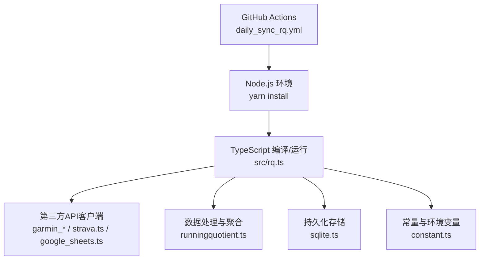
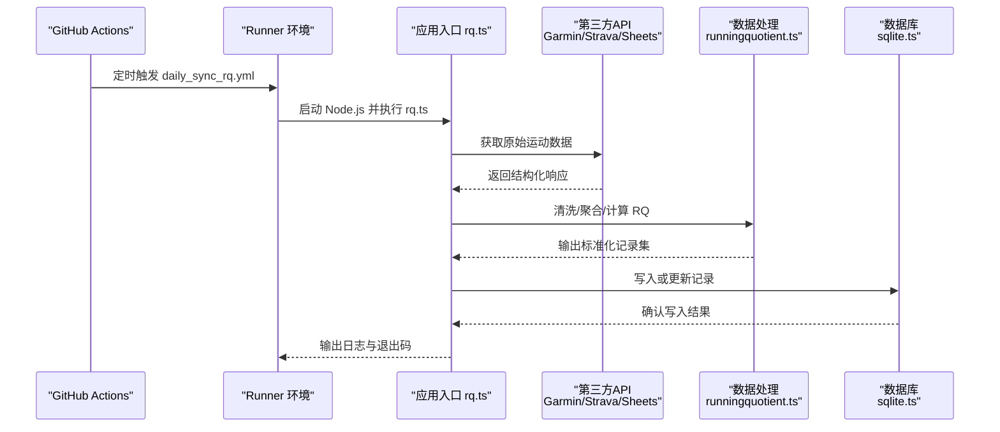
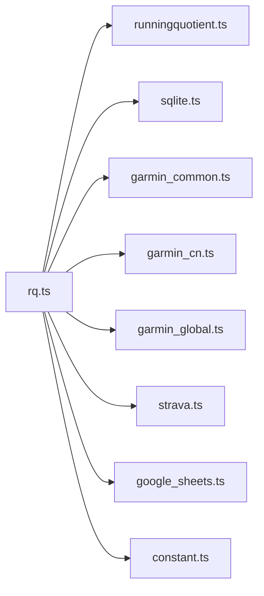
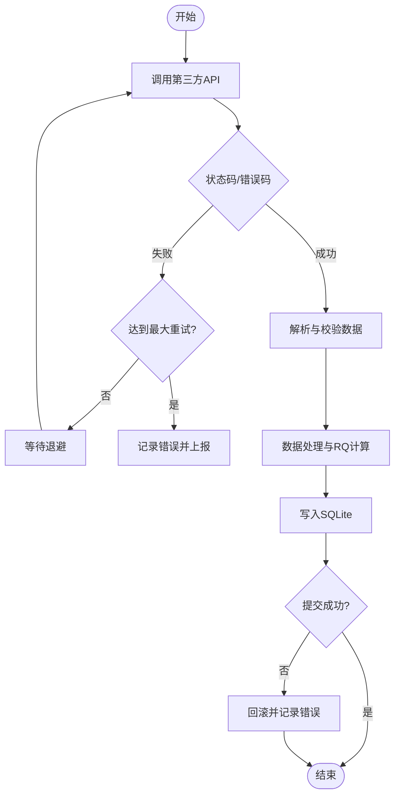
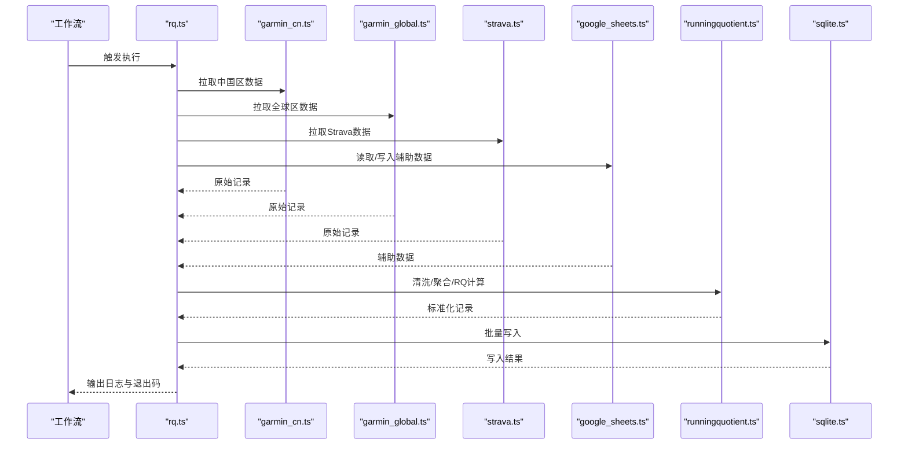

# 每日同步工作流

<cite>
**本文引用的文件**   
- [daily_sync_rq.yml](file://dailysync-ref/.github/workflows/daily_sync_rq.yml)
- [rq.ts](file://dailysync-ref/src/rq.ts)
- [runningquotient.ts](file://dailysync-ref/src/utils/runningquotient.ts)
- [sqlite.ts](file://dailysync-ref/src/utils/sqlite.ts)
- [garmin_common.ts](file://dailysync-ref/src/utils/garmin_common.ts)
- [garmin_cn.ts](file://dailysync-ref/src/utils/garmin_cn.ts)
- [garmin_global.ts](file://dailysync-ref/src/utils/garmin_global.ts)
- [google_sheets.ts](file://dailysync-ref/src/utils/google_sheets.ts)
- [strava.ts](file://dailysync-ref/src/utils/strava.ts)
- [constant.ts](file://dailysync-ref/src/constant.ts)
- [Dockerfile](file://dailysync-ref/Dockerfile)
- [docker-compose.yml](file://dailysync-ref/docker-compose.yml)
- [package.json](file://dailysync-ref/package.json)
</cite>

## 目录
1. [简介](#简介)
2. [项目结构](#项目结构)
3. [核心组件](#核心组件)
4. [架构总览](#架构总览)
5. [详细组件分析](#详细组件分析)
6. [依赖关系分析](#依赖关系分析)
7. [性能考虑](#性能考虑)
8. [故障排查指南](#故障排查指南)
9. [结论](#结论)
10. [附录](#附录)

## 简介
本文件面向“Running Quotient（RQ）数据每日同步”的自动化工作流，围绕 dailysync-ref 子项目中的 GitHub Actions 工作流 daily_sync_rq.yml 展开。文档将说明：
- 工作流的触发机制、执行环境与依赖安装步骤
- Running Quotient 数据从第三方服务到本地数据库的完整同步流程
- 环境变量配置（认证、数据库连接、第三方服务）
- 错误处理策略、重试与日志记录方法
- 常见问题的排查路径与性能优化建议

## 项目结构
dailysync-ref 是独立的 TypeScript 工程，包含：
- .github/workflows：GitHub Actions 工作流定义（含 daily_sync_rq.yml）
- src：核心同步逻辑与工具模块（RQ 计算、Garmin 区域适配、Google Sheets、Strava、SQLite 等）
- Dockerfile 与 docker-compose.yml：容器化运行与编排
- package.json：依赖与脚本入口

图表来源
- [daily_sync_rq.yml](file://dailysync-ref/.github/workflows/daily_sync_rq.yml)
- [package.json](file://dailysync-ref/package.json)
- [Dockerfile](file://dailysync-ref/Dockerfile)
- [docker-compose.yml](file://dailysync-ref/docker-compose.yml)

章节来源
- [daily_sync_rq.yml](file://dailysync-ref/.github/workflows/daily_sync_rq.yml)
- [package.json](file://dailysync-ref/package.json)
- [Dockerfile](file://dailysync-ref/Dockerfile)
- [docker-compose.yml](file://dailysync-ref/docker-compose.yml)

## 核心组件
- 工作流调度器：通过 GitHub Actions 定时触发每日任务，准备 Node.js 环境并执行同步脚本。
- 主入口脚本：src/rq.ts 负责协调各子系统，完成数据拉取、转换与入库。
- 第三方集成：
  - Garmin 中国/全球站点适配（garmin_cn.ts、garmin_global.ts、garmin_common.ts）
  - Strava 数据接入（strava.ts）
  - Google Sheets 辅助（google_sheets.ts）
- 数据处理：runningquotient.ts 实现 RQ 指标计算与聚合。
- 数据存储：sqlite.ts 提供 SQLite 读写封装，用于持久化同步结果。
- 常量与环境：constant.ts 集中管理常量；环境变量由工作流注入。

章节来源
- [rq.ts](file://dailysync-ref/src/rq.ts)
- [runningquotient.ts](file://dailysync-ref/src/utils/runningquotient.ts)
- [sqlite.ts](file://dailysync-ref/src/utils/sqlite.ts)
- [garmin_common.ts](file://dailysync-ref/src/utils/garmin_common.ts)
- [garmin_cn.ts](file://dailysync-ref/src/utils/garmin_cn.ts)
- [garmin_global.ts](file://dailysync-ref/src/utils/garmin_global.ts)
- [google_sheets.ts](file://dailysync-ref/src/utils/google_sheets.ts)
- [strava.ts](file://dailysync-ref/src/utils/strava.ts)
- [constant.ts](file://dailysync-ref/src/constant.ts)

## 架构总览
下图展示了从工作流触发到数据落库的关键调用链：

图表来源
- [daily_sync_rq.yml](file://dailysync-ref/.github/workflows/daily_sync_rq.yml)
- [rq.ts](file://dailysync-ref/src/rq.ts)
- [runningquotient.ts](file://dailysync-ref/src/utils/runningquotient.ts)
- [sqlite.ts](file://dailysync-ref/src/utils/sqlite.ts)
- [garmin_common.ts](file://dailysync-ref/src/utils/garmin_common.ts)
- [garmin_cn.ts](file://dailysync-ref/src/utils/garmin_cn.ts)
- [garmin_global.ts](file://dailysync-ref/src/utils/garmin_global.ts)
- [strava.ts](file://dailysync-ref/src/utils/strava.ts)
- [google_sheets.ts](file://dailysync-ref/src/utils/google_sheets.ts)

## 详细组件分析

### 工作流 daily_sync_rq.yml：触发与执行环境
- 触发方式：按 Cron 表达式每日定时触发，确保在固定时间窗口内执行同步。
- 执行环境：使用官方 Node.js Runner，安装依赖后执行同步脚本。
- 关键步骤：
  - 设置 Node.js 版本与缓存依赖
  - 安装依赖（yarn/npm）
  - 构建/运行 TypeScript 入口（通常指向 rq.ts）
  - 注入环境变量（认证、数据库连接、第三方服务密钥）
  - 收集日志与失败告警

章节来源
- [daily_sync_rq.yml](file://dailysync-ref/.github/workflows/daily_sync_rq.yml)
- [package.json](file://dailysync-ref/package.json)

### 主入口 rq.ts：同步编排
- 职责：
  - 读取环境变量与常量配置
  - 初始化第三方客户端（Garmin、Strava、Google Sheets）
  - 调用数据源接口，获取原始记录
  - 调用数据处理模块进行清洗、去重、聚合与 RQ 计算
  - 将结果写入 SQLite，保证幂等与一致性
  - 统一异常捕获、重试与日志输出

章节来源
- [rq.ts](file://dailysync-ref/src/rq.ts)
- [constant.ts](file://dailysync-ref/src/constant.ts)

### 数据处理 runningquotient.ts：RQ 计算与聚合
- 输入：来自各数据源的标准化运动记录（距离、配速、心率、训练负荷等）
- 处理：
  - 数据校验与字段映射
  - 基于规则/阈值的异常值过滤
  - 按日/周/月维度聚合，计算 Running Quotient 指标
  - 生成可持久化的记录结构
- 输出：标准化的数据集供 sqlite.ts 写入

章节来源
- [runningquotient.ts](file://dailysync-ref/src/utils/runningquotient.ts)

### 数据存储 sqlite.ts：持久化与事务
- 职责：
  - 建立/连接 SQLite 数据库
  - 表结构初始化与迁移
  - 插入/更新/查询操作，支持事务与回滚
  - 幂等写入（基于唯一键避免重复）
- 性能要点：批量写入、索引设计、连接复用

章节来源
- [sqlite.ts](file://dailysync-ref/src/utils/sqlite.ts)

### 第三方集成：Garmin/Strava/Google Sheets
- Garmin 中国/全球：
  - garmin_common.ts：公共逻辑（鉴权、分页、限流、错误码处理）
  - garmin_cn.ts：中国区站点适配（域名、参数差异）
  - garmin_global.ts：全球站点适配
- Strava：
  - strava.ts：OAuth 授权、活动列表与详情拉取
- Google Sheets：
  - google_sheets.ts：可选的数据导出/备份或对照表读取

章节来源
- [garmin_common.ts](file://dailysync-ref/src/utils/garmin_common.ts)
- [garmin_cn.ts](file://dailysync-ref/src/utils/garmin_cn.ts)
- [garmin_global.ts](file://dailysync-ref/src/utils/garmin_global.ts)
- [strava.ts](file://dailysync-ref/src/utils/strava.ts)
- [google_sheets.ts](file://dailysync-ref/src/utils/google_sheets.ts)

### 常量与配置 constant.ts
- 集中管理业务常量（如默认时间窗口、阈值、分页大小等）
- 与运行时环境变量配合，形成“静态常量 + 动态配置”的组合

章节来源
- [constant.ts](file://dailysync-ref/src/constant.ts)

### 容器化与编排：Dockerfile 与 docker-compose.yml
- Dockerfile：定义 Node.js 基础镜像、依赖安装、构建与运行命令
- docker-compose.yml：编排多服务（如 SQLite 数据卷挂载、环境变量注入）

章节来源
- [Dockerfile](file://dailysync-ref/Dockerfile)
- [docker-compose.yml](file://dailysync-ref/docker-compose.yml)

## 依赖关系分析
- 外部依赖：
  - GitHub Actions Runner（Node.js 环境）
  - 第三方 API（Garmin、Strava、Google Sheets）
  - SQLite（本地文件数据库）
- 内部依赖：
  - rq.ts 依赖 runningquotient.ts、sqlite.ts、各第三方客户端与常量模块
  - 各客户端共享 garmin_common.ts 的通用能力

图表来源
- [rq.ts](file://dailysync-ref/src/rq.ts)
- [runningquotient.ts](file://dailysync-ref/src/utils/runningquotient.ts)
- [sqlite.ts](file://dailysync-ref/src/utils/sqlite.ts)
- [garmin_common.ts](file://dailysync-ref/src/utils/garmin_common.ts)
- [garmin_cn.ts](file://dailysync-ref/src/utils/garmin_cn.ts)
- [garmin_global.ts](file://dailysync-ref/src/utils/garmin_global.ts)
- [strava.ts](file://dailysync-ref/src/utils/strava.ts)
- [google_sheets.ts](file://dailysync-ref/src/utils/google_sheets.ts)
- [constant.ts](file://dailysync-ref/src/constant.ts)

章节来源
- [package.json](file://dailysync-ref/package.json)

## 性能考虑
- 网络层
  - 合理设置超时与重试退避策略，避免雪崩
  - 对分页接口采用并发限制与请求合并
- 数据处理
  - 增量同步优先，减少全量拉取
  - 预处理阶段尽早过滤无效数据，降低后续计算开销
- 存储层
  - 使用事务批量写入，减少 I/O 次数
  - 为高频查询字段建立索引（日期、用户ID、活动ID）
- 资源利用
  - 控制并发度，避免内存峰值过高
  - 在 CI Runner 中启用依赖缓存，缩短冷启动时间

[本节为通用指导，不直接分析具体文件]

## 故障排查指南
- 工作流失败
  - 检查 Cron 表达式与执行时间窗口
  - 查看 Runner 日志，定位依赖安装或脚本执行错误
- 第三方 API 问题
  - 确认 OAuth/Token 是否过期
  - 检查速率限制与配额，必要时增加退避重试
  - 区分中国区与全球站点的差异（域名、参数）
- 数据不一致
  - 核对去重键与幂等写入逻辑
  - 对比原始数据与入库数据的字段映射
- 数据库问题
  - 检查 SQLite 文件权限与磁盘空间
  - 验证表结构与迁移脚本是否成功执行
- 日志与调试
  - 在工作流中开启详细日志级别
  - 在关键节点输出耗时与计数统计，便于定位瓶颈

章节来源
- [daily_sync_rq.yml](file://dailysync-ref/.github/workflows/daily_sync_rq.yml)
- [sqlite.ts](file://dailysync-ref/src/utils/sqlite.ts)
- [garmin_common.ts](file://dailysync-ref/src/utils/garmin_common.ts)
- [strava.ts](file://dailysync-ref/src/utils/strava.ts)

## 结论
daily_sync_rq.yml 工作流以稳定的定时触发为基础，结合 Node.js 执行环境与 TypeScript 模块化代码，实现了从 Garmin/Strava/Google Sheets 等多源数据到 SQLite 的可靠同步。通过清晰的职责划分（入口编排、数据处理、存储、第三方集成），系统具备良好的可维护性与扩展性。配合合理的错误处理、重试与日志策略，可在复杂网络与第三方限制环境下保持高可用。

[本节为总结性内容，不直接分析具体文件]

## 附录

### 环境变量配置清单（示例）
以下为工作流与运行时常用的环境变量类别与用途说明（请根据实际服务提供方填写具体值）：
- 认证信息
  - GARMIN_CN_TOKEN / GARMIN_GLOBAL_TOKEN：Garmin 登录或会话令牌
  - STRAVA_CLIENT_ID / STRAVA_CLIENT_SECRET / STRAVA_REFRESH_TOKEN：Strava OAuth 凭据
  - GOOGLE_SHEETS_CREDENTIALS：Google Sheets 服务账号 JSON 或路径
- 数据库连接
  - SQLITE_DB_PATH：SQLite 数据库文件路径
  - SQLITE_INIT_SQL：初始化 SQL 文件路径（可选）
- 业务开关与阈值
  - SYNC_DATE_RANGE_START / SYNC_DATE_RANGE_END：同步日期范围
  - RQ_THRESHOLD_*：RQ 计算相关阈值
- 日志与调试
  - LOG_LEVEL：日志级别（info/debug/warn/error）
  - ENABLE_RETRY：是否启用重试（true/false）
  - RETRY_MAX_ATTEMPTS：最大重试次数
  - RETRY_BACKOFF_MS：重试退避间隔（毫秒）

章节来源
- [constant.ts](file://dailysync-ref/src/constant.ts)
- [daily_sync_rq.yml](file://dailysync-ref/.github/workflows/daily_sync_rq.yml)

### 错误处理与重试策略（流程）

图表来源
- [garmin_common.ts](file://dailysync-ref/src/utils/garmin_common.ts)
- [strava.ts](file://dailysync-ref/src/utils/strava.ts)
- [sqlite.ts](file://dailysync-ref/src/utils/sqlite.ts)

### 数据同步时序（端到端）

图表来源
- [rq.ts](file://dailysync-ref/src/rq.ts)
- [garmin_cn.ts](file://dailysync-ref/src/utils/garmin_cn.ts)
- [garmin_global.ts](file://dailysync-ref/src/utils/garmin_global.ts)
- [strava.ts](file://dailysync-ref/src/utils/strava.ts)
- [google_sheets.ts](file://dailysync-ref/src/utils/google_sheets.ts)
- [runningquotient.ts](file://dailysync-ref/src/utils/runningquotient.ts)
- [sqlite.ts](file://dailysync-ref/src/utils/sqlite.ts)