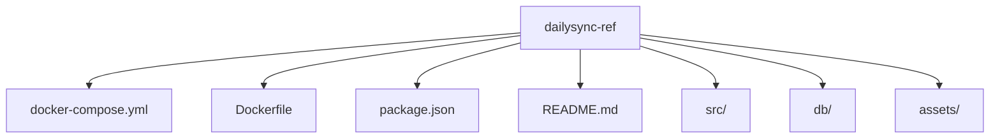
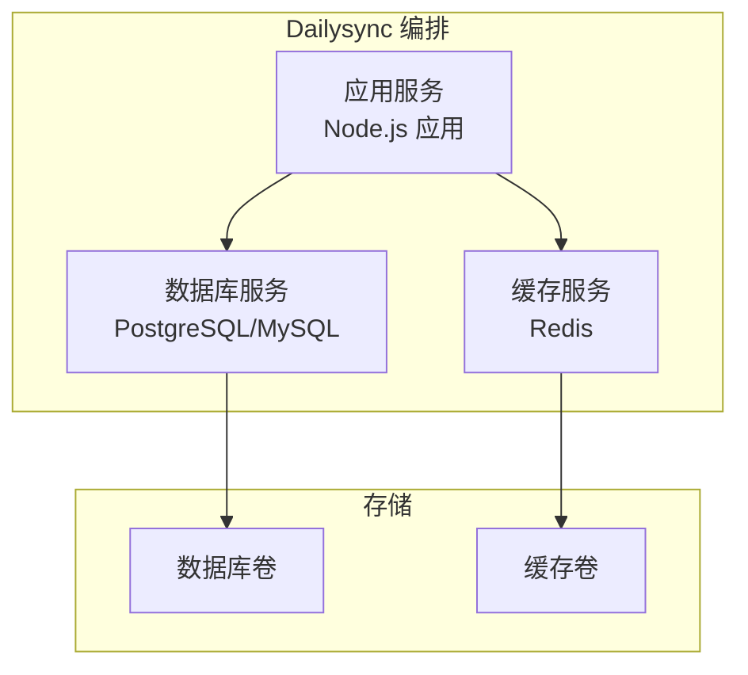
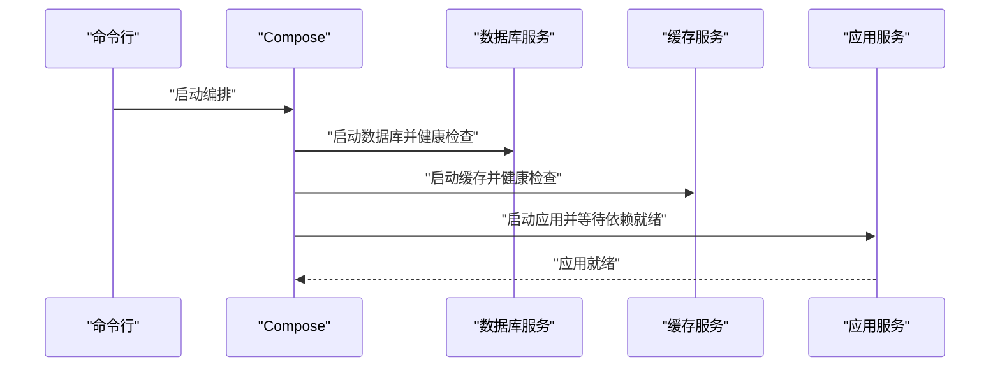

# Docker Compose服务编排

<cite>
**本文档中引用的文件**   
- [docker-compose.yml](file://dailysync-ref/docker-compose.yml)
- [Dockerfile](file://dailysync-ref/Dockerfile)
- [package.json](file://dailysync-ref/package.json)
- [README.md](file://dailysync-ref/README.md)
</cite>

## 目录
1. [简介](#简介)
2. [项目结构](#项目结构)
3. [核心组件](#核心组件)
4. [架构总览](#架构总览)
5. [详细组件分析](#详细组件分析)
6. [依赖关系分析](#依赖关系分析)
7. [性能考虑](#性能考虑)
8. [故障排查指南](#故障排查指南)
9. [结论](#结论)
10. [附录](#附录)

## 简介
本指南面向Dailysync系统的Docker Compose服务编排，围绕docker-compose.yml的结构与最佳实践展开，涵盖多容器编排（应用、数据库、缓存）、网络与数据卷策略、环境变量与环境切换、健康检查、日志收集、启动/停止/更新流程，以及常见问题与性能调优建议。目标是帮助读者快速搭建、稳定运行并高效运维Dailysync系统。

## 项目结构
Dailysync的Docker相关配置集中在dailysync-ref目录下，关键文件包括：
- docker-compose.yml：服务编排定义
- Dockerfile：应用镜像构建说明
- package.json：Node.js依赖与脚本
- README.md：项目说明与使用说明

图表来源
- [docker-compose.yml](file://dailysync-ref/docker-compose.yml)
- [Dockerfile](file://dailysync-ref/Dockerfile)
- [package.json](file://dailysync-ref/package.json)
- [README.md](file://dailysync-ref/README.md)

章节来源
- [docker-compose.yml](file://dailysync-ref/docker-compose.yml)
- [Dockerfile](file://dailysync-ref/Dockerfile)
- [package.json](file://dailysync-ref/package.json)
- [README.md](file://dailysync-ref/README.md)

## 核心组件
- 应用服务：基于Node.js的Dailysync应用，通过Dockerfile构建镜像，由Compose启动。
- 数据库服务：通常使用PostgreSQL或MySQL等持久化数据库容器，提供数据持久化。
- 缓存服务：可选Redis等缓存容器，用于加速数据同步与查询。
- 网络与数据卷：Compose默认网络隔离各容器；数据卷保障数据库与缓存数据持久化。
- 环境变量：通过.env或Compose变量注入敏感信息与运行时配置。

章节来源
- [docker-compose.yml](file://dailysync-ref/docker-compose.yml)
- [Dockerfile](file://dailysync-ref/Dockerfile)
- [package.json](file://dailysync-ref/package.json)

## 架构总览
下图展示Dailysync的多容器架构与服务间通信关系。应用服务通过Compose网络访问数据库与缓存服务，所有数据通过命名卷进行持久化。

图表来源
- [docker-compose.yml](file://dailysync-ref/docker-compose.yml)
- [Dockerfile](file://dailysync-ref/Dockerfile)

## 详细组件分析

### docker-compose.yml 结构与字段说明
- 版本与格式：指定Compose文件格式，确保兼容性。
- 服务定义：每个服务包含镜像、端口映射、环境变量、依赖、健康检查、日志驱动等。
- 网络配置：自定义桥接网络，隔离服务通信。
- 数据卷：命名卷挂载到数据库与缓存容器，保证数据持久化。
- 环境变量：支持从.env文件或内联变量注入，便于环境切换与敏感信息保护。

章节来源
- [docker-compose.yml](file://dailysync-ref/docker-compose.yml)

### Dockerfile 构建说明
- 基础镜像：选择Node.js LTS镜像作为基础。
- 工作目录与依赖安装：复制package.json与lock文件，执行依赖安装。
- 应用代码复制：复制源码至容器。
- 入口命令：定义应用启动命令。

章节来源
- [Dockerfile](file://dailysync-ref/Dockerfile)
- [package.json](file://dailysync-ref/package.json)

### 环境变量与环境切换机制
- 配置文件分离：将不同环境的配置放入.env文件，避免硬编码。
- 敏感信息保护：数据库密码、API密钥等通过环境变量注入，不提交到版本库。
- 环境切换：通过切换.env文件或传入不同参数实现开发/测试/生产环境切换。

章节来源
- [docker-compose.yml](file://dailysync-ref/docker-compose.yml)
- [README.md](file://dailysync-ref/README.md)

### 服务间通信与健康检查
- 服务发现：通过Compose网络的服务名进行通信。
- 健康检查：为数据库与缓存服务设置健康检查，确保依赖就绪后再启动应用。
- 重试与超时：合理设置健康检查间隔、超时与重试次数。

章节来源
- [docker-compose.yml](file://dailysync-ref/docker-compose.yml)

### 日志收集配置
- 日志驱动：使用json-file或syslog等驱动集中管理日志。
- 轮转策略：限制日志大小与数量，避免磁盘占用过高。
- 外部收集：结合Fluentd、Logstash等工具统一收集与分析。

章节来源
- [docker-compose.yml](file://dailysync-ref/docker-compose.yml)

### 数据卷挂载策略
- 命名卷：为数据库与缓存创建命名卷，跨容器共享数据。
- 路径映射：将宿主机目录映射到容器内部路径，便于备份与调试。
- 权限控制：设置合适的用户与权限，避免写入失败。

章节来源
- [docker-compose.yml](file://dailysync-ref/docker-compose.yml)

## 依赖关系分析
下图展示服务间的依赖关系与健康检查顺序。应用服务依赖数据库与缓存服务，健康检查确保依赖就绪。

图表来源
- [docker-compose.yml](file://dailysync-ref/docker-compose.yml)

章节来源
- [docker-compose.yml](file://dailysync-ref/docker-compose.yml)

## 性能考虑
- 资源限制：为各服务设置CPU与内存上限，避免资源争用。
- 连接池：数据库与缓存连接池大小根据负载调整。
- 镜像优化：精简镜像层，减少体积与启动时间。
- 并发与批处理：合理设置同步任务的并发度与批大小。

[本节为通用指导，无需特定文件引用]

## 故障排查指南
- 服务无法启动：检查环境变量是否正确、端口是否冲突、依赖服务是否就绪。
- 数据库连接失败：验证连接字符串、用户名密码、网络连通性。
- 缓存连接失败：确认缓存服务健康状态与地址端口。
- 日志过大：配置日志轮转，清理历史日志。
- 数据丢失：检查数据卷挂载与权限，定期备份。

章节来源
- [docker-compose.yml](file://dailysync-ref/docker-compose.yml)
- [README.md](file://dailysync-ref/README.md)

## 结论
通过合理的Docker Compose编排，Dailysync系统可实现高可用、易扩展、易维护的多容器架构。遵循本指南的环境变量管理、健康检查、日志收集与数据卷策略，可显著提升稳定性与可观测性。

[本节为总结性内容，无需特定文件引用]

## 附录
- 常用命令：
  - 启动服务：docker compose up -d
  - 停止服务：docker compose down
  - 查看日志：docker compose logs -f
  - 更新镜像：docker compose pull && docker compose up -d
- 参考文档：
  - Docker官方文档
  - Compose规范
  - Node.js镜像最佳实践

[本节为补充信息，无需特定文件引用]