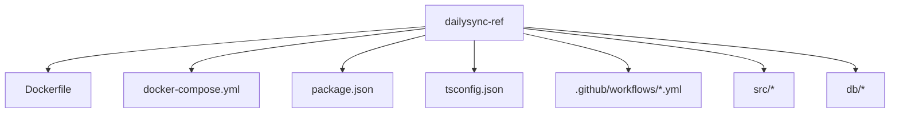
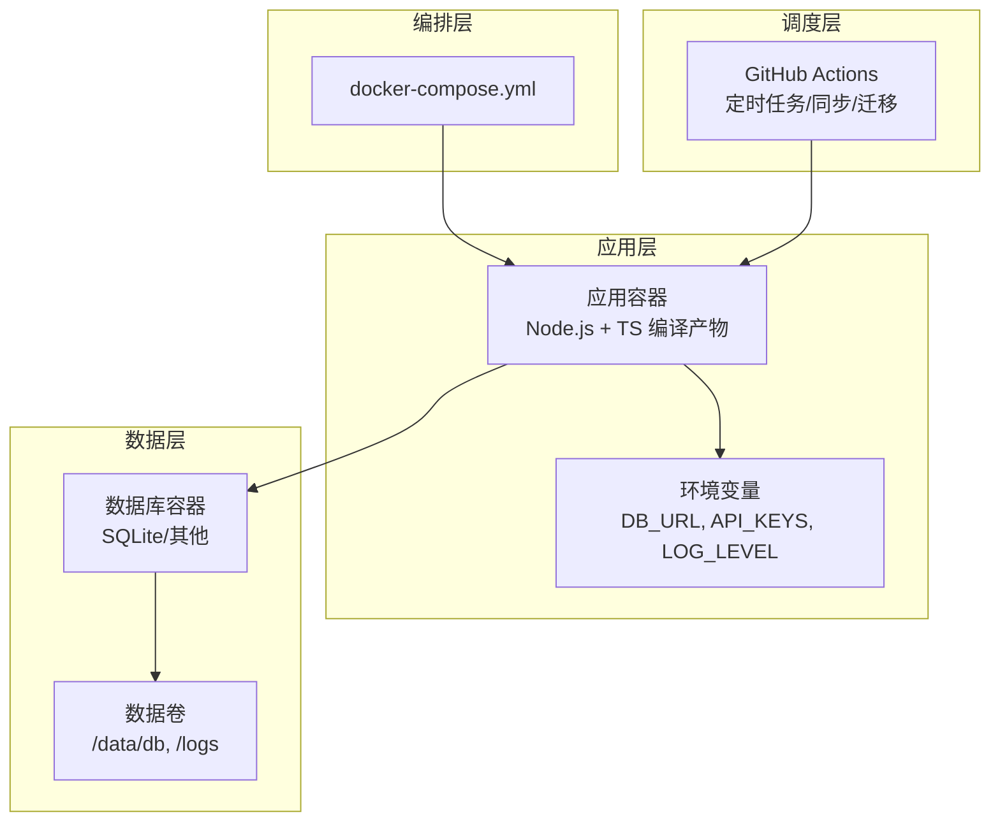
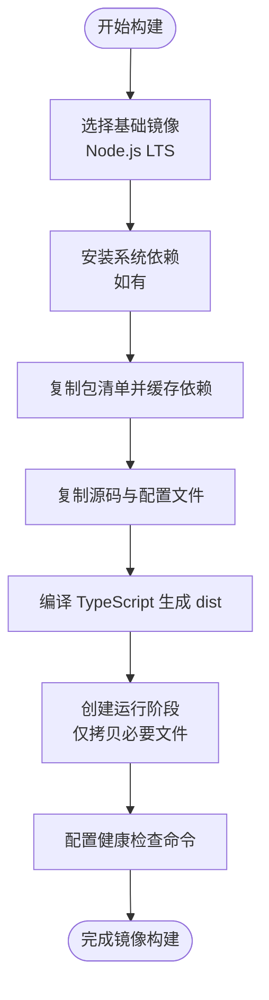
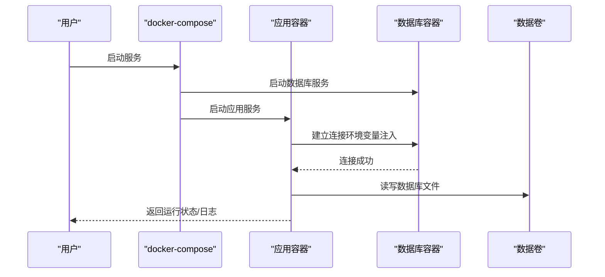
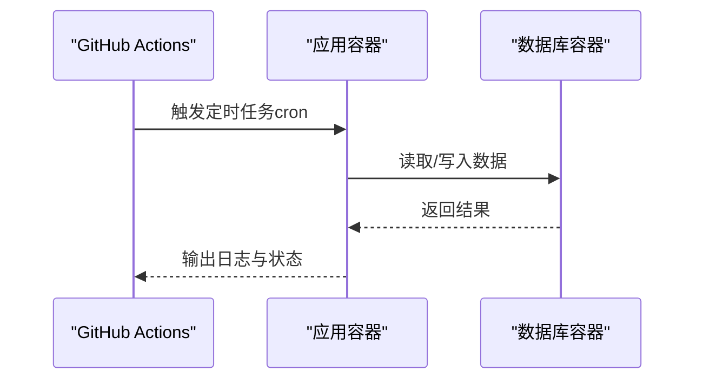
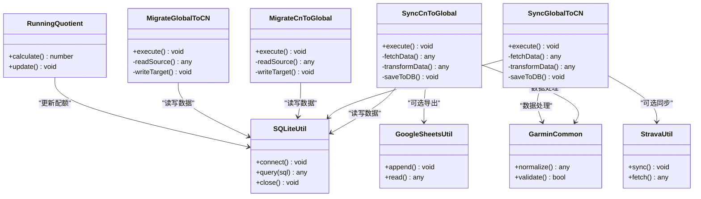
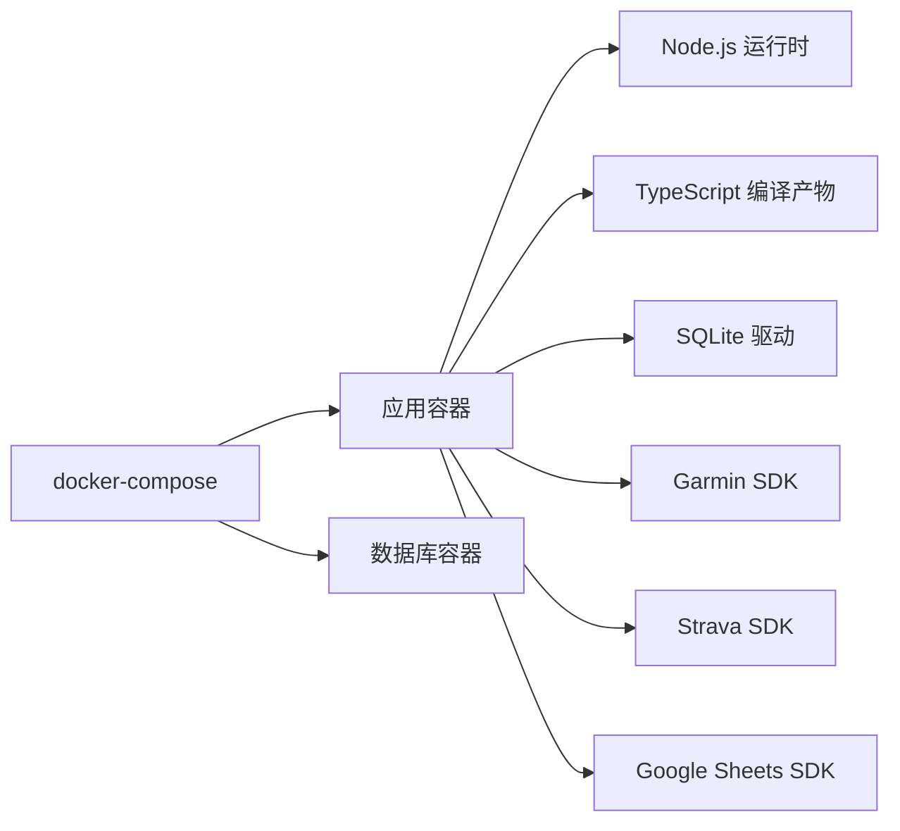

# Docker容器化部署

<cite>
**本文引用的文件**   
- [Dockerfile](file://dailysync-ref/Dockerfile)
- [docker-compose.yml](file://dailysync-ref/docker-compose.yml)
- [package.json](file://dailysync-ref/package.json)
- [tsconfig.json](file://dailysync-ref/tsconfig.json)
- [README.md](file://dailysync-ref/README.md)
- [.github/workflows/daily_sync_rq.yml](file://dailysync-ref/.github/workflows/daily_sync_rq.yml)
- [.github/workflows/sync_garmin_cn_to_garmin_global.yml](file://dailysync-ref/.github/workflows/sync_garmin_cn_to_garmin_global.yml)
- [.github/workflows/sync_garmin_global_to_garmin_cn.yml](file://dailysync-ref/.github/workflows/sync_garmin_global_to_garmin_cn.yml)
- [.github/workflows/migrate_garmin_cn_to_garmin_global.yml](file://dailysync-ref/.github/workflows/migrate_garmin_cn_to_garmin_global.yml)
- [.github/workflows/migrate_garmin_global_to_garmin_cn.yml](file://dailysync-ref/.github/workflows/migrate_garmin_global_to_garmin_cn.yml)
- [src/rq.ts](file://dailysync-ref/src/rq.ts)
- [src/sync_garmin_cn_to_global.ts](file://dailysync-ref/src/sync_garmin_cn_to_global.ts)
- [src/sync_garmin_global_to_cn.ts](file://dailysync-ref/src/sync_garmin_global_to_cn.ts)
- [src/migrate_garmin_cn_to_global.ts](file://dailysync-ref/src/migrate_garmin_cn_to_global.ts)
- [src/migrate_garmin_global_to_cn.ts](file://dailysync-ref/src/migrate_garmin_global_to_cn.ts)
- [src/utils/sqlite.ts](file://dailysync-ref/src/utils/sqlite.ts)
- [src/utils/garmin_common.ts](file://dailysync-ref/src/utils/garmin_common.ts)
- [src/utils/garmin_cn.ts](file://dailysync-ref/src/utils/garmin_cn.ts)
- [src/utils/garmin_global.ts](file://dailysync-ref/src/utils/garmin_global.ts)
- [src/utils/google_sheets.ts](file://dailysync-ref/src/utils/google_sheets.ts)
- [src/utils/strava.ts](file://dailysync-ref/src/utils/strava.ts)
- [src/utils/runningquotient.ts](file://dailysync-ref/src/utils/runningquotient.ts)
- [src/utils/type.ts](file://dailysync-ref/src/utils/type.ts)
- [db/schema.sql](file://dailysync-ref/db/schema.sql)
</cite>

## 目录
1. [简介](#简介)
2. [项目结构](#项目结构)
3. [核心组件](#核心组件)
4. [架构总览](#架构总览)
5. [详细组件分析](#详细组件分析)
6. [依赖关系分析](#依赖关系分析)
7. [性能考虑](#性能考虑)
8. [故障排除指南](#故障排除指南)
9. [结论](#结论)
10. [附录](#附录)

## 简介
本指南面向希望将 Dailysync 系统容器化部署的工程师与运维人员，覆盖镜像构建、编排服务、环境变量配置、数据库连接、API 密钥管理、日志输出、监控与健康检查、自动重启与资源限制、常见问题排查以及性能优化建议。文档基于仓库中的 Dockerfile、docker-compose.yml 与工作流定义进行说明，确保落地可操作。

## 项目结构
Dailysync 的容器化相关资产集中在 dailysync-ref 目录：
- Dockerfile：定义 Node.js 运行环境、依赖安装、编译与运行时入口。
- docker-compose.yml：编排应用服务、数据库、网络与数据卷。
- package.json：Node.js 依赖与脚本命令（构建、运行、迁移等）。
- tsconfig.json：TypeScript 编译配置。
- .github/workflows/*.yml：CI/CD 工作流，用于定时任务与同步/迁移流程触发。
- src/*：业务逻辑与工具模块（同步、迁移、SQLite 访问、第三方集成等）。
- db/*：数据库初始化脚本或迁移脚本。

图表来源
- [Dockerfile](file://dailysync-ref/Dockerfile)
- [docker-compose.yml](file://dailysync-ref/docker-compose.yml)
- [package.json](file://dailysync-ref/package.json)
- [tsconfig.json](file://dailysync-ref/tsconfig.json)

章节来源
- [README.md](file://dailysync-ref/README.md)
- [Dockerfile](file://dailysync-ref/Dockerfile)
- [docker-compose.yml](file://dailysync-ref/docker-compose.yml)
- [package.json](file://dailysync-ref/package.json)
- [tsconfig.json](file://dailysync-ref/tsconfig.json)

## 核心组件
- 镜像构建层（Dockerfile）
  - 基础镜像选择：Node.js LTS 版本，适合 TypeScript 编译与运行。
  - 依赖安装：使用 yarn/npm 安装生产依赖，并缓存 node_modules 提升构建速度。
  - 源码复制与编译：复制源码与 tsconfig，执行 TypeScript 编译生成 dist。
  - 运行时入口：设置 CMD/ENTRYPOINT 指向编译后的主程序或脚本。
  - 环境变量：暴露必要的环境变量（如数据库连接串、第三方 API 密钥、时区等），便于编排注入。
  - 健康检查：通过健康检查命令探测进程状态或 HTTP 端点（若存在）。

- 编排与服务（docker-compose.yml）
  - 应用服务：定义镜像、环境变量、端口映射、依赖关系、重启策略、资源限制。
  - 数据库服务：定义持久化卷、初始化脚本挂载、环境变量（用户名、密码、数据库名）。
  - 网络：自定义桥接网络隔离服务间通信。
  - 卷：数据卷挂载到宿主机，保证数据持久化与备份。

- 运行时配置与环境变量
  - 数据库连接：通过环境变量注入连接字符串或参数（主机、端口、用户、密码、库名）。
  - API 密钥：Garmin、Strava、Google Sheets 等第三方凭据以环境变量形式注入。
  - 日志输出：统一输出到 stdout/stderr，由容器日志驱动收集；可按需调整日志级别。

章节来源
- [Dockerfile](file://dailysync-ref/Dockerfile)
- [docker-compose.yml](file://dailysync-ref/docker-compose.yml)
- [package.json](file://dailysync-ref/package.json)

## 架构总览
Dailysync 容器化架构包含以下关键要素：
- 应用容器：运行 Node.js 进程，执行同步与迁移任务。
- 数据库容器：提供 SQLite 或外部数据库服务（根据配置）。
- 网络：应用与数据库在同一私有网络内通信。
- 卷：数据库文件与应用日志持久化到宿主机。
- CI/CD：GitHub Actions 工作流触发定时任务与同步/迁移流程。

图表来源
- [docker-compose.yml](file://dailysync-ref/docker-compose.yml)
- [Dockerfile](file://dailysync-ref/Dockerfile)
- [.github/workflows/daily_sync_rq.yml](file://dailysync-ref/.github/workflows/daily_sync_rq.yml)
- [.github/workflows/sync_garmin_cn_to_garmin_global.yml](file://dailysync-ref/.github/workflows/sync_garmin_cn_to_garmin_global.yml)
- [.github/workflows/sync_garmin_global_to_garmin_cn.yml](file://dailysync-ref/.github/workflows/sync_garmin_global_to_garmin_cn.yml)
- [.github/workflows/migrate_garmin_cn_to_garmin_global.yml](file://dailysync-ref/.github/workflows/migrate_garmin_cn_to_garmin_global.yml)
- [.github/workflows/migrate_garmin_global_to_garmin_cn.yml](file://dailysync-ref/.github/workflows/migrate_garmin_global_to_garmin_cn.yml)

## 详细组件分析

### 镜像构建（Dockerfile）
- 阶段划分：建议使用多阶段构建，分离依赖安装、编译与运行阶段，减小镜像体积。
- 依赖缓存：合理分层复制 package.json/yarn.lock 与源码，利用 Docker 缓存加速构建。
- 安全加固：以非 root 用户运行，最小权限原则。
- 健康检查：在 Dockerfile 中声明 HEALTHCHECK，或在 compose 中配置 healthcheck。

图表来源
- [Dockerfile](file://dailysync-ref/Dockerfile)

章节来源
- [Dockerfile](file://dailysync-ref/Dockerfile)

### 编排（docker-compose.yml）
- 服务定义：
  - app：应用服务，指定镜像、环境变量、端口映射、依赖数据库服务、重启策略、资源限制。
  - db：数据库服务，指定镜像、数据卷、环境变量（用户名、密码、库名）。
- 网络：
  - 自定义桥接网络，确保服务间隔离与通信。
- 卷：
  - 持久化数据库文件与日志目录，避免容器重建丢失数据。
- 健康检查：
  - 为 app 与 db 配置健康检查，确保服务可用性。

图表来源
- [docker-compose.yml](file://dailysync-ref/docker-compose.yml)

章节来源
- [docker-compose.yml](file://dailysync-ref/docker-compose.yml)

### 环境变量与配置
- 数据库连接：
  - 通过环境变量注入连接串或参数（例如 DB_URL、DB_HOST、DB_PORT、DB_USER、DB_PASS、DB_NAME）。
- API 密钥：
  - Garmin、Strava、Google Sheets 等凭据以环境变量形式注入，避免硬编码。
- 日志级别：
  - 通过环境变量控制日志输出级别（DEBUG、INFO、WARN、ERROR）。
- 时区与区域：
  - 设置 TZ 环境变量确保时间戳一致。

章节来源
- [docker-compose.yml](file://dailysync-ref/docker-compose.yml)
- [package.json](file://dailysync-ref/package.json)

### 监控与健康检查
- 健康检查：
  - 在 compose 中为 app 与 db 配置 healthcheck，定期探测进程或端点。
- 自动重启：
  - 设置 restart 策略（always、unless-stopped、on-failure），保障服务高可用。
- 资源限制：
  - 限制 CPU 与内存使用，防止资源争用。
- 状态监控：
  - 结合容器日志与外部监控系统（如 Prometheus/Grafana）采集指标。

章节来源
- [docker-compose.yml](file://dailysync-ref/docker-compose.yml)

### 工作流与定时任务
- GitHub Actions 工作流：
  - daily_sync_rq.yml：每日运行跑步配额计算任务。
  - sync_garmin_cn_to_garmin_global.yml：从 Garmin CN 同步到全球站点。
  - sync_garmin_global_to_garmin_cn.yml：从全球站点同步到 Garmin CN。
  - migrate_garmin_cn_to_garmin_global.yml：数据迁移（CN -> Global）。
  - migrate_garmin_global_to_garmin_cn.yml：数据迁移（Global -> CN）。
- 触发方式：
  - 定时触发（cron）、手动触发、事件触发（push、release）。

图表来源
- [.github/workflows/daily_sync_rq.yml](file://dailysync-ref/.github/workflows/daily_sync_rq.yml)
- [.github/workflows/sync_garmin_cn_to_garmin_global.yml](file://dailysync-ref/.github/workflows/sync_garmin_cn_to_garmin_global.yml)
- [.github/workflows/sync_garmin_global_to_garmin_cn.yml](file://dailysync-ref/.github/workflows/sync_garmin_global_to_garmin_cn.yml)
- [.github/workflows/migrate_garmin_cn_to_garmin_global.yml](file://dailysync-ref/.github/workflows/migrate_garmin_cn_to_garmin_global.yml)
- [.github/workflows/migrate_garmin_global_to_garmin_cn.yml](file://dailysync-ref/.github/workflows/migrate_garmin_global_to_garmin_cn.yml)

章节来源
- [.github/workflows/daily_sync_rq.yml](file://dailysync-ref/.github/workflows/daily_sync_rq.yml)
- [.github/workflows/sync_garmin_cn_to_garmin_global.yml](file://dailysync-ref/.github/workflows/sync_garmin_cn_to_garmin_global.yml)
- [.github/workflows/sync_garmin_global_to_garmin_cn.yml](file://dailysync-ref/.github/workflows/sync_garmin_global_to_garmin_cn.yml)
- [.github/workflows/migrate_garmin_cn_to_garmin_global.yml](file://dailysync-ref/.github/workflows/migrate_garmin_cn_to_garmin_global.yml)
- [.github/workflows/migrate_garmin_global_to_garmin_cn.yml](file://dailysync-ref/.github/workflows/migrate_garmin_global_to_garmin_cn.yml)

### 业务逻辑与数据流
- 同步与迁移：
  - src/sync_garmin_cn_to_global.ts：从 Garmin CN 同步数据到全球站点。
  - src/sync_garmin_global_to_cn.ts：从全球站点同步数据到 Garmin CN。
  - src/migrate_garmin_cn_to_global.ts：数据迁移（CN -> Global）。
  - src/migrate_garmin_global_to_cn.ts：数据迁移（Global -> CN）。
- 工具模块：
  - src/utils/sqlite.ts：SQLite 数据库访问封装。
  - src/utils/garmin_common.ts、garmin_cn.ts、garmin_global.ts：Garmin 通用逻辑与站点差异处理。
  - src/utils/google_sheets.ts、strava.ts：第三方平台集成。
  - src/utils/runningquotient.ts、rq.ts：跑步配额计算逻辑。

图表来源
- [src/sync_garmin_cn_to_global.ts](file://dailysync-ref/src/sync_garmin_cn_to_global.ts)
- [src/sync_garmin_global_to_cn.ts](file://dailysync-ref/src/sync_garmin_global_to_cn.ts)
- [src/migrate_garmin_cn_to_global.ts](file://dailysync-ref/src/migrate_garmin_cn_to_global.ts)
- [src/migrate_garmin_global_to_cn.ts](file://dailysync-ref/src/migrate_garmin_global_to_cn.ts)
- [src/utils/sqlite.ts](file://dailysync-ref/src/utils/sqlite.ts)
- [src/utils/garmin_common.ts](file://dailysync-ref/src/utils/garmin_common.ts)
- [src/utils/google_sheets.ts](file://dailysync-ref/src/utils/google_sheets.ts)
- [src/utils/strava.ts](file://dailysync-ref/src/utils/strava.ts)
- [src/utils/runningquotient.ts](file://dailysync-ref/src/utils/runningquotient.ts)
- [src/rq.ts](file://dailysync-ref/src/rq.ts)

章节来源
- [src/sync_garmin_cn_to_global.ts](file://dailysync-ref/src/sync_garmin_cn_to_global.ts)
- [src/sync_garmin_global_to_cn.ts](file://dailysync-ref/src/sync_garmin_global_to_cn.ts)
- [src/migrate_garmin_cn_to_global.ts](file://dailysync-ref/src/migrate_garmin_cn_to_global.ts)
- [src/migrate_garmin_global_to_cn.ts](file://dailysync-ref/src/migrate_garmin_global_to_cn.ts)
- [src/utils/sqlite.ts](file://dailysync-ref/src/utils/sqlite.ts)
- [src/utils/garmin_common.ts](file://dailysync-ref/src/utils/garmin_common.ts)
- [src/utils/google_sheets.ts](file://dailysync-ref/src/utils/google_sheets.ts)
- [src/utils/strava.ts](file://dailysync-ref/src/utils/strava.ts)
- [src/utils/runningquotient.ts](file://dailysync-ref/src/utils/runningquotient.ts)
- [src/rq.ts](file://dailysync-ref/src/rq.ts)

## 依赖关系分析
- 应用依赖：
  - Node.js 运行时与 TypeScript 编译器。
  - SQLite 驱动（若使用本地文件存储）。
  - 第三方 SDK（Garmin、Strava、Google Sheets）。
- 构建依赖：
  - yarn/npm 包管理器。
  - TypeScript 编译配置（tsconfig.json）。
- 编排依赖：
  - Docker Engine 与 docker-compose。
  - 网络与卷驱动。

图表来源
- [package.json](file://dailysync-ref/package.json)
- [tsconfig.json](file://dailysync-ref/tsconfig.json)
- [docker-compose.yml](file://dailysync-ref/docker-compose.yml)

章节来源
- [package.json](file://dailysync-ref/package.json)
- [tsconfig.json](file://dailysync-ref/tsconfig.json)
- [docker-compose.yml](file://dailysync-ref/docker-compose.yml)

## 性能考虑
- 镜像优化：
  - 多阶段构建减少镜像体积。
  - 合理使用缓存层，避免重复安装依赖。
- 资源限制：
  - 为容器设置 CPU 与内存上限，防止资源争用。
- 并发与批处理：
  - 对大数据量同步/迁移任务采用分批处理与重试机制。
- 数据库优化：
  - 使用连接池与索引优化查询性能。
  - 定期清理冗余数据与日志。
- 日志与监控：
  - 调整日志级别，避免过多 DEBUG 输出影响性能。
  - 引入指标采集与告警机制。

[本节为通用指导，不直接分析具体文件]

## 故障排除指南
- 构建失败：
  - 检查 Node.js 版本与依赖兼容性。
  - 确认网络可达，代理设置正确。
  - 查看构建日志定位错误位置。
- 启动失败：
  - 验证环境变量是否正确注入。
  - 检查数据库连接串与凭据。
  - 查看容器日志与状态。
- 同步/迁移失败：
  - 检查第三方 API 密钥与权限。
  - 确认网络连接与速率限制。
  - 查看错误日志与重试策略。
- 性能问题：
  - 监控资源使用情况（CPU、内存、磁盘 I/O）。
  - 优化数据库查询与索引。
  - 调整并发与批处理大小。

章节来源
- [docker-compose.yml](file://dailysync-ref/docker-compose.yml)
- [Dockerfile](file://dailysync-ref/Dockerfile)
- [package.json](file://dailysync-ref/package.json)

## 结论
通过 Dockerfile 与 docker-compose.yml 的配合，Dailysync 系统可实现标准化、可移植的容器化部署。结合环境变量管理、健康检查、自动重启与资源限制，能够保障服务的稳定性与可观测性。配合 GitHub Actions 工作流，可实现自动化定时任务与同步/迁移流程。遵循本文的故障排除与性能优化建议，可进一步提升系统的可靠性与效率。

[本节为总结性内容，不直接分析具体文件]

## 附录
- 常用命令：
  - 构建镜像：docker build -t dailysync .
  - 启动服务：docker-compose up -d
  - 查看日志：docker-compose logs -f
  - 停止服务：docker-compose down
- 环境变量示例：
  - DB_URL=sqlite:///data/db.sqlite
  - GARMIN_CLIENT_ID=your_client_id
  - GARMIN_CLIENT_SECRET=your_client_secret
  - STRAVA_CLIENT_ID=your_client_id
  - STRAVA_CLIENT_SECRET=your_client_secret
  - GOOGLE_SHEETS_CREDENTIALS=your_credentials_json
  - LOG_LEVEL=info
  - TZ=Asia/Shanghai

[本节为补充信息，不直接分析具体文件]