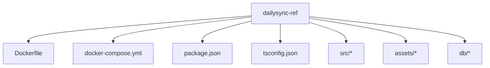
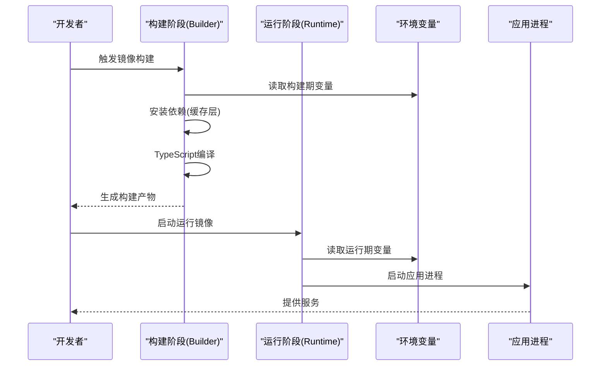
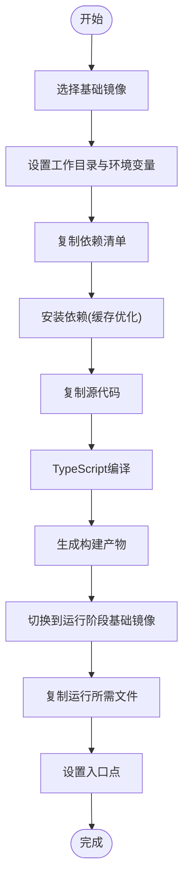
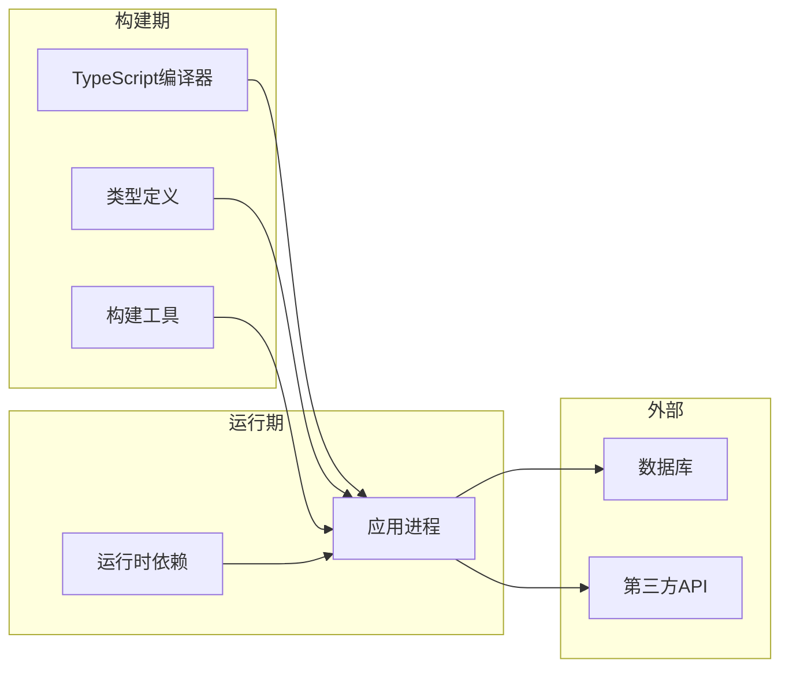

# Docker镜像构建

<cite>
**本文引用的文件**   
- [Dockerfile](file://dailysync-ref/Dockerfile)
- [docker-compose.yml](file://dailysync-ref/docker-compose.yml)
- [package.json](file://dailysync-ref/package.json)
- [tsconfig.json](file://dailysync-ref/tsconfig.json)
- [README.md](file://dailysync-ref/README.md)
</cite>

## 目录
1. [简介](#简介)
2. [项目结构](#项目结构)
3. [核心组件](#核心组件)
4. [架构总览](#架构总览)
5. [详细组件分析](#详细组件分析)
6. [依赖关系分析](#依赖关系分析)
7. [性能考量](#性能考量)
8. [故障排除指南](#故障排除指南)
9. [结论](#结论)
10. [附录](#附录)

## 简介
本文件面向Dailysync系统的Docker镜像构建，围绕仓库中的Dockerfile与相关配置，系统阐述基础镜像选择、Node.js环境配置、依赖安装优化、TypeScript编译配置、多阶段构建策略（开发/生产差异）、环境变量注入机制（数据库连接参数、API密钥管理、运行时配置），以及镜像构建最佳实践（层缓存优化、安全扫描、镜像大小优化）。同时提供自定义镜像构建的命令示例与常见问题排查方法。

## 项目结构
Dailysync-ref为后端服务参考实现，包含TypeScript源码、配置文件与Docker构建产物定义。关键文件包括：
- Dockerfile：定义多阶段构建流程与环境
- docker-compose.yml：编排容器与服务依赖
- package.json：声明Node.js依赖与脚本
- tsconfig.json：TypeScript编译选项
- README.md：使用说明与上下文信息

**图表来源** 
- [Dockerfile](file://dailysync-ref/Dockerfile)
- [docker-compose.yml](file://dailysync-ref/docker-compose.yml)
- [package.json](file://dailysync-ref/package.json)
- [tsconfig.json](file://dailysync-ref/tsconfig.json)

**章节来源**
- [README.md](file://dailysync-ref/README.md)

## 核心组件
- 构建阶段（Builder）：基于Node.js镜像，安装依赖并执行TypeScript编译，产出可执行产物
- 运行阶段（Runtime）：精简的Node.js镜像，仅包含运行时所需文件与依赖，提升安全性与体积
- 环境变量注入：通过Docker环境变量在构建期或运行期注入数据库连接、API密钥等配置
- 脚本与任务：通过package.json定义的脚本驱动构建与运行

**章节来源**
- [Dockerfile](file://dailysync-ref/Dockerfile)
- [package.json](file://dailysync-ref/package.json)
- [tsconfig.json](file://dailysync-ref/tsconfig.json)

## 架构总览
下图展示Dailysync镜像的多阶段构建与运行流程，涵盖从源码到最终镜像的关键步骤。

**图表来源** 
- [Dockerfile](file://dailysync-ref/Dockerfile)
- [docker-compose.yml](file://dailysync-ref/docker-compose.yml)

## 详细组件分析

### Dockerfile指令解析与多阶段构建
- 基础镜像选择：构建阶段使用带完整工具链的Node.js镜像；运行阶段使用轻量级镜像以减少攻击面与体积
- Node.js环境配置：设置工作目录、环境变量、时区与语言环境，确保一致性与稳定性
- 依赖安装优化：先复制依赖清单，再执行安装，充分利用Docker层缓存；区分开发与生产依赖
- TypeScript编译配置：依据tsconfig.json进行编译，输出至指定目录供运行阶段使用
- 多阶段差异：构建阶段包含编译工具与中间产物；运行阶段仅包含运行时必要文件

**图表来源** 
- [Dockerfile](file://dailysync-ref/Dockerfile)

**章节来源**
- [Dockerfile](file://dailysync-ref/Dockerfile)

### Node.js环境与依赖安装优化
- 依赖分层：将package.json与锁文件置于顶层，优先缓存依赖安装层
- 生产依赖隔离：构建阶段安装全部依赖，运行阶段仅拷贝生产依赖，减小镜像体积
- 网络与缓存：合理设置代理与缓存路径，加速依赖下载与构建速度

**章节来源**
- [package.json](file://dailysync-ref/package.json)
- [Dockerfile](file://dailysync-ref/Dockerfile)

### TypeScript编译配置
- 编译目标与模块：根据tsconfig.json设定目标版本与模块系统，确保兼容性
- 输出目录：编译产物输出到独立目录，便于运行阶段只拷贝必要文件
- 类型检查与严格模式：启用严格类型检查，提高代码质量与可维护性

**章节来源**
- [tsconfig.json](file://dailysync-ref/tsconfig.json)
- [Dockerfile](file://dailysync-ref/Dockerfile)

### 环境变量注入机制
- 构建期变量：用于控制构建行为（如是否启用调试、构建标签等）
- 运行期变量：数据库连接参数、API密钥、日志级别、端口等运行时配置
- 注入方式：通过Docker环境变量或编排文件（docker-compose）注入，避免硬编码
- 安全建议：敏感信息不进入镜像层，使用运行时注入与密钥管理服务

**章节来源**
- [Dockerfile](file://dailysync-ref/Dockerfile)
- [docker-compose.yml](file://dailysync-ref/docker-compose.yml)

### 运行入口与进程管理
- 入口点：定义应用启动命令，确保进程在前台运行以便容器管理
- 健康检查：可通过健康检查探针监控服务状态
- 资源限制：在编排文件中设置CPU与内存限制，保障稳定性

**章节来源**
- [Dockerfile](file://dailysync-ref/Dockerfile)
- [docker-compose.yml](file://dailysync-ref/docker-compose.yml)

## 依赖关系分析
- 构建期依赖：TypeScript编译器、类型定义、构建工具
- 运行期依赖：业务逻辑所需的Node.js包
- 外部依赖：数据库、第三方API（通过环境变量注入连接信息）

**图表来源** 
- [package.json](file://dailysync-ref/package.json)
- [tsconfig.json](file://dailysync-ref/tsconfig.json)
- [Dockerfile](file://dailysync-ref/Dockerfile)

**章节来源**
- [package.json](file://dailysync-ref/package.json)
- [tsconfig.json](file://dailysync-ref/tsconfig.json)
- [Dockerfile](file://dailysync-ref/Dockerfile)

## 性能考量
- 层缓存优化：按依赖、源码、编译产物分层，最大化利用缓存
- 镜像大小优化：使用轻量基础镜像、剔除不必要的文件、合并RUN指令
- 并行构建：启用并发编译与依赖安装，缩短构建时间
- 资源限制：在生产环境中限制容器资源，避免争用

[本节为通用指导，无需特定文件引用]

## 故障排除指南
- 构建失败：检查依赖安装错误、TypeScript编译错误、权限问题
- 运行异常：验证环境变量是否正确注入、端口冲突、数据库连接失败
- 镜像过大：分析镜像层内容，移除未使用的依赖与文件
- 性能问题：优化依赖安装顺序、启用缓存、减少镜像层数

**章节来源**
- [Dockerfile](file://dailysync-ref/Dockerfile)
- [docker-compose.yml](file://dailysync-ref/docker-compose.yml)

## 结论
通过多阶段构建与精细化配置，Dailysync镜像实现了构建效率与运行性能的平衡。遵循最佳实践可进一步提升安全性、可维护性与可扩展性。建议在CI/CD流水线中集成安全扫描与自动化测试，确保镜像质量。

[本节为总结性内容，无需特定文件引用]

## 附录

### 自定义镜像构建命令示例
- 构建镜像：使用默认Dockerfile构建镜像
- 指定标签：为镜像添加版本标签便于管理
- 构建参数：通过构建参数控制构建行为

**章节来源**
- [Dockerfile](file://dailysync-ref/Dockerfile)

### 环境变量配置示例
- 数据库连接：配置主机、端口、用户名、密码、数据库名
- API密钥：配置第三方服务访问令牌
- 运行时配置：设置日志级别、端口、功能开关

**章节来源**
- [docker-compose.yml](file://dailysync-ref/docker-compose.yml)
- [Dockerfile](file://dailysync-ref/Dockerfile)

### 安全扫描与合规检查
- 漏洞扫描：使用镜像扫描工具检测已知漏洞
- 合规检查：验证镜像是否符合安全基线
- 签名验证：对镜像进行数字签名确保完整性

[本节为通用指导，无需特定文件引用]