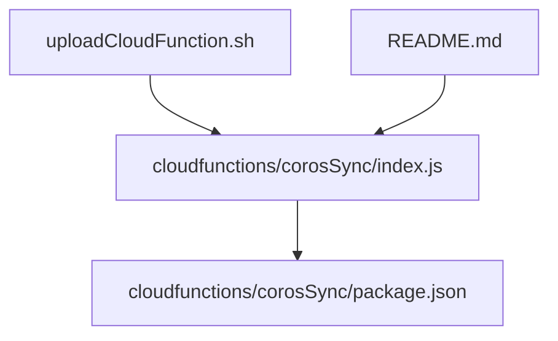
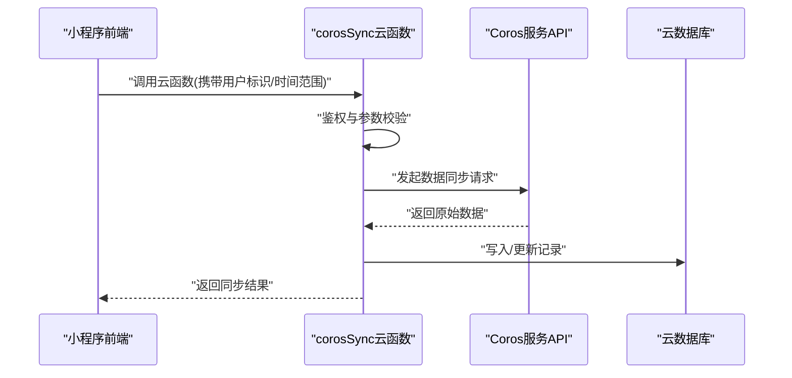
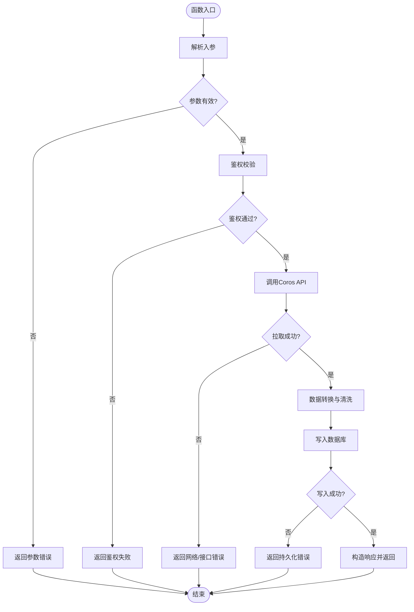
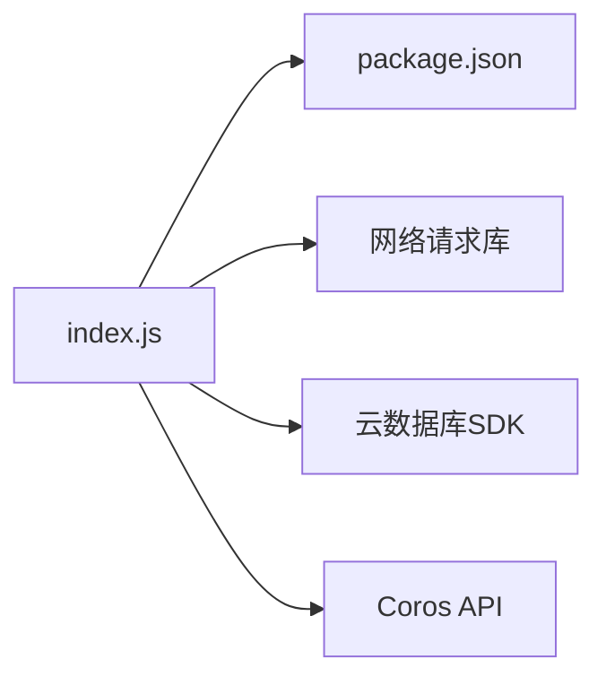

# corosSync云函数部署

<cite>
**本文档引用的文件**   
- [cloudfunctions/corosSync/index.js](file://cloudfunctions/corosSync/index.js)
- [cloudfunctions/corosSync/package.json](file://cloudfunctions/corosSync/package.json)
- [uploadCloudFunction.sh](file://uploadCloudFunction.sh)
- [README.md](file://README.md)
</cite>

## 目录
1. [简介](#简介)
2. [项目结构](#项目结构)
3. [核心组件](#核心组件)
4. [架构总览](#架构总览)
5. [详细组件分析](#详细组件分析)
6. [依赖分析](#依赖分析)
7. [性能考虑](#性能考虑)
8. [故障排查指南](#故障排查指南)
9. [结论](#结论)
10. [附录](#附录)

## 简介
本文件为 corosSync 云函数的完整部署与使用文档，面向开发者与运维人员。内容涵盖：
- 函数职责与数据同步逻辑（与 Coros 设备/服务的数据交互）
- API 调用方式与数据处理流程
- 函数配置参数与环境变量
- 依赖包管理与本地开发环境搭建
- 生产环境部署配置（权限、内存、超时等）
- 错误处理机制、日志记录与调试方法
- 部署脚本示例与常见问题解决方案

## 项目结构
corosSync 云函数位于 cloudfunctions/corosSync 目录下，包含入口文件 index.js 与依赖声明 package.json。根目录提供上传脚本 uploadCloudFunction.sh 用于将云函数发布到云端。

图表来源
- [cloudfunctions/corosSync/index.js](file://cloudfunctions/corosSync/index.js)
- [cloudfunctions/corosSync/package.json](file://cloudfunctions/corosSync/package.json)
- [uploadCloudFunction.sh](file://uploadCloudFunction.sh)
- [README.md](file://README.md)

章节来源
- [cloudfunctions/corosSync/index.js](file://cloudfunctions/corosSync/index.js)
- [cloudfunctions/corosSync/package.json](file://cloudfunctions/corosSync/package.json)
- [uploadCloudFunction.sh](file://uploadCloudFunction.sh)
- [README.md](file://README.md)

## 核心组件
- 入口模块 index.js：定义云函数入口、请求解析、鉴权校验、业务编排、外部 API 调用、数据落库与响应封装。
- 依赖清单 package.json：声明 Node.js 运行版本要求与第三方依赖包。

章节来源
- [cloudfunctions/corosSync/index.js](file://cloudfunctions/corosSync/index.js)
- [cloudfunctions/corosSync/package.json](file://cloudfunctions/corosSync/package.json)

## 架构总览
下图展示了 corosSync 云函数在小程序云环境中的整体交互：前端触发云函数，云函数进行鉴权与参数校验，随后调用 Coros 相关 API 获取或更新数据，最终返回结果给前端。

图表来源
- [cloudfunctions/corosSync/index.js](file://cloudfunctions/corosSync/index.js)

## 详细组件分析

### 入口模块 index.js
- 职责
  - 接收并解析云函数入参（如用户ID、时间范围、分页参数等）
  - 执行鉴权与权限检查
  - 编排数据同步流程：拉取 Coros 数据、转换格式、去重与合并、持久化存储
  - 统一异常捕获与错误码映射
  - 输出结构化响应（含状态码、消息体、耗时统计）
- 关键流程
  - 参数校验：缺失必填字段时快速失败
  - 鉴权：基于用户上下文或签名校验
  - 外部调用：对 Coros API 的 HTTP 请求封装（重试、限流、超时控制）
  - 数据处理：字段映射、单位换算、时间对齐、增量同步策略
  - 数据落库：批量插入/更新，事务性保障
  - 响应封装：成功/失败路径一致的结构化返回

图表来源
- [cloudfunctions/corosSync/index.js](file://cloudfunctions/corosSync/index.js)

章节来源
- [cloudfunctions/corosSync/index.js](file://cloudfunctions/corosSync/index.js)

### 依赖清单 package.json
- 作用
  - 声明 Node.js 版本约束与运行时依赖
  - 便于本地开发与构建时依赖安装
- 关注点
  - 指定 Node.js 版本以匹配云函数运行时
  - 列出网络请求、加密、日期处理等常用库
  - 可选地包含构建脚本与打包优化配置

章节来源
- [cloudfunctions/corosSync/package.json](file://cloudfunctions/corosSync/package.json)

## 依赖分析
- 内部依赖
  - index.js 依赖 package.json 中声明的第三方库
- 外部依赖
  - Coros 开放 API（HTTP/HTTPS）
  - 云数据库（读写操作）
  - 云函数运行时（Node.js）

图表来源
- [cloudfunctions/corosSync/index.js](file://cloudfunctions/corosSync/index.js)
- [cloudfunctions/corosSync/package.json](file://cloudfunctions/corosSync/package.json)

章节来源
- [cloudfunctions/corosSync/index.js](file://cloudfunctions/corosSync/index.js)
- [cloudfunctions/corosSync/package.json](file://cloudfunctions/corosSync/package.json)

## 性能考虑
- 网络层
  - 合理设置超时与重试次数，避免雪崩
  - 使用连接池与并发限制控制外部 API 调用速率
- 数据处理
  - 优先增量同步，减少全量拉取
  - 批量写入数据库，降低 I/O 开销
- 资源分配
  - 根据峰值 QPS 与数据体量调整内存与 CPU
  - 合理设置超时，避免长时间占用实例

[本节为通用指导，不直接分析具体文件]

## 故障排查指南
- 常见错误
  - 参数缺失或类型错误：检查入参结构与必填项
  - 鉴权失败：确认用户上下文、签名或令牌有效性
  - 外部 API 超时/限流：增加重试退避、降级策略
  - 数据库写入失败：检查索引、唯一约束与事务回滚
- 日志与调试
  - 在关键节点打印结构化日志（入参、出参、耗时、错误堆栈）
  - 使用云函数控制台查看运行日志与错误信息
  - 本地模拟请求验证接口契约

章节来源
- [cloudfunctions/corosSync/index.js](file://cloudfunctions/corosSync/index.js)

## 结论
corosSync 云函数作为小程序与 Coros 服务之间的桥梁，负责鉴权、数据拉取、转换与持久化。通过合理的依赖管理、健壮的错误处理与完善的日志体系，可确保稳定高效的同步能力。建议在生产环境严格配置权限、内存与超时，并结合监控告警提升可观测性。

[本节为总结性内容，不直接分析具体文件]

## 附录

### 本地开发环境搭建
- Node.js 版本
  - 参考 package.json 中指定的 Node.js 版本要求
- 依赖安装
  - 使用 npm 或 yarn 安装依赖
- 初始化步骤
  - 进入 cloudfunctions/corosSync 目录
  - 安装依赖后，可通过本地模拟器或 CLI 工具测试函数入口

章节来源
- [cloudfunctions/corosSync/package.json](file://cloudfunctions/corosSync/package.json)

### 生产环境部署配置
- 权限设置
  - 最小权限原则：仅授予必要的数据库读写与网络访问权限
- 内存与超时
  - 根据数据量与并发需求配置内存大小与函数超时
- 环境变量
  - 配置 Coros API 地址、密钥、超时与重试策略等

章节来源
- [cloudfunctions/corosSync/package.json](file://cloudfunctions/corosSync/package.json)

### 部署脚本示例
- 使用根目录提供的 uploadCloudFunction.sh 将云函数上传至云端
- 执行前确保已登录云开发环境并完成必要配置

章节来源
- [uploadCloudFunction.sh](file://uploadCloudFunction.sh)

### 常见问题解决方案
- 依赖安装失败
  - 检查网络镜像源与 Node.js 版本兼容性
- 鉴权失败
  - 核对用户上下文与签名生成逻辑
- 外部 API 不稳定
  - 增加重试与熔断策略，记录失败原因
- 数据库写入冲突
  - 检查唯一键与幂等设计

章节来源
- [cloudfunctions/corosSync/index.js](file://cloudfunctions/corosSync/index.js)