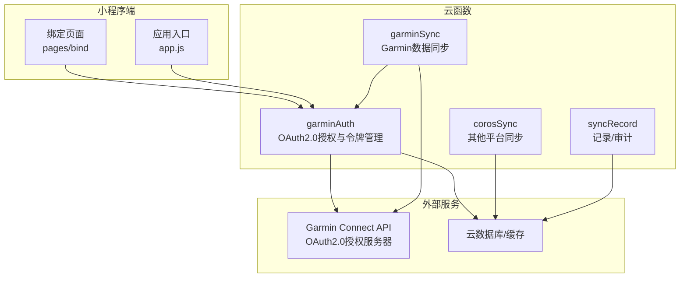
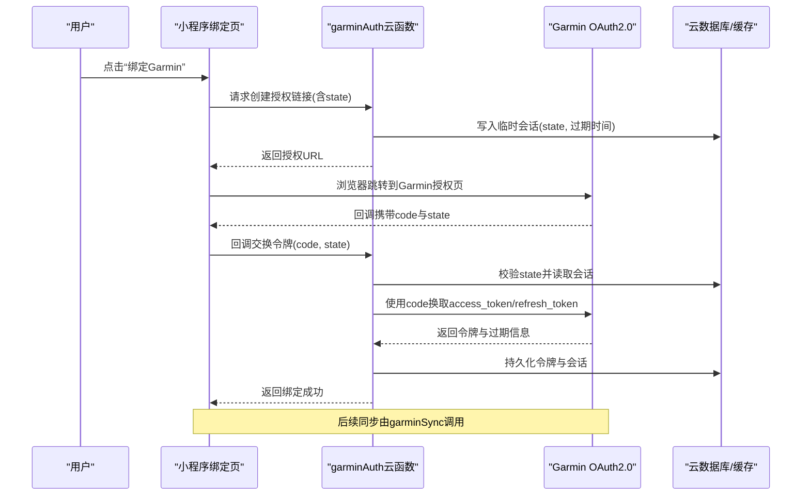
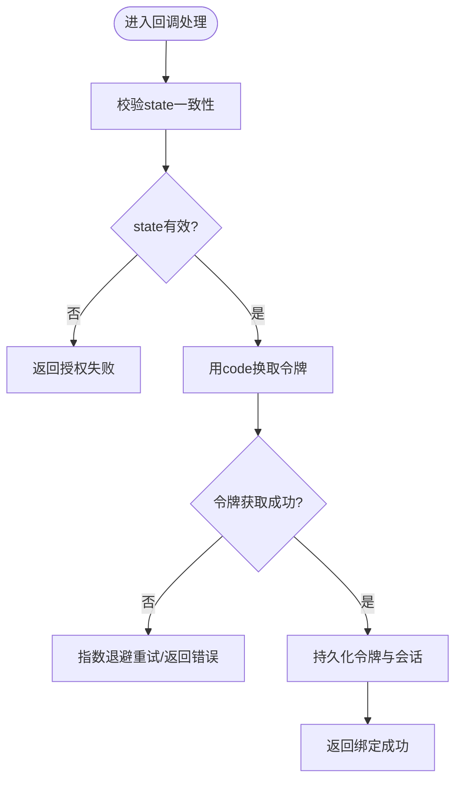
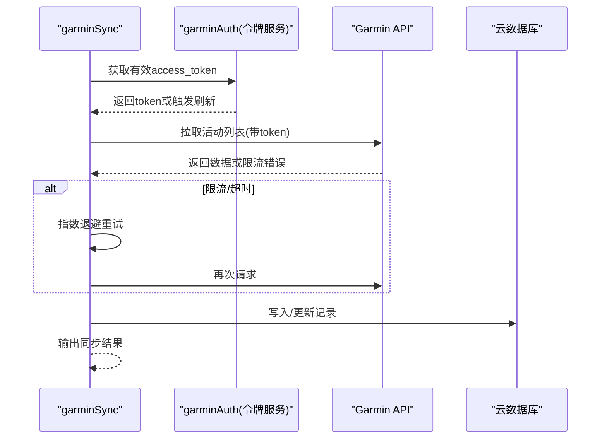
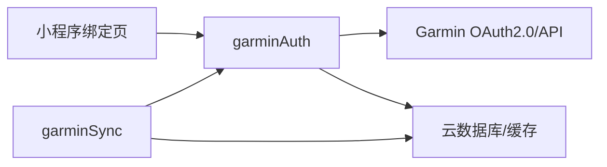

# garminAuth云函数部署

<cite>
**本文引用的文件**   
- [cloudfunctions/garminAuth/index.js](file://cloudfunctions/garminAuth/index.js)
- [cloudfunctions/garminAuth/config.json](file://cloudfunctions/garminAuth/config.json)
- [cloudfunctions/garminAuth/package.json](file://cloudfunctions/garminAuth/package.json)
- [cloudfunctions/garminSync/index.js](file://cloudfunctions/garminSync/index.js)
- [cloudfunctions/garminSync/config.json](file://cloudfunctions/garminSync/config.json)
- [cloudfunctions/garminSync/package.json](file://cloudfunctions/garminSync/package.json)
- [cloudfunctions/corosSync/index.js](file://cloudfunctions/corosSync/index.js)
- [cloudfunctions/syncRecord/index.js](file://cloudfunctions/syncRecord/index.js)
- [miniprogram/pages/bind/bind.js](file://miniprogram/pages/bind/bind.js)
- [miniprogram/app.js](file://miniprogram/app.js)
- [uploadCloudFunction.sh](file://uploadCloudFunction.sh)
</cite>

## 目录
1. [简介](#简介)
2. [项目结构](#项目结构)
3. [核心组件](#核心组件)
4. [架构总览](#架构总览)
5. [详细组件分析](#详细组件分析)
6. [依赖关系分析](#依赖关系分析)
7. [性能考虑](#性能考虑)
8. [故障排除指南](#故障排除指南)
9. [结论](#结论)
10. [附录](#附录)

## 简介
本指南面向在微信小程序云开发环境中部署与运维“garminAuth”云函数的工程师与开发者。文档围绕Garmin OAuth2.0认证流程的实现、令牌与会话管理、配置项说明、本地开发与测试、生产环境安全配置、错误处理与重试机制，以及完整的部署与排障流程进行系统化阐述。目标是帮助读者快速完成从开发到上线的全链路落地，并具备独立排查问题的能力。

## 项目结构
仓库采用多云函数组织方式，其中与Garmin认证相关的主要目录如下：
- cloudfunctions/garminAuth：负责Garmin OAuth2.0授权、回调处理、令牌获取与刷新、会话维护等核心逻辑
- cloudfunctions/garminSync：基于已认证的Garmin账号进行数据同步（依赖认证结果）
- cloudfunctions/corosSync：其他设备/平台的数据同步（示例）
- cloudfunctions/syncRecord：记录同步任务或审计日志（示例）
- miniprogram：小程序前端，包含绑定页面（bind）用于触发认证流程
- uploadCloudFunction.sh：一键上传云函数的脚本

图表来源
- [cloudfunctions/garminAuth/index.js](file://cloudfunctions/garminAuth/index.js)
- [cloudfunctions/garminSync/index.js](file://cloudfunctions/garminSync/index.js)
- [miniprogram/pages/bind/bind.js](file://miniprogram/pages/bind/bind.js)
- [miniprogram/app.js](file://miniprogram/app.js)

章节来源
- [cloudfunctions/garminAuth/index.js](file://cloudfunctions/garminAuth/index.js)
- [cloudfunctions/garminSync/index.js](file://cloudfunctions/garminSync/index.js)
- [miniprogram/pages/bind/bind.js](file://miniprogram/pages/bind/bind.js)
- [miniprogram/app.js](file://miniprogram/app.js)

## 核心组件
- garminAuth云函数
  - 职责：实现Garmin OAuth2.0授权流程、生成授权链接、处理回调、获取并刷新访问令牌、维护用户会话状态
  - 关键能力：
    - 构建授权请求（客户端ID、重定向URI、作用域、状态参数）
    - 回调校验（state一致性、nonce防重放）
    - 令牌获取与刷新（access_token、refresh_token、过期时间）
    - 会话存储（用户标识、令牌元数据、过期策略）
    - 鉴权中间件（校验token有效性、权限范围）
- garminSync云函数
  - 职责：在拥有有效令牌的前提下，调用Garmin API拉取运动数据并进行本地持久化
  - 关键点：复用认证结果、处理速率限制、增量同步、失败重试
- 小程序绑定页
  - 职责：引导用户发起授权、接收云函数返回的跳转链接、回调后展示结果
- 工具与脚本
  - uploadCloudFunction.sh：自动化上传云函数代码至云端

章节来源
- [cloudfunctions/garminAuth/index.js](file://cloudfunctions/garminAuth/index.js)
- [cloudfunctions/garminSync/index.js](file://cloudfunctions/garminSync/index.js)
- [miniprogram/pages/bind/bind.js](file://miniprogram/pages/bind/bind.js)

## 架构总览
下图展示了从用户点击绑定到获得可用令牌的端到端流程，以及后续数据同步的调用链。

图表来源
- [cloudfunctions/garminAuth/index.js](file://cloudfunctions/garminAuth/index.js)
- [miniprogram/pages/bind/bind.js](file://miniprogram/pages/bind/bind.js)

章节来源
- [cloudfunctions/garminAuth/index.js](file://cloudfunctions/garminAuth/index.js)
- [miniprogram/pages/bind/bind.js](file://miniprogram/pages/bind/bind.js)

## 详细组件分析

### garminAuth云函数
- 功能要点
  - 授权链接生成：组装client_id、redirect_uri、scope、state等参数，确保state随机且可验证
  - 回调处理：校验state一致性，防止CSRF；将authorization code换为access_token与refresh_token
  - 令牌管理：缓存access_token并设置过期时间；当接近过期时自动刷新refresh_token
  - 会话维护：以用户标识为键存储令牌元数据，支持跨请求鉴权
  - 错误处理：对网络异常、授权拒绝、code失效等情况进行分类处理与重试策略
- 接口约定（建议）
  - 创建授权链接：POST /auth/start，入参：user_id、scope、redirect_uri
  - 回调处理：GET /auth/callback，入参：code、state
  - 刷新令牌：POST /auth/refresh，入参：user_id、refresh_token
  - 鉴权检查：GET /auth/check，入参：user_id
- 安全最佳实践
  - state必须一次性使用且短生命周期
  - redirect_uri需白名单校验
  - 最小权限scope原则
  - 敏感信息加密存储（如refresh_token）
  - 严格CORS与HTTPS强制

图表来源
- [cloudfunctions/garminAuth/index.js](file://cloudfunctions/garminAuth/index.js)

章节来源
- [cloudfunctions/garminAuth/index.js](file://cloudfunctions/garminAuth/index.js)

### garminSync云函数
- 功能要点
  - 依赖认证结果：调用前校验access_token有效性，必要时触发刷新
  - 数据拉取：分页拉取活动记录，去重与增量更新
  - 失败重试：对限流与瞬时错误实施指数退避与最大重试次数控制
  - 幂等性：通过唯一业务键避免重复写入
- 与garminAuth协作
  - 通过共享会话/令牌存储获取有效令牌
  - 遇到令牌过期自动刷新后再重试

图表来源
- [cloudfunctions/garminSync/index.js](file://cloudfunctions/garminSync/index.js)
- [cloudfunctions/garminAuth/index.js](file://cloudfunctions/garminAuth/index.js)

章节来源
- [cloudfunctions/garminSync/index.js](file://cloudfunctions/garminSync/index.js)
- [cloudfunctions/garminAuth/index.js](file://cloudfunctions/garminAuth/index.js)

### 小程序绑定页
- 交互流程
  - 用户点击绑定按钮，调用云函数获取授权链接
  - 打开浏览器进行授权，回调到小程序指定页面
  - 解析回调参数并通知后端完成令牌交换
- 注意事项
  - 正确传递state并校验
  - 处理回调延迟与网络异常
  - 明确错误提示与重试入口

章节来源
- [miniprogram/pages/bind/bind.js](file://miniprogram/pages/bind/bind.js)

## 依赖关系分析
- 模块耦合
  - garminAuth为认证中心，被garminSync等下游云函数依赖
  - 小程序绑定页仅与garminAuth交互，不直接访问Garmin API
- 外部依赖
  - Garmin OAuth2.0授权服务器与API
  - 云数据库/缓存（用于会话与令牌存储）
- 潜在循环依赖
  - 应避免garminSync反向依赖garminAuth的业务逻辑，仅通过接口获取令牌

图表来源
- [cloudfunctions/garminAuth/index.js](file://cloudfunctions/garminAuth/index.js)
- [cloudfunctions/garminSync/index.js](file://cloudfunctions/garminSync/index.js)
- [miniprogram/pages/bind/bind.js](file://miniprogram/pages/bind/bind.js)

章节来源
- [cloudfunctions/garminAuth/index.js](file://cloudfunctions/garminAuth/index.js)
- [cloudfunctions/garminSync/index.js](file://cloudfunctions/garminSync/index.js)
- [miniprogram/pages/bind/bind.js](file://miniprogram/pages/bind/bind.js)

## 性能考虑
- 令牌缓存
  - access_token短期缓存，减少频繁网络请求
  - refresh_token仅在过期或接近过期时刷新
- 并发与限流
  - 对Garmin API调用实施并发上限与队列化
  - 针对429响应实现指数退避重试
- 存储优化
  - 使用TTL策略清理过期会话
  - 增量同步避免全量覆盖
- 冷启动优化
  - 云函数内预加载必要依赖
  - 连接池复用（如HTTP客户端）

[本节为通用指导，无需特定文件引用]

## 故障排除指南
- 常见问题定位
  - 授权失败：检查state一致性、redirect_uri白名单、scope权限
  - 令牌无效：确认access_token未过期、refresh_token未被吊销
  - 回调异常：核对回调地址、域名与HTTPS配置
  - 同步失败：查看限流错误码、网络超时、数据去重键冲突
- 日志与监控
  - 记录关键步骤：授权开始、回调处理、令牌交换、API调用、错误堆栈
  - 指标上报：成功率、平均耗时、重试次数、过期率
- 重试策略
  - 指数退避：初始间隔递增，设置最大重试次数
  - 熔断降级：连续失败达到阈值后暂停调用，等待恢复
- 回滚与应急
  - 保留上一版本云函数快照
  - 提供手动刷新令牌与重置会话的运维接口

章节来源
- [cloudfunctions/garminAuth/index.js](file://cloudfunctions/garminAuth/index.js)
- [cloudfunctions/garminSync/index.js](file://cloudfunctions/garminSync/index.js)

## 结论
通过本指南，您可以完成garminAuth云函数的本地开发、测试与生产部署，并建立健壮的OAuth2.0认证与令牌管理体系。结合合理的错误处理、重试机制与安全配置，能够保障Garmin数据同步的稳定性和安全性。建议在上线前进行充分的端到端测试与压力测试，并持续监控关键指标以便快速定位问题。

[本节为总结性内容，无需特定文件引用]

## 附录

### config.json配置结构与参数说明
- 位置：cloudfunctions/garminAuth/config.json
- 关键字段建议
  - client_id：Garmin应用客户端ID
  - client_secret：Garmin应用客户端密钥
  - redirect_uri：授权回调地址（需与Garmin后台一致）
  - scope：所需权限范围（最小化原则）
  - token_store：令牌存储策略（内存/数据库/缓存）
  - session_ttl：会话过期时间（秒）
  - retry：重试策略（max_retries、backoff_base、backoff_max）
  - cors：跨域配置（allowed_origins、methods、headers）
  - https_only：是否强制HTTPS
- 注意
  - 所有敏感字段在生产环境应通过环境变量注入
  - redirect_uri必须与小程序云函数域名一致

章节来源
- [cloudfunctions/garminAuth/config.json](file://cloudfunctions/garminAuth/config.json)

### 本地开发环境与模拟测试
- 前置准备
  - 安装Node.js与云开发CLI
  - 配置小程序项目与云开发环境
- 模拟测试
  - 使用Mock服务器模拟Garmin授权与回调
  - 构造有效的code与state，验证令牌交换流程
  - 模拟限流与超时场景，验证重试与熔断
- 真实API测试
  - 在沙箱环境申请测试账号
  - 逐步放开权限范围，验证各接口可用性
  - 记录错误码与响应格式，完善错误映射

章节来源
- [cloudfunctions/garminAuth/index.js](file://cloudfunctions/garminAuth/index.js)
- [cloudfunctions/garminSync/index.js](file://cloudfunctions/garminSync/index.js)

### 生产环境安全配置
- HTTPS
  - 强制启用HTTPS，禁用不安全协议
  - 证书管理与自动续期
- CORS
  - 限定允许的源、方法与头部
  - 禁止通配符*在生产环境
- 访问控制
  - 最小权限原则，按角色分配scope
  - IP白名单与地域限制（如适用）
- 密钥管理
  - 使用环境变量或密钥管理服务
  - 定期轮换client_secret与refresh_token

章节来源
- [cloudfunctions/garminAuth/config.json](file://cloudfunctions/garminAuth/config.json)

### 完整部署流程
- 准备阶段
  - 更新config.json与环境变量
  - 运行单元测试与集成测试
- 上传云函数
  - 使用uploadCloudFunction.sh脚本上传garminAuth与依赖云函数
  - 校验版本号与发布分支
- 灰度发布
  - 先对小部分用户开放，观察错误率与性能指标
  - 逐步扩大范围直至全量
- 监控与告警
  - 配置关键指标告警（失败率、延迟、令牌过期率）
  - 建立日志聚合与检索能力

章节来源
- [uploadCloudFunction.sh](file://uploadCloudFunction.sh)
- [cloudfunctions/garminAuth/index.js](file://cloudfunctions/garminAuth/index.js)
- [cloudfunctions/garminSync/index.js](file://cloudfunctions/garminSync/index.js)

### 错误处理与重试机制设计
- 分类处理
  - 网络错误：重试+退避
  - 授权错误：提示用户重新授权
  - 令牌过期：自动刷新后重试
  - 限流错误：退避+队列化
- 幂等与去重
  - 使用业务主键避免重复写入
  - 记录操作流水便于追溯
- 降级策略
  - 暂时关闭非核心功能
  - 返回友好错误消息与重试建议

章节来源
- [cloudfunctions/garminAuth/index.js](file://cloudfunctions/garminAuth/index.js)
- [cloudfunctions/garminSync/index.js](file://cloudfunctions/garminSync/index.js)