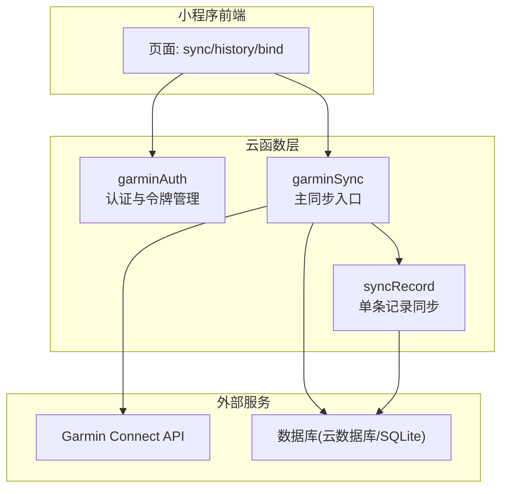
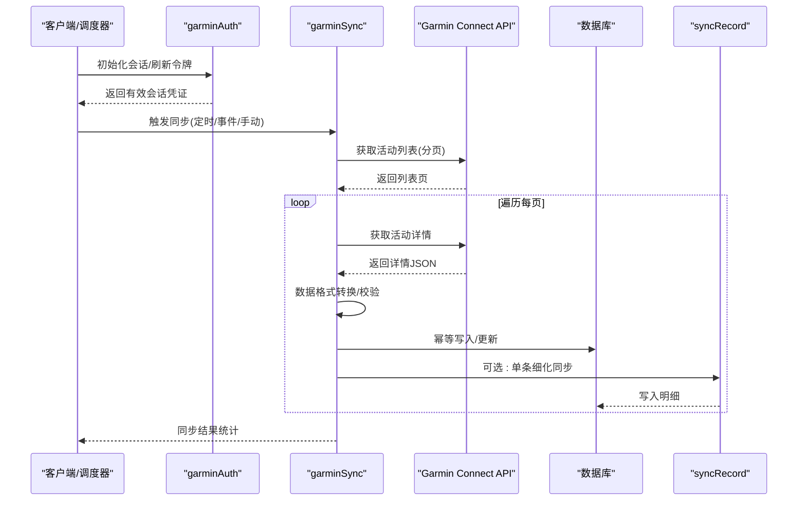
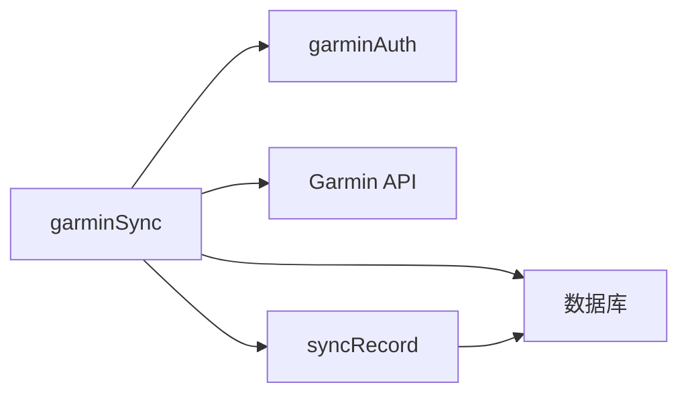

# garminSync云函数部署

<cite>
**本文引用的文件**   
- [cloudfunctions/garminSync/index.js](file://cloudfunctions/garminSync/index.js)
- [cloudfunctions/garminSync/config.json](file://cloudfunctions/garminSync/config.json)
- [cloudfunctions/garminSync/package.json](file://cloudfunctions/garminSync/package.json)
- [cloudfunctions/garminAuth/index.js](file://cloudfunctions/garminAuth/index.js)
- [cloudfunctions/garminAuth/config.json](file://cloudfunctions/garminAuth/config.json)
- [cloudfunctions/syncRecord/index.js](file://cloudfunctions/syncRecord/index.js)
- [dailysync-ref/src/utils/garmin_common.ts](file://dailysync-ref/src/utils/garmin_common.ts)
- [dailysync-ref/src/utils/sqlite.ts](file://dailysync-ref/src/utils/sqlite.ts)
- [dailysync-ref/src/constant.ts](file://dailysync-ref/src/constant.ts)
- [dailysync-ref/docker-compose.yml](file://dailysync-ref/docker-compose.yml)
- [dailysync-ref/Dockerfile](file://dailysync-ref/Dockerfile)
- [dailysync-ref/.github/workflows/daily_sync_rq.yml](file://dailysync-ref/.github/workflows/daily_sync_rq.yml)
</cite>

## 目录
1. [简介](#简介)
2. [项目结构](#项目结构)
3. [核心组件](#核心组件)
4. [架构总览](#架构总览)
5. [详细组件分析](#详细组件分析)
6. [依赖关系分析](#依赖关系分析)
7. [性能考虑](#性能考虑)
8. [故障排查指南](#故障排查指南)
9. [结论](#结论)
10. [附录](#附录)

## 简介
本文件为 garminSync 云函数的完整部署与使用文档，面向开发与运维人员。内容涵盖：
- Garmin 数据同步的核心能力：运动记录获取、数据格式转换、数据库操作
- config.json 配置项说明（API 端点、请求头、分页参数等）
- 同步触发机制：定时任务、事件驱动、手动触发
- 本地开发环境搭建：模拟 Garmin API 响应、数据库连接配置
- 生产环境优化：并发控制、缓存策略、错误重试
- 数据一致性与冲突解决
- 监控告警与日志分析

## 项目结构
仓库包含微信小程序前端、多个云函数以及 dailysync-ref 参考实现。garminSync 云函数位于 cloudfunctions/garminSync，其认证相关逻辑在 cloudfunctions/garminAuth，记录级同步在 cloudfunctions/syncRecord。dailysync-ref 提供 TypeScript 参考实现，包括 Garmin 通用工具、SQLite 操作、常量定义、Docker 编排与 GitHub Actions 工作流。

图表来源
- [cloudfunctions/garminSync/index.js](file://cloudfunctions/garminSync/index.js)
- [cloudfunctions/garminAuth/index.js](file://cloudfunctions/garminAuth/index.js)
- [cloudfunctions/syncRecord/index.js](file://cloudfunctions/syncRecord/index.js)

章节来源
- [cloudfunctions/garminSync/index.js](file://cloudfunctions/garminSync/index.js)
- [cloudfunctions/garminAuth/index.js](file://cloudfunctions/garminAuth/index.js)
- [cloudfunctions/syncRecord/index.js](file://cloudfunctions/syncRecord/index.js)

## 核心组件
- garminSync 云函数
  - 职责：协调 Garmin 登录态、拉取活动列表与详情、数据转换、入库与幂等处理
  - 关键流程：鉴权 -> 分页拉取 -> 去重 -> 转换 -> 批量写入 -> 结果上报
- garminAuth 云函数
  - 职责：封装 Garmin 登录、Cookie/Token 获取与刷新、会话保持
- syncRecord 云函数
  - 职责：对单条运动记录进行增量同步与更新
- dailysync-ref 参考实现
  - 提供 Garmin 通用工具、SQLite 持久化、常量与脚本，便于本地调试与离线验证

章节来源
- [cloudfunctions/garminSync/index.js](file://cloudfunctions/garminSync/index.js)
- [cloudfunctions/garminAuth/index.js](file://cloudfunctions/garminAuth/index.js)
- [cloudfunctions/syncRecord/index.js](file://cloudfunctions/syncRecord/index.js)
- [dailysync-ref/src/utils/garmin_common.ts](file://dailysync-ref/src/utils/garmin_common.ts)
- [dailysync-ref/src/utils/sqlite.ts](file://dailysync-ref/src/utils/sqlite.ts)

## 架构总览
garminSync 采用“认证-拉取-转换-入库”的分层架构，通过云函数作为统一入口，结合外部 Garmin API 与内部数据库完成端到端同步。

图表来源
- [cloudfunctions/garminSync/index.js](file://cloudfunctions/garminSync/index.js)
- [cloudfunctions/garminAuth/index.js](file://cloudfunctions/garminAuth/index.js)
- [cloudfunctions/syncRecord/index.js](file://cloudfunctions/syncRecord/index.js)

## 详细组件分析

### garminSync 云函数
- 功能要点
  - 调用认证模块获取或刷新会话
  - 分页拉取活动列表，按时间范围过滤
  - 逐条拉取详情并进行格式转换
  - 基于唯一键进行幂等写入，避免重复
  - 汇总统计并返回结果
- 关键数据结构
  - 活动列表项：包含 ID、时间戳、类型等
  - 活动详情：包含轨迹、配速、心率等字段
  - 转换后模型：统一字段名、单位与精度
- 错误处理
  - 网络异常重试与退避
  - 解析失败降级与跳过
  - 事务回滚与部分成功上报

```mermaid
flowchart TD
Start(["开始"]) --> CheckAuth["检查/刷新认证状态"]
CheckAuth --> |失败| ErrAuth["记录错误并退出"]
CheckAuth --> |成功| FetchList["分页获取活动列表"]
FetchList --> HasMore{"是否还有下一页?"}
HasMore --> |是| NextPage["读取下一页"] --> FetchList
HasDetail["获取活动详情"] --> Transform["数据转换与校验"]
Transform --> Upsert["幂等写入/更新"]
Upsert --> Stats["累计统计"]
Stats --> HasMore
HasMore --> |否| End(["结束"])
ErrAuth --> End
```

图表来源
- [cloudfunctions/garminSync/index.js](file://cloudfunctions/garminSync/index.js)

章节来源
- [cloudfunctions/garminSync/index.js](file://cloudfunctions/garminSync/index.js)

### garminAuth 云函数
- 功能要点
  - 封装 Garmin 登录流程，获取 Cookie/Token
  - 维护会话有效期，支持自动刷新
  - 对外暴露统一的鉴权接口供其他云函数调用
- 安全建议
  - 敏感信息仅存于环境变量或密钥管理服务
  - 限制调用来源与频率

章节来源
- [cloudfunctions/garminAuth/index.js](file://cloudfunctions/garminAuth/index.js)

### syncRecord 云函数
- 功能要点
  - 针对单条记录的增量同步，支持更新与补全
  - 与主同步配合，保证细粒度一致性
- 适用场景
  - 用户主动刷新某条记录
  - 后台修复或补充缺失字段

章节来源
- [cloudfunctions/syncRecord/index.js](file://cloudfunctions/syncRecord/index.js)

### dailysync-ref 参考实现
- 作用
  - 提供 Garmin 通用工具、SQLite 持久化、常量定义与脚本
  - 用于本地调试、离线验证与快速原型
- 关键文件
  - garmin_common.ts：Garmin 通用方法
  - sqlite.ts：SQLite 读写封装
  - constant.ts：常量与默认值
  - docker-compose.yml / Dockerfile：本地容器化运行
  - .github/workflows/daily_sync_rq.yml：定时任务示例

章节来源
- [dailysync-ref/src/utils/garmin_common.ts](file://dailysync-ref/src/utils/garmin_common.ts)
- [dailysync-ref/src/utils/sqlite.ts](file://dailysync-ref/src/utils/sqlite.ts)
- [dailysync-ref/src/constant.ts](file://dailysync-ref/src/constant.ts)
- [dailysync-ref/docker-compose.yml](file://dailysync-ref/docker-compose.yml)
- [dailysync-ref/Dockerfile](file://dailysync-ref/Dockerfile)
- [dailysync-ref/.github/workflows/daily_sync_rq.yml](file://dailysync-ref/.github/workflows/daily_sync_rq.yml)

## 依赖关系分析
- 云函数间依赖
  - garminSync 依赖 garminAuth 的鉴权能力
  - garminSync 可调用 syncRecord 做细粒度同步
- 外部依赖
  - Garmin Connect API：需要有效的会话与限流策略
  - 数据库：云数据库或 SQLite（本地）
- 参考实现依赖
  - TypeScript 工具库、SQLite 驱动、Docker 运行时

图表来源
- [cloudfunctions/garminSync/index.js](file://cloudfunctions/garminSync/index.js)
- [cloudfunctions/garminAuth/index.js](file://cloudfunctions/garminAuth/index.js)
- [cloudfunctions/syncRecord/index.js](file://cloudfunctions/syncRecord/index.js)

章节来源
- [cloudfunctions/garminSync/index.js](file://cloudfunctions/garminSync/index.js)
- [cloudfunctions/garminAuth/index.js](file://cloudfunctions/garminAuth/index.js)
- [cloudfunctions/syncRecord/index.js](file://cloudfunctions/syncRecord/index.js)

## 性能考虑
- 并发控制
  - 分页拉取时限制并发度，避免触发 Garmin 限流
  - 写入阶段使用批处理与事务，减少锁竞争
- 缓存策略
  - 对活动列表与热点详情设置短期缓存，降低重复请求
  - 缓存失效策略基于时间戳与版本号
- 错误重试
  - 指数退避重试，区分可重试与不可重试错误
  - 失败记录进入死信队列，支持人工干预
- 资源隔离
  - 不同用户会话独立上下文，避免跨用户污染
  - 合理设置内存与超时，防止长任务阻塞

[本节为通用指导，不直接分析具体文件]

## 故障排查指南
- 常见问题
  - 认证失败：检查会话有效期、Cookie/Token 是否正确传递
  - 拉取超时：调整并发与重试策略，关注 Garmin 限流提示
  - 数据不一致：核对唯一键与幂等写入逻辑，检查事务回滚
  - 解析错误：定位 JSON 结构变更，增加容错与降级
- 日志与监控
  - 关键节点埋点：认证、拉取、转换、写入、重试
  - 指标采集：成功率、耗时、失败原因分布、吞吐
  - 告警规则：连续失败、延迟阈值、资源水位

章节来源
- [cloudfunctions/garminSync/index.js](file://cloudfunctions/garminSync/index.js)
- [cloudfunctions/garminAuth/index.js](file://cloudfunctions/garminAuth/index.js)
- [cloudfunctions/syncRecord/index.js](file://cloudfunctions/syncRecord/index.js)

## 结论
garminSync 云函数以清晰的职责划分与稳健的错误处理，实现了从 Garmin 到数据库的可靠同步。通过合理的并发、缓存与重试策略，可在生产环境中稳定运行。结合 dailysync-ref 参考实现，可快速完成本地调试与验证。

[本节为总结性内容，不直接分析具体文件]

## 附录

### config.json 配置项说明（以 garminSync 为例）
- API 端点
  - base_url：Garmin API 基础地址
  - list_endpoint：活动列表接口路径
  - detail_endpoint：活动详情接口路径
- 请求头设置
  - headers：通用请求头（如 User-Agent、Accept-Language）
  - auth_headers：鉴权相关头（如 Cookie、Authorization）
- 分页参数
  - page_size：每页数量
  - max_pages：最大页数限制
  - sort_by：排序字段（如 start_date_local）
- 时间与过滤
  - start_time：起始时间
  - end_time：结束时间
  - activity_types：活动类型白名单
- 数据库与幂等
  - db_table：目标表名
  - unique_keys：唯一键数组（如 id、start_date_local）
  - batch_size：批量写入大小
- 重试与超时
  - retry_times：重试次数
  - retry_backoff：退避策略（如 exponential）
  - timeout_ms：请求超时
- 日志与监控
  - log_level：日志级别
  - metrics_enabled：是否采集指标

章节来源
- [cloudfunctions/garminSync/config.json](file://cloudfunctions/garminSync/config.json)
- [cloudfunctions/garminAuth/config.json](file://cloudfunctions/garminAuth/config.json)

### 触发机制
- 定时任务
  - 使用平台定时触发器或外部调度（如 GitHub Actions、Cron）
  - 每日/每周执行，覆盖最近 N 天数据
- 事件驱动
  - 监听用户绑定/解绑、设备更新等事件
  - 触发增量同步
- 手动触发
  - 通过小程序按钮或管理后台调用云函数
  - 支持指定时间范围与活动类型

章节来源
- [dailysync-ref/.github/workflows/daily_sync_rq.yml](file://dailysync-ref/.github/workflows/daily_sync_rq.yml)

### 本地开发环境配置
- 模拟 Garmin API
  - 使用 mock 服务器返回固定 JSON 响应
  - 覆盖正常、分页、错误与边界场景
- 数据库连接
  - 本地 SQLite 文件路径
  - 表结构与索引创建脚本
- 运行方式
  - 使用 Docker Compose 启动服务与数据库
  - 环境变量注入敏感配置

章节来源
- [dailysync-ref/docker-compose.yml](file://dailysync-ref/docker-compose.yml)
- [dailysync-ref/Dockerfile](file://dailysync-ref/Dockerfile)
- [dailysync-ref/src/utils/sqlite.ts](file://dailysync-ref/src/utils/sqlite.ts)

### 数据一致性与冲突解决
- 幂等写入
  - 基于唯一键判断是否存在，存在则更新，不存在则插入
- 版本控制
  - 引入版本号或时间戳字段，避免旧数据覆盖新数据
- 冲突检测
  - 对比源端与目标端差异，选择合并策略（最新优先/保留非空字段）
- 事务保障
  - 批量写入使用事务，失败回滚，保证原子性

章节来源
- [cloudfunctions/garminSync/index.js](file://cloudfunctions/garminSync/index.js)
- [dailysync-ref/src/utils/sqlite.ts](file://dailysync-ref/src/utils/sqlite.ts)

### 监控告警与日志分析
- 指标采集
  - 同步成功率、平均耗时、失败率、吞吐
- 告警规则
  - 连续失败超过阈值、延迟超过 SLA、资源水位告警
- 日志分析
  - 关键字段：请求ID、用户ID、活动ID、状态码、错误码
  - 聚合维度：按小时/天统计，定位瓶颈与异常

章节来源
- [cloudfunctions/garminSync/index.js](file://cloudfunctions/garminSync/index.js)