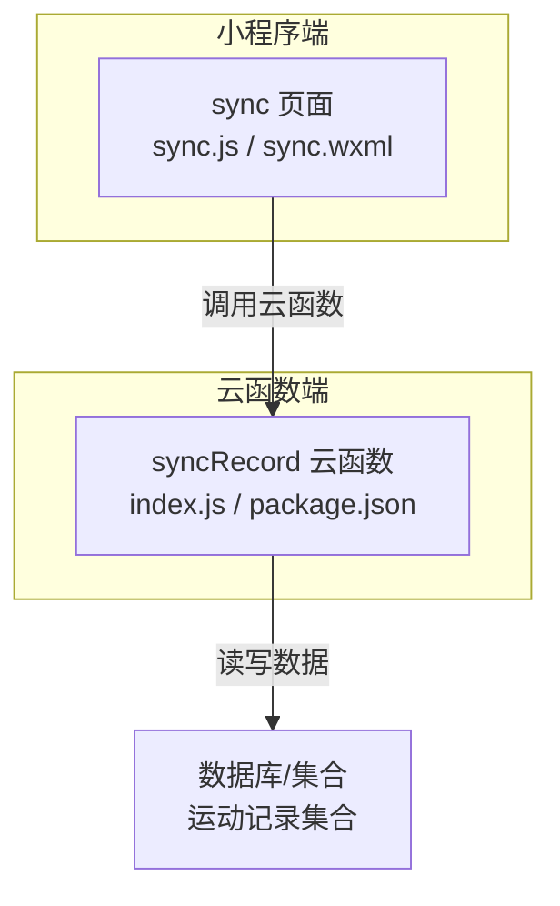
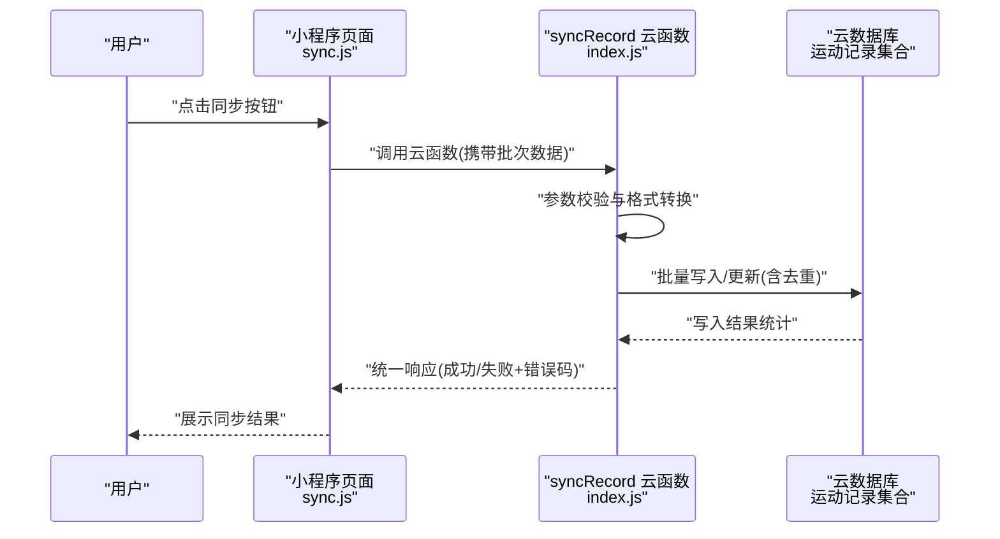
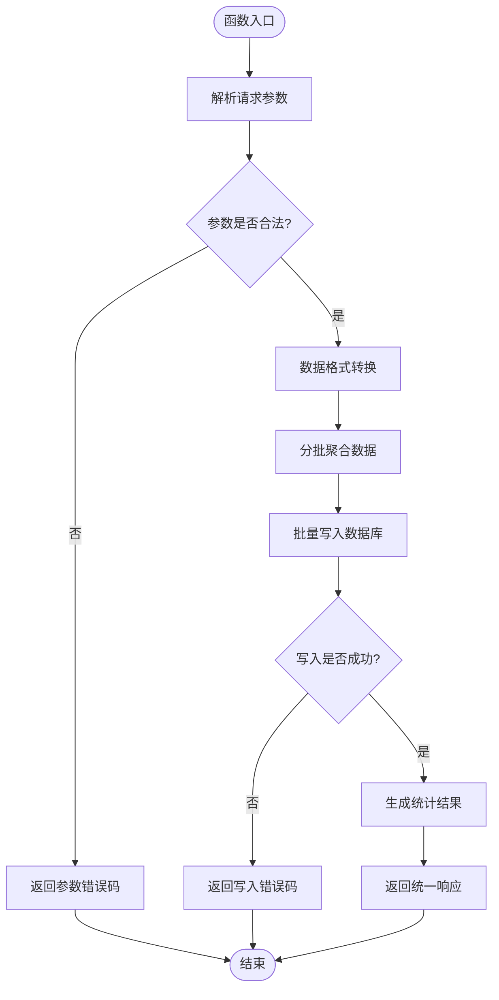
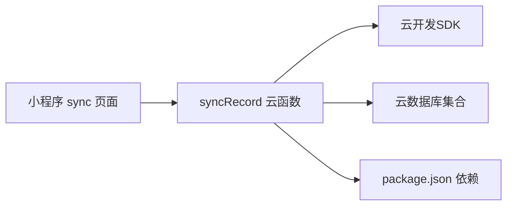

# syncRecord云函数部署

<cite>
**本文引用的文件**   
- [cloudfunctions/syncRecord/index.js](file://cloudfunctions/syncRecord/index.js)
- [cloudfunctions/syncRecord/package.json](file://cloudfunctions/syncRecord/package.json)
- [miniprogram/pages/sync/sync.js](file://miniprogram/pages/sync/sync.js)
- [miniprogram/pages/sync/sync.wxml](file://miniprogram/pages/sync/sync.wxml)
- [README.md](file://README.md)
</cite>

## 目录
1. [简介](#简介)
2. [项目结构](#项目结构)
3. [核心组件](#核心组件)
4. [架构总览](#架构总览)
5. [详细组件分析](#详细组件分析)
6. [依赖分析](#依赖分析)
7. [性能考虑](#性能考虑)
8. [故障排查指南](#故障排查指南)
9. [结论](#结论)
10. [附录](#附录)

## 简介
本指南面向需要部署与运维“syncRecord”云函数的工程师，围绕运动记录同步场景，提供从本地开发到生产部署的完整说明。内容涵盖：
- 数据验证、格式转换与批量处理流程
- 函数输入输出接口定义（请求参数、响应格式、错误码规范）
- 数据持久化策略（表结构设计、索引优化、查询调优）
- 本地开发与测试环境搭建（Mock服务、测试数据）
- 生产环境部署配置（资源限制、扩展策略、备份恢复）
- 数据完整性校验与异常处理机制
- 性能监控与调试工具使用方法

## 项目结构
本项目采用小程序 + 云函数架构。前端位于 miniprogram 目录，云函数位于 cloudfunctions 目录。本次重点为 cloudfunctions/syncRecord 模块，以及小程序端触发同步的页面逻辑。

图表来源
- [cloudfunctions/syncRecord/index.js](file://cloudfunctions/syncRecord/index.js)
- [cloudfunctions/syncRecord/package.json](file://cloudfunctions/syncRecord/package.json)
- [miniprogram/pages/sync/sync.js](file://miniprogram/pages/sync/sync.js)
- [miniprogram/pages/sync/sync.wxml](file://miniprogram/pages/sync/sync.wxml)

章节来源
- [README.md](file://README.md)

## 核心组件
- 云函数入口：负责接收小程序端请求、进行参数校验、调用数据层完成批量写入或更新、返回统一响应。
- 小程序端触发器：在 sync 页面中发起云函数调用，展示同步状态与结果。
- 数据层：基于云数据库集合存储运动记录，支持去重、增量同步与批量操作。

章节来源
- [cloudfunctions/syncRecord/index.js](file://cloudfunctions/syncRecord/index.js)
- [cloudfunctions/syncRecord/package.json](file://cloudfunctions/syncRecord/package.json)
- [miniprogram/pages/sync/sync.js](file://miniprogram/pages/sync/sync.js)

## 架构总览
下图展示了从用户触发到数据落库的整体流程，包括请求校验、数据转换、批量写入与结果回传。

图表来源
- [cloudfunctions/syncRecord/index.js](file://cloudfunctions/syncRecord/index.js)
- [miniprogram/pages/sync/sync.js](file://miniprogram/pages/sync/sync.js)

## 详细组件分析

### 云函数入口（syncRecord）
职责与流程要点：
- 请求入口：解析并校验入参，确保必填字段存在且类型正确。
- 数据验证：对每条记录的字段范围、时间戳、单位等进行校验，过滤非法数据。
- 格式转换：将外部数据源格式转换为内部标准结构（如时间、距离、配速等）。
- 批量处理：按批次聚合写入，减少数据库往返；实现幂等与去重（基于唯一键）。
- 事务与一致性：在可能的情况下使用事务保证批量写入的一致性。
- 错误处理：捕获异常并分类返回错误码，便于前端定位问题。
- 日志与监控：记录关键步骤耗时与统计信息，便于排障与性能分析。

图表来源
- [cloudfunctions/syncRecord/index.js](file://cloudfunctions/syncRecord/index.js)

章节来源
- [cloudfunctions/syncRecord/index.js](file://cloudfunctions/syncRecord/index.js)
- [cloudfunctions/syncRecord/package.json](file://cloudfunctions/syncRecord/package.json)

### 小程序端触发器（sync 页面）
职责与流程要点：
- 收集待同步数据：从本地缓存或上游接口获取原始数据。
- 构造请求体：按照云函数接口定义组装参数，包含批次大小控制。
- 调用云函数：异步调用并处理回调，显示进度与结果。
- 错误重试：根据错误码决定重试策略（如网络错误可指数退避重试）。
- 结果展示：将成功/失败统计与明细反馈给用户。

章节来源
- [miniprogram/pages/sync/sync.js](file://miniprogram/pages/sync/sync.js)
- [miniprogram/pages/sync/sync.wxml](file://miniprogram/pages/sync/sync.wxml)

## 依赖分析
- 运行时依赖：Node.js 环境与云函数 SDK（由云开发平台提供）。
- 业务依赖：云数据库集合（运动记录）、可选的外部数据源（如 Garmin/Strava 等，若集成）。
- 包管理：package.json 声明依赖与脚本命令，便于本地模拟与打包。

图表来源
- [cloudfunctions/syncRecord/package.json](file://cloudfunctions/syncRecord/package.json)
- [cloudfunctions/syncRecord/index.js](file://cloudfunctions/syncRecord/index.js)
- [miniprogram/pages/sync/sync.js](file://miniprogram/pages/sync/sync.js)

章节来源
- [cloudfunctions/syncRecord/package.json](file://cloudfunctions/syncRecord/package.json)

## 性能考虑
- 批量写入：合并多条记录为一次批量操作，降低数据库往返次数。
- 去重与幂等：基于唯一键（如设备ID+时间戳+运动类型）避免重复写入。
- 分页与限流：控制单次批次大小，避免超时与内存溢出。
- 索引设计：为高频查询字段建立索引（如用户ID、时间范围、运动类型），提升查询效率。
- 连接池与并发：合理设置并发度，避免数据库连接耗尽。
- 缓存热点：对只读或低频变更的数据使用缓存，减轻数据库压力。

[本节为通用性能建议，不直接分析具体文件]

## 故障排查指南
常见问题与定位方法：
- 参数校验失败：检查请求体结构与字段类型，核对必填项与取值范围。
- 数据转换异常：确认时间戳格式、单位换算与空值处理逻辑。
- 批量写入失败：查看错误码与日志，定位是权限、约束冲突还是网络问题。
- 重复数据：检查去重键设计与幂等逻辑，必要时清理脏数据后重试。
- 性能瓶颈：通过监控指标观察慢查询与高延迟点，优化索引与批次大小。

章节来源
- [cloudfunctions/syncRecord/index.js](file://cloudfunctions/syncRecord/index.js)

## 结论
syncRecord 云函数作为运动记录同步的核心组件，需严格把控数据质量与写入一致性。通过合理的参数校验、格式转换、批量处理与索引优化，可在保障稳定性的同时提升吞吐与响应速度。建议在本地充分测试后再发布至生产，并配合完善的监控与告警机制。

[本节为总结性内容，不直接分析具体文件]

## 附录

### 接口定义（请求与响应）
- 请求参数
  - 字段名：user_id（用户标识，必填）
  - 字段名：records（记录数组，必填）
    - records[i].device_id（设备ID，必填）
    - records[i].start_time（开始时间戳，必填）
    - records[i].end_time（结束时间戳，必填）
    - records[i].distance（距离，数值，非负）
    - records[i].duration（时长，数值，正数）
    - records[i].type（运动类型，枚举）
  - 字段名：batch_size（批次大小，可选，默认值建议）
- 响应格式
  - success（布尔，是否成功）
  - stats（统计对象）
    - total（总数）
    - inserted（新增数）
    - updated（更新数）
    - skipped（跳过数）
    - failed（失败数）
  - errors（错误列表）
    - index（记录索引）
    - code（错误码）
    - message（错误消息）
- 错误码规范
  - 40001：参数缺失或类型错误
  - 40002：数据校验失败（范围/单位/时间顺序）
  - 40003：格式转换失败（时间戳/单位换算）
  - 40004：批量写入失败（约束冲突/权限不足）
  - 50001：系统内部错误（未知异常）

[本节为接口约定说明，不直接分析具体文件]

### 数据持久化策略
- 表结构（集合）
  - _id（主键，自动生成）
  - user_id（用户ID，索引）
  - device_id（设备ID，索引）
  - start_time（开始时间，索引）
  - end_time（结束时间）
  - distance（距离）
  - duration（时长）
  - type（运动类型）
  - created_at（创建时间）
  - updated_at（更新时间）
- 索引优化
  - 复合索引：{user_id, start_time} 用于按用户与时间范围查询
  - 唯一索引：{user_id, device_id, start_time, type} 用于去重
- 查询调优
  - 使用投影仅返回必要字段
  - 分页查询避免一次性加载过多数据
  - 定期归档历史数据，保持集合规模可控

[本节为通用数据模型建议，不直接分析具体文件]

### 本地开发环境搭建
- 前置条件
  - Node.js 环境（版本与云开发要求一致）
  - 云开发 CLI 或小程序开发者工具
- 步骤
  - 安装依赖：进入 cloudfunctions/syncRecord 目录执行依赖安装
  - 配置环境变量：设置数据库连接、鉴权信息等
  - Mock 服务：准备测试数据与模拟外部数据源响应
  - 运行本地测试：编写单元测试与集成测试用例，覆盖正常与异常路径
- 测试数据准备
  - 构造多批次记录，包含边界值与非法数据
  - 预置重复记录以验证去重逻辑
  - 模拟网络抖动与数据库异常，验证重试与降级

[本节为通用开发流程建议，不直接分析具体文件]

### 生产环境部署配置
- 资源限制
  - 内存与 CPU：根据峰值负载评估并预留余量
  - 超时时间：合理设置函数超时，避免长任务阻塞
- 扩展策略
  - 水平扩展：增加实例数量应对突发流量
  - 队列化：引入消息队列削峰填谷
- 备份恢复
  - 定时快照：对数据库集合进行周期性备份
  - 恢复演练：定期验证备份可用性与恢复流程

[本节为通用运维建议，不直接分析具体文件]

### 数据完整性校验与异常处理
- 完整性校验
  - 字段非空与类型校验
  - 时间顺序校验（start_time <= end_time）
  - 数值范围校验（距离非负、时长为正）
- 异常处理
  - 分类捕获异常并映射为标准错误码
  - 记录详细上下文（请求ID、批次索引、关键字段）
  - 失败重试与死信队列处理

[本节为通用健壮性建议，不直接分析具体文件]

### 性能监控与调试工具
- 监控指标
  - 函数调用次数、成功率、平均耗时、P95/P99 延迟
  - 数据库读写 QPS、慢查询数量、连接池使用率
- 调试工具
  - 云函数日志：集中采集与检索
  - 链路追踪：跨服务调用链可视化
  - 告警规则：阈值触发通知（错误率、延迟、资源使用）

[本节为通用监控建议，不直接分析具体文件]