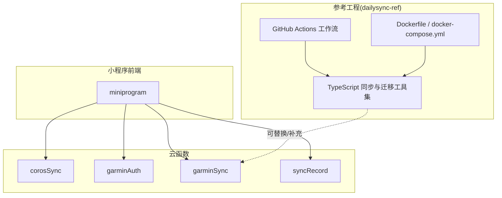
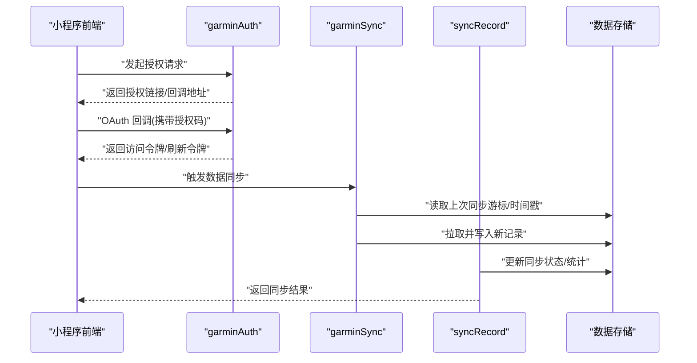
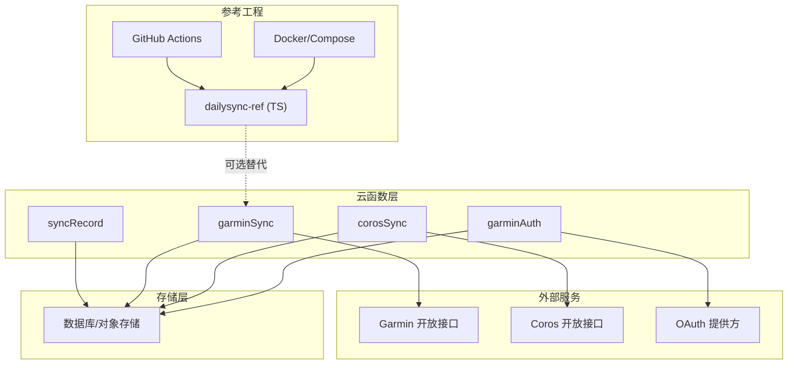
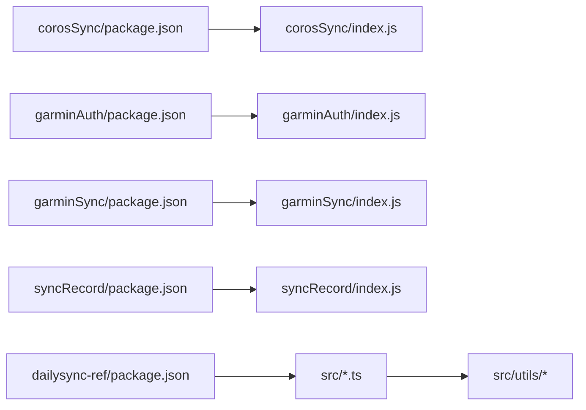

# 云函数部署

<cite>
**本文引用的文件**   
- [cloudfunctions/corosSync/index.js](file://cloudfunctions/corosSync/index.js)
- [cloudfunctions/corosSync/package.json](file://cloudfunctions/corosSync/package.json)
- [cloudfunctions/garminAuth/config.json](file://cloudfunctions/garminAuth/config.json)
- [cloudfunctions/garminAuth/index.js](file://cloudfunctions/garminAuth/index.js)
- [cloudfunctions/garminAuth/package.json](file://cloudfunctions/garminAuth/package.json)
- [cloudfunctions/garminSync/config.json](file://cloudfunctions/garminSync/config.json)
- [cloudfunctions/garminSync/index.js](file://cloudfunctions/garminSync/index.js)
- [cloudfunctions/garminSync/package.json](file://cloudfunctions/garminSync/package.json)
- [cloudfunctions/syncRecord/index.js](file://cloudfunctions/syncRecord/index.js)
- [cloudfunctions/syncRecord/package.json](file://cloudfunctions/syncRecord/package.json)
- [uploadCloudFunction.sh](file://uploadCloudFunction.sh)
- [dailysync-ref/.github/workflows/daily_sync_rq.yml](file://dailysync-ref/.github/workflows/daily_sync_rq.yml)
- [dailysync-ref/.github/workflows/migrate_garmin_cn_to_garmin_global.yml](file://dailysync-ref/.github/workflows/migrate_garmin_cn_to_garmin_global.yml)
- [dailysync-ref/.github/workflows/migrate_garmin_global_to_garmin_cn.yml](file://dailysync-ref/.github/workflows/migrate_garmin_global_to_garmin_cn.yml)
- [dailysync-ref/.github/workflows/sync_garmin_cn_to_garmin_global.yml](file://dailysync-ref/.github/workflows/sync_garmin_cn_to_garmin_global.yml)
- [dailysync-ref/.github/workflows/sync_garmin_global_to_garmin_cn.yml](file://dailysync-ref/.github/workflows/sync_garmin_global_to_garmin_cn.yml)
- [dailysync-ref/Dockerfile](file://dailysync-ref/Dockerfile)
- [dailysync-ref/docker-compose.yml](file://dailysync-ref/docker-compose.yml)
- [dailysync-ref/package.json](file://dailysync-ref/package.json)
- [dailysync-ref/src/utils/sqlite.ts](file://dailysync-ref/src/utils/sqlite.ts)
- [dailysync-ref/src/utils/garmin_common.ts](file://dailysync-ref/src/utils/garmin_common.ts)
- [dailysync-ref/src/utils/garmin_cn.ts](file://dailysync-ref/src/utils/garmin_cn.ts)
- [dailysync-ref/src/utils/garmin_global.ts](file://dailysync-ref/src/utils/garmin_global.ts)
- [dailysync-ref/src/utils/google_sheets.ts](file://dailysync-ref/src/utils/google_sheets.ts)
- [dailysync-ref/src/utils/strava.ts](file://dailysync-ref/src/utils/strava.ts)
- [dailysync-ref/src/utils/runningquotient.ts](file://dailysync-ref/src/utils/runningquotient.ts)
- [dailysync-ref/src/utils/type.ts](file://dailysync-ref/src/utils/type.ts)
- [dailysync-ref/src/constant.ts](file://dailysync-ref/src/constant.ts)
- [dailysync-ref/src/rq.ts](file://dailysync-ref/src/rq.ts)
- [dailysync-ref/src/migrate_garmin_cn_to_global.ts](file://dailysync-ref/src/migrate_garmin_cn_to_global.ts)
- [dailysync-ref/src/migrate_garmin_global_to_cn.ts](file://dailysync-ref/src/migrate_garmin_global_to_cn.ts)
- [dailysync-ref/src/sync_garmin_cn_to_global.ts](file://dailysync-ref/src/sync_garmin_cn_to_global.ts)
- [dailysync-ref/src/sync_garmin_global_to_cn.ts](file://dailysync-ref/src/sync_garmin_global_to_cn.ts)
</cite>

## 目录
1. [简介](#简介)
2. [项目结构](#项目结构)
3. [核心组件](#核心组件)
4. [架构总览](#架构总览)
5. [详细组件分析](#详细组件分析)
6. [依赖分析](#依赖分析)
7. [性能考虑](#性能考虑)
8. [故障排查指南](#故障排查指南)
9. [结论](#结论)
10. [附录](#附录)

## 简介
本指南面向需要在微信云开发环境中部署与运维一组云函数的团队与个人开发者。内容覆盖以下云函数：corosSync、garminAuth、garminSync、syncRecord，以及配套的自动化部署脚本与参考工程（dailysync-ref）。文档将详细说明各函数的职责、配置项与环境变量、本地开发与生产环境差异、依赖管理、日志收集、自动化部署流程、监控调试与安全最佳实践。

## 项目结构
本项目采用“小程序前端 + 云函数后端”的常见架构。云函数位于 cloudfunctions 目录下，每个子目录对应一个独立的云函数；同时提供 uploadCloudFunction.sh 用于批量上传部署。dailysync-ref 为参考工程，包含数据同步与迁移相关的 TypeScript 实现、Docker 化能力与 GitHub Actions 工作流，可作为云函数逻辑的补充或替代方案。

图表来源
- [uploadCloudFunction.sh](file://uploadCloudFunction.sh)
- [dailysync-ref/Dockerfile](file://dailysync-ref/Dockerfile)
- [dailysync-ref/docker-compose.yml](file://dailysync-ref/docker-compose.yml)
- [dailysync-ref/.github/workflows/daily_sync_rq.yml](file://dailysync-ref/.github/workflows/daily_sync_rq.yml)

章节来源
- [uploadCloudFunction.sh](file://uploadCloudFunction.sh)
- [dailysync-ref/Dockerfile](file://dailysync-ref/Dockerfile)
- [dailysync-ref/docker-compose.yml](file://dailysync-ref/docker-compose.yml)

## 核心组件
本节概述四个云函数的职责与交互关系，便于快速定位问题与规划扩展。

- corosSync：负责与 Coros 平台进行数据同步，拉取运动记录并写入数据库或对象存储。
- garminAuth：负责 Garmin 账号授权流程，处理 OAuth 回调与令牌刷新。
- garminSync：负责从 Garmin 平台拉取数据并进行清洗、去重与入库。
- syncRecord：通用记录同步入口，协调不同数据源（如 Coros/Garmin）的增量同步任务。

图表来源
- [cloudfunctions/garminAuth/index.js](file://cloudfunctions/garminAuth/index.js)
- [cloudfunctions/garminSync/index.js](file://cloudfunctions/garminSync/index.js)
- [cloudfunctions/syncRecord/index.js](file://cloudfunctions/syncRecord/index.js)

章节来源
- [cloudfunctions/corosSync/index.js](file://cloudfunctions/corosSync/index.js)
- [cloudfunctions/garminAuth/index.js](file://cloudfunctions/garminAuth/index.js)
- [cloudfunctions/garminSync/index.js](file://cloudfunctions/garminSync/index.js)
- [cloudfunctions/syncRecord/index.js](file://cloudfunctions/syncRecord/index.js)

## 架构总览
下图展示云函数与外部服务、存储及参考工程的集成关系。云函数通过环境变量获取密钥与端点信息，调用第三方 API，并将结果持久化到数据库或对象存储。参考工程提供 Docker 化与 CI/CD 能力，可用于离线同步或替代云函数执行复杂任务。

图表来源
- [cloudfunctions/garminAuth/index.js](file://cloudfunctions/garminAuth/index.js)
- [cloudfunctions/garminSync/index.js](file://cloudfunctions/garminSync/index.js)
- [cloudfunctions/corosSync/index.js](file://cloudfunctions/corosSync/index.js)
- [cloudfunctions/syncRecord/index.js](file://cloudfunctions/syncRecord/index.js)
- [dailysync-ref/Dockerfile](file://dailysync-ref/Dockerfile)
- [dailysync-ref/docker-compose.yml](file://dailysync-ref/docker-compose.yml)
- [dailysync-ref/.github/workflows/daily_sync_rq.yml](file://dailysync-ref/.github/workflows/daily_sync_rq.yml)

## 详细组件分析

### corosSync
- 功能要点
  - 定时或按需拉取 Coros 平台的运动记录。
  - 支持增量同步（基于时间戳或游标），避免重复数据。
  - 将数据标准化后写入数据库或对象存储。
- 关键配置与参数
  - 环境变量：Coros API 域名、客户端 ID/密钥、重试次数、超时时间、分页大小等。
  - 输入参数：用户标识、起始时间、结束时间、是否强制全量。
- 错误处理
  - 网络异常重试与退避策略。
  - 鉴权失败时提示重新授权。
  - 数据校验失败时记录告警并跳过异常条目。
- 性能优化
  - 并发拉取与批写入。
  - 使用压缩传输与缓存 ETag。
- 本地与生产差异
  - 本地：使用模拟数据或沙箱域名，关闭严格校验以便调试。
  - 生产：启用严格校验、限流与审计日志。

章节来源
- [cloudfunctions/corosSync/index.js](file://cloudfunctions/corosSync/index.js)
- [cloudfunctions/corosSync/package.json](file://cloudfunctions/corosSync/package.json)

### garminAuth
- 功能要点
  - 生成 Garmin OAuth 授权链接。
  - 处理回调并换取访问令牌与刷新令牌。
  - 安全存储敏感凭据，支持令牌自动刷新。
- 关键配置与参数
  - 配置文件：client_id、client_secret、redirect_uri、scope。
  - 环境变量：加密密钥、令牌有效期、回调白名单。
- 错误处理
  - 非法回调参数校验。
  - 令牌过期时的刷新流程与失败回退。
- 安全建议
  - 最小权限 scope。
  - 使用 HTTPS 与严格的 CORS 策略。
  - 敏感信息通过环境变量注入，禁止硬编码。

章节来源
- [cloudfunctions/garminAuth/config.json](file://cloudfunctions/garminAuth/config.json)
- [cloudfunctions/garminAuth/index.js](file://cloudfunctions/garminAuth/index.js)
- [cloudfunctions/garminAuth/package.json](file://cloudfunctions/garminAuth/package.json)

### garminSync
- 功能要点
  - 基于已授权的 Garmin 账号拉取活动、心率、轨迹等数据。
  - 数据清洗、去重、字段映射与入库。
  - 支持断点续传与失败重试。
- 关键配置与参数
  - 配置文件：API 版本、速率限制、分页大小。
  - 环境变量：访问令牌、刷新令牌、目标库连接串。
- 错误处理
  - 限流与指数退避。
  - 部分失败记录隔离与补偿任务。
- 性能优化
  - 并行请求与合并响应。
  - 批量写入与事务控制。

章节来源
- [cloudfunctions/garminSync/config.json](file://cloudfunctions/garminSync/config.json)
- [cloudfunctions/garminSync/index.js](file://cloudfunctions/garminSync/index.js)
- [cloudfunctions/garminSync/package.json](file://cloudfunctions/garminSync/package.json)

### syncRecord
- 功能要点
  - 统一调度不同数据源的同步任务。
  - 维护同步状态、进度与统计指标。
  - 暴露通用接口供小程序前端查询与触发。
- 关键配置与参数
  - 环境变量：任务队列、最大并发、超时、重试策略。
  - 输入参数：数据源类型、用户标识、同步模式（增量/全量）。
- 错误处理
  - 任务幂等性保证。
  - 失败任务进入死信队列并重试。
- 监控与可观测性
  - 输出结构化日志与指标。
  - 暴露健康检查端点。

章节来源
- [cloudfunctions/syncRecord/index.js](file://cloudfunctions/syncRecord/index.js)
- [cloudfunctions/syncRecord/package.json](file://cloudfunctions/syncRecord/package.json)

### 参考工程 dailysync-ref（可选替代/补充）
- 功能要点
  - 提供 Garmin CN/Global 之间的数据同步与迁移脚本。
  - 集成 Google Sheets、Strava 等数据源。
  - 支持 SQLite 本地存储与 Docker 化运行。
- 关键模块
  - utils/sqlite.ts：SQLite 操作封装。
  - utils/garmin_common.ts、garmin_cn.ts、garmin_global.ts：Garmin 相关逻辑。
  - utils/google_sheets.ts、utils/strava.ts：第三方数据源适配。
  - src/rq.ts、src/constant.ts：业务常量与计算逻辑。
- 部署与运行
  - Dockerfile 与 docker-compose.yml 提供容器化运行方式。
  - GitHub Actions 工作流支持定时任务与手动触发。

章节来源
- [dailysync-ref/src/utils/sqlite.ts](file://dailysync-ref/src/utils/sqlite.ts)
- [dailysync-ref/src/utils/garmin_common.ts](file://dailysync-ref/src/utils/garmin_common.ts)
- [dailysync-ref/src/utils/garmin_cn.ts](file://dailysync-ref/src/utils/garmin_cn.ts)
- [dailysync-ref/src/utils/garmin_global.ts](file://dailysync-ref/src/utils/garmin_global.ts)
- [dailysync-ref/src/utils/google_sheets.ts](file://dailysync-ref/src/utils/google_sheets.ts)
- [dailysync-ref/src/utils/strava.ts](file://dailysync-ref/src/utils/strava.ts)
- [dailysync-ref/src/rq.ts](file://dailysync-ref/src/rq.ts)
- [dailysync-ref/src/constant.ts](file://dailysync-ref/src/constant.ts)
- [dailysync-ref/Dockerfile](file://dailysync-ref/Dockerfile)
- [dailysync-ref/docker-compose.yml](file://dailysync-ref/docker-compose.yml)

## 依赖分析
- 云函数依赖
  - 每个云函数拥有独立 package.json，声明运行时依赖与构建脚本。
  - 建议在本地先执行依赖安装与打包，再上传以减少冷启动时间。
- 参考工程依赖
  - TypeScript 生态与常用库，需按 package.json 安装。
  - Docker 镜像构建依赖 Node 运行时与系统包。

图表来源
- [cloudfunctions/corosSync/package.json](file://cloudfunctions/corosSync/package.json)
- [cloudfunctions/garminAuth/package.json](file://cloudfunctions/garminAuth/package.json)
- [cloudfunctions/garminSync/package.json](file://cloudfunctions/garminSync/package.json)
- [cloudfunctions/syncRecord/package.json](file://cloudfunctions/syncRecord/package.json)
- [dailysync-ref/package.json](file://dailysync-ref/package.json)

章节来源
- [cloudfunctions/corosSync/package.json](file://cloudfunctions/corosSync/package.json)
- [cloudfunctions/garminAuth/package.json](file://cloudfunctions/garminAuth/package.json)
- [cloudfunctions/garminSync/package.json](file://cloudfunctions/garminSync/package.json)
- [cloudfunctions/syncRecord/package.json](file://cloudfunctions/syncRecord/package.json)
- [dailysync-ref/package.json](file://dailysync-ref/package.json)

## 性能考虑
- 冷启动优化
  - 减少依赖体积，按需引入模块。
  - 预加载外部 SDK 与连接池。
- 并发与限流
  - 合理设置最大并发数，避免下游限流。
  - 使用令牌桶或漏桶算法控制请求速率。
- 数据写入优化
  - 批量写入与事务合并。
  - 使用索引与分区表提升查询效率。
- 缓存策略
  - 对热点配置与静态资源使用缓存。
  - 利用 ETag/If-None-Match 减少重复传输。

[本节为通用指导，不直接分析具体文件]

## 故障排查指南
- 常见问题定位
  - 鉴权失败：检查 OAuth 回调地址、Scope、密钥是否正确。
  - 网络超时：确认域名解析、防火墙策略与代理配置。
  - 数据不一致：核对上游 API 分页与游标逻辑。
- 日志与监控
  - 输出结构化日志（JSON），包含请求 ID、用户 ID、耗时与错误码。
  - 接入云监控与告警规则（CPU、内存、错误率、延迟）。
- 调试技巧
  - 本地模拟第三方 API 响应（Mock）。
  - 逐步缩小范围，定位是网络、鉴权还是数据处理问题。
- 恢复策略
  - 失败任务入队重试，设置最大重试次数与退避间隔。
  - 提供回滚与补偿脚本，确保数据一致性。

章节来源
- [cloudfunctions/garminAuth/index.js](file://cloudfunctions/garminAuth/index.js)
- [cloudfunctions/garminSync/index.js](file://cloudfunctions/garminSync/index.js)
- [cloudfunctions/syncRecord/index.js](file://cloudfunctions/syncRecord/index.js)

## 结论
通过合理的云函数拆分与环境变量管理，结合参考工程的容器化与 CI/CD 能力，可实现稳定、可扩展的数据同步与授权流程。建议在生产环境启用严格的鉴权、限流与监控告警，并在本地保持与生产一致的配置以缩短排障时间。

[本节为总结性内容，不直接分析具体文件]

## 附录

### 环境变量与配置清单
- 通用
  - LOG_LEVEL：日志级别（debug/info/warn/error）
  - RETRY_MAX：最大重试次数
  - TIMEOUT_MS：请求超时毫秒数
- garminAuth
  - GARMIN_CLIENT_ID、GARMIN_CLIENT_SECRET、GARMIN_REDIRECT_URI、GARMIN_SCOPE
  - TOKEN_ENCRYPTION_KEY：令牌加密密钥
- garminSync
  - GARMIN_ACCESS_TOKEN、GARMIN_REFRESH_TOKEN
  - DB_CONNECTION_STRING：数据库连接串
- corosSync
  - COROS_API_BASE、COROS_CLIENT_ID、COROS_CLIENT_SECRET
  - PAGE_SIZE、BATCH_SIZE
- syncRecord
  - QUEUE_NAME、MAX_CONCURRENCY、HEALTH_CHECK_PORT

[本节为通用配置说明，不直接分析具体文件]

### 本地开发与生产环境差异
- 本地开发
  - 使用 Mock 服务与沙箱域名。
  - 关闭严格校验，开启详细日志。
  - 使用本地 SQLite 或内存数据库。
- 生产环境
  - 启用 HTTPS、CORS 白名单与 IP 白名单。
  - 使用只读最小权限账户访问数据库。
  - 启用审计日志与访问控制。

[本节为通用指导，不直接分析具体文件]

### 自动化部署脚本使用方法
- 批量部署
  - 使用 uploadCloudFunction.sh 遍历 cloudfunctions 目录，逐个上传函数。
  - 支持传入版本号与备注，便于追踪发布历史。
- 版本控制
  - 每次部署生成唯一版本标签，保留回滚快照。
  - 在 Git 中记录变更与关联工单号。
- 错误处理
  - 捕获上传失败并输出详细错误信息。
  - 支持失败重试与人工干预提示。

章节来源
- [uploadCloudFunction.sh](file://uploadCloudFunction.sh)

### 参考工程 CI/CD 工作流
- daily_sync_rq.yml：每日运行 Running Quotient 计算任务。
- sync_garmin_*：定时同步 Garmin CN/Global 数据。
- migrate_garmin_*：执行数据迁移任务。
- 支持手动触发与条件分支，便于灰度发布。

章节来源
- [dailysync-ref/.github/workflows/daily_sync_rq.yml](file://dailysync-ref/.github/workflows/daily_sync_rq.yml)
- [dailysync-ref/.github/workflows/sync_garmin_cn_to_garmin_global.yml](file://dailysync-ref/.github/workflows/sync_garmin_cn_to_garmin_global.yml)
- [dailysync-ref/.github/workflows/sync_garmin_global_to_garmin_cn.yml](file://dailysync-ref/.github/workflows/sync_garmin_global_to_garmin_cn.yml)
- [dailysync-ref/.github/workflows/migrate_garmin_cn_to_garmin_global.yml](file://dailysync-ref/.github/workflows/migrate_garmin_cn_to_garmin_global.yml)
- [dailysync-ref/.github/workflows/migrate_garmin_global_to_garmin_cn.yml](file://dailysync-ref/.github/workflows/migrate_garmin_global_to_garmin_cn.yml)

### 安全配置与访问控制最佳实践
- 最小权限原则：仅授予必要 API 权限与数据库读写权限。
- 密钥管理：使用环境变量或密钥管理服务，禁止硬编码。
- 传输安全：强制 HTTPS，启用 HSTS。
- 访问控制：限制来源 IP、User-Agent 与 Referer。
- 审计与合规：记录敏感操作日志，定期审查与清理。

[本节为通用安全建议，不直接分析具体文件]