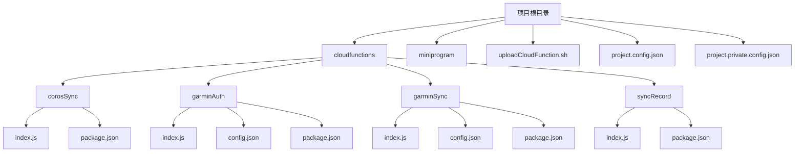
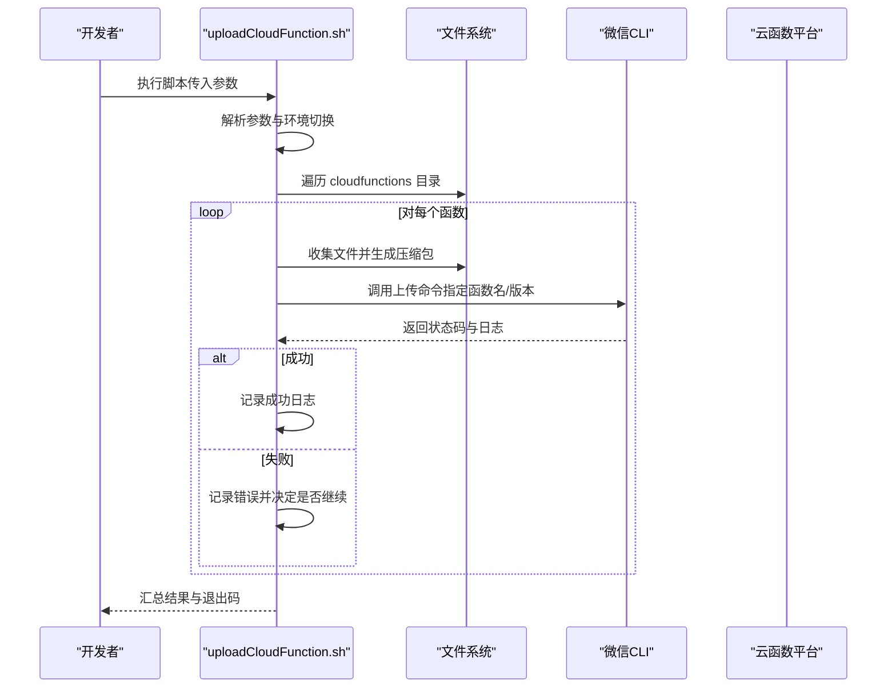
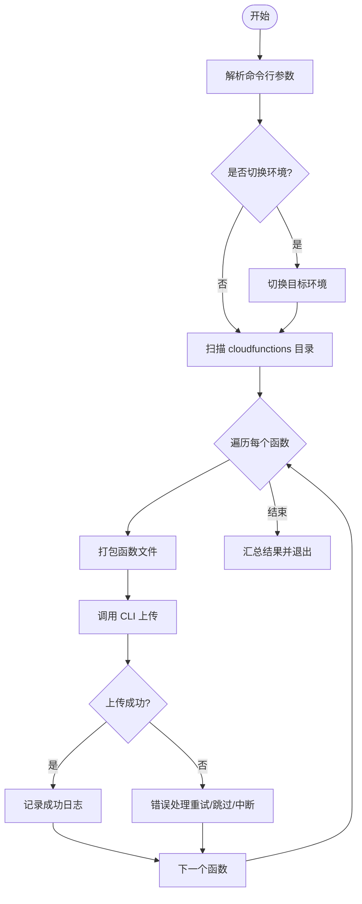
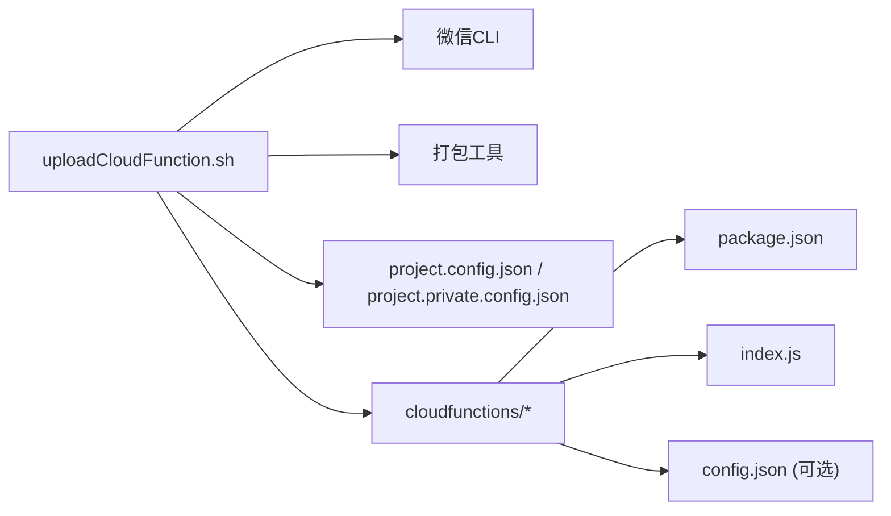

# 部署脚本使用指南

<cite>
**本文档引用的文件**   
- [uploadCloudFunction.sh](file://uploadCloudFunction.sh)
- [README.md](file://README.md)
- [project.config.json](file://project.config.json)
- [project.private.config.json](file://project.private.config.json)
- [corosSync/index.js](file://cloudfunctions/corosSync/index.js)
- [corosSync/package.json](file://cloudfunctions/corosSync/package.json)
- [garminAuth/index.js](file://cloudfunctions/garminAuth/index.js)
- [garminAuth/config.json](file://cloudfunctions/garminAuth/config.json)
- [garminAuth/package.json](file://cloudfunctions/garminAuth/package.json)
- [garminSync/index.js](file://cloudfunctions/garminSync/index.js)
- [garminSync/config.json](file://cloudfunctions/garminSync/config.json)
- [garminSync/package.json](file://cloudfunctions/garminSync/package.json)
- [syncRecord/index.js](file://cloudfunctions/syncRecord/index.js)
- [syncRecord/package.json](file://cloudfunctions/syncRecord/package.json)
</cite>

## 目录
1. [简介](#简介)
2. [项目结构](#项目结构)
3. [核心组件](#核心组件)
4. [架构总览](#架构总览)
5. [详细组件分析](#详细组件分析)
6. [依赖关系分析](#依赖关系分析)
7. [性能考虑](#性能考虑)
8. [故障排查指南](#故障排查指南)
9. [结论](#结论)
10. [附录](#附录)

## 简介
本指南面向需要自动化部署微信小程序云函数的开发者与运维人员，围绕仓库根目录的部署脚本 uploadCloudFunction.sh，系统讲解其工作原理、参数配置、使用场景、CI/CD 集成、回滚与恢复策略，以及扩展与优化建议。通过循序渐进的内容与图示，帮助读者快速上手并安全高效地管理云函数发布流程。

## 项目结构
本项目采用“小程序前端 + 云函数”的典型结构：
- cloudfunctions：存放各云函数目录，每个函数包含入口 index.js、可选配置文件与依赖 package.json
- miniprogram：小程序前端代码
- 根目录：项目配置与部署脚本

图表来源
- [uploadCloudFunction.sh](file://uploadCloudFunction.sh)
- [project.config.json](file://project.config.json)
- [project.private.config.json](file://project.private.config.json)
- [corosSync/index.js](file://cloudfunctions/corosSync/index.js)
- [corosSync/package.json](file://cloudfunctions/corosSync/package.json)
- [garminAuth/index.js](file://cloudfunctions/garminAuth/index.js)
- [garminAuth/config.json](file://cloudfunctions/garminAuth/config.json)
- [garminAuth/package.json](file://cloudfunctions/garminAuth/package.json)
- [garminSync/index.js](file://cloudfunctions/garminSync/index.js)
- [garminSync/config.json](file://cloudfunctions/garminSync/config.json)
- [garminSync/package.json](file://cloudfunctions/garminSync/package.json)
- [syncRecord/index.js](file://cloudfunctions/syncRecord/index.js)
- [syncRecord/package.json](file://cloudfunctions/syncRecord/package.json)

章节来源
- [README.md](file://README.md)
- [project.config.json](file://project.config.json)
- [project.private.config.json](file://project.private.config.json)

## 核心组件
- 部署脚本 uploadCloudFunction.sh：负责遍历 cloudfunctions 下的函数目录、打包压缩、调用微信 CLI 进行上传、错误处理与日志输出
- 云函数集合：corosSync、garminAuth、garminSync、syncRecord 等，各自独立可部署
- 项目配置：project.config.json 与 project.private.config.json 用于环境、ID、路径等基础配置

章节来源
- [uploadCloudFunction.sh](file://uploadCloudFunction.sh)
- [corosSync/index.js](file://cloudfunctions/corosSync/index.js)
- [corosSync/package.json](file://cloudfunctions/corosSync/package.json)
- [garminAuth/index.js](file://cloudfunctions/garminAuth/index.js)
- [garminAuth/config.json](file://cloudfunctions/garminAuth/config.json)
- [garminAuth/package.json](file://cloudfunctions/garminAuth/package.json)
- [garminSync/index.js](file://cloudfunctions/garminSync/index.js)
- [garminSync/config.json](file://cloudfunctions/garminSync/config.json)
- [garminSync/package.json](file://cloudfunctions/garminSync/package.json)
- [syncRecord/index.js](file://cloudfunctions/syncRecord/index.js)
- [syncRecord/package.json](file://cloudfunctions/syncRecord/package.json)

## 架构总览
下图展示了从本地执行到云端部署的整体流程，包括参数解析、文件遍历、打包、上传与错误处理环节。

图表来源
- [uploadCloudFunction.sh](file://uploadCloudFunction.sh)

## 详细组件分析

### 部署脚本工作原理
- 文件遍历：递归扫描 cloudfunctions 下各函数目录，识别待部署的函数集合
- 压缩打包：为每个函数生成临时包，确保仅包含必要文件（如 index.js、package.json、config.json）
- 上传逻辑：调用微信 CLI 的上传接口，支持按函数名或批量模式上传，并可附加版本信息
- 错误处理：捕获 CLI 返回的错误码与日志，支持失败重试、跳过或中断策略；提供清晰的失败定位信息

图表来源
- [uploadCloudFunction.sh](file://uploadCloudFunction.sh)

章节来源
- [uploadCloudFunction.sh](file://uploadCloudFunction.sh)

### 参数与环境切换
- 环境变量：通过环境变量控制目标环境（开发/测试/生产），影响上传的目标项目 ID 与路径
- 版本管理：支持在上传时附带版本号或标签，便于追踪与回滚
- 批量选项：支持全部函数更新或增量部署（仅变更函数）
- 过滤与选择：可按函数名过滤，实现单个函数部署

章节来源
- [uploadCloudFunction.sh](file://uploadCloudFunction.sh)
- [project.config.json](file://project.config.json)
- [project.private.config.json](file://project.private.config.json)

### 使用场景与方法
- 单个函数部署：指定函数名，仅打包并上传该函数，适合快速修复与验证
- 全部函数更新：不传参或传入全量标志，遍历所有函数并逐一上传
- 增量部署：对比上次构建产物或 Git 变更，仅上传有改动的函数，提升效率

章节来源
- [uploadCloudFunction.sh](file://uploadCloudFunction.sh)

### CI/CD 流水线集成
- GitHub Actions：可在 dailysync-ref/.github/workflows 中参考现有工作流模板，定义触发条件（push/tag）、构建步骤与上传步骤
- Git 钩子：在 pre-push 或 post-commit 阶段调用脚本，实现提交即部署
- 构建产物管理：将打包产物缓存至 CI 缓存或对象存储，减少重复打包时间

章节来源
- [dailysync-ref/.github/workflows/daily_sync_rq.yml](file://dailysync-ref/.github/workflows/daily_sync_rq.yml)
- [dailysync-ref/.github/workflows/migrate_garmin_cn_to_garmin_global.yml](file://dailyscript-ref/.github/workflows/migrate_garmin_cn_to_garmin_global.yml)
- [dailysync-ref/.github/workflows/migrate_garmin_global_to_garmin_cn.yml](file://dailyscript-ref/.github/workflows/migrate_garmin_global_to_garmin_cn.yml)
- [dailysync-ref/.github/workflows/sync_garmin_cn_to_garmin_global.yml](file://dailyscript-ref/.github/workflows/sync_garmin_cn_to_garmin_global.yml)
- [dailysync-ref/.github/workflows/sync_garmin_global_to_garmin_cn.yml](file://dailyscript-ref/.github/workflows/sync_garmin_global_to_garmin_cn.yml)

### 回滚机制与故障恢复
- 版本标记：每次上传附带唯一版本标识，便于快速回滚到上一稳定版本
- 灰度发布：先部署到测试环境验证，再逐步切换到生产环境
- 失败恢复：遇到上传失败时，自动重试或回退到上一次成功版本，并输出诊断日志

章节来源
- [uploadCloudFunction.sh](file://uploadCloudFunction.sh)

### 脚本定制与扩展
- 自定义上传逻辑：在脚本中扩展上传函数，支持新的云函数平台或私有化部署
- 新增函数支持：在 cloudfunctions 下新增函数目录，遵循既有命名与结构规范即可被自动发现
- 插件式配置：通过外部配置文件注入额外打包规则或忽略列表

章节来源
- [uploadCloudFunction.sh](file://uploadCloudFunction.sh)

## 依赖关系分析
- 脚本依赖：shell 环境、微信 CLI、zip 工具（若用于打包）
- 函数依赖：各云函数的 package.json 声明运行时依赖，需确保安装与打包完整
- 配置依赖：project.config.json 与 project.private.config.json 中的项目 ID、路径、环境设置

图表来源
- [uploadCloudFunction.sh](file://uploadCloudFunction.sh)
- [project.config.json](file://project.config.json)
- [project.private.config.json](file://project.private.config.json)
- [corosSync/package.json](file://cloudfunctions/corosSync/package.json)
- [garminAuth/package.json](file://cloudfunctions/garminAuth/package.json)
- [garminSync/package.json](file://cloudfunctions/garminSync/package.json)
- [syncRecord/package.json](file://cloudfunctions/syncRecord/package.json)

章节来源
- [uploadCloudFunction.sh](file://uploadCloudFunction.sh)
- [project.config.json](file://project.config.json)
- [project.private.config.json](file://project.private.config.json)

## 性能考虑
- 增量打包：仅打包变更文件，减少网络传输与构建时间
- 并行上传：对多个函数并发上传，提高整体吞吐（注意限流与稳定性）
- 缓存策略：复用 node_modules 与中间产物，避免重复安装与编译
- 资源裁剪：排除无关文件（如 .git、测试文件），减小包体积

[本节为通用指导，无需引用具体文件]

## 故障排查指南
- 常见错误
  - 权限不足：检查微信 CLI 登录状态与项目访问权限
  - 网络超时：增加重试次数与超时阈值，或使用代理
  - 打包失败：确认依赖已安装，排除大文件或敏感文件
  - 版本冲突：清理旧版本或强制覆盖上传
- 诊断方法
  - 开启详细日志，定位失败步骤
  - 单独运行单个函数上传，隔离问题
  - 校验配置文件与密钥是否正确

章节来源
- [uploadCloudFunction.sh](file://uploadCloudFunction.sh)

## 结论
通过 uploadCloudFunction.sh 脚本，团队可以实现标准化、可追溯的云函数部署流程。结合 CI/CD、版本管理与回滚策略，能够显著提升发布效率与稳定性。建议在生产环境中启用灰度发布与严格的环境隔离，持续优化打包与上传性能。

[本节为总结性内容，无需引用具体文件]

## 附录
- 常用命令示例（以路径引用代替具体命令内容）
  - 单个函数部署：参见 [uploadCloudFunction.sh](file://uploadCloudFunction.sh)
  - 全部函数更新：参见 [uploadCloudFunction.sh](file://uploadCloudFunction.sh)
  - 增量部署：参见 [uploadCloudFunction.sh](file://uploadCloudFunction.sh)
- 相关云函数入口与配置
  - corosSync：[index.js](file://cloudfunctions/corosSync/index.js)、[package.json](file://cloudfunctions/corosSync/package.json)
  - garminAuth：[index.js](file://cloudfunctions/garminAuth/index.js)、[config.json](file://cloudfunctions/garminAuth/config.json)、[package.json](file://cloudfunctions/garminAuth/package.json)
  - garminSync：[index.js](file://cloudfunctions/garminSync/index.js)、[config.json](file://cloudfunctions/garminSync/config.json)、[package.json](file://cloudfunctions/garminSync/package.json)
  - syncRecord：[index.js](file://cloudfunctions/syncRecord/index.js)、[package.json](file://cloudfunctions/syncRecord/package.json)