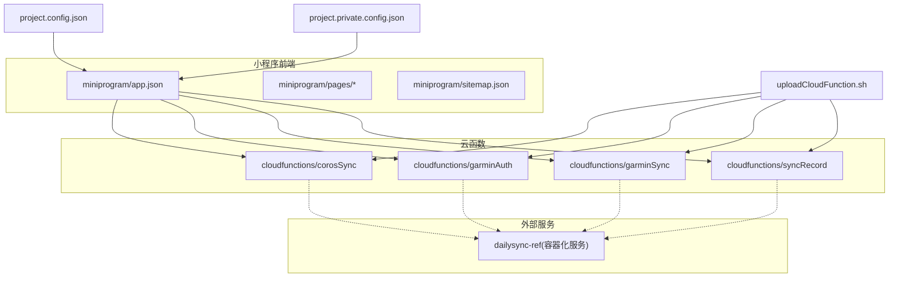
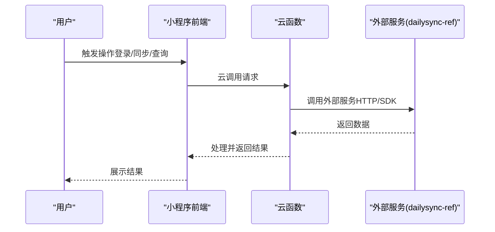
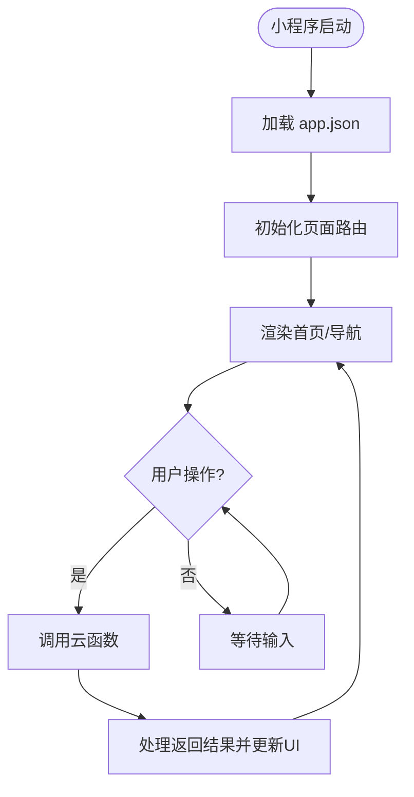
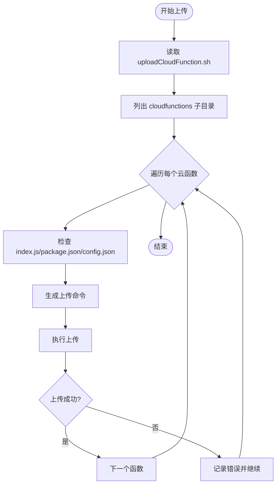
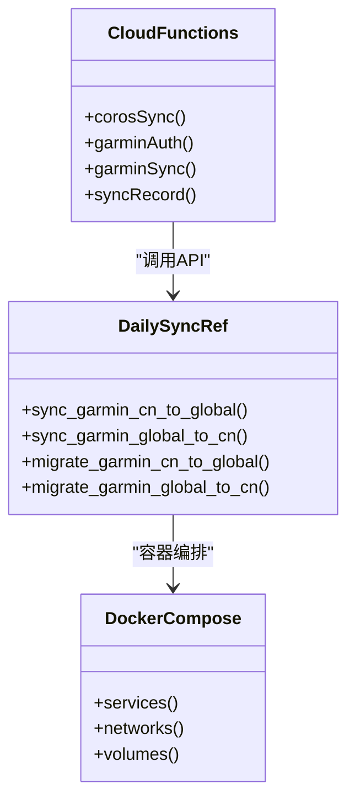
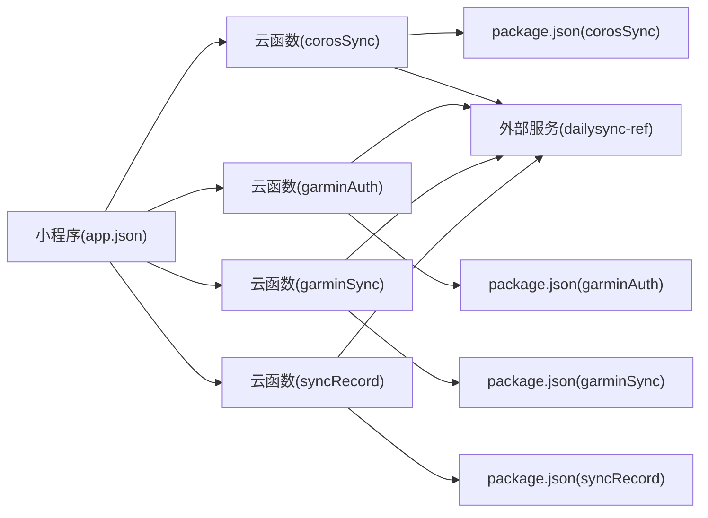

# 小程序部署

<cite>
**本文引用的文件**   
- [project.config.json](file://project.config.json)
- [project.private.config.json](file://project.private.config.json)
- [app.json](file://miniprogram/app.json)
- [sitemap.json](file://miniprogram/sitemap.json)
- [uploadCloudFunction.sh](file://uploadCloudFunction.sh)
- [index.js](file://cloudfunctions/corosSync/index.js)
- [package.json](file://cloudfunctions/corosSync/package.json)
- [config.json](file://cloudfunctions/garminAuth/config.json)
- [index.js](file://cloudfunctions/garminAuth/index.js)
- [package.json](file://cloudfunctions/garminAuth/package.json)
- [config.json](file://cloudfunctions/garminSync/config.json)
- [index.js](file://cloudfunctions/garminSync/index.js)
- [package.json](file://cloudfunctions/garminSync/package.json)
- [index.js](file://cloudfunctions/syncRecord/index.js)
- [package.json](file://cloudfunctions/syncRecord/package.json)
- [README.md](file://dailysync-ref/README.md)
- [docker-compose.yml](file://dailysync-ref/docker-compose.yml)
- [Dockerfile](file://dailysync-ref/Dockerfile)
</cite>

## 目录
1. [简介](#简介)
2. [项目结构](#项目结构)
3. [核心组件](#核心组件)
4. [架构总览](#架构总览)
5. [详细组件分析](#详细组件分析)
6. [依赖分析](#依赖分析)
7. [性能考虑](#性能考虑)
8. [故障排查指南](#故障排查指南)
9. [结论](#结论)
10. [附录](#附录)

## 简介
本指南面向使用微信开发者工具进行微信小程序与云函数部署的工程师与运维人员，覆盖以下目标：
- 使用微信开发者工具完成代码上传与版本管理
- 配置项目配置文件（含私有配置）
- 使用云函数上传脚本自动化上传云函数
- 搭建测试环境、执行预发布验证、正式环境发布流程
- 制定版本回滚策略与灰度发布方法
- 常见部署问题排查与解决方案（权限、网络、依赖冲突等）
- 自动化部署最佳实践与性能优化建议

## 项目结构
本项目包含小程序前端、云函数以及一个独立的每日同步参考服务。关键目录与职责如下：
- miniprogram：小程序前端源码与页面资源
- cloudfunctions：云函数集合，每个子目录为一个独立云函数
- dailysync-ref：独立的后端参考服务（Docker 化），用于数据同步与迁移
- 根目录配置文件：project.config.json、project.private.config.json、sitemap.json、上传脚本等

**图示来源**
- [project.config.json](file://project.config.json)
- [project.private.config.json](file://project.private.config.json)
- [app.json](file://miniprogram/app.json)
- [sitemap.json](file://miniprogram/sitemap.json)
- [uploadCloudFunction.sh](file://uploadCloudFunction.sh)
- [index.js](file://cloudfunctions/corosSync/index.js)
- [package.json](file://cloudfunctions/corosSync/package.json)
- [config.json](file://cloudfunctions/garminAuth/config.json)
- [index.js](file://cloudfunctions/garminAuth/index.js)
- [package.json](file://cloudfunctions/garminAuth/package.json)
- [config.json](file://cloudfunctions/garminSync/config.json)
- [index.js](file://cloudfunctions/garminSync/index.js)
- [package.json](file://cloudfunctions/garminSync/package.json)
- [index.js](file://cloudfunctions/syncRecord/index.js)
- [package.json](file://cloudfunctions/syncRecord/package.json)
- [docker-compose.yml](file://dailysync-ref/docker-compose.yml)
- [Dockerfile](file://dailysync-ref/Dockerfile)

**章节来源**
- [project.config.json](file://project.config.json)
- [project.private.config.json](file://project.private.config.json)
- [app.json](file://miniprogram/app.json)
- [sitemap.json](file://miniprogram/sitemap.json)
- [uploadCloudFunction.sh](file://uploadCloudFunction.sh)

## 核心组件
- 小程序前端配置与入口
  - app.json：小程序全局配置（页面路由、窗口样式、插件与云能力启用等）
  - sitemap.json：站点地图配置，影响索引与搜索
- 云函数模块
  - corosSync：Coros 数据同步相关逻辑
  - garminAuth：Garmin 认证与授权
  - garminSync：Garmin 数据同步
  - syncRecord：记录同步任务或结果
- 上传脚本
  - uploadCloudFunction.sh：批量上传云函数到云端，支持多函数目录遍历与参数化

**章节来源**
- [app.json](file://miniprogram/app.json)
- [sitemap.json](file://miniprogram/sitemap.json)
- [index.js](file://cloudfunctions/corosSync/index.js)
- [package.json](file://cloudfunctions/corosSync/package.json)
- [config.json](file://cloudfunctions/garminAuth/config.json)
- [index.js](file://cloudfunctions/garminAuth/index.js)
- [package.json](file://cloudfunctions/garminAuth/package.json)
- [config.json](file://cloudfunctions/garminSync/config.json)
- [index.js](file://cloudfunctions/garminSync/index.js)
- [package.json](file://cloudfunctions/garminSync/package.json)
- [index.js](file://cloudfunctions/syncRecord/index.js)
- [package.json](file://cloudfunctions/syncRecord/package.json)
- [uploadCloudFunction.sh](file://uploadCloudFunction.sh)

## 架构总览
小程序通过云调用访问云函数，云函数可调用外部服务（如 dailysync-ref）。整体交互流程如下：

**图示来源**
- [app.json](file://miniprogram/app.json)
- [index.js](file://cloudfunctions/corosSync/index.js)
- [index.js](file://cloudfunctions/garminAuth/index.js)
- [index.js](file://cloudfunctions/garminSync/index.js)
- [index.js](file://cloudfunctions/syncRecord/index.js)
- [docker-compose.yml](file://dailysync-ref/docker-compose.yml)

## 详细组件分析

### 小程序前端配置与页面组织
- app.json 负责页面路由、窗口行为、插件与云能力开关等，是构建与预览的基础
- sitemap.json 控制小程序在微信生态中的索引策略
- pages 目录下按功能划分页面（bind/history/index/sync），每个页面由 .js/.json/.wxml/.wxss 组成

**图示来源**
- [app.json](file://miniprogram/app.json)
- [sitemap.json](file://miniprogram/sitemap.json)

**章节来源**
- [app.json](file://miniprogram/app.json)
- [sitemap.json](file://miniprogram/sitemap.json)

### 云函数结构与上传脚本
- 每个云函数目录包含 index.js（入口）、package.json（依赖）、部分函数有 config.json（运行时配置）
- uploadCloudFunction.sh 用于批量上传云函数，通常遍历 cloudfunctions 下各子目录并调用微信 CLI 或 API 进行上传

**图示来源**
- [uploadCloudFunction.sh](file://uploadCloudFunction.sh)
- [index.js](file://cloudfunctions/corosSync/index.js)
- [package.json](file://cloudfunctions/corosSync/package.json)
- [config.json](file://cloudfunctions/garminAuth/config.json)
- [index.js](file://cloudfunctions/garminAuth/index.js)
- [package.json](file://cloudfunctions/garminAuth/package.json)
- [config.json](file://cloudfunctions/garminSync/config.json)
- [index.js](file://cloudfunctions/garminSync/index.js)
- [package.json](file://cloudfunctions/garminSync/package.json)
- [index.js](file://cloudfunctions/syncRecord/index.js)
- [package.json](file://cloudfunctions/syncRecord/package.json)

**章节来源**
- [uploadCloudFunction.sh](file://uploadCloudFunction.sh)
- [index.js](file://cloudfunctions/corosSync/index.js)
- [package.json](file://cloudfunctions/corosSync/package.json)
- [config.json](file://cloudfunctions/garminAuth/config.json)
- [index.js](file://cloudfunctions/garminAuth/index.js)
- [package.json](file://cloudfunctions/garminAuth/package.json)
- [config.json](file://cloudfunctions/garminSync/config.json)
- [index.js](file://cloudfunctions/garminSync/index.js)
- [package.json](file://cloudfunctions/garminSync/package.json)
- [index.js](file://cloudfunctions/syncRecord/index.js)
- [package.json](file://cloudfunctions/syncRecord/package.json)

### 外部服务集成（dailysync-ref）
- dailysync-ref 提供数据同步与迁移能力，采用 Docker 容器化部署
- docker-compose.yml 定义服务编排，Dockerfile 定义镜像构建流程
- 云函数可通过 HTTP 或 SDK 与该服务交互，实现跨平台数据同步

**图示来源**
- [index.js](file://cloudfunctions/corosSync/index.js)
- [index.js](file://cloudfunctions/garminAuth/index.js)
- [index.js](file://cloudfunctions/garminSync/index.js)
- [index.js](file://cloudfunctions/syncRecord/index.js)
- [README.md](file://dailysync-ref/README.md)
- [docker-compose.yml](file://dailysync-ref/docker-compose.yml)
- [Dockerfile](file://dailysync-ref/Dockerfile)

**章节来源**
- [README.md](file://dailysync-ref/README.md)
- [docker-compose.yml](file://dailysync-ref/docker-compose.yml)
- [Dockerfile](file://dailysync-ref/Dockerfile)

## 依赖分析
- 小程序依赖 app.json 中声明的云能力与插件
- 云函数依赖各自 package.json 中的 Node 包
- 外部服务依赖 Docker 环境与编排配置

**图示来源**
- [app.json](file://miniprogram/app.json)
- [package.json](file://cloudfunctions/corosSync/package.json)
- [package.json](file://cloudfunctions/garminAuth/package.json)
- [package.json](file://cloudfunctions/garminSync/package.json)
- [package.json](file://cloudfunctions/syncRecord/package.json)
- [docker-compose.yml](file://dailysync-ref/docker-compose.yml)

**章节来源**
- [app.json](file://miniprogram/app.json)
- [package.json](file://cloudfunctions/corosSync/package.json)
- [package.json](file://cloudfunctions/garminAuth/package.json)
- [package.json](file://cloudfunctions/garminSync/package.json)
- [package.json](file://cloudfunctions/syncRecord/package.json)
- [docker-compose.yml](file://dailysync-ref/docker-compose.yml)

## 性能考虑
- 小程序侧
  - 合理拆分页面与组件，减少首屏资源体积
  - 按需引入插件与云能力，避免不必要的初始化开销
- 云函数侧
  - 精简依赖，避免大体积包；合理使用缓存与异步并发
  - 对频繁调用的接口进行幂等设计与限流保护
- 外部服务侧
  - 容器化部署时设置合理的 CPU/内存限制
  - 数据库与缓存层分离，读写分离与连接池优化

[本节为通用指导，不直接分析具体文件]

## 故障排查指南
- 权限配置问题
  - 检查 project.config.json 与 project.private.config.json 中的 AppID、环境 ID、云函数环境变量是否正确
  - 确认云函数运行角色具备所需资源访问权限（存储、数据库、第三方 API）
- 网络问题
  - 云函数访问外部服务需确保域名白名单与出口 IP 放行
  - 检查代理与防火墙设置，必要时切换网络环境重试
- 依赖冲突
  - 核对各云函数 package.json 的版本锁定，避免主从依赖不一致
  - 使用 lock 文件（如 yarn.lock）保证构建一致性
- 上传失败
  - 检查 uploadCloudFunction.sh 的执行权限与路径
  - 查看微信开发者工具的日志输出，定位具体错误码与原因

**章节来源**
- [project.config.json](file://project.config.json)
- [project.private.config.json](file://project.private.config.json)
- [uploadCloudFunction.sh](file://uploadCloudFunction.sh)

## 结论
通过规范化的项目配置、自动化的云函数上传脚本与清晰的发布流程，可以显著提升小程序与云函数的交付质量与效率。结合版本回滚与灰度发布策略，能够在保障稳定性的前提下快速迭代。对外部服务的容器化编排与监控告警同样重要，以确保端到端的可靠性。

[本节为总结性内容，不直接分析具体文件]

## 附录

### 使用微信开发者工具进行代码上传与版本管理
- 准备工作
  - 安装并登录微信开发者工具
  - 打开项目根目录，确保 project.config.json 正确配置 AppID 与环境
- 本地调试与预览
  - 使用“编译”与“预览”功能验证小程序与云函数联调
  - 开启“云开发控制台”查看云函数日志与状态
- 上传代码与版本管理
  - 使用“上传”按钮创建新版本，填写版本说明
  - 在“版本管理”中查看历史版本，便于回滚与对比
- 云函数上传
  - 推荐使用 uploadCloudFunction.sh 批量上传云函数
  - 上传后在“云开发控制台”确认函数状态与日志

**章节来源**
- [project.config.json](file://project.config.json)
- [project.private.config.json](file://project.private.config.json)
- [uploadCloudFunction.sh](file://uploadCloudFunction.sh)

### 项目配置文件设置要点
- project.config.json
  - 配置 AppID、项目名称、编译选项、云环境 ID、上传目录等
- project.private.config.json
  - 存放个人偏好与敏感信息（如本地调试端口、私有密钥），不应提交至版本库
- app.json
  - 配置页面路由、窗口样式、插件与云能力开关
- sitemap.json
  - 配置站点地图，影响索引与搜索

**章节来源**
- [project.config.json](file://project.config.json)
- [project.private.config.json](file://project.private.config.json)
- [app.json](file://miniprogram/app.json)
- [sitemap.json](file://miniprogram/sitemap.json)

### 云函数上传脚本使用指南
- 前置条件
  - 已安装 Node.js 与微信 CLI（如需）
  - 确保 cloudfunctions 下各函数目录结构完整（index.js、package.json、可选 config.json）
- 执行步骤
  - 赋予脚本执行权限
  - 运行脚本，传入必要参数（如环境 ID、是否覆盖上传）
  - 查看输出日志，确认各函数上传状态
- 常见问题
  - 权限不足：检查脚本执行权限与云函数目录权限
  - 依赖缺失：确保 package.json 依赖已安装或脚本内包含安装步骤

**章节来源**
- [uploadCloudFunction.sh](file://uploadCloudFunction.sh)
- [index.js](file://cloudfunctions/corosSync/index.js)
- [package.json](file://cloudfunctions/corosSync/package.json)
- [config.json](file://cloudfunctions/garminAuth/config.json)
- [index.js](file://cloudfunctions/garminAuth/index.js)
- [package.json](file://cloudfunctions/garminAuth/package.json)
- [config.json](file://cloudfunctions/garminSync/config.json)
- [index.js](file://cloudfunctions/garminSync/index.js)
- [package.json](file://cloudfunctions/garminSync/package.json)
- [index.js](file://cloudfunctions/syncRecord/index.js)
- [package.json](file://cloudfunctions/syncRecord/package.json)

### 发布流程：测试环境、预发布验证、正式环境发布
- 测试环境搭建
  - 使用独立云环境 ID，隔离测试数据
  - 配置外部服务（dailysync-ref）的测试实例
- 预发布验证
  - 在“体验版”或“预发布”渠道进行灰度验证
  - 收集日志与指标，确认无重大缺陷
- 正式环境发布
  - 选择“正式版”发布，填写变更说明
  - 发布后监控云函数与小程序运行状态

**章节来源**
- [project.config.json](file://project.config.json)
- [docker-compose.yml](file://dailysync-ref/docker-compose.yml)

### 版本回滚策略与灰度发布方法
- 版本回滚
  - 在“版本管理”中选择历史版本进行回滚
  - 回滚前备份关键数据与配置
- 灰度发布
  - 使用“灰度发布”功能逐步放量，观察指标
  - 针对特定用户群体或设备类型进行定向发布

**章节来源**
- [project.config.json](file://project.config.json)

### 自动化部署最佳实践
- CI/CD 集成
  - 将 uploadCloudFunction.sh 集成到 GitHub Actions 或其他 CI 平台
  - 使用环境变量注入敏感信息，避免硬编码
- 构建与发布流水线
  - 构建小程序包、上传云函数、部署外部服务
  - 自动化测试与质量门禁（Lint、单元测试、集成测试）

**章节来源**
- [uploadCloudFunction.sh](file://uploadCloudFunction.sh)
- [docker-compose.yml](file://dailysync-ref/docker-compose.yml)
- [Dockerfile](file://dailysync-ref/Dockerfile)

### 性能优化建议
- 小程序侧
  - 分包加载与懒加载，减少首屏时间
  - 图片与静态资源压缩与 CDN 加速
- 云函数侧
  - 使用异步并发与批处理提升吞吐
  - 缓存热点数据，降低重复计算与 IO 开销
- 外部服务侧
  - 水平扩展与负载均衡
  - 数据库索引优化与查询优化

[本节为通用指导，不直接分析具体文件]