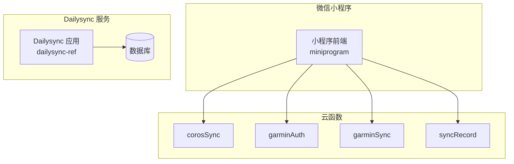
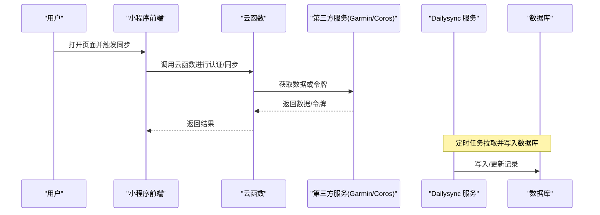
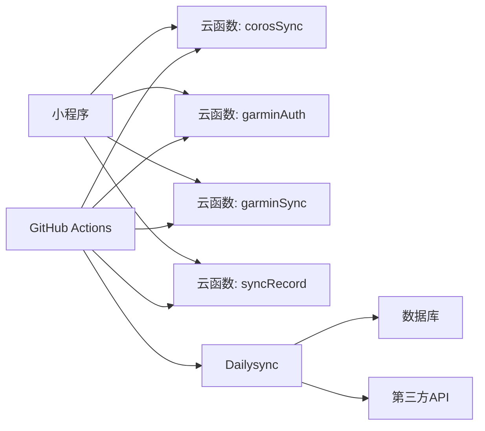

# 部署与构建

<cite>
**本文引用的文件**   
- [README.md](file://README.md)
- [project.config.json](file://project.config.json)
- [uploadCloudFunction.sh](file://uploadCloudFunction.sh)
- [miniprogram/app.json](file://miniprogram/app.json)
- [cloudfunctions/corosSync/index.js](file://cloudfunctions/corosSync/index.js)
- [cloudfunctions/garminAuth/config.json](file://cloudfunctions/garminAuth/config.json)
- [cloudfunctions/garminAuth/index.js](file://cloudfunctions/garminAuth/index.js)
- [cloudfunctions/garminSync/config.json](file://cloudfunctions/garminSync/config.json)
- [cloudfunctions/garminSync/index.js](file://cloudfunctions/garminSync/index.js)
- [cloudfunctions/syncRecord/index.js](file://cloudfunctions/syncRecord/index.js)
- [dailysync-ref/Dockerfile](file://dailysync-ref/Dockerfile)
- [dailysync-ref/docker-compose.yml](file://dailysync-ref/docker-compose.yml)
- [dailysync-ref/package.json](file://dailysync-ref/package.json)
- [dailysync-ref/.github/workflows/daily_sync_rq.yml](file://dailysync-ref/.github/workflows/daily_sync_rq.yml)
- [dailysync-ref/.github/workflows/migrate_garmin_cn_to_garmin_global.yml](file://dailysync-ref/.github/workflows/migrate_garmin_cn_to_garmin_global.yml)
- [dailysync-ref/.github/workflows/migrate_garmin_global_to_garmin_cn.yml](file://dailysync-ref/.github/workflows/migrate_garmin_global_to_garmin_cn.yml)
- [dailysync-ref/.github/workflows/sync_garmin_cn_to_garmin_global.yml](file://dailysync-ref/.github/workflows/sync_garmin_cn_to_garmin_global.yml)
- [dailysync-ref/.github/workflows/sync_garmin_global_to_garmin_cn.yml](file://dailysync-ref/.github/workflows/sync_garmin_global_to_garmin_cn.yml)
</cite>

## 目录
1. [简介](#简介)
2. [项目结构](#项目结构)
3. [核心组件](#核心组件)
4. [架构总览](#架构总览)
5. [详细组件分析](#详细组件分析)
6. [依赖分析](#依赖分析)
7. [性能考虑](#性能考虑)
8. [故障排除指南](#故障排除指南)
9. [结论](#结论)
10. [附录](#附录)

## 简介
本指南面向微信小程序、云函数以及 Dailysync 系统的部署与构建，覆盖以下主题：
- 小程序发布流程：代码上传、版本管理、灰度发布策略
- 云函数部署：本地部署、自动化部署、版本回滚
- Dailysync 系统 Docker 化：镜像构建、容器编排、环境变量配置
- GitHub Actions 工作流：CI/CD 流水线、自动化测试、自动部署
- 生产环境监控与日志收集方案
- 部署故障排除与回滚策略

## 项目结构
本项目包含三大部分：
- 微信小程序前端（miniprogram）
- 云函数（cloudfunctions），提供数据同步与认证能力
- Dailysync 参考实现（dailysync-ref），用于定时任务、数据迁移与同步，支持 Docker 部署与 GitHub Actions 自动化

**图示来源** 
- [miniprogram/app.json](file://miniprogram/app.json)
- [cloudfunctions/corosSync/index.js](file://cloudfunctions/corosSync/index.js)
- [cloudfunctions/garminAuth/index.js](file://cloudfunctions/garminAuth/index.js)
- [cloudfunctions/garminSync/index.js](file://cloudfunctions/garminSync/index.js)
- [cloudfunctions/syncRecord/index.js](file://cloudfunctions/syncRecord/index.js)
- [dailysync-ref/Dockerfile](file://dailysync-ref/Dockerfile)
- [dailysync-ref/docker-compose.yml](file://dailysync-ref/docker-compose.yml)

**章节来源**
- [README.md](file://README.md)
- [project.config.json](file://project.config.json)
- [miniprogram/app.json](file://miniprogram/app.json)

## 核心组件
- 微信小程序前端：负责用户交互与调用云函数
- 云函数：
  - corosSync：Coros 数据同步
  - garminAuth：Garmin 认证
  - garminSync：Garmin 数据同步
  - syncRecord：记录同步状态
- Dailysync 服务：定时任务、数据迁移与同步，支持 Docker 部署与 CI/CD

**章节来源**
- [cloudfunctions/corosSync/index.js](file://cloudfunctions/corosSync/index.js)
- [cloudfunctions/garminAuth/index.js](file://cloudfunctions/garminAuth/index.js)
- [cloudfunctions/garminSync/index.js](file://cloudfunctions/garminSync/index.js)
- [cloudfunctions/syncRecord/index.js](file://cloudfunctions/syncRecord/index.js)
- [dailysync-ref/package.json](file://dailysync-ref/package.json)

## 架构总览
整体架构由小程序前端、云函数与 Dailysync 服务组成。小程序通过云函数访问第三方数据源（如 Garmin、Coros），Dailysync 服务在后台执行定时任务与数据迁移，持久化到数据库。

**图示来源** 
- [cloudfunctions/garminAuth/index.js](file://cloudfunctions/garminAuth/index.js)
- [cloudfunctions/garminSync/index.js](file://cloudfunctions/garminSync/index.js)
- [cloudfunctions/corosSync/index.js](file://cloudfunctions/corosSync/index.js)
- [dailysync-ref/Dockerfile](file://dailysync-ref/Dockerfile)
- [dailysync-ref/docker-compose.yml](file://dailysync-ref/docker-compose.yml)

## 详细组件分析

### 微信小程序发布流程
- 代码上传：使用微信开发者工具或命令行工具将 miniprogram 目录打包上传至微信平台
- 版本管理：在微信公众平台创建新版本，填写版本说明，选择目标受众
- 灰度发布：先向部分用户开放新版本，验证稳定性后再全量发布

建议实践：
- 每次发布前进行本地预览与真机调试
- 使用 app.json 中的配置项控制页面路由与权限
- 发布后在平台查看审核状态与上线时间

**章节来源**
- [miniprogram/app.json](file://miniprogram/app.json)
- [project.config.json](file://project.config.json)

### 云函数部署方法
- 本地部署：通过脚本或控制台将 cloudfunctions 下的各函数目录上传至云开发环境
- 自动化部署：结合 CI/CD 流水线，在推送代码时自动触发上传
- 版本回滚：在云开发控制台回滚到上一个稳定版本，或通过脚本指定版本号重新部署

关键要点：
- 确保每个云函数的 index.js 与 package.json 正确配置依赖
- 敏感信息通过环境变量或配置文件注入，避免硬编码
- 部署前后检查函数入口与权限设置

**章节来源**
- [uploadCloudFunction.sh](file://uploadCloudFunction.sh)
- [cloudfunctions/garminAuth/config.json](file://cloudfunctions/garminAuth/config.json)
- [cloudfunctions/garminSync/config.json](file://cloudfunctions/garminSync/config.json)
- [cloudfunctions/corosSync/index.js](file://cloudfunctions/corosSync/index.js)
- [cloudfunctions/garminAuth/index.js](file://cloudfunctions/garminAuth/index.js)
- [cloudfunctions/garminSync/index.js](file://cloudfunctions/garminSync/index.js)
- [cloudfunctions/syncRecord/index.js](file://cloudfunctions/syncRecord/index.js)

### Dailysync 系统 Docker 化部署
- 镜像构建：基于 Dockerfile 构建应用镜像，包含运行时依赖与编译产物
- 容器编排：使用 docker-compose.yml 定义服务、网络与卷挂载
- 环境变量配置：通过 .env 或 compose 的 environment 字段注入数据库连接、第三方 API 密钥等

最佳实践：
- 使用多阶段构建减小镜像体积
- 将数据库与缓存分离为独立服务
- 通过健康检查确保服务可用性

**章节来源**
- [dailysync-ref/Dockerfile](file://dailysync-ref/Dockerfile)
- [dailysync-ref/docker-compose.yml](file://dailysync-ref/docker-compose.yml)
- [dailysync-ref/package.json](file://dailysync-ref/package.json)

### GitHub Actions 工作流使用说明
- CI/CD 流水线：在 push 或 PR 事件触发构建、测试与打包
- 自动化测试：运行单元测试与集成测试，生成报告
- 自动部署：测试通过后自动部署到预发或生产环境

常用工作流：
- daily_sync_rq.yml：每日定时任务
- migrate_garmin_cn_to_garmin_global.yml / migrate_garmin_global_to_garmin_cn.yml：数据迁移
- sync_garmin_cn_to_garmin_global.yml / sync_garmin_global_to_garmin_cn.yml：数据同步

注意事项：
- 在 Secrets 中配置敏感信息（如数据库密码、API Key）
- 使用缓存加速依赖安装与构建
- 失败时发送通知（邮件、钉钉、企业微信）

**章节来源**
- [dailysync-ref/.github/workflows/daily_sync_rq.yml](file://dailysync-ref/.github/workflows/daily_sync_rq.yml)
- [dailysync-ref/.github/workflows/migrate_garmin_cn_to_garmin_global.yml](file://dailysync-ref/.github/workflows/migrate_garmin_cn_to_garmin_global.yml)
- [dailysync-ref/.github/workflows/migrate_garmin_global_to_garmin_cn.yml](file://dailysync-ref/.github/workflows/migrate_garmin_global_to_garmin_cn.yml)
- [dailysync-ref/.github/workflows/sync_garmin_cn_to_garmin_global.yml](file://dailysync-ref/.github/workflows/sync_garmin_cn_to_garmin_global.yml)
- [dailysync-ref/.github/workflows/sync_garmin_global_to_garmin_cn.yml](file://dailysync-ref/.github/workflows/sync_garmin_global_to_garmin_cn.yml)

### 生产环境监控与日志收集方案
- 指标采集：通过应用内埋点与外部监控（如 Prometheus + Grafana）收集 QPS、延迟、错误率
- 日志收集：集中式日志系统（如 ELK/EFK）统一收集小程序、云函数与 Dailysync 日志
- 告警规则：基于阈值与异常模式设置告警，及时通知运维人员

建议：
- 对关键接口添加慢查询与超时监控
- 使用结构化日志便于检索与分析
- 定期演练告警响应流程

[本节为通用指导，不直接分析具体文件]

## 依赖分析
组件间依赖关系如下：
- 小程序依赖云函数进行数据同步与认证
- Dailysync 依赖数据库与第三方 API
- CI/CD 依赖 GitHub Actions 与 Secrets 配置

**图示来源** 
- [miniprogram/app.json](file://miniprogram/app.json)
- [cloudfunctions/corosSync/index.js](file://cloudfunctions/corosSync/index.js)
- [cloudfunctions/garminAuth/index.js](file://cloudfunctions/garminAuth/index.js)
- [cloudfunctions/garminSync/index.js](file://cloudfunctions/garminSync/index.js)
- [cloudfunctions/syncRecord/index.js](file://cloudfunctions/syncRecord/index.js)
- [dailysync-ref/Dockerfile](file://dailysync-ref/Dockerfile)
- [dailysync-ref/docker-compose.yml](file://dailysync-ref/docker-compose.yml)
- [dailysync-ref/.github/workflows/daily_sync_rq.yml](file://dailysync-ref/.github/workflows/daily_sync_rq.yml)

**章节来源**
- [project.config.json](file://project.config.json)
- [dailysync-ref/package.json](file://dailysync-ref/package.json)

## 性能考虑
- 小程序端：减少不必要的请求，使用缓存与懒加载
- 云函数：优化依赖安装与冷启动时间，合理设置内存与超时
- Dailysync：分页拉取数据，批量写入数据库，避免锁竞争
- 监控：关注 P95/P99 延迟与错误率，持续优化瓶颈

[本节为通用指导，不直接分析具体文件]

## 故障排除指南
常见问题与解决步骤：
- 云函数调用失败：检查函数入口、权限与环境变量
- 小程序无法访问云函数：确认网络与域名白名单
- Dailysync 启动失败：检查 Docker 镜像与数据库连接
- CI/CD 构建失败：查看日志输出，修复依赖或语法错误

回滚策略：
- 小程序：在平台回滚到上一版本
- 云函数：通过控制台或脚本回滚到稳定版本
- Dailysync：使用 docker-compose 切换镜像标签或提交哈希

**章节来源**
- [uploadCloudFunction.sh](file://uploadCloudFunction.sh)
- [dailysync-ref/docker-compose.yml](file://dailysync-ref/docker-compose.yml)

## 结论
本指南提供了从小程序到云函数再到 Dailysync 服务的完整部署与构建方案。通过规范的版本管理、自动化流水线与完善的监控告警，可保障系统在开发与生产环境中的稳定运行。建议团队遵循本文最佳实践，持续优化部署效率与系统可靠性。

[本节为总结性内容，不直接分析具体文件]

## 附录
- 相关命令与脚本路径请参考各章节“章节来源”
- 如需进一步定制 CI/CD 流程，可参考 dailysync-ref 下的工作流示例

[本节为补充信息，不直接分析具体文件]