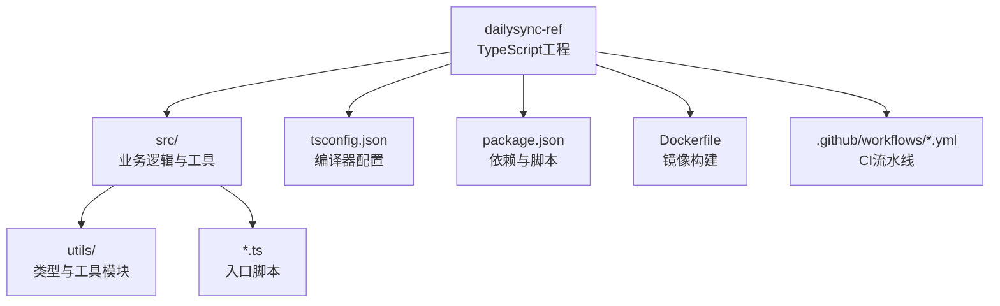
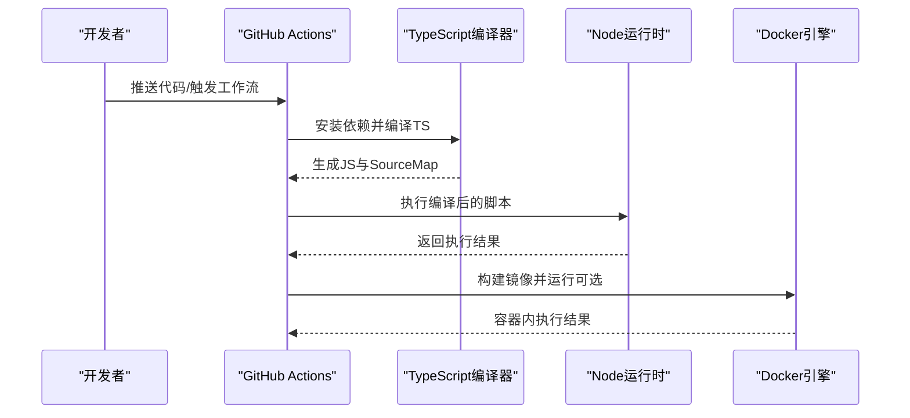
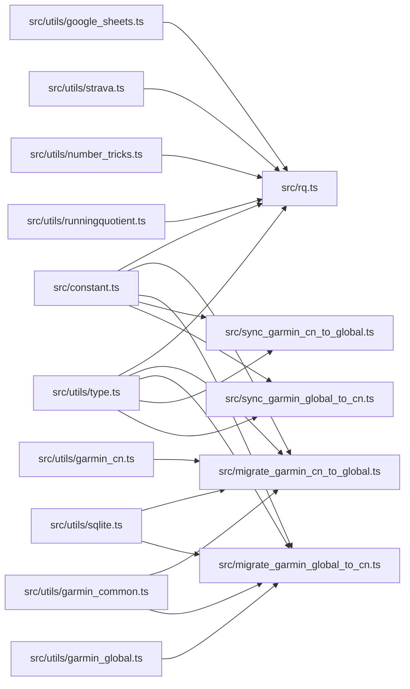

# TypeScript项目配置

<cite>
**本文引用的文件**   
- [tsconfig.json](file://dailysync-ref/tsconfig.json)
- [package.json](file://dailysync-ref/package.json)
- [Dockerfile](file://dailysync-ref/Dockerfile)
- [docker-compose.yml](file://dailysync-ref/docker-compose.yml)
- [README.md](file://dailysync-ref/README.md)
- [.github/workflows/daily_sync_rq.yml](file://dailysync-ref/.github/workflows/daily_sync_rq.yml)
- [.github/workflows/migrate_garmin_cn_to_garmin_global.yml](file://dailysync-ref/.github/workflows/migrate_garmin_cn_to_garmin_global.yml)
- [.github/workflows/migrate_garmin_global_to_garmin_cn.yml](file://dailysync-ref/.github/workflows/migrate_garmin_global_to_garmin_cn.yml)
- [.github/workflows/sync_garmin_cn_to_garmin_global.yml](file://dailysync-ref/.github/workflows/sync_garmin_cn_to_garmin_global.yml)
- [.github/workflows/sync_garmin_global_to_garmin_cn.yml](file://dailysync-ref/.github/workflows/sync_garmin_global_to_garmin_cn.yml)
- [constant.ts](file://dailysync-ref/src/constant.ts)
- [rq.ts](file://dailysync-ref/src/rq.ts)
- [migrate_garmin_cn_to_global.ts](file://dailysync-ref/src/migrate_garmin_cn_to_global.ts)
- [migrate_garmin_global_to_cn.ts](file://dailysync-ref/src/migrate_garmin_global_to_cn.ts)
- [sync_garmin_cn_to_global.ts](file://dailysync-ref/src/sync_garmin_cn_to_global.ts)
- [sync_garmin_global_to_cn.ts](file://dailysync-ref/src/sync_garmin_global_to_cn.ts)
- [utils/type.ts](file://dailysync-ref/src/utils/type.ts)
- [utils/sqlite.ts](file://dailysync-ref/src/utils/sqlite.ts)
- [utils/google_sheets.ts](file://dailysync-ref/src/utils/google_sheets.ts)
- [utils/strava.ts](file://dailysync-ref/src/utils/strava.ts)
- [utils/garmin_common.ts](file://dailysync-ref/src/utils/garmin_common.ts)
- [utils/garmin_cn.ts](file://dailysync-ref/src/utils/garmin_cn.ts)
- [utils/garmin_global.ts](file://dailysync-ref/src/utils/garmin_global.ts)
- [utils/number_tricks.ts](file://dailysync-ref/src/utils/number_tricks.ts)
- [utils/runningquotient.ts](file://dailysync-ref/src/utils/runningquotient.ts)
</cite>

## 目录
1. [简介](#简介)
2. [项目结构](#项目结构)
3. [核心组件](#核心组件)
4. [架构总览](#架构总览)
5. [详细组件分析](#详细组件分析)
6. [依赖分析](#依赖分析)
7. [性能考虑](#性能考虑)
8. [故障排查指南](#故障排查指南)
9. [结论](#结论)
10. [附录](#附录)

## 简介
本文件面向TypeScript项目的配置与最佳实践，重点围绕仓库中的dailysync-ref子项目展开。内容涵盖：
- tsconfig.json编译器选项、模块解析策略、目标版本设置等关键配置项的解读与实践建议
- TypeScript与JavaScript集成方式（编译产物、Node运行环境、容器化部署）
- 类型定义文件的组织与使用（src/utils/type.ts等）
- 代码质量工具（ESLint、Prettier）的配置思路与落地建议
- 编译优化与调试技巧（增量构建、Source Map、日志与错误定位）
- 常见问题与解决方案（模块解析失败、路径别名、运行时兼容、CI/CD集成问题）

本项目为数据同步与迁移脚本集合，包含多个TypeScript源文件与工具模块，通过Node.js运行，并支持Docker与GitHub Actions自动化流程。

## 项目结构
- dailysync-ref：TypeScript主工程，包含源码、配置文件、Docker与CI工作流
- miniprogram：微信小程序前端（非TypeScript主体，本文不深入）
- cloudfunctions：云函数（JavaScript为主，非TypeScript主体）

图表来源
- [tsconfig.json](file://dailysync-ref/tsconfig.json)
- [package.json](file://dailysync-ref/package.json)
- [Dockerfile](file://dailysync-ref/Dockerfile)
- [.github/workflows/daily_sync_rq.yml](file://dailysync-ref/.github/workflows/daily_sync_rq.yml)

章节来源
- [README.md](file://dailysync-ref/README.md)
- [package.json](file://dailysync-ref/package.json)
- [tsconfig.json](file://dailysync-ref/tsconfig.json)

## 核心组件
- 编译器配置（tsconfig.json）：决定语言级别、模块系统、输出目录、严格模式、路径映射等
- 依赖与脚本（package.json）：管理TypeScript版本、运行时依赖、构建与执行脚本
- 源码组织（src/*）：业务脚本与工具模块，类型定义集中在utils/type.ts
- 运行与部署（Dockerfile、docker-compose.yml）：容器化打包与编排
- CI/CD（.github/workflows）：定时任务、数据同步与迁移流水线

章节来源
- [tsconfig.json](file://dailysync-ref/tsconfig.json)
- [package.json](file://dailysync-ref/package.json)
- [Dockerfile](file://dailysync-ref/Dockerfile)
- [docker-compose.yml](file://dailysync-ref/docker-compose.yml)
- [.github/workflows/daily_sync_rq.yml](file://dailysync-ref/.github/workflows/daily_sync_rq.yml)

## 架构总览
下图展示TypeScript到Node运行的整体流程，以及CI如何触发构建与执行。

图表来源
- [.github/workflows/daily_sync_rq.yml](file://dailysync-ref/.github/workflows/daily_sync_rq.yml)
- [Dockerfile](file://dailysync-ref/Dockerfile)
- [package.json](file://dailysync-ref/package.json)

## 详细组件分析

### tsconfig.json编译器选项与模块解析
- 目标版本（target）：决定编译输出的ECMAScript版本，需与Node运行时能力匹配
- 模块系统（module）：选择CommonJS或ESM，影响import/export与require行为
- 模块解析策略（moduleResolution）：node/node16等，决定@types与路径解析规则
- 严格模式（strict）：启用空值检查、类型收窄、未使用变量检测等
- 输出目录（outDir）与根目录（rootDir）：控制编译产物位置与输入范围
- 路径映射（paths）与baseUrl：简化导入路径，提升可读性与可维护性
- 声明文件（types/typeRoots）：集中管理第三方库的类型定义
- Source Map（sourceMap）：便于调试，将运行时错误映射回TS源码

章节来源
- [tsconfig.json](file://dailysync-ref/tsconfig.json)

### TypeScript与JavaScript集成
- 编译产物：TS编译为JS后由Node执行，确保target与Node版本兼容
- 依赖注入：通过package.json引入TypeScript与运行时依赖
- 运行脚本：在package.json中定义build与run命令，统一入口
- 容器化：Dockerfile封装Node环境与依赖，保证一致性

章节来源
- [package.json](file://dailysync-ref/package.json)
- [Dockerfile](file://dailysync-ref/Dockerfile)
- [docker-compose.yml](file://dailysync-ref/docker-compose.yml)

### 类型定义文件的配置与使用
- 集中类型：src/utils/type.ts定义共享类型，供各模块复用
- 第三方类型：通过@types包或自定义.d.ts提供类型声明
- 类型校验：配合strict与noImplicitAny等选项提升类型安全

章节来源
- [utils/type.ts](file://dailysync-ref/src/utils/type.ts)

### 代码质量工具（ESLint与Prettier）
- ESLint：静态检查语法与风格，结合TypeScript解析器与插件
- Prettier：统一代码格式，与编辑器集成实现保存时格式化
- 集成建议：在package.json中配置lint与format脚本，CI中强制执行

章节来源
- [package.json](file://dailysync-ref/package.json)

### 编译优化与调试技巧
- 增量构建：利用tsc --incremental减少编译时间
- Source Map：开启sourceMap以精确定位错误行号
- 日志与断点：在Node中使用--inspect进行调试
- 环境变量：通过.env或命令行参数控制运行行为

章节来源
- [package.json](file://dailysync-ref/package.json)
- [Dockerfile](file://dailysync-ref/Dockerfile)

### 常见配置问题与解决方案
- 模块解析失败：检查moduleResolution与paths配置，确认依赖已安装
- 类型缺失：安装对应@types包或补充.d.ts声明
- 运行时崩溃：核对target与Node版本兼容性
- CI构建失败：确认缓存与依赖安装步骤正确

章节来源
- [tsconfig.json](file://dailysync-ref/tsconfig.json)
- [package.json](file://dailysync-ref/package.json)

## 依赖分析
下图展示核心模块间的依赖关系与职责划分。

图表来源
- [constant.ts](file://dailysync-ref/src/constant.ts)
- [rq.ts](file://dailysync-ref/src/rq.ts)
- [migrate_garmin_cn_to_global.ts](file://dailysync-ref/src/migrate_garmin_cn_to_global.ts)
- [migrate_garmin_global_to_cn.ts](file://dailysync-ref/src/migrate_garmin_global_to_cn.ts)
- [sync_garmin_cn_to_global.ts](file://dailysync-ref/src/sync_garmin_cn_to_global.ts)
- [sync_garmin_global_to_cn.ts](file://dailysync-ref/src/sync_garmin_global_to_cn.ts)
- [utils/type.ts](file://dailysync-ref/src/utils/type.ts)
- [utils/sqlite.ts](file://dailysync-ref/src/utils/sqlite.ts)
- [utils/google_sheets.ts](file://dailysync-ref/src/utils/google_sheets.ts)
- [utils/strava.ts](file://dailysync-ref/src/utils/strava.ts)
- [utils/garmin_common.ts](file://dailysync-ref/src/utils/garmin_common.ts)
- [utils/garmin_cn.ts](file://dailysync-ref/src/utils/garmin_cn.ts)
- [utils/garmin_global.ts](file://dailysync-ref/src/utils/garmin_global.ts)
- [utils/number_tricks.ts](file://dailysync-ref/src/utils/number_tricks.ts)
- [utils/runningquotient.ts](file://dailysync-ref/src/utils/runningquotient.ts)

章节来源
- [constant.ts](file://dailysync-ref/src/constant.ts)
- [utils/type.ts](file://dailysync-ref/src/utils/type.ts)

## 性能考虑
- 合理设置target与module，避免不必要的polyfill与转换开销
- 使用路径别名减少深层导入带来的解析成本
- 在CI中缓存依赖与编译产物，缩短构建时间
- 按需加载模块，避免一次性引入重型依赖

[本节为通用指导，无需特定文件引用]

## 故障排查指南
- 编译阶段
  - 检查tsconfig.json的target、module、moduleResolution是否与环境一致
  - 确认所有依赖已安装，特别是@types包
- 运行阶段
  - 核对Node版本与target兼容性
  - 查看Source Map定位错误行号
- CI/CD
  - 检查工作流脚本是否正确安装依赖与执行构建
  - 检查环境变量与密钥配置

章节来源
- [tsconfig.json](file://dailysync-ref/tsconfig.json)
- [package.json](file://dailysync-ref/package.json)
- [.github/workflows/daily_sync_rq.yml](file://dailysync-ref/.github/workflows/daily_sync_rq.yml)

## 结论
通过合理的tsconfig配置、清晰的类型组织、严格的代码质量工具与稳定的CI/CD流程，可以显著提升TypeScript项目的可维护性与交付效率。建议在团队内统一配置规范，并在CI中强制检查，确保代码质量与构建稳定性。

[本节为总结性内容，无需特定文件引用]

## 附录
- 推荐配置清单
  - target：与Node版本匹配（如ES2020）
  - module：根据运行环境选择（CommonJS或ESM）
  - strict：启用严格模式
  - sourceMap：开启以便调试
  - paths：配置路径别名
- 常用脚本
  - build：编译TS
  - lint：执行ESLint
  - format：执行Prettier
  - start：运行编译后的脚本

[本节为补充信息，无需特定文件引用]