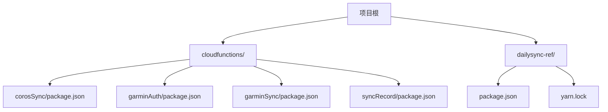
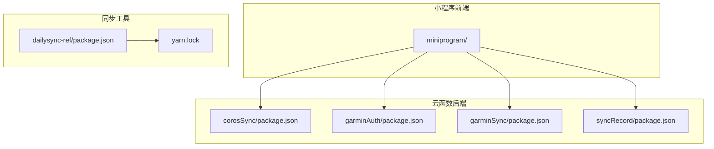
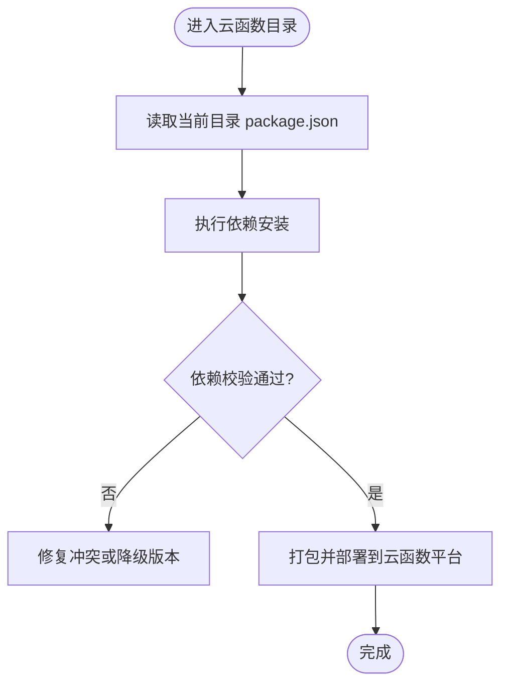
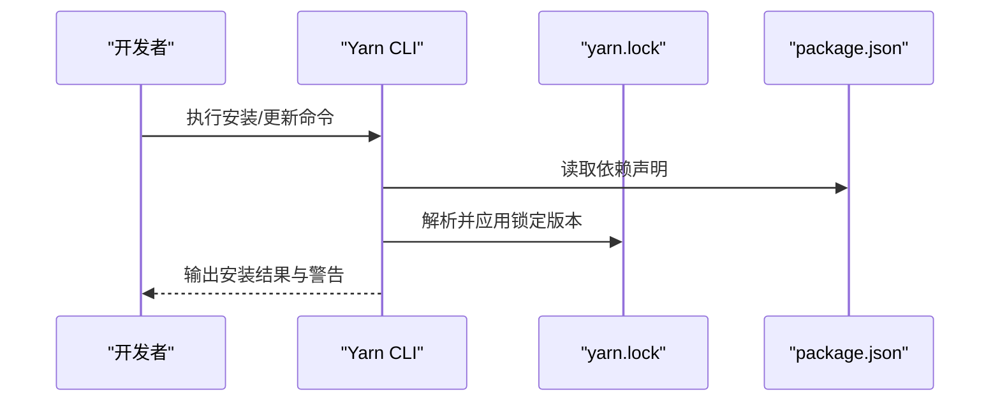
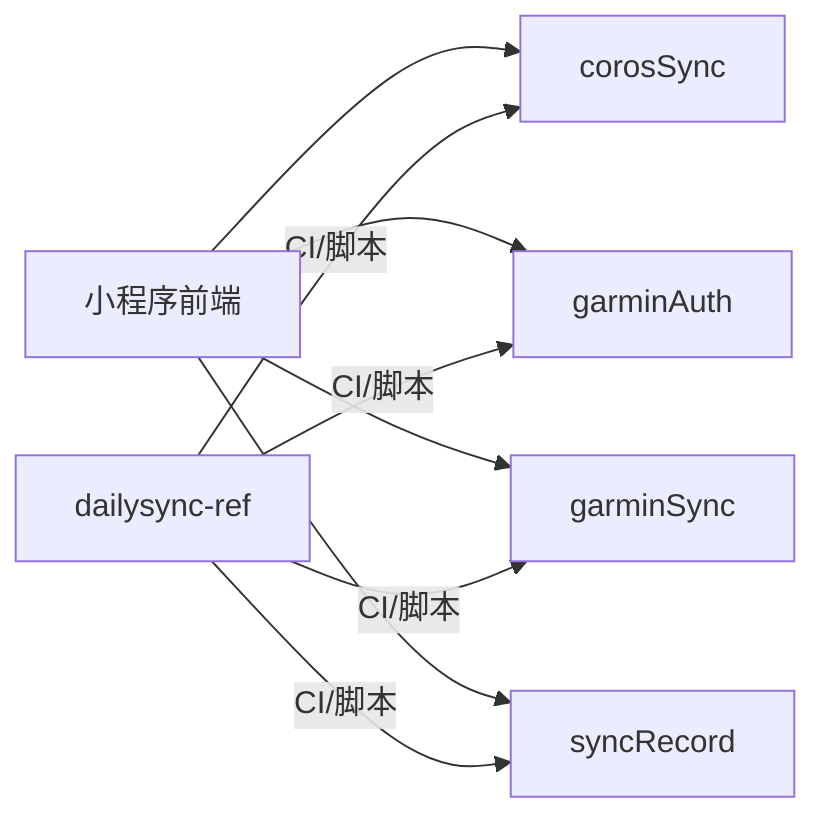

# 依赖管理与包管理

<cite>
**本文引用的文件**   
- [cloudfunctions/corosSync/package.json](file://cloudfunctions/corosSync/package.json)
- [cloudfunctions/garminAuth/package.json](file://cloudfunctions/garminAuth/package.json)
- [cloudfunctions/garminSync/package.json](file://cloudfunctions/garminSync/package.json)
- [cloudfunctions/syncRecord/package.json](file://cloudfunctions/syncRecord/package.json)
- [dailysync-ref/package.json](file://dailysync-ref/package.json)
- [dailysync-ref/yarn.lock](file://dailysync-ref/yarn.lock)
- [README.md](file://README.md)
</cite>

## 目录
1. [简介](#简介)
2. [项目结构](#项目结构)
3. [核心组件](#核心组件)
4. [架构总览](#架构总览)
5. [详细组件分析](#详细组件分析)
6. [依赖关系分析](#依赖关系分析)
7. [性能考虑](#性能考虑)
8. [故障排查指南](#故障排查指南)
9. [结论](#结论)
10. [附录](#附录)

## 简介
本文件围绕该微信小程序项目的依赖与包管理策略进行系统化说明，重点涵盖：
- package.json 的结构与用途（元数据、脚本命令、依赖声明）
- 开发依赖与生产依赖的区分与管理
- 云函数独立依赖管理的实践（每个云函数的 package.json）
- 依赖更新与安全更新流程
- 依赖冲突解决方法与性能优化建议
- npm / yarn 使用技巧与最佳实践

## 项目结构
本项目包含以下与依赖管理相关的关键位置：
- 根级或子模块级 package.json：用于声明依赖、脚本命令与项目元数据
- cloudfunctions 目录下的各云函数子目录：每个云函数拥有独立的 package.json，实现独立依赖隔离
- dailysync-ref 子模块：包含 TypeScript 工具链与构建配置，以及 yarn.lock 锁定依赖版本

**图表来源** 
- [cloudfunctions/corosSync/package.json](file://cloudfunctions/corosSync/package.json)
- [cloudfunctions/garminAuth/package.json](file://cloudfunctions/garminAuth/package.json)
- [cloudfunctions/garminSync/package.json](file://cloudfunctions/garminSync/package.json)
- [cloudfunctions/syncRecord/package.json](file://cloudfunctions/syncRecord/package.json)
- [dailysync-ref/package.json](file://dailysync-ref/package.json)
- [dailysync-ref/yarn.lock](file://dailysync-ref/yarn.lock)

**章节来源**
- [README.md](file://README.md)

## 核心组件
- package.json：定义项目名称、版本、描述、入口、脚本命令、依赖与开发依赖等元数据。不同位置的 package.json 对应不同的运行环境与构建目标。
- cloudfunctions/*/package.json：每个云函数独立声明其运行时所需依赖，确保部署时仅安装必要包，减小体积并提升冷启动速度。
- dailysync-ref/package.json 与 yarn.lock：集中管理同步工具的依赖与版本锁定，保证跨环境一致性。

**章节来源**
- [cloudfunctions/corosSync/package.json](file://cloudfunctions/corosSync/package.json)
- [cloudfunctions/garminAuth/package.json](file://cloudfunctions/garminAuth/package.json)
- [cloudfunctions/garminSync/package.json](file://cloudfunctions/garminSync/package.json)
- [cloudfunctions/syncRecord/package.json](file://cloudfunctions/syncRecord/package.json)
- [dailysync-ref/package.json](file://dailysync-ref/package.json)
- [dailysync-ref/yarn.lock](file://dailysync-ref/yarn.lock)

## 架构总览
从依赖管理视角看，系统由“小程序前端 + 云函数后端 + 同步工具”三部分组成，各自通过独立的 package.json 管理依赖，形成清晰的边界与职责分离。

**图表来源** 
- [cloudfunctions/corosSync/package.json](file://cloudfunctions/corosSync/package.json)
- [cloudfunctions/garminAuth/package.json](file://cloudfunctions/garminAuth/package.json)
- [cloudfunctions/garminSync/package.json](file://cloudfunctions/garminSync/package.json)
- [cloudfunctions/syncRecord/package.json](file://cloudfunctions/syncRecord/package.json)
- [dailysync-ref/package.json](file://dailysync-ref/package.json)
- [dailysync-ref/yarn.lock](file://dailysync-ref/yarn.lock)

## 详细组件分析

### 云函数独立依赖管理
每个云函数目录均包含独立的 package.json，用于声明该函数运行所需的依赖。这样做的优势包括：
- 精确控制函数体积，减少冷启动时间
- 避免函数间依赖污染
- 便于按函数维度进行安全扫描与更新

**图表来源** 
- [cloudfunctions/corosSync/package.json](file://cloudfunctions/corosSync/package.json)
- [cloudfunctions/garminAuth/package.json](file://cloudfunctions/garminAuth/package.json)
- [cloudfunctions/garminSync/package.json](file://cloudfunctions/garminSync/package.json)
- [cloudfunctions/syncRecord/package.json](file://cloudfunctions/syncRecord/package.json)

**章节来源**
- [cloudfunctions/corosSync/package.json](file://cloudfunctions/corosSync/package.json)
- [cloudfunctions/garminAuth/package.json](file://cloudfunctions/garminAuth/package.json)
- [cloudfunctions/garminSync/package.json](file://cloudfunctions/garminSync/package.json)
- [cloudfunctions/syncRecord/package.json](file://cloudfunctions/syncRecord/package.json)

### dailysync-ref 子模块依赖管理
该子模块使用 yarn 进行依赖锁定，确保团队与 CI 环境的一致性。关键要点：
- package.json 中声明依赖与脚本命令（如构建、迁移、同步任务）
- yarn.lock 锁定具体版本，避免“在我机器上能跑”的问题
- 可通过工作区或独立安装方式管理依赖

**图表来源** 
- [dailysync-ref/package.json](file://dailysync-ref/package.json)
- [dailysync-ref/yarn.lock](file://dailysync-ref/yarn.lock)

**章节来源**
- [dailysync-ref/package.json](file://dailysync-ref/package.json)
- [dailysync-ref/yarn.lock](file://dailysync-ref/yarn.lock)

### package.json 结构与职责
- 元数据字段：名称、版本、描述、作者、许可证等，用于标识与发布
- 脚本命令：封装常用操作（安装、构建、测试、部署），提高协作效率
- 依赖声明：dependencies 与 devDependencies 分离，确保运行与开发环境的清晰边界
- 入口与配置：指定入口文件、类型检查、编译选项等

**章节来源**
- [dailysync-ref/package.json](file://dailysync-ref/package.json)

## 依赖关系分析
- 云函数之间无共享依赖，各自通过独立 package.json 管理，降低耦合度
- 小程序前端与云函数通过 API 交互，不直接共享 Node.js 依赖
- 同步工具与云函数解耦，通过命令行或 CI 触发，依赖锁定在 yarn.lock 中

**图表来源** 
- [cloudfunctions/corosSync/package.json](file://cloudfunctions/corosSync/package.json)
- [cloudfunctions/garminAuth/package.json](file://cloudfunctions/garminAuth/package.json)
- [cloudfunctions/garminSync/package.json](file://cloudfunctions/garminSync/package.json)
- [cloudfunctions/syncRecord/package.json](file://cloudfunctions/syncRecord/package.json)
- [dailysync-ref/package.json](file://dailysync-ref/package.json)

**章节来源**
- [cloudfunctions/corosSync/package.json](file://cloudfunctions/corosSync/package.json)
- [cloudfunctions/garminAuth/package.json](file://cloudfunctions/garminAuth/package.json)
- [cloudfunctions/garminSync/package.json](file://cloudfunctions/garminSync/package.json)
- [cloudfunctions/syncRecord/package.json](file://cloudfunctions/syncRecord/package.json)
- [dailysync-ref/package.json](file://dailysync-ref/package.json)

## 性能考虑
- 云函数依赖最小化：仅安装运行时必需包，减少包体积与冷启动时间
- 依赖版本锁定：使用 yarn.lock 或 npm ci 确保可重复构建，避免意外升级导致性能退化
- 缓存策略：利用包管理器缓存与 CDN 加速下载，缩短安装时间
- 构建优化：对大依赖进行按需引入或替换为轻量替代方案

[本节为通用指导，无需特定文件引用]

## 故障排查指南
- 依赖冲突定位：查看安装日志中的冲突提示，优先调整版本号范围或使用 resolutions/overrides 强制统一
- 版本不一致：确保本地与 CI 使用相同的包管理器与版本（npm vs yarn），并遵循锁定文件
- 云函数部署失败：检查函数目录的 package.json 是否完整、依赖是否可安装、权限是否正确
- 安全漏洞修复：定期扫描依赖漏洞，优先升级到安全补丁版本，必要时回滚到稳定分支

**章节来源**
- [dailysync-ref/yarn.lock](file://dailysync-ref/yarn.lock)

## 结论
本项目采用“多包独立管理”的策略，将小程序前端、云函数与同步工具解耦，通过各自的 package.json 明确依赖边界，结合 yarn.lock 保障版本一致性。建议在团队协作中严格遵循锁定文件、最小化依赖、定期安全扫描与自动化部署的最佳实践，以提升稳定性与可维护性。

[本节为总结性内容，无需特定文件引用]

## 附录
- npm / yarn 常用命令与技巧：
  - 安装依赖：npm install / yarn install
  - 锁定安装：npm ci / yarn install --frozen-lockfile
  - 更新依赖：npm update / yarn upgrade；安全更新：npm audit fix / yarn audit
  - 清理缓存：npm cache clean --force / yarn cache clean
- 最佳实践清单：
  - 始终提交锁定文件（package-lock.json 或 yarn.lock）
  - 区分 dependencies 与 devDependencies
  - 使用语义化版本约束（^、~）平衡灵活性与稳定性
  - 在 CI 中固定包管理器版本，确保一致构建环境

[本节为通用指导，无需特定文件引用]