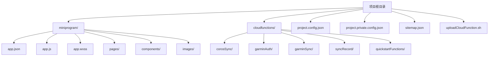
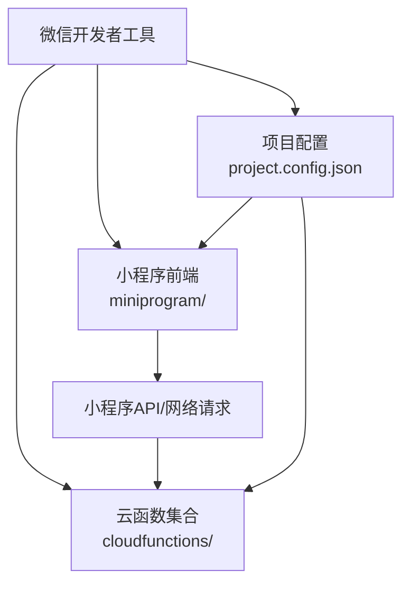
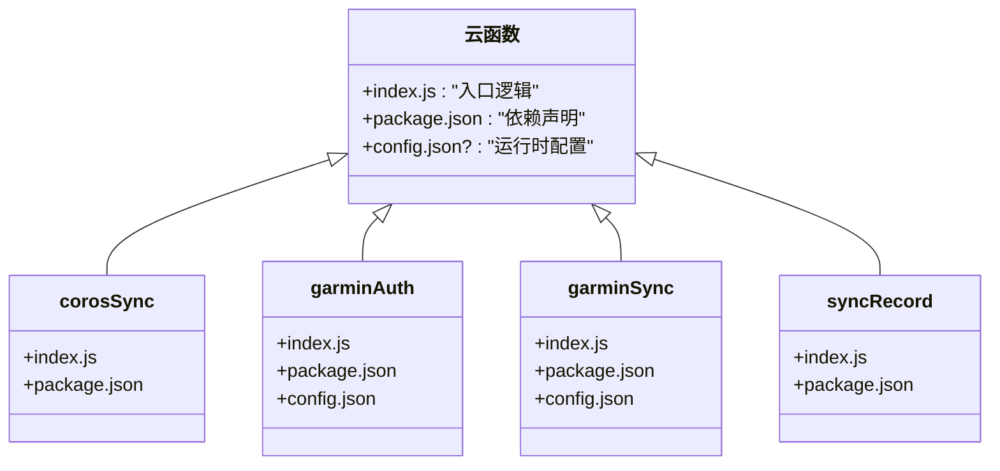
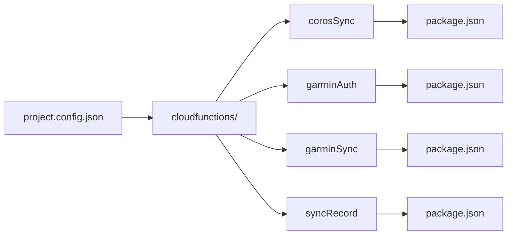

# 开发环境安装与配置

<cite>
**本文引用的文件**   
- [project.config.json](file://project.config.json)
- [project.private.config.json](file://project.private.config.json)
- [miniprogram/app.json](file://miniprogram/app.json)
- [miniprogram/app.js](file://miniprogram/app.js)
- [miniprogram/sitemap.json](file://miniprogram/sitemap.json)
- [cloudfunctions/corosSync/index.js](file://cloudfunctions/corosSync/index.js)
- [cloudfunctions/corosSync/package.json](file://cloudfunctions/corosSync/package.json)
- [cloudfunctions/garminAuth/config.json](file://cloudfunctions/garminAuth/config.json)
- [cloudfunctions/garminAuth/index.js](file://cloudfunctions/garminAuth/index.js)
- [cloudfunctions/garminAuth/package.json](file://cloudfunctions/garminAuth/package.json)
- [cloudfunctions/garminSync/config.json](file://cloudfunctions/garminSync/config.json)
- [cloudfunctions/garminSync/index.js](file://cloudfunctions/garminSync/index.js)
- [cloudfunctions/garminSync/package.json](file://cloudfunctions/garminSync/package.json)
- [cloudfunctions/syncRecord/index.js](file://cloudfunctions/syncRecord/index.js)
- [cloudfunctions/syncRecord/package.json](file://cloudfunctions/syncRecord/package.json)
- [uploadCloudFunction.sh](file://uploadCloudFunction.sh)
</cite>

## 目录
1. [简介](#简介)
2. [项目结构](#项目结构)
3. [核心组件](#核心组件)
4. [架构总览](#架构总览)
5. [详细组件分析](#详细组件分析)
6. [依赖分析](#依赖分析)
7. [性能考虑](#性能考虑)
8. [故障排查指南](#故障排查指南)
9. [结论](#结论)
10. [附录](#附录)

## 简介
本指南面向首次或重新搭建微信小程序开发环境的开发者，围绕微信开发者工具的安装、版本要求、基础设置，以及本项目的项目配置文件 project.config.json 的关键参数进行详细说明。同时，结合项目中的小程序目录结构与云函数目录结构，解释各核心文件的作用，并提供环境验证方法与常见问题排查方案，帮助你快速、稳定地进入开发状态。

## 项目结构
本项目采用“小程序前端 + 云函数后端”的常见结构：
- miniprogram：小程序前端代码，包含页面、组件、全局配置与样式等。
- cloudfunctions：云函数集合，每个子目录为一个独立的云函数，内含入口脚本与依赖声明。
- 根目录：项目级配置文件（project.config.json、project.private.config.json）、站点地图（sitemap.json）与辅助脚本（如上传云函数脚本）。

图表来源
- [project.config.json:1-200](file://project.config.json#L1-L200)
- [miniprogram/app.json:1-200](file://miniprogram/app.json#L1-L200)
- [miniprogram/app.js:1-200](file://miniprogram/app.js#L1-L200)
- [cloudfunctions/corosSync/index.js:1-200](file://cloudfunctions/corosSync/index.js#L1-L200)
- [cloudfunctions/garminAuth/index.js:1-200](file://cloudfunctions/garminAuth/index.js#L1-L200)
- [cloudfunctions/garminSync/index.js:1-200](file://cloudfunctions/garminSync/index.js#L1-L200)
- [cloudfunctions/syncRecord/index.js:1-200](file://cloudfunctions/syncRecord/index.js#L1-L200)

章节来源
- [project.config.json:1-200](file://project.config.json#L1-L200)
- [miniprogram/app.json:1-200](file://miniprogram/app.json#L1-L200)
- [miniprogram/app.js:1-200](file://miniprogram/app.js#L1-L200)
- [cloudfunctions/corosSync/index.js:1-200](file://cloudfunctions/corosSync/index.js#L1-L200)
- [cloudfunctions/garminAuth/index.js:1-200](file://cloudfunctions/garminAuth/index.js#L1-L200)
- [cloudfunctions/garminSync/index.js:1-200](file://cloudfunctions/garminSync/index.js#L1-L200)
- [cloudfunctions/syncRecord/index.js:1-200](file://cloudfunctions/syncRecord/index.js#L1-L200)

## 核心组件
- 项目级配置
  - project.config.json：定义 AppID、编译选项、调试器行为、云函数路径、上传与预览设置等。
  - project.private.config.json：本地私有配置（通常不提交到版本库），用于覆盖公共配置中的个性化项。
- 小程序应用配置与入口
  - miniprogram/app.json：小程序全局配置（窗口、页面路由、tabBar、插件等）。
  - miniprogram/app.js：应用生命周期与初始化逻辑。
  - miniprogram/sitemap.json：站点地图配置，影响搜索引擎收录策略。
- 云函数模块
  - cloudfunctions/*：每个子目录为一个云函数，包含 index.js（入口）与 package.json（依赖声明），部分函数还包含 config.json（运行时配置）。

章节来源
- [project.config.json:1-200](file://project.config.json#L1-L200)
- [project.private.config.json:1-200](file://project.private.config.json#L1-L200)
- [miniprogram/app.json:1-200](file://miniprogram/app.json#L1-L200)
- [miniprogram/app.js:1-200](file://miniprogram/app.js#L1-L200)
- [miniprogram/sitemap.json:1-200](file://miniprogram/sitemap.json#L1-L200)
- [cloudfunctions/corosSync/index.js:1-200](file://cloudfunctions/corosSync/index.js#L1-L200)
- [cloudfunctions/corosSync/package.json:1-200](file://cloudfunctions/corosSync/package.json#L1-L200)
- [cloudfunctions/garminAuth/config.json:1-200](file://cloudfunctions/garminAuth/config.json#L1-L200)
- [cloudfunctions/garminAuth/index.js:1-200](file://cloudfunctions/garminAuth/index.js#L1-L200)
- [cloudfunctions/garminAuth/package.json:1-200](file://cloudfunctions/garminAuth/package.json#L1-L200)
- [cloudfunctions/garminSync/config.json:1-200](file://cloudfunctions/garminSync/config.json#L1-L200)
- [cloudfunctions/garminSync/index.js:1-200](file://cloudfunctions/garminSync/index.js#L1-L200)
- [cloudfunctions/garminSync/package.json:1-200](file://cloudfunctions/garminSync/package.json#L1-L200)
- [cloudfunctions/syncRecord/index.js:1-200](file://cloudfunctions/syncRecord/index.js#L1-L200)
- [cloudfunctions/syncRecord/package.json:1-200](file://cloudfunctions/syncRecord/package.json#L1-L200)

## 架构总览
小程序前端通过微信开发者工具进行编辑、编译与预览；云函数部署在微信云开发环境中，由小程序端调用。项目根目录的 project.config.json 负责将小程序与云函数关联起来，并控制编译与调试行为。

图表来源
- [project.config.json:1-200](file://project.config.json#L1-L200)
- [miniprogram/app.json:1-200](file://miniprogram/app.json#L1-L200)
- [cloudfunctions/corosSync/index.js:1-200](file://cloudfunctions/corosSync/index.js#L1-L200)
- [cloudfunctions/garminAuth/index.js:1-200](file://cloudfunctions/garminAuth/index.js#L1-L200)
- [cloudfunctions/garminSync/index.js:1-200](file://cloudfunctions/garminSync/index.js#L1-L200)
- [cloudfunctions/syncRecord/index.js:1-200](file://cloudfunctions/syncRecord/index.js#L1-L200)

## 详细组件分析

### 项目配置：project.config.json
该文件是微信开发者工具读取的核心配置，涵盖以下关键维度：
- 基本设置
  - appid：小程序唯一标识，必须与微信公众平台注册的小程序一致。
  - setting：编译与打包相关设置，如 ES6 转译、ESLint、分包优化、自动上报等。
  - compileType：编译类型（如小程序、小游戏等）。
  - libVersion：基础库版本，建议保持默认或根据兼容性需求调整。
- 调试与预览
  - debugOptions：调试器行为（如是否启用远程调试、日志级别等）。
  - condition：预览与真机调试的启动场景配置。
- 云开发集成
  - cloudfunctionRoot：云函数根目录路径（通常为 cloudfunctions）。
  - cloudConfigPath：云开发配置文件路径（若使用云开发控制台生成）。
  - cloudfunctionEnv：云函数运行环境 ID。
- 其他
  - description、projectname、setting.packOptions 等用于描述与打包行为。

注意：
- 不同版本的开发者工具对字段支持存在差异，建议以工具内提示为准。
- 敏感信息（如密钥）不要写入此文件，应使用环境变量或云端配置。

章节来源
- [project.config.json:1-200](file://project.config.json#L1-L200)

### 本地私有配置：project.private.config.json
- 作用：覆盖 project.config.json 中需要本地个性化的字段（例如本地调试端口、特定预览场景、本地云函数路径映射等）。
- 建议：不要提交到版本库，避免泄露个人配置或冲突。

章节来源
- [project.private.config.json:1-200](file://project.private.config.json#L1-L200)

### 小程序应用配置与入口
- miniprogram/app.json
  - pages：页面路由数组，决定小程序的页面结构与初始页。
  - window：全局窗口样式（导航栏、背景色等）。
  - tabBar：底部导航栏配置（可选）。
  - plugins：第三方插件引用（可选）。
- miniprogram/app.js
  - 应用生命周期：onLaunch、onShow、onHide 等。
  - 初始化逻辑：如登录态检查、全局数据初始化、埋点等。
- miniprogram/sitemap.json
  - 控制页面是否允许被搜索引擎收录及规则。

章节来源
- [miniprogram/app.json:1-200](file://miniprogram/app.json#L1-L200)
- [miniprogram/app.js:1-200](file://miniprogram/app.js#L1-L200)
- [miniprogram/sitemap.json:1-200](file://miniprogram/sitemap.json#L1-L200)

### 云函数模块
每个云函数是一个独立 Node.js 模块，典型结构如下：
- index.js：云函数入口，处理事件触发与业务逻辑。
- package.json：声明依赖包，便于云函数运行时安装。
- config.json（部分函数）：运行时配置（如第三方服务鉴权、超时时间等）。

本项目涉及的云函数包括：
- corosSync：同步 Coros 数据。
- garminAuth：Garmin 认证流程。
- garminSync：Garmin 数据同步。
- syncRecord：记录同步任务。
- quickstartFunctions：示例函数（空目录，可参考模板扩展）。

图表来源
- [cloudfunctions/corosSync/index.js:1-200](file://cloudfunctions/corosSync/index.js#L1-L200)
- [cloudfunctions/corosSync/package.json:1-200](file://cloudfunctions/corosSync/package.json#L1-L200)
- [cloudfunctions/garminAuth/index.js:1-200](file://cloudfunctions/garminAuth/index.js#L1-L200)
- [cloudfunctions/garminAuth/package.json:1-200](file://cloudfunctions/garminAuth/package.json#L1-L200)
- [cloudfunctions/garminAuth/config.json:1-200](file://cloudfunctions/garminAuth/config.json#L1-L200)
- [cloudfunctions/garminSync/index.js:1-200](file://cloudfunctions/garminSync/index.js#L1-L200)
- [cloudfunctions/garminSync/package.json:1-200](file://cloudfunctions/garminSync/package.json#L1-L200)
- [cloudfunctions/garminSync/config.json:1-200](file://cloudfunctions/garminSync/config.json#L1-L200)
- [cloudfunctions/syncRecord/index.js:1-200](file://cloudfunctions/syncRecord/index.js#L1-L200)
- [cloudfunctions/syncRecord/package.json:1-200](file://cloudfunctions/syncRecord/package.json#L1-L200)

章节来源
- [cloudfunctions/corosSync/index.js:1-200](file://cloudfunctions/corosSync/index.js#L1-L200)
- [cloudfunctions/corosSync/package.json:1-200](file://cloudfunctions/corosSync/package.json#L1-L200)
- [cloudfunctions/garminAuth/index.js:1-200](file://cloudfunctions/garminAuth/index.js#L1-L200)
- [cloudfunctions/garminAuth/package.json:1-200](file://cloudfunctions/garminAuth/package.json#L1-L200)
- [cloudfunctions/garminAuth/config.json:1-200](file://cloudfunctions/garminAuth/config.json#L1-L200)
- [cloudfunctions/garminSync/index.js:1-200](file://cloudfunctions/garminSync/index.js#L1-L200)
- [cloudfunctions/garminSync/package.json:1-200](file://cloudfunctions/garminSync/package.json#L1-L200)
- [cloudfunctions/garminSync/config.json:1-200](file://cloudfunctions/garminSync/config.json#L1-L200)
- [cloudfunctions/syncRecord/index.js:1-200](file://cloudfunctions/syncRecord/index.js#L1-L200)
- [cloudfunctions/syncRecord/package.json:1-200](file://cloudfunctions/syncRecord/package.json#L1-L200)

### 云函数上传脚本
- uploadCloudFunction.sh：用于批量上传云函数至云开发环境。执行前需确保已正确登录开发者工具并完成云环境授权。

章节来源
- [uploadCloudFunction.sh:1-200](file://uploadCloudFunction.sh#L1-L200)

## 依赖分析
- 小程序与云函数的耦合点
  - project.config.json 中的云函数根目录与环境 ID，决定了小程序如何发现与调用云函数。
  - 小程序端通过 wx.cloud.callFunction 等方式调用云函数，需在云函数入口中实现对应的事件处理。
- 云函数内部依赖
  - 每个云函数的 package.json 声明其依赖，云开发平台会在部署时安装这些依赖。
  - 若涉及第三方服务（如 Garmin、Coros），请在 config.json 或环境变量中配置鉴权信息。

图表来源
- [project.config.json:1-200](file://project.config.json#L1-L200)
- [cloudfunctions/corosSync/package.json:1-200](file://cloudfunctions/corosSync/package.json#L1-L200)
- [cloudfunctions/garminAuth/package.json:1-200](file://cloudfunctions/garminAuth/package.json#L1-L200)
- [cloudfunctions/garminSync/package.json:1-200](file://cloudfunctions/garminSync/package.json#L1-L200)
- [cloudfunctions/syncRecord/package.json:1-200](file://cloudfunctions/syncRecord/package.json#L1-L200)

章节来源
- [project.config.json:1-200](file://project.config.json#L1-L200)
- [cloudfunctions/corosSync/package.json:1-200](file://cloudfunctions/corosSync/package.json#L1-L200)
- [cloudfunctions/garminAuth/package.json:1-200](file://cloudfunctions/garminAuth/package.json#L1-L200)
- [cloudfunctions/garminSync/package.json:1-200](file://cloudfunctions/garminSync/package.json#L1-L200)
- [cloudfunctions/syncRecord/package.json:1-200](file://cloudfunctions/syncRecord/package.json#L1-L200)

## 性能考虑
- 小程序端
  - 合理使用分包加载，减少首屏体积。
  - 避免在主线程执行耗时操作，必要时使用 Web Worker。
  - 图片资源压缩与懒加载。
- 云函数端
  - 控制依赖包大小，按需引入。
  - 合理设置超时时间与内存上限，避免冷启动过长。
  - 对频繁访问的数据进行缓存（如 Redis 或云数据库索引）。

[本节为通用指导，不涉及具体文件分析]

## 故障排查指南
- 无法打开项目或显示错误
  - 确认 project.config.json 中的 appid 与微信公众平台一致。
  - 检查开发者工具版本是否满足项目要求（可在工具内查看更新）。
  - 清理缓存后重试（工具菜单中提供清除缓存选项）。
- 云函数调用失败
  - 确认云函数已正确上传并处于运行状态。
  - 检查 project.config.json 的云函数根目录与环境 ID是否正确。
  - 查看云函数日志定位错误（开发者工具或云开发控制台）。
- 预览或真机调试异常
  - 检查 project.private.config.json 的本地覆盖配置是否冲突。
  - 确认网络权限与 HTTPS 域名白名单（如需访问外部接口）。
- 依赖安装问题
  - 删除 node_modules 后重新安装依赖（云函数目录下的 package.json）。
  - 检查镜像源与网络连通性。

章节来源
- [project.config.json:1-200](file://project.config.json#L1-L200)
- [project.private.config.json:1-200](file://project.private.config.json#L1-L200)
- [cloudfunctions/corosSync/index.js:1-200](file://cloudfunctions/corosSync/index.js#L1-L200)
- [cloudfunctions/garminAuth/index.js:1-200](file://cloudfunctions/garminAuth/index.js#L1-L200)
- [cloudfunctions/garminSync/index.js:1-200](file://cloudfunctions/garminSync/index.js#L1-L200)
- [cloudfunctions/syncRecord/index.js:1-200](file://cloudfunctions/syncRecord/index.js#L1-L200)

## 结论
通过本文档，你应能完成微信开发者工具的安装与基础配置，理解 project.config.json 的关键参数及其对项目行为的影响，掌握小程序与云函数的目录结构与职责划分，并能独立完成环境验证与常见问题排查。建议在后续开发中遵循最小化依赖、模块化组织与日志完善的原则，以提升稳定性与可维护性。

[本节为总结性内容，不涉及具体文件分析]

## 附录
- 环境验证步骤（建议）
  - 使用微信开发者工具打开项目根目录，确认无报错。
  - 在模拟器中预览首页，检查页面渲染与基础交互。
  - 调用一个云函数（如 quickstartFunctions 或已有函数），观察返回结果与日志。
  - 若涉及第三方服务（如 Garmin、Coros），在云函数中打印必要日志以确认鉴权成功。
- 常用命令与操作
  - 上传云函数：执行 uploadCloudFunction.sh 或在开发者工具中右键云函数目录选择“上传并部署：本地上传”。
  - 查看云函数日志：在开发者工具的“云开发”面板或云开发控制台查看。

[本节为补充说明，不涉及具体文件分析]