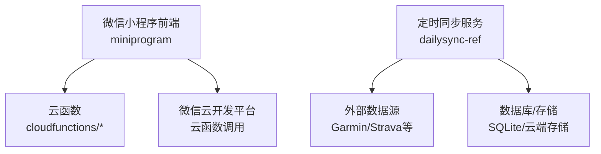
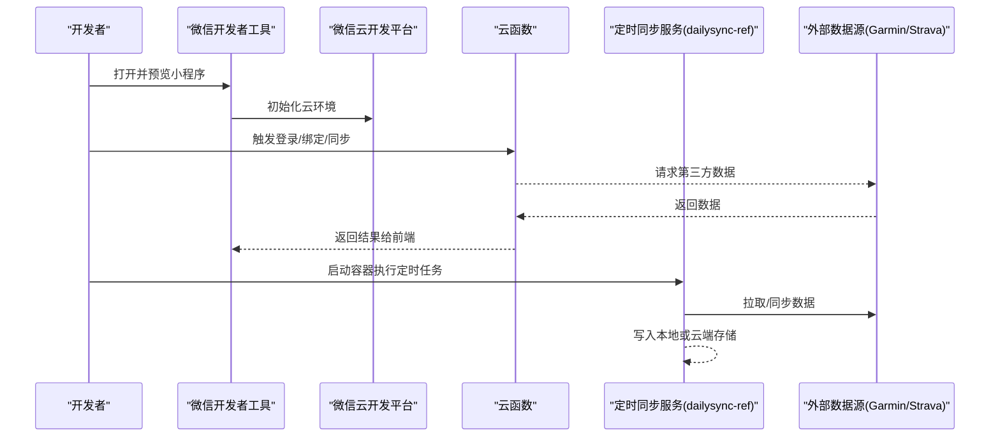
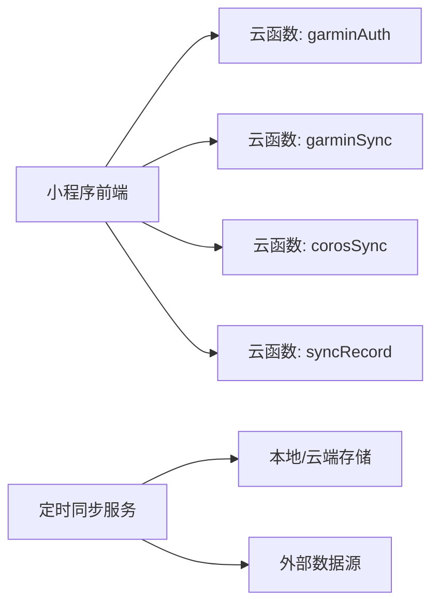

# 项目初始化与启动

<cite>
**本文引用的文件**   
- [README.md](file://README.md)
- [project.config.json](file://project.config.json)
- [miniprogram/app.js](file://miniprogram/app.js)
- [miniprogram/app.json](file://miniprogram/app.json)
- [miniprogram/pages/index/index.js](file://miniprogram/pages/index/index.js)
- [cloudfunctions/corosSync/package.json](file://cloudfunctions/corosSync/package.json)
- [cloudfunctions/garminAuth/package.json](file://cloudfunctions/garminAuth/package.json)
- [cloudfunctions/garminSync/package.json](file://cloudfunctions/garminSync/package.json)
- [cloudfunctions/syncRecord/package.json](file://cloudfunctions/syncRecord/package.json)
- [dailysync-ref/Dockerfile](file://dailysync-ref/Dockerfile)
- [dailysync-ref/docker-compose.yml](file://dailysync-ref/docker-compose.yml)
- [dailysync-ref/package.json](file://dailysync-ref/package.json)
- [dailysync-ref/tsconfig.json](file://dailysync-ref/tsconfig.json)
- [uploadCloudFunction.sh](file://uploadCloudFunction.sh)
</cite>

## 目录
1. [简介](#简介)
2. [项目结构](#项目结构)
3. [核心组件](#核心组件)
4. [架构总览](#架构总览)
5. [详细组件分析](#详细组件分析)
6. [依赖关系分析](#依赖关系分析)
7. [性能考虑](#性能考虑)
8. [故障排除指南](#故障排除指南)
9. [结论](#结论)
10. [附录](#附录)

## 简介
本指南面向首次接触该微信小程序项目的开发者，提供从代码克隆到本地运行、云函数部署、定时同步服务容器化运行的完整步骤。内容涵盖：
- Git 仓库获取与环境准备
- 小程序端依赖与配置
- 云函数安装与上传
- dailysync-ref 定时同步服务的 Docker 构建与运行
- 开发服务器与构建流程
- 项目验证方法
- 常见初始化问题的排查与解决

## 项目结构
该项目由三大部分组成：
- 微信小程序前端（miniprogram）
- 微信云开发云函数（cloudfunctions）
- 定时数据同步服务（dailysync-ref），支持 Docker 容器化运行

**图表来源** 
- [miniprogram/app.json](file://miniprogram/app.json)
- [cloudfunctions/garminAuth/package.json](file://cloudfunctions/garminAuth/package.json)
- [cloudfunctions/garminSync/package.json](file://cloudfunctions/garminSync/package.json)
- [dailysync-ref/Dockerfile](file://dailysync-ref/Dockerfile)
- [dailysync-ref/docker-compose.yml](file://dailysync-ref/docker-compose.yml)

**章节来源**
- [README.md](file://README.md)
- [project.config.json](file://project.config.json)

## 核心组件
- 小程序前端：负责用户交互、页面路由、调用云函数进行数据绑定与同步。
- 云函数：实现 Garmin/Coros 等第三方数据的认证与同步逻辑。
- 定时同步服务：基于 TypeScript/Node.js，提供数据迁移与同步任务，支持 Docker 部署。

关键入口与配置：
- 小程序应用入口与路由：[miniprogram/app.js](file://miniprogram/app.js)、[miniprogram/app.json](file://miniprogram/app.json)
- 首页示例逻辑：[miniprogram/pages/index/index.js](file://miniprogram/pages/index/index.js)
- 云函数包定义：各 cloudfunctions/*/package.json
- 定时服务依赖与脚本：[dailysync-ref/package.json](file://dailysync-ref/package.json)、[dailysync-ref/tsconfig.json](file://dailysync-ref/tsconfig.json)

**章节来源**
- [miniprogram/app.js](file://miniprogram/app.js)
- [miniprogram/app.json](file://miniprogram/app.json)
- [miniprogram/pages/index/index.js](file://miniprogram/pages/index/index.js)
- [cloudfunctions/corosSync/package.json](file://cloudfunctions/corosSync/package.json)
- [cloudfunctions/garminAuth/package.json](file://cloudfunctions/garminAuth/package.json)
- [cloudfunctions/garminSync/package.json](file://cloudfunctions/garminSync/package.json)
- [cloudfunctions/syncRecord/package.json](file://cloudfunctions/syncRecord/package.json)
- [dailysync-ref/package.json](file://dailysync-ref/package.json)
- [dailysync-ref/tsconfig.json](file://dailysync-ref/tsconfig.json)

## 架构总览
整体架构包含小程序前端、云函数与定时同步服务三部分，通过微信云开发与外部数据源交互。

**图表来源** 
- [miniprogram/app.json](file://miniprogram/app.json)
- [cloudfunctions/garminAuth/package.json](file://cloudfunctions/garminAuth/package.json)
- [cloudfunctions/garminSync/package.json](file://cloudfunctions/garminSync/package.json)
- [dailysync-ref/Dockerfile](file://dailysync-ref/Dockerfile)
- [dailysync-ref/docker-compose.yml](file://dailysync-ref/docker-compose.yml)

## 详细组件分析

### 微信小程序端初始化与启动
- 使用微信开发者工具导入项目根目录，确保 project.config.json 中的 AppID 与云开发环境已正确配置。
- 在开发者工具中启用“云开发”并选择对应环境。
- 运行预览以验证小程序页面与基础功能。

建议检查项：
- 小程序 app.json 的页面路由是否完整
- 云环境 ID 是否正确
- 网络权限与域名白名单（如需访问外部 API）

**章节来源**
- [project.config.json](file://project.config.json)
- [miniprogram/app.json](file://miniprogram/app.json)
- [miniprogram/app.js](file://miniprogram/app.js)

### 云函数安装与上传
- 进入每个云函数目录（如 garminAuth、garminSync、corosSync、syncRecord），根据 package.json 安装依赖。
- 在微信开发者工具中右键云函数目录，选择“上传并部署：云端安装依赖”。
- 若需自动化上传，可使用脚本 uploadCloudFunction.sh 进行批量上传。

注意事项：
- Node.js 版本需与云函数运行时一致
- 第三方依赖可能涉及网络下载，确保代理设置正确
- 上传前确认环境变量与密钥配置无误

**章节来源**
- [cloudfunctions/garminAuth/package.json](file://cloudfunctions/garminAuth/package.json)
- [cloudfunctions/garminSync/package.json](file://cloudfunctions/garminSync/package.json)
- [cloudfunctions/corosSync/package.json](file://cloudfunctions/corosSync/package.json)
- [cloudfunctions/syncRecord/package.json](file://cloudfunctions/syncRecord/package.json)
- [uploadCloudFunction.sh](file://uploadCloudFunction.sh)

### 定时同步服务（dailysync-ref）Docker 构建与运行
- 进入 dailysync-ref 目录，根据 Dockerfile 构建镜像。
- 使用 docker-compose.yml 编排服务，启动后执行定时任务。
- 如需自定义环境变量（如数据库连接、第三方 API Key），请在 docker-compose.yml 或 .env 文件中配置。

构建与运行步骤：
- 构建镜像：docker build -t dailysync-ref .
- 启动服务：docker compose up -d
- 查看日志：docker compose logs -f

**章节来源**
- [dailysync-ref/Dockerfile](file://dailysync-ref/Dockerfile)
- [dailysync-ref/docker-compose.yml](file://dailysync-ref/docker-compose.yml)
- [dailysync-ref/package.json](file://dailysync-ref/package.json)
- [dailysync-ref/tsconfig.json](file://dailysync-ref/tsconfig.json)

### 开发服务器与构建流程
- 小程序端：使用微信开发者工具的“编译/预览/真机调试”功能，无需额外本地服务器。
- 云函数：云端运行，本地仅用于开发与上传。
- 定时同步服务：通过 Docker 容器运行，支持热更新与日志收集。

**章节来源**
- [miniprogram/app.json](file://miniprogram/app.json)
- [dailysync-ref/Dockerfile](file://dailysync-ref/Dockerfile)
- [dailysync-ref/docker-compose.yml](file://dailysync-ref/docker-compose.yml)

## 依赖关系分析
- 小程序依赖微信云开发 SDK，调用云函数完成业务逻辑。
- 云函数依赖各自 package.json 中声明的 Node.js 模块。
- 定时同步服务依赖 TypeScript 编译与 Node.js 运行时，通过 Docker 隔离环境。

**图表来源** 
- [cloudfunctions/garminAuth/package.json](file://cloudfunctions/garminAuth/package.json)
- [cloudfunctions/garminSync/package.json](file://cloudfunctions/garminSync/package.json)
- [cloudfunctions/corosSync/package.json](file://cloudfunctions/corosSync/package.json)
- [cloudfunctions/syncRecord/package.json](file://cloudfunctions/syncRecord/package.json)
- [dailysync-ref/package.json](file://dailysync-ref/package.json)

**章节来源**
- [cloudfunctions/garminAuth/package.json](file://cloudfunctions/garminAuth/package.json)
- [cloudfunctions/garminSync/package.json](file://cloudfunctions/garminSync/package.json)
- [cloudfunctions/corosSync/package.json](file://cloudfunctions/corosSync/package.json)
- [cloudfunctions/syncRecord/package.json](file://cloudfunctions/syncRecord/package.json)
- [dailysync-ref/package.json](file://dailysync-ref/package.json)

## 性能考虑
- 云函数冷启动：合理拆分函数粒度，避免过大依赖。
- 网络请求：对第三方 API 做缓存与重试机制。
- 定时任务：控制并发与频率，避免资源争用。
- Docker 镜像：精简基础镜像，减少层数以提升构建速度。

## 故障排除指南
常见问题与解决方案：
- 小程序无法连接云环境：检查 project.config.json 的 AppID 与云环境 ID；确认开发者工具已登录并授权。
- 云函数上传失败：检查 Node.js 版本与依赖安装；确认网络可达；必要时设置代理。
- 定时服务启动失败：检查 Docker 镜像构建日志；确认环境变量与端口映射；查看容器日志定位错误。
- 第三方 API 调用失败：检查密钥与权限；确认网络策略与域名白名单。

**章节来源**
- [project.config.json](file://project.config.json)
- [uploadCloudFunction.sh](file://uploadCloudFunction.sh)
- [dailysync-ref/Dockerfile](file://dailysync-ref/Dockerfile)
- [dailysync-ref/docker-compose.yml](file://dailysync-ref/docker-compose.yml)

## 结论
通过本指南，您可以顺利完成小程序、云函数与定时同步服务的初始化与运行。建议在开发过程中逐步验证各组件，确保依赖与环境配置正确，遇到问题时优先检查配置文件与日志输出。

## 附录
- 推荐工具：微信开发者工具、Docker、Node.js、yarn/npm
- 参考命令：
  - 小程序：使用开发者工具导入并预览
  - 云函数：cd cloudfunctions/<func> && npm install && 上传部署
  - 定时服务：cd dailysync-ref && docker build -t dailysync-ref . && docker compose up -d