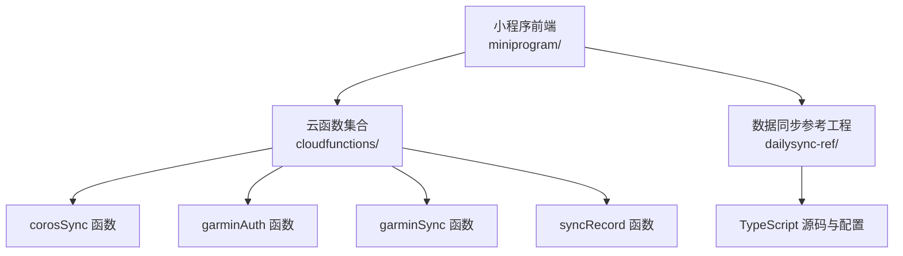
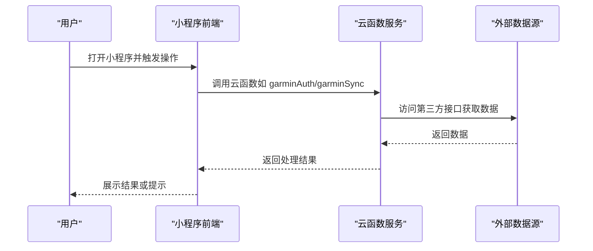

# 项目搭建与环境配置

<cite>
**本文引用的文件**   
- [README.md](file://README.md)
- [project.config.json](file://project.config.json)
- [project.private.config.json](file://project.private.config.json)
- [miniprogram/app.js](file://miniprogram/app.js)
- [miniprogram/app.json](file://miniprogram/app.json)
- [miniprogram/sitemap.json](file://miniprogram/sitemap.json)
- [cloudfunctions/corosSync/package.json](file://cloudfunctions/corosSync/package.json)
- [cloudfunctions/garminAuth/package.json](file://cloudfunctions/garminAuth/package.json)
- [cloudfunctions/garminSync/package.json](file://cloudfunctions/garminSync/package.json)
- [cloudfunctions/syncRecord/package.json](file://cloudfunctions/syncRecord/package.json)
- [dailysync-ref/tsconfig.json](file://dailysync-ref/tsconfig.json)
- [dailysync-ref/package.json](file://dailysync-ref/package.json)
- [uploadCloudFunction.sh](file://uploadCloudFunction.sh)
</cite>

## 目录
1. [简介](#简介)
2. [项目结构](#项目结构)
3. [核心组件](#核心组件)
4. [架构总览](#架构总览)
5. [详细组件分析](#详细组件分析)
6. [依赖分析](#依赖分析)
7. [性能考虑](#性能考虑)
8. [故障排除指南](#故障排除指南)
9. [结论](#结论)
10. [附录](#附录)

## 简介
本指南面向首次接触该微信小程序项目的开发者，提供从零开始的环境搭建与配置说明。内容涵盖：
- 微信开发者工具安装与基础设置
- 云开发环境初始化与函数上传
- TypeScript 子工程（dailysync-ref）的编译与模块解析配置
- 依赖管理策略（package.json、版本管理与更新）
- 项目初始化完整步骤（克隆、安装、环境变量、运行）
- 常见问题排查与解决方案

## 项目结构
本项目由三大部分组成：
- 小程序前端：位于 miniprogram 目录，包含页面、组件与全局配置
- 云函数：位于 cloudfunctions 目录，按功能划分多个独立函数目录
- 数据同步参考工程：位于 dailysync-ref 目录，为 TypeScript 工程，用于数据迁移与同步逻辑

**图表来源**
- [miniprogram/app.json](file://miniprogram/app.json)
- [cloudfunctions/corosSync/package.json](file://cloudfunctions/corosSync/package.json)
- [cloudfunctions/garminAuth/package.json](file://cloudfunctions/garminAuth/package.json)
- [cloudfunctions/garminSync/package.json](file://cloudfunctions/garminSync/package.json)
- [cloudfunctions/syncRecord/package.json](file://cloudfunctions/syncRecord/package.json)
- [dailysync-ref/tsconfig.json](file://dailysync-ref/tsconfig.json)

**章节来源**
- [README.md](file://README.md)
- [miniprogram/app.json](file://miniprogram/app.json)
- [project.config.json](file://project.config.json)

## 核心组件
- 小程序入口与全局配置
  - app.js：应用生命周期与初始化逻辑
  - app.json：应用级配置（页面路由、窗口样式、插件等）
  - sitemap.json：站点地图配置（影响索引与分享）
- 云函数包管理
  - 每个云函数目录下均含 package.json，定义函数依赖与入口
- 数据同步参考工程
  - tsconfig.json：TypeScript 编译选项与模块解析策略
  - package.json：工程依赖与脚本命令

**章节来源**
- [miniprogram/app.js](file://miniprogram/app.js)
- [miniprogram/app.json](file://miniprogram/app.json)
- [miniprogram/sitemap.json](file://miniprogram/sitemap.json)
- [cloudfunctions/corosSync/package.json](file://cloudfunctions/corosSync/package.json)
- [cloudfunctions/garminAuth/package.json](file://cloudfunctions/garminAuth/package.json)
- [cloudfunctions/garminSync/package.json](file://cloudfunctions/garminSync/package.json)
- [cloudfunctions/syncRecord/package.json](file://cloudfunctions/syncRecord/package.json)
- [dailysync-ref/tsconfig.json](file://dailysync-ref/tsconfig.json)
- [dailysync-ref/package.json](file://dailysync-ref/package.json)

## 架构总览
整体架构采用“小程序前端 + 云函数后端 + 外部数据源”的模式：
- 小程序通过云开发 SDK 调用云函数
- 云函数负责鉴权、数据同步与记录处理
- 数据同步参考工程提供离线或定时任务能力（可独立运行）

**图表来源**
- [miniprogram/app.json](file://miniprogram/app.json)
- [cloudfunctions/garminAuth/package.json](file://cloudfunctions/garminAuth/package.json)
- [cloudfunctions/garminSync/package.json](file://cloudfunctions/garminSync/package.json)

## 详细组件分析

### 小程序环境与项目配置
- 项目根目录的 project.config.json 与 project.private.config.json 控制开发者工具的构建与调试行为
- 小程序入口 app.json 定义页面路由、窗口外观、插件与分包等
- sitemap.json 用于控制页面是否被索引与分享

建议：
- 在 project.config.json 中启用 TypeScript 支持（若使用 TS 编写小程序代码）
- 合理拆分页面与组件，避免 app.json 过于臃肿
- 使用私有配置文件存放敏感信息（如 appId、token），不要提交到仓库

**章节来源**
- [project.config.json](file://project.config.json)
- [project.private.config.json](file://project.private.config.json)
- [miniprogram/app.json](file://miniprogram/app.json)
- [miniprogram/sitemap.json](file://miniprogram/sitemap.json)

### 云函数结构与部署
- 每个云函数目录包含 index.js（入口）与 package.json（依赖）
- 可通过 uploadCloudFunction.sh 脚本批量上传函数
- 建议在本地先安装依赖，再执行上传脚本

建议：
- 将函数依赖最小化，减少包体积
- 对敏感配置使用环境变量或云开发密钥管理
- 为每个函数添加错误日志与重试机制

**章节来源**
- [cloudfunctions/corosSync/package.json](file://cloudfunctions/corosSync/package.json)
- [cloudfunctions/garminAuth/package.json](file://cloudfunctions/garminAuth/package.json)
- [cloudfunctions/garminSync/package.json](file://cloudfunctions/garminSync/package.json)
- [cloudfunctions/syncRecord/package.json](file://cloudfunctions/syncRecord/package.json)
- [uploadCloudFunction.sh](file://uploadCloudFunction.sh)

### TypeScript 子工程（dailysync-ref）
- tsconfig.json 定义编译目标、模块系统、路径别名与严格检查
- package.json 定义依赖与脚本命令（如 build、start、migrate）

建议：
- 开启 strict 模式提升类型安全
- 使用 paths 映射简化导入路径
- 将构建产物输出到 dist 目录，便于 CI/CD 集成

**章节来源**
- [dailysync-ref/tsconfig.json](file://dailysync-ref/tsconfig.json)
- [dailysync-ref/package.json](file://dailysync-ref/package.json)

## 依赖分析
- 小程序端依赖由微信开发者工具自动管理，无需手动 npm install
- 云函数依赖需在各自目录执行 npm install 或 yarn install
- dailysync-ref 工程需安装 Node.js 与包管理器（npm/yarn/pnpm）

依赖更新策略：
- 定期运行依赖扫描（如 npm audit）修复安全漏洞
- 使用锁定文件（yarn.lock/package-lock.json）确保一致性
- 大版本升级前进行兼容性测试

**章节来源**
- [cloudfunctions/corosSync/package.json](file://cloudfunctions/corosSync/package.json)
- [cloudfunctions/garminAuth/package.json](file://cloudfunctions/garminAuth/package.json)
- [cloudfunctions/garminSync/package.json](file://cloudfunctions/garminSync/package.json)
- [cloudfunctions/syncRecord/package.json](file://cloudfunctions/syncRecord/package.json)
- [dailysync-ref/package.json](file://dailysync-ref/package.json)

## 性能考虑
- 小程序端：按需加载页面与组件，避免首屏过大
- 云函数：优化数据库查询与网络请求，减少冷启动时间
- 数据同步：分页拉取与增量同步，降低带宽与延迟

[本节为通用指导，不直接分析具体文件]

## 故障排除指南
常见问题与解决思路：
- 云函数上传失败：检查网络、权限与依赖安装状态
- 小程序无法调用云函数：确认云开发环境已初始化且 appId 正确
- TypeScript 编译错误：检查 tsconfig.json 与依赖版本匹配
- 环境变量未生效：确认在云函数与小程序中分别配置

排查步骤：
- 查看开发者工具控制台与云函数日志
- 使用最小复现用例定位问题
- 逐步禁用功能模块隔离错误范围

**章节来源**
- [uploadCloudFunction.sh](file://uploadCloudFunction.sh)
- [miniprogram/app.json](file://miniprogram/app.json)
- [dailysync-ref/tsconfig.json](file://dailysync-ref/tsconfig.json)

## 结论
通过本指南，您可以完成小程序开发环境的搭建、云函数部署与 TypeScript 子工程的配置。建议结合团队规范制定依赖管理与发布流程，确保开发与生产环境的一致性。

[本节为总结性内容，不直接分析具体文件]

## 附录

### 环境准备清单
- 安装微信开发者工具（稳定版）
- 安装 Node.js（推荐 LTS 版本）
- 选择包管理器（npm/yarn/pnpm）
- 注册微信小程序账号并创建项目

### 项目初始化步骤
1. 克隆代码仓库到本地
2. 使用微信开发者工具打开 miniprogram 目录
3. 进入 cloudfunctions 各目录安装依赖
4. 初始化云开发环境并绑定小程序
5. 执行 uploadCloudFunction.sh 上传云函数
6. 在 dailysync-ref 目录安装依赖并运行构建脚本

### 环境变量配置
- 小程序端：在 app.json 或配置文件中设置必要参数
- 云函数：在云开发控制台或本地 .env 文件中配置
- 数据同步工程：根据 README 说明配置数据库与 API 密钥

### 常见命令参考
- 安装依赖：npm install / yarn install / pnpm install
- 构建 TypeScript：cd dailysync-ref && npm run build
- 上传云函数：./uploadCloudFunction.sh

[本节为补充信息，不直接分析具体文件]