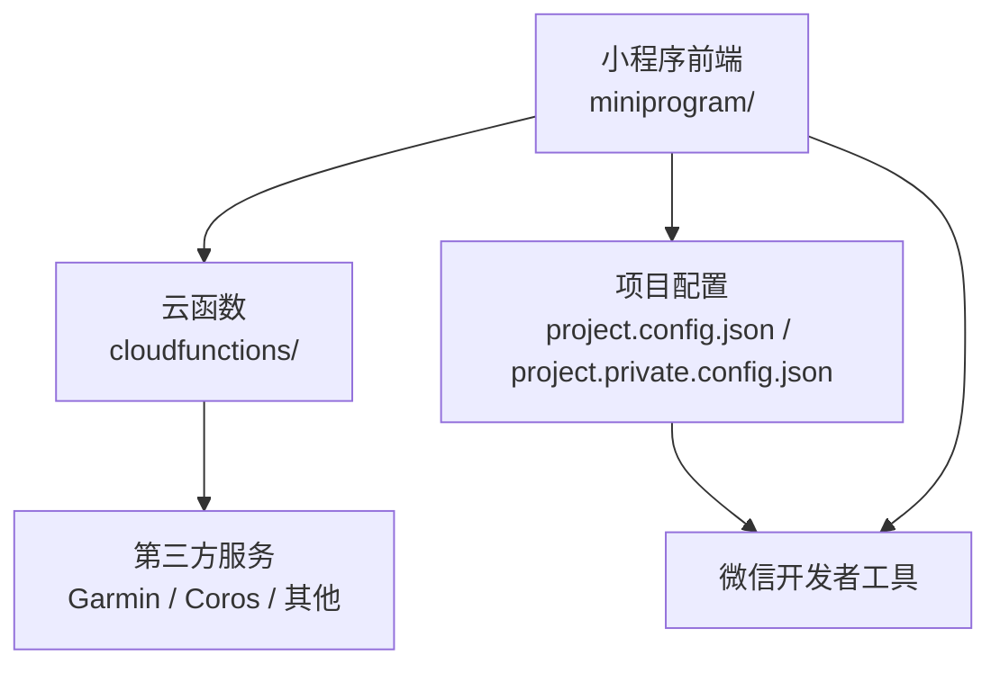
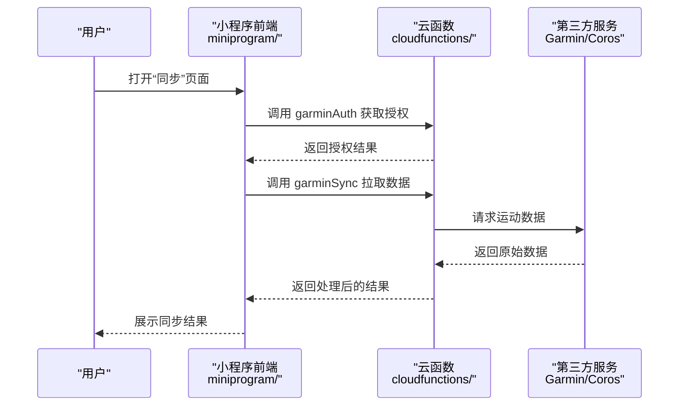
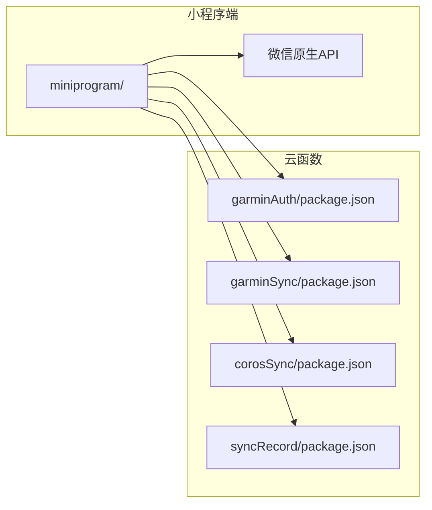

# 快速开始

<cite>
**本文引用的文件**   
- [README.md](file://README.md)
- [project.config.json](file://project.config.json)
- [project.private.config.json](file://project.private.config.json)
- [miniprogram/app.js](file://miniprogram/app.js)
- [miniprogram/app.json](file://miniprogram/app.json)
- [miniprogram/pages/index/index.js](file://miniprogram/pages/index/index.js)
- [miniprogram/pages/sync/sync.js](file://miniprogram/pages/sync/sync.js)
- [cloudfunctions/garminAuth/index.js](file://cloudfunctions/garminAuth/index.js)
- [cloudfunctions/garminAuth/package.json](file://cloudfunctions/garminAuth/package.json)
- [cloudfunctions/garminSync/index.js](file://cloudfunctions/garminSync/index.js)
- [cloudfunctions/garminSync/package.json](file://cloudfunctions/garminSync/package.json)
- [cloudfunctions/corosSync/index.js](file://cloudfunctions/corosSync/index.js)
- [cloudfunctions/corosSync/package.json](file://cloudfunctions/corosSync/package.json)
- [cloudfunctions/syncRecord/index.js](file://cloudfunctions/syncRecord/index.js)
- [cloudfunctions/syncRecord/package.json](file://cloudfunctions/syncRecord/package.json)
- [uploadCloudFunction.sh](file://uploadCloudFunction.sh)
</cite>

## 目录
1. [简介](#简介)
2. [项目结构](#项目结构)
3. [核心组件](#核心组件)
4. [架构总览](#架构总览)
5. [详细组件分析](#详细组件分析)
6. [依赖分析](#依赖分析)
7. [性能注意事项](#性能注意事项)
8. [故障排除指南](#故障排除指南)
9. [结论](#结论)
10. [附录](#附录)

## 简介
本指南面向首次接触该微信小程序项目的开发者，目标是帮助你在最短时间内完成环境准备、依赖安装、项目配置与云函数部署，并成功在微信开发者工具中运行。内容涵盖：
- 环境与前置条件
- 本地开发步骤（小程序端）
- 云函数初始化与部署
- 常见配置项说明
- 常见问题排查

## 项目结构
该项目由三大部分组成：
- 小程序前端代码位于 miniprogram 目录，包含页面、组件与全局配置。
- 云函数位于 cloudfunctions 目录，提供数据同步与认证等后端能力。
- 根目录包含项目级配置文件与脚本，如 project.config.json、project.private.config.json 与上传脚本 uploadCloudFunction.sh。

图表来源
- [project.config.json](file://project.config.json)
- [miniprogram/app.json](file://miniprogram/app.json)

章节来源
- [project.config.json](file://project.config.json)
- [miniprogram/app.json](file://miniprogram/app.json)

## 核心组件
- 小程序入口与路由
  - app.js：应用初始化逻辑，通常用于设置全局状态或初始化插件。
  - app.json：小程序全局配置，包括页面路由、窗口样式、分包与云函数相关配置。
- 关键页面
  - index：首页入口，展示主要功能入口。
  - sync：数据同步页面，触发云函数进行数据拉取或同步。
- 云函数
  - garminAuth：负责 Garmin 账号授权流程。
  - garminSync：负责 Garmin 数据同步。
  - corosSync：负责 Coros 数据同步。
  - syncRecord：通用记录同步处理。

章节来源
- [miniprogram/app.js](file://miniprogram/app.js)
- [miniprogram/app.json](file://miniprogram/app.json)
- [miniprogram/pages/index/index.js](file://miniprogram/pages/index/index.js)
- [miniprogram/pages/sync/sync.js](file://miniprogram/pages/sync/sync.js)
- [cloudfunctions/garminAuth/index.js](file://cloudfunctions/garminAuth/index.js)
- [cloudfunctions/garminSync/index.js](file://cloudfunctions/garminSync/index.js)
- [cloudfunctions/corosSync/index.js](file://cloudfunctions/corosSync/index.js)
- [cloudfunctions/syncRecord/index.js](file://cloudfunctions/syncRecord/index.js)

## 架构总览
小程序通过 wx.cloud 调用云函数，云函数再访问第三方平台（如 Garmin、Coros）获取运动数据，并进行必要的转换与存储。整体交互如下：

图表来源
- [miniprogram/pages/sync/sync.js](file://miniprogram/pages/sync/sync.js)
- [cloudfunctions/garminAuth/index.js](file://cloudfunctions/garminAuth/index.js)
- [cloudfunctions/garminSync/index.js](file://cloudfunctions/garminSync/index.js)

## 详细组件分析

### 小程序端：app.js 与 app.json
- app.js
  - 作用：应用启动时执行初始化逻辑，例如初始化云环境、注册全局变量或加载必要配置。
  - 建议：确保在初始化前已正确配置云环境 ID 与版本。
- app.json
  - 作用：定义小程序的页面路由、窗口外观、插件与云函数相关配置。
  - 关注点：pages 字段需包含所有页面路径；若使用云函数，需在配置中启用云能力。

章节来源
- [miniprogram/app.js](file://miniprogram/app.js)
- [miniprogram/app.json](file://miniprogram/app.json)

### 小程序端：index 与 sync 页面
- index 页面
  - 作用：作为首页入口，引导用户进入各功能模块。
  - 行为：通常包含跳转至“同步”页面的按钮或导航。
- sync 页面
  - 作用：触发数据同步流程，调用对应云函数进行数据拉取与处理。
  - 行为：点击后发起云函数调用，并在成功后更新界面显示。

章节来源
- [miniprogram/pages/index/index.js](file://miniprogram/pages/index/index.js)
- [miniprogram/pages/sync/sync.js](file://miniprogram/pages/sync/sync.js)

### 云函数：garminAuth 与 garminSync
- garminAuth
  - 作用：实现 Garmin 账号授权流程，生成或校验授权令牌。
  - 输入：通常为授权参数或回调信息。
  - 输出：授权结果（成功/失败）及必要令牌。
- garminSync
  - 作用：基于授权结果拉取 Garmin 运动数据，进行格式转换与存储。
  - 输入：授权令牌、时间范围等参数。
  - 输出：同步结果与数据处理摘要。

章节来源
- [cloudfunctions/garminAuth/index.js](file://cloudfunctions/garminAuth/index.js)
- [cloudfunctions/garminAuth/package.json](file://cloudfunctions/garminAuth/package.json)
- [cloudfunctions/garminSync/index.js](file://cloudfunctions/garminSync/index.js)
- [cloudfunctions/garminSync/package.json](file://cloudfunctions/garminSync/package.json)

### 云函数：corosSync 与 syncRecord
- corosSync
  - 作用：实现 Coros 数据同步，类似 Garmin 的流程但适配不同平台接口。
- syncRecord
  - 作用：通用记录同步处理，可能用于统一数据入库或日志记录。

章节来源
- [cloudfunctions/corosSync/index.js](file://cloudfunctions/corosSync/index.js)
- [cloudfunctions/corosSync/package.json](file://cloudfunctions/corosSync/package.json)
- [cloudfunctions/syncRecord/index.js](file://cloudfunctions/syncRecord/index.js)
- [cloudfunctions/syncRecord/package.json](file://cloudfunctions/syncRecord/package.json)

### 项目配置：project.config.json 与 project.private.config.json
- project.config.json
  - 作用：项目级配置，包含小程序 AppID、编译选项、云环境 ID、云函数目录等。
  - 注意：AppID 必须为真实可用的测试或生产 AppID；云环境 ID 需与云端一致。
- project.private.config.json
  - 作用：私有配置，通常用于本地调试覆盖，不应提交到版本库。
  - 注意：敏感信息（如密钥）可在此文件中管理，避免泄露。

章节来源
- [project.config.json](file://project.config.json)
- [project.private.config.json](file://project.private.config.json)

### 云函数上传脚本：uploadCloudFunction.sh
- 作用：批量上传云函数到云端，简化部署流程。
- 使用方式：在终端执行脚本，根据提示选择要上传的云函数目录。
- 注意：确保脚本具有执行权限，且已登录微信开发者工具或 CLI。

章节来源
- [uploadCloudFunction.sh](file://uploadCloudFunction.sh)

## 依赖分析
- 小程序端依赖
  - 微信原生 API：wx.cloud、页面生命周期、网络请求等。
  - 第三方 SDK：各云函数 package.json 中声明的依赖（如 Garmin/Coros 客户端）。
- 云函数依赖
  - Node.js 运行时与 npm 包管理。
  - 各云函数的 package.json 定义了具体依赖版本。

图表来源
- [cloudfunctions/garminAuth/package.json](file://cloudfunctions/garminAuth/package.json)
- [cloudfunctions/garminSync/package.json](file://cloudfunctions/garminSync/package.json)
- [cloudfunctions/corosSync/package.json](file://cloudfunctions/corosSync/package.json)
- [cloudfunctions/syncRecord/package.json](file://cloudfunctions/syncRecord/package.json)

章节来源
- [cloudfunctions/garminAuth/package.json](file://cloudfunctions/garminAuth/package.json)
- [cloudfunctions/garminSync/package.json](file://cloudfunctions/garminSync/package.json)
- [cloudfunctions/corosSync/package.json](file://cloudfunctions/corosSync/package.json)
- [cloudfunctions/syncRecord/package.json](file://cloudfunctions/syncRecord/package.json)

## 性能注意事项
- 云函数冷启动优化：减少不必要的依赖与初始化逻辑，按需加载模块。
- 网络请求合并：在小程序端合并多次请求，降低延迟。
- 数据分页：对大量数据采用分页拉取，避免单次响应过大。
- 缓存策略：对不频繁变化的数据在小程序端做短期缓存，减少重复请求。

## 故障排除指南
- 无法连接云环境
  - 检查 project.config.json 中的云环境 ID 是否正确。
  - 确认已在微信开发者工具中登录并选择正确的云环境。
- 云函数调用失败
  - 查看云函数日志，定位错误原因（如依赖缺失、权限不足）。
  - 重新上传云函数并确保依赖安装完整。
- 授权失败（Garmin/Coros）
  - 检查第三方平台的 AppKey/Secret 是否配置正确。
  - 确认回调地址与域名白名单设置无误。
- 页面空白或路由错误
  - 核对 app.json 中的 pages 列表是否包含目标页面。
  - 检查页面文件命名与路径是否匹配。

章节来源
- [project.config.json](file://project.config.json)
- [miniprogram/app.json](file://miniprogram/app.json)
- [cloudfunctions/garminAuth/index.js](file://cloudfunctions/garminAuth/index.js)
- [cloudfunctions/garminSync/index.js](file://cloudfunctions/garminSync/index.js)
- [cloudfunctions/corosSync/index.js](file://cloudfunctions/corosSync/index.js)
- [cloudfunctions/syncRecord/index.js](file://cloudfunctions/syncRecord/index.js)

## 结论
通过以上步骤，你可以在本地快速搭建并运行该微信小程序项目。重点在于正确配置小程序与云环境、安装云函数依赖并完成部署。遇到问题时，优先检查配置文件与云函数日志，逐步定位并解决。

## 附录

### 环境要求
- 微信开发者工具（最新版）
- Node.js（推荐 LTS 版本）
- npm 或 yarn（用于安装云函数依赖）
- 有效的微信小程序 AppID（测试或生产）

### 本地开发步骤
1. 克隆项目到本地。
2. 使用微信开发者工具打开项目根目录。
3. 在 project.config.json 中填写正确的 AppID 与云环境 ID。
4. 安装云函数依赖：
   - 进入每个云函数目录（如 cloudfunctions/garminAuth），执行 npm install。
5. 在微信开发者工具中点击“构建云函数”或“上传云函数”。
6. 启动小程序预览或真机调试。

### 云函数部署
- 手动部署：
  - 在每个云函数目录下执行 npm install。
  - 在微信开发者工具中右键云函数目录，选择“上传并部署：云端安装依赖”。
- 脚本部署：
  - 执行 uploadCloudFunction.sh，按提示选择要上传的云函数。

### 常见配置项说明
- AppID：小程序唯一标识，必填。
- 云环境 ID：与云端创建的环境一致。
- 云函数目录：默认 cloudfunctions。
- 页面路由：在 app.json 的 pages 字段中声明。

### 常见问题解决方案
- 依赖安装失败：检查网络连接与 npm 源，尝试更换镜像源。
- 云函数超时：优化查询逻辑，增加分页或缓存。
- 授权回调失败：核对第三方平台回调地址与域名白名单。

章节来源
- [project.config.json](file://project.config.json)
- [uploadCloudFunction.sh](file://uploadCloudFunction.sh)
- [cloudfunctions/garminAuth/package.json](file://cloudfunctions/garminAuth/package.json)
- [cloudfunctions/garminSync/package.json](file://cloudfunctions/garminSync/package.json)
- [cloudfunctions/corosSync/package.json](file://cloudfunctions/corosSync/package.json)
- [cloudfunctions/syncRecord/package.json](file://cloudfunctions/syncRecord/package.json)