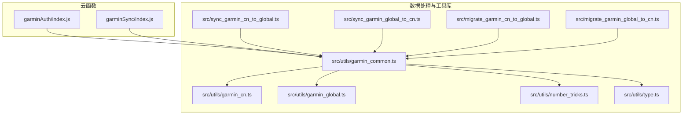
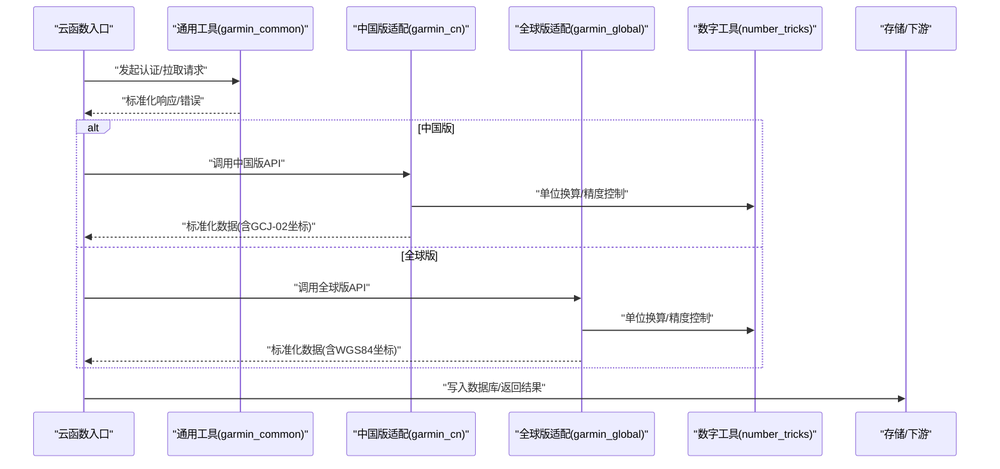
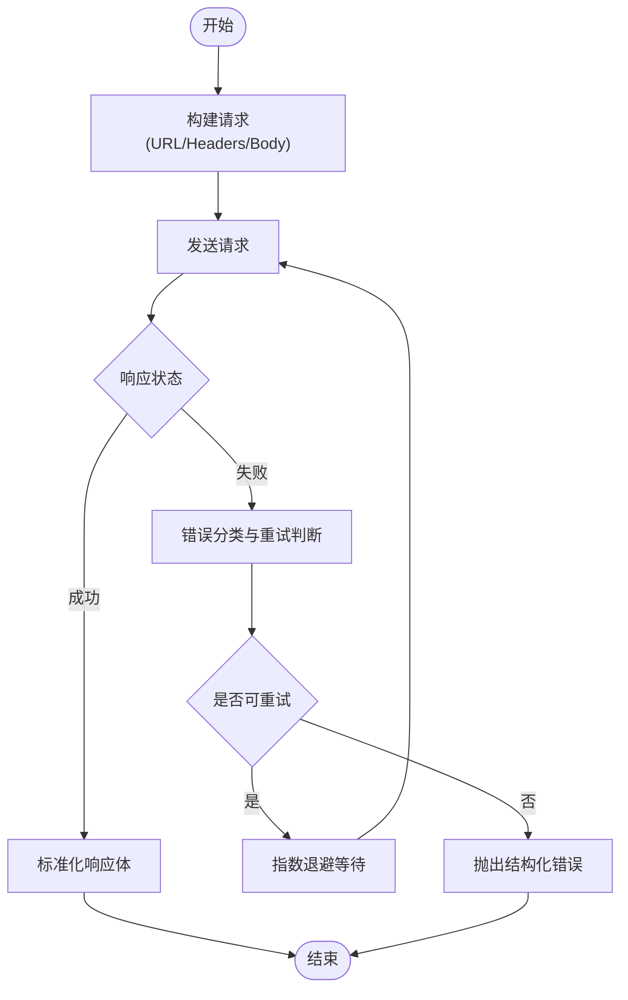
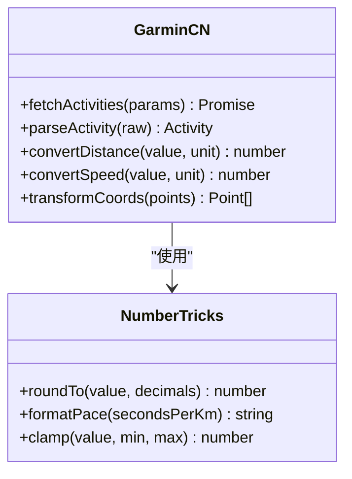
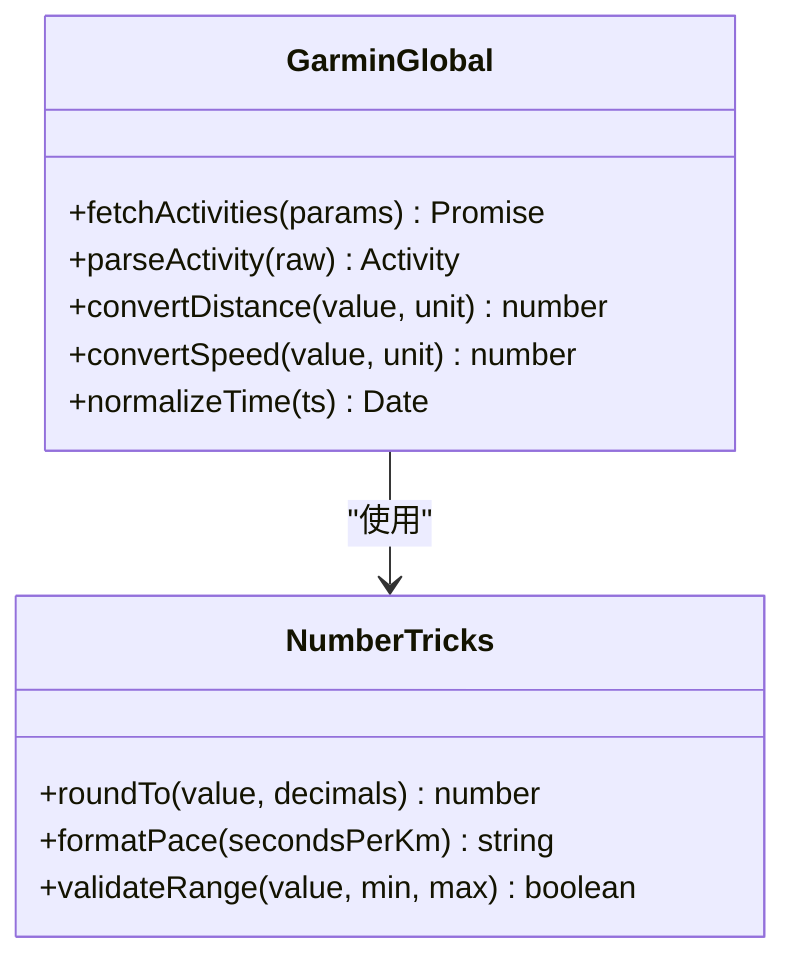
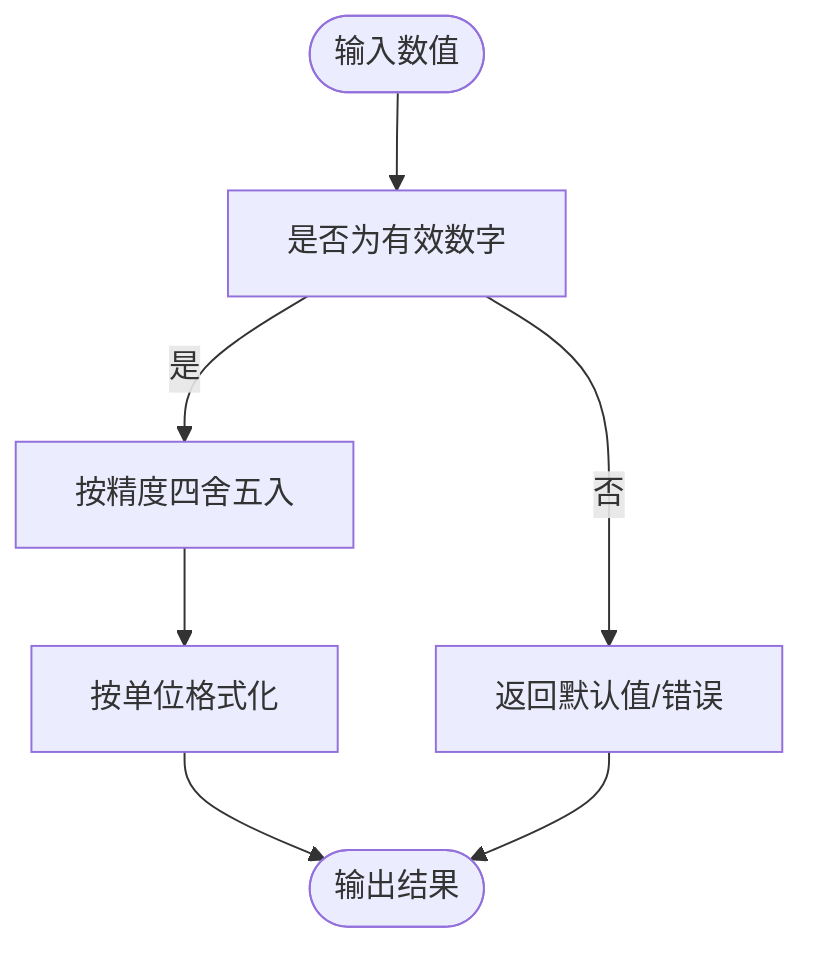
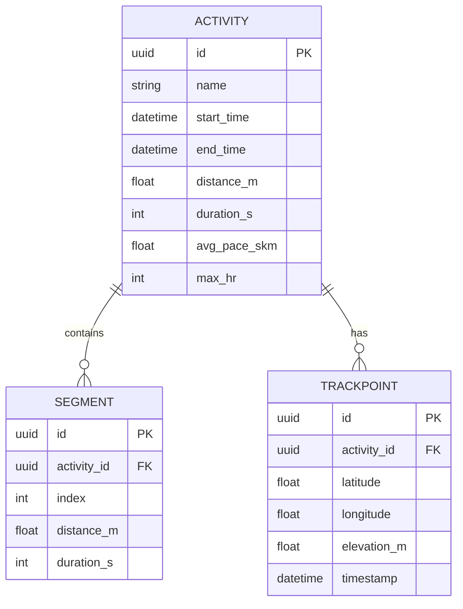
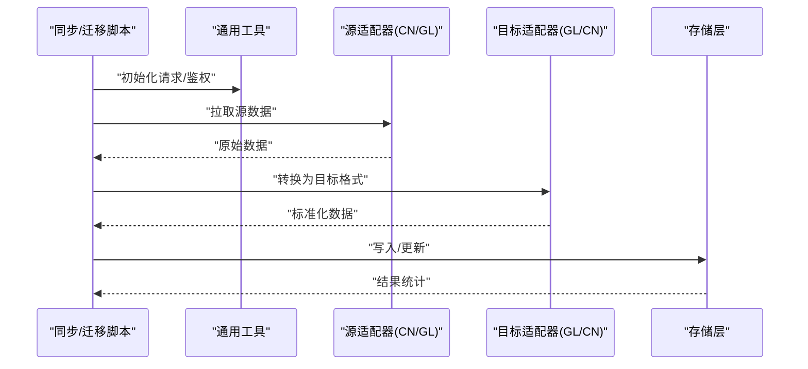
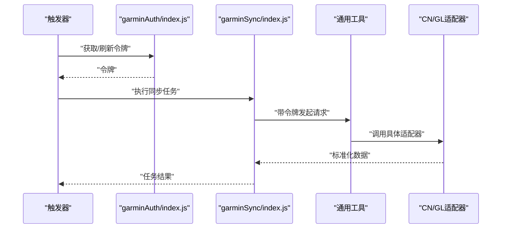
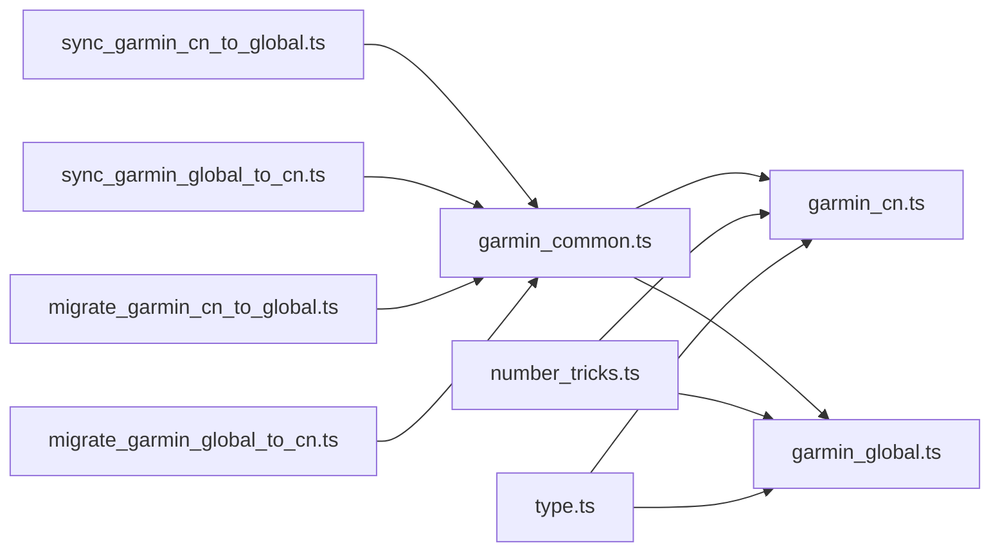

# Garmin工具类库

<cite>
**本文引用的文件**   
- [README.md](file://README.md)
- [garmin_common.ts](file://dailysync-ref/src/utils/garmin_common.ts)
- [garmin_cn.ts](file://dailysync-ref/src/utils/garmin_cn.ts)
- [garmin_global.ts](file://dailysync-ref/src/utils/garmin_global.ts)
- [number_tricks.ts](file://dailysync-ref/src/utils/number_tricks.ts)
- [type.ts](file://dailysync-ref/src/utils/type.ts)
- [sync_garmin_cn_to_global.ts](file://dailysync-ref/src/sync_garmin_cn_to_global.ts)
- [sync_garmin_global_to_cn.ts](file://dailysync-ref/src/sync_garmin_global_to_cn.ts)
- [migrate_garmin_cn_to_global.ts](file://dailysync-ref/src/migrate_garmin_cn_to_global.ts)
- [migrate_garmin_global_to_cn.ts](file://dailysync-ref/src/migrate_garmin_global_to_cn.ts)
- [index.js](file://cloudfunctions/garminAuth/index.js)
- [config.json](file://cloudfunctions/garminAuth/config.json)
- [index.js](file://cloudfunctions/garminSync/index.js)
- [config.json](file://cloudfunctions/garminSync/config.json)
</cite>

## 目录
1. [简介](#简介)
2. [项目结构](#项目结构)
3. [核心组件](#核心组件)
4. [架构总览](#架构总览)
5. [详细组件分析](#详细组件分析)
6. [依赖关系分析](#依赖关系分析)
7. [性能考虑](#性能考虑)
8. [故障排查指南](#故障排查指南)
9. [结论](#结论)
10. [附录](#附录)

## 简介
本仓库围绕Garmin数据同步与迁移，提供一套通用工具类库，覆盖数据格式转换、单位换算、坐标系统转换、时间处理、数字处理（精度控制、格式化输出、数值验证）等能力。同时针对中国版与全球版Garmin的数据差异，封装了API调用、响应解析与错误处理流程，并提供双向同步与数据迁移脚本，便于在多云函数环境中稳定运行。

## 项目结构
本项目采用“云函数 + 数据处理脚本”的混合结构：
- cloudfunctions：云端函数入口，负责认证与同步任务调度。
- dailysync-ref：核心逻辑与工具库，包含Garmin中国版/全球版的适配层、通用工具、类型定义以及同步/迁移脚本。
- miniprogram：小程序前端页面（与本工具库关联度较低）。

图表来源 
- [index.js](file://cloudfunctions/garminAuth/index.js)
- [index.js](file://cloudfunctions/garminSync/index.js)
- [garmin_common.ts](file://dailysync-ref/src/utils/garmin_common.ts)
- [garmin_cn.ts](file://dailysync-ref/src/utils/garmin_cn.ts)
- [garmin_global.ts](file://dailysync-ref/src/utils/garmin_global.ts)
- [number_tricks.ts](file://dailysync-ref/src/utils/number_tricks.ts)
- [type.ts](file://dailysync-ref/src/utils/type.ts)
- [sync_garmin_cn_to_global.ts](file://dailysync-ref/src/sync_garmin_cn_to_global.ts)
- [sync_garmin_global_to_cn.ts](file://dailysync-ref/src/sync_garmin_global_to_cn.ts)
- [migrate_garmin_cn_to_global.ts](file://dailysync-ref/src/migrate_garmin_cn_to_global.ts)
- [migrate_garmin_global_to_cn.ts](file://dailysync-ref/src/migrate_garmin_global_to_cn.ts)

章节来源
- [README.md](file://README.md)

## 核心组件
- 通用工具层（garmin_common.ts）
  - 职责：统一封装HTTP请求、重试与超时、鉴权头组装、响应体标准化、错误分类与提示、日志记录。
  - 关键点：对失败场景进行可观测性增强（错误码、重试次数、耗时），为上层同步/迁移脚本提供一致接口。
- 中国版适配（garmin_cn.ts）
  - 职责：对接Garmin中国版API，处理域名、路径、参数命名差异，解析中国版特有字段与单位。
  - 关键点：时区、日期格式、距离/速度单位、轨迹点坐标体系（GCJ-02）等差异处理。
- 全球版适配（garmin_global.ts）
  - 职责：对接Garmin全球版API，处理不同区域站点、语言、单位制式，解析标准字段。
  - 关键点：UTC时间、米制单位、WGS84坐标、分页与游标策略。
- 数字处理（number_tricks.ts）
  - 职责：精度控制、四舍五入、百分比格式化、数值范围校验、空值回退。
  - 关键点：避免浮点误差累积，统一输出格式，保障下游展示一致性。
- 类型定义（type.ts）
  - 职责：统一定义活动、分段、轨迹、用户信息、配置对象等类型，保证TS编译期安全。
  - 关键点：可选字段、枚举值、联合类型的清晰边界。

章节来源
- [garmin_common.ts](file://dailysync-ref/src/utils/garmin_common.ts)
- [garmin_cn.ts](file://dailysync-ref/src/utils/garmin_cn.ts)
- [garmin_global.ts](file://dailysync-ref/src/utils/garmin_global.ts)
- [number_tricks.ts](file://dailysync-ref/src/utils/number_tricks.ts)
- [type.ts](file://dailysync-ref/src/utils/type.ts)

## 架构总览
整体数据流从云函数触发，进入工具层进行鉴权与请求，再按地区选择对应适配器解析数据，最终输出标准化数据结构供持久化或展示使用。

图表来源 
- [index.js](file://cloudfunctions/garminAuth/index.js)
- [index.js](file://cloudfunctions/garminSync/index.js)
- [garmin_common.ts](file://dailysync-ref/src/utils/garmin_common.ts)
- [garmin_cn.ts](file://dailysync-ref/src/utils/garmin_cn.ts)
- [garmin_global.ts](file://dailysync-ref/src/utils/garmin_global.ts)
- [number_tricks.ts](file://dailysync-ref/src/utils/number_tricks.ts)

## 详细组件分析

### 通用工具层（garmin_common.ts）
- HTTP封装
  - 支持超时、重试、指数退避、幂等重试策略。
  - 统一错误分类：网络错误、鉴权失败、业务异常、超时。
- 鉴权与签名
  - 根据环境注入Cookie/Token，构造必要Header。
- 响应标准化
  - 将不同版本API返回结构映射到统一模型，缺失字段提供默认值。
- 日志与监控
  - 记录关键步骤耗时、错误堆栈摘要、重试计数。

图表来源 
- [garmin_common.ts](file://dailysync-ref/src/utils/garmin_common.ts)

章节来源
- [garmin_common.ts](file://dailysync-ref/src/utils/garmin_common.ts)

### 中国版适配（garmin_cn.ts）
- API差异
  - 域名、路径前缀、参数名与分页方式可能不同于全球版。
- 数据差异
  - 时间戳与时区、距离/配速单位、轨迹坐标体系（GCJ-02）。
- 解析策略
  - 字段映射表、单位换算、坐标转换、缺失字段回退。

图表来源 
- [garmin_cn.ts](file://dailysync-ref/src/utils/garmin_cn.ts)
- [number_tricks.ts](file://dailysync-ref/src/utils/number_tricks.ts)

章节来源
- [garmin_cn.ts](file://dailysync-ref/src/utils/garmin_cn.ts)

### 全球版适配（garmin_global.ts）
- API差异
  - 多区域站点、语言偏好、单位制式（公制/英制）。
- 数据差异
  - UTC时间、WGS84坐标、标准字段命名。
- 解析策略
  - 严格类型校验、单位换算、坐标体系保持WGS84。

图表来源 
- [garmin_global.ts](file://dailysync-ref/src/utils/garmin_global.ts)
- [number_tricks.ts](file://dailysync-ref/src/utils/number_tricks.ts)

章节来源
- [garmin_global.ts](file://dailysync-ref/src/utils/garmin_global.ts)

### 数字处理工具（number_tricks.ts）
- 精度控制
  - 统一小数位数，避免浮点误差导致的显示不一致。
- 格式化输出
  - 配速、距离、海拔、心率等常用单位的字符串化。
- 数值验证
  - 范围检查、空值回退、NaN/Infinity防护。

图表来源 
- [number_tricks.ts](file://dailysync-ref/src/utils/number_tricks.ts)

章节来源
- [number_tricks.ts](file://dailysync-ref/src/utils/number_tricks.ts)

### 类型定义（type.ts）
- 活动模型
  - 字段：ID、名称、开始时间、结束时间、距离、时长、平均配速、最大心率、轨迹点集合等。
- 分段与轨迹
  - 分段：每公里/每英里分段数据；轨迹：经纬度、海拔、时间戳。
- 配置与上下文
  - 用户ID、区域标识、单位制式、时区、分页参数。

图表来源 
- [type.ts](file://dailysync-ref/src/utils/type.ts)

章节来源
- [type.ts](file://dailysync-ref/src/utils/type.ts)

### 同步与迁移脚本
- 同步脚本
  - sync_garmin_cn_to_global.ts：将中国版数据转换为全球版标准并落库。
  - sync_garmin_global_to_cn.ts：将全球版数据转换为中国版格式并落库。
- 迁移脚本
  - migrate_garmin_cn_to_global.ts：批量历史数据迁移。
  - migrate_garmin_global_to_cn.ts：反向批量迁移。

图表来源 
- [sync_garmin_cn_to_global.ts](file://dailysync-ref/src/sync_garmin_cn_to_global.ts)
- [sync_garmin_global_to_cn.ts](file://dailysync-ref/src/sync_garmin_global_to_cn.ts)
- [migrate_garmin_cn_to_global.ts](file://dailysync-ref/src/migrate_garmin_cn_to_global.ts)
- [migrate_garmin_global_to_cn.ts](file://dailysync-ref/src/migrate_garmin_global_to_cn.ts)
- [garmin_common.ts](file://dailysync-ref/src/utils/garmin_common.ts)

章节来源
- [sync_garmin_cn_to_global.ts](file://dailysync-ref/src/sync_garmin_cn_to_global.ts)
- [sync_garmin_global_to_cn.ts](file://dailysync-ref/src/sync_garmin_global_to_cn.ts)
- [migrate_garmin_cn_to_global.ts](file://dailysync-ref/src/migrate_garmin_cn_to_global.ts)
- [migrate_garmin_global_to_cn.ts](file://dailysync-ref/src/migrate_garmin_global_to_cn.ts)

### 云函数集成
- garminAuth：负责认证流程，获取访问令牌并缓存。
- garminSync：定时或事件触发同步任务，调用工具层完成数据拉取与转换。

图表来源 
- [index.js](file://cloudfunctions/garminAuth/index.js)
- [config.json](file://cloudfunctions/garminAuth/config.json)
- [index.js](file://cloudfunctions/garminSync/index.js)
- [config.json](file://cloudfunctions/garminSync/config.json)

章节来源
- [index.js](file://cloudfunctions/garminAuth/index.js)
- [config.json](file://cloudfunctions/garminAuth/config.json)
- [index.js](file://cloudfunctions/garminSync/index.js)
- [config.json](file://cloudfunctions/garminSync/config.json)

## 依赖关系分析
- 模块内聚与耦合
  - 通用工具层被所有适配器与脚本复用，降低重复代码。
  - 数字工具独立且无外部依赖，便于测试与替换。
- 外部依赖
  - 云函数运行时、网络请求库、数据库驱动（由各自环境提供）。
- 潜在循环依赖
  - 适配器仅依赖通用工具与数字工具，不互相引用，避免循环。

图表来源 
- [garmin_common.ts](file://dailysync-ref/src/utils/garmin_common.ts)
- [garmin_cn.ts](file://dailysync-ref/src/utils/garmin_cn.ts)
- [garmin_global.ts](file://dailysync-ref/src/utils/garmin_global.ts)
- [number_tricks.ts](file://dailysync-ref/src/utils/number_tricks.ts)
- [type.ts](file://dailysync-ref/src/utils/type.ts)
- [sync_garmin_cn_to_global.ts](file://dailysync-ref/src/sync_garmin_cn_to_global.ts)
- [sync_garmin_global_to_cn.ts](file://dailysync-ref/src/sync_garmin_global_to_cn.ts)
- [migrate_garmin_cn_to_global.ts](file://dailysync-ref/src/migrate_garmin_cn_to_global.ts)
- [migrate_garmin_global_to_cn.ts](file://dailysync-ref/src/migrate_garmin_global_to_cn.ts)

章节来源
- [garmin_common.ts](file://dailysync-ref/src/utils/garmin_common.ts)
- [garmin_cn.ts](file://dailysync-ref/src/utils/garmin_cn.ts)
- [garmin_global.ts](file://dailysync-ref/src/utils/garmin_global.ts)
- [number_tricks.ts](file://dailysync-ref/src/utils/number_tricks.ts)
- [type.ts](file://dailysync-ref/src/utils/type.ts)

## 性能考虑
- 请求优化
  - 合理设置超时与重试上限，避免雪崩；对幂等接口启用指数退避。
- 数据转换
  - 批量转换时尽量一次性处理，减少中间对象创建；优先使用内存计算而非频繁IO。
- 坐标转换
  - GCJ-02与WGS84转换属于CPU密集操作，建议批量化与并行化（注意并发限制）。
- 数字处理
  - 统一精度控制，避免多次格式化导致额外开销。

[本节为通用指导，无需特定文件来源]

## 故障排查指南
- 常见错误
  - 鉴权失败：检查令牌有效期、Cookie/Token注入是否正确。
  - 网络超时：调整超时阈值与重试策略，观察网络质量。
  - 数据解析失败：核对字段映射表与单位制式，确认源端变更。
- 定位方法
  - 查看通用工具的日志输出（错误分类、重试次数、耗时）。
  - 对比中国版与全球版的字段差异，逐步缩小问题范围。
- 恢复策略
  - 对部分失败的数据进行增量重试；对不可恢复错误记录告警并人工介入。

章节来源
- [garmin_common.ts](file://dailysync-ref/src/utils/garmin_common.ts)

## 结论
本工具类库以通用工具为核心，结合中国版与全球版适配器，提供了完整的Garmin数据处理能力。通过统一的数字处理与类型定义，确保数据一致性与可维护性。配合云函数与同步/迁移脚本，可在生产环境中稳定运行。

[本节为总结，无需特定文件来源]

## 附录
- 扩展指南
  - 新增地区适配：实现与CN/GL一致的接口，注册到工厂或条件分支。
  - 自定义数据处理：在适配器中插入转换步骤，复用数字工具与类型定义。
  - 单元测试：对数字工具与解析函数编写用例，覆盖边界与异常路径。
- 最佳实践
  - 始终使用类型定义约束数据结构。
  - 对外部API调用增加超时与重试保护。
  - 对敏感配置使用环境变量管理。

[本节为补充说明，无需特定文件来源]