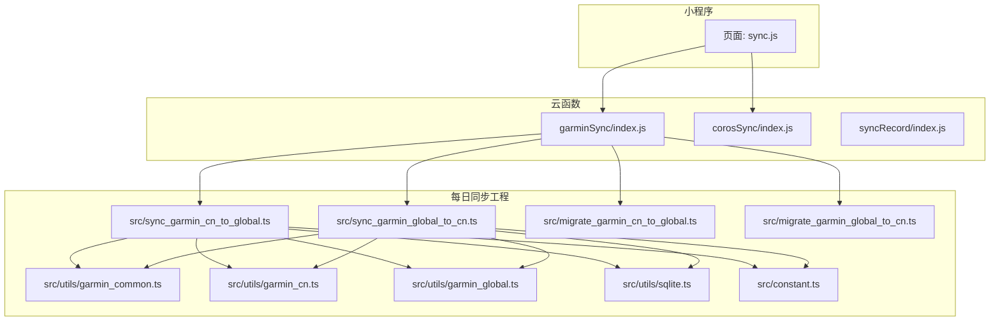
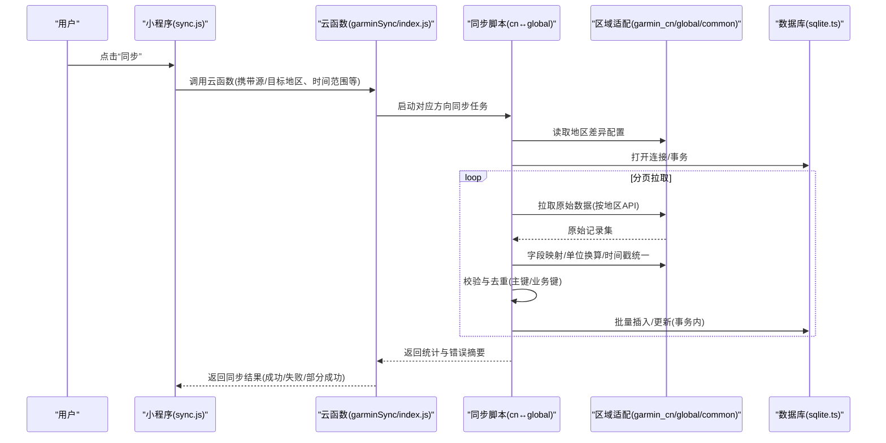
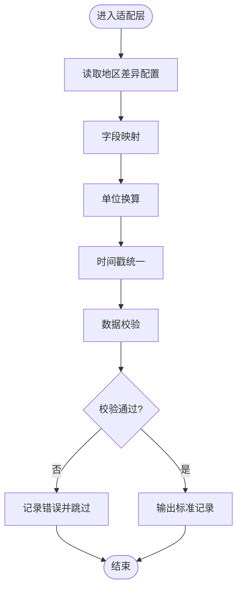
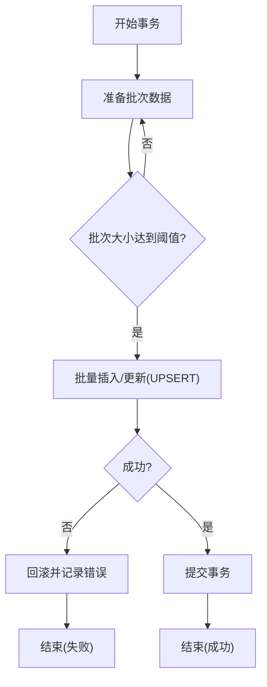
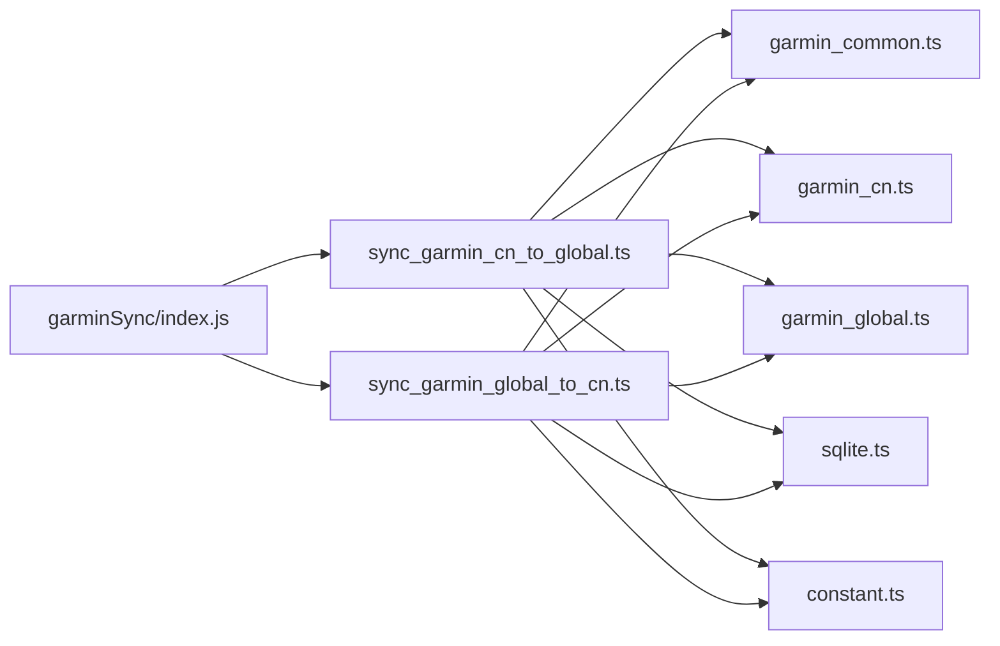

# 数据同步机制

<cite>
**本文引用的文件**   
- [README.md](file://README.md)
- [package.json](file://dailysync-ref/package.json)
- [sync_garmin_cn_to_global.ts](file://dailysync-ref/src/sync_garmin_cn_to_global.ts)
- [sync_garmin_global_to_cn.ts](file://dailysync-ref/src/sync_garmin_global_to_cn.ts)
- [migrate_garmin_cn_to_global.ts](file://dailysync-ref/src/migrate_garmin_cn_to_global.ts)
- [migrate_garmin_global_to_cn.ts](file://dailysync-ref/src/migrate_garmin_global_to_cn.ts)
- [garmin_common.ts](file://dailysync-ref/src/utils/garmin_common.ts)
- [garmin_cn.ts](file://dailysync-ref/src/utils/garmin_cn.ts)
- [garmin_global.ts](file://dailysync-ref/src/utils/garmin_global.ts)
- [sqlite.ts](file://dailysync-ref/src/utils/sqlite.ts)
- [constant.ts](file://dailysync-ref/src/constant.ts)
- [index.js](file://cloudfunctions/garminSync/index.js)
- [config.json](file://cloudfunctions/garminSync/config.json)
- [index.js](file://cloudfunctions/corosSync/index.js)
- [index.js](file://cloudfunctions/syncRecord/index.js)
- [sync.js](file://miniprogram/pages/sync/sync.js)
</cite>

## 目录
1. [简介](#简介)
2. [项目结构](#项目结构)
3. [核心组件](#核心组件)
4. [架构总览](#架构总览)
5. [详细组件分析](#详细组件分析)
6. [依赖关系分析](#依赖关系分析)
7. [性能考虑](#性能考虑)
8. [故障排查指南](#故障排查指南)
9. [结论](#结论)
10. [附录](#附录)

## 简介
本文件面向“Garmin中国版与全球版之间的双向数据同步”实现，系统性阐述触发条件、数据转换规则、冲突解决策略、错误处理机制，以及同步流程各阶段（数据获取、格式转换、验证检查、批量处理、状态更新）的设计与实现要点。文档同时给出优化建议与排障指引，帮助开发者快速定位问题并提升同步稳定性与吞吐。

## 项目结构
本项目由微信小程序端、云函数与独立的每日同步工程组成：
- 微信小程序端：提供用户交互入口，如绑定账号、查看历史、触发同步等。
- 云函数：封装认证、同步任务执行与记录落库等能力，供小程序调用。
- 每日同步工程（dailysync-ref）：基于TypeScript的同步与迁移脚本，负责从Garmin API拉取数据、转换与校验、写入SQLite、生成报表或推送至外部系统。

图表来源
- [sync.js](file://miniprogram/pages/sync/sync.js)
- [index.js](file://cloudfunctions/garminSync/index.js)
- [index.js](file://cloudfunctions/corosSync/index.js)
- [index.js](file://cloudfunctions/syncRecord/index.js)
- [sync_garmin_cn_to_global.ts](file://dailysync-ref/src/sync_garmin_cn_to_global.ts)
- [sync_garmin_global_to_cn.ts](file://dailysync-ref/src/sync_garmin_global_to_cn.ts)
- [migrate_garmin_cn_to_global.ts](file://dailysync-ref/src/migrate_garmin_cn_to_global.ts)
- [migrate_garmin_global_to_cn.ts](file://dailysync-ref/src/migrate_garmin_global_to_cn.ts)
- [garmin_common.ts](file://dailysync-ref/src/utils/garmin_common.ts)
- [garmin_cn.ts](file://dailysync-ref/src/utils/garmin_cn.ts)
- [garmin_global.ts](file://dailysync-ref/src/utils/garmin_global.ts)
- [sqlite.ts](file://dailysync-ref/src/utils/sqlite.ts)
- [constant.ts](file://dailysync-ref/src/constant.ts)

章节来源
- [README.md](file://README.md)
- [package.json](file://dailysync-ref/package.json)

## 核心组件
- 同步编排器
  - 负责调度“中国版→全球版”和“全球版→中国版”的双向同步任务，解析参数、控制并发与重试、汇总结果。
- 区域适配层
  - 中国版与全球版的字段映射、单位换算、时间戳标准化、枚举值归一化。
- 数据访问层
  - SQLite读写、事务与批处理、幂等写入、去重键管理。
- 配置与常量
  - 地区差异常量、阈值、分页大小、超时与重试策略。
- 小程序与云函数桥接
  - 小程序触发同步、展示进度；云函数承载鉴权、调用同步脚本、持久化日志与状态。

章节来源
- [sync_garmin_cn_to_global.ts](file://dailysync-ref/src/sync_garmin_cn_to_global.ts)
- [sync_garmin_global_to_cn.ts](file://dailysync-ref/src/sync_garmin_global_to_cn.ts)
- [garmin_common.ts](file://dailysync-ref/src/utils/garmin_common.ts)
- [garmin_cn.ts](file://dailysync-ref/src/utils/garmin_cn.ts)
- [garmin_global.ts](file://dailysync-ref/src/utils/garmin_global.ts)
- [sqlite.ts](file://dailysync-ref/src/utils/sqlite.ts)
- [constant.ts](file://dailysync-ref/src/constant.ts)
- [index.js](file://cloudfunctions/garminSync/index.js)
- [index.js](file://cloudfunctions/syncRecord/index.js)
- [sync.js](file://miniprogram/pages/sync/sync.js)

## 架构总览
整体采用“小程序触发 → 云函数编排 → 同步脚本执行 → 数据落地”的分层架构。同步脚本内部按“获取→转换→校验→批写→状态更新”流水线处理，确保可观测、可回滚、可重试。

图表来源
- [sync.js](file://miniprogram/pages/sync/sync.js)
- [index.js](file://cloudfunctions/garminSync/index.js)
- [sync_garmin_cn_to_global.ts](file://dailysync-ref/src/sync_garmin_cn_to_global.ts)
- [sync_garmin_global_to_cn.ts](file://dailysync-ref/src/sync_garmin_global_to_cn.ts)
- [garmin_common.ts](file://dailysync-ref/src/utils/garmin_common.ts)
- [garmin_cn.ts](file://dailysync-ref/src/utils/garmin_cn.ts)
- [garmin_global.ts](file://dailysync-ref/src/utils/garmin_global.ts)
- [sqlite.ts](file://dailysync-ref/src/utils/sqlite.ts)

## 详细组件分析

### 同步编排器（双向同步）
- 职责
  - 解析请求参数（源地区、目标地区、时间窗口、是否增量）。
  - 选择对应方向的同步脚本并传入上下文（日志、配额、重试策略）。
  - 聚合执行结果，输出成功/失败计数与错误明细。
- 关键设计
  - 幂等性：通过唯一键（如设备ID+活动ID+开始时间）避免重复写入。
  - 容错：对单个批次失败进行隔离与重试，不影响其他批次。
  - 可观测：记录每个阶段的耗时与指标，便于监控与告警。

章节来源
- [index.js](file://cloudfunctions/garminSync/index.js)
- [sync_garmin_cn_to_global.ts](file://dailysync-ref/src/sync_garmin_cn_to_global.ts)
- [sync_garmin_global_to_cn.ts](file://dailysync-ref/src/sync_garmin_global_to_cn.ts)

### 区域适配层（中国版/全球版）
- 职责
  - 字段映射：将不同地区的字段名与结构对齐到统一模型。
  - 单位换算：距离、海拔、配速、心率等单位的标准化。
  - 时间戳转换：时区与精度统一（例如毫秒时间戳、UTC偏移）。
  - 枚举归一化：运动类型、强度等级等字典值映射。
- 关键设计
  - 配置驱动：通过常量与映射表集中维护差异，降低硬编码。
  - 可扩展：新增地区只需扩展映射表与转换器。
  - 校验前置：在转换后执行强校验，失败即丢弃并记录原因。

图表来源
- [garmin_common.ts](file://dailysync-ref/src/utils/garmin_common.ts)
- [garmin_cn.ts](file://dailysync-ref/src/utils/garmin_cn.ts)
- [garmin_global.ts](file://dailysync-ref/src/utils/garmin_global.ts)
- [constant.ts](file://dailysync-ref/src/constant.ts)

章节来源
- [garmin_common.ts](file://dailysync-ref/src/utils/garmin_common.ts)
- [garmin_cn.ts](file://dailysync-ref/src/utils/garmin_cn.ts)
- [garmin_global.ts](file://dailysync-ref/src/utils/garmin_global.ts)
- [constant.ts](file://dailysync-ref/src/constant.ts)

### 数据访问层（SQLite）
- 职责
  - 建立连接、事务管理、批处理插入/更新。
  - 去重与幂等：基于唯一键判断是否存在，存在则更新，不存在则插入。
  - 错误恢复：异常时回滚事务，保证一致性。
- 关键设计
  - 批量提交：按固定大小分批写入，减少IO次数。
  - 索引优化：为高频查询与去重键建立索引。
  - 资源释放：确保连接关闭与锁释放。

图表来源
- [sqlite.ts](file://dailysync-ref/src/utils/sqlite.ts)

章节来源
- [sqlite.ts](file://dailysync-ref/src/utils/sqlite.ts)

### 小程序与云函数桥接
- 小程序侧
  - 提供同步入口，收集必要参数（源/目标地区、时间范围），显示进度与结果。
- 云函数侧
  - 鉴权与限流，调用同步脚本，持久化同步记录与日志。
  - 支持异步执行与回调通知。

章节来源
- [sync.js](file://miniprogram/pages/sync/sync.js)
- [index.js](file://cloudfunctions/garminSync/index.js)
- [config.json](file://cloudfunctions/garminSync/config.json)
- [index.js](file://cloudfunctions/syncRecord/index.js)

### 迁移脚本（历史数据迁移）
- 职责
  - 将历史数据从一个地区完整迁移到另一个地区，常用于初始化或修复。
  - 与增量同步逻辑一致，但通常全量扫描并按页处理。
- 关键设计
  - 断点续跑：记录已处理的最大ID或时间戳，支持中断后继续。
  - 幂等：同一批数据多次运行不产生重复。

章节来源
- [migrate_garmin_cn_to_global.ts](file://dailysync-ref/src/migrate_garmin_cn_to_global.ts)
- [migrate_garmin_global_to_cn.ts](file://dailysync-ref/src/migrate_garmin_global_to_cn.ts)

## 依赖关系分析
- 模块耦合
  - 同步脚本依赖区域适配层与数据访问层，低耦合高内聚。
  - 云函数仅作为编排与网关，不直接处理业务细节。
- 外部依赖
  - Garmin API（中国版/全球版）、SQLite、可能的第三方服务（如Google Sheets）。
- 潜在循环依赖
  - 通过分层与接口抽象避免循环引用。

图表来源
- [sync_garmin_cn_to_global.ts](file://dailysync-ref/src/sync_garmin_cn_to_global.ts)
- [sync_garmin_global_to_cn.ts](file://dailysync-ref/src/sync_garmin_global_to_cn.ts)
- [garmin_common.ts](file://dailysync-ref/src/utils/garmin_common.ts)
- [garmin_cn.ts](file://dailysync-ref/src/utils/garmin_cn.ts)
- [garmin_global.ts](file://dailysync-ref/src/utils/garmin_global.ts)
- [sqlite.ts](file://dailysync-ref/src/utils/sqlite.ts)
- [constant.ts](file://dailysync-ref/src/constant.ts)
- [index.js](file://cloudfunctions/garminSync/index.js)

章节来源
- [package.json](file://dailysync-ref/package.json)

## 性能考虑
- 数据获取
  - 合理设置分页大小与并发度，避免触发API限流。
  - 使用缓存减少重复拉取（如未变更的数据）。
- 转换与校验
  - 批量转换，减少对象创建与GC压力。
  - 提前过滤无效数据，降低后续处理成本。
- 写入优化
  - 事务内批量UPSERT，减少锁竞争。
  - 为去重键与查询字段建立合适索引。
- 资源管理
  - 及时释放连接与临时文件，避免内存泄漏。
- 监控与调优
  - 记录关键指标（拉取耗时、转换耗时、写入QPS、失败率）。
  - 根据指标调整批次大小与并发度。

[本节为通用指导，无需特定文件来源]

## 故障排查指南
- 常见问题
  - 认证失败：检查Token有效期与权限范围。
  - 数据缺失：核对时间范围与分页游标，确认上游API返回完整性。
  - 转换错误：检查字段映射表与单位换算系数是否正确。
  - 写入失败：检查事务回滚与唯一键冲突，确认索引与约束。
- 定位方法
  - 查看云函数日志与同步脚本输出，关注错误堆栈与批次信息。
  - 使用SQLite工具检查表结构与索引，验证数据一致性。
  - 对比源与目标数据样例，定位差异字段。
- 恢复策略
  - 针对失败批次重试，必要时回滚整个事务。
  - 启用断点续跑，从上次失败位置继续。

章节来源
- [index.js](file://cloudfunctions/garminSync/index.js)
- [sqlite.ts](file://dailysync-ref/src/utils/sqlite.ts)
- [garmin_common.ts](file://dailysync-ref/src/utils/garmin_common.ts)

## 结论
本方案通过清晰的层次划分与配置驱动的适配层，实现了Garmin中国版与全球版之间的稳定双向同步。借助事务与幂等写入保障数据一致性，结合监控与重试机制提升鲁棒性。建议在上线前完善指标采集与告警，持续优化批次大小与并发度，以应对数据规模增长与API限流变化。

[本节为总结性内容，无需特定文件来源]

## 附录
- 同步触发条件
  - 用户主动触发、定时任务、事件驱动（如新设备绑定）。
- 数据转换规则
  - 字段映射、单位换算、时间戳统一、枚举归一化。
- 冲突解决策略
  - 基于唯一键的UPSERT，优先保留较新版本或指定策略。
- 错误处理机制
  - 局部失败隔离、重试与回滚、错误上报与日志留存。

[本节为概念性说明，无需特定文件来源]